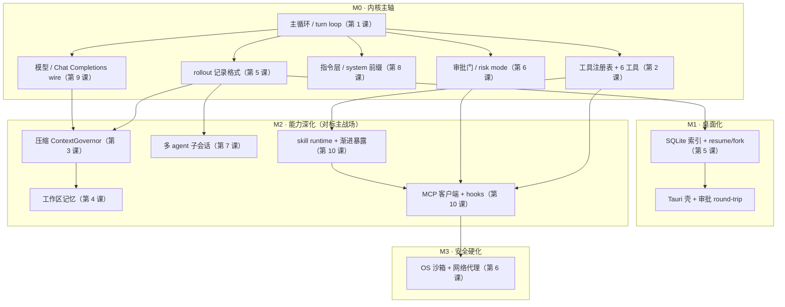

# Agent Runtime 设计课 · 课程地图

这是一门面向 **deepseek 自研 agent runtime** 的设计课。它不讲框架用法，讲的是「一台 agentic coding agent 内部到底由哪些子系统组成、每个子系统真实的控制流与字段、两家成熟实现（claude 的 TypeScript、codex 的 Rust）各自怎么取舍」，最后每一课都**落到 deepseek 该怎么做**——以你们自己的架构宪法（`deepseek/docs/architecture/`）为唯一真相源。

读者预设是 deepseek 的 harness 架构师 / PM：要能据此拍板「先建什么、哪条规则全局钉死、哪个旋钮 M0 就得拧死」。

---

## 怎么读这门课：由外而内，先行为后机制

这门课**不是按「谁最底层」排的，是按「先看一台 agent 怎么想、怎么动，再回头拆它脚下的基质」排的**。

具体说：前七课把两样东西**当黑箱**用——送进模型的 prompt 到底怎么装、模型 / API 这条 wire 到底怎么走——先把「一个 agent 如何循环、用工具、管上下文、记忆、落盘、受审批、扩成多个」整条行为讲透。第 8、9 课才把这个黑箱拆开。这样安排是**故意**的：理解「agent 怎么行动」并不需要先懂 wire 的字节细节；但等你已经见过整条行为，再回头看「原来 prompt 是这么一层层拼的、reasoning 字段为什么必须配对」，会落得更实。

所以如果你走到第 8、9 课觉得「这俩这么基础，怎么排这么晚」——那是对的感觉，也是有意为之：**阅读序 ≠ 装配序**。

- **阅读序**（下面这张表）为「学得顺」优化：由外而内。
- **装配序**（再下面那张 DAG）为「依赖不倒」优化：真要动手建 deepseek，先建的恰恰是 prompt 装配和模型 wire 这两块 M0 地基。

这两条序为什么会打架、又怎么收口，第 12 课（capstone）专门讲。

---

## 阅读序：五组十二课

| 组 | 课 | 一句话 |
|---|---|---|
| **一 · 会动的一个 agent** | 1 主循环 | 一轮 turn 怎么转（收输入 → 调模型 → 跑工具 → 回灌 → 再来）；三道硬闸：max_turns / max_tool_calls / token_budget |
| | 2 工具系统 | agent 的动作面：工具注册表、调用协议、`tool_call` / `tool_result` 配对 |
| **二 · 管住它的上下文与状态** | 3 上下文工程与压缩 | 窗口要爆怎么办：压缩触发点、改写 vs 精细删除、别炸缓存前缀 |
| | 4 记忆系统 | 跨会话记住东西：工作区记忆，以及写入污染 / 递归的坑 |
| | 5 持久化、回放与回滚 | 会话怎么落盘、崩溃怎么恢复、怎么回到三步前重来：rollout、state DB、git baseline |
| **三 · 上安全、扩到多个** | 6 权限、审批与沙箱 | 敢让 agent 自动动手的前提：approval 门 + OS 沙箱两道正交闸，deny 优先 |
| | 7 多 agent 编排与子 agent | 从一个 agent 扩到多个：上下文隔离、只回结论、按需 fan-out |
| **四 · 拆开一直当黑箱的基质** | 8 Prompt 与指令架构 | 黑箱第一样：prompt 到底装什么——系统前缀、项目指令、skill 渐进披露、注入纪律 |
| | 9 模型 / API 层 | 黑箱第二样：Chat Completions wire、reasoning 配对、缓存计费、429 退避 |
| **五 · 产品化、优化、总装** | 10 可扩展性 | 别人不改源码怎么往 agent 里加东西：MCP 客户端、skill / 命令、hooks、渐进式工具暴露 |
| | 11 优化方法论 | 从 codex 一年多真实优化提交里提炼的纪律：先量后调，别拍脑袋 |
| | 12 capstone | 把前十一个子系统装成一台 agent：装配顺序、横切不变量、早决定贵反悔的旋钮 |

每课配一份[习题](exercises/)（`热身 / 推演 / 量化 / 破 / 故障排查 / 效果优化 / 架构设计 / 收口` 八层），逼你以 deepseek harness 架构师的身份现场把机制拼起来用，而不是复述课文。

---

## 装配序：如果你要把它建出来

真把 deepseek 建出来，顺序就不能照上面读——得照**依赖**。下面这张依赖图（DAG：节点是子系统，箭头是「A 依赖 B」）是第 12 课的主线，提到这里先给你一个全局：注意 prompt（第 8 课）和模型 wire（第 9 课）虽然**读到最后**，建的时候却在 **M0 最底层、最先建**——这正是「阅读序 ≠ 装配序」的样子。

> 第 11 课（优化）不在图上——它不是一个子系统，是一条横切所有子系统的纪律。

读完 1–11 再看第 12 课，就是把每课那个「deepseek 落地结论」对着这张图装到一起，看会冒出什么单看一课永远看不见的东西（装配顺序、横切不变量、早决定贵反悔的旋钮）。

---

## 每课的讲法（method）

- **双实现对照**：每个机制先看 claude（TypeScript）和 codex（Rust）各自怎么做、为什么不同，再落到 deepseek 该抄哪家、该自写哪块。部分课还带 opencode 作第三参照。
- **落到宪法**：每课结尾给 deepseek 一个可执行结论，并对齐你们的架构宪法（parity-first，唯一真相源）。凡课文与宪法不一致，以宪法为准。
- **源码锚点**：正文不塞 `路径:行号`，读起来连贯；每个小节末尾用「源码锚点」/「依据」行集中给可核验的出处（源码路径或宪法条款 `§X.Y`）。自创的词一出现就当场说清它指什么。

从第 1 课开始读即可；急着想看「全部装到一起长什么样」，可以先翻第 12 课的依赖图建立全局，再回头逐课。
