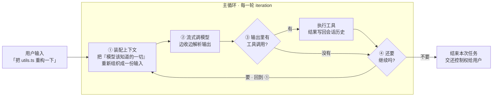
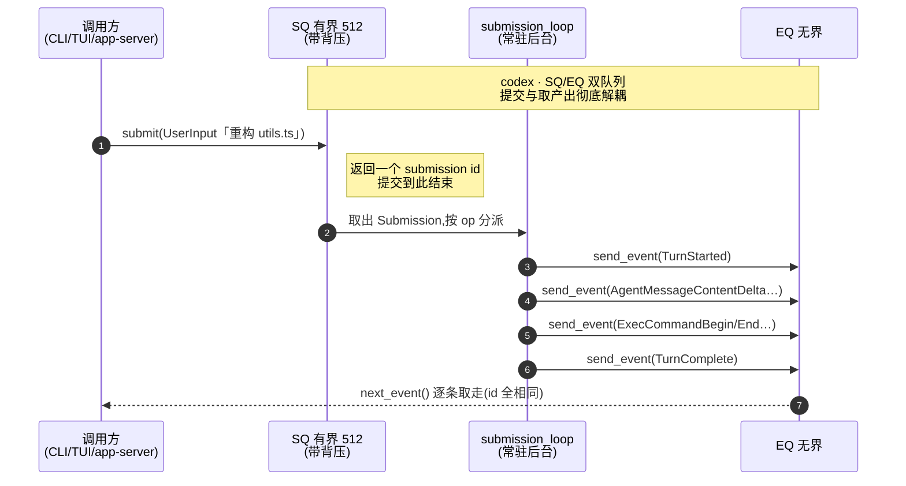
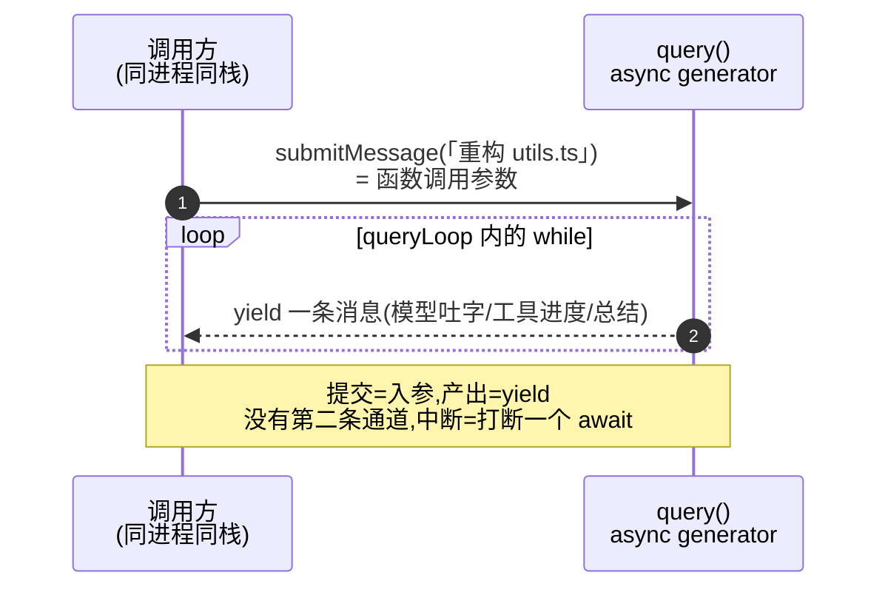
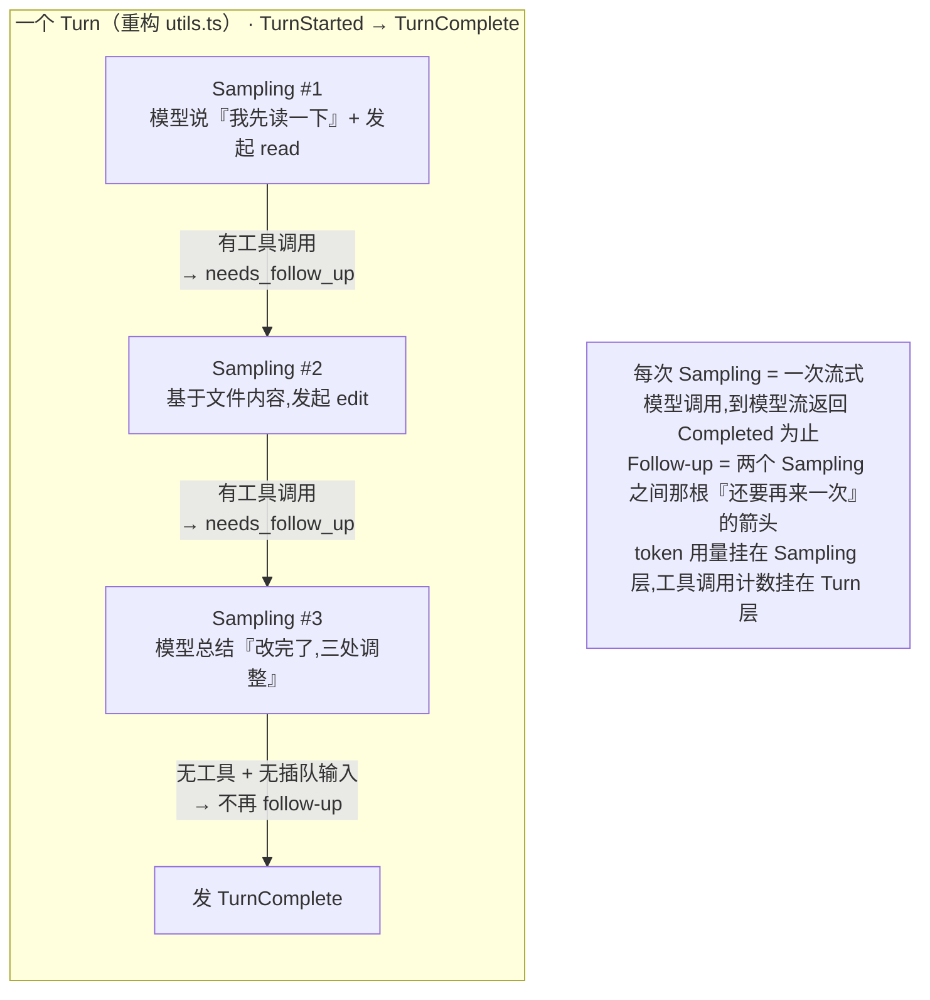
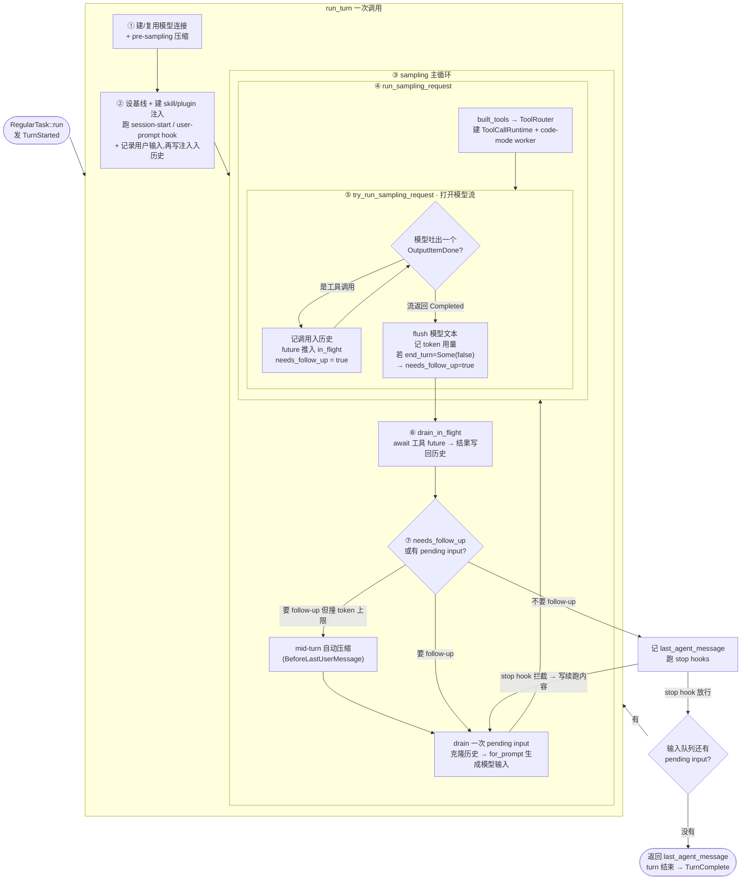
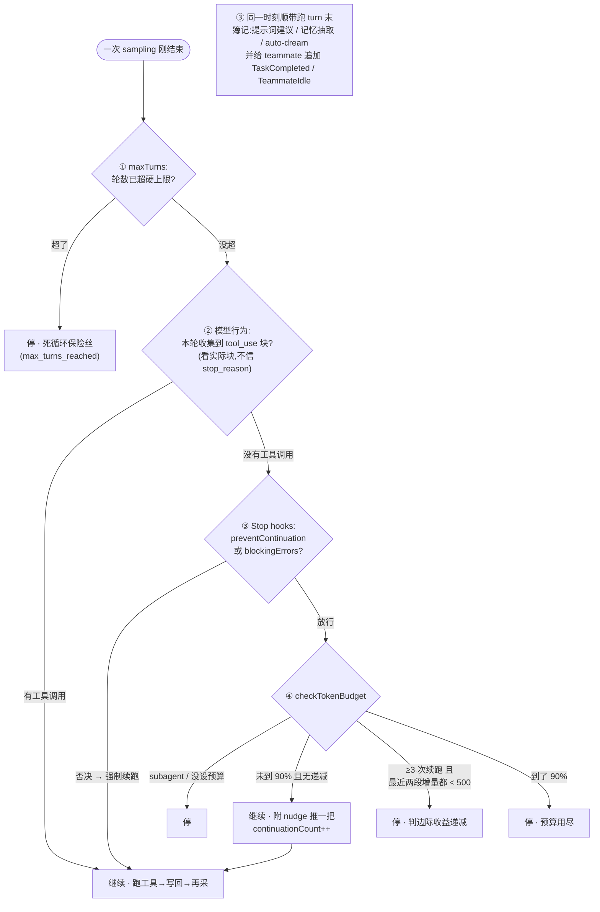
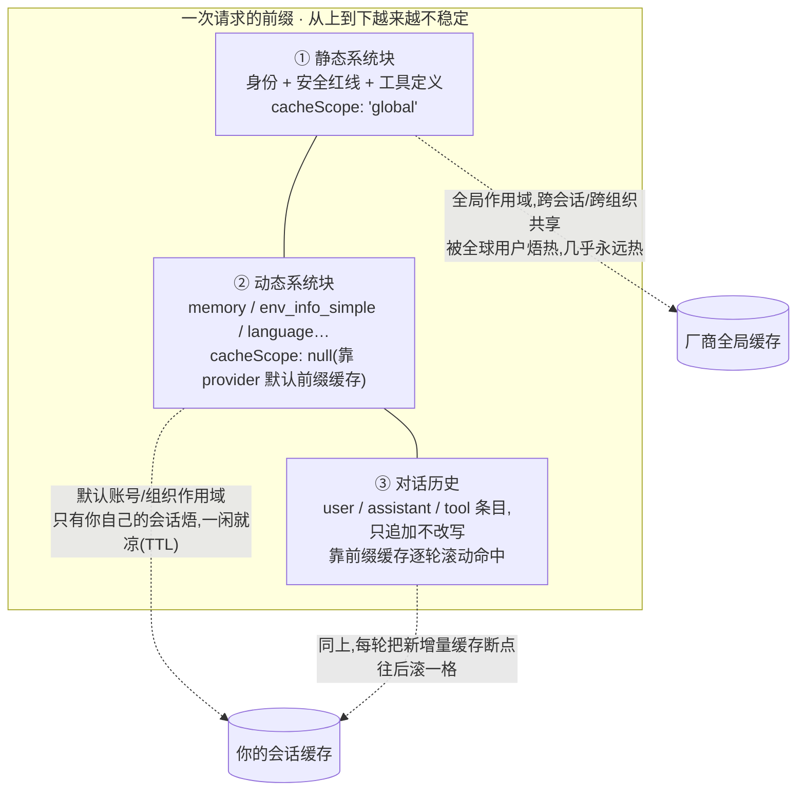
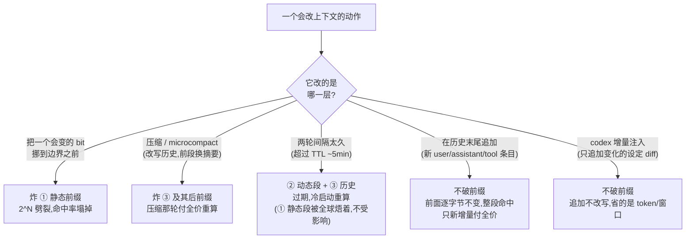
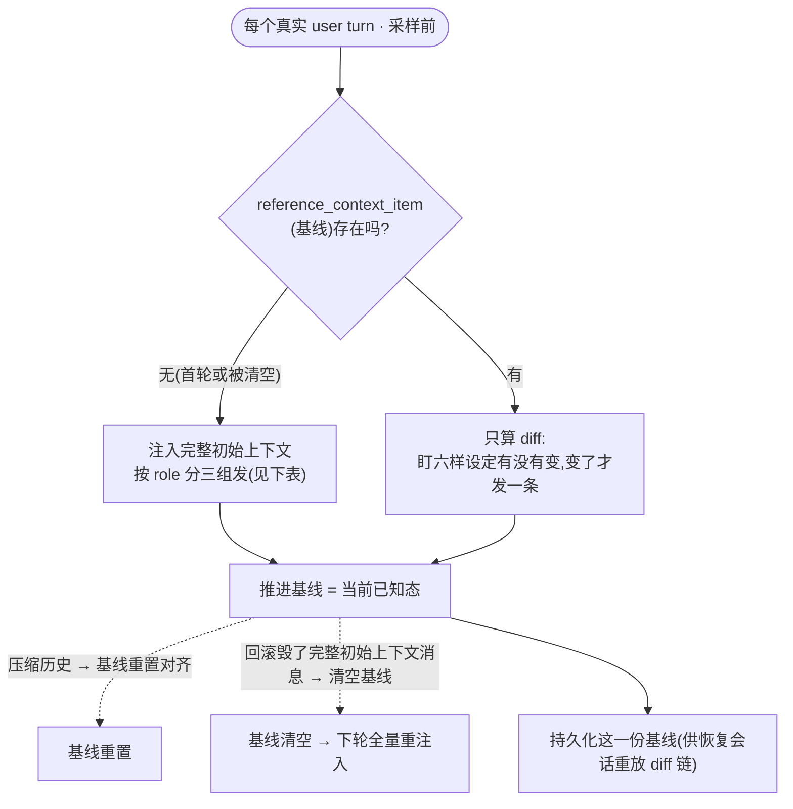
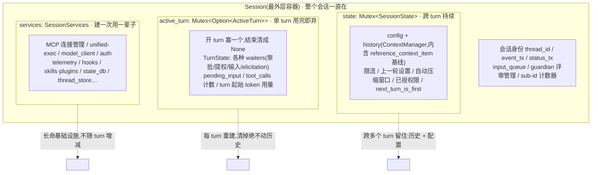

# 第 1 课：Agent 主循环

> 面向 deepseek 自研的 agent runtime 设计课。基于 claude / codex 真实源码。
> 讲法：直接讲清每个设计决策的代码逻辑与取舍，claude 与 codex 双实现对照，每节给出 deepseek 的落地结论。

---

## 0. agent runtime 是什么

一个 agent runtime 的核心是一个循环。每一轮（iteration）做四件事：

1. 从会话历史里，装配出这一轮要发给模型的输入（prompt）；
2. 流式调用模型，边收边解析它的输出；
3. 如果模型输出里包含工具调用，执行这些工具，把结果写回会话历史；
4. 判断这一轮之后是否还要继续：要继续就回到第 1 步，不继续就结束本次任务，把控制权交还给用户。

模型本身是无状态的——它在两次调用之间不记得任何东西。runtime 每次调用模型，都要把"模型该知道的一切"重新组织成一份输入发过去。所以一个 agent 的强弱，几乎不取决于"用了什么模型"，而取决于这台 runtime 在这四步里的工程质量：输入怎么组织、工具怎么调度、什么时候停、状态放在哪、出错怎么恢复。

下面五个决策，就是这台 runtime 最核心的五处设计。每一处 claude 和 codex 的做法都不同，差异本身就是你要学的东西。

claude 的循环实现：`query()` 是一个 async generator，内部 `queryLoop()` 是一个 `while` 循环，每轮 yield 出本轮产生的消息，外层用 `for await` 消费。
codex 的循环实现：`RegularTask::run` 是一个任务，内部反复调用 `run_turn`；`run_turn` 内部又有一个 sampling 循环。两层循环的职责后面会拆开讲。

### 一个贯穿全课的例子

抽象的循环讲多了容易飘，所以先约定一个具体场景，后面每个决策都拿它走一遍：

> **用户在一个 TypeScript 项目里敲下一句话：「把 `utils.ts` 重构一下」。** 这一句话会触发 agent 调好几次模型、跑好几个工具（读文件、改文件），最后回一段总结。

这一句普通输入，会在五个决策里分别变成：一条进队列的指令（决策一）、一个内含多次采样的 turn（决策二）、一连串「要不要再跑一轮」的判定（决策三）、每一轮重新装配出来的模型输入（决策四）、以及一路被读写的会话状态（决策五）。把这条线记住，下面就不是在读五段孤立的机制，而是在看同一句话怎么穿过整台机器。

下图先把这台机器的四步主循环和这条例子摆在一起，作为全课的总览：



这四步对应五个决策的落点：① 是决策四（上下文装配），② 走决策一定义的消息通道，③④ 是决策二（执行模型）和决策三（终止判定），贯穿全程的读写状态是决策五。

〔源码锚点：claude `query()` async generator + 内层 `queryLoop()` 的 `while (true)` 主循环、`for await` 消费 = `query.ts:219 / 241 / 307`，QueryEngine 驱动消费 `QueryEngine.ts:675`；codex `RegularTask::run` 外层循环 + `run_turn` 内层 sampling 循环 = `core/src/tasks/regular.rs:36`、`core/src/session/turn.rs:140 / 207`。〕

---

## 决策一：runtime 的消息架构 —— generator 直驱 vs SQ/EQ 双队列

### 问题

调用方（UI、CLI、SDK）怎么把"做这件事"的指令送进 runtime?runtime 怎么把产出（模型说的话、工具进度、token 用量、结束信号）送回调用方？这两条通道怎么设计，决定了整个系统能不能多前端、能不能中途打断、能不能存盘恢复。

### claude 的设计：async generator 直驱

claude 的 runtime 入口是 `query()`，它是一个 async generator。调用方用 `for await (const message of query({...}))` 直接消费它产出的消息流。一次会话由一个 `QueryEngine` 对象承载，调用 `submitMessage()` 提交一条用户输入就启动一个新 turn，期间 `query()` 内部的 `while` 循环一轮轮跑、一条条 yield。

这种设计里，"指令进入"就是函数调用参数，"产出返回"就是 generator 的 yield。调用方和 runtime 在同一个进程、同一条调用栈上，耦合很紧。`query()` 之外还包着一层进程生命周期：启动壳 `cli.tsx` 用动态 import 把 `--version` 这类快路径做得极快，主路径才依次构造权限上下文、工具池，再进入 REPL（交互）或 headless（非交互）。也就是说，主循环只是这条生命周期的最内层；启动、权限、工具池构造都在循环外面先完成。

放到那条贯穿例子上：调用方把「把 utils.ts 重构一下」作为 `submitMessage()` 的参数传进去，然后就站在 `for await` 上等着——模型吐的字、工具的进度、最后那句总结，全是这同一个 generator 一条条 yield 出来的。调用方和 runtime 之间没有第二条通道，就是这一个函数调用。

### codex 的设计：Submission Queue / Event Queue 双队列

codex 把 runtime 做成了一个消息驱动的服务。所有"要 runtime 做的事"都建模成一个 `Submission` 结构，通过 **Submission Queue(SQ)** 这条 channel 送进 core;runtime 的所有产出都建模成一个 `Event` 结构，通过 **Event Queue(EQ)** 这条 channel 流回调用方。

`Submission` 有四个字段：
- `id`：关联 id（一个 UUID v7 字符串），后续所有由这次请求产生的 Event 都带同一个 id，用来对应；
- `op`：一个 `Op` 枚举，描述要做什么。这个枚举是 `#[non_exhaustive]` 的、有二十多个变体，下面只举普通会话最常碰到的几个：`UserInput`（用户输入，这是普通一轮对话的入口）、`ThreadSettings`（改会话设置，比如切模型）、`InterAgentCommunication`（agent 间通信）、`Compact`（压缩历史）、`Review`（代码评审）、`Shutdown`（关机）。另外像 `Interrupt`（中断）、`ExecApproval`/`PatchApproval`（审批应答）、`ThreadRollback`（回滚）也都在这个枚举里——记住「凡是要 runtime 做的事都是一个 Op」，别把它当成只有这六个；
- `client_user_message_id`：客户端侧的消息 id;
- `trace`：一个 W3C 分布式追踪的 carrier，用来把一次请求的全链路串起来，它不是发给模型的内容，只在 runtime 内部做链路追踪。

`Event` 有两个字段：`id`（和发起它的 Submission 对应）和 `msg`（一个 `EventMsg` 枚举，涵盖模型输出、工具开始/结束、token 用量、turn 完成、各类警告和实时事件）。

具象一下它们长什么样（字段名忠于源码，值做了简化）：

```
// 你 submit 进 SQ 的一条 Submission —— "用户说了句话"
Submission {
  id: "01940a3c-…-7f",                 // UUID v7,这条请求的关联 id
  op: UserInput {
    items: [ { type: "text", text: "把 utils.ts 重构一下" } ],
    additional_context: null,
    thread_settings: { model: "deepseek-v4-pro" },   // 仅当非默认时才带
  },
  client_user_message_id: "msg_88",
  trace: "00-<trace_id>-<span_id>-01",  // W3C traceparent,只内部追踪用,不发给模型
}

// 之后从 EQ 陆续 next_event() 取到的一串 Event,id 全等于上面那条 Submission 的 id:
Event { id: "01940a3c-…", msg: TurnStarted }
Event { id: "01940a3c-…", msg: AgentMessageContentDelta { text: "我先读一下文件" } }   // 模型流式吐字
Event { id: "01940a3c-…", msg: ExecCommandBegin { call_id: "c1", cmd: "cat utils.ts" } }
Event { id: "01940a3c-…", msg: ExecCommandEnd  { call_id: "c1", exit_code: 0 } }
Event { id: "01940a3c-…", msg: AgentMessageContentDelta { text: "改完了,我做了三处调整…" } }
Event { id: "01940a3c-…", msg: TokenCount { input: 12030, output: 420 } }
Event { id: "01940a3c-…", msg: TurnComplete }
```

看这串就能把前面几条都串起来：一条 Submission 进去 → 一串带同一个 id 的 Event 出来，`TurnStarted`…`TurnComplete` 把这一轮括起来，中间夹着模型吐字（delta）、工具的 begin/end、token 统计。

两个名字上的坑顺手点破，免得你回源码时对不上：① 模型流式吐字的事件变体在 core 里叫 `AgentMessageContentDelta`（`AgentMessageDelta` 是 app-server 那一层给 TUI 用的另一个名字，core 的 `EventMsg` 里没有这个变体）；② `TurnStarted` / `TurnComplete` 是 Rust 变体名，但它们序列化到 wire 上仍沿用 v1 的旧名 `task_started` / `task_complete`（`turn_started` / `turn_complete` 只是兼容 alias）。Rust 端读 turn、JSON 端读 task，是同一个东西。

数据流是这样串起来的：调用方持有一个 `CodexThread`，它只是个双向管道，`submit`/`next_event` 都转发给底层的 `Codex` handle。`Codex::spawn` 时创建了 SQ 和 EQ 两条 channel，并用 `tokio::spawn` 起了一个常驻后台循环 `submission_loop`。`submit` 时，`Codex` 生成一个 UUID v7 的 submission id、补上 trace，把 `Submission` 推进 SQ；`submission_loop` 不断从 SQ 取 `Submission`，按 `op` 类型分派到对应 handler（`UserInput` 走 turn 逻辑，`Compact` 走压缩，`Shutdown` 返回退出……）；产出则由 `Session::send_event` 包成 `Event` 推进 EQ，调用方用 `next_event` 取走。

下面这张时序图把两种消息架构并排画出来：上半是 codex 的 SQ/EQ（提交和取产出是两个解耦的动作，中间隔着一个常驻后台循环），下半是 claude 的 generator（提交就是函数调用、产出就是 yield，焊在同一条栈上）。看清这个对比，决策一的取舍就一目了然：





这里有几个关键设计决定，值得逐条记：

1. **SQ 是有界的（容量常量 512），EQ 是无界的。** 这是有意的非对称：输入要能背压——当 runtime 处理不过来时，继续 `submit` 会阻塞，从而防止指令无限堆积压垮 core；而输出永远不能阻塞，否则正在执行的 turn 会卡死，所以 EQ 不设上限。
2. **`submit` 只返回一个 submission id，真正的结果要从 EQ 另取。** 提交和获取产出是彻底解耦的两个动作。
3. **同一个 submission id 贯穿一次请求的所有产出**（普通 user turn 下，Event 的 id 来自 turn context 的 sub_id，而 turn context 又是用 submission id 建的，所以二者对齐）。这让"哪条产出属于哪次请求"始终可追溯。
4. **`UserInput` 不一定新开一轮。** `submission_loop` 收到 `UserInput` 时，先尝试 `steer_input`：如果当前已经有一个 turn 正在跑（active turn），这条输入会被注入到正在进行的 turn 里；只有当前没有 active turn 时，才真正 spawn 一个新任务。这就是"中途插话"在协议层的落地。

### 取舍

generator 直驱实现简单、延迟低，但调用方和 runtime 焊死在一个进程一条栈上，只能服务单一前端，中断要靠打断一个正在 await 的异步迭代，远程化也困难。

SQ/EQ 多了两条 channel 和一套 Op/Event 协议，但换来四样东西：
- **多前端**:CLI、TUI、`codex exec`（批处理）、app-server（给桌面/IDE 的 JSON-RPC 服务）、MCP server，全都只是"往 SQ 放 Op、从 EQ 读 Event"的不同客户端，core 不知道前端是谁，甚至可以跑在另一个进程或另一台机器；
- **中途插话（steering）**：再 `submit` 一个 `UserInput` 即可注入正在跑的 turn;
- **中断**：`submit` 一个中断类 Op，而不是 kill 一个 generator;
- **录制/回放**:Op 和 Event 都可序列化，天然能落盘、能远程传、能确定性回放。

### deepseek 落地

deepseek 是桌面 GUI 应用，从第一天就面对"UI 进程 ↔ agent core 解耦""用户要能中途打断""会话要能存盘恢复"这三件事，这正是 SQ/EQ 解决的问题。结论：**core 只认 Op/Event 协议，UI 是协议的一个客户端**——这一条架构宪法写成了灵魂条款（「内核是『Op 进 / Event 出』的服务，Desktop/CLI/未来 IDE 都只是协议客户端」）。指令入口队列做成有界（带背压），产出队列无界——注意这一条「有界/无界」是 codex 的实现取舍、可直接照搬，但宪法本身没有把队列容量写成契约，别把它当宪法条款引。claude 的 generator 之所以够用，是因为它本质是单一前端的 CLI/TUI，远程能力是后长出来的；你的起点更接近 codex，这一处学 codex。

〔源码锚点：codex `Submission`/`Event` 结构（各 4 字段 / 2 字段，`trace: Option<W3cTraceContext>`）= `protocol/src/protocol.rs:150 / 1205`；`Op` 枚举 `#[non_exhaustive]` 二十余变体 = `protocol/src/protocol.rs:505-654`；`EventMsg::AgentMessageContentDelta`（非 `AgentMessageDelta`）= `protocol/src/protocol.rs:1387`；`TurnStarted`/`TurnComplete` 序列化为 wire `task_started`/`task_complete` = `protocol/src/protocol.rs:1257-1268`；`CodexThread` 转发 / `Codex::spawn` 建 SQ+EQ + `tokio::spawn(submission_loop)` / `submit` 生成 UUID v7 / `next_event` = `core/src/codex_thread.rs:155,189,400`、`core/src/session/mod.rs:466,490,522-523,694,703,767`；SQ 容量常量 `SUBMISSION_CHANNEL_CAPACITY = 512`、EQ `async_channel::unbounded()` = `core/src/session/mod.rs:460,522-523`；`submit` 返回 `CodexResult<String>`（只回 id）= `core/src/session/mod.rs:694`；Event.id 取自 `turn_context.sub_id`（= submission id）= `core/src/session/mod.rs:1680`、`core/src/session/handlers.rs:207`；`UserInput` 先试 `steer_input` 注入活跃 turn、无活跃 turn 才 `spawn_task` = `core/src/session/handlers.rs:183,220,260`、`core/src/session/mod.rs:3431`。claude `query()`/`QueryEngine`/`submitMessage` = `query.ts:219`、`QueryEngine.ts:184,209`。deepseek 宪法「Op 进/Event 出、UI 是客户端」= `00-CONSTITUTION.md:66,105`；队列容量非宪法条款（codex 实现细节）。〕

---

## 决策二：turn / sampling / follow-up 三层执行模型

### 问题

用户说一句话，agent 可能要调十几次模型、跑几十个工具才算把事做完。这中间"一轮对话""一次模型调用""一次工具批次"是三个不同粒度的概念。把它们分清楚，后面的预算、限流、停止判定才挂得对位置。

### 三个粒度的精确定义（以 codex 为准，它分得最干净）

- **Turn（一轮对话）**：用户视角的一次完整交互，从 `TurnStarted` 事件到 `TurnComplete` 事件。一个 turn 内部会发生多次模型调用。
- **Sampling request（一次采样）**：一次对模型的流式调用，从发起到模型流返回 `Completed`。一个 turn 内有 N 次 sampling。
- **Follow-up（续采）**：一次 sampling 结束后，runtime 判断"还需要再发起一次 sampling 吗"。需要，就在同一个 turn 内继续下一次 sampling。

关键事实：**`TurnComplete` 不是模型 `Completed` 的别名。** 模型返回的 `Completed` 只结束当前这一次 sampling；一个 turn 只有在某次 sampling 之后判定"不再需要 follow-up 且没有待处理输入"时，才发 `TurnComplete`。

这三层是包含关系：一个 turn 套着 N 次 sampling，follow-up 是「一次 sampling 结束后要不要再来一次」的那个判定箭头。拿那条例子走一遍：「重构 utils.ts」是**一个 turn**；模型第一次被调用、说「我先读一下文件」并发起 `read` 工具调用，是**第一次 sampling**；工具结果写回后模型得再被调一次才能基于文件内容动手，于是有了**一次 follow-up → 第二次 sampling**（发起 `edit`）；改完再调一次模型让它总结，是**第三次 sampling**，这次模型不再要工具、也没有插队输入，于是 `TurnComplete`。一个 turn、三次 sampling、两次 follow-up。画出来是这样：



### codex 的执行逻辑（run_turn 内部）

`RegularTask::run` 是外层：发一个 `TurnStarted`，然后循环调用 `run_turn`；`run_turn` 返回后，如果会话的输入队列里没有 pending input，就把模型的最后一段话作为 `last_agent_message` 返回、本 turn 结束；如果还有 pending input，就清掉这一轮的显式输入、继续下一次 `run_turn`。

`run_turn` 一次调用内部，按顺序做这些事：

1. **建立或复用本 turn 的模型会话连接**，然后先跑一次 **pre-sampling 压缩**(`run_pre_sampling_compact`)——在采样之前先看历史要不要压（下面决策四细讲）；压缩失败会发一个 turn 错误事件并提前返回。
2. **算出本轮该注入的环境/设置 diff 并设好基线**(`record_context_updates_and_set_reference_context_item`)，**构建 skill/plugin 注入**,**先跑 session-start hook、再跑 user-prompt hook 并记录用户输入**，最后**把这些注入项写入会话历史**。注意这里的实际顺序：hook 与「记录用户输入」发生在「把 skill/plugin 注入项写进历史」**之前**，不是先写注入再跑 hook——细到这一步是因为 hook 可能要看到刚记录的用户输入。
3. **进入 sampling 主循环**：在允许时先 drain 一次 pending input（把插队进来的输入并进来），然后克隆一份会话历史、调用 `for_prompt` 生成这一次要发给模型的输入（`for_prompt` 会做归一化和按模型能力过滤，见决策四）。
4. **`run_sampling_request`**：构建本次可见的工具集（`built_tools` 产出一个 `ToolRouter`）、读取 base instructions、创建工具调用运行时 `ToolCallRuntime`、启动 code-mode worker；然后进入一个 retry loop 调用 `try_run_sampling_request`。retry loop 里，context-window 超限和 usage-limit 这两类错误被特殊处理，其余可重试错误走统一的 stream retry。
5. **`try_run_sampling_request`** 打开模型流。它维护一组流内局部状态，其中最关键的是 `in_flight`——一个 `FuturesOrdered`，即"按顺序保存正在并行执行的工具 future"的容器，以及 `needs_follow_up`（是否需要续采）、`last_agent_message`（模型最后一段话）。
   - 模型每吐出一个完成的输出项（`OutputItemDone`），调用 `handle_output_item_done`：如果这个输出项是一次工具调用，就先把"模型发出的这次调用"记进历史，再创建对应的工具执行 future 推入 `in_flight`，并把 `needs_follow_up` 置真（因为工具结果要写回历史后，模型得基于结果再想一轮）；
   - 模型流返回 `Completed` 时，flush 出模型这次说的完整文本、记录本次 sampling 的 token 用量、设置 turn diff / token 标志位。注意：即便没有工具调用，只要模型在 `Completed` 里把 `end_turn` 标成 `Some(false)`，`needs_follow_up` 仍会被置真。
6. **`drain_in_flight`**：把 `in_flight` 里的工具 future 逐个 await 出结果，转成会话历史项写回历史。
7. **本次 sampling 结束后**，`run_turn` 把"模型要的 follow-up"和"pending input"合并：如果需要 follow-up 但此刻已经撞到 token 上限，就先做一次 **mid-turn 自动压缩**（以 `BeforeLastUserMessage` 为切点），再继续循环；如果不需要 follow-up，就记录 `last_agent_message`、跑 stop hooks,stop hook 若拦截，可把续跑内容写回历史再继续。

把这七步画成控制流，注意三层嵌套：最外是 `RegularTask::run` 的 turn 循环，中间是 `run_turn` 的 sampling 主循环，最内是 `try_run_sampling_request` 打开模型流后逐个处理输出项的流内循环。`needs_follow_up` 是把「再来一次 sampling」和「结束 turn」分开的那个开关：



### 工具在一次 sampling 里是并行执行的

一次 sampling 可能产生多个工具调用，它们是并发跑的，但有一道并发闸：`ToolCallRuntime` 持有一把 `RwLock`。每个工具按自己声明的 `supports_parallel_tool_calls` 决定取哪种锁——**支持并行的工具取读锁（可与其它读锁并发），不支持并行的工具取写锁（独占，挡住所有其它工具）**。这样并发互斥统一在运行时这一层处理，各个工具 handler 自己不用写并发控制。另外，模型能不能在一次回复里同时发多个工具调用，由 `parallel_tool_calls` 这个请求参数控制，它取自模型信息里的 `supports_parallel_tool_calls`。每次 dispatch 一个工具，会给当前 turn 的"工具调用计数"加一。

### claude 的对应实现

claude 的 `queryLoop` 不区分这么多命名，但行为同构：每轮准备 `messagesForQuery` → 调模型流 → 在流式过程中收集 assistant 消息和 `tool_use` 块 → 执行工具（开了 streaming executor 就边流边执行，否则流结束后批量 `runTools`）→ 把结果规范化进 `toolResults` → 判断是否有工具 follow-up 决定下一轮。它同样不信任单一的 `stop_reason` 字段，而是用"这一轮实际收集到的 tool_use 块"来决定要不要继续。

### 为什么必须分清三层：预算挂在不同层级

- 一次 sampling 花了多少 token —— 挂在 **sampling 层**（codex 在 `Completed` 时记 token usage）；
- 一个 turn 最多让模型来回几次、调了几个工具 —— 挂在 **turn 层**（codex 的 turn 状态里有工具调用计数；claude 有 `maxTurns`）；
- 整个会话累计花了多少 —— 挂在 **session 层**。

混在一起，预算控制和停止逻辑就会到处错位。

### deepseek 落地

在协议和数据模型里显式区分这三层：turn 生命周期事件（开始/结束）、sampling 结果（token 用量挂这）、工具调用（计数挂 turn）。预算用三个独立计数器：每次 sampling 的 token、每 turn 的轮数/工具上限、整个 session 的累计成本。工具并发互斥统一放在一个运行时层用读写锁实现，工具 handler 只声明"我支不支持并行"，不要让每个工具自己写锁。

〔源码锚点：turn=`TurnStarted`→`TurnComplete`（`core/src/tasks/regular.rs:49`、`core/src/tasks/mod.rs:745`），sampling 到 `ResponseEvent::Completed` 为止（`core/src/session/turn.rs:2165`），follow-up 判定 `needs_follow_up = model_needs_follow_up || has_pending_input`（`turn.rs:266`）；`RegularTask::run` 外层循环 = `regular.rs:36,72-87`；`run_turn` 七步顺序 = `turn.rs:140`（连接/压缩 `:148,154`、设基线 `:162`、建注入 `:165`、session-start hook `:168`、user-prompt hook+记录输入 `:172`、写注入入历史 `:184`、sampling 循环 `:207`、`for_prompt` `:222`、`run_sampling_request` `:1049`、`built_tools→ToolRouter` `:1059,1153`、`ToolCallRuntime` `:1063`、`try_run_sampling_request` `:1860`、`in_flight: FuturesOrdered` `:1899`、`handle_output_item_done` `core/src/stream_events_utils.rs:405`、`Completed`+`end_turn==Some(false)` `:2181`、`drain_in_flight` `:1826,2313`、mid-turn 压缩 `BeforeLastUserMessage` `:305`、stop hooks `:327`）；工具并发 `ToolCallRuntime` 持 `RwLock`、按 `supports_parallel_tool_calls` 取读/写锁 = `core/src/tools/parallel.rs:36,88,115`、`core/src/tools/registry.rs:267`；`parallel_tool_calls` 取自 `model_info.supports_parallel_tool_calls` `turn.rs:1030`，每次 dispatch `tool_calls += 1` = `core/src/tools/registry.rs:437`、`core/src/state/turn.rs:97`。claude `queryLoop` 用收集到的 `tool_use` 块（非 `stop_reason`）决定续跑 = `query.ts:241,554,829-835,1062`，`runTools` = `services/tools/toolOrchestration.ts:19`，`maxTurns` = `query.ts:191,1704`。〕

---

## 决策三：turn 的终止与续跑判定

### 问题

"模型这一轮没调工具就停"是错的。真实系统里，"是否继续"由多个独立来源共同判定，因为要同时防三种失败：模型过早收手（任务没做完就停）、模型空转（反复无意义动作烧 token）、以及用户/规则想强制干预却没有入口。

### claude 的判定来源（共四个）

1. **模型行为**：这一轮模型输出里有没有工具调用。有就继续（跑工具、写回结果、再采）。判定依据是"实际收集到的 tool_use 块"，不是 `stop_reason` 这种单一标签字段——后者不可靠。

2. **Stop hooks（外部否决权）**：模型不再要工具、turn 准备结束的那一刻，跑一组 Stop hooks。hook 返回 `{ blockingErrors, preventContinuation }`：`preventContinuation` 能强制不让结束、`blockingErrors` 能拦截。同一时机还顺带跑 turn 末的背景簿记（提示词建议、记忆抽取、auto-dream），以及给 teammate 追加 TaskCompleted / TeammateIdle 事件。这给了规则和用户一个凌驾于模型自我判断之上的入口（典型用途：交付前必须跑通测试，否则打回续跑）。

3. **Token budget 续跑判定**(`checkTokenBudget`)：在设了预算的模式下，
   - 还没用到预算的 **90%**(`COMPLETION_THRESHOLD`)且没出现收益递减，就返回 `continue`、并附一条 nudge 消息推动模型继续做；
   - 如果已经续跑过 **≥3 次**(`continuationCount >= 3`)、**且最近两次**的产出增量都 **< 500 token**（本次的 `deltaSinceLastCheck` 和上一次记下的 `lastDeltaTokens` 两者都低于 `DIMINISHING_THRESHOLD`——注意它只看最近这两段增量，不是"每一次续跑都 < 500"），判定为边际收益递减、停；
   - subagent（带 `agentId`）或没设预算的情况，直接停，不参与这套续跑。

   这套机制的作用是：用"没到 90% 就推一把"对抗过早收手，用"续跑过 3 次后、最近两轮都没实质产出就停"对抗空转，两个阈值一夹，让 agent 既倾向于把任务做完整、又不会原地打转。

4. **maxTurns（硬上限）**：模型与工具来回的轮数硬天花板，是前面所有判定都失灵时的死循环保险丝。

把这四个来源画成一轮结束时的判定流，从上往下就是优先级——硬上限最先拦（保险丝），然后看模型行为，再让 hook 行使否决权，最后才是预算续跑这套「推一把 / 防空转」的精调：



读这张图记两点：① hook 那一档是「凌驾于模型自我判断之上的入口」——模型说『我不要工具了』，hook 仍能一票把它按回去续跑（典型：测试没过不许收手）；② 预算那一档的「≥3 次续跑且最近两段增量都 < 500」是精确条件，**只看最近这两段**，不是「每一次续跑都 < 500」，这点下面 codex 对照后还会再点。

### codex 的判定逻辑

codex 更精简：`needs_follow_up`（本次 sampling 是否要求续采，来自工具调用或 `end_turn == Some(false)`）与 pending input（输入队列里有没有插队进来的输入）任一为真，turn 就继续；否则结束。token 上限不直接终止 turn，而是"在仍需 follow-up 时触发 mid-turn 压缩后继续"（见决策二第 7 步）。

收尾上还有个老练处理：turn 结束时如果发现还有"插队进来但没被消费的 pending input"，`on_task_finished` 不会把它重新入队，而是把这些未停止的输入记录回会话/rollout 相关路径——保证既不丢、也不会莫名其妙又触发一轮。

### 取舍

claude 把"循环内的勤奋度"调得很细（预算续跑、递减检测、stop hook 续跑），适合追求"活干得漂亮、不偷懒不空转"的产品体验。codex 把判定收敛成 `needs_follow_up + pending input` 两个信号，更克制、更可预测，适合做一个干净的服务底座。

### deepseek 落地

不要把终止写成 `if 没有工具调用 { break }`。至少留三个判定来源：
1. 行为判定：看模型是否真的发起了工具调用（看行为，不信单一标签）；
2. 否决入口：一个 turn 结束前的 hook 点，允许规则或用户强制续跑 / 强制停止（对应"测试不过不许交付""一键中断"）。这个否决入口在宪法里是 hooks 子系统的一部分，成熟度排在 M2、不是 M0 第一天就有，但架构上要先把这个点留出来；
3. 预算判定：宪法定的**三道硬闸**是 `max_turns`、`max_tool_calls`、`token_budget`——即 **turn 轮数 / 工具调用数 / token** 三个层级各设上限（注意第三道不是「成本」：成本在宪法里走 token 分桶路由 + per-task 产品指标，不是一道终止硬闸）。等到要做"让 agent 自动多干一会儿但别空转"时，claude 的"没到 90% 推一把、连续 3 次续跑后最近两段都 <500 token 判空转"是可直接照搬的配方。

〔源码锚点：claude 四来源 — 模型行为看 `tool_use` 块非 `stop_reason` = `query.ts:554,829-835,1062`；Stop hooks `{ blockingErrors, preventContinuation }` + turn 末簿记（`executePromptSuggestion`/`executeExtractMemories`/`executeAutoDream`）+ teammate `TaskCompleted`/`TeammateIdle` = `query/stopHooks.ts:60-63,139,149,155,352,403`；`checkTokenBudget`（`COMPLETION_THRESHOLD=0.9`、`DIMINISHING_THRESHOLD=500`、`isDiminishing` 仅看最近两段增量、subagent/无预算直接停、命中续跑发 nudge）= `query/tokenBudget.ts:3-4,51,59-64,70`；`maxTurns` 硬上限 = `query.ts:191,1704`。codex `needs_follow_up || has_pending_input` = `core/src/session/turn.rs:256,266`；token 上限触发 mid-turn 压缩而非终止 = `turn.rs:305`；`on_task_finished` 把残留 pending input 记回历史而非重入队 = `core/src/tasks/mod.rs:557,577,601`。deepseek 三道硬闸 `max_turns`/`max_tool_calls`/`token_budget`（C4 MUST，成本走分桶/产品指标非硬闸）= `00-CONSTITUTION.md:123`；停止信号 = `needs_follow_up`、`finish_reason` 须审计但不单独决定（C1）= `00-CONSTITUTION.md:120`；hooks 子系统 M2 = `00-CONSTITUTION.md:307`。〕

---

## 决策四：每一轮的上下文装配

模型无状态，每次调用都要把"它该知道的一切"重新组织成一份输入。这一步的工程质量直接决定 agent 的回答质量和 token 成本。它分两个层面：**system prompt 怎么分层（决定缓存命中）** 和 **会话历史怎么组织（决定正确性和体积）**。

### 前置概念：消息的 role（后面多处都用到）

发给模型的上下文**不是一整段文字，而是一个有顺序的消息列表**，列表里每条消息都贴一个标签，叫 **role（角色）**。常见的 role:

- **system**：最高权威的系统指令（身份、铁律），即本决策 A 节讲的 system prompt;
- **developer**：开发者/产品方下的策略、规则、能力说明，优先级高于普通用户对话；
- **user**：用户说的话，以及代表"用户这边情境"的内容；
- **assistant**：模型自己说过的话；
- **tool**：工具执行的结果。

模型被训练成**对不同 role 的内容给不同的信任级别**。例：同一句"用 TypeScript 写"，放在 developer 里是硬规矩、放在 user 里是这次的偏好、放在 tool 结果里只是一段数据。所以"一条信息放进哪个 role"，本身就是在表达它**有多权威、是什么性质**。下面 A 节的 system prompt(system role)、C2 节 codex 把初始上下文按 role 分组注入，都建立在这个概念上。

一次对话发给模型时，实际就是这样一个有序列表（示意）：

```
[
  { role: "system",    content: "You are an interactive agent…(身份+铁律,即 A 节那一大段)" },
  { role: "developer", content: "权限模式: read-only。可用工具: read, edit, bash…" },
  { role: "user",      content: "把 utils.ts 重构一下" },
  { role: "assistant", content: [ { type: "text", text: "我先读一下" },
                                  { type: "tool_call", id: "c1", name: "read", args: { path: "utils.ts" } } ] },
  { role: "tool",      content: { call_id: "c1", output: "export function …(文件内容)" } },
  { role: "assistant", content: [ { type: "tool_call", id: "c2", name: "edit", args: { … } } ] },
  { role: "tool",      content: { call_id: "c2", output: "edit applied" } },
  { role: "assistant", content: [ { type: "text", text: "改完了,做了三处调整…" } ] },
]
```

看这个列表记住三点：① 整段是**有序列表，不是一坨文本**;② 工具调用（assistant 发起的 `tool_call`）和工具结果（`tool` role 返回、用 `call_id` 配对）都是历史里的普通条目，会一直留着供模型回看；③ 决策四后面讲的"装文件夹""压缩""增量注入"，改的全是这个列表。

### A. system prompt 的分层与缓存（claude 的实现）

claude 的主 system prompt 不是一个常量，而是 `getSystemPrompt()` 每次按"静态段 + 边界标记 + 动态段"拼出来的一个字符串数组，顺序固定：

1. 静态段（对所有用户都一样、可缓存）：身份与安全红线、`# System`、`# Doing tasks`、`# Executing actions with care`、`# Using your tools`、`# Tone and style`、`# Output efficiency`——全是纯函数产出的固定文本；
2. 一个哨兵字符串 `SYSTEM_PROMPT_DYNAMIC_BOUNDARY`（缓存边界标记）；
3. 动态段（跟会话/用户/运行期有关，**会被缓存但不跨会话/组织共享**——注意这是效果，代码并没有给它显式打"会话级"缓存标记，机制详见 A2）：`session_guidance`、`memory`（CLAUDE.md/记忆）、`env_info_simple`（cwd、OS 平台与版本、模型名与确切 model id、knowledge cutoff——注意这一段里**不含当前日期**，日期是另走 `getUserContext` 在用户消息侧注入的，见 C 节）、`language`、`output_style`、`mcp_instructions`、`token_budget` 等。

这个数组实际长这样（示意，真实内容长得多）：

```
[
  // ── 静态段:对所有用户一字不差 → 全局缓存 ──
  "You are an interactive agent…(身份 + 安全红线)",
  "# System …",
  "# Using your tools …",
  "# Tone and style …",

  "__SYSTEM_PROMPT_DYNAMIC_BOUNDARY__",   // ← 缓存边界标记,发请求时在这里切一刀

  // ── 动态段:跟你/这个会话有关 → 每会话缓存 ──
  "# Memory: (你的 CLAUDE.md 内容)…",
  "# Environment: cwd=/app, os=macOS, model=deepseek-v4-pro",   // env_info_simple:无日期
  "# Language: 中文",
]
```

发请求时，API 层找到那个 `__SYSTEM_PROMPT_DYNAMIC_BOUNDARY__` 字符串的位置，在这里切一刀：之前的拼成"静态块"打全局缓存，之后的拼成"动态块"打每会话缓存，边界标记本身被丢掉、不发给模型。前面反复说的"画一条缓存边界线"，字面意思就是——**它真的是数组里的一个字符串**。

**为什么这么排，以及缓存机制怎么工作：**

模型厂商提供 prompt 缓存——如果这次请求的前缀和上次逐字节相同，厂商不重新计算这段前缀，直接复用缓存结果，这部分大约只按原价的 1/10 计费、且更快。但它只认"从头开始连续一致的前缀"：从第一个与上次不同的字节往后，全部按缓存未命中、全价重算。

所以 claude 把所有"对所有用户都一样"的内容放在边界之前（静态段），把所有"会变"的内容放在边界之后（动态段）。发请求时，API 层找到 `SYSTEM_PROMPT_DYNAMIC_BOUNDARY` 的下标，把数组切成边界前的 `staticBlocks` 和边界后的 `dynamicBlocks`，分别打上缓存作用域：静态前缀因为对所有用户一字不差，缓存作用域是全局的（`scope:'global'`），理论上跨组织共享同一份缓存，前提是这段前缀的哈希稳定。

这里有一条决定性的设计纪律：**每把一个"运行期会变的 bit"放到边界之前，静态前缀的可能取值数量就翻一倍（2 的 N 次方）。** 比如把"是不是 fast 模式""用户语言"这种会变的标志放进静态段，N 个这样的 bit 就产生 2^N 种不同前缀，缓存被劈成 2^N 份、命中率塌掉。因此 claude 的纪律是把一切会话/用户/运行期相关的内容无情地推到边界之后，让静态前缀只剩唯一一个版本、全世界共享一份缓存。

边界之后的动态段也不是每轮重算：它们是惰性计算、计算结果记忆化，直到 `/clear` 或 `/compact` 才清空重算。唯一的例外是 `mcp_instructions`，它用一个显式标了"不缓存"的段，因为外部 MCP server 会在会话中途连上/断开，内容不稳定、不能安全缓存。

`buildEffectiveSystemPrompt()` 再在这之上按优先级决定最终发给模型的 prompt:override（如 loop 模式）> coordinator 模式 > agent 自定义 prompt > `--system-prompt` 自定义 > 默认；`--append-system-prompt` 总是追加在末尾。

### A2. 缓存是分层的，以及什么会打破命中

把缓存讲清楚要纠正一个常见误解：动态段不是"不缓存"，而是"会被缓存，但不跨会话/跨组织共享"。不过**代码里到底怎么标的，得讲准**——我核过源码：API 层以 `SYSTEM_PROMPT_DYNAMIC_BOUNDARY` 为界切出 `staticBlocks` 和 `dynamicBlocks` 后，**只给静态块打了一个显式缓存标记**：`cacheScope:'global'`（序列化成 `cache_control: { type:'ephemeral', scope:'global' }`，跨会话、跨组织共享）；**动态块拿到的是 `cacheScope: null`，也就是根本不加任何 `cache_control` 字段。** 所以动态段"会话内还能命中"并不是因为代码显式给它打了个"每会话作用域"的缓存断点，而是依赖 Anthropic API 侧对稳定前缀的**默认自动缓存**（默认作用域是组织/账号级、不是全局）——效果上确实是"缓存了、但只有你自己的会话/账号能复用、不跨组织"，但**机制是 provider 的自动前缀缓存，不是代码设的 per-session scope**。下面凡是说"② 动态块每会话命中"，都是指这个**效果**，不是说代码给它标了个会话级 scope。

于是从缓存视角看，一次请求的前缀是三层，从上到下越来越不稳定。下图把三层、各自的缓存作用域、以及「谁在焐热它」一起标出来：



这张图对应的文字版（速记用）：

```
[ ① 静态系统块 ]   全局缓存,跨会话/跨组织都命中
[ ② 动态系统块 ]   每会话缓存,会话内每轮命中
[ ③ 对话历史   ]   每轮递增,靠"前缀缓存"逐轮滚动命中
```

**会话内，第 2 轮起 ① 和 ② 都命中。** 这里要点破一个直觉陷阱：② 能在会话内命中，**不是因为它在递增，恰恰是因为它不变**——动态段是惰性计算 + 记忆化的，一个会话里只算一次、之后每轮复用同样的字节，直到 `/clear` 或 `/compact` 才清掉重算。字节稳定 + 位置固定 = 可命中。真正"信息递增"的不是动态系统段，而是它后面的第 ③ 层对话历史。

**第 ③ 层才是 prefix 缓存真正发力的地方。** prompt 缓存按前缀逐字节匹配；对话历史虽然每轮变长，但"变长"是在末尾追加，前面的部分逐字节不变。所以第 N 轮请求时，"第 N-1 轮及之前"的历史和上次完全一致、整段命中缓存，只有"上一轮新产生的增量"（模型刚说的话 + 刚跑的工具结果）按全价算一次，然后缓存断点往后滚一格，把含这一轮的新状态缓存起来供第 N+1 轮命中。这就是为什么一个**只追加、不改写**的历史对缓存极友好。

**什么动作会打破前缀命中？** 下面这张判定图把「破/不破」分清楚——关键是「改写历史」和「前缀变了」这两件事，凡触到它们就炸缓存：



**两件事会打破会话内的命中，必须记住：**

1. **压缩会炸缓存。** 压缩（compaction / microcompact）本质是**改写历史**——把前面一大段换成摘要。一旦改写，从改写点往后的前缀全变了，之前缓存的历史前缀作废，压缩后的那一轮要为新的（压缩后）前缀付全价重算。这是压缩的一个隐藏成本，也是为什么不能每轮都压、要挑时机压。
2. **缓存有 TTL。** Anthropic 的 prompt cache 默认存活 5 分钟量级、每次命中续期。所以"会话内命中"还隐含一个前提：两轮之间别隔太久。用户离开半小时再回来发一句，缓存早过期，哪怕同一会话，这一轮也是冷启动、全价重算前缀。（注意：TTL 主要咬的是 ② 动态段和 ③ 历史这两层"每会话作用域"的缓存；① 静态段是另一回事，见下。）

**① 静态段为什么能跨会话、甚至跨组织命中。** TTL 基本咬不到静态段，因为它是全局作用域，有两层共享：

1. **跨你自己的会话**：你上个任务发过的静态前缀，和新任务逐字节一样（身份、安全红线、工具定义，对同一版本、同一机器都不变），新任务第一次调用就命中上次暖好的缓存；
2. **跨组织**：`scope:'global'` 告诉厂商"这段对全世界所有 Claude Code 用户一字不差"，于是别人会话暖好的静态缓存，你的新会话也能命中。

后果很实际：全球海量 Claude Code 会话在持续命中同一份静态前缀，这份全局缓存被整个用户群体一直焐着、基本永远是热的。所以哪怕你昨天跑完、今天才发起新任务（你自己那份早过 TTL），静态段照样命中——命中的是被全球用户焐热的那份，不是你昨天那份。动态段和历史享受不到这层：它们是每会话作用域，只有你自己在焐，一闲就凉。

命中的前提只有一条——**静态前缀逐字节一致**，这要求：同一个 Claude Code 版本（prompt 文案写死在版本里，升级改一个字、前缀就变、旧缓存全失效）、同一个模型、同一个构建变体（`feature()` 的 DCE 让内部 ant 构建和外部构建产出不同 prompt，是两份不同缓存）。

把一次**新会话**的三层命中情况列全：

| 层 | 作用域 | 新会话里 |
|---|---|---|
| ① 静态系统块 | 全局 | **命中**（被全球用户焐热，几乎永远在） |
| ② 动态系统块 | 每会话 | **不命中**，新会话冷启动、重新计算并缓存 |
| ③ 对话历史 | 每会话 | 历史为空，从零开始 |

即：新任务里静态段白嫖全局热缓存直接命中，动态段和历史是这个新会话自己的冷启动。

〔源码锚点：`getSystemPrompt()` 拼「静态段 + 哨兵 + 动态段」数组 = `constants/prompts.ts:444,560-576`，哨兵常量 `SYSTEM_PROMPT_DYNAMIC_BOUNDARY='__SYSTEM_PROMPT_DYNAMIC_BOUNDARY__'` = `constants/prompts.ts:114`，静态段各 section（intro/`# System`/`# Using your tools`/`# Tone and style`/`# Output efficiency` 等）= `constants/prompts.ts:175-441`，动态段注册（`env_info_simple`=`computeSimpleEnvInfo` 无日期）= `constants/prompts.ts:491-555,651,677-693`；按哨兵切 `staticBlocks`/`dynamicBlocks` 并打 `cacheScope:'global'` vs `null` 的函数 `splitSysPromptPrefix` = `utils/api.ts:321,362-396`，仅当 `cacheScope!==null` 才发 `cache_control` 的序列化 `buildSystemPromptBlocks`/`getCacheControl` = `services/api/claude.ts:3213,3228-3234,369-373`；2^N 劈裂注释 = `constants/prompts.ts:343-347`；动态段惰性记忆化、`/clear`·`/compact` 清空、`mcp_instructions` 走 `DANGEROUS_uncachedSystemPromptSection` 不缓存 = `constants/systemPromptSections.ts:16-25,27-38,50-65`、`constants/prompts.ts:513-520`；`buildEffectiveSystemPrompt` 优先级 override>coordinator>agent>`--system-prompt`>default、`--append-system-prompt` 末尾追加 = `utils/systemPrompt.ts:41,56-58,62-75,115-121`。〕

> deepseek 落地补充：
> 1. 设计缓存断点时，至少规划三层——全局静态前缀、每会话动态系统段、随历史滚动的前缀断点；并明确"压缩"是一次主动的缓存失效事件，压缩策略要把"省下的历史 token"和"炸掉的缓存要重新付费"一起算进收益，而不是只看前者。
> 2. "静态段跨会话/跨组织命中、几乎永远热"这个红利，**完全取决于你的模型 provider 支不支持、作用域多大**。`scope:'global'` 跨组织共享是 Anthropic 给一方产品的能力，不是所有 provider 都有。deepseek 调 DeepSeek API 时要确认它的上下文缓存（DeepSeek 有 disk-based 自动上下文缓存）是什么作用域、TTL 多长：如果只支持账号/组织内的前缀缓存（大概率），你只能拿到"跨自己会话命中"，拿不到"被全球焐热"那层，于是 TTL 重新变要紧——静态前缀的热度只能靠你自己的流量维持，低频使用第一炮仍是冷的。能复刻"静态/动态分层"这套**结构**，但能不能复刻"静态段永远热"这个**效果**，取决于 provider 的缓存作用域；把这点写进成本模型，别默认静态段一定命中。

### B. `<system-reminder>` 为什么逐轮单独注入

像"还剩几个待办""现在是只读规划模式"这类提醒，不放进 system prompt 前缀，而是每一轮跟着最新的用户/工具消息一起，以 `<system-reminder>` 标签包裹注入。原因正是缓存：这类内容高度易变，若放进前缀会让前缀每轮都变、缓存全废。而且模型无状态，开头交代一次它下一轮就忘了。所以最优解是把它放在不影响缓存的位置（消息侧），每轮新鲜注入一份。

### C. 会话历史的组织（claude + codex）

**claude 侧**：`getSystemContext()` 注入 git 状态（分支、status，超过 2000 字符截断），`getUserContext()` 注入 CLAUDE.md 和当前日期，两者都记忆化。压缩之后重建的历史有固定顺序：边界标记 → 摘要 → 保留的消息 → 各类附件 → hook 结果。

**codex 侧**有两个机制值得细看：

1. **prompt 前的归一化（`for_prompt` → `normalize_history`）**：历史不是记录时就修，而是在每次要发给模型前做一遍修复。这样实时流里允许暂时存在残缺的调用/结果对，但保证送进模型的一定是自洽的。归一化做三件事：
   - `ensure_call_outputs_present`：给"有工具调用但没有对应结果"的项补一条合成的"aborted"结果（比如上一轮被中断），否则模型会因为看到一个没有下文的调用而出错；缺失的客户端 ToolSearch 调用补一个空的搜索结果；
   - `remove_orphan_outputs`：删掉"有结果但找不到对应调用"的孤儿项；
   - `strip_images_when_unsupported`：模型不支持看图时，把图片项剥掉。

2. **增量注入（`reference_context_item` 基线）**:codex 不每轮重发完整初始上下文，而是维护一个基线、之后只发变化的部分。这块比较精巧，单独在下面 C2 展开。

### C2. codex 的增量注入（详解）

**要解决的问题**：每个 turn 模型都得知道当前的"环境设定"——生效的指令/模型、权限/沙箱策略、协作模式、personality、realtime、环境（cwd、OS、日期、文件系统权限、workspace roots），以及 AGENTS.md/用户指令、可用 skills/apps/plugins 目录。每轮把这一整坨重发一遍的问题不在缓存（追加到历史不破坏前缀缓存），而在于历史里会堆 N 份几乎一样的设定块、白占上下文窗口、反复重述还分散模型注意力。codex 的做法：**第一轮注入完整的一坨，之后每轮只注入"相对上次变了什么"。**

**两条路径，由"有没有基线"切换。** 核心是一个叫 `reference_context_item` 的基线快照，记录"模型上次见到的设定状态"。每个真实 user turn 采样前：

- 没有基线（首轮，或被清空）→ 注入完整初始上下文，把基线设成这份；
- 有基线 → 只算 diff 注入，再把基线推进到新状态；
- 即使什么都没变也照样推进基线，保证它始终等于"模型已知态"。

画成判定流就是「有没有基线」这一个岔口决定走全量还是 diff，两条路最后都汇到「推进基线」：



**完整初始上下文按 role 分三组发**（用到上面的 role 概念）：

| 这组内容 | 用什么 role 发 | 装的是什么 |
|---|---|---|
| 策略 / 能力 / 工具类 | **developer** | 权限规则、协作模式、可用工具和 skills 清单、personality |
| 工作区 / 用户情境类 | **user** | AGENTS.md 指令、当前环境（cwd、OS、日期） |
| 需要单独突出的策略 | **单独一条 developer** | 像 guardian（安全审批策略）这种，重要到要独立成条 |

意义就是 role 那一节说的：不同性质的信息用不同 role 发，模型权重感不同——权限/安全用 developer 发模型更当回事，环境情境用 user 发模型理解成情境而非铁律。

具象一下整个增量过程（示意）：

```
// 首轮(无基线)→ 注入完整初始上下文,就是这三条:
{ role: "developer", content: "权限: read-only。协作模式: 默认。可用工具: read,edit,bash。可用 skills: …" }
{ role: "user",      content: "<INSTRUCTIONS> AGENTS.md: 本项目用 pnpm…\n环境: cwd=/app, os=macOS, date=2026-06-22 </INSTRUCTIONS>" }
{ role: "developer", content: "[guardian 安全审批策略] …" }       // 单独一条

// 第 5 轮:用户把权限从 read-only 切成 read-write,模型从 v3 切成 r1。
// 这一轮不重发上面三条,只追加一条增量 diff:
{ role: "developer", content: "模型已切换: deepseek-r1。权限已更新: read-write(可写工作区)。" }
// (环境如果也变了,会再单独追加一条 user 消息;这里环境没变,所以没有。)

// 第 6 轮:那六样设定一个都没变 → 一条增量都不追加。
```

对照着看就清楚：**首轮全量三条；之后只在"那六样"里有变化时追加一条短消息；都没变就什么都不加。**

**diff 只盯六样会变的设定**：模型、权限、协作模式、realtime、personality、环境。哪样变了就发一条更新（前五样里变了的合成一条 developer 消息，环境单独一条 user 消息）；都没变就一条不发。注意它**只 diff 这几样常变的，不 diff 一切**——比如可用 skills 清单中途变了，目前不会自动补发（skills 只在首轮全量注入里发；源码里有一条**通用** TODO，说 diff 还没覆盖首轮全量里发的每一项，skills 就属于没覆盖的那批，并不是专门给 skills 留的 TODO）。对你的启示：做增量时挑一小撮"真会在会话中途变"的维度去 diff 就够了，别想着什么都做增量。

**基线在两种情况要重置**:

- **压缩历史时**：历史被改写、模型对"当前设定"的认知等于被重置，基线必须跟着重置对齐；
- **回滚/撤销时**：如果撤销把"那条完整初始上下文消息"给毁了，就**清空基线**、让下一轮全量重注入一次——对着一个被破坏的基线算 diff 不可靠，不如重来一遍干净。

另外每个真实 user turn 都会持久化一份基线，所以恢复会话时这条 diff 链可以重放。

**和缓存的关系（纠正一句早先的措辞）**：增量注入省的是 **token 和上下文窗口**（不变的设定不再重复占地方），**不是省缓存**——这些项是追加到历史的，追加并不破坏前缀缓存。codex 在它确实发送的内容上照样吃厂商 prompt 缓存。所以 claude 与 codex 是两条不同的省钱路径：claude 把上下文装进 prompt、靠缓存让它便宜（省重算）；codex 干脆不重发没变的（省 token/窗口），两者可叠加。

**deepseek 落地**：维护一个基线；首轮发全量、之后只发变化的那几样、按 role 分组发；diff 只覆盖一小撮真会中途变的维度，别贪多；每轮持久化基线以支持恢复；压缩和回滚时重置/清空基线，别对着被破坏的基线硬算 diff。

### D. 历史的体积控制

codex 在把项写入历史时（`record_items`）就做两件事控制体积：跳过非 API 可见的消息（`CompactionTrigger`、`Other` 这类内部项不进给模型看的历史，但真正的压缩摘要 `Compaction` 会进）；对工具输出（`FunctionCallOutput` / `CustomToolCallOutput`）按截断策略（上限 × 1.2 留点缓冲）截断，避免一个超大命令输出把历史撑爆。

### 数字示例

设静态前缀（身份 + 规则 + 工具定义）约 10,000 token，会话历史约 5,000 token，任务跑 8 轮：
- 排序正确（静态在前）：第 1 轮计算并缓存 10,000；第 2~8 轮这 10,000 命中缓存按 1/10 计费（≈1,000），只有变化的 5,000 多按全价。
- 排序错误（在前缀最前面放了"当前时间戳"）：每轮时间戳不同 → 前缀每轮变 → 一次都不命中 → 那 10,000 每轮全价 → 8 轮多花近 10 倍，且更慢。

一个"把时间放最前面"的细节，就能让 token 账单翻一个量级。

### deepseek 落地

1. system prompt 里画一条明确的缓存边界：边界之前只放"对所有用户都一样"的内容（身份、规则、工具定义），边界之后放一切与用户/会话/本轮有关的内容。
2. 列一张"哪些字段会变"的清单（当前时间、模型名、fast 开关、语言、cwd……），逐个确认它在边界的哪一侧；任何一个放错都会劈裂缓存。
3. 提醒类内容走"随消息逐轮注入"（对应 `<system-reminder>`），不要放进缓存前缀。
4. 写一个"prompt 前归一化"函数：补全悬空的工具调用、删孤儿结果、按模型能力剥掉不支持的项。这个函数迟早要有，越早占位越好。
5. 把"初始上下文"和"每轮上下文"在代码里分成两个概念，给将来的增量注入（基线 + diff）留口子；M0 可以先每轮全量，但别把它们写成一个东西。
6. 把"装配上下文"做成循环里一个独立的、每轮都跑的阶段；后面要加的压缩、记忆注入、提醒、按模型能力过滤，全都挂在这个阶段上。写死成"启动拼一次只追加"，这些都要返工。

〔源码锚点：`<system-reminder>` 走消息侧逐轮注入（`prependUserContext`/`wrapInSystemReminder`）= `utils/api.ts:449,463-470`、`utils/messages.ts:3098`；claude `getSystemContext` 注 git（`Status` 超 `MAX_STATUS_CHARS=2000` 截断）+ `getUserContext` 注 CLAUDE.md/`currentDate`、均 memoize = `context.ts:36,85-89,116,142,155,185-186`，压缩后重建顺序 边界→摘要→`messagesToKeep`→附件→hook 结果 `buildPostCompactMessages` = `services/compact/compact.ts:330-337`；codex `for_prompt`→`normalize_history` 三步 `ensure_call_outputs_present`（补 aborted/空 ToolSearch 结果）/`remove_orphan_outputs`/`strip_images_when_unsupported` = `core/src/context_manager/history.rs:111,327`、`core/src/context_manager/normalize.rs:14,52,64-71,124,297`；增量注入基线 `reference_context_item`（在 `ContextManager` 内）两路逻辑 `record_context_updates_and_set_reference_context_item` = `core/src/session/mod.rs:3206,3214-3235`、`core/src/context_manager/history.rs:50`，完整初始上下文按 developer/user/单独 developer(guardian) 三组 `build_initial_context` = `core/src/session/mod.rs:2863,3084-3120`，diff 只盯模型/权限/协作/realtime/personality/环境六样 + 通用 TODO（未覆盖 `build_initial_context` 全部、含 skills）`build_settings_update_items` = `core/src/context_manager/updates.rs:214,222-245`，基线在压缩 `replace_compacted_history` / 回滚 `trim_pre_turn_context_updates` 时重置/清空 = `core/src/session/mod.rs:2781,2789`、`core/src/context_manager/history.rs:399,410-414`；增量注入省 token/窗口非缓存（追加不破前缀）= `core/src/session/mod.rs:3218,3224`；`record_items` 跳过 `CompactionTrigger`/`Other`（保留 `Compaction`）+ 工具输出按 ×1.2 截断 = `core/src/context_manager/history.rs:91,98-100,338-364,452,466-469`。〕

---

## 决策五：会话状态的归属与分层

### 问题

循环要不断读写一堆状态：会话历史、token 用量、权限授予记录、abort 信号、各种等待者。这些状态必须有明确的归属和分层，否则循环各处随意改、崩溃无法恢复、并发出 bug。

### claude 的设计

一个会话对应一个 `QueryEngine`，它持有：配置、可变的消息列表、abort 控制器、权限拒绝记录、用量、已读文件状态、已发现的 skills、已加载的嵌套记忆路径。一个重要细节：`submitMessage()` 在进入 query 循环之前，先把用户消息写进 transcript（流水账），这样即使循环中途崩溃或需要恢复，输入记录也还在。

### codex 的设计：四层分离

codex 把会话状态拆成四个层次，分层的依据是**生命周期不同**：有的跨整个会话、有的跨多个 turn、有的单 turn 用完即弃。下图按生命周期把四层摆出来——`active_turn` 是个 `Option`，开 turn 塞一个、turn 一结束就清成 `None`，这正是「开新 turn 只清 TurnState、绝不误伤历史」的结构保证：



四个层次职责清晰：

- **`Session`**（最外层容器）：持有会话身份、event sender、agent status sender、`SessionState` 的锁、realtime 会话管理器、`active_turn` 的锁、输入队列 `InputQueue`、guardian 评审会话管理器、长命服务集合 `SessionServices`、内部 sub-id 计数器。
- **`SessionState`**（会话级可变状态，跨 turn 持续）：会话配置、`ContextManager`（会话历史）、限流与 server reasoning 状态、附加上下文、上一轮设置、自动压缩窗口、startup prewarm、当前选中的 connector、待处理的 session-start 来源、已授予权限、"下一轮是不是第一轮"标志。
- **`ActiveTurn` / `TurnState`**（单 turn 的临时状态，本 turn 结束即清）：当前运行的任务句柄，以及各种等待者（审批、提权、用户输入、elicitation、动态工具）、pending input、mailbox 投递阶段、本 turn 临时授予的权限、工具调用计数、记忆引用标志、turn 起始 token 用量。
- **`SessionServices`**（长命的服务/管理器集合，整个会话期间一直活着）：MCP 连接管理器、unified-exec 管理器、auth/model 管理器、遥测、hooks、skills/plugins、扩展、网络服务、状态 DB、thread store、模型客户端、code-mode 服务、turn 环境。

画成结构体大概是这样（示意，字段挑了代表性的）：

```
Session {
  thread_id, event_tx, status_tx,
  state:        Mutex<SessionState>,          // ← 跨 turn 的可变状态
  active_turn:  Mutex<Option<ActiveTurn>>,    // ← 当前这一轮的临时状态;没在跑时是 None
  input_queue:  InputQueue,
  services:     SessionServices,              // ← 长命基础设施
}

SessionState {                  // 跨 turn 持续
  config,
  history: ContextManager,      // 会话历史 + reference_context_item 基线都在这
  rate_limit, prev_turn_settings, auto_compact_window,
  granted_permissions, next_turn_is_first: bool,
}

ActiveTurn {                    // 本 turn 一结束,整个被丢掉
  running_task: TaskHandle,
  turn_state: TurnState {
    waiters: { approval, permissions, user_input, elicitation, … },
    pending_input: [ … ],
    tool_call_count: 3,
    turn_start_token_usage,
  }
}

SessionServices {               // 整个会话期间一直活着,不随 turn 增减
  mcp_manager, unified_exec, model_client, auth, telemetry,
  hooks, skills, plugins, state_db, thread_store, …
}
```

一眼就能看出分层：`Session` 里 `state` 是跨 turn 的、`active_turn` 是个 `Option`（空闲时为 None、开 turn 时塞一个、结束就清掉）、`services` 是建一次用一辈子的基础设施。三类东西生命周期完全不同，所以分开放。

这套分层的价值在于：**跨 turn 要保留的状态（历史、配置）和单 turn 用完即弃的状态（等待者、计数）分开放**——开新 turn 时清掉 TurnState 即可，绝不会误伤会话历史；**长命的基础设施（MCP 连接、模型客户端这种建一次用很久的）单独装进服务集合**，不和易变状态混在一起。

### 两条健壮性铁律（claude 与 codex 一致）

1. **先持久化，后处理/送出。** codex 每个 Event 在送进 EQ 之前，`send_event_raw` 先把它持久化进 rollout、再 deliver；记录对话项也是先落盘再通知观察者；任务结束时先 flush rollout。claude 是先写 transcript 再进循环。顺序反了，崩溃时就会"做了但没记下来"，无法恢复。
2. **优雅关机。** codex 收到 `Op::Shutdown` 不是直接拔电：依次 abort startup prewarm、abort 活跃任务、关闭 realtime 会话、终止 unified-exec 的后台进程、关闭 code-mode、关闭 MCP 管理器、关闭 guardian 评审会话，最后发一个 `ShutdownComplete` 事件。`shutdown_and_wait` 也是提交 `Op::Shutdown` 后等待 session loop 终止，而不是同步直接拆。每个长命服务都有明确的收尾入口。

### 任务的创建与收尾（顺带把 turn 生命周期补全）

`spawn_task` 在启动任何新任务前，会先 abort 当前任务、清空 connector 选择，再 `start_task`；`start_task` 创建取消令牌和完成通知、把 pending input 迁移进 turn state、发 turn 起始事件、`tokio::spawn` 任务的 `run`。任务体跑完后，wrapper 先 flush rollout；若未被取消，调用 `on_task_finished` 做收尾（取消 git enrichment、取出任务句柄、把残留 pending input 记回历史而非重新入队），再通知等待者。会话空闲时，如果 mailbox 里有触发项，还能用空输入起一个合成的 regular turn——这是子 agent 把结果回流给父 agent 后，父 agent 自动续跑的机制。

### deepseek 落地

1. 定义清楚 `Session` 对象，并至少分四类：① 会话级可变状态（历史 + 配置，跨 turn 留）② 单 turn 临时状态（等待者、计数，结束即清）③ 长命服务集合（模型客户端、MCP 连接、子进程管理器等）④ 对外的 event/status sender。不要用一个大对象糊一切。
2. 立铁律：用户输入和重要事件，先持久化、再处理/送出。这条让你日后白嫖"崩溃恢复"和"会话重放"。
3. 关机走优雅关机流程，给每个长命服务（尤其 MCP 连接、子进程、后台终端）一个收尾入口，提交一个关机 Op 后等待 loop 自然终止，而不是直接 kill。

〔源码锚点：claude `QueryEngine` 持 config/`mutableMessages`/`abortController`/`permissionDenials`(数组)/`totalUsage`/`readFileState`/`discoveredSkillNames`/`loadedNestedMemoryPaths` = `QueryEngine.ts:184-198`，`submitMessage` 进循环前先写 transcript = `QueryEngine.ts:209,431,451-455,675`。codex `Session` 结构（`state: Mutex<SessionState>` / `active_turn: Mutex<Option<ActiveTurn>>` / `input_queue` / `conversation`(realtime) / `services` / `next_internal_sub_id`）= `core/src/session/session.rs:26-47`；`SessionState`（`history: ContextManager`、`granted_permissions_by_environment_id`、`next_turn_is_first` 等）= `core/src/state/session.rs:24-43`；`ActiveTurn{task, turn_state}` + `TurnState`（waiters、`pending_input`、`tool_calls`、`token_usage_at_turn_start`）= `core/src/state/turn.rs:30-33,87-100`；`SessionServices`（mcp/unified-exec/model_client/auth/hooks/skills/state_db/thread_store…）= `core/src/state/service.rs:42-85`；先持久化后送出 `send_event_raw`（先 `persist_rollout_items` 再 deliver）/ `record_conversation_items` 先落盘再通知 / 任务结束先 `flush_rollout` = `core/src/session/mod.rs:1833-1841,2670-2686`、`core/src/tasks/mod.rs:408`；优雅关机序列 + `ShutdownComplete` + `shutdown_and_wait` = `core/src/session/handlers.rs:583-602,648-655,825`、`core/src/session/mod.rs:756-765`；`spawn_task`→`start_task`→`on_task_finished`（残留 pending input 记回历史非重入队）+ mailbox 触发合成 turn `maybe_start_turn_for_pending_work` = `core/src/tasks/mod.rs:308-317,319-445,557,601,453-484`。deepseek 宪法「先持久化后送出」「优雅关机」对应 §2 灵魂 + annex-D。〕

---

## 速查表

| 决策 | claude | codex | deepseek 结论 |
|---|---|---|---|
| ① 消息架构 | async generator 直驱，QueryEngine 持状态 | SQ/EQ 双队列（SQ 有界 512 带背压、EQ 无界）；Op/Event 协议 | core 只认 Op/Event,UI 是客户端；输入队列有界、输出无界 |
| ② 执行模型 | queryLoop 单层 while，收集 tool_use 块决定续跑 | turn / sampling / follow-up 三层；run_turn 内含 sampling 循环 + drain_in_flight | 三层显式区分；预算分三个计数器；并发互斥用读写锁统一在运行时层 |
| ③ 终止续跑 | 行为 + stop hooks + token 预算（90%、≥3续跑且最近两段增量<500）+ maxTurns | needs_follow_up + pending input;token 限触发 mid-turn 压缩而非终止 | 至少三个判定来源：行为 / 否决入口 / 预算 |
| ④ 上下文装配 | 静态/动态分层 + 缓存边界（2^N 纪律）+ system-reminder 逐轮注入 | for_prompt 归一化（补 aborted/删孤儿/剥图）+ reference_context_item 增量注入 | 画缓存边界；写 prompt 前归一化；初始/每轮上下文分两概念；装配做成每轮独立阶段 |
| ⑤ 状态归属 | QueryEngine 一把抓，先写 transcript | Session / SessionState / TurnState / SessionServices 四层分离；先 rollout 再 deliver；优雅关机 | 四类分开；先持久化后送出；优雅关机 |

总结：claude 的长处在"单进程内把停止/续跑/预算/缓存调到极精";codex 的长处在"把 agent 做成协议化、可多前端、可中断、可恢复的服务"。deepseek 是桌面应用，底层架构（①⑤）学 codex，循环内的勤奋度与缓存调参（③④）学 claude。

## 下一课

决策四留了一个未展开的问题：历史会一直增长，撞到上下文上限后怎么压缩、压缩成什么、压缩后哪些状态要重建。这是第 3 课「上下文工程与压缩」，与本课决策四直接相连。第 2 课「工具系统」则展开决策二里带过的工具装配：工具怎么定义和注册、模型可见工具与可 dispatch 工具的区别、read-only / 并行标志、工具发现（deferred / ToolSearch）、apply_patch 与 Edit 两种编辑工具的设计。
</content>
</invoke>
