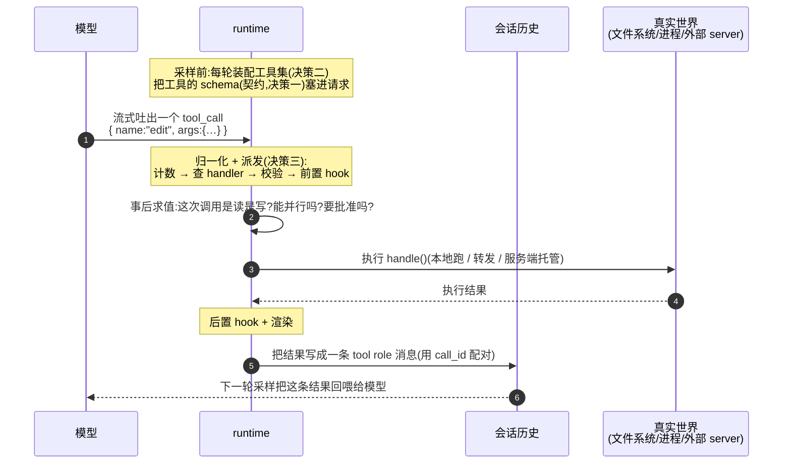
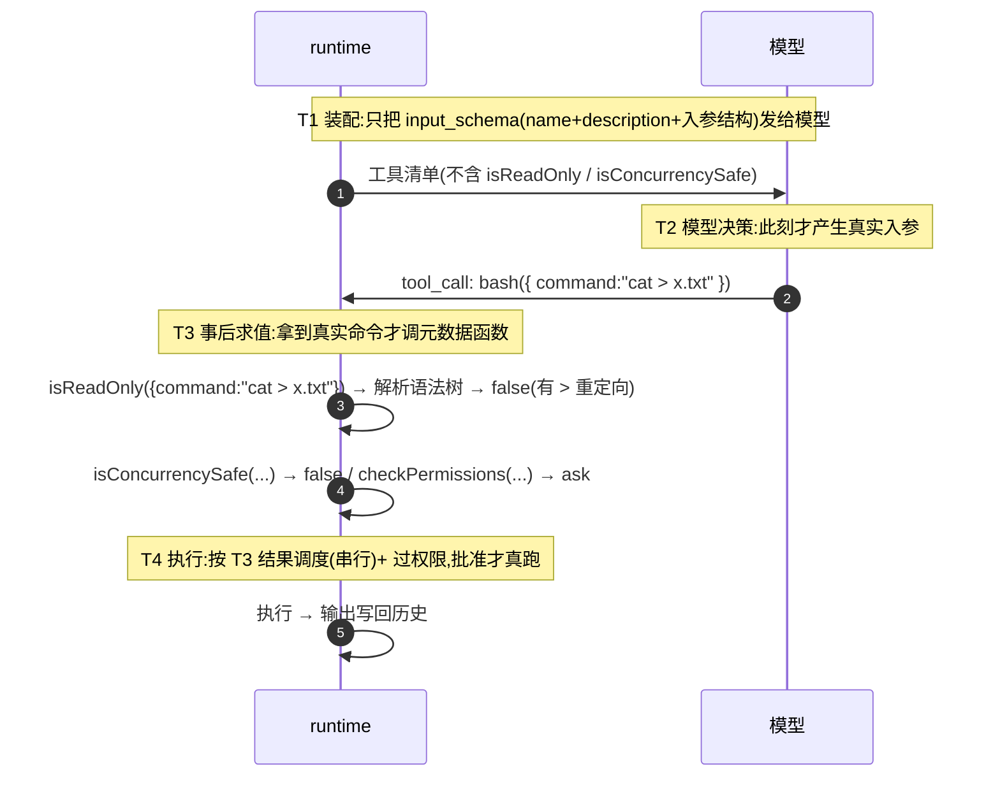
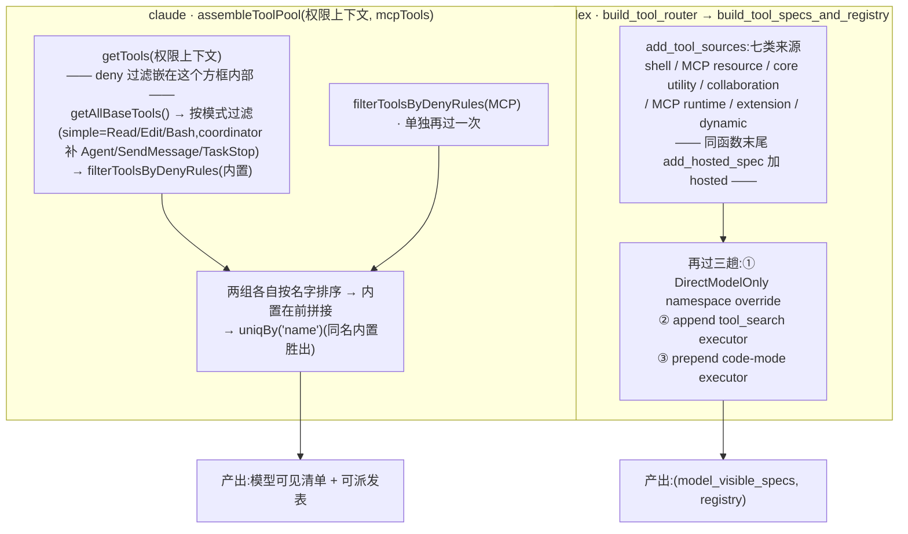
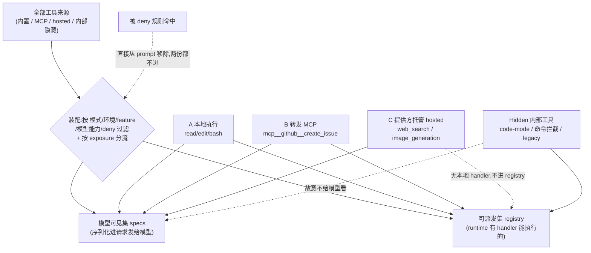
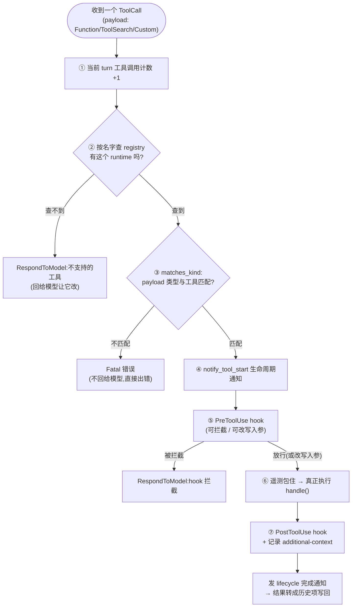
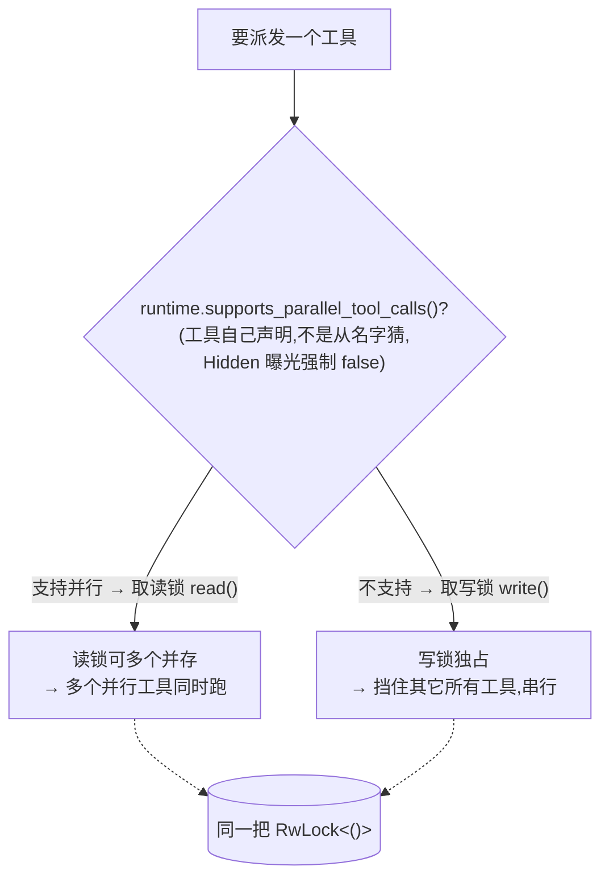
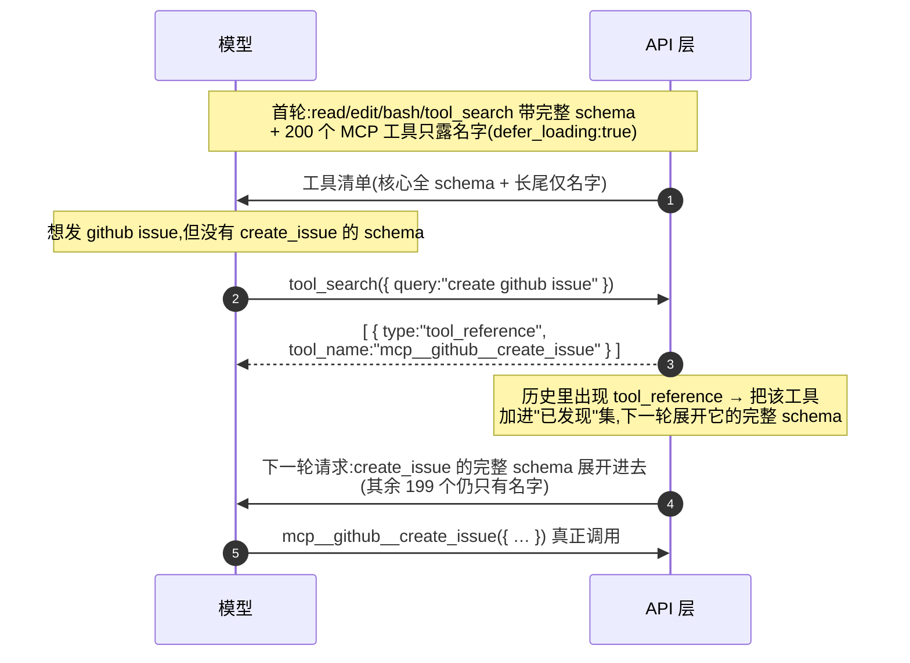
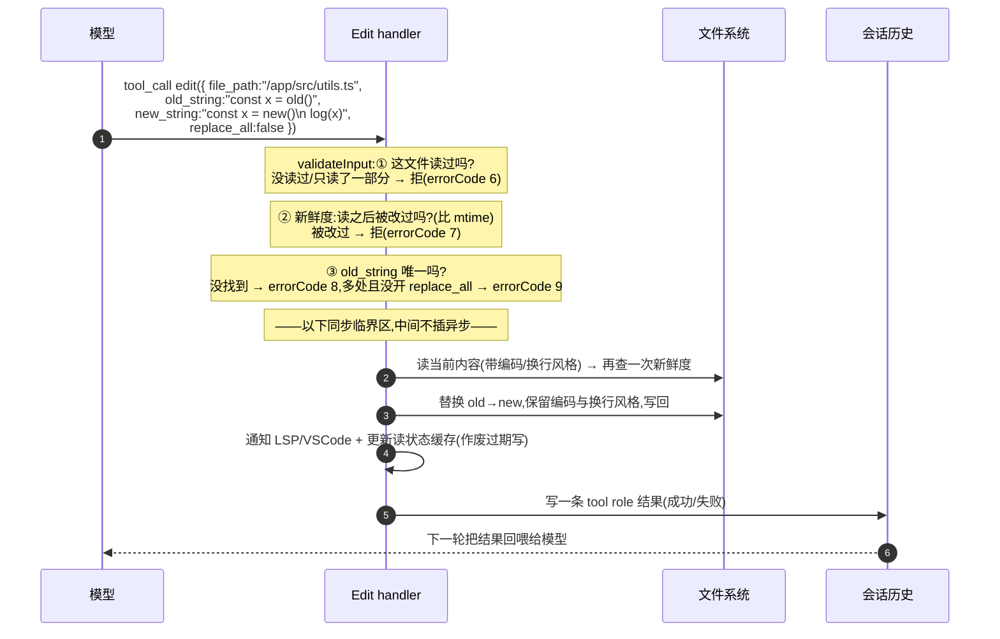
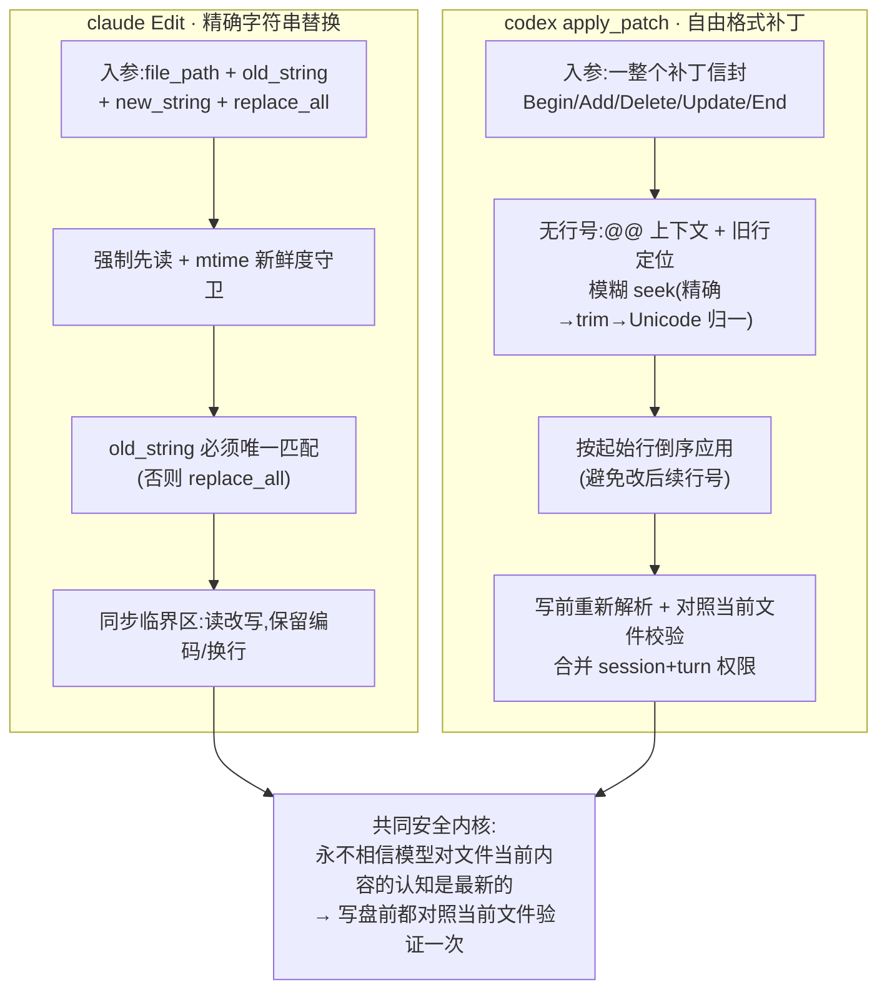

# 第 2 课：工具系统（动作面）

> 接第 1 课。第 1 课讲的是 agent 的循环（心脏），这一课讲循环里那只伸出去改变世界的"手"——工具。
> 讲法同上：直接讲机制 + claude/codex 双实现对照 + mock 结构 + 落到 deepseek。术语都翻译，不让你去翻代码。

---

## 0. 工具系统要解决的问题

模型本身只会"输出文字"。它能读文件、跑命令、改代码，全靠 runtime 给它挂了一批工具，并约定：模型在回复里发出一个"工具调用"(`tool_call`),runtime 就去执行，把结果作为一条 `tool` role 消息写回历史（回顾第 1 课 role 那节）。

先把这个约定的全程走一遍，后面五个决策都是在给这条主轨迹的某一段做工程。下图是一次工具调用从模型发起到结果写回历史的完整时序——它是整课的总览，每个决策都对应这条线上的一段：



围绕这个约定，工具系统这台机器要解决五个问题，正好是这一课的五个决策，每个都落在上面那条线的某一段：

1. **契约**（决策一）：一个工具要向 runtime 声明什么，runtime 才能既让模型正确调用、又能安全执行？——对应"塞进请求的 schema"那一步。
2. **装配**（决策二）：每一轮把哪些工具暴露给模型？"模型能看到的"和"runtime 能执行的"是不是同一批？——对应"采样前装配工具集"那一步。
3. **派发与并行**（决策三）：模型发来一个调用，怎么路由到对应执行逻辑？多个工具能不能并行？——对应"归一化 + 派发"和"执行"两步。
4. **发现**（决策四）：工具多到几百个（MCP/插件）时，怎么不把 prompt 撑爆、不把模型淹没？——是决策二装配的一个伸缩问题。
5. **案例**（决策五）：模型到底怎么改文件——两种截然不同的编辑工具设计（Edit vs apply_patch），是这整条线在最高频动作上的一次完整落地。

〔源码锚点：工具调用全程 = 模型流吐 `tool_call` → `build_tool_call` 归一化 → `dispatch_any_with_terminal_outcome` 派发 → `handle()` 执行 → 结果写回历史；归一化 `core/src/tools/router.rs:113`、派发管线 `core/src/tools/registry.rs:405`。〕

---

## 决策一：工具契约——一个工具要声明什么

这一节回答：一个工具要向 runtime 声明哪些东西？为什么不能只声明"我叫什么、收什么参数"就完了？答案是——runtime 既要让模型正确地调用它，又要在执行时知道"这次调用是读是写、能不能和别的工具并行、要不要先批准"。前者是给模型看的 schema，后者是给调度层和安全层看的元数据。这两类信息性质完全不同，怎么把它们组织进一个工具的定义，就是 claude 和 codex 在这里分道扬镳的地方。

### claude：一个大接口 `Tool`，把一切都塞进去

claude 用一个 `Tool` 接口定义工具，大约 50 个成员。看着吓人，但按职责分五类就清楚了：

```
Tool {
  // ① 给模型看的:schema 和说明
  name, aliases, description(input), prompt(ctx),
  inputSchema,            // Zod 定义的入参结构(模型按它生成调用)
  inputJSONSchema?,       // MCP 工具可直接给 JSON Schema
  strict?, searchHint?,

  // ② 执行入口
  call(input, ctx, canUseTool, parentMessage, onProgress) -> ToolResult,

  // ③ 调度/安全元数据 —— 注意这些是「函数」,不是静态布尔
  isEnabled() -> bool,
  isReadOnly(input) -> bool,         // 只读?
  isConcurrencySafe(input) -> bool,  // 能并行?(按入参判断)
  isDestructive(input) -> bool,      // 不可逆删除/覆盖?
  validateInput(input, ctx),         // 入参校验,失败原因回给模型
  checkPermissions(input, ctx),      // 权限判定(第 6 课细讲)
  getPath(input),                    // 文件类工具的路径提取

  // ④ 发现:要不要延迟加载
  shouldDefer?, alwaysLoad?, isMcp?, isLsp?,

  // ⑤ 结果与渲染
  mapToolResultToToolResultBlockParam(out, id),  // 把输出转成模型可见的 tool_result
  maxResultSizeChars,                            // 结果超限就落盘给预览
  renderToolUseMessage(...), renderToolResultMessage(...), …  // 终端 UI
}
```

这里有两个**关键设计判断**，值得你抄：

1. **那些标志位是函数，不是注释。** `isConcurrencySafe(input)` 接收入参返回布尔——意味着同一个工具，对某些入参可并行、对另一些不行（比如读不同文件可并行、写同一文件不行）。这些函数是给**调度层、权限层、执行层**调用来做决策的，不是给人看的文档。
2. **默认值是"保守的"。** `buildTool()` 给没声明的字段填默认：`isEnabled=true`，但 **`isConcurrencySafe=false`（默认串行）、`isReadOnly=false`（默认当作会写）、`isDestructive=false`、权限默认 allow**。也就是说一个工具不主动声明，就被当成"会写盘、不能并行"对待。**默认从严**，是安全系统该有的姿态。

### 关键澄清：这些函数不在 schema 里，是「事后」求值的

容易踩的一个误解：既然 `isReadOnly` 这些是元数据，它们是不是跟着 schema 一起发给模型？**不是。** 发给模型的 schema 只有上面分组 ① 里那部分（`name` + `description` + 入参结构），**不含 `isReadOnly`/`isConcurrencySafe`**。模型从头到尾看不到这些函数。

```
// 发给模型的 schema(模型能看到的全部):
{
  "name": "bash",
  "description": "Execute a shell command…",
  "input_schema": { "type": "object",
                    "properties": { "command": { "type": "string" } },
                    "required": ["command"] }
}
// 没有 isReadOnly / isConcurrencySafe。模型不需要、也不该知道。
```

那这些函数什么时候被调用？**在模型决定了具体命令之后、执行之前**，由 runtime 拿着模型给出的真实入参去调：

```
T1 装配:    把 Bash 的 input_schema 塞进请求发给模型
            —— 此刻不知道模型要干啥,也【不需要】知道,这里根本不算 readonly
T2 模型决策: 模型回 tool_call → bash({ command: "cat > x.txt" })
            —— runtime 第一次拿到真实命令
T3 runtime: 现在才调 Bash.isReadOnly({ command: "cat > x.txt" }) → 解析 → 返回布尔
            再调 isConcurrencySafe(...)、checkPermissions(...)
T4 执行:    按 T3 结果调度(并行/串行)、过权限,批准了才真跑,输出写回历史
```

把这条时间线画成时序，"schema 和元数据求值发生在两个不同时刻"就一目了然——T1 装配时模型还没说要干啥，所以那一刻**不可能**也**不需要**判 readonly；要等 T3 拿到真实命令才求值：



所以"schema 不带 readonly、装配时不知道模型要干啥"是对的——**因为 readonly 压根不在装配时算，而在模型给出命令后（T3）才算**。函数的意义正在于此：等拿到真实入参那一刻才求值。两者不矛盾，是两个不同时刻的事。

**`cat > x.txt` 这个刁钻例子**：`cat` 在只读白名单里，但 `cat > x.txt` 因为那个 `>` 重定向其实是写文件。T3 解析这条命令时，语法树里会出现输出重定向节点，判定逻辑看到"有写入重定向" → `isReadOnly` 返回 false。

```
isReadOnly({ command: "cat x.txt" })   → cat,无重定向        → true (读)
isReadOnly({ command: "cat > x.txt" }) → cat + 输出重定向 >   → false (写!)
```

**命令名说"读"，结构说"写"，结构赢。** 这就是为什么判定要解析整棵语法树、而不是 `command.startsWith("cat")`——否则 `cat >`、`ls && rm`、`$(rm)`、`x=1 rm` 都能骗过去。判成"写"之后：`isConcurrencySafe` 也是 false → 串行；`checkPermissions` 走写权限 → 按模式 allow / 问用户 / 拒。

**贯穿原则**:schema 里不放 readonly 是故意的——**永远不让模型自己声明安全性**。安全与调度由 runtime 独立地、根据模型实际给出的命令、事后判定；模型只管"我要跑这条命令",runtime 才是"是读是写、能否并行、要不要批准"的权威。

### codex：把"模型看的"和"runtime 执行的"拆成两个东西

codex 不用一个大接口，而是分两层：

- **`ToolSpec`**——给模型看的 schema 形态（会序列化进发往模型的请求）。它是个枚举，变体有：`Function`（普通函数式工具）、`Namespace`（一组 MCP 工具合并）、`ToolSearch`、`WebSearch`、`ImageGeneration`、`Freeform`（自由格式，见决策五的 apply_patch；`Freeform` 只是 Rust 变体名，序列化进 API 请求时 `type` 字段其实是 `"custom"`）。
- **`ToolExecutor` / `CoreToolRuntime`**——runtime 执行契约。`ToolExecutor` 把这几样绑在一起：`tool_name()`、`spec()`（返回上面的 ToolSpec）、`exposure()`、`search_info()`、`supports_parallel_tool_calls()`（默认 false）、`handle()`（真正执行）。`CoreToolRuntime` 再在上面加 payload 类型匹配、取消策略、遥测标签、hook 入参改写、流式参数 diff 等 core 元数据。

```
trait ToolExecutor {
  tool_name() -> ToolName,
  spec() -> ToolSpec,                       // ← 给模型看的
  exposure() -> ToolExposure,               // Direct | Deferred | DirectModelOnly | Hidden
  search_info(),
  supports_parallel_tool_calls() -> bool,   // 默认 false
  handle(invocation) -> outcome,            // ← 真正执行
}
```

注意那个 **`ToolExposure` 枚举**，它是决策二的核心：`Direct`（模型直接可见）、`Deferred`（延迟加载，模型先只看到名字）、`DirectModelOnly`、`Hidden`（模型完全看不到，但 runtime 仍可派发）。

### 取舍

claude 把 schema + 执行 + 安全 + 渲染**全揉进一个接口**，好处是一个工具一个对象、内聚；代价是接口巨大。codex **把"模型可见的 spec"和"runtime 的执行契约"分开**，好处是这两件事本就该解耦（下一决策会看到"模型可见 ≠ 本地派发"正是靠这个分离实现的）；代价是一个工具要碰两个抽象。

### 🎯 deepseek 落地

- 工具的安全/调度元数据（只读、可并行、破坏性）做成**按入参求值的函数**，不是建表时写死的布尔。
- **默认从严**：没声明就当作"会写、不可并行、需要权限"。
- 即便你 M0 用一个接口，也**在概念上把"给模型看的 schema"和"runtime 执行逻辑"分清**——下一决策你就需要它们能各走各的。

〔源码锚点：claude `Tool` 类型约 50 成员（`name`/`aliases`/`description`/`prompt`/`inputSchema`/`inputJSONSchema`/`strict`/`searchHint`/`call`/`isEnabled`/`isReadOnly(input)`/`isConcurrencySafe(input)`/`isDestructive?(input)`/`validateInput?`/`checkPermissions`/`getPath?`/`shouldDefer?`/`alwaysLoad?`/`isMcp?`/`isLsp?`/`mapToolResultToToolResultBlockParam`/`maxResultSizeChars`/`renderToolUseMessage`/`renderToolResultMessage?`）= `tools/Tool.ts:362,371-378,386,394,397,402,404,406,436-437,442,449,456,466,472,489,500,506,518,557,566,605`；标志位是按 input 求值的函数（非静态布尔）= `tools/Tool.ts:402,404,406`；`buildTool()`/`TOOL_DEFAULTS` 默认 `isEnabled=true`·`isConcurrencySafe=false`·`isReadOnly=false`·`isDestructive=false`·权限 `behavior:'allow'` = `tools/Tool.ts:757-766,783`；发给模型的 schema 只含 ① 组（不含 readonly/concurrency）= 由 `toolToAPISchema` 仅输出 `name/description/input_schema` `utils/api.ts:215-225`；codex `ToolSpec` 枚举变体 `Function`/`Namespace`/`ToolSearch`/`WebSearch`/`ImageGeneration`/`Freeform`、`Freeform` 序列化 `type="custom"` = `tools/src/tool_spec.rs:17-51`；`ToolExecutor` trait（`tool_name`/`spec`/`exposure` 默认 `Direct`/`search_info`/`supports_parallel_tool_calls` 默认 false/`handle`）= `tools/src/tool_executor.rs:49-69`；`ToolExposure` 四档 `Direct`/`Deferred`/`DirectModelOnly`/`Hidden` = `tools/src/tool_executor.rs:15-36`；`cat > x.txt` 走 tree-sitter AST 出 `file_redirect` 节点 → readonly false = `utils/bash/ParsedCommand.ts:131-148`、`tools/BashTool/BashTool.tsx:437-441`、`tools/BashTool/bashSecurity.ts:890-900`。〕

---

## 决策二：工具集的装配，以及"模型可见"≠"可派发"

这一节回答两个绑在一起的问题：每一轮把哪些工具暴露给模型，是开机算一次还是每轮都重算？以及——"模型能看到的"和"runtime 能执行的"，到底是不是同一批工具？第一个问题答案是"每轮重算"，第二个答案是"多数时候是、但故意留了不重合的口子"，而这个口子正是工具系统里最容易踩坑、也最值得设计的地方。

### 工具集是每轮装配的，不是开机定死的

回顾第 1 课：每一轮采样前都要重新装配上下文。工具集就是其中一部分，**每轮重新算**，因为它受模式、环境、feature、模型能力影响。claude 和 codex 的装配链路虽然形状不同，但都干同一件事：把所有工具来源汇拢、过滤、排序，最后吐出"发给模型的清单"和"runtime 能派发的表"。

#### claude 的装配链：deny 过滤嵌套在 getTools 里

真正的入口是 `assembleToolPool`，**deny 过滤是嵌套发生的、不是一字排开的中间一步**。`assembleToolPool(权限上下文, mcpTools)` 干三件事：① 先调 `getTools(权限上下文)` 拿内置工具——而 `getTools` 内部自己 `getAllBaseTools()`（全部内置工具目录）→ 按模式过滤（simple 模式只给 Read/Edit/Bash 子集，coordinator 模式补 Agent/SendMessage/TaskStop）→ 对内置工具调一次 `filterToolsByDenyRules()`（按 deny 规则在**进入模型视野前**就删掉）；② 再对传进来的 MCP 工具**单独**调一次 `filterToolsByDenyRules()`；③ 两组**各自**按名字排序后拼接（内置在前）、`uniqBy('name')` 去重——内置排在前面所以同名冲突内置胜出（源码注释明确：这样分区排序是为了让内置工具连成一段前缀、保住 prompt 缓存）。

#### codex 的装配链：七类来源 + hosted，再过三趟

`build_tool_router()` → `build_tool_specs_and_registry()` → `add_tool_sources()` 按固定顺序汇入七类来源：shell、MCP resource、core utility、collaboration（多 agent）、MCP runtime、extension、dynamic，并在**同一个 `add_tool_sources` 函数末尾**把 hosted 工具也加进去（`add_hosted_spec`，所以 hosted 不是"add_tool_sources 之后的独立一步"）；`add_tool_sources` 返回后，`build_tool_specs_and_registry` 还会再跑三趟——处理 DirectModelOnly 的 namespace override、追加 tool_search executor、前置 code-mode executor——最后才产出 `(model_visible_specs, registry)` 两个东西。

两条链并排画出来，注意三件事：deny 过滤在 claude 里是**嵌进 getTools 内部**的（图里画在 getTools 的方框内，不是外面一个独立步骤），hosted 在 codex 里是**add_tool_sources 函数末尾**加的（不是之后的独立一步），两边最后都收敛成"可见集 + 可派发集"两个产物：



### 先说清楚视角：这是 runtime 的内部记账，不是模型的事

很容易把这一节误读成"模型能看到一些用不了的工具"。**不是。** 从模型的视角，它只看到一份扁平的工具清单：按 key 传参、拿结果，**它不知道、也不需要知道这个工具在哪执行**。下面的"模型可见 ≠ 可派发"，完全是**你这个 runtime 工程师**的内部记账——你手里那份工具清单要同时服务两个用途：

1. **序列化发给模型/提供方**——告诉模型"有这些工具可调"（= 可见集 specs）；
2. **模型调用回来时，查"这个调用该用我哪个本地 handler 执行"**——这就是派发（= 派发表 registry）。

绝大多数工具，这两份是同一批；但当一个工具"由别人执行"时就分叉了。按"谁执行"分三种：

| 模式 | 谁执行 | runtime 在执行回路里吗 | 在 registry 吗 | 例子 |
|---|---|---|---|---|
| A 本地执行 | runtime 自己 | 在（就是执行者） | 在 | read / edit / bash |
| B 转发（MCP/外部） | 外部 server | 在（当转发器：收→转发→回填） | 在（handler 干的是转发） | mcp__github__create_issue |
| C 提供方托管 | 模型提供方服务器 | **不在**（连转发都不用） | **不在** | web_search / image_generation |

记这两句定义就够：
- **可派发（在 registry）= runtime 有一个 handler 会被它调用**——handler 可能本地执行（A），也可能转发出去（B）；两者你都在回路里。
- **hosted（不在 registry）= 连 handler 都没有**(C)：模型调它时，提供方在同一次 API 调用内部就执行完、结果直接拼进响应；你既不执行也不转发，只是事先**声明**过它。

所以"模型可见但不在 registry"说的就是 C：它对模型可见、可用，只是**不由你本地派发**。**"不在 registry"≠"不能用"，而是"不归你执行"。** "我不管在哪执行、按 key 传参就行"——对，那是**模型**的视角；"在哪执行"是**你 runtime** 要管的，因为你得决定这次调用是自己跑、转发、还是压根不用管。

反方向也成立：**在 registry、却不给模型看**——`Hidden` 工具（code-mode 专用、命令拦截、legacy handler）；runtime 能派发，但故意不暴露给模型直接调。这一向跟直觉一致：不想让模型用的就不给它看。（claude 里还有更前置的一招：被 deny 规则命中的工具**直接从 prompt 移除**，而不是等模型调了再拒——同样是"少给模型看以减少误用"。）

把"一份工具来源 → 两份记账"画出来就是下图。关键看那三种工具（A/B/C）和 Hidden 各自落进哪一份：A/B 两份都进，C（hosted）只进可见集、不进 registry，Hidden 反过来只进 registry、不进可见集——**两个集合既有交集也各有专属，绝不是同一份**：



读这张图记住：**C 在可见集、不在 registry**（hosted，模型能调但你不执行）；**Hidden 在 registry、不在可见集**（你能派发但不给模型看）；只有 A/B 两份都进。这就是"模型可见 ≠ 可派发"的全部含义。

### 为什么 runtime 非得分这两份（对 deepseek 的真正意义）

如果你 naive 地把工具建成"一份清单，每个工具配一个本地 handler"，会在两处崩：
- 加一个 **hosted 工具**（联网搜索）：它没有本地 handler，塞进同一张表 handler 填什么？而且模型调它时根本没有 call 回到你这里——你若把"清单"当"该执行的列表"，会去找一个不存在的 handler 然后报"未知工具"。
- 做一个 **内部/隐藏工具**：它该可执行、却不该可见，一份清单也表达不了。

所以从一开始分两个概念：**发给模型的 spec 集（可见性）+ 本地有 handler 的 registry（派发）**，外加一个"hosted/服务端执行"的标记；工具落在哪个象限，装配时按它的 exposure 决定。而权限是更细的第三层（第 6 课）——一个工具"可见 + 可派发"，真要执行时还要过权限。

**什么时候你才真要管这件事**：如果 deepseek 现在所有工具都本地执行（read/edit/bash；本地 MCP 转发也算你在回路里），那可见集和 registry 基本是同一批，现在可以不纠结。它变成必须处理的事只有两种触发：① 接了提供方服务端执行的工具（hosted）；② 做了不想让模型直接调的内部工具。在那之前，**别把"工具清单"和"handler 表"焊死成"每个工具必有一个本地 handler"** 就行，留好口子。

### 顺带：由谁执行 = 你有多大控制力（第 6 课展开）

"谁执行"不只是个实现细节，它直接决定你对这次动作有多大控制力——从左到右控制力递减：


这正是为什么把**危险能力（文件写、shell）做成本地 + 严格门控**，只把**低风险、需要提供方基础设施的只读能力（搜索、生图）做成 hosted**：对前者死攥逐次控制，对后者接受"丢一点控制换省事"。**红线：永远别把破坏性能力做成 hosted/不可门控的工具。**

### 还有个第 1 课呼应（缓存）

**claude 把内置工具排在 MCP 前、按名字排序**，让工具清单字节稳定，**保住 prompt 缓存**（工具 schema 在前缀里，顺序一抖缓存就废）。源码注释把这层动机说得很直白：服务端的缓存策略在"最后一个前缀匹配的内置工具"之后放一个全局缓存断点，要是把内置和 MCP 拍平成一个 flat sort、让 MCP 工具插进内置工具中间，每加一个排序靠前的 MCP 工具就会作废下游所有缓存键——所以才分区排序、让内置连成一段稳定前缀。

### 🎯 deepseek 落地

- 装配做成**每轮一跑**，受模式/环境/模型能力门控。
- 心里分两个概念：**给模型的 spec 集**（可见性）和**本地 handler 的 registry**（派发）；别用一份清单兼任、别假设"每个工具都有本地 handler"。工具按"谁执行"（本地/转发/托管）落到不同象限。
- 工具清单**排序稳定**保缓存。
- 按"动作需要多大控制"选执行位置：危险/不可逆 → 本地 + 门控；低风险只读且无自有基础设施 → hosted 可接受。

〔源码锚点：claude `assembleToolPool(permissionContext, mcpTools)` 入口 + `getTools` 内部 `getAllBaseTools()`→ 模式过滤（simple=Bash/Read/Edit、coordinator 补 Agent/SendMessage/TaskStop）→ `filterToolsByDenyRules` 嵌在 getTools 内 = `tools/tools.ts:271,287,295,307,310,345,349`；MCP 单独再过一次 deny = `tools/tools.ts:352`；两组各自 `sort(byName)` 拼接（内置在前）+ `uniqBy('name')` + 前缀缓存注释 = `tools/tools.ts:354-366`；codex `build_tool_router`→`build_tool_specs_and_registry`、`add_tool_sources` 七类来源 + 末尾 `add_hosted_spec`、之后三趟（`apply_direct_model_only_namespace_overrides`/`append_tool_search_executor`/`prepend_code_mode_executors`）产出 `(model_visible_specs, registry)` = `core/src/tools/spec_plan.rs:157-199,604-615`；hosted（C）进可见集不进 registry（`specs.extend(hosted_specs)`,registry 只 `from_tools(runtimes)`）= `core/src/tools/spec_plan.rs:258-260`；`Hidden` 进 registry 不进可见集（`exposure.is_direct()` 才 push 进 specs）= `core/src/tools/spec_plan.rs:247-256`。〕

---

## 决策三：派发与并行执行

这一节回答：模型发回来一个调用（一段文本里夹着工具名和参数），runtime 怎么把它准确路由到对应的执行逻辑？以及——一次回复里模型可能同时要求跑好几个工具，它们能不能并行、并行的边界谁来管？这里有两处特别值得学：派发管线把所有横切关注点（计数、查 handler、前后 hook、遥测、错误兜底）**统一收口**，让工具 handler 只写纯执行逻辑；而整个并发模型，简洁到**就是一把读写锁**。

### 从"模型发来一个调用"到"执行完写回历史"

模型在流式输出里吐出一个工具调用，runtime 要把它**归一化**成内部统一形态再派发。

**codex**：`build_tool_call()` 把模型输出的 item 归一成一个 `ToolCall`，其 payload 只有三种形态（`ToolPayload`）：`Function { arguments }`、`ToolSearch { arguments }`、`Custom { input }`。然后 `ToolCallRuntime` 拿着它去 registry 派发。registry 的 `dispatch_any_with_terminal_outcome()` 是统一的执行管线，顺序固定。把这条管线画成流程图，重点看**两种错误的去向不同**——查不到 handler 是 `RespondToModel`（回给模型让它改），payload 类型不匹配是 `Fatal`（不回给模型）：



注意这条管线把"计数、查找、前后 hook、遥测、错误"统一收口——**每个工具 handler 自己不用操心这些**，只管 `handle()`。这是好设计：横切关注点集中在派发层。

**claude**：同构。非流式走 `runTools()` 先 `partitionToolCalls()` 分批；流式走 `StreamingToolExecutor`，模型一边吐工具块一边入队执行。未知工具生成一个合成错误结果（而不是崩）。

### 并行：整个并发模型就是一把锁

这是最值得学的一处简洁设计。

**codex**：`ToolCallRuntime` 持有**一把** `RwLock<()>`。派发一个工具时，先问 runtime 支不支持并行，按答案取读锁或写锁——这一个分流就把"哪些能一起跑、哪些必须独占"全表达了：



`Hidden` 曝光的工具强制并行=false。并行性是**runtime 自己声明**的（`supports_parallel_tool_calls()`），**不是从工具名猜**的。

**claude**：同样思路，用 `isConcurrencySafe(input)`。`partitionToolCalls()` 把一批调用按并发安全性分批；流式执行器只在互斥条件满足时才启动下一个；**解析入参失败或判断函数抛错时，保守降级为串行**——绝不让一个解析异常演变成并发副作用。

有个 claude 的 gotcha 值得记：如果一个工具会通过 `contextModifier` 改写"下一轮的上下文"，那它**不该声明自己并发安全**——因为并发安全的工具，它的 context 改写被推迟到整批结束才应用，顺序无法保证。**会改全局状态的工具，默认就别并行。**

### 🎯 deepseek 落地

- 把"派发"做成一条**统一管线**：计数、查找、前后 hook、遥测、错误兜底全收口在这里，工具 handler 只写纯执行逻辑。
- 并发互斥用**一处**实现（一把读写锁，或一个分批步骤），由每个工具**声明**的"可否并行"驱动，**默认串行**。别让每个工具自己写锁。
- **会改共享状态的工具一律按串行处理**。

〔源码锚点：codex `build_tool_call` 归一化成 `ToolCall`、payload 三态 `ToolPayload::Function/ToolSearch/Custom` = `core/src/tools/router.rs:113-160`、`tools/src/tool_payload.rs:7-11`；派发管线 `dispatch_any_with_terminal_outcome` 顺序（计数+1 → 查 registry（None=`RespondToModel`）→ `matches_kind`（不匹配=`Fatal`）→ `notify_tool_start` → PreToolUse hook → 遥测包住 `handle_any_tool` → PostToolUse hook + `record_additional_contexts`）= `core/src/tools/registry.rs:405,437,442-461,475-491,493,495-539,545-569,583-604`；并发一把 `parallel_execution: Arc<RwLock<()>>`、`supports_parallel` 取读锁否则写锁 = `core/src/tools/parallel.rs:36,88,115-119`；`Hidden` 强制并行 false = `core/src/tools/registry.rs:268`。claude 非流式 `runTools`→`partitionToolCalls`、流式 `StreamingToolExecutor`、未知工具合成错误 = `services/tools/toolOrchestration.ts:19,26,91,101`、`services/tools/StreamingToolExecutor.ts:40,77-101`；解析失败/判断抛错降级串行 = `services/tools/toolOrchestration.ts:98-108`、`services/tools/StreamingToolExecutor.ts:104-113`；`contextModifier` 只对非并发安全工具生效 + 并发工具的修改推迟到整批后 = `tools/Tool.ts:329`、`services/tools/toolOrchestration.ts:54-62`、`services/tools/StreamingToolExecutor.ts:388-395`。〕

---

## 决策四：工具太多怎么办——发现与延迟加载

### 问题

接了几个 MCP server、装了几个插件，工具数量轻松上百。如果每轮把所有工具的**完整 schema** 都塞进 prompt:① prompt 暴涨，token 贵、还可能炸缓存；② 模型被几百个工具淹没，选择质量下降。

### 解法：延迟加载（deferral）+ 一个 ToolSearch 元工具

核心思路：**大多数工具平时只露个名字，不发完整 schema；模型需要时再按需把 schema 拉进来。**

- **延迟工具**：发给模型时只带名字、标记 `defer_loading:true`（claude）/ `ToolExposure::Deferred`(codex)。客户端其实仍把完整 schema + `defer_loading:true` 一起发出去，是 **API 服务端**看到这个标记后把 schema 从 prompt 里剥掉、只留名字——所以**模型实际看到的就是名字**，效果等同于"不带完整入参 schema"。模型知道"有这么个工具"，但还不能直接调（没有 schema）。
- **ToolSearch（元工具）**：它本身是个**始终可见**的工具。模型调用它、给个关键词（或 `select:Read,Edit,Grep` 精确选择），它返回一组 **`tool_reference`** 块；API 层看到这些 reference，就在**后续请求**里把对应工具的完整 schema 展开进去。于是模型"按需发现"工具，只为真正要用的那几个付 schema 的钱。

#### claude 的延迟判定规则有先后顺序

`isDeferredTool` 从先到后逐条判：`alwaysLoad=true` 的先豁免 → MCP 工具一律延迟 → **ToolSearch 自己永不延迟**（否则模型连发现工具的入口都没有）→ 某些首轮必须可见的工具（如 fork 优先的 Agent、Brief）豁免 → 最后才看 `shouldDefer`。延迟工具只有当历史里出现过一个 `tool_reference` 后才真正进入发送集；ToolSearch 始终保留以便继续发现。ToolSearch 自己是只读 + 并发安全的。

#### 一个具体的 running example：模型怎么发现并用上第 200 个工具

把"首轮只露名字 → 模型调 ToolSearch → 下一轮展开 schema → 真正调用"这条按需发现的时序画出来，最值得记的是：那 200 个长尾工具自始至终只有被搜到的那一个付过 schema 的 token：



文字版速记：首轮带 `read, edit, bash, tool_search`（完整 schema）+ `mcp__github__create_issue`/`mcp__slack__send_message`/…（200 个只有名字）；模型想发 issue 但没 schema，先调 `tool_search({ query:"create github issue" })` → 返回 `[ { type:"tool_reference", tool_name:"mcp__github__create_issue" } ]` → 下一轮 API 层把它的完整 schema 展开 → 模型这才真正调用。其余 199 个工具自始至终没占过 prompt。

### 🎯 deepseek 落地

如果你打算接 MCP / 插件，**工具爆炸几乎必然发生**。从一开始就规划延迟机制：**一小撮核心工具常驻（完整 schema）+ 长尾只发名字 + 一个 search/expand 工具按需展开**。否则随着工具增多，你的 prompt 体积和缓存命中率会一起恶化。注意一个自举细节：**那个发现工具自己必须永不延迟**，否则模型没有入口。

〔源码锚点：claude 延迟工具标 `defer_loading:true`（客户端仍发完整 schema,API 服务端剥掉 schema 只留名字）= `utils/api.ts:215-225`、`services/api/claude.ts:1461-1462`；`isDeferredTool` 判定顺序（`alwaysLoad` 豁免 → MCP 一律延迟 → ToolSearch 永不延迟 → fork 优先 Agent/Brief 豁免 → `shouldDefer`）= `tools/ToolSearchTool/prompt.ts:62-108`；`select:` 精确选择 + 返回 `tool_reference` 块 = `tools/ToolSearchTool/ToolSearchTool.ts:363-368,465-468`；延迟工具要等历史里出现 `tool_reference` 才进发送集、ToolSearch 始终保留 = `services/api/claude.ts:1155-1167`；ToolSearch 自己只读 + 并发安全 = `tools/ToolSearchTool/ToolSearchTool.ts:308-313`；codex `ToolExposure::Deferred` 须提供 `search_info` = `tools/src/tool_executor.rs:22-26`、追加 tool_search executor `append_tool_search_executor` = `core/src/tools/spec_plan.rs:196`。注:claude 是 ~2026-03 快照,此处的 Brief 工具当前名已改为 `SendUserMessage`、`Brief` 是 legacy 别名,讲法以快照为准。〕

---

## 决策五：案例研究——模型怎么改文件（Edit vs apply_patch）

"让模型改代码"是 coding agent 最高频的动作。这一节回答两个问题：一条改文件的工具调用具体长什么样、从模型发起到落盘要过哪几道关？以及——claude 和 codex 在"模型怎么表达一次编辑"上走了**两种截然不同的哲学**，把它们对照着拆开，你就理解了编辑工具设计的全部张力。

### running example：一条真实 Edit 调用从模型到落盘

先把前面那条贯穿场景（"重构 utils.ts"）落到一次具体的 Edit 上。模型发出的就是这么一条 `tool_call`，它走过 Edit 的几道守卫才真正写盘——注意守卫**先于**写盘，任何一道没过都是大声报错、绝不静默写错地方：



这条线把后面 claude `Edit` 那几个 load-bearing 守卫提前演了一遍：**先读、查新鲜度、唯一匹配、同步临界区里读改写**。下面把两种编辑哲学各自展开。

### claude `Edit`：精确字符串替换

入参极简：`file_path` + `old_string` + `new_string` + `replace_all`。语义是"把文件里的 old_string 换成 new_string"。

```
Edit({
  file_path: "/app/src/utils.ts",
  old_string: "const x = old()",
  new_string: "const x = new()\n  log(x)",
  replace_all: false,
})
```

它的几个**load-bearing 设计**:
- **改之前必须先 Read**：对已有非空文件，如果没读过、或只读了一部分，Edit 直接拒绝。
- **新鲜度守卫（staleness guard）**：记录文件的 mtime/内容，如果文件在读之后被改过，Edit 拒绝（避免基于过期视图覆盖）。`validateInput()` 和 `call()` 两处都查，且注释要求 staleness 检查和写盘之间不要插异步操作，减少并发交错。
- **必须唯一匹配**:old_string 在文件里要么唯一，要么用 `replace_all`；找不到、或多处匹配但没开 replace_all，都报错。
- 读改写在一个同步临界区里完成，保留编码和换行风格，写后通知 LSP/VSCode、更新读状态缓存。
- `strict=true`，默认 `isReadOnly=false`、`isConcurrencySafe=false`（写工具，串行）。

**失败模式是"大声失败"**:old_string 没找到 / 多处匹配 / 文件 stale —— 全部明确报错让模型重试，绝不静默改错地方。

### codex `apply_patch`：自由格式补丁

apply_patch 是一个 **freeform 工具**（自由格式工具）。它的补丁格式有一份 Lark 语法**写在解析器源码注释里做规范文档**，但**运行时并不跑 Lark**——实际解析用的是一个手写的 Rust 解析器，而且注释里明说"比规范更宽松、容忍标记前后的空白"。模型提交的不是两个字符串，而是**一整个补丁信封**:

```
*** Begin Patch
*** Update File: src/utils.ts
@@ export function parse(
-  const x = old()
+  const x = new()
+  log(x)
*** Add File: src/helper.ts
+export function helper() {}
*** End Patch
```

它的机制：
- **三种 hunk**：`Add File`、`Delete File`、`Update File`（可带 `*** Move to:` 改名）。**一个补丁能同时改多个文件、多处**。
- **没有行号**:Update 靠 `@@ 上下文` + 旧行（`-`）定位。定位用**模糊 seek**：先精确匹配，失败再 trim 尾空白、trim 两端、Unicode 归一化逐级兜底——对模型输出的细微格式漂移有容错。
- **lenient 解析**：除了裸补丁，还能从 `apply_patch <<'EOF' … EOF` 这种 heredoc 包裹里把补丁体捞出来。解析失败给模型的错误前缀是 `apply_patch verification failed: …`，带明确信息帮模型自我修正。
- 替换**按起始行倒序应用**，避免前面的替换改变后面替换的行号。
- handler 先重新解析补丁、按选中环境的 cwd/沙箱校验、算出要写哪些路径、合并 session+turn 权限，再决定自动批准/问用户/拒绝，最后交给 runtime 写盘。
- 默认不支持并行（没 override `supports_parallel_tool_calls`）。

### 两种哲学的取舍（这才是要学的）

把两条编辑路径并排画出来，最能看清"它们到底在哪一步分道扬镳"——一边靠精确字符串 + 强守卫求极度确定，一边靠补丁信封 + 模糊 seek 求一次多改且容错，但**两边都在写盘前对照当前文件验证一次**：



| 维度 | Edit（精确字符串） | apply_patch（补丁格式） |
|---|---|---|
| 单次粒度 | 一次一处精确替换；多处要多次调用或 MultiEdit | 一次可跨多文件、多处 |
| 定位方式 | 精确唯一匹配 + 强制先读 + 新鲜度守卫 → 极确定 | 上下文 + 模糊匹配 → 容错但理论上可能定位偏 |
| 对模型的难度 | 极低（给两个字符串就行） | 较高（要产出合法补丁格式）→ 所以配语法规范（Lark 文档化、运行时手写解析器）+ lenient 解析 + 清晰报错 |
| token 成本 | 每处编辑都要重发 old+new 串，改动多时啰嗦 | 多处改动的 diff 紧凑 |
| 失败姿态 | 大声失败（stale/没匹配立即报错） | 解析/校验失败回明确文本，引导模型重试 |

**共同的安全内核**（无论你选哪种，这条必抄）：**永远不相信模型对文件当前内容的认知是最新的。** Edit 用"必须先读 + mtime 新鲜度守卫"保证；apply_patch 用"写前重新解析、对照当前文件验证"保证。少了这层，模型会基于脑子里过时的文件去覆盖，酿成数据丢失。

### 🎯 deepseek 落地

- **刻意选择编辑哲学**：精确字符串（Edit）实现简单、行为可预测，但大改动啰嗦、对空白敏感；补丁格式（apply_patch）擅长多文件改动且容错，但**需要一个真正的解析器 + 语法约束 + 好的错误信息**才能把模型拽在轨道上。常见折中是两者都给：`Edit`/`MultiEdit` 做定点改 + `Write` 做整文件。
- 不管选哪种，**"改前校验文件未过期"是地基**,M0 就要做。
- 编辑工具一律**默认串行、非只读**，走权限（第 6 课）。

〔源码锚点：claude `Edit` 入参 `file_path`/`old_string`/`new_string`/`replace_all` = `tools/FileEditTool/types.ts:7-18`；必须先读（未读/部分读拒,errorCode 6）= `tools/FileEditTool/FileEditTool.ts:275-287`；新鲜度守卫 `validateInput`+`call` 两处查、"check 与写盘间勿插异步"注释 = `tools/FileEditTool/FileEditTool.ts:290-311,427-429,442-443,451-468`；唯一匹配（未找到 errorCode 8 / 多处无 replace_all errorCode 9）= `tools/FileEditTool/FileEditTool.ts:316-343`；同步读改写保留编码/换行 + 通知 LSP/VSCode + 更新读状态缓存 = `tools/FileEditTool/FileEditTool.ts:444-525`；`strict=true`、默认 `isReadOnly=false`/`isConcurrencySafe=false`（继承 `Tool.ts:759-760`）= `tools/FileEditTool/FileEditTool.ts:90`。codex `apply_patch` 是 freeform 工具（`ToolSpec::Freeform`→`type=custom`）= `core/src/tools/handlers/apply_patch.rs:316-323`；Lark 文法仅写在解析器 `//!` 文档注释、运行时手写解析且"比规范更宽松、容忍标记前后空白" = `apply-patch/src/parser.rs:1-25`；三种 hunk `Add/Delete/Update File` + `Move to:` = `apply-patch/src/parser.rs:38-41`、`enum Hunk`:65;无行号 + 模糊 seek（精确→trim 尾→trim 两端→Unicode 归一）= `apply-patch/src/seek_sequence.rs:3,44,57,69-77`;heredoc lenient 提取 + 错误前缀 `apply_patch verification failed:` = `apply-patch/src/invocation.rs:113-115`、`core/src/tools/handlers/apply_patch.rs:354,464,628`;按起始行倒序应用 = `apply-patch/src/lib.rs:796-798`;handler 写前重解析 + cwd/沙箱校验 + 合并 session+turn 权限 = `core/src/tools/handlers/apply_patch.rs:285-291`;默认不支持并行（未 override）= `core/src/tools/handlers/apply_patch.rs:316-328`。〕

---

## 速查表

| 决策 | claude | codex | deepseek 结论 |
|---|---|---|---|
| ① 工具契约 | 一个大 `Tool` 接口（~50 成员），标志位是按入参求值的函数，默认从严 | `ToolSpec`（模型看的）与 `ToolExecutor`/`CoreToolRuntime`（执行的）分离；`ToolExposure` 四档 | 元数据做成函数、默认从严；概念上分离 spec 与执行 |
| ② 装配 | assembleToolPool 为入口（内含 getTools→deny 过滤）；内置在前保缓存 | add_tool_sources 七类来源 + hosted → （再过三趟）产出 （specs, registry） | 每轮装配；产出"模型可见"和"可派发"两个集合；排序稳定保缓存 |
| ③ 派发/并行 | runTools/StreamingExecutor；`isConcurrencySafe(input)` 分批，异常降级串行 | 统一 dispatch 管线（计数/查找/前后 hook/遥测）；一把 `RwLock`，并行取读锁、串行取写锁 | 派发统一收口；并发用一处锁 + 工具声明驱动；默认串行 |
| ④ 发现 | deferral + ToolSearch;MCP 一律延迟，ToolSearch 永不延迟；`tool_reference` 展开 schema | tool_search executor;`ToolExposure::Deferred` | 核心常驻 + 长尾只发名字 + 按需展开；发现工具自身不可延迟 |
| ⑤ 编辑工具 | `Edit` 精确字符串替换 + 强制先读 + 新鲜度守卫 | `apply_patch` 自由格式补丁 + Lark 文档化语法（运行时手写解析）+ 模糊定位 + lenient 解析 | 刻意选哲学；"改前校验未过期"是地基；默认串行非只读 |

总结：工具系统的工程量，几乎全在"模型看到的"和"runtime 真正执行的"这两者之间的那层映射——契约把两者绑定，装配把两者分裂成可见集/派发集，派发把模型的调用安全地落到执行，发现机制控制可见集的规模，而编辑工具是这套机制在最高频动作上的一次完整体现。

## 下一课

第 3 课：**上下文工程与压缩**。接第 1 课决策四埋的线——历史会一直增长，撞上下文上限后怎么压缩、压成什么、压缩后哪些状态要重建、压缩为什么会炸缓存。这是"决定 agent 质量上限"的一课。
</content>
