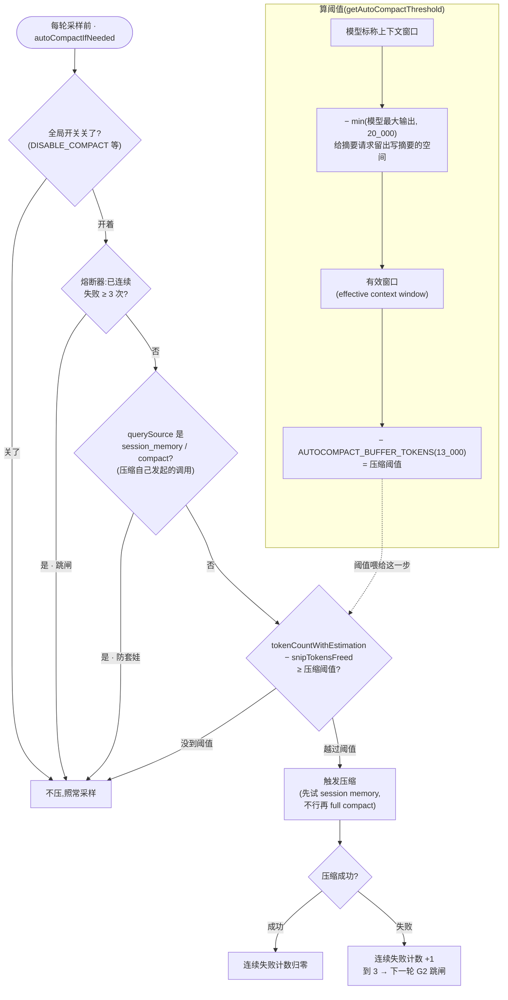
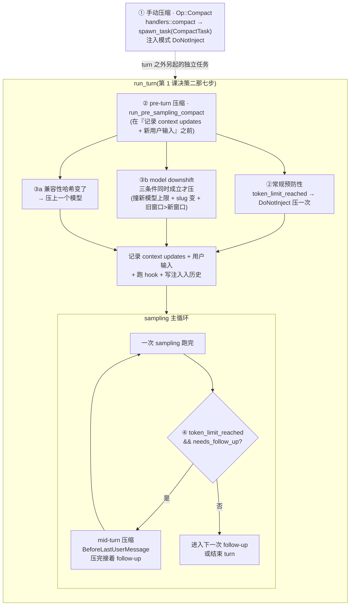
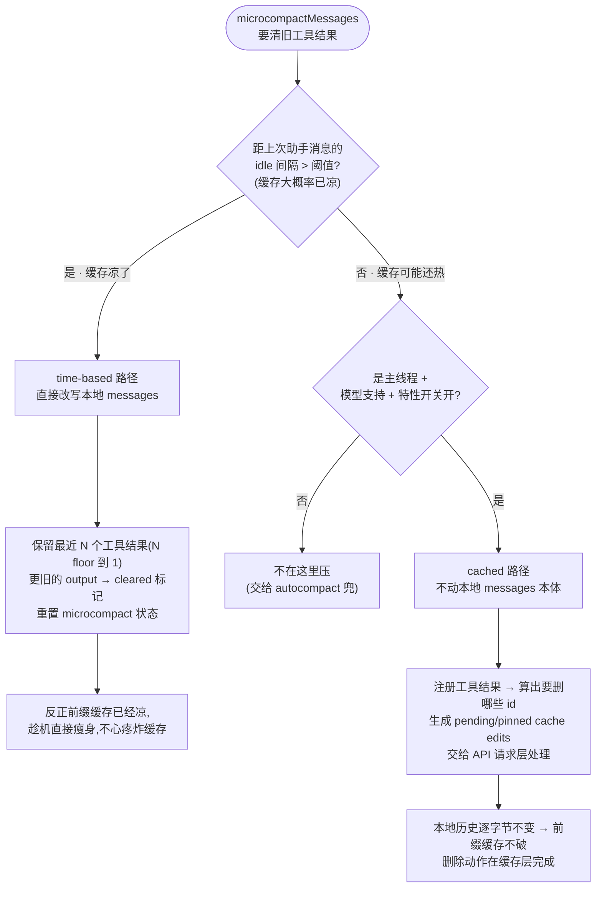
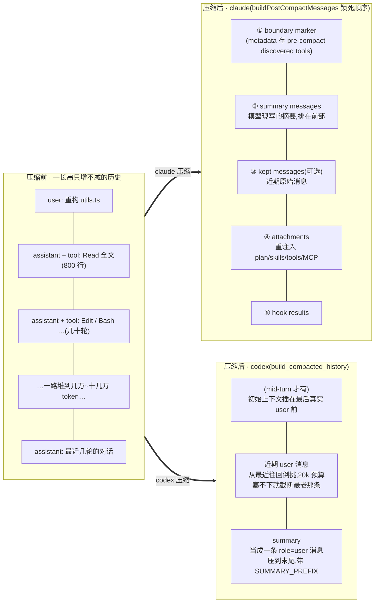

# 第 3 课：上下文工程与压缩

> 面向 deepseek 自研的 agent runtime 设计课。基于 claude / codex 真实源码。
> 讲法：直接讲清每个设计决策的代码逻辑与取舍，claude 与 codex 双实现对照，每节给出 deepseek 的落地结论。
> 本课接第 1 课决策四留下的三条线：压缩为什么炸缓存、压缩为什么要重置 `reference_context_item` 基线、第 1 课决策二第 7 步带过的 mid-turn 压缩到底怎么压。这三条都在本课收口。

---

## 0. 为什么必须有压缩，以及压缩的根本矛盾

第 1 课讲清了一件事：会话历史是一个**只追加、不改写**的有序消息列表，这对缓存极友好——前缀逐字节不变，每轮只为末尾新增的增量付费。但这个设计有一个硬伤：**它只增不减**。每跑一个工具、模型每说一段话，历史就长一截。一个稍微复杂的任务跑几十轮，历史能堆到几万、十几万 token，迟早撞上模型的上下文窗口上限（context window）。撞上之后，要么 API 直接报错拒绝，要么你被迫截断——而粗暴截断会把工具调用和它的结果切散、把关键决策切掉，直接让模型懵掉。

所以每个严肃的 agent runtime 都必须有一套**压缩（compaction）**机制：在历史撑爆窗口之前，主动把它缩短。

但压缩有一个绕不开的根本矛盾，你必须先把它刻在脑子里，后面所有设计决策都是在这个矛盾里权衡：

1. **压缩是有损的。** 你把前面几万 token 的历史换成一段几百 token 的摘要，被换掉的细节就永久丢了——那个文件的具体内容、那次报错的完整 stack、模型中途试过又放弃的三个方案，摘要里不可能全留。压缩压得越狠，省的越多，但模型"失忆"得也越厉害。
2. **压缩会炸缓存。** 这是第 1 课决策四 A2 埋的线，现在说透：压缩的本质动作是**改写历史**——把列表前面一大段替换成摘要。而 prompt 缓存只认"从头逐字节一致的前缀"。一旦你从中间改写，改写点往后的前缀全变了，之前辛苦暖热的缓存**整段作废**，压缩后的第一轮要为新前缀付全价重算。

也就是说，压缩不是"免费瘦身"，它是一笔**双重付费**：付出信息损失，还付出一次缓存重建。所以压缩设计的全部艺术，就是回答四个问题：

- **什么时候压？**（决策一：触发与阈值）——压早了浪费、压晚了撞墙。
- **压什么、压多狠？**（决策二：压缩的粒度家族）——能轻轻刮一层就别动大手术。
- **压完产出什么结构？**（决策三：replacement history）——摘要 + 保留哪些 + 怎么排。
- **压完要重建什么？**（决策四：失效与重置）——这是最容易被忽略、却最容易出 bug 的部分。

外加一条贯穿始终的安全底线（决策五）：压缩绝不能把历史改成模型无法理解的残状态。

下面逐个拆。claude 和 codex 在这四个问题上的做法差异很大，差异本身就是这一课的重点。

---

## 决策一：什么时候压 —— 触发判定与阈值

### 问题

压缩的触发点选哪、阈值定多少，直接决定体验。定太低（比如用到一半窗口就压），你在没必要的时候反复炸缓存、反复丢信息；定太高（用到 99% 才压），压缩请求自己都发不出去——因为生成摘要这个动作本身也要调一次模型，也要占输出 token，你得给它留出余量。

### 先讲清"有效上下文窗口"这个量（claude 的算法）

claude 不拿模型标称的窗口大小直接当阈值，而是先算一个**有效上下文窗口（effective context window）**:

```
有效窗口 = 模型上下文窗口 − min(模型最大输出 token, 20_000)   // 预留给摘要请求的输出
压缩阈值 = 有效窗口 − AUTOCOMPACT_BUFFER_TOKENS(= 13_000,再扣一段安全缓冲)
```

注意那个预留量准确说是 **`min(模型最大输出 token 数, 20_000)`**，不是无条件的 20k——源码常量 `MAX_OUTPUT_TOKENS_FOR_SUMMARY = 20_000`（注释说依据是"摘要输出的 p99.99 ≈ 17,387 token"），但对最大输出本来就小于 20k 的模型，只能按它的最大输出来扣。为什么要先扣掉这一段：**生成摘要这件事本身是一次模型调用，它要往外吐一大段摘要文本，这段输出也要占窗口。** 如果你等历史几乎填满整个窗口才触发压缩，那一刻已经没有空间让模型把摘要写出来了——压缩请求自己就会超限失败。所以 claude 故意把"用户可用的窗口"看得比标称值小一截，把这 20k 留给压缩动作自己用。代价是用户感觉可用上下文变小了，换来的是压缩请求几乎不会因为没地方写摘要而二次失败。

另外有个环境变量 `CLAUDE_CODE_AUTO_COMPACT_WINDOW`，能把这个窗口上限人为调得更小（取 `min(模型窗口, 你设的值)`）——用于强制更早压缩的测试或特殊场景。

判定本身：`shouldAutoCompact()` 用 `tokenCountWithEstimation(messages) − snipTokensFreed` 算出当前历史的 token 估值（`snipTokensFreed` 是已经被其它轻量手段省下的量，要从里减掉避免重复计），再通过 `calculateTokenWarningState()` 看它有没有越过压缩阈值。

### claude 的熔断保护：别在压缩失败时无限重试

`autoCompactIfNeeded()` 进来先查两件事再决定压不压：全局开关（`DISABLE_COMPACT` / `DISABLE_AUTO_COMPACT` / 配置项 `autoCompactEnabled`）、以及一个**熔断器（circuit breaker）**。

熔断器靠一个 `AutoCompactTrackingState` 状态记账，里面有：本轮是否已经压过、turn 计数、turn id、以及**连续失败次数**。一旦连续失败次数撞到 `MAX_CONSECUTIVE_AUTOCOMPACT_FAILURES = 3`，熔断器跳闸，停止继续尝试自动压缩。

这个设计是必要的：压缩要调模型，模型调用会失败；如果"压缩失败 → 历史还是太长 → 下一轮又触发压缩 → 又失败"形成死循环，会把用户卡在一个反复报错、反复烧钱的状态里。连续 3 次就放手，是给这个循环装的保险丝。

`shouldAutoCompact()` 还会主动**避开递归场景**：如果当前这次请求的来源（querySource）本身就是 `session_memory` 或 `compact`（即它本身就是一次压缩动作发起的模型调用），就不再触发压缩——否则"压缩里又触发压缩"会套娃。

### 把这套判定画成一张图

claude 这一侧从"算阈值"到"决定压不压"的全过程，串起来是这样一条流：先用模型标称窗口扣两段（摘要预留 + 安全缓冲）算出压缩阈值，再在每轮采样前拿当前历史的 token 估值跟它比；但在真的去压之前，还有三道前置闸——全局开关、熔断器、递归来源——任何一道命中都直接放弃这次压缩。注意熔断器那道闸：它不是压缩失败后才检查，而是**进门第一件事**就查"上几轮是不是已经连续失败 3 次了"，是就根本不再尝试。



这张图把前面三个子节收成一条线读：左上角的 `CALC` 块是"阈值怎么来的"（窗口减两段），主干是"每轮进来后怎么决定压不压"（三道前置闸 → 比阈值 → 压），右下角是"压完怎么记账给熔断器"（成功归零、失败累加，累到 3 就在下一轮的 `G2` 处把自己挡在门外）。

### codex：四个触发点，挂在 turn 的不同位置

codex 没有"一个总阈值判定函数"，而是把压缩触发**散布在 turn 生命周期的四个位置**，每个位置的语义不同（这几个点第 1 课决策二讲 `run_turn` 时点过名，这里补全）：

1. **手动压缩**：用户/客户端显式提交 `Op::Compact`（第 1 课决策一讲过的 Op 枚举里那个）。`session/handlers.rs::compact` 建一个默认 turn context，然后 `spawn_task` 起一个 `CompactTask`。这是唯一一条"用户主动要求压"的路径。
2. **pre-turn 自动压缩**(`run_pre_sampling_compact`)：在 `run_turn` 里、**记录本轮 context updates 和新用户输入之前**就先跑一次。它先尝试"上一个模型的兼容性压缩"（下面第 3 点），再按 `auto_compact_token_status` 判断要不要以 `DoNotInject` 模式跑一次 pre-turn 压缩。语义是：这一轮开始采样前，先看历史是不是已经太长了，太长就先压再开工。
3. **换模型 / 降配压缩（model downshift）**：当压缩兼容性哈希变了（比如换了个对历史格式要求不同的模型），触发"上一个模型的压缩"；否则，只有在**三个条件同时成立**时才以 `ModelDownshift` 触发：① 活跃上下文 token 撞到了新模型的上限——这一条还分两种口径（由配置 `model_auto_compact_token_limit_scope` 决定）：`Total` 口径下是"活跃 token **超过新模型的 auto-compact 上限** 或 ≥ 新模型窗口"，`BodyAfterPrefix` 口径下只看"≥ 新模型窗口";② 模型 slug 变了；③ 旧窗口大于新窗口。语义是：你从一个大窗口模型切到一个小窗口模型，历史可能在新模型下就超了，得先压到新模型装得下。
4. **mid-turn 自动压缩**（第 1 课决策二第 7 步埋的线，这里说透）：一次 sampling 跑完之后，如果 `token_limit_reached && needs_follow_up` 同时成立——也就是**这一轮还没结束（模型还要继续干）、但 token 已经撞上限了**——turn loop 就调用 `run_auto_compact(..., BeforeLastUserMessage, ContextLimit, MidTurn)`，压完接着在同一个 turn 里继续 follow-up 循环。

这四个点对应四种"历史变长"的真实成因：用户主动、新一轮开始前已经太长、换了小模型、以及一轮内部工具来回太多当场撑爆。把触发点拆到这四处，而不是塞进一个总阈值函数，好处是每个点能用最贴合的切割策略（注意第 4 点的 `BeforeLastUserMessage` 和第 2 点的 `DoNotInject` 不一样，这个区别是决策三的核心，下面讲）。

把这四个点挂到第 1 课讲过的 `run_turn` 时间轴上，就能看清它们各自卡在 turn 的什么位置、用什么注入模式：手动压缩是 turn 外另起的一个任务；pre-turn 的两个点（换模型兼容性压缩、降配压缩、常规预防性压缩）全挤在"记录用户输入之前"那一小段；mid-turn 那个点则在 sampling 循环内部、一次采样跑完后才可能触发。



读这张图抓两条对照线：① **位置决定时机**——②③ 在采样前（这一轮还没开始，压完下一轮可以从容重注入完整上下文），④ 在采样后的循环内（这一轮还没结束、压完必须当场把上下文补回去接着跑）；② **位置决定注入模式**——前三个点压完都是 `DoNotInject`（交给后续正常流程重注入），只有 mid-turn 那个点是 `BeforeLastUserMessage`（当场重建初始上下文插回去）。这个"时机 → 注入模式"的对应，就是决策三要展开的核心。

### 取舍

claude 是"一个集中的阈值判定 + 熔断器"，逻辑收敛在 `autoCompactIfNeeded` 一处，好理解、好调参，但所有压缩都长一个样（都是 full/微 那几种）。codex 是"触发点分散到 turn 各处，每处带自己的语义和切割模式"，更精细——pre-turn 压完下一轮能重新注入完整上下文，mid-turn 压完必须当场把上下文补回去接着跑，这两种需求用一个总阈值函数是表达不出来的。

### 阈值其实是两个数字：触发点 + 压到多低，以及压缩抖动

前面只讲了一个数字——**什么时候开始压**（触发阈值）。但一个健康的压缩策略需要**两个**数字，第二个同样关键、还更容易被漏：**压到多低才停**（目标残留）。漏掉第二个，会掉进一个真实的失败模式，它有名字：**压缩抖动（compaction thrashing）**——压完没降多少 → 缓存还白炸了一次 → 没几轮又超了 → 再压再炸，反复烧钱反复丢信息。

要躲开它，先把两件事算清楚：

**一、这次缓存重建的代价 ≈ 你压完剩多少。** 压缩改写历史、前缀作废，压缩后那一轮要为**新前缀**（也就是压缩后剩下的那份历史）付全价。所以"剩多少"同时决定两件事：① 这一炮缓存重建有多贵（剩得多 = 贵）；② 离下次触发有多远（剩得多 = 马上又超 = 抖动）。**"剩多少"是同一个旋钮，拧小它，两个痛点一起缓解。**

**二、压完正常不该剩很多——剩太多说明尾巴被撑爆了。** 算笔账：190k 历史撞 200k 窗口要压，那段 190k **摘要出来能有多大？** 几百到两三千 token——摘要本来就是把一大坨浓缩成一小段。所以压完剩下的 = 摘要（小，约 2k）+ 保留的近期尾巴（kept tail）+ 重注入的运行期信息（小几 k）。**摘要是小头，真正决定剩多少的是那条尾巴留多长**（尾巴是什么、怎么挑，决策三细讲）。如果你压完真剩了 150k，只有一个解释：**你的尾巴就是 150k**——最近几轮塞了大块没截断的工具输出（某次 `Read` 了巨型文件、某条 shell 吐了几万行）。这时"剩 150k"不是压缩的正常产出，是个**症状**：尾巴被未截断的大块输出撑爆了。正常应该剩 20–30k、留着 170k 余量，而不是剩 150k、留 50k 等着马上再炸。

所以防抖动的杠杆其实是**"少压、狠压"，而不是"勤压、浅压"**:

- **触发点贴着顶**（就是前面那个有效窗口阈值）：让历史尽量长到接近上限才压，把一次压缩的成本摊到尽量多的轮次上；
- **压就压狠、尾巴留短**：摘要本来就小，关键是 kept tail 别留太长，剩得少 → 余量大 → 很久不用再压；
- **upstream 先把尾巴里的大块输出截掉**：这正是第一档微压缩（决策二）和第 1 课决策四 D"工具输出按 policy×1.2 截断"的价值——别让一个巨型工具结果原样进尾巴。压完残留还高，先查尾巴是不是没截干净，**别急着再压一次**（再压只是再炸一次缓存，治标不治本）；
- session memory 那个**"还超阈值就返回 null"**的闸（决策二第二档），本身就是在拒绝"压完还这么高"的结果，逼 full compact 去压更狠（还能 PTL 重试删最老的）。

### deepseek 落地

1. **阈值不要拿模型标称窗口直接算，先扣掉"摘要请求自己要用的输出预算"**（claude 那 20k）。这是新手最容易漏的一步，漏了就会出现"快满了想压、却因为没地方写摘要而压缩失败"的死结。
2. **装一个熔断器**。压缩要调模型、会失败；给"连续失败 N 次就停止自动压缩"留个计数器，别让压缩失败形成死循环烧钱。claude 的 3 次可直接抄。
3. **触发点至少分两类**：一类是"新一轮开始前的预防性压缩"（对应 codex pre-turn / claude autoCompactIfNeeded），一类是"一轮内部当场撑爆的应急压缩"（对应 codex mid-turn）。这两类压完之后对上下文的处理不一样（决策三），从一开始就分开，别合成一个函数。
4. **防递归**：压缩动作自己也是一次模型调用，要在判定里识别"这次调用是不是压缩自己发起的"，是就不再触发压缩，避免套娃。
5. **设两个数字，不是一个**：触发阈值（高，贴窗口顶）+ 压缩目标残留（低，留大余量）。绝不能让"压完剩多少"自由浮动到刚好卡在阈值底下——那等于亲手设计了抖动。残留还高时先查尾巴（大块工具输出截没截），别靠"再压一次"硬刚——再压只是再炸一次缓存。原则是少压、狠压，不是勤压、浅压。

〔源码锚点：claude 有效窗口 = 模型窗口 − `min(getMaxOutputTokensForModel, MAX_OUTPUT_TOKENS_FOR_SUMMARY=20_000)`、`CLAUDE_CODE_AUTO_COMPACT_WINDOW` 取 min、阈值 = 有效窗口 − `AUTOCOMPACT_BUFFER_TOKENS=13_000` = `services/compact/autoCompact.ts:30,33-48,62,72-91`；`shouldAutoCompact` 用 `tokenCountWithEstimation − snipTokensFreed` 比 `calculateTokenWarningState` + 递归来源 `session_memory`/`compact` 直接返回 false = `autoCompact.ts:160-238`、`query.ts:397-405,637-638`；`autoCompactIfNeeded` 进门查 `DISABLE_COMPACT` + 熔断 `consecutiveFailures >= MAX_CONSECUTIVE_AUTOCOMPACT_FAILURES=3`、成功归零失败累加 = `autoCompact.ts:70,253-265,332,341-349`；先试 `trySessionMemoryCompaction` 再 `compactConversation` = `autoCompact.ts:288-326`。codex 四触发点：手动 `Op::Compact`→`handlers::compact`→`spawn_task(CompactTask)` = `core/src/session/handlers.rs:444-447,798`；pre-turn `run_pre_sampling_compact`（在记录用户输入之前、`DoNotInject`）= `core/src/session/turn.rs:154,799-819`；换模型 `maybe_run_previous_model_inline_compact`（comp_hash 变→压上一模型；否则 ModelDownshift 三条件 `previous_model_limit_reached && slug != && old_window > new_window`，且 `Total` 口径 `tokens > new_auto_compact_limit || tokens >= new_window`、`BodyAfterPrefix` 口径 `tokens >= new_window`）= `turn.rs:821-900`、`config/mod.rs:629`；mid-turn `token_limit_reached && needs_follow_up → run_auto_compact(BeforeLastUserMessage, ContextLimit, MidTurn)` = `turn.rs:266-267,305-314`；`auto_compact_token_status` 两口径 = `turn.rs:749-796`。〕

---

## 决策二：压什么、压多狠 —— 压缩的粒度家族

### 问题

"压缩"不是一个动作，而是一个**按激进程度排开的家族**。最轻的只刮掉一些早就没用的工具输出，最重的把整段历史换成一句摘要。一个成熟的 runtime 会优先用最轻的手段，不行再升级。如果你只实现"一种压缩"（通常是最重的那种 full compact），那就等于无论历史里是什么，都直接上大手术，既浪费又丢信息。

这里有一个关键认知：**claude 和 codex 的"三档"切的是不同的轴**，别混淆——

- **claude 的三档切的是"丢多少"（激进程度轴）**:microcompact（只删旧工具结果）→ session memory compact（用已提取的会话记忆替历史）→ full compact（整段摘要）。
- **codex 的三档切的是"谁来生成摘要"（执行位置轴）**:local（本地再调一次模型让它写摘要）→ remote v1（让 provider 的压缩接口生成）→ remote v2（普通 stream 里插一个压缩触发标记让模型产出）。

也就是说 claude 关心"压缩有多狠",codex 关心"摘要在哪算"。两个轴正交，理想的系统两个轴都要有。下面分别看。

### claude 的激进程度阶梯（从轻到重）

**第一档：microcompact —— 只清旧工具结果，不动对话主体。**

微压缩（`microcompactMessages`）只盯一类东西：**工具结果的 payload**。它有一个"可压缩工具集合"（`COMPACTABLE_TOOLS`，共 9 个）：`Read`、`Bash`、`PowerShell`（后两个来自 `SHELL_TOOL_NAMES`，是两个独立条目）、`Grep`、`Glob`、`WebSearch`、`WebFetch`、`Edit`、`Write`。这些工具的结果有个共性——**体积大、时效性强、过一会就没用了**。你 50 轮前 `Read` 出来的一个文件全文、`grep` 出来的一大坨匹配，模型早就基于它做完决策了，留着只占地方。微压缩就是把这些**陈旧的工具结果内容**换成一个"已清除"的占位标记，保留最近 N 个不动。

它有两条子路径，区别正好踩在第 1 课讲的缓存上：

- **time-based microcompact（改本地消息）**：如果距上次压缩的时间间隔超过阈值，它**直接改写本地 messages**——保留最近 N 个可压缩工具结果，把更旧的那些结果 content 替换成 cleared 标记，重置压缩状态，返回一份新的 messages。注意一个细节：保留数量 N 有个下限，被 floor 到 1——你配成 0 也不会把所有工具结果清空，至少留一个。
- **cached microcompact（不改本地消息，改缓存编辑）**：如果时间路径没触发，且这是主线程、模型支持、特性开关打开，就走这条。它**不动本地 messages 本体**，而是注册一遍工具结果、算出要删哪些工具 id、生成一批"待提交的缓存编辑（pending cache edits）/锁定的缓存编辑（pinned cache edits）"，交给 API 请求层去处理。

为什么要分这两条，答案就是缓存：**改本地 messages 会破坏前缀缓存**（决策零讲的根本矛盾），所以只有在"缓存大概率已经凉了"（时间间隔大）时才走 time-based 这条直接改写；只要缓存还可能热，就走 cached 这条——把删除动作做成缓存层的编辑，**尽量少破坏 prompt 缓存**。这是把"省 token"和"保缓存"两个目标精细权衡后的产物。

把这个分流画成判定图，关键的岔口只有一个——**缓存现在大概率是凉是热**——而它的代理信号是"距上次助手消息隔了多久"：



读图记住这条对照：**两条路删的是同一批旧工具结果，差别只在"动不动本地 messages"**——缓存凉了就直接改写本地（time-based，反正没缓存可炸），缓存还热就只发缓存层编辑、本地一字不改（cached，保住前缀命中）。这正是"省 token"和"保缓存"被精细权衡后的产物：能不炸缓存就不炸。

具象一下 time-based 微压缩干了什么（示意）：

```
// 压缩前:50 轮前那个 Read 的全文还原样躺在历史里
{ role: "tool", content: { call_id: "c7", output: "export function foo() { …(整整 800 行文件全文)… }" } }

// 微压缩后:内容被换成清除标记,这条消息还在(占位、配对关系不破),但体积归零
{ role: "tool", content: { call_id: "c7", output: "[tool result cleared to save context]" } }

// 而最近 N 轮的工具结果原样保留,不动。
```

注意它**没删整条消息**，只把 `output` 内容换成标记。为什么不整条删？因为那条 `tool` 消息和它对应的 `tool_call`（`call_id: c7`）是配对的，整条删掉会留下一个没有结果的孤儿调用，模型会困惑（这正是第 1 课决策四 C 讲的 normalize 要修的那种残状态）。所以微压缩的做法是**保留骨架、掏空内容**：配对关系完好，只是内容变成一句"这里原本有个工具结果，清掉了"。

**第二档：session memory compact —— 复用"边跑边攒的会话记忆"，而不是现场写摘要。** 这一档最容易和 full compact 混，先把两者一句话区分开：

> **full compact 是压缩这一刻把整段历史发给模型、让它当场写一段摘要（要额外调一次模型）；session memory compact 是复用一份"会话过程中后台一直在攒"的记忆当摘要（摘要的钱在会话过程中已经分期付过了）。**

这条"边跑边攒"的线第 1 课点过名——决策三讲 turn 末尾的背景簿记时提的"记忆抽取、auto-dream"就是它：每一轮结束，有个后台动作把这一轮的要点抽出来，**增量地**攒进一份叫**会话记忆（session memory）**的结构化文档。它不是历史本身，是历史的一个一直在维护的浓缩版。所以 claude 在 `autoCompactIfNeeded` 触发后**优先试它**（先调 `trySessionMemoryCompaction()`，不行才 full compact）：这份记忆是顺手攒下的、成本已经分期付过，拿现成的去压，比临时再调模型从头写摘要划算。

**它具体怎么压，关键是一条水位线。** 会话记忆维护一个"上次摘要到哪了"的指针（last summarized id），记着"历史里到这条为止，内容都已经折进记忆了":

```
历史:  [ 旧消息1 旧消息2 … 旧消息K | 近消息K+1 … 近消息N ]
                              ↑
                     last summarized id(水位线)
        └──── 水位线之前 ────┘ └──── 水位线之后 ────┘
         已经在会话记忆里 → 可丢      还没进记忆 → 必须留
```

于是压缩很简单：**丢掉水位线之前的（记忆里已有、冗余）、留下水位线之后的近期尾巴（还没进记忆）**,replacement history ≈ `[会话记忆当摘要] + [水位线之后的尾巴]`。它选保留区间时和 full compact 一样小心，**不切开 tool_use/tool_result 对**，还会过滤掉旧的压缩边界；压成功后把水位线重置、跑清理、通知缓存中断检测器。它还能处理 normal 和 resumed（会话恢复）两种场景——关掉再打开旧会话，记忆能重新挂上接着用。

两种压缩压完长什么样，对照一下就清楚区别在"摘要从哪来":

```
// full compact 压完(摘要是这一刻现生成的):
[ boundary ]
[ summary: "用户要重构 utils.ts,已读全文、改了 3 处、测试通过,当前在修类型错误…"(模型刚写的)]
[ kept: 最近几条原始消息 ]

// session memory compact 压完(摘要 = 早就攒好的会话记忆):
[ boundary ]
[ 会话记忆: "项目用 pnpm。utils.ts 已重构完成。用户偏好函数式。待办:修 type error"(分期攒的)]
[ kept: 水位线之后、还没进记忆的近期尾巴 ]
```

**它会失败，然后退回 full compact——这一点最容易漏。** session memory compact 不一定够用，这几种情况它直接返回 null、把活让给 full compact:① 特性没开 / 这个会话压根没攒下记忆 / 记忆是空的（比如刚开会话没几轮）；② 用记忆 + 短尾巴压完之后 token 数**仍然超阈值**（典型：水位线之后那段尾巴本身就太长，光丢水位线之前的不够）。所以这两档是个**"先试便宜的，不够再上贵的"级联**:session memory 优先（复用记忆、留短尾）→ 不够 full compact 兜底（现场把整段重新摘要，还能 PTL 重试删最老的硬压下去）。

**第三档：full compact —— 整段历史换成摘要。** 这是最重的一档，也是大多数人说"压缩"时默认想到的那种。流程在决策三细讲。

这三档构成一个升级链：**能微压缩就微压缩（只刮工具结果）→ 不够就用现成的会话记忆压 → 还不够才上 full compact 把整段历史换成摘要。** 越往后丢的信息越多、炸缓存越狠，所以越靠后越是"最后手段"。

### codex 的执行位置阶梯（谁来生成摘要）

codex 的 `CompactTask::run`（以及自动压缩的 `run_auto_compact`）会基于"provider 支不支持远程压缩"和一个 `Feature::RemoteCompactionV2` 开关，在三条路径里选一条：

- **local（本地压缩）**:codex 自己把一段压缩提示词（配置里的 `compact_prompt`，没配就用默认的 `SUMMARIZATION_PROMPT`）合成为一条 user 输入，克隆当前历史、把这条提示词记进去，然后走一次**普通的流式模型调用**让模型写出摘要。如果这次压缩请求自己都超了上下文窗口、且历史项不止一条，就删掉最早的一条历史再重试。摘要拿到后，从历史里取模型最后那段 assistant 输出当摘要正文，拼上 `SUMMARY_PREFIX` 前缀。**本质是"让模型自己读一遍历史然后写个摘要"。**
- **remote v1（远程压缩）**:provider 提供了专门的压缩接口时走这条。codex 先用 `trim_function_call_history_to_fit_context_window` 把尾部的工具输出改写到能塞进窗口，再带上"模型可见的工具规格 + 是否并行工具调用"等信息，调 provider 的 `compact_conversation_history`，**让 provider 那边算出压缩后的历史**返回。
- **remote v2**：更新的远程路径。它在 prompt 输入的末尾追加一个特殊的 `ResponseItem::CompactionTrigger`（压缩触发标记），走**普通的 stream**，但要求这条 stream 必须**恰好产出一个** `ResponseItem::Compaction`（压缩产物）；拿到后，保留 prompt 里的部分 user/developer/system 消息，经过共享过滤器和一个 **64k 的保留消息 token 预算**截断，再把压缩产物接在后面组成新历史。

这三条的差别纯粹是"摘要这个计算发生在哪、由谁触发"，对上层"压缩"这个概念是透明的——三条最后都构造出一个 `CompactedItem` 并调用 `Session::replace_compacted_history` 装回去。

### 两个轴要合起来看

把两套放一起，你会看到一个 2×N 的设计空间：

| | claude（丢多少） | codex（谁算摘要） |
|---|---|---|
| 最轻 | microcompact：只把旧工具结果换成占位标记，对话主体不动 | —— |
| 中 | session memory：用已攒下的会话记忆替历史，留短尾 | local：本地再调一次模型写摘要 |
| 最重 | full compact：整段历史 → 一段摘要 | remote v1/v2:provider 侧生成压缩历史 |

理想的 runtime 两个轴都该有：**先在"丢多少"轴上尽量选轻的**（能只删工具结果就别整段摘要），**真要整段摘要时再在"谁来算"轴上选**（本地多调一次模型，还是甩给 provider 的压缩接口）。claude 把前一个轴做深了，codex 把后一个轴做全了。

### deepseek 落地

1. **不要只实现 full compact。** 至少先做"工具结果微压缩"这一档——它便宜（不调模型）、信息损失小（只删早就没用的大块工具输出）、还能通过"掏空内容但保留配对骨架"的手法把炸缓存降到最低。很多任务靠微压缩就能扛很久，根本不用上 full compact。
2. **微压缩盯"体积大 + 时效性强"的工具结果**（文件全文、搜索结果、网页抓取），保留最近 N 个（N 设个下限别清空），旧的换成占位标记，**别整条删**（留着配对骨架，免得制造孤儿调用）。
3. **微压缩"直接改写历史 vs 精细删除"的分流，取决于缓存还热不热；而"热不热"是 provider 相关的，别抄 claude 的 5 分钟。** TTL（Time To Live，存活时间）= 一份缓存连续多久没人命中就过期（Anthropic 是 5 分钟量级、每次命中刷新倒计时）；claude 的 time-based 路径就是用"idle 间隔超过这个量级"来猜缓存凉了、于是放心改写瘦身。这个阈值在 deepseek 里是**配置项不是常数**:DeepSeek 的硬盘上下文缓存可能比 5 分钟扛得久得多，但 best-effort、不保证、不可设，要先去官方文档核实**过期行为 / 作用域 / 最小粒度 / 命中计费比**这四项，再定阈值，且全部当 config flag + 测试项，别写死。
4. **比"用时间猜缓存凉没凉"更好的牌：用实测命中率。** DeepSeek 每次响应的 usage 会直接报告这次命中了多少 token（`prompt_cache_hit_tokens` / `prompt_cache_miss_tokens` 一类，字段名待核实）。直接拿上一轮的实测命中当"我的缓存还热不热"的真信号去驱动分流——命中高就别乱改写、命中塌了就放心瘦身——比 claude 的时间代理更准；时间阈值退居"还没有上一轮数据时的兜底估计"。
5. **full compact 前先看有没有现成的会话记忆可复用**（对应 claude session memory 优先）。如果你的 agent 本来就在抽取结构化记忆，压缩时复用它，比临时再生成摘要省。
6. **"谁来生成摘要"这个轴，M0 先做 local 就够**（本地多调一次模型写摘要，实现最简单）。等以后 DeepSeek API 提供专门的压缩端点了，再加 remote 路径，上层 `replace_compacted_history` 不用动。

〔源码锚点：claude microcompact 只盯 `COMPACTABLE_TOOLS`（`FILE_READ` + `SHELL_TOOL_NAMES`[Bash,PowerShell] + Grep/Glob/WebSearch/WebFetch/Edit/Write 共 9 个）= `services/compact/microCompact.ts:41-50`、`utils/shell/shellToolUtils.ts:6`；`microcompactMessages` 先试 time-based、再 cached（主线程 + 模型支持 + 特性开关）= `microCompact.ts:253-293`；time-based 直接改写本地、`keepRecent` floor 到 1、content 换 `TIME_BASED_MC_CLEARED_MESSAGE`、`resetMicrocompactState` = `microCompact.ts:446-529`；cached 不改本地、注册工具结果 → `getToolResultsToDelete` → `pendingCacheEdits` 交 API 层 = `microCompact.ts:305-399`；session memory compact 靠水位线 `lastSummarizedMessageId`、不切 tool 对、过滤旧 boundary、仍超阈值返回 null、处理 resumed = `services/compact/sessionMemoryCompact.ts:514-630`；级联里先 `trySessionMemoryCompaction` 不行才 `compactConversation` = `autoCompact.ts:288-326`。codex `CompactTask::run`/`run_auto_compact` 按 `should_use_remote_compact_task` + `Feature::RemoteCompactionV2` 选 local/remote-v1/remote-v2 = `core/src/compact.rs:69`、`core/src/session/turn.rs:907-951`；local 用 `compact_prompt`/默认 `SUMMARIZATION_PROMPT`、普通流式调模型写摘要、超窗 `turn_input_len>1` 时 `remove_first_item` 重试、取最后 assistant 段 + `SUMMARY_PREFIX` = `compact.rs:50-52,233-301`；remote v1 `trim_function_call_history_to_fit_context_window` + `compact_conversation_history` = `core/src/compact_remote.rs:192,243,361`；remote v2 末尾追加 `ResponseItem::CompactionTrigger`、要求恰好产出一个 `ResponseItem::Compaction`、保留消息按 `RETAINED_MESSAGE_TOKEN_BUDGET=64_000` 截断 = `core/src/compact_remote_v2.rs:51,441`；三条都构 `CompactedItem` 调 `replace_compacted_history` = `compact.rs:319-324`、`compact_remote.rs:286`、`compact_remote_v2.rs:316`。〕

---

## 决策三：压缩产出什么 —— replacement history 的结构

### 问题

压缩跑完，你要往会话里装回一份新的历史（replacement history）。这份历史里有哪些块、按什么顺序排，是一个**契约**——排错了，模型会读不懂、或者丢掉关键上下文。这一步看着简单，其实是压缩里最容易埋隐患的地方。

### claude：`buildPostCompactMessages()` 是唯一的排序契约

claude 把"压缩后历史长什么样"收敛成一个函数 `buildPostCompactMessages()`，它的顺序是**固定死的**:

```
[ ① boundary marker  ]  ← 压缩边界标记
[ ② summary messages ]  ← 摘要本体(模型生成的那段)
[ ③ kept messages    ]  ← 保留下来的近期原始消息(可选)
[ ④ attachments      ]  ← 重新注入的附件(见下)
[ ⑤ hook results     ]  ← 钩子产出
```

这五块的意义：

- **① boundary marker（压缩边界）**：一个显式的标记消息，昭示"这条线之前的历史被压缩过"。它不只是个分隔符——它的 metadata 里**存了压缩前已发现的工具列表（pre-compact discovered tools）**。为什么要存这个？因为压缩会清掉一堆运行期状态（决策四细讲），边界标记相当于一个"压缩现场的快照"，留着将来恢复/诊断用。
- **② summary messages**：模型生成的那段摘要，是被替换掉的几万 token 历史的浓缩。
- **③ kept messages**：不是所有历史都压掉，最近一段原始消息会原样保留（让模型保有近期的完整细节，不至于连刚才干了啥都只剩摘要）。这一块是可选的。
- **④ attachments**：这块是 full compact 的精髓，也最容易被忽略。压缩时 claude 会**重新生成一批附件重新注入**：保留的文件、异步 agents、当前 plan、skills、deferred tools、agents 列表、MCP instructions。为什么压完要重新注入这些？因为这些是"模型干活必须知道、但可能被压进摘要里糊掉"的东西——比如当前的计划、可用的技能。与其指望摘要能完整复述它们，不如压完直接拿新鲜的重新拍上去。
- **⑤ hook results**：压缩前后跑的各类钩子（PreCompact / SessionStart / PostCompact）的产出。

**关键纪律：`buildPostCompactMessages()` 是所有压缩路径的唯一排序出口。** 源码里明确写了：新增任何一条压缩路径，都应该返回一个走这个顺序的 `CompactionResult`，**绝不要手写 post-compact 消息顺序**。这是一个典型的"把易错的顺序逻辑收敛到一处"的工程纪律——压缩路径可以有好几条（自动、手动、session memory），但拼装结果的顺序只有一份代码说了算。

`CompactionResult` 这个结构装的东西（忠于源码字段）：boundary marker、summary messages、attachments、hook results、可选的 kept messages、用于显示的 display text、以及一组 token 计数（压缩前 / 压缩后 / 真实压缩后三个数）和 usage。那三个 token 数是用来算"这次压缩到底省了多少"的度量。

### codex:`build_compacted_history` + 两种初始上下文注入模式

codex 装配 replacement history 的核心函数是 `build_compacted_history`，逻辑是：

1. 先 `collect_user_messages` 收集历史里**所有** user 消息，再**从最近的往回倒着挑**，按一个 token 预算（`COMPACT_USER_MESSAGE_MAX_TOKENS = 20_000`）收集要保留的近期消息（优先保住最近的对话）；
2. 如果预算不够、最老的那条保留消息塞不下，就**截断它**;
3. 把摘要作为一条 **role = user 的 `ResponseItem::Message`** 压到**末尾**。

注意第 3 点和 claude 不一样：claude 的摘要是 `summary` 类消息排在前部，codex 是把摘要当成一条 user 消息放在最后。这是两家对"摘要在历史里以什么身份出现"的不同选择，没有绝对优劣。

但 codex 这里有一个 claude 没有的、而且**直接接第 1 课的关键机制**：压缩产出的历史要不要带"完整初始上下文"，由一个枚举 `InitialContextInjection` 控制，它只有两个值：

- **`DoNotInject`（不注入）**：用于 **pre-turn 压缩和手动压缩**。replacement history **不带**初始上下文，并且把 `reference_context_item`（第 1 课决策四 C2 讲的那个增量注入基线）**设为 `None`**。语义是：这次压缩之后，本轮就结束了/下一轮是全新一轮，**下一个 regular turn 会自然地重新注入一份完整初始上下文**（因为基线被清成 None 了，第 1 课 C2 讲过——没基线就走全量注入）。所以这里不用在压缩产物里塞初始上下文，交给下一轮的正常流程去补。
- **`BeforeLastUserMessage`（插在最后一条真实 user 消息前）**：用于 **mid-turn 压缩**（决策一第 4 点那个）。这种情况下，**这一轮还没结束、压完要在同一个 follow-up 循环里接着采样**，不存在"下一轮重新注入"的机会。所以它必须**当场把一份新鲜的初始上下文重建出来**，插到 replacement history 里最后一条真实 user 消息之前（没有真实 user 消息就回退到 summary / compaction item 前、再不行就追加到末尾），并把 `reference_context_item` 设成当前 turn context。

这就把第 1 课决策二第 7 步那句"mid-turn 压缩以 `BeforeLastUserMessage` 为切点"讲透了：**切点选在"最后一条真实用户消息之前"，是为了让重新注入的初始上下文（环境、权限、工具清单）出现在用户那句话之前**——符合"先有环境设定、再有用户提问"的自然顺序，模型读起来才顺。

### 一张图看清压缩前后历史的结构变化

把"压缩前一长串历史"和"压缩后两家各自拼成什么"摆在一起，结构差异一目了然。同一份长历史，claude 压完是"边界→摘要在前部→近期尾巴→重注入附件"，codex 压完是"近期 user 倒挑→摘要当 user 消息压末尾"（mid-turn 还会在最后一条真实 user 前插一份初始上下文）：



对照这两套布局，抓住三处区别：① **摘要的位置**——claude 在前部（②）、codex 在末尾；② **摘要的身份**——claude 用专门的 `summary` 类消息、codex 把它当一条普通 `user` 消息（所以要靠 `SUMMARY_PREFIX` 前缀和真用户的话区分开）；③ **附件**——claude 压完主动重注入一大批运行期信息（plan/skills/tools/MCP），codex 只在 mid-turn 当场补一份初始上下文、其余交给下一轮正常流程。

`CompactedItem` 这个产物结构：local 路径里 `message` 存摘要正文 + replacement_history + 新的压缩窗口 id;remote v1/v2 路径里 `message` 是空字符串（因为摘要在 replacement_history 里），但同样存 replacement_history 和窗口 id。**有个坑要记**：消费 rollout（回放历史）时不能只看 `message` 字段——remote 路径它是空的，真正的内容在 `replacement_history` 里。

### 取舍

claude 用一个集中的 `buildPostCompactMessages` 锁死顺序，并且压完**主动重新注入一大批附件**(plan/skills/tools/MCP)，倾向于"压完也要保证模型手里该有的运行期信息都是新鲜齐全的"。codex 用 `InitialContextInjection` 两态精确控制"这次压缩要不要带初始上下文"，把它和"压完是新一轮还是接着同一轮"这个时机精确挂钩——更省（该不注入时就不注入），但要求你想清楚每个触发点压完之后是什么时机。

### deepseek 落地

1. **把"压缩后历史的拼装顺序"收敛到一个函数**，所有压缩路径都从它出。claude 这条纪律照抄——顺序逻辑散在多处，迟早有一条路径排错把工具调用/结果切散。
2. **压完别忘了重新注入"运行期必备信息"**（当前计划、可用工具、可用技能）。别指望摘要能完整复述这些。claude 的 attachments 重注入是值得抄的：压完拿新鲜的拍上去，比信任摘要可靠。
3. **区分"压完是新一轮还是接着同一轮"**（对应 codex 的两个注入模式）。新一轮：不用在压缩产物里塞初始上下文，清空基线让下一轮正常流程去补。接着同一轮：必须当场把初始上下文重建并插回去，插在最后一条用户消息之前。这正是决策一里"触发点要分两类"的下游结果。
4. **摘要在历史里放哪、用什么 role**,claude（前部、summary 类）和 codex（末尾、user 类）都行，选一个并固定。重点是别让摘要看起来像"用户说的话"和"真用户的话"混在一起难以区分——给它一个明确前缀（codex 的 `SUMMARY_PREFIX`）。

### 拿一段长会话走一遍（带具体 token 数）

把决策一到决策三连起来，看一段真实长会话怎么撞窗口、怎么触发、压成什么、怎么接着跑。设用 claude、模型标称窗口 200k、最大输出 16k（小于 20k，所以摘要预留按 16k 扣），那么：

- 有效窗口 = 200k − min(16k, 20k) = 200k − 16k = **184k**；
- 压缩阈值 = 184k − 13k(buffer) = **171k**。

会话从第 1 课那句「重构 utils.ts」开始，一路扩到一个大型重构任务，跑了几十轮：

```
第 1~40 轮:历史从 ~3k 长到 ~120k
  ├─ 中间有一次 idle:用户去开会 8 分钟才回来发下一句
  │   → 这一轮进 microcompactMessages,idle 8min > 阈值
  │   → 走 time-based 路径,把 30 轮前那几个 Read 全文、Grep 大结果
  │     content 换成 cleared 标记,省下 ~22k,历史回落到 ~98k
  │     (缓存反正凉了,直接改写本地不心疼)
第 41~60 轮:又堆了一堆工具来回,历史涨到 173k —— 越过 171k 阈值
```

第 61 轮采样前 `autoCompactIfNeeded` 进来：全局开关开着、熔断器没跳（没连续失败）、querySource 是正常主线程不是压缩自己——三道闸全过，`tokenCountWithEstimation` 算出 173k ≥ 171k 阈值，触发压缩。

```
触发后,先试 session memory compact:
  ├─ 水位线(last summarized id)在第 50 轮 →
  │   水位线之前(1~50 轮,~140k)已折进会话记忆,可丢
  │   水位线之后(51~60 轮尾巴)~33k 必须留
  ├─ 用[会话记忆 ~2k] + [33k 尾巴]拼 replacement,
  │   合计 ~35k < 171k 阈值 → session memory compact 成功!
  └─ 不用再调模型现写摘要(摘要的钱在前 50 轮分期付过了)

压完的 replacement history(claude 顺序):
  [ ① boundary marker(metadata 存 pre-compact discovered tools) ]
  [ ② 会话记忆当摘要: "重构 utils.ts:已拆分 3 个函数、改了 import…待办:修 2 个 type error" ]
  [ ③ kept: 第 51~60 轮的原始尾巴 ]
  [ ④ attachments: 重注入当前 plan / 可用 skills / tools / MCP ]
  [ ⑤ hook results ]

历史从 173k → ~35k,留出 ~136k 余量。同时压缩收尾:
  ├─ readFileState.clear() → 那些被摘要掉的文件,模型"不记得读过",要用得重读
  ├─ notifyCompaction() → 告诉缓存层"我改写历史了,把读基线重设到压缩后前缀"
  └─ runPostCompactCleanup() → 清 system prompt 分段缓存 / 会话消息缓存 / microcompact 状态…
```

第 62 轮接着跑：模型看到的是「摘要 + 近期尾巴 + 新鲜附件」，它知道任务进度（修 type error），但前 50 轮的文件全文已经没了——如果它要再编辑某个早读过的文件，会先重新 `Read`（因为 `readFileState` 清空了，逼它重读最新版本，避免基于过时内容覆盖）。这一轮是压缩后第一轮，前缀全变了，要为新的 35k 前缀付一次全价；从第 63 轮起，这 35k 又变成可命中的稳定前缀，缓存重新滚起来。

整条线就把三个决策串成了一个故事：决策一的阈值（171k）决定第 61 轮触发；决策二的级联（先 microcompact 顶了一阵、撞阈值后先试便宜的 session memory）决定压多狠；决策三的 `buildPostCompactMessages` 决定压成什么结构；而 `readFileState.clear()` / `notifyCompaction()`（决策四）决定压完哪些状态要跟着失效。

〔源码锚点：claude `buildPostCompactMessages` 锁死顺序 boundary→summary→messagesToKeep→attachments→hookResults、是所有压缩路径唯一排序出口 = `services/compact/compact.ts:330-337`；`CompactionResult` 字段（boundaryMarker/summaryMessages/attachments/hookResults/可选 keptMessages/displayText/三个 token 计数/usage）+ boundary 的 `preCompactDiscoveredTools` = `compact.ts:300-303,598-608,1014-1025`。codex `build_compacted_history`：`collect_user_messages` 全收、`.rev()` 倒挑、`COMPACT_USER_MESSAGE_MAX_TOKENS=20_000` 预算、塞不下截断最老、摘要当 `role:"user"` Message 压末尾 = `core/src/compact.rs:52,540-610`；`InitialContextInjection` 两值（`DoNotInject` / `BeforeLastUserMessage`），mid-turn 用 `insert_initial_context_before_last_real_user_or_summary` + `reference_context_item` 设当前 turn context、其余设 None = `compact.rs:64-66,307-318`；`CompactedItem{message, replacement_history, window_id}`，remote 路径 `message` 为空、内容在 `replacement_history` = `compact.rs:319-323`、`compact_remote.rs`/`compact_remote_v2.rs` 同构。〕

---

## 决策四：压缩之后要重建什么 —— 失效与重置（最易被忽略的一节）

### 问题

这是整课最容易被低估的部分。大多数人以为压缩就是"把历史换成摘要"就完了。**错。** 压缩改写了历史，意味着一大堆"基于旧历史建立起来的状态"全部失效了，必须跟着重置或重建。漏掉任何一个，就会出现那种最难查的 bug：历史压过了，但某个缓存还指着压缩前的旧状态，行为开始诡异。

我把要重置的东西分三类：**缓存类、引用历史结构的状态类、跟踪类。**

### claude：压缩收尾的清理散在两处（`compactConversation` 本体 + `runPostCompactCleanup`）

这里要先纠正一个常见误读：**不是所有清理都在 `runPostCompactCleanup()` 一个函数里。** 我核过源码，清理实际散在两个地方，讲的时候按"在哪清"分开才不会张冠李戴：

**A. `compactConversation()` 本体里、压缩成功那一刻直接做的：**

- **通知 cache break detector（缓存中断检测器）**：压缩成功后，在开了 `PROMPT_CACHE_BREAK_DETECTION` 时调 `notifyCompaction(...)`（`compact.ts`）——这就是第 1 课决策四 A2 讲的"压缩炸缓存"在代码里的落点。压缩不是被动地让缓存失效，而是**主动告诉缓存层"我改写历史了，把缓存读基线重置一下，别把压缩后这次 token 骤降误判成一次缓存中断"**。为什么要主动通知？因为缓存层需要知道"从哪一点开始前缀变了"，好把基线重设到压缩后的新前缀上。（注意：session memory compact 那条路径**不**走 `compactConversation` 本体，所以它在 `autoCompactIfNeeded` 里**额外单独**补调一次 `notifyCompaction`——源码注释专门记了这点，说漏了会让约 20% 的 cache-break 事件变成误报。）
- **`readFileState` 清空**：这是"模型已经读过哪些文件、读到的是什么版本"的记录，在 `compactConversation()` 里压缩成功后直接 `.clear()`。清空意味着压缩前读过的文件，模型现在"不记得读过了"，要用得重新 `Read`。为什么要清？因为那些文件内容的完整版本本来躺在历史里（被 `Read` 工具结果记着），压缩把它们摘要掉了，模型手里只剩摘要里的只言片语。继续让 `readFileState` 标着"已读过、是 xx 版本"，模型就会基于一个它实际上已经看不全的状态去编辑文件，极危险（可能基于过时内容覆盖）。所以宁可清空，逼它重读。**这是"压缩有损"这个根本矛盾最具体的一个后果。**
- **`loadedNestedMemoryPaths` 清空**：紧挨着上一条（`compact.ts` 同一处），已加载的嵌套记忆路径记录清空，同理——记忆内容可能被压掉了，得允许重新加载。

**B. 收尾函数 `runPostCompactCleanup()` 里做的（各类缓存与跟踪状态）：**

- **session messages cache（会话消息缓存）**、**system prompt sections（系统提示词分段缓存）**：这些都是基于"旧消息列表"算出来缓存住的，历史一改写就全过期；
- 总是重置 microcompact 状态（微压缩的计时器等）；只在主线程压缩时重置 context collapse 和 memory file cache；清掉 classifier approvals（分类器审批缓存）、speculative checks（投机检查）、beta tracing（开了 commit-attribution 时还会扫一遍 file content cache）。

这两处合起来的共同逻辑只有一句话：**凡是"基于压缩前的历史/文件状态算出来并缓存住的东西"，压缩后一律失效。** 你新增任何一种"缓存了基于历史的计算结果"的机制，都得记得在收尾里加一句清理——否则就是一个潜在的"指向旧历史"的悬空状态。

### codex：`reference_context_item` 的重置 + history_version 自增

codex 这边的核心重置就是第 1 课决策四 C2 反复出现的那个 `reference_context_item` 基线。三条压缩路径最后都调 `Session::replace_compacted_history`，它做这几件事：

1. **`ContextManager::replace`**：把整个 `items`（历史消息向量）换成 replacement history，并且 **`history_version` 自增 1**。这个版本号自增是个聪明的设计——任何持有"我见过的历史版本号"的地方，一比对就知道历史被换过了，基于旧版本算的东西作废。
2. **替换 `reference_context_item`**：按决策三说的两种模式——pre-turn/手动压缩设成 `None`（逼下一轮全量重注入初始上下文），mid-turn 压缩设成当前 turn context（因为初始上下文已经当场插回历史里了，基线要对齐这个新状态）。
3. **持久化压缩后的 rollout item**，以及在有 turn context 时持久化 turn context 基线——保证崩溃恢复/回放时这次压缩能被正确重放。

还有个跨子系统的呼应：第 1 课决策四 C 讲的 `for_prompt → normalize_history`（送模型前补 aborted 结果、删孤儿、剥图）**在压缩之后照样会跑**。也就是说压缩负责"把历史变短",normalize 负责"保证变短后的历史自洽"——两道工序分工明确，压缩不用自己操心"我切完会不会留下孤儿调用",normalize 会在下一次送模型前兜底修。这是一个很值得学的解耦：**压缩只管缩，自洽性交给统一的 normalize 兜底。**

### 把两条线收口

第 1 课埋的三条线，到这里全部讲完了：

- **"压缩炸缓存"** → claude 主动通知 cache break detector + 清 session messages cache / system prompt sections;codex `history_version` 自增让旧版本失效。压缩是一次**主动的、昭告全系统的**缓存失效事件，不是悄悄发生的。
- **"压缩重置基线"** → codex `reference_context_item` 按两种模式重置（决策三），claude 清 `readFileState` / `loadedNestedMemoryPaths`。两家都在做同一件事：**把"基于压缩前历史建立的认知状态"清掉，逼系统重新建立。**
- **"mid-turn 压缩"** → 决策一第 4 点（触发）+ 决策三 `BeforeLastUserMessage`（产出要带初始上下文）+ 本节（基线设成当前 turn context）三处合起来就是它的完整生命周期。

### deepseek 落地

1. **把"压缩后清理"做成一个独立的、必经的步骤**，和"生成 replacement history"分开。压缩函数返回后，一定要过一遍这个清理。
2. **列一张"基于历史算出来的缓存/状态"清单**，压缩后逐个失效。至少包括：前缀缓存断点、"已读文件"记录、增量注入基线、任何记忆/分类缓存。新增一种历史相关缓存，就往这张清单加一条。这张清单漏一项就是一个难查 bug。
3. **"已读文件状态"压缩后必须清空**(claude `readFileState`)。这条单独拎出来强调，因为它最反直觉、后果最严重：压缩把文件全文摘要掉了，还留着"已读"标记，模型会基于看不全的内容去改文件。宁可逼它重读。
4. **用一个单调自增的历史版本号**(codex `history_version`)。任何缓存存一份"我基于哪个版本算的"，压缩自增版本号，缓存一比对版本不一致就自动失效——比"压缩时记得手动通知每一个缓存"更难漏。
5. **压缩只管缩短，历史自洽交给统一的 normalize 兜底**（第 1 课那个 prompt 前归一化函数）。别让压缩逻辑自己去操心"我切完留没留下孤儿调用"，那是 normalize 的活。

〔源码锚点：claude `compactConversation` 本体里压缩成功直接 `readFileState.clear()` + `loadedNestedMemoryPaths?.clear()` + `notifyCompaction`（开 `PROMPT_CACHE_BREAK_DETECTION` 时）= `services/compact/compact.ts:521-522,699,919-921,1048`；session memory compact 不走本体，故 `autoCompactIfNeeded` 里额外补调 `notifyCompaction`（注释记"漏了→约 20% cache-break 误报"）= `services/compact/autoCompact.ts:297-304`；`runPostCompactCleanup` 总是 `resetMicrocompactState`、仅主线程重置 context collapse / memory file cache、清 `clearSystemPromptSections`/`clearClassifierApprovals`/`clearSpeculativeChecks`/`clearBetaTracingState`/`clearSessionMessagesCache`（commit-attribution 时 sweep file content cache）= `services/compact/postCompactCleanup.ts:31-77`。codex `replace_compacted_history` → `state.replace_history`（`ContextManager::replace` 把 items 换掉 + `history_version` `saturating_add(1)`）+ 替 `reference_context_item`（两模式）+ 持久化 `RolloutItem::Compacted` 与 turn context = `core/src/session/mod.rs:2781-2802`、`core/src/context_manager/history.rs:169-171`；压缩后照跑 `for_prompt → normalize_history` 兜底自洽 = `core/src/context_manager/normalize.rs`（第 1 课锚点）。〕

---

## 决策五：压缩的安全底线 —— 别把历史改坏

压缩是少数几个**改写历史**的操作（另一个是回滚）。改写历史是高危动作，有几条底线，claude 和 codex 都守着：

1. **绝不切开 tool_use / tool_result 对。** 一个工具调用和它的结果是一对，中间被切开（留下没有结果的调用，或没有调用的孤儿结果）会让模型出错。claude 的 session memory compact 在选保留区间时明确"避免切开 tool_use/tool_result";codex 靠压缩后的 normalize 兜底（补 aborted 结果 / 删孤儿）。**两家路线不同但目标一致：送进模型的历史必须是自洽的配对。**

2. **压缩请求自己也可能超限，要能降级重试。** 生成摘要要把整段历史发给模型，这本身可能就超上下文窗口。claude 遇到 prompt-too-long(PTL)会**截断旧消息后重试**;codex local 路径遇到超窗口且历史不止一条，会**删掉最早一条历史再重试**。不处理这个，你就会遇到"历史太长 → 想压缩 → 压缩请求因为历史太长而失败"的死结。

3. **压缩失败要熔断，不能无限重试。**（决策一讲过）claude 连续 3 次失败跳闸。这条和上面第 2 点配合：能降级重试，但重试也有上限。

4. **插入初始上下文要有回退链。** codex 的 `insert_initial_context_before_last_real_user_or_summary`：优先插在最后一条真实 user 消息前；没有真实 user 消息，回退到 summary/compaction item 前；再不行，追加到末尾。**永远有个能落地的位置，不会因为历史形状特殊就插不进去。**

5. **先持久化，后替换。**（第 1 课决策五那条铁律的延续）codex 在 `replace_compacted_history` 里会持久化压缩后的 rollout item。压缩这种改写历史的动作，一定要先把"压缩后的新状态"落盘，再对外生效——否则压缩成功了但没记下来，崩溃恢复时历史对不上。

### deepseek 落地

把这五条直接做成压缩模块的"验收清单":① 选保留区间时按配对边界切，绝不切开工具调用/结果（实在切了就让 normalize 兜底补/删）；② 压缩请求自己超限时，删最老历史降级重试；③ 重试有上限，超了熔断；④ 插初始上下文有回退链；⑤ 先落盘压缩结果再替换生效。这五条每一条都对应一类真实事故，缺一条就埋一个雷。

〔源码锚点：claude 不切 tool 对（session memory compact 调起点避免切 tool_use/tool_result：保留区里有 tool_result 就把含对应 tool_use 的前序 assistant 消息一并纳入）= `services/compact/sessionMemoryCompact.ts:189-202`；PTL 截断重试 `truncateHeadForPTLRetry` + `MAX_PTL_RETRIES=3` + `PTL_RETRY_MARKER` = `services/compact/compact.ts:227-228,243,462-481`；连续 3 次失败熔断 = `autoCompact.ts:262-265`（决策一锚点）。codex normalize 兜底补 aborted/删孤儿（压缩后照跑）= 第 1 课 `normalize.rs` 锚点；local 超窗 `turn_input_len>1` 时 `remove_first_item` 重试 = `core/src/compact.rs:260-269`；初始上下文回退链 `insert_initial_context_before_last_real_user_or_summary`（真实 user 前 → summary/compaction item 前 → 末尾）= `compact.rs:493`；先持久化后替换 `replace_compacted_history` 先 `persist_rollout_items(Compacted)` = `core/src/session/mod.rs:2792-2797`。〕

---

## 速查表

| 维度 | claude | codex | deepseek 结论 |
|---|---|---|---|
| ① 何时压（触发） | 集中判定 `autoCompactIfNeeded` + 阈值（有效窗口 = 模型窗口 − `min(模型最大输出, 20k)` 摘要预留 − 13k buffer）+ 熔断（连续 3 次失败） | 四触发点散在 turn：手动 / pre-turn / 换模型降配 / mid-turn(`token_limit_reached && needs_follow_up`) | 两个数字：触发阈值（高，先扣摘要输出预算）+ 目标残留（低，留大余量防抖动）；装熔断器；触发分"预防性"和"应急"两类 |
| ② 压什么/多狠 | 激进度阶梯：microcompact（删旧工具结果）→ session memory → full compact | 执行位置阶梯：local（本地调模型）/ remote v1 / remote v2（谁来生成摘要） | 两个轴都要：先选"丢得最少"的档，再选"在哪算摘要"；至少先做微压缩 + local |
| ③ 产出什么结构 | `buildPostCompactMessages` 锁死顺序：boundary→summary→kept→attachments→hooks；压完重注入 plan/skills/tools | `build_compacted_history`（近期 user 倒挑 + 摘要当 user 消息压末尾）+ `InitialContextInjection` 两态 | 拼装顺序收敛到一个函数；压完重注入运行期必备信息；区分"新一轮 vs 接着同一轮" |
| ④ 压完重建什么 | 收尾分两处：`compactConversation` 本体清 readFileState/嵌套记忆 + 通知 cache break detector；`runPostCompactCleanup` 清 system prompt 分段/会话消息缓存/各类跟踪缓存 | `replace_compacted_history`：换 items + `history_version` 自增 + 重置 `reference_context_item` + 持久化 | 清理做成必经步骤；列"基于历史的缓存"清单逐个失效；已读文件状态必清；用单调版本号 |
| ⑤ 安全底线 | 不切 tool 对、PTL 截断重试、熔断、先持久化 | normalize 兜底补/删、超窗删最老重试、初始上下文回退链、先落 rollout | 五条做成验收清单：配对切割 / 降级重试 / 重试上限 / 插入回退 / 先落盘 |

总结：压缩的本质是在"信息损失"和"缓存重建"双重成本下，尽量晚压、尽量轻压、压完把所有依赖旧历史的状态彻底清干净。claude 的长处是"激进度分档 + 压完一丝不苟地重注入和清缓存";codex 的长处是"触发点精确挂在 turn 生命周期 + 用 `InitialContextInjection`/`reference_context_item` 把'压完是什么时机'表达得很准"。deepseek：压缩家族至少先做"微压缩 + local full compact"两档，把决策四的清理清单和决策五的安全清单从第一天就立起来——这两张清单是压缩最容易出事、也最容易被省略的地方。

## 下一课

本课把"历史会无限增长"这个第 1 课遗留问题闭环了：撞窗口前怎么触发压缩、压成什么、压完重建什么、怎么压才安全。但压缩是"被动地应对历史太长"；还有一类主动的上下文工程是**记忆（memory）**——agent 在跑的过程中主动把要点抽取、固化成结构化记忆，既能喂给 session memory compact 复用（本课决策二第二档），又能跨会话留存。这是第 4 课「记忆系统」，与本课决策二直接相连。
