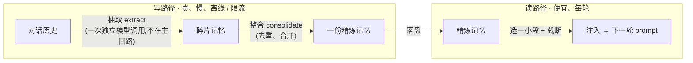
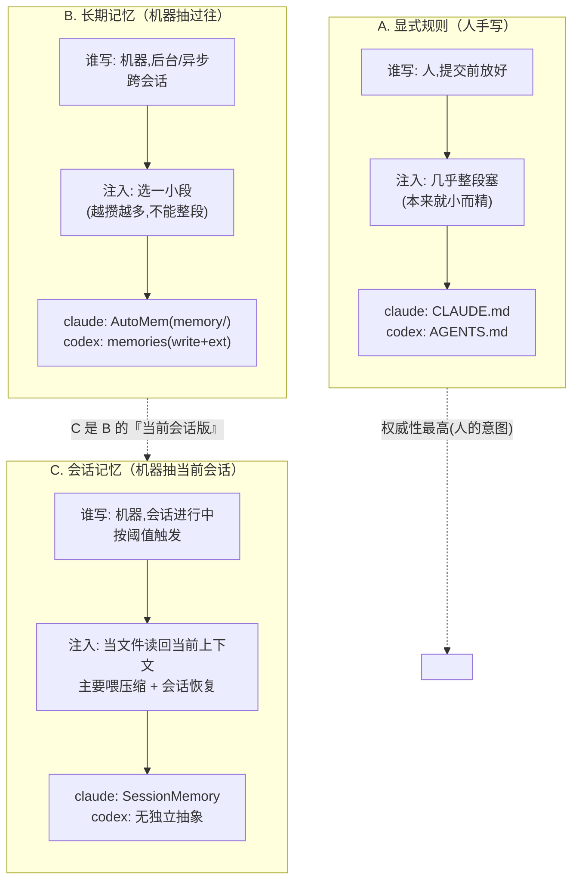
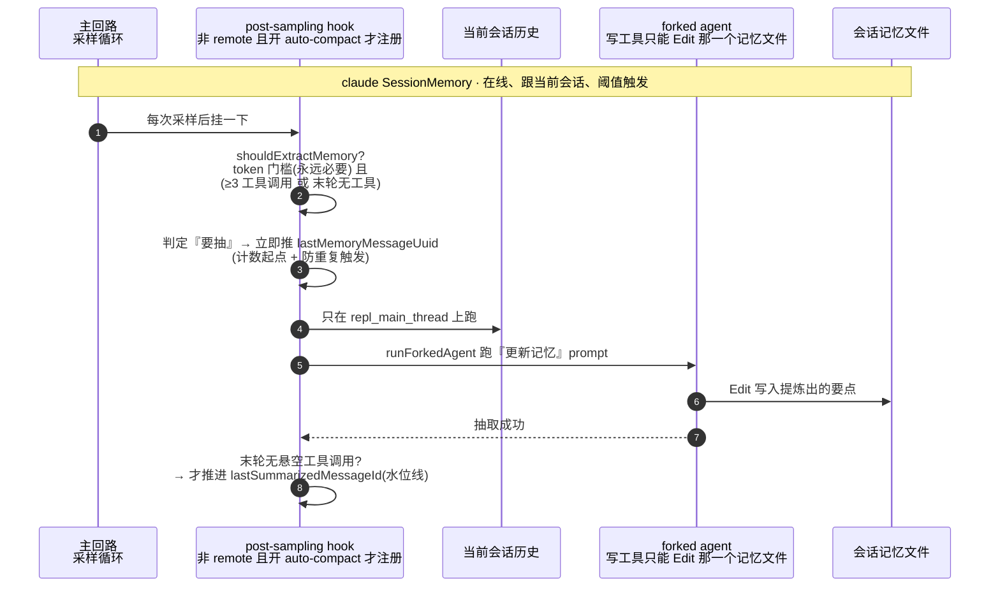
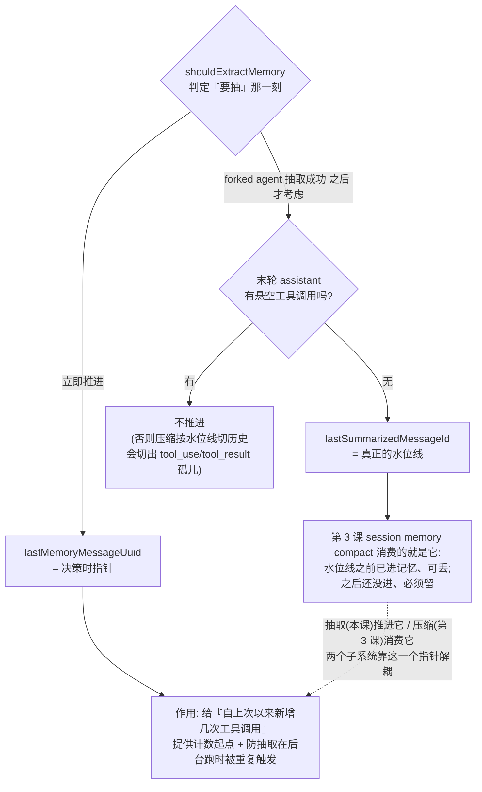
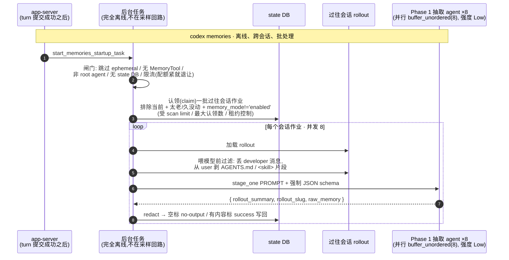
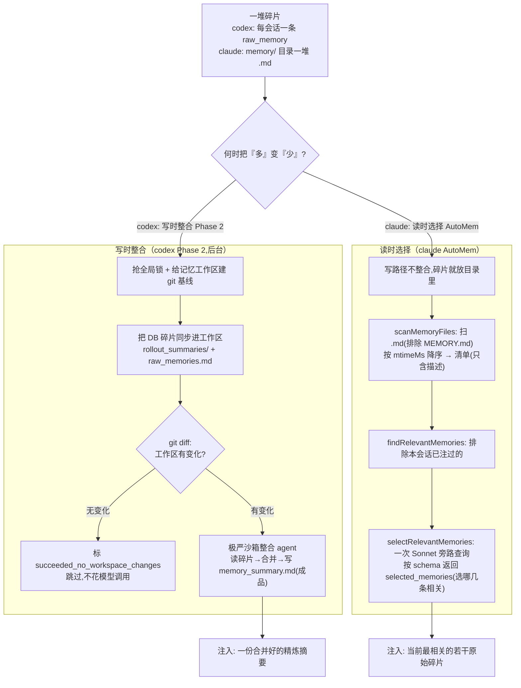
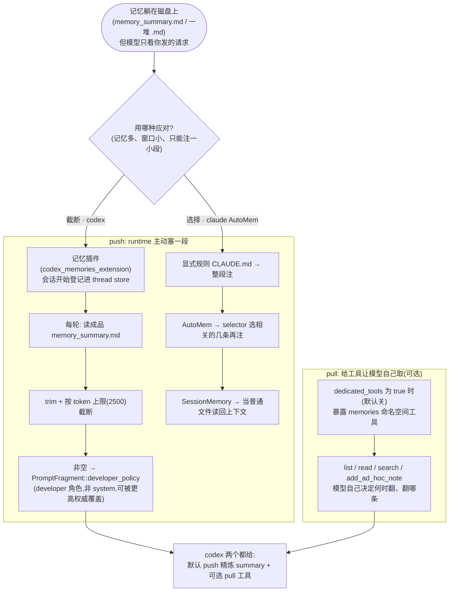
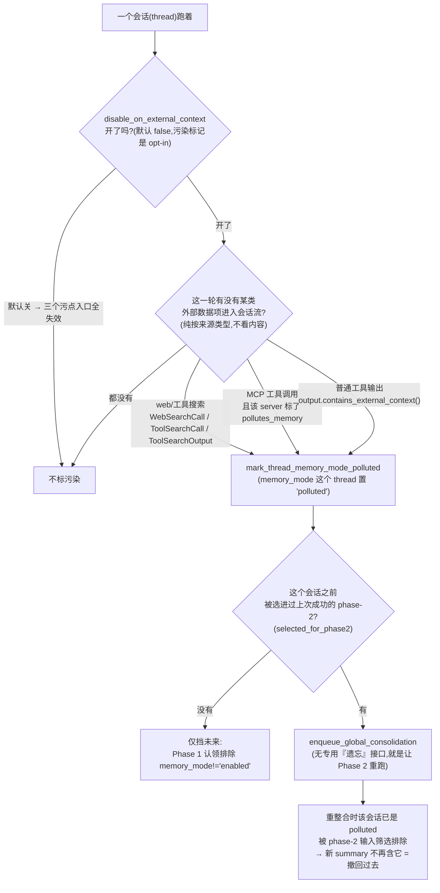

# 第 4 课：记忆系统

> 面向 deepseek 自研的 agent runtime 设计课。基于 claude / codex 真实源码。
> 讲法：直接讲清每个设计决策的代码逻辑与取舍，claude 与 codex 双实现对照，每节给出 deepseek 的落地结论。
> 本课接第 3 课决策二第二档（session memory compact）留下的线：那份"边跑边攒的会话记忆"到底是谁、什么时候、怎么攒出来的——也就是"记忆的写路径"。同时补全另外两块：这份记忆怎么注回 prompt（读路径），以及自动写记忆为什么是个高危动作（安全）。

---

## 0. 记忆到底解决什么问题

第 1 课立过一个事实：**模型无状态**，两次调用之间什么都不记得；runtime 靠每轮重新装配上下文，把"该知道的"重新喂进去。第 3 课又讲了：历史只增不减，撑爆窗口就得压缩，而压缩是**有损**的——压完一大段细节就永久丢了。

记忆系统就是来补这两个洞的。它干的事只有一句话：**把"一次性的、会被压掉的对话历史"，提炼成"可复用、能跨轮甚至跨会话留存的资产"。** 这份资产有两个去处：

1. **会话内**：喂给压缩。第 3 课的 session memory compact 之所以能"复用一份现成记忆当摘要"，前提就是有人在这个会话跑的过程中**一直在攒**这份记忆。这条线本课讲透。
2. **跨会话**：让下一个会话一开始就更聪明。你昨天踩过的坑、定过的偏好、摸清的项目结构，今天新开一个会话还能用上——不用从零再问一遍。

### 两段式架构：写路径 vs 读路径

所有记忆系统，无论 claude 还是 codex，骨子里都是同一个两段式架构，这是本课最该先记住的一张图：



记住这个"**写路径贵而稀疏、读路径廉而频繁**"的分离，后面所有设计都是它的展开。写路径为什么必须独立成一次模型调用、甚至甩到后台？因为"读一大段历史、提炼出要点"本身就是一个完整的智力任务，得让一个模型专门干，不能塞进正在服务用户的主回路里拖慢响应。读路径为什么要"选一小段"？因为记忆攒多了也会撑爆窗口，不能无脑全塞。

### 一个贯穿本课的例子

抽象的"写路径 / 读路径"讲多了容易飘，所以先约定一个具体场景，本课每个决策都拿它走一遍——它正好接第 1 课那条「重构 utils.ts」的线：

> **某次会话里，用户让 agent 重构了 `utils.ts`。** 过程中发生了几件值得记的事：agent 发现这个项目用 `pnpm`（不是 npm）、把 `utils.ts` 从 class 写法改成了函数式、顺手修了 3 处类型错误，用户还提了一句"以后注释用中文"。会话结束。

这一摊东西，会在五个决策里依次变成：先被认出"哪些值得记、哪些是注入物别记"（决策一区分三类），然后被**抽取**成一条碎片 `raw_memory`（决策二），多条碎片再被**整合**成一份精炼摘要 `memory_summary.md`（决策三），下次新开会话时这份摘要被**选一小段注回** prompt、让 agent 一上来就知道"这项目用 pnpm、注释用中文"（决策四），而整条链路上还埋着一组安全闸，防止某次被污染的输入把错误记忆永久种进未来（决策五）。把这条线记住，下面就不是在读五段孤立机制，而是在看同一摊会话产物怎么穿过这台机器、又怎么在明天回到你面前。

下面五个决策展开这套系统。先从一个最容易把人搞晕的地方开始："记忆"这个词被严重重载了。

---

## 决策一：先把"记忆"这个词拆开 —— 三种东西别混

claude 源码里至少有三样东西都叫 "memory"，但它们**谁来写、什么时候写、怎么注入**完全不同。一上来不分清，后面必然混乱。这一节先把这三类立清楚，本课后面所有机制都挂在这个划分上。

### 三类记忆：写入者 / 时机 / 注入方式都不同

| | 谁写的 | 什么时候 | 怎么注入 | claude 里是谁 | codex 里是谁 |
|---|---|---|---|---|---|
| **A. 显式规则** | **人**手写 | 提交前就放好 | 几乎**整段注入**（它本来就小而精） | `CLAUDE.md`（User/Project/Local/Managed 几级） | `AGENTS.md` |
| **B. 长期记忆** | **机器**从过往活动里抽取 | 后台/异步，跨会话 | **选一小段**注入 | AutoMem（落盘在 `memory/` 目录） | memories（write + ext 两套 crate） |
| **C. 会话记忆** | **机器**从当前会话抽取 | 会话进行中，按阈值触发 | 读回当前上下文 / 喂压缩 | SessionMemory | （无独立抽象；见下） |

把这张表画成三条独立的写入—注入链，三者各走各的、互不混淆：



回到本课那摊会话产物：用户敲进 `DEEPSEEK.md` 写死的"本项目用 pnpm"——那是 **A**（人提前写好的规则）；agent 这次会话里**现学**到的"用户偏好注释用中文"、"utils.ts 已函数式重构"——那是要被抽进 **B/C** 的东西。**A 是已知的规则、B/C 是新习得的事实**，把这两者混在一起，就会出现"把规则当成果又记一遍"的重复（决策二会专门防这个）。

### 三类的本质区别

- **A 显式规则**是**人的意图**，权威性最高（第 1 课讲 role 时说过，它通常以高权威的 system/developer 身份注入），内容是人精心写的、稳定、不大，所以可以整段塞。`CLAUDE.md` / `AGENTS.md` 属于这类。
- **B 长期记忆**是**机器对过往的总结**，跨会话。因为是机器攒的、会越攒越多，所以**不能整段塞**，得在注入前挑相关的（claude）或先合并成一份摘要（codex）。
- **C 会话记忆**是 **B 的"当前会话版"**：专门浓缩**这一个**正在跑的会话，主要为了**喂给压缩**（第 3 课那条线）和**会话恢复**。

**一个关键澄清（直接接第 3 课）：第 3 课的 session memory compact 用的就是这里的 C，不是 B。** 第 3 课那个 `trySessionMemoryCompaction` 是 claude 专有的、压缩当前会话用的，它复用的正是 SessionMemory(C)持续攒的东西。codex 的会话内压缩（第 3 课的 local/remote）**不依赖**一个 C 这样的抽象，所以上表 codex 的 C 是空的——codex 把精力都放在了 B（跨会话长期记忆）那套重型管线上。

〔源码锚点：claude 三类落点 —— 显式规则 `CLAUDE.md`、长期记忆 AutoMem 落盘目录名 `AUTO_MEM_DIRNAME='memory'`（`memdir/` 只是 TS 源码目录、非磁盘目录名）、入口 `ENTRYPOINT_NAME='MEMORY.md'` = `memdir/paths.ts:92`、`memdir/memdir.ts:34`；会话记忆 SessionMemory = `services/SessionMemory/sessionMemory.ts`。codex 记忆代码不在 `core/src`，而在 `memories/write/`（抽取+整合）与 `ext/memories/`（读路径+pull 工具）两个 crate，core 侧仅在 prompt 槽装配处接一下 = `core/src/session/mod.rs:3037`。〕

### deepseek 落地

1. **从第一天就把这三类在代码里分开**，别用一个 `Memory` 糊。它们的写入者（人 / 机器）、触发时机（预置 / 后台 / 阈值）、注入方式（整段 / 选择性）三个维度全不一样，合在一起迟早纠缠。
2. **M0 只做 A（显式规则）**：一个 `DEEPSEEK.md` 之类的文件，整段注入到高权威 role。这一档便宜、可控、立刻有用，且不涉及任何"机器自动写记忆"的风险（决策五）。B 和 C 是有了基础设施之后的增量。
3. 想清楚你更需要哪条：**要"压缩时少丢点"就先做 C**（接第 3 课），**要"下次会话更聪明"就先做 B**。两者写路径机制相通（决策二），但触发时机和落盘位置不同。

---

## 决策二：写路径（一）—— 抽取：让一个独立的 agent 去提炼记忆

### 问题

"从历史里提炼记忆"这件事，**绝不能让正在服务用户的主 agent 顺手做**。原因有二：一是它是个完整的智力活（通读历史、判断什么值得记、写成结构化条目），塞进主回路会拖慢用户看到的响应；二是它需要的工具和权限跟主 agent 完全不同（它只该写记忆文件，不该碰你的代码库）。所以两家的共同做法是：**抽取 = 派生出一个独立的、受限的 agent，专门跑一段"提炼记忆"的 prompt。**

### claude SessionMemory：会话内、按阈值触发、派生 forked agent

这就是第 3 课那份会话记忆的生产者。先看一眼整条抽取时序，再逐块拆——它是在线的，挂在主回路的采样之后：



#### 触发判定：攒够了才抽，token 门槛永远必要

**触发判定 `shouldExtractMemory`**——它不是每轮都抽，而是攒够了才抽，看几个阈值（默认值忠于源码）：

- **初始 token 阈值 = 10000**(`minimumMessageTokensToInit`)：会话刚开始，得先攒够 10k token 的历史才值得抽第一次（太早抽没东西可记）；
- **两次更新之间 token 阈值 = 5000**(`minimumTokensBetweenUpdate`):**这条是硬门槛、永远必须满足**——上次抽完之后，上下文又长了 5k token，才有资格抽下一次；
- **两次更新之间 tool call 阈值 = 3**(`toolCallsBetweenUpdates`)：在 token 门槛已满足的前提下，再叠加的一个触发条件。

精确的触发式是（源码注释特意用大写强调"token 阈值**永远**是必要条件"）：**token 阈值满足** 且（**自上次以来新增 ≥3 次工具调用** 或 **最后一个 assistant 轮根本没有工具调用**）。后半个"没有工具调用就触发"是为了在**自然对话断点**上补抽一次（此刻历史自洽、没有悬空的 tool_use）。所以单靠"攒了 3 次工具调用"是**触发不了**的——token 不够就一定不抽。

放到本课例子上：用户让 agent 重构 `utils.ts`，agent 读文件、改文件、跑类型检查，连发了好几个工具调用、历史涨了一万多 token——`token 门槛满足 + ≥3 工具调用`，于是在某次采样后触发了一次抽取；改完之后 agent 回了一段不带任何工具的总结"改完了，三处调整"，这是个自然对话断点，`末轮无工具` 又触发一次补抽。这两次抽取，攒出的就是后面要被整合的碎片。

#### 两条 uuid 水位线：决策时指针 vs 抽成功后的水位线

**满足条件后，这条"水位线"在代码里其实是两条 uuid 指针，别当成一条：**

- `lastMemoryMessageUuid`：在 `shouldExtractMemory` **判定"要抽"的那一刻就立即往前推**。它的作用是给"自上次以来新增了几次工具调用"提供计数起点，顺便防止抽取还在后台跑时又被重复触发。
- `lastSummarizedMessageId`:**这才是第 3 课 session memory compact 真正消费的那条水位线。** 它**只在抽取成功之后**才更新，而且还多一道保险——只有"最后一个 assistant 轮没有悬空的工具调用"时才推进（否则推到一个 tool_use/tool_result 对中间，压缩按水位线切历史就会切出孤儿，正是第 3 课安全底线第 1 条要防的）。

两条指针为什么这么设、各管什么、又怎么把抽取和压缩解耦，画成一张图：



第 3 课讲 session memory compact 时说"水位线之前的已进记忆、可丢，水位线之后的还没进、必须留"，那条线就是 `lastSummarizedMessageId`。**抽取（本课）推进它，压缩（第 3 课）消费它**，两个子系统靠这一个指针解耦。代码上就是：`shouldExtractMemory` 够阈值 → forked agent 抽 → 抽成功且尾巴自洽 → 推进 `lastSummarizedMessageId`，如此往复。

#### 怎么抽：post-sampling hook 派生一个写权限被掐死的 forked agent

**怎么抽**:SessionMemory 注册一个 **post-sampling hook**（每次采样之后挂一下，看够不够阈值；只在非 remote 且开了 auto-compact 时才注册）。够阈值时，`extractSessionMemory` 启动——它**只允许在 `repl_main_thread`（主线程会话）上跑**（子 agent 不抽自己的记忆），用 `runForkedAgent` 派生一个 agent 去执行一段"更新记忆"的 prompt。

**这里有个关键的权限收缩**：这个 forked agent 的写工具被限制成**只能对目标那一个 memory 文件用 Edit**——具体是一个 `createMemoryFileCanUseTool(memoryPath)` 闸：只放行"工具名是 Edit 且 `file_path` 严格等于那个记忆文件路径"，其余一律 deny。它没法写别的任何文件。这是决策五要展开的安全设计的一个预告：一个自动跑的、要写文件的 agent，能力面必须掐到最小。它的 prompt 还明确要求**别重复 `CLAUDE.md` 里已有的内容**（否则记忆和显式规则打架、还浪费 token）。

〔源码锚点：claude SessionMemory —— 阈值常量 `minimumMessageTokensToInit=10000` / `minimumTokensBetweenUpdate=5000` / `toolCallsBetweenUpdates=3` = `services/SessionMemory/sessionMemoryUtils.ts:33-35`；触发式 `(token 满足 && ≥3 工具) || (token 满足 && 末轮无工具)` + 大写注释"token 阈值 ALWAYS required" = `services/SessionMemory/sessionMemory.ts:165-170`；`lastMemoryMessageUuid` 在判定为真时即推进 = `sessionMemory.ts:99,172-178`，`lastSummarizedMessageId` 仅抽成功后经 `updateLastSummarizedMessageIdIfSafe` 且"末轮无工具"才推进 = `sessionMemory.ts:347,442,486-495`；post-sampling hook 仅非 remote+auto-compact 时注册、`extractSessionMemory` 仅 `repl_main_thread`、`runForkedAgent` = `sessionMemory.ts:278-281,318-325,357-375`；单文件 Edit 闸 `createMemoryFileCanUseTool` = `sessionMemory.ts:460-482`；prompt"别记 CLAUDE.md 已有内容" = `services/SessionMemory/prompts.ts:66`。补注：claude 另有一套 `services/extractMemories/` 写持久 AutoMem（B 类）、走 stop hook，与此处 SessionMemory(C 类)不是同一套，别混。〕

### codex memories：跨会话、后台批处理、Phase 1 并行抽取

codex 的记忆系统目标不同——它做的是 **B（跨会话长期记忆）**，所以抽取不是"抽当前会话"，而是**后台去抽那些已经结束的过往会话**。整条时序与 claude 那张正好相反：它彻底离开采样回路、批量并行：



#### 完全离线 + 一道道闸门

**完全离线**：不在任何 turn 的采样回路里。app-server 在一个有输入的 turn 成功提交**之后**，调 `start_memories_startup_task` 起一个**后台任务**。这个任务有一道道闸门（决策五细讲）：跳过临时（ephemeral）会话、没开 `Feature::MemoryTool` 的会话、非 root agent、没有 state DB 的情况；还有 rate-limit guard——配额用太多就这次不抽，别和用户的正常请求抢额度。

#### Phase 1：认领一批过往会话，并行抽，强制严格 schema

**Phase 1 = 逐会话抽取**：从状态库（state DB）里**认领（claim）**一批过往会话的 rollout（完整对话流水）作业，排除当前会话、太老/太久没动的、以及标记了不该记的会话（`memory_mode != 'enabled'`），受 scan limit / 最大认领数 / 租约时间（lease）控制。然后**并行**抽取——并发度常量是 8(`buffer_unordered(8)`)，推理强度用 `ReasoningEffort::Low`（抽取是结构化提取、不需要重推理；对照 Phase 2 整合用的是 `Medium`）。每个作业：加载这个会话的 rollout、过滤、把一段固定的 `stage_one::PROMPT` 当 base instructions、**强制一个严格 JSON 输出 schema**:

```
// Phase 1 抽取每个过往会话,模型必须吐出这个结构(strict JSON, additionalProperties:false):
{
  "rollout_summary": "用户在重构 utils.ts,完成了函数式改写并修复了 3 处类型错误…",  // 这次会话干了啥
  "rollout_slug":    "refactor-utils-ts",                                          // 一个短标识(schema 里类型是 ["string","null"]:在 required 里、但允许为 null;Rust 侧存成 Option<String>)
  "raw_memory":      "项目用 pnpm;utils.ts 已函数式重构;用户偏好注释用中文…"      // 提炼出的可复用要点
}
```

这正是本课例子里那次"重构 utils.ts"会话被抽出来的一条碎片：`raw_memory` 把"用 pnpm、已函数式重构、注释用中文"提炼了出来。强制严格 schema 的意义：抽取这一步要的是**结构化数据**（后面 Phase 2 要机器处理），不是一段自由发挥的话，所以用 schema 把模型输出钉死（这正是第 2 课讲工具/结构化输出时的同一招）。抽完做 redact（脱敏），空的标记 no-output，有内容的标记 success 写进 DB。

〔源码锚点：codex Phase 1 —— `start_memories_startup_task` 在有输入 turn 提交成功后起、闸门(ephemeral / `Feature::MemoryTool` / `is_non_root_agent` / 无 state DB / `rate_limits_ok`) = `app-server/src/request_processors/turn_processor.rs:472-482`、`memories/write/src/start.rs:30-49,65-72`；认领排除 `memory_mode='enabled'` + scan limit(`THREAD_SCAN_LIMIT=5000`) / 最大认领数 / lease(`JOB_LEASE_SECONDS=3600`) = `state/src/runtime/memories.rs:148-271,215`、`memories/write/src/phase1.rs:149-187`；并发 `CONCURRENCY_LIMIT=8`(`buffer_unordered`) + Phase1 `ReasoningEffort::Low`（对照 Phase2 `Medium`）= `memories/write/src/lib.rs:79-81,103`、`phase1.rs:200,219`；严格 schema(`rollout_summary`/`rollout_slug` 为 `["string","null"]` 且在 required/`raw_memory`,`additionalProperties:false`) + `stage_one::PROMPT` = `phase1.rs:50-63,136-147,308-312`、`lib.rs:88`；抽后 redact / no-output / success 写 DB = `phase1.rs:259-279,319-321`。〕

### 一个共同的过滤动作 —— 但两家"硬度"不同

两家在把历史喂给"抽取 agent"之前，都试图做同一件事：**别把"注入进去的指令"当成"会话发生的事实"记下来。** 但实现的硬度差很大，这个差别本身值得学：

- **codex 是结构化硬过滤（load-bearing）**:Phase 1 在把 rollout 喂给模型**之前**，用 `sanitize_response_item_for_memories` 物理删掉内容——**丢弃所有 developer 消息**，并从 user 消息里**剥掉以 `# AGENTS.md instructions` 开头、`</INSTRUCTIONS>` 结尾的指令块**和 `<skill>…</skill>` 片段。模型根本看不到这些注入物。
- **claude 是 prompt 软请求（soft）**:SessionMemory **不做**这种结构化剥离，喂给 forked agent 的是未过滤的对话历史；它只在抽取 prompt 里**用一句话请求**模型"别记 `CLAUDE.md` 里已有的内容"。靠模型自觉，不是靠代码保证。

为什么要过滤：你的 `AGENTS.md`/`CLAUDE.md` 写着"本项目用 pnpm"，这句话每轮都被注入历史。如果抽取时不加分辨，记忆会把"系统注入过一句 pnpm"当成"这个会话学到了 pnpm"，于是把本来就是规则的东西又抄进记忆一遍——重复、且把"规则"和"习得的事实"混为一谈。**结论：要真防住，得像 codex 那样在喂模型前结构化删除，光靠 prompt 请求是不保险的。**

〔源码锚点：codex 结构化过滤 `serialize_filtered_rollout_response_items`→`sanitize_response_item_for_memories`：丢 developer 消息、剥 `# AGENTS.md instructions…</INSTRUCTIONS>` 与 `<skill>…</skill>` 片段（`<environment_context>`/`<subagent_notification>` 保留）= `memories/write/src/phase1.rs:404-483`；claude 侧无结构化剥离、仅 prompt 软请求 = `services/SessionMemory/prompts.ts:66`、forked agent 收到的是未过滤 `context.messages` = `utils/forkedAgent.ts:139,524`。〕

### 取舍

claude SessionMemory 是**在线、增量、阈值驱动**：跟着当前会话走，攒够一点抽一点，水位线一路推进，产物即时可用于压缩和恢复。代价是它在主线程会话里跑（虽然是 forked agent，但触发判定挂在采样回路上）。codex Phase 1 是**离线、批量、跨会话**：完全甩到后台，一次认领一批过往会话并行抽，彻底不碰当前交互延迟。代价是记忆有延迟——这次会话的内容，要等之后某个后台任务才被抽进长期记忆。

### deepseek 落地

1. **抽取一定是一次独立的模型调用，跑在受限的派生 agent 里，不是主 agent 顺手做。** 这条没有例外。主 agent 的职责是服务用户，提炼记忆是另一个智力任务、另一套权限。
2. **用阈值驱动抽取，别每轮抽**（claude 的 10k 初始 / 5k 增量 / 3 工具调用是现成配方）：抽得太勤既烧钱又没新东西可记。
3. **维护一条水位线指针**(last-processed uuid)：抽取推进它，压缩（第 3 课）消费它。这是记忆子系统和压缩子系统之间唯一该共享的状态，别让它们互相知道对方内部。
4. **喂给抽取 agent 之前，结构化剥掉注入物**（你的 `DEEPSEEK.md`、skill 片段、各种 system-reminder）：在代码里物理删除、别只在 prompt 里请求模型"别记"。codex 是结构化硬删（保险）、claude 只软请求（不保险）——学 codex 那条，只从真实发生的对话/工具动作里提炼，否则记忆会把"规则"当"习得"重复记一遍。
5. **在线（跟当前会话）还是离线（后台抽过往会话）二选一起步**：要喂压缩就在线（claude 式），要跨会话长期记忆就离线（codex 式）。M0 若只想接第 3 课，先做在线那条。

---

## 决策三：写路径（二）—— 整合：把碎片合并成一份精炼记忆

### 问题

抽取（决策二）产出的是**一堆碎片**:codex Phase 1 每个过往会话吐一条 `raw_memory`，几十个会话就是几十条；claude AutoMem 是一个目录里堆着很多 `.md` 记忆文件。碎片多了有两个问题：互相重复/矛盾（三个会话都记了"用 pnpm"）、且总量会越堆越大。所以需要一步**整合（consolidation）**：把碎片合并、去重、提炼成一份干净的、可直接用的记忆。

claude 和 codex 在"何时整合"上选了相反的策略，这是本节的核心对照。把两条路并排画出来——左边写时合、右边读时选：



回到例子：假设你最近三个会话都在这个项目里干活，三条 `raw_memory` 都记了"用 pnpm"。codex 走左路，整合时把这三条融成 summary 里的一句"项目用 pnpm"；claude 走右路，不预先融，三个文件就放着，等下次需要时 selector 挑出最相关的几条注进去。

### codex：写时整合（Phase 2），产出一份 `memory_summary.md`

codex 在**写路径**就把碎片合并好。Phase 1 跑完，Phase 2 接着跑（还是在那个后台任务里），五步：

1. **抢一把全局锁（global phase2 lock）**：整合是全局唯一的，不能两个后台任务同时合并同一份记忆，所以用 `try_claim_global_phase2_job` 这把全局锁串行化；
2. **给记忆工作区建 git 基线**：整合在一个 git 工作区里进行，先 `ensure_git_baseline_repository` 建 baseline，好 diff;
3. **算水位线、同步碎片**：把 DB 里 Phase 1 攒的 stage-one 输出，同步写进工作区的 `rollout_summaries/` 目录（每会话一份）和 `raw_memories.md`（合并后的原料）；
4. **用 diff 判断要不要真整合**：同步完如果工作区**没有变化**（没有新碎片），直接标记 `succeeded_no_workspace_changes` 返回——没新东西就不浪费一次模型调用；
5. **有变化才启动整合 agent**：派生一个**被极度锁死的** consolidation agent，让它读碎片、合并、写出最终的 `memory_summary.md`。

#### 整合 agent 的沙箱：全系统最严

这个整合 agent 的沙箱配置是整个系统里最严的（这点决策五还会回来强调，这里先列出来感受一下）：cwd 设成记忆根目录、标记 ephemeral（临时，用完即弃）、**关掉生成/使用记忆**（防止它递归地又触发记忆）、**关掉 apps 和 MCP、关掉委派/Collab/Plugins 等工具特性、审批策略固定为 `Never`、沙箱设为 WorkspaceWrite 但可写目录只有记忆根、且 `network_access=false`**。模型用 `consolidation_model`（没配就用 provider 偏好的整合模型），推理强度 `Medium`（比 Phase 1 抽取的 `Low` 高一档，因为合并去重比结构化提取更费脑）。跑完确认还持有锁、reset 工作区基线、标记 `succeeded`；失败就标失败并异步关掉它。

#### 原料和成品分开放

**产出的关键文件是 `memory_summary.md`**——注意不是 `raw_memories.md`。raw 是碎片原料（Phase 2 的输入），summary 是整合后的成品（读路径只读这个）。这个区分很重要：原料和成品分开放，读路径永远只碰成品。注意整合 agent 并不"返回"一段文字——它是在沙箱工作区里**直接编辑文件**（写 `memory_summary.md`，可能还有 `MEMORY.md`、`skills/`），编排器看到它跑完（Completed）后才 reset git 基线、标成功。

〔源码锚点：codex Phase 2 —— 全局锁 `try_claim_global_phase2_job`(`JOB_LEASE_SECONDS=3600`) = `memories/write/src/phase2.rs:58,223`、`lib.rs:105`；git 基线 `prepare_memory_workspace`→`ensure_git_baseline_repository` = `phase2.rs:67`、`memories/write/src/workspace.rs:13-18`、`git-utils/src/baseline.rs:78`；同步碎片到 `rollout_summaries/`(`ROLLOUT_SUMMARIES_SUBDIR`)+`raw_memories.md`(`RAW_MEMORIES_FILENAME`) = `phase2.rs:116,203-212`、`lib.rs:36-38`；无变化 `if !workspace_diff.has_changes()`→`"succeeded_no_workspace_changes"` = `phase2.rs:129,143-155`；整合 agent 沙箱（cwd=root / ephemeral / `generate_memories=false`+`use_memories=false` / `mcp_servers=allow_only(空)` / `approval_policy=Never` / `WorkspaceWrite{writable_roots=[root],network_access:false}` / 禁 `SpawnCsv`·`Collab`·`Apps`·`Plugins`）+ 模型 `consolidation_model`/强度 `Medium` = `phase2.rs:301-345`、`lib.rs:103`；产品 `memory_summary.md` vs 原料 `raw_memories.md`、读路径只读 summary = `ext/memories/src/prompts.rs:31`、`memories/write/templates/memories/consolidation.md:22,28`；成功后 reset 基线标 `"succeeded"` = `phase2.rs:416,425`。〕

### claude：读时选择（AutoMem），不预先合并

claude AutoMem 走的是另一条路：**写路径不整合，碎片就那么放在目录里；到读路径再挑相关的注入。** 具体：

- 记忆是磁盘上一个叫 **`memory/`** 的目录（源码里 `AUTO_MEM_DIRNAME='memory'`；`memdir/` 只是 TS 源码文件夹名、不是磁盘目录名）下一堆 `.md` 文件，加一个固定入口 `MEMORY.md`；
- `scanMemoryFiles` 扫描这些文件（只扫 `.md`、排除 `MEMORY.md`），解析每个文件的 frontmatter（只读前 30 行），**按修改时间 `mtimeMs` 降序排**，裁到最大文件数（`MAX_MEMORY_FILES=200`），产出一份**清单（manifest）**——每项是一个 `MemoryHeader`：`filename` / `filePath` / `mtimeMs` / `description` / `type`。注意清单里只有**描述**，不是全文；
- 真要用时，`findRelevantMemories` 先排除本会话已经注过的（`alreadySurfaced`），再调 `selectRelevantMemories`——这一步**用一个 Sonnet 旁路查询（side query）**，给它看清单 + 当前在干什么，让它按一个 JSON schema 返回 `selected_memories`（选中哪几个文件相关，最多 5 个）。

所以 claude 的"整合"其实是**读时的相关性选择**：不预先合并，而是每次需要时，花一次小的 selector 模型调用，从一堆记忆里挑出跟当下相关的那几条。

〔源码锚点：claude AutoMem —— 磁盘目录名 `AUTO_MEM_DIRNAME='memory'` / 入口 `ENTRYPOINT_NAME='MEMORY.md'` = `memdir/paths.ts:92`、`memdir/memdir.ts:34`；`scanMemoryFiles`（只 `.md`、排除 `MEMORY.md`、frontmatter 前 30 行、`b.mtimeMs-a.mtimeMs` 降序、`slice(0,MAX_MEMORY_FILES=200)`）+ `MemoryHeader{filename,filePath,mtimeMs,description,type}` + `formatMemoryManifest` 仅含描述 = `memdir/memoryScan.ts:13-19,35,41-43,72-73,84-94`；`findRelevantMemories`（排除 `alreadySurfaced`）→`selectRelevantMemories`（`sideQuery` + `getDefaultSonnetModel`、schema 字段 `selected_memories`、最多 5 个、`querySource:'memdir_relevance'`）= `memdir/findRelevantMemories.ts:39,46-48,77,98-119`；读时经 `getRelevantMemoryAttachments` 每轮注入 = `utils/attachments.ts:2196-2226`。〕

### 两种策略，一句话对照

| | codex：写时整合 | claude：读时选择 |
|---|---|---|
| 何时把"多"变"少" | 写路径，Phase 2 合并成一份 summary | 读路径，每次用 selector query 挑相关的 |
| 注入时拿到的 | 一份已经合并好的精炼摘要 | 当前最相关的若干原始碎片 |
| 成本花在 | 后台整合（贵但离线、且无变化就跳过） | 每次注入前一次 selector 调用（小但在线） |
| 适合 | 记忆同质、可融成一份全局视图 | 记忆异质、不同任务需要不同子集 |

没有绝对优劣：整合后注入更省 prompt、更连贯，但丢了细粒度；选择式注入保留原始碎片、能按需取不同子集，但每次要付一次 selector 调用、且注入的多条之间可能重复。

### deepseek 落地

1. **"碎片 → 精炼"这步要有，别让记忆无限堆**。要么写时整合（codex）、要么读时选择（claude），挑一个。
2. **原料和成品分开存**（codex 的 `raw_memories.md` vs `memory_summary.md`）：读路径永远只碰成品，原料只供整合用。混在一起迟早把半成品注进 prompt。
3. **整合"无变化就跳过"**（codex 的 diff 判断）：没有新碎片就别白跑一次整合模型调用。
4. **整合 agent 用最严的沙箱**（决策五展开）：它是个自动跑、要写文件的 agent,cwd 限死在记忆目录、无网络、不许碰别的。
5. M0 可以先用**读时选择**的简化版（甚至先不用模型选、用 mtime/关键词粗筛），比实现一整套写时整合管线轻得多；等记忆量大了再上整合。

---

## 决策四：读路径 —— 把记忆注回 prompt（且别注太多）

### 先说清楚"读路径"是哪一刻

记忆现在是**躺在磁盘上的文件**（比如 `memory_summary.md`）。但模型只看你发给它的那个请求，它读不到你的硬盘。所以总得有一步，把**磁盘上的记忆文件，变成请求里的一段文字**。这一步就叫读路径。

任何读路径都在回答三个问题，把它们记住，下面 codex/claude 的做法只是各自的答案：

1. **谁、什么时候**去做这个"文件 → prompt"的注入？
2. 注入**哪个文件、哪段内容**?
3. 注进去之后，它在 prompt 里是**什么身份（role）、占多大体积**?

而且永远受同一条约束：**记忆可能很多，prompt 窗口很小，只能注一小段。** 所以第 2、3 问的答案永远绕不开"怎么砍小"。

下面这张图把读路径的全貌摆出来：左半是 **push**（runtime 主动塞，又分 codex 截断式 / claude 选择式），右半是可选的 **pull**（给工具让模型自己取），两边最后汇到 codex"两个都给"：



### codex 的做法：一个"记忆插件"每轮往 prompt 塞一段（逐词翻译）

codex 那句话里有几个词得先翻译，翻译完逻辑就透了：

- **"prompt 贡献者（contributor）"**:codex 的 prompt **不是一个大函数硬拼的**，而是"收集一堆零件拼起来"。每个零件提供方叫一个 contributor——它登记一句"轮到拼 prompt 时，把我这段加进去"。
- **"扩展（extension）"**:codex 没把"注入记忆"**写死在核心里**，而是做成一个**可插拔插件** `codex_memories_extension`。好处是解耦：不想要记忆，就不装这个插件，核心代码压根不知道有记忆这回事。记忆是"外挂"上去的一个 contributor。
- **"存进 thread store"**：一个 thread = 一个会话，thread store = **存这个会话各项设置的地方**。会话刚开始（或设置变化）时，插件先登记一句"这个会话记忆开着，参数是这些（token 上限、要不要额外开记忆工具）"——因为后面**每一轮**注入都得先知道"这个会话开没开记忆、按什么参数"，这个状态要能跨轮、跨重启活着，所以落进 thread store。

翻译完，codex 每轮真正干的活就三步：

1. 读文件 `codex_home/memories/memory_summary.md`（决策三里 Phase 2 整合出的**成品**）；
2. `trim`（去首尾空白）+ **按一个 token 上限截断**——上限是一个写死的常量 **2500 token**（`MEMORY_TOOL_DEVELOPER_INSTRUCTIONS_SUMMARY_TOKEN_LIMIT`）。这就是"别注太多"那条铁律：文件再大，也只取这 2500 token 放得下的那一截；
3. 非空就套进模板，作为一个 **`PromptFragment::developer_policy`** 交回去（空了直接返回 None、这一轮不注）。`PromptFragment` = 拼好的 prompt 里的一段；`::developer_policy` = 这段的**身份是 developer 角色**（第 1 课 role 体系里那个中等偏高的权威级，装配时落进 developer sections）。

一句话：**记忆是个插件，会话开始时登记，之后每轮读那份整合好的记忆文件、截断到 2500 token 放得下，作为一段 developer 角色的内容塞进 prompt。** 回到三个问题——谁/何时 = 每轮拼 prompt 时那个记忆 contributor；哪段 = `memory_summary.md` 截断后的一截；什么身份 = developer、不超 token 上限。

### claude 的做法：三类记忆各有各的注入方式

claude 没用"插件 contributor"这套，而是决策一那三类记忆（A/B/C）**各走各的注入**:

- **A. 显式规则（`CLAUDE.md`）→ 整段注入**：人手写的、小而精，**全都要**，不用挑，直接整段塞；
- **B. 长期记忆（AutoMem）→ 选了再注**：一个目录里一堆机器写的文件、会越堆越多，不能整段塞，所以走决策三那套——扫成清单 → 一次 Sonnet 旁路查询挑出相关的几条 → 只注这几条；
- **C. 会话记忆（SessionMemory）→ 当文件读回来**：`FileReadTool` 就是 agent 平时读任何文件用的那个**读文件工具**，会话记忆文件就用它**像读普通文件一样**读回当前上下文。

一句话：**规则整段进、长期记忆挑相关的进、会话记忆当文件读回来。**

### 统一点：要么截断，要么选择

把两家放一起，读路径的核心约束只有一条——记忆多、窗口小、只能注一小段，于是只有两种应对：**截断**（codex：读成品 + 砍到 token 上限）或**选择**（claude AutoMem：先挑相关的再注）。这也是为什么读路径可以一句话概括成"**选一小段 push 进 prompt**"。

### 用什么 role 注 —— 接第 1 课

codex 把记忆作为 **`developer_policy`（开发者策略）** 注入，对应第 1 课讲的 role 体系：记忆不是用户随口说的话（user），也不是不可违抗的系统铁律（system），而是**以"开发者下的策略"这个中等偏高的权威级别**进入 prompt——模型会比较当回事，但仍低于显式的硬规则。这个选择是有意的：**机器抽取的记忆可能有错**（决策五），给它 developer 级、而不是 system 级，留了"必要时被更高权威覆盖"的余地。

### 推（push）还是拉（pull）—— 两种注入哲学

到这里出现一个更深的分叉：记忆是 runtime **主动塞**给模型（push），还是给模型**一组工具让它自己按需取**(pull)?

- **push**：上面讲的都是 push——runtime 每轮选一段记忆塞进 prompt。好处是模型不用操心，坏处是塞多了占窗口、塞少了可能漏。
- **pull**:codex 在配置允许时（`dedicated_tools` 为 true，默认**关**），会额外暴露一组 **`memories` 命名空间的工具**：`list`（列记忆）、`read`（读某条）、`search`（搜）、`add_ad_hoc_note`（让模型主动记一条临时笔记）。这样模型可以**自己决定**什么时候去翻记忆、翻哪条，而不是被动接受 runtime 塞的那一段。

两者不是二选一，codex 是**两个都给**：默认 push 一份精炼 summary（保证基本盘），再可选 pull 工具（让模型按需深挖）。这正好呼应第 2 课的工具发现思路——少量高频的直接塞、海量低频的给个检索工具按需取。

具象一下 codex 读路径注进 prompt 长什么样（示意）：

```
// 每轮 prompt 里,记忆以 developer_policy 身份出现的那一段:
{ role: "developer", content: "<memory_summary> 项目用 pnpm;utils.ts 已函数式重构;
                                用户偏好不用 class、注释用中文… </memory_summary>" }

// 若开了 dedicated_tools,工具清单里还会多出这几个(模型可按需调用):
//   memories.list / memories.read / memories.search / memories.add_ad_hoc_note
```

这正是本课例子的归宿：那次"重构 utils.ts"会话学到的"用 pnpm、注释用中文"，经抽取→整合→落进 `memory_summary.md`，到下次新开会话时，就是这样以 developer 角色、截断到 2500 token 以内，自动出现在 prompt 里——agent 一上来就知道这个项目的规矩，不用你再说一遍。

〔源码锚点：codex 读路径 —— 可插拔扩展 `codex_memories_extension`（注册 thread-lifecycle / config / prompt / tool 四个 contributor）= `ext/memories/src/extension.rs:119,124-127`，由 app-server `install` = `app-server/src/extensions.rs:75`；会话开始/设置变更把 `MemoriesExtensionConfig{enabled,dedicated_tools,codex_home}` 写入 thread store = `extension.rs:33-38,73-95`；每轮 contributor 读 `codex_home/memories/memory_summary.md`→`trim`→按 `MEMORY_TOOL_DEVELOPER_INSTRUCTIONS_SUMMARY_TOKEN_LIMIT=2500` 截断→空返回 None→否则 `PromptFragment::developer_policy` = `ext/memories/src/prompts.rs:27,30-43`、`ext/memories/src/lib.rs:16`、`extension.rs:50-71`；`developer_policy`(=`PromptSlot::DeveloperPolicy`)装配进 developer sections（非 system）= `core/src/session/mod.rs:3037-3040`；pull 工具 gate `dedicated_tools`(默认 `false`)、命名空间 `memories`、工具名 `add_ad_hoc_note`/`list`/`read`/`search` = `config/src/types.rs:291,336,358`、`ext/memories/src/lib.rs:18-22`、`ext/memories/src/tools/mod.rs:35-77`、`extension.rs:104-109`。claude SessionMemory 当文件读回 = `services/SessionMemory/`（FileRead 工具读记忆文件）。〕

### deepseek 落地

1. **读路径默认是"选一小段 push 进 prompt"**：有整合成品就注成品（codex summary），没有就注 selector 选出的相关碎片（claude）。一定要有"截断到 token 上限"这一步，别把整份记忆怼进去。
2. **记忆用 `developer` 级 role 注，不要用 `system` 级**：它是机器抽的、可能错，留一个被更高权威覆盖的余地。显式规则（`DEEPSEEK.md`）才配更高的权威。
3. **push 之外，考虑给一组 pull 工具**(list/read/search/add-note)，让模型按需深挖，而不是把所有可能相关的记忆都预先塞进去。默认可以像 codex 一样关掉，等有需要再开。
4. **原料文件永远不进读路径**：只注成品（summary / selected），raw 碎片只供写路径整合。

---

## 决策五：安全与正确性 —— 自动写记忆是高危动作

### 问题

记忆系统有一个其它子系统都没有的危险属性：**它是机器自动写的，又会自动注入未来每一个会话。** 这意味着——如果某次抽取记错了、或者把一段被污染/恶意的输入当成事实记了下来，这个错误会**静默地、持续地**污染你之后所有的会话，而且很难发现（没人会去逐条审记忆）。所以记忆系统的安全设计，分量比它的功能设计还重。两家的防线可以归成三组。

### 第一组：抽取/整合 agent 的能力面掐到最小

自动跑、要写文件的 agent,blast radius（出事影响面）必须最小化：

- **claude**:SessionMemory 的 forked agent 写工具**被限制成只能 Edit 那一个目标记忆文件**——它没有能力碰你代码库里任何别的文件。
- **codex**:Phase 2 的整合 agent 是全系统最严的沙箱（决策三列过）：cwd 锁死在记忆根目录、**无网络**、关掉 MCP/apps/委派、**审批策略 Never**（不弹审批，因为它在后台没人看）、沙箱只允许写记忆根目录、ephemeral 用完即弃。

逻辑很直白：一个没人盯着、自动跑、会写盘的 agent，你要假设它可能出错或被诱导，所以**从能力上**让它即使出错也只能动记忆那一小块地方，碰不到代码、碰不到网络。

〔源码锚点：claude forked agent 写工具单文件 Edit 闸 `createMemoryFileCanUseTool` = `services/SessionMemory/sessionMemory.ts:460-482`；codex 整合 agent 沙箱（cwd=root / `network_access=false` / MCP·apps·委派关 / `approval_policy=Never` / writable 仅 root / ephemeral）= `memories/write/src/phase2.rs:301-345`。〕

### 第二组：别把"被注入的内容"和"被污染的会话"记进长期记忆

这是最微妙、也最容易漏的一组，分两件事：**过滤注入物**和**污染标记**。

#### 过滤注入物（决策二讲过）

抽取前剥掉 developer 消息、`AGENTS.md`、`<skill>` 片段——不要把"系统注入过的指令"当成"会话习得的事实"记下来。再强调一遍硬度差别：codex 是在喂模型前**结构化删除**，claude SessionMemory 只在 prompt 里软请求；要真防住得学 codex 那条。

#### 污染标记（codex 的 `memory_mode`）

每个会话（thread）在状态库里有一个记忆模式 `memory_mode`。这里有个**必须讲准的实现细节**：在 Rust 类型层面，`ThreadMemoryMode` 这个 enum **只有两个变体** `Enabled` / `Disabled`；`polluted` 是一个**只活在数据库字符串层面的第三态**，由一条 `UPDATE threads SET memory_mode='polluted'` 写进去，类型层从不 round-trip 它。所以三个值是这样的：

| memory_mode 值 | 含义 | 怎么来的 | 在哪一层 |
|---|---|---|---|
| `'enabled'` | 可抽取 | 默认（建会话时 `generate_memories=true`） | Rust enum `Enabled` + DB 字符串 |
| `'disabled'` | 主动选择不记（**意图**） | 建会话时 `generate_memories=false` | Rust enum `Disabled` + DB 字符串 |
| `'polluted'` | 已污染、安全降级（**事故**） | 被 `mark_thread_memory_mode_polluted` 标 | **仅 DB 字符串**（无 Rust 变体） |

Phase 1 认领作业时**只认 `memory_mode='enabled'` 的会话**，所以 `disabled` 和 `polluted` 都被挡在抽取之外，但含义不同：一个是用户的意图、一个是系统判定的事故。

**怎么判 `polluted`——这点最反直觉，要讲准：不是"读内容判断脏不脏"，而是纯按"这一轮有没有某类外部数据项进入会话流"。** 把整条判定 + 后果画出来：



核过源码，三个污点入口全部由 `disable_on_external_context` 这个开关 gate（**而它默认是 `false`**——也就是说这三个污点入口**默认全部关闭**,codex 把污染标记设成 opt-in，要显式在配置里把它打开才生效；下面讲的是"开了之后"的判定逻辑）：

1. **web 搜索 / 工具搜索**：流里出现 `WebSearchCall` / `ToolSearchCall` / `ToolSearchOutput` 这三类 `ResponseItem` 之一就触发——`response_item_may_include_external_context` 就是一个 `matches!` **纯类型匹配**，用 `{ .. }` 丢掉所有字段、根本不看内容。
2. **MCP 工具调用**：但不是所有 MCP 都污染，要那个 server 被标了 `pollutes_memory` 才算（细节：对**没有元数据**的未知 server，这个判定**默认按 true**，即未知 MCP server 当成会污染——保守侧）。
3. **普通工具输出**：`output.contains_external_context()` 为真时触发（这是每个工具输出类型自带的一个布尔标志，trait 上**默认 false**，由产出外部数据的工具自己置 true，比如 web 搜索的输出硬编码 true——同样不是扫内容）。

最铁的证据是这个配置项的**旧名**：`disable_on_external_context` 带一个 `#[serde(alias = "no_memories_if_mcp_or_web_search")]`——它以前就直接叫"碰了 MCP 或 web 搜索就不记忆"。所以判据板上钉钉是**"数据从外部世界进来了"这个结构事实，和内容写了啥无关**。

为什么按来源、不按内容？因为**提示注入可以伪装成任何文本，靠扫内容识别必然漏**；而"这一轮有没有 web 搜索/MCP 结果进来"是个确定、可靠、好判的结构信号。这是安全工程里的**污点追踪（taint tracking）**：不试图检测攻击本身，而是按数据来源保守地打污点。

**污染标记不只"挡未来"，还能"撤过去"。** 看 `mark_thread_memory_mode_polluted`——标污染时它先查这个会话之前有没有"被选进过上一次成功的 phase-2 整合"(`selected_for_phase2`)，如果有，就**入队一次全局整合**（`enqueue_global_consolidation`，doc 注释把这一步叫 "phase-2 forgetting"）。这里要讲准：**并没有一个专门的"遗忘"接口**——它就是让 Phase 2 重跑一遍，而因为这个会话的 `memory_mode` 现在已经是 `'polluted'`、会被 phase-2 的输入筛选（只选 `'enabled'` 的会话）排除掉，于是重新整合出的 `memory_summary.md` 里就不再含它的贡献——**等效于**把已经学进长期记忆的东西撤了出去。所以它是双向的：既挡未来、又能回收过去。**本质是：不可信来源一旦碰过这个会话，这个会话就不再是可信的学习来源，过去学的也要吐出来。**

〔源码锚点：codex 污染机制 —— `ThreadMemoryMode` enum 仅 `Enabled`/`Disabled`（`polluted` 无 Rust 变体、仅 DB 字符串，由 `UPDATE ... memory_mode='polluted'` 写）= `protocol/src/protocol.rs:665-670`、`state/src/runtime/memories.rs:604`；`Disabled` 来自 `generate_memories=false` = `core/src/session/session.rs:549-553`、`config/src/types.rs:286`；Phase 1 排除 `memory_mode != 'enabled'` = `state/src/runtime/memories.rs:215`；三入口 gate `disable_on_external_context`（默认 `false`、含 `#[serde(alias="no_memories_if_mcp_or_web_search")]`）= `config/src/types.rs:284,333`；①纯类型 `matches!`(`WebSearchCall`/`ToolSearchCall`/`ToolSearchOutput`) `response_item_may_include_external_context` = `core/src/stream_events_utils.rs:246,260-261`；②MCP `server_pollutes_memory`（未知 server 默认 true）= `core/src/mcp_tool_call.rs:762,769`、`mcp/src/connection_manager.rs:373`；③`contains_external_context()`（trait 默认 false）= `core/src/tools/registry.rs:693`、`tools/src/tool_output.rs:23`；phase-2 forgetting `mark_thread_memory_mode_polluted`（查 `selected_for_phase2`→`enqueue_global_consolidation`，无专用 forget 接口）= `state/src/runtime/memories.rs:582-615,1024`，重整合按 `memory_mode='enabled'` 筛掉污染会话 = `memories.rs:427,571`。〕

### 第三组：别重复、别打架、别失控地反复跑

- **别和显式规则重复**:claude 的抽取 prompt 明确要求不要重复 `CLAUDE.md` 已有内容——否则记忆和规则两份打架、还白占 token。
- **路径校验**:claude 的 `validateMemoryPath` 拦截相对路径、根路径、Windows 盘符根、UNC 路径、null 字节——防止记忆文件被写到不该写的地方。
- **限流 + 锁 + 租约**:codex 后台任务有 rate-limit guard（配额紧张就不抽，别和用户请求抢）、Phase 2 全局锁（整合串行化，不重复合并）、Phase 1 租约（认领的作业有时限，防一个任务卡死把作业永久占住）。
- **递归防护**:codex 整合 agent **关掉了"生成/使用记忆"**——否则"记忆 agent 又触发记忆抽取"会套娃（这和第 3 课压缩的防递归是同一类设计）。

〔源码锚点：claude `validateMemoryPath` 拦相对/根/Windows 盘符根/UNC/null 字节 = `memdir/paths.ts:109,138-148`；codex rate-limit guard `rate_limits_ok` = `memories/write/src/guard.rs:9,49`、Phase 2 全局锁 `try_claim_global_phase2_job`(含 6h 冷却) = `state/src/runtime/memories.rs:1041`、Phase 1 租约 `try_claim_stage1_job`(`lease_until`) = `state/src/runtime/memories.rs:636`；整合 agent 防递归 `generate_memories=false`+`use_memories=false` = `memories/write/src/phase2.rs:308-309`；可清空出口 `clear_memory_roots_contents`（拒 symlink 根）= `memories/write/src/control.rs:3,14-24`。〕

### deepseek 落地

1. **抽取/整合 agent 用最小能力面**：写工具只能写记忆文件、无网络、cwd 锁死、后台跑的不弹审批就更要锁死沙箱。把它当成"可能出错的自动程序"来设计权限，而不是"可信的内部代码"。
2. **不可信输入绝不直通长期记忆**：做一个"会话可不可信"的标记（对应 `polluted`），**按来源（数据项类型：web 搜索 / 外部检索 / MCP / 外部工具输出）标记，不靠扫内容判脏**——内容测不准，来源是确定的结构信号（污点追踪）。标了的会话排除出抽取；且若它已经喂进过长期记忆，要能**回收（遗忘）**那部分，别只挡未来。抽取前再过滤掉所有注入物（规则、skill、reminder）。这是防提示注入污染长期记忆的关键一道闸。
3. **记忆与显式规则去重**：抽取 prompt 明确"别记 `DEEPSEEK.md` 已有的"，避免两份打架。
4. **限流、锁、租约、递归防护一个都不能少**：后台记忆任务要能在配额紧张时退让、要串行化整合、要给认领的作业上租约、要在记忆 agent 内部关掉记忆功能防套娃。
5. **给记忆留一个"可清空 / 可审计"的出口**（codex 的 `clear_memory_roots_contents`，且拒绝 symlink 根）：机器自动写的东西，人必须有办法一键清掉和检查，否则错误记忆会永久阴魂不散。

---

## 速查表

| 决策 | claude | codex | deepseek 结论 |
|---|---|---|---|
| ① 三类记忆 | 显式规则 `CLAUDE.md` / 长期 AutoMem(`memory/`) / 会话 SessionMemory | 显式 `AGENTS.md` / 长期 memories(write+ext crate) / （无独立会话记忆） | 三类代码里分开；M0 先做显式规则 |
| ② 抽取（写一） | SessionMemory：会话内、阈值触发（token 硬门槛 + 工具数/对话断点）、forked agent、抽成功后推进水位线 `lastSummarizedMessageId` | Phase 1：后台、跨会话、并行抽过往 rollout（并发 8、强度 Low）、严格 JSON schema | 抽取=独立受限 agent；阈值驱动；维护水位线；先剥注入物 |
| ③ 整合（写二） | 不预合并，读时用 selector query 选相关碎片 | Phase 2：写时整合成一份 `memory_summary.md`，极严沙箱整合 agent | 碎片→精炼这步要有；原料与成品分开；无变化跳过 |
| ④ 读路径 | 显式规则整段注；AutoMem 选择性注；按 token 截断 | extension contributor 注 `memory_summary.md` 为 developer_policy；可选 dedicated tools(pull) | 选一小段 push、按 token 截断；用 developer 级 role；再配可选 pull 工具 |
| ⑤ 安全 | 写工具限单文件；不重复 CLAUDE.md；路径校验 | 整合 agent 极严沙箱；`polluted` 标记；过滤注入物；限流/锁/租约/防递归 | 最小能力面；不可信输入不直通记忆；去重；限流锁租约；可清空可审计 |

总结：记忆系统的骨架是"写路径（抽取→整合，贵而稀疏、跑在受限派生 agent 里）+ 读路径（选一小段注回 prompt，廉而频繁）"。claude 把**会话记忆（C）**做得最完整，直接服务第 3 课的压缩；codex 把**跨会话长期记忆（B）**做成了一套离线两阶段管线，并把安全（沙箱、`polluted`、过滤注入物）做到了最重。deepseek:M0 先做显式规则（A）；要接第 3 课压缩就做在线会话记忆（C）；跨会话长期记忆（B）是更后面的增量，而无论做哪个，决策五那套安全闸必须和功能同时上——自动写、自动注入的记忆，错一条就静默污染所有未来会话。

## 下一课

记忆和压缩（第 3、4 课）都是在管"上下文里放什么"。但还有一个更底层的问题一直没正面讲：这些会话历史、记忆文件、rollout 流水，**到底怎么落盘、怎么在崩溃后恢复、怎么支持"回到三步之前重来"**？第 1 课决策五立过"先持久化后送出"的铁律，第 3、4 课又反复出现 rollout、state DB、git baseline、thread store 这些持久化设施。这是第 5 课「持久化、回放与回滚」，把这些设施一次讲清。
