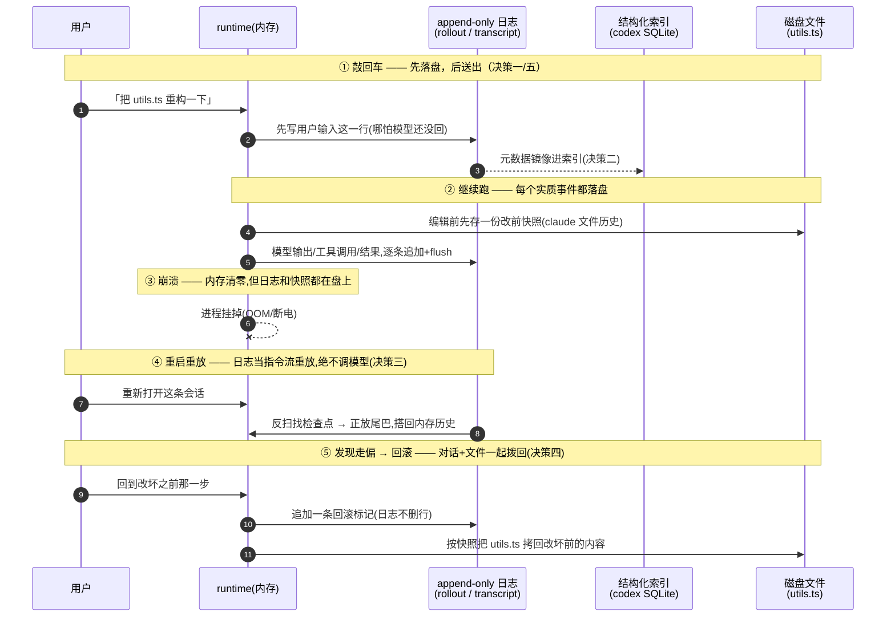
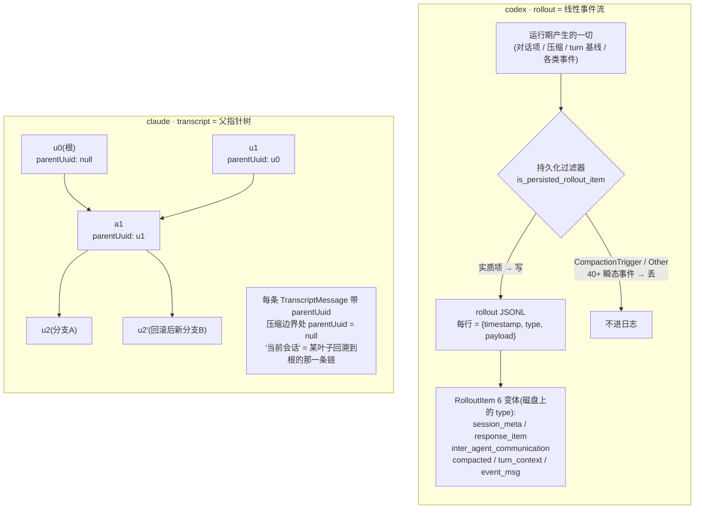
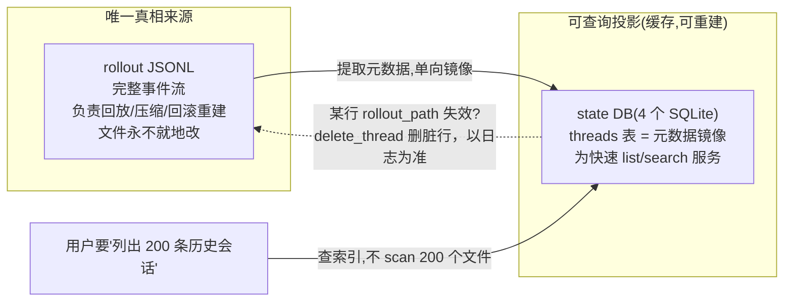
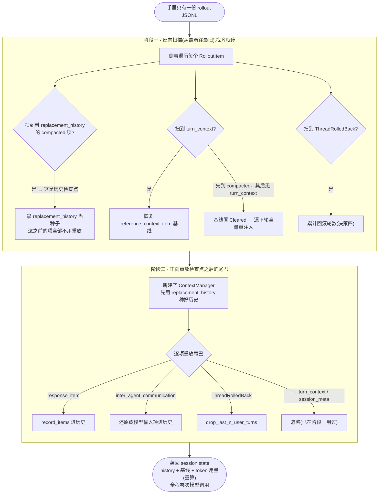
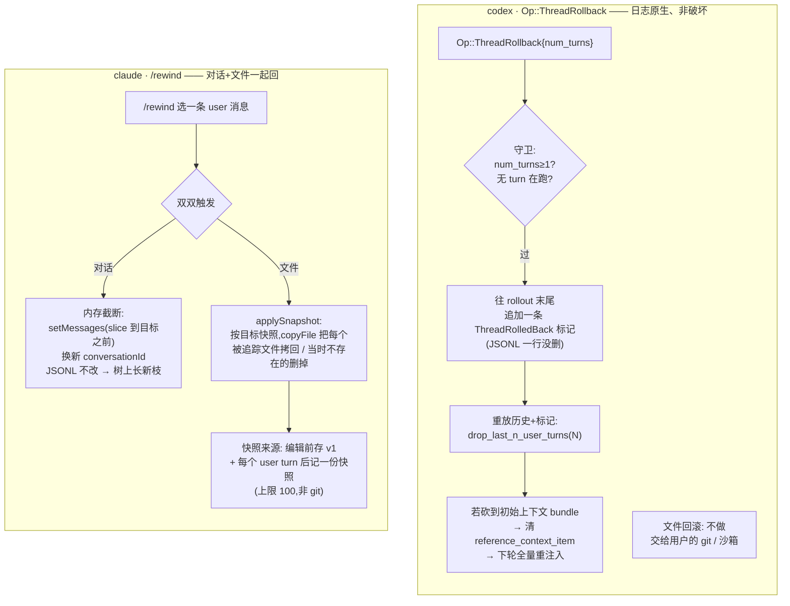

# 第 5 课：持久化、回放与回滚

> 面向 deepseek 自研的 agent runtime 设计课。基于 claude / codex 真实源码。
> 讲法：直接讲清每个设计决策的代码逻辑与取舍，claude 与 codex 双实现对照，每节给出 deepseek 的落地结论。
> 本课把前四课反复出现、却一直没正面讲的底层设施一次讲清：会话历史、记忆、运行期状态到底**怎么落盘、怎么在崩溃后恢复、怎么支持"回到三步之前重来"**。第 1 课决策五立过"先持久化后送出"的铁律，第 3、4 课又反复出现 rollout、state DB、git baseline、thread store——这些设施在这里收口。
> 本课所有结论都对着磁盘上的真源码核过（codex 在 `codex/codex-rs/`，claude 在 `claude/`），带 `file:line`。

---

## 0. 为什么持久化是 agent runtime 的地基

### 内存满足不了的三个需求

前四课讲的都是"内存里的事"：循环怎么转、上下文怎么装、压缩怎么压、记忆怎么抽。但有三个需求，光靠内存满足不了：

1. **崩溃恢复**:agent 跑了 40 轮，改了十几个文件，进程突然挂了（OOM、断电、用户手滑关窗口）。重启之后，这 40 轮不能凭空消失。
2. **会话恢复（resume）**：用户今天关掉、明天接着干同一个任务，得把昨天那条会话原样 load 回来。
3. **回滚/重来（rollback / rewind）**:agent 走错了路——改坏了文件、跑偏了方向。用户想"回到三步之前那个状态重来",**包括把被改的文件也恢复回去**。

这三件事的共同前提只有一个：**会话过程里发生的一切，必须在发生的当下就落到磁盘上**。这就是第 1 课决策五那条铁律——**先持久化，后送出/后处理**——的根本理由：如果你"做了但没记下来"，崩溃时就无法恢复，回放时就对不上。

### 一条贯穿全课的轨迹

这一课密，五个决策每个都有 claude/codex 两套实现。为了不被细节冲散，先约定一条具体轨迹，后面每个决策都回头看它在这一步发生了什么：

> 用户敲下「把 utils.ts 重构一下」，agent 读文件、改文件、跑了几轮；改到一半 agent 把文件改坏了，进程又恰好崩了；用户重启应用，看到会话还在，但发现方向不对，于是"回到改坏之前那一步重来"。

把这条轨迹拆成时间线，正好串起本课五个决策——**敲回车（落盘）→ 继续跑（持续落盘）→ 崩溃 → 重启重放 → 发现走偏 → 回滚**：



这条时间线就是本课的主线。下面五个决策，每一个都是在回答"这条线上的某一步，机制究竟是什么"。

### 本课回答的四个递进问题

把持久化体系拆开，是四个层层递进的问题：

| 决策 | 问题 | 一句话 |
|---|---|---|
| 决策一 | **存什么、怎么存？** | append-only 事件日志——会话的"流水账"长什么样 |
| 决策二 | **一份流水账够不够？** | 流水日志 vs 结构化索引——为什么 codex 在日志之外还要一个 SQLite 库 |
| 决策三 | **怎么从存的东西重建会话？** | 回放/恢复——给一个日志文件，把内存状态原样搭回来，且**不重新调模型** |
| 决策四 | **怎么回到过去？** | 回滚/重来——对话回滚 + 文件回滚两个独立机制 |

外加一条贯穿的一致性底线（决策五）。

一句话提纲挈领：**整个持久化体系的核心是一份"只追加、不改写"的事件日志（append-only log），它是唯一的真相来源；其它一切——结构化索引、内存状态、回滚——都是这份日志的投影或重放。** 这和第 1 课"会话历史只追加不改写"是同一个原则，只是从内存延伸到了磁盘。

下面逐个拆。claude 和 codex 在这四个问题上既有惊人的一致（都用 append-only JSONL），又有关键的分叉（codex 多一个 SQLite 索引层、回滚走"日志里加标记";claude 的历史是一棵树、回滚是"内存截断 + 文件拷贝快照"）。差异本身就是这一课的重点。

〔源码锚点：本课主线落点 —— 用户输入先落盘 = claude `QueryEngine.ts:436,451`、事件先落盘后交付 = codex `core/src/session/mod.rs:1833`；重放绝不调模型 = `core/src/session/rollout_reconstruction.rs:94`；回滚追加标记不删行 = `core/src/session/handlers.rs:451`、文件快照 = claude `utils/fileHistory.ts`。每处下文各决策详核。〕

---

## 决策一：存什么、怎么存 —— append-only 事件日志

### 问题

会话过程里有一堆东西在流动：用户说的话、模型说的话、工具调用和结果、token 用量、压缩事件、每轮的环境基线……要持久化，第一个决定就是：**用什么结构存？** 选错了，后面恢复和回放全是坑。

两家给了同一个答案：**一个 append-only（只追加）的 JSONL 文件**——每行一条 JSON，记录一个"发生了什么"的事件项。为什么是 append-only？因为第 1 课讲过：只追加的结构对缓存友好、对恢复友好（前面的内容永不变，崩溃时最多丢最后没写完的一行）、且天然是一份可审计的流水账。

大形态一致，数据模型却分叉：codex 的日志是一条**线性的事件流**（6 种事件项轮番追加），claude 的日志是一棵**父指针树**（每条消息指向它的父消息）。下图把两种结构并排画出来——左边 codex 的 rollout 是"一串带标签的事件项 + 一道持久化过滤器"，右边 claude 的 transcript 是"每条消息带 `parentUuid` 串成的链/树"。这两种形状决定了后面恢复（决策三）和回滚（决策四）走两条完全不同的路：



### codex 侧：rollout

codex 把这份日志叫 **rollout**（直译"录像带"，就是会话的完整回放流水）。

#### 落在哪、什么格式

写入路径与序列化：

- 路径：`~/.codex/sessions/YYYY/MM/DD/rollout-<时间戳>-<会话UUID>.jsonl`——按年/月/日分目录，文件名带时间戳和会话 id。
- 格式：**JSONL**，一行一个 JSON 对象。写入器 `JsonlWriter::write_line` 干的事极简单：`serde_json::to_string(item)` 序列化成一行 → 追加一个 `\n` → `write_all` 写文件 → **`flush()` 立刻刷盘**。每写一行都 flush，保证崩溃时已写的行不丢。（实现上日志写入跑在一个独立的 writer 任务里、靠 channel 收命令，但落到每一行仍是 write_all + flush 这一对动作，所以"写了就刷"这个保证成立。）

#### 6 个变体：日志的核心数据模型

每一行的结构是一个 `RolloutLine`：一个 `timestamp` 字段 + 一个**扁平展开的 `RolloutItem`**（带 `#[serde(flatten)]`）。`RolloutItem` 是这份日志的**核心数据模型**，一个带标签的枚举（serde 标了 `tag = "type", content = "payload"`、`rename_all = "snake_case"`），**恰好 6 个变体**:

| 变体（磁盘上的 `type`） | 装的是什么 |
|---|---|
| `session_meta` | 会话头：id、cwd、originator、cli 版本、model_provider、base_instructions、git 信息等。整个文件的第一行。 |
| `response_item` | 真正发给模型/模型产出的对话项：消息、推理、工具调用、工具结果…… |
| `inter_agent_communication` | agent 间通信项（多 agent 场景），回放时还原成模型可见的 `agent_message` |
| `compacted` | 一次压缩的产物（第 3 课的 `CompactedItem`）：摘要 `message` + 可选的 `replacement_history` + `window_id` |
| `turn_context` | **每个真实 user turn 的环境基线快照**（第 1 课 C2 那个 `reference_context_item` 的持久化形态）：cwd、model、approval/sandbox 策略、网络策略等 |
| `event_msg` | 一组被筛选过的会话事件（TurnStarted/TurnComplete/UserMessage/TokenCount……） |

序列化到磁盘就是 `{"timestamp": "...", "type": "<变体>", "payload": {...}}`。具象一下一段 rollout（字段忠于源码，值简化）：

```jsonl
{"timestamp":"...","type":"session_meta","payload":{"id":"5973b6c0-…","cwd":"/app","originator":"cli","cli_version":"1.0.0","model_provider":"openai","git":{"commit_hash":"abc123","branch":"main"}}}
{"timestamp":"...","type":"event_msg","payload":{"type":"TurnStarted","turn_id":"turn-001"}}
{"timestamp":"...","type":"event_msg","payload":{"type":"UserMessage","content":"把 utils.ts 重构一下"}}
{"timestamp":"...","type":"turn_context","payload":{"turn_id":"turn-001","cwd":"/app","approval_policy":"on-failure","sandbox_policy":"workspace-write","model":"codex-mini-latest"}}
{"timestamp":"...","type":"response_item","payload":{"type":"message","role":"assistant","content":[{"type":"output_text","text":"我先读一下文件"}]}}
{"timestamp":"...","type":"response_item","payload":{"type":"local_shell_call","id":"c1","action":{"type":"exec","command":["cat","utils.ts"]}}}
{"timestamp":"...","type":"event_msg","payload":{"type":"TurnComplete","turn_id":"turn-001"}}
```

#### 一道持久化过滤器：留实质、丢噪声

**不是所有东西都进日志**——有一个 `is_persisted_rollout_item` 判定函数。三类变体的去留规则不同：

| 变体 | 持久化规则 |
|---|---|
| `session_meta` / `turn_context` / `compacted` / `inter_agent_communication` | **永远持久化**（这些是回放骨架，一个都不能少） |
| `response_item` | 持久化消息/推理/工具调用/工具结果等实质项，但**跳过 `CompactionTrigger` 和 `Other`** 这类内部信号项（第 1 课决策四 D 讲 `record_items` 时点过的同一类东西） |
| `event_msg` | 只持久化约十几个**有语义的**事件（TurnStarted、TurnComplete、UserMessage、TokenCount、PatchApplyEnd、ThreadRolledBack……），**跳过约四十个**纯流式/生命周期的瞬态事件（每个 delta、每个进度条刷新都进日志的话，文件会爆炸） |

道理很直白：日志要能**重建会话**、又要能**当审计流水看**，所以留"发生了什么实质事件"，丢"过程中的噪声"。

#### "先持久化后送出"在代码里的落点

这条铁律的代码落点是 `send_event_raw`：它把一个事件包成 `RolloutItem::EventMsg`，**先 `persist_rollout_items` 落盘，再 `deliver_event_raw` 送给观察者**。对话项也一样：先 `record_items` 进内存历史、再 `persist_rollout_response_items` 落盘、最后才 `send_raw_response_items` 送出。**磁盘永远领先于内存交付**——这就是崩溃恢复的本钱。回到主线那条轨迹：用户敲回车那一下，输入这一行先落到 rollout，所以即便下一毫秒进程就崩了，这条会话也已经可恢复。

### claude 侧：transcript

claude 把这份日志叫 **transcript**（会话脚本/流水），思路一模一样，细节有别：

- 路径：`~/.claude/projects/<把cwd路径转义后的名字>/<sessionId>.jsonl`。按"项目目录"分文件夹，每条会话一个 `.jsonl`。
- 格式：同样 JSONL 追加，写入器 `Project.appendToFile` 用 `fsAppendFile`（`mode: 0o600`，只有本人可读——因为里面是你的代码和对话，敏感）。

每行的类型是 `TranscriptMessage`，由两层叠成：底层 `SerializedMessage` = 基础 `Message`（role + content + uuid + timestamp……）再盖一层会话戳（`sessionId`、`cwd`、`version`、`gitBranch`）；外层再加 **`parentUuid`** 和 `isSidechain`、`agentId` 等。

#### 关键结构差异：transcript 是一棵父指针树

这是和 codex 最大的分叉：**claude 的 transcript 不只是一条线，而是一棵"父指针树"。** 每条 `TranscriptMessage` 带 `parentUuid: UUID | null`（根节点或压缩边界处为 null，另有 `logicalParentUuid` 保留逻辑父）。也就是说历史是用"每条消息指向它的父消息"串起来的——**一条单向链表 / 一棵树**。这棵树的形状是决策三（恢复）和决策四（回滚）的关键：上面那张对照图右半边画的就是它，回滚时不删旧节点，而是从一个更早的节点"长出一条新枝"——先记住这个形状。

一段 transcript（字段忠于源码，值简化）：

```jsonl
{"type":"user","message":{"role":"user","content":"把 auth.ts 重构一下"},"uuid":"u1","parentUuid":"u0","sessionId":"s9","cwd":"/app","version":"1.x","gitBranch":"main","timestamp":"…"}
{"type":"assistant","message":{"role":"assistant","model":"claude-opus-4-8","content":[{"type":"text","text":"我先读一下"}],"usage":{"input_tokens":1200,"output_tokens":45}},"uuid":"a1","parentUuid":"u1","sessionId":"s9","cwd":"/app","timestamp":"…"}
```

**claude 的"先持久化后处理"**（源码里 `submitMessage` 处带一段写得很实在的注释）：进 query 循环**之前**，先 `await recordTranscript(messages)` 把用户这条消息落盘。注释解释了为什么必须在这：query 循环里只有当模型开始回话才会触发 transcript 写入，如果用户点了发送、几秒后进程被杀（模型还没回），transcript 里就只有队列操作、没有用户消息，`--resume` 会因"找不到对话"而失败。所以**在接受用户输入的那一刻就写，哪怕模型一个字都没回，这条会话也是可恢复的**。代价是这一步 `await` 大约 4ms(SSD)~30ms（磁盘争用），是关键路径上最大的一笔可控开销；`--bare`/SIMPLE 脚本模式则降级成 fire-and-forget（不阻塞，只为事后调试留痕）。

### 取舍

两家在"append-only JSONL 事件日志"这个大形态上完全一致，差异在数据模型：

- **codex 的 `RolloutItem` 是"会话事件"粒度**（6 个变体涵盖对话项、压缩、turn 基线、事件），为多前端/可回放/可远程而设计——任何客户端拿这份日志都能重建。
- **claude 的 `TranscriptMessage` 是"消息节点"粒度**，带 `parentUuid` 组成一棵树，为"分支、回滚到任意节点"而设计（决策四会看到回滚就是"换一个叶子重新长"）。

### deepseek 落地

1. **会话日志用 append-only JSONL**，一行一个"事件项",**只追加不改写**（压缩是唯一例外，见决策三，而且它也是写一条新的压缩记录、不是回去改老行）。这是整个持久化体系的地基，M0 第一天就立。
2. **用一个带标签的事件项枚举**（对话项 / turn 基线 / 压缩产物 / 语义事件……），序列化成 `{type, payload}`。别用一个无结构的大 JSON，后面回放分派要靠这个标签。
3. **加一道持久化过滤器**：实质项（消息、工具调用结果、压缩、turn 基线、关键事件）进日志；纯流式/进度/瞬态事件不进，否则文件爆炸。
4. **每写一行就 flush**（或小批量 flush），保证崩溃时已写的不丢。
5. **铁律：先落盘，后送出/后处理**。用户输入一进来就先写日志（哪怕模型还没回），再进循环；事件先持久化再交付观察者。这条让你白嫖崩溃恢复和会话重放。
6. 日志文件按"项目/会话"组织、权限设成仅本人可读——里面是用户代码和对话，是敏感数据。

〔源码锚点：codex rollout 写入器（`JsonlWriter::write_line` = `serde_json::to_string` + `\n` + `write_all` + 每行 `flush`，跑在独立 writer 任务里收 channel 命令）= `rollout/src/recorder.rs:1721,1735,1604`；`RolloutItem` 带标签枚举（`#[serde(flatten)]`、`tag="type"`/`content="payload"`/`rename_all="snake_case"`）**恰好 6 变体**（SessionMeta/ResponseItem/InterAgentCommunication/Compacted/TurnContext/EventMsg）= `protocol/src/protocol.rs:2952`；持久化过滤器 `is_persisted_rollout_item`（SessionMeta/TurnContext/Compacted/InterAgent 永远存，ResponseItem 跳 `CompactionTrigger`/`Other`，event_msg 筛语义事件）= `rollout/src/policy.rs:6,31,77`；先持久化后送出 `send_event_raw`（先 `persist_rollout_items` 再 `deliver_event_raw`）= `core/src/session/mod.rs:1833,1836,1840`，对话项先 `record_items`/再 `persist_rollout_response_items`/后 `send_raw_response_items` = `mod.rs:2670` 一带。claude transcript 路径 `~/.claude/projects/<proj>/<sid>.jsonl` + `Project.appendToFile`/`fsAppendFile`(`0o600`) = `utils/sessionStorage.ts`，`TranscriptMessage`（`SerializedMessage` + `parentUuid`/`logicalParentUuid`/`isSidechain`/`agentId`）= `types/logs.ts:221`；先持久化后处理：进 query 循环前 `await recordTranscript`、`--resume`/`--bare`/SIMPLE/`~4ms`/`~30ms` 注释 = `QueryEngine.ts:436,451`。〕

---

## 决策二：一份流水账够不够 —— 流水日志 vs 结构化索引

### 问题

假设你已经有了决策一那份 append-only 日志。现在用户打开应用，想看"我过去 200 条会话的列表，按时间排，标题、cwd、用了多少 token、在哪个 git 分支"。**你不能为了列个表，去把 200 个 JSONL 文件全 scan 一遍**——慢、费 IO。于是出现第二种存储需求：**一个可查询的结构化索引**。

这就是 codex 在 rollout 之外还有一个 **state DB（状态库）** 的原因。这里要把两种存储的**分工**讲清，这是本节的核心。两者的关系一句话画得清——日志是真相、DB 是从日志单向镜像出来的投影，箭头永远从日志流向 DB，反过来 DB 永远不能成为真相：



### codex:rollout 是真相，state DB 是索引

#### 四个独立的 SQLite 文件

codex 的 state DB 其实是**四个独立的 SQLite 文件**（文件名里的数字是迁移代数，用于版本化）：

| 文件 | 装的表 |
|---|---|
| `state_5.sqlite` | `threads`（会话元数据）、`agent_jobs`、`backfill_state` 等 |
| `memories_1.sqlite` | 第 4 课的 `stage1_outputs`（记忆抽取产物）、`jobs`（记忆任务租约） |
| `goals_1.sqlite` | `thread_goals`（会话目标/预算） |
| `logs_2.sqlite` | 进程日志 |

最核心的是 `threads` 表（共 39 个迁移叠出来），每行是一条会话的**元数据投影**：`id`、`rollout_path`（指向那份 JSONL！）、`cwd`、`title`、`model`、`source`、`tokens_used`、`archived`、`git_sha`/`git_branch`/`git_origin_url`、以及第 4 课讲过的 `memory_mode TEXT NOT NULL DEFAULT 'enabled'`（值 `enabled`/`disabled`/`polluted`）。

具象一下一行 `threads`（字段忠于迁移）：

```
threads 行 = {
  id: "01j9kxb3…",                        // 会话 id
  rollout_path: "~/.codex/sessions/…/rollout-….jsonl",  // ← 指回那份真相日志
  cwd: "/app", title: "Fix the login bug",
  model: "gpt-4o", model_provider: "openai",
  tokens_used: 14320, archived: 0,
  memory_mode: "enabled",                 // enabled/disabled/polluted
  git_sha: "abc123", git_branch: "main",
  created_at: 1746638661000, updated_at: 1746639012000,  // unix 毫秒
}
```

#### 分工的铁律：日志是真相，索引是投影

这条分工**源码注释写死了**（state crate 顶部那句：“extracts rollout metadata from JSONL rollouts and mirrors it into a local SQLite database”）：

- **rollout(JSONL)= 唯一真相来源**：完整事件流，负责回放、压缩、回滚重建。文件永不就地改（只追加，或压缩时整份替换）。
- **state DB(SQLite)= 从 rollout 镜像出来的可查询投影**：只存筛选过的元数据，为快速 list/search 服务，**它是缓存/索引，不是真相**。

#### 真相冲突时，rollout 赢

看 `list_threads` 的实现：若 DB 里某行的 `rollout_path` 已经失效（指向一个不存在的 JSONL），直接 `delete_thread` 把这条脏 DB 行删掉、以 rollout 为准。这条原则极其重要：**索引可以脏、可以重建，但绝不能让索引变成"真相"**——否则索引和日志一旦不一致，你就不知道该信谁。

#### `ThreadStore`：把"怎么存"抽象成一个边界

还有一个抽象层值得点名：**`ThreadStore` trait**——一个"存储中立"的会话持久化边界，暴露 `create_thread` / `resume_thread` / `append_items` / `load_history` / `flush_thread` / `delete_thread` 等方法。"thread"在这里 = 一条会话。具体实现 `LocalThreadStore`（本地 JSONL + SQLite）、`InMemoryThreadStore`（测试用）。把"怎么存"抽象成一个 trait，好处是上层逻辑不关心底层是本地文件还是云端。

> **一个命名陷阱**（容易踩）：codex 里还有另一个东西也叫 `thread_store`——第 4 课讲记忆扩展时 `on_thread_start` 往里 `insert(MemoriesExtensionConfig)` 的那个。**那个是扩展用的、进程内的、临时的"按 thread 存配置"的类型化 anymap，和这里durable 的 `ThreadStore` 持久化 trait 完全是两码事**，只是重名。看代码时别混。

### claude：索引层薄得多

claude 没有 codex 这样一套重型 SQLite 索引。它的"列出历史会话"靠的是扫 `~/.claude/projects/<project>/` 目录下的 `.jsonl` 文件 + 一些轻量辅助（`getLastSessionLog` 之类），从 transcript 头部的元数据读出标题/时间。

**为什么 claude 不需要那套重 DB?** 回到第 1 课的定位差异：claude 本质是单前端的 CLI/TUI，一个用户在本机扫自己几十上百个会话文件，够用；codex 要做多前端、app-server、云端任务（`agent_jobs`）、跨会话记忆管线（`stage1_outputs`、`jobs` 租约）、会话目标预算（`thread_goals`）——这些都需要**结构化查询和并发协调**（认领作业、租约、状态机），JSONL scan 扛不动，所以必须上 SQLite。**索引层的轻重，是被"前端形态和规模"逼出来的，不是凭空的复杂度。**

### 取舍

- **只有日志（claude 式）**：实现简单、真相唯一、零同步问题；代价是 list/search 要 scan 文件，规模一大就慢，也撑不起并发作业协调。
- **日志 + 结构化索引（codex 式）**:list/search/并发协调快；代价是多一套要维护的投影，且必须时刻守住"索引是缓存、日志才是真相、冲突时日志赢、索引随时可从日志重建"这条纪律，否则就会出现"DB 说有这条会话、文件却没了"这类不一致 bug。

### deepseek 落地

1. **只保留一个真相来源：那份 append-only 日志。** 任何索引/DB 都是从它派生出来的投影。这条想清楚，后面所有一致性问题都好办。
2. **M0 可以先不要 DB**：会话不多时，直接扫日志文件头读元数据列表就行。等"会话列表变慢"或"需要跨会话查询/并发作业"了，再加一个 SQLite 索引——而且要把它设计成**能随时从日志重建**（掉了、脏了，扫一遍日志重灌即可）。
3. **守住"冲突时日志赢"**：索引行和日志对不上，以日志为准、丢弃脏索引行。绝不让索引变成无法重建的"真相"。
4. 把"怎么存一条会话"抽象成一个接口（对应 `ThreadStore`），让上层不关心底层是本地文件还是将来的云端——deepseek 是桌面应用，将来很可能要同步到云，这个抽象口子值得早留。

〔源码锚点：codex state DB = **4 个 SQLite 文件**（`state_5.sqlite` threads/agent_jobs/backfill_state、`memories_1.sqlite` stage1_outputs/jobs、`goals_1.sqlite` thread_goals、`logs_2.sqlite` 进程日志）= `state/src/lib.rs:96-99`；`threads` 表（`id`/`rollout_path`/`cwd`/`title`/`model`/`tokens_used`/`archived`/`git_sha`/`git_branch`/`memory_mode`，39 个迁移）= `state/migrations/0001_threads.sql` 起；分工铁律"rollout=真相、SQLite=镜像投影"源码注释 = `state/src/lib.rs:1`；冲突时 rollout 赢——`list_threads` 见失效 `rollout_path` 即 `delete_thread` = `rollout/src/state_db.rs:438`；`ThreadStore` trait（`create_thread`/`resume_thread`/`append_items`/`load_history`/`flush_thread`/`delete_thread`，实现 `LocalThreadStore`/`InMemoryThreadStore`）= `thread-store/src/store.rs:32`。注意另有一个进程内临时的同名 `thread_store`（第 4 课记忆扩展用的类型化 anymap），与此 durable trait 重名但无关。〕

---

## 决策三：怎么从日志重建会话 —— 回放 / 恢复

### 问题

用户打开一条旧会话（或进程崩溃后重启）。你手里只有那份 JSONL 日志。要把**内存里的会话状态**——完整的对话历史、第 1 课那个 `reference_context_item` 增量基线、token 用量——原样搭回来。

关键约束：**回放绝不能重新调模型。** 日志里已经记了模型当时说的每一句、跑的每个工具的结果，重建时直接用这些，不能再花钱花时间重新生成一遍。所以回放本质是：**把日志当一串指令，顺序"重放"进一个空的会话状态容器。**

### codex：两阶段重建（`reconstruct_history_from_rollout`）

codex 的重建函数 `reconstruct_history_from_rollout` 有个聪明的两阶段设计，核心是**利用压缩产物当"检查点"(checkpoint)，避免从头重放整条历史**。先把两阶段画出来——阶段一倒着扫，目标是尽快找到一个能当"历史种子"的检查点和最新基线，找到就不必再往前看；阶段二只正向重放检查点之后的那截尾巴：



#### 阶段一：反向扫描，找三样东西

倒着遍历日志项，目标是尽快找齐三样东西，找齐就停：

1. **最新的、带 `replacement_history` 的 `compacted` 项**——这是一个**历史检查点**。第 3 课讲过，压缩产物里 `replacement_history` 就是"压缩后那份完整历史"。一旦反向扫到它，就知道：**这条线之前的所有项都不用重放了**，直接拿 `replacement_history` 当历史的"种子"，只重放这个检查点**之后**的尾巴。这就是为什么压缩不只是省 token，还省回放——它顺便给历史打了个存档点。
2. **最新的 `turn_context` 项**——拿来恢复 `reference_context_item` 基线（第 1 课 C2 那个增量注入基线）。反向看，如果先扫到 `compacted` 而它之后没有新的 `turn_context`，基线就被置成 `Cleared`（= `None`）——**逼下一轮全量重注入初始上下文**（对应第 1 课 C2"没基线就走全量"）。源码这里其实分得更细：`Cleared`（曾有基线、被压缩清掉了）和 `NeverSet`（这段重放从没建立过基线）是两个不同状态，但对下游效果一样——都回退到全量。
3. **`ThreadRolledBack` 标记累计的回滚轮数**（决策四细讲）。

#### 阶段二：正向重放存活的尾巴

拿阶段一定位的检查点，新建一个空 `ContextManager`，先用 `replacement_history` 把历史种好，然后只对检查点**之后**的项正向重放：

- `response_item` → `record_items` 进历史；
- `inter_agent_communication` → 还原成模型输入项再进历史；
- `compacted`（理论上反向循环已停在它之前，这里兜底）：有 `replacement_history` 就 `replace`；没有（老格式）就用第 3 课讲的 `collect_user_messages` + `build_compacted_history` 启发式重建；
- `ThreadRolledBack` → `drop_last_n_user_turns`（决策四）；
- `turn_context` / `session_meta` → 在历史重建阶段**忽略**（它们的作用是在阶段一定基线，不是历史正文）。

重建结果 `{ history, previous_turn_settings, reference_context_item, window_id }` 装回 session state（`replace_history` + `set_auto_compact_window_id` + `set_previous_turn_settings`）。

#### 灵魂：两种存档点让回放成为日志的纯函数

`turn_context` 和 `compacted.replacement_history` 是两种"存档点"，让回放是日志的纯函数、永不需要模型参与。源码里 `TurnContextItem` 的 doc 写得很直白："每个真实 user turn 后持久化一次，mid-turn 压缩重建完整上下文后再持久化一次，**好让 resume/fork 回放能恢复到最新的 durable 基线**"。

不过要诚实：源码里有一条 TODO 承认这套**还不是 100% 确定性**——部分运行期状态（shell 路径、exec 策略、feature 开关）目前没完全持久化进 `turn_context`，所以严格的"逐字节确定性回放"还在路上。设计意图是确定性回放，现实是"对话历史和基线能精确重建，少数运行期旁路状态还差口气"。回到主线那条轨迹：崩溃后重启，就是走这两阶段把内存历史从盘上的 rollout 搭回来，整个过程一次模型都不调——日志里早记了模型当时说的每句话。

### claude：沿父指针走链（`buildConversationChain`）

claude 的恢复用的是 transcript 那棵树：

1. `loadTranscriptFile` 把 JSONL 读成一个 `Map<uuid, TranscriptMessage>`（还顺带读出文件历史快照、内容替换记录等一堆旁路 map）；
2. `buildConversationChain` 从**最新的叶子节点**出发，顺着 `parentUuid` **一路往父节点回溯**，收集路径上的每条消息，最后 `reverse()` 成正序——这就是恢复出来的对话。回溯时带一个 `seen` 集合防 `parentUuid` 成环。

**注意这棵树的含义：transcript 文件里可能有多条分支（决策四回滚会制造分支），但"当前这条会话"永远只是"从某个选定叶子回溯到根"的那一条链。** 别的分支还在文件里，只是不在这条链上、不被加载。这和 codex"线性日志 + 回滚标记"是两种哲学（下一节细看）。

恢复时还会把 transcript 里的**文件历史快照**（`file-history-snapshot` 记录）读回来，并把对应的备份文件硬链接/拷贝到新会话目录（`copyFileHistoryForResume`）——这样恢复出来的会话连"能回滚到哪些文件状态"都一并接上了。最后 `adoptResumedSessionFile` 把这个旧 `.jsonl` 设成当前会话的写入目标，接着往后追加。

### 取舍

- **codex：线性日志 + 检查点重放。** 优点：压缩产物天然当存档点，回放只重放尾巴、很快；`turn_context` 让基线可精确恢复。代价：重建逻辑（两阶段、各种 item 类型分派）比较重，且严格确定性还差临门一脚。
- **claude：树 + 沿父指针走链。** 优点：极简单——恢复就是"从叶子回溯到根"；天然支持分支（回滚 = 换叶子）。代价：没有 codex 那种"压缩检查点跳过前缀"的优化（它靠压缩边界 `parentUuid=null` 来剪），且历史是否自洽更依赖写入时就把父子关系串对。

### deepseek 落地

1. **回放是日志的纯函数，绝不重新调模型。** 把日志当指令流，顺序重放进一个空会话容器，得到和崩溃前一样的内存状态。这条是恢复功能的全部要义。
2. **用压缩产物当历史检查点**（codex 式）：压缩时把"压缩后的完整历史"存进日志；回放时从最新检查点起步、只重放之后的尾巴，而不是从第一条重放到最后。省时间、也避免重放一堆已经被压掉的老内容。
3. **每个 turn 持久化一份环境基线**（对应 `turn_context` / `reference_context_item`）：回放时靠它恢复"当前生效的模型/权限/cwd"，而不用把整条历史重放完才知道现在什么设置。基线丢失就回退到全量重注入。
4. **token 用量等派生量，回放时从日志重算**(codex `recompute_token_usage`)，别指望它能"恢复"，它是算出来的。
5. 想清楚你的历史是**线性**（codex 式，配回滚标记）还是**树**（claude 式，配 parentUuid）：要支持"从任意历史点分支重来"，树更自然；只要线性恢复 + 末尾回滚，线性日志 + 标记更简单。deepseek 若想要 claude 那种"回到任意一条消息重来"，倾向树结构。

〔源码锚点：codex 两阶段重建 `reconstruct_history_from_rollout`（阶段一 `.rev()` 反扫找 `compacted.replacement_history` 检查点 + 最新 `turn_context` 基线，基线状态分 `Cleared`/`NeverSet`/`Latest`；阶段二正放尾巴 `response_item`→`record_items`、`inter_agent_communication`→还原、`ThreadRolledBack`→`drop_last_n_user_turns`、`turn_context`/`session_meta` 忽略）= `core/src/session/rollout_reconstruction.rs:94`；重建结果装回 session state（`replace_history`/`set_auto_compact_window_id`/`set_previous_turn_settings`）= `core/src/session/mod.rs:1342`；`TurnContextItem` doc"每个真实 user turn 后持久化、mid-turn 压缩重建后再持久化，好让 resume/fork 回放恢复到最新 durable 基线" = `protocol/src/protocol.rs:2991`；非 100% 确定性 TODO（部分运行期状态未持久化进 `turn_context`）= `core/src/session/mod.rs:1627`；`recompute_token_usage` 派生量重算 = codex `mod.rs`。claude 恢复用 transcript 树：`loadTranscriptFile` 读成 `Map<uuid, TranscriptMessage>`、`buildConversationChain` 从叶子沿 `parentUuid` 回溯到根再 `reverse()`（带 `seen` 防环）= `utils/sessionStorage.ts:2069`；恢复时读回 `file-history-snapshot` + `copyFileHistoryForResume` + `adoptResumedSessionFile` = `utils/sessionStorage.ts`。〕

---

## 决策四：怎么回到过去 —— 回滚 / 重来

### 问题

agent 走错了：改坏了文件，或者方向跑偏。用户要"回到第 N 步那个状态重来"。这件事其实是**两个独立的回滚**，必须分开做：

- **对话回滚**：把会话历史砍回到第 N 步（之后的对话作废）；
- **文件回滚**：把被 agent 改动过的**磁盘文件**也恢复到第 N 步时的内容。

只做前者，文件还是改坏的状态；只做后者，对话还停在错误的尾巴上。一个完整的"重来"两者都要。codex 和 claude 在这里走了两条很不一样的路，对照着看最长见识。下图把两条路并排——左边 codex"往日志追加一个回滚标记，回放时才把它算成 drop N turns，日志一行没删"；右边 claude"内存截断消息数组、JSONL 不改、树上长新枝，外加一套 copyFile 文件快照库把磁盘文件也拨回去"。注意一个共同点：**两家都没破坏那份 append-only 日志**：



### codex：对话回滚 = 往日志里追加一个"回滚标记"

codex 的对话回滚走 `Op::ThreadRollback { num_turns }`（第 1 课决策一讲的 Op 枚举里的一个），分派到 `thread_rollback` 这个 handler。它的设计精髓是**非破坏性**:

1. **守卫**：`num_turns == 0` 报错；**当前有 turn 正在跑**也报错（不能边跑边回滚）；
2. flush 当前 live thread 到盘，`load_history` 读出存量历史；
3. **构造一个 `ThreadRolledBack { num_turns }` 标记**，把它接在存量历史项**后面**，组成 `replay_items`；
4. `apply_rollout_reconstruction` 用这串（历史 + 标记）**重放**出新的内存历史，`recompute_token_usage` 重算用量；
5. **把这个标记 `persist_rollout_items` 追加进 JSONL、flush**;
6. 给客户端发 `ThreadRolledBack` 事件。

#### 关键：JSONL 文件从不被截断

回滚不是"删掉日志末尾几行"，而是**在末尾追加一条 `ThreadRolledBack` 标记**。日志依然 append-only。那回滚怎么生效？——靠**回放时应用这个标记**：决策三的重建逻辑里，扫到 `ThreadRolledBack` 就调 `history.drop_last_n_user_turns(rollback.num_turns)`，把最后 N 个 user turn 从重建出的历史里丢掉。也就是说**"逻辑上的回滚"是每次重放时算出来的，物理日志一行没少**。这保证了日志永远是完整审计流水，且回滚本身也能被回放（你甚至能回放出"在第几步执行了一次回滚"）。

#### 回滚砍历史时顺手清基线

`drop_last_n_user_turns` 还有一个第 1 课 C2 埋的细节在这里收口：回滚砍历史时，如果砍掉的范围里有一条"混合的 developer 消息"——既含可回滚的情境片段、又含 `build_initial_context` 来的持久 developer 正文——它会顺手把 **`reference_context_item` 置成 `None`**（靠 `trim_pre_turn_context_updates`）。原因：这条被砍的消息正是当初建立增量基线的那一份，基线赖以 diff 的东西没了，**再拿旧基线算 diff 就不可靠，不如清空、逼下一轮全量重注入**。第 1 课 C2 说的"回滚若毁了初始上下文消息就清空基线"，代码就在这。

#### 文件回滚 codex 自己不做

codex 的对话回滚是纯"对话"层面的。文件层面的"恢复改动",codex 依赖用户工作区本来就有的 git，以及它跑命令的沙箱策略——它不替你给工作区做文件快照。（codex 内部唯一用 git 当快照引擎的地方是**记忆工作区**，见下面的澄清，那和用户代码无关。）

### claude：`/rewind` —— 对话 + 文件一起回

claude 把这件事做成了一个面向用户的完整功能 `/rewind`（别名 `/checkpoint`）。它**同时**恢复对话和文件，两半是两套机制。

#### (A) 对话回滚 = 内存里截断消息数组

`rewindConversationTo` 的核心几行：

```
setMessages(prev.slice(0, messageIndex));   // 把消息数组切到目标消息之前(目标消息本身也不要)
setConversationId(randomUUID());            // 换新 conversationId,作废旧缓存
resetMicrocompactState();                   // 清掉指向被截断消息的 pinned 缓存编辑
resetContextCollapse();                     // (开了的话)上下文折叠状态也重置
// 再从目标消息恢复权限模式等
```

**注意：磁盘上的 `.jsonl` 不被改写。** 对话回滚只动内存里的 React 消息数组。被截断的那些消息还在文件里，但**下一轮会从回滚点开始、用新的 `parentUuid` 链往下接**——于是它们变成了树上一条**够不到的旧分支**（`buildConversationChain` 从新叶子回溯时根本走不到它们）。这正是决策一/三说的"transcript 是树"：回滚 = 从一个更早的节点重新长一条新枝，老枝枯在那儿但无害。

#### (B) 文件回滚 = 拷贝快照恢复，而且不是 git

这是 claude 这套里最值得学的部分——它**不用 git、不开影子仓库**，就是朴素的文件拷贝备份：

- **备份放哪**：`~/.claude/file-history/<sessionId>/<对文件路径取 sha256 的前16位>@v<版本号>`。例如 `…/file-history/s9/3f7a12bc9d8e4a01@v2`。
- **备份怎么做**：`createBackup` 就是 `copyFile(原文件, 备份路径)` 再 `chmod` 保权限。注释还特意说明用 `copyFile` 而非"读进内存再写"是为了不把大文件整个塞进 JS 堆 OOM。
- **两个快照触发点**:
  1. **每次编辑前**(`fileHistoryTrackEdit`):`FileWriteTool` / `FileEditTool` / `NotebookEditTool` 在真正改文件**之前**调它，把改前内容存成 `v1`——这样"改之前长什么样"被留住了；
  2. **每个 user turn 后**(`fileHistoryMakeSnapshot`)：以"用户那条消息的 uuid"为 key，记一份"此刻所有被追踪文件分别是哪个备份版本"的快照 `FileHistorySnapshot`。
- **快照上限 100**(`MAX_SNAPSHOTS = 100`)。每个快照也写进 transcript 的 `file-history-snapshot` 记录，所以跨 `--resume` 也在。
- **回滚怎么恢复文件**:`fileHistoryRewind` → `applySnapshot` 遍历所有被追踪文件：目标快照里这个文件是某个备份版本 → 内容不一致就 `restoreBackup`（= `copyFile(备份, 原文件)`）；目标快照里这个文件标记为"当时不存在"(`backupFileName: null`)→ 把它 `unlink` 删掉。于是磁盘文件被精确拨回那一刻。

具象一下文件历史快照（transcript 里的一行，字段忠于源码）：

```json
{"type":"file-history-snapshot","messageId":"u1","snapshot":{"messageId":"u1",
  "trackedFileBackups":{"src/auth.ts":{"backupFileName":"3f7a12bc9d8e4a01@v1","version":1}}}}
// 真正的备份内容在:~/.claude/file-history/<sessionId>/3f7a12bc9d8e4a01@v1(src/auth.ts 那一刻的整文件拷贝)
```

#### UI 流程：对话和文件一起拨回

`/rewind` 打开消息选择器 → 用户挑一条 user 消息 → 回调里 `onRestoreCode`（文件：`fileHistoryRewind`）和 `onRestoreMessage`（对话：`rewindConversationTo`）**一起触发**，把文件和对话双双拨回该点。回到主线那条轨迹：用户发现 agent 把 utils.ts 改坏了，`/rewind` 选回改坏之前那条消息——对话数组截到那之前、磁盘上的 utils.ts 也按那一刻的快照 copyFile 拷回原样，这才是一个完整的"重来"。

### 一个常见误解的澄清：codex 的 git 到底用在哪

讲到这里要顺手澄清一个容易张冠李戴的点，我核过源码：**codex 里出现的 git，没有一个是用来给用户代码做回滚快照的。** 两处 git 用途都另有其事：

- **记忆工作区的 git baseline**：第 4 课 Phase 2 整合时，在记忆目录（`~/.codex/memories_extensions/`）里建一个**私有 git 仓库当 diff 引擎**——`ensure_git_baseline_repository` 建基线 → 同步记忆碎片 → `diff_since_latest_init` 看有没有变 → 把 diff 当 prompt 喂给整合 agent → 成功后 `reset_git_repository` 推进基线。**纯内部、和用户代码无关。**
- **git enrichment**：一个后台 tokio 任务，读用户仓库的 HEAD commit、remote URL、是否有改动，塞进**分析/遥测元数据**和 state DB 的 `git_sha`/`git_branch` 列。第 1 课讲 `on_task_finished` 时那句"取消 git enrichment"取消的就是它——纯粹是收尾时停掉一个不再需要的后台 IO 任务。**和回滚毫无关系。**

所以对照清楚：**文件回滚这件事，claude 用自己的 copyFile 快照库（file-history）主动做；codex 不做，把工作区文件的恢复交给用户的 git/沙箱。** 别把 codex 的"记忆 git baseline"或"git enrichment"误读成文件回滚。

### 取舍

| 维度 | codex `ThreadRollback` | claude `/rewind` |
|---|---|---|
| 对话怎么回 | 往 append-only 日志**追加一个回滚标记**，回放时 `drop_last_n_user_turns` 应用 | **内存里截断**消息数组，JSONL 不改写，树上长新枝 |
| 日志是否被改 | 否（只追加标记，完整审计链还在，回滚本身可回放） | 否（旧分支枯在文件里，够不到） |
| 文件回滚 | **不做**，交给用户 git / 沙箱 | **做**:copyFile 快照库（非 git），编辑前 + 每轮快照，回滚时拷回/删除 |
| 基线处理 | 砍到初始上下文 bundle 时清 `reference_context_item` → 下轮全量重注入 | 换 conversationId、清 microcompact/context-collapse 状态 |
| 形态 | **日志原生**：回滚是日志里的一等事件 | **状态原生**：回滚是内存截断 + 带外文件拷贝 |

两家的共同点很关键：**回滚都不破坏那份 append-only 日志**——codex 追加标记、claude 让旧分支枯掉。日志的"只追加"属性，连回滚都没破坏它。

### deepseek 落地

1. **把"回滚"拆成对话回滚 + 文件回滚两件事**，分别设计。coding agent 改用户文件，**文件回滚价值极高**，别只做对话回滚。
2. **文件快照学 claude：用文件拷贝、别动用户的 git。** 在**每次编辑前**由编辑工具存一份改前拷贝（`v1`），再在**每个 user turn 后**记一份"此刻各文件是哪个版本"的快照（以用户消息 id 为 key）。回滚时按快照把文件拷回去、或删掉当时不存在的文件。给快照设个数量上限（claude 是 100）。用拷贝而非 git 的好处：不污染用户仓库、不和用户自己的 git 操作打架、对非 git 项目也work。
3. **对话回滚保持日志 append-only**：要么像 codex 追加一个"回滚 N 轮"标记、回放时应用（日志原生、可审计）；要么像 claude 内存截断 + 让旧分支枯在树上。两条都不要回去物理删日志行。
4. **回滚后重置依赖旧历史的状态**：增量注入基线（`reference_context_item`）、已读文件记录（`readFileState`，第 3 课）、各类缓存——回滚和压缩一样改写了"有效历史"，该清的按第 3 课决策四那张清单清。codex 砍到初始上下文就清基线、逼全量重注入，这条直接抄。
5. **回滚要有守卫**：有 turn 正在跑时拒绝回滚（codex 的 `has_active_turn` 检查）；`num_turns >= 1`。别让回滚和正在进行的采样互相踩。

〔源码锚点：codex 对话回滚 `Op::ThreadRollback{num_turns}`→`thread_rollback`（守卫 `num_turns==0`/`has_active_turn` 报错→flush→`load_history`→构造 `ThreadRolledBack` 标记接历史后→`apply_rollout_reconstruction` 重放→`recompute_token_usage`→`persist_rollout_items` 追加+`flush_rollout`→发 `ThreadRolledBack` 事件）= `core/src/session/handlers.rs:451-532`；回放时 `ThreadRolledBack`→`history.drop_last_n_user_turns(num_turns)` = `core/src/session/rollout_reconstruction.rs:308`；`drop_last_n_user_turns` 砍到混合 developer 消息时经 `trim_pre_turn_context_updates` 清 `reference_context_item` = `core/src/context_manager/history.rs:224,399`；codex 不做文件回滚，工作区恢复交用户 git/沙箱。claude `/rewind`（别名 `/checkpoint`）= `commands/rewind/index.ts`；(A) `rewindConversationTo`（`setMessages(prev.slice(0,messageIndex))` + `setConversationId(randomUUID())` + `resetMicrocompactState()` + `feature('CONTEXT_COLLAPSE')` 下 `resetContextCollapse()` + 恢复权限模式）= `screens/REPL.tsx:3661`；(B) 文件历史库 `utils/fileHistory.ts`：备份 `~/.claude/file-history/<sid>/<sha256前16>@v<n>`、`createBackup`=`copyFile`+`chmod`(`:778`)、两触发点 `fileHistoryTrackEdit`（编辑前存 v1）/`fileHistoryMakeSnapshot`（每 user turn 后以 uuid 为 key 记快照）、`MAX_SNAPSHOTS=100`、回滚 `fileHistoryRewind`→`applySnapshot`（`restoreBackup`=`copyFile` 拷回 / `backupFileName:null` 则 `unlink`）= `utils/fileHistory.ts:54,86,198,537,778`；UI 流程 `/rewind` 选 user 消息 → `onRestoreCode`(`fileHistoryRewind`)+`onRestoreMessage`(`rewindConversationTo`) 双触发。澄清：codex 的 git 两用途均非文件回滚 —— 记忆工作区 git baseline（`ensure_git_baseline_repository`/`diff_since_latest_init`/`reset_git_repository`）= `git-utils/src/baseline.rs` + `memories/write/`；git enrichment 后台任务读 HEAD/remote 塞遥测+state DB `git_sha`/`git_branch` = `core/src/turn_metadata.rs:267`。〕

---

## 决策五：一致性与安全底线

改写历史和重建状态是高危操作。把前四节的散点收成一张"底线清单",claude 和 codex 都守着：

1. **先持久化，后生效。**（贯穿全课的铁律）用户输入先写日志再进循环（claude 的 `recordTranscript`）；事件先落盘再交付（codex 的 `send_event_raw`）；压缩先持久化压缩产物再替换历史（第 3 课 `replace_compacted_history`）；回滚先重放、再持久化标记、再发事件。顺序反了，崩溃时就"做了没记下"。

2. **日志只追加，永不就地改。** 普通项追加；压缩是"写一条 `compacted` 记录 + 整份替换内存历史"，不是回去改老行；回滚是"追加一个标记"，不是删行。这保证日志始终是一份完整、可审计、可回放的流水——连"发生过一次压缩/回滚"都留痕。

3. **每写即刷盘（或小批刷盘）。** codex 每行 `flush`；claude 用批量写队列，但 cowork/eager 模式下显式 `flushSessionStorage`。崩溃时最多丢最后没刷的一点，已刷的都在。

4. **索引是缓存，不是真相，且随时可重建。** codex state DB 与 rollout 冲突时丢弃脏 DB 行、以 rollout 为准。永远不让结构化索引变成无法从日志重建的"唯一真相"。

5. **重建后保证历史自洽。** 回放/回滚/压缩改完历史，送模型前都要过第 1 课那个 `normalize`（补 aborted 结果、删孤儿调用、剥不支持的图）。"改历史"只管改，"自洽"交给统一的 normalize 兜底——回滚把一段砍掉，可能留下半截工具调用对，normalize 会在下次送模型前修。

6. **回滚/重建是"算出来的逻辑视图"，不是物理删除。** codex 的回滚标记 + `drop_last_n_user_turns` 每次重放时计算；claude 的树枯枝。物理日志完整，逻辑视图按需算——这让"撤销一次回滚""审计回滚发生在何处"都成为可能。

7. **持久化的是敏感数据，要可清理、可审计。** transcript/rollout 里是用户的代码、对话、可能的密钥；文件历史备份是文件全文拷贝。所以：文件权限设成仅本人可读（claude `0o600`）；快照有数量上限（claude 100）；记忆等机器自动写的东西要有一键清空出口（第 4 课 `clear_memory_roots_contents`）。**机器自动落盘的东西，人必须能找到、能清掉。**

### deepseek 落地

把这七条做成持久化模块的"验收清单":① 一切先落盘后生效；② 日志只追加（压缩整份替换、回滚加标记，都不删行）；③ 每写即刷或小批刷；④ 索引是可重建的缓存、冲突时日志赢；⑤ 重建后过 normalize 保自洽；⑥ 回滚做成"可重放的逻辑视图"而非物理删；⑦ 敏感落盘数据设权限、设上限、留清空出口。每一条都对应一类真实事故。

〔源码锚点：本节七条均在前四决策已逐条核出，此处汇总 —— 先持久化（claude `recordTranscript` / codex `send_event_raw`）见决策一锚点；冲突日志赢 `state_db.rs:438`、每行 `flush`（`recorder.rs:1735`）见决策一/二锚点；`normalize`（补 aborted/删孤儿/剥图）= 第 1 课决策四；`drop_last_n_user_turns` 逻辑视图见决策四锚点；claude `0o600` / `MAX_SNAPSHOTS=100` / `clear_memory_roots_contents`（第 4 课）见各处锚点。〕

---

## 速查表

| 维度 | claude | codex | deepseek 结论 |
|---|---|---|---|
| ① 日志形态 | transcript：`~/.claude/projects/<proj>/<sid>.jsonl`；`TranscriptMessage` 带 `parentUuid` = **树**；先写用户消息再进循环 | rollout:`~/.codex/sessions/Y/M/D/rollout-….jsonl`;`RolloutItem` 6 变体 = **线性**；持久化过滤器筛实质项；先落盘后交付 | append-only JSONL + 带标签事件项 + 持久化过滤器 + 先落盘后送出 |
| ② 索引层 | 薄：扫项目目录 + transcript 头元数据 | 重：4 个 SQLite(state/memories/goals/logs)；`threads` 表镜像；冲突时 rollout 赢、删脏行；`ThreadStore` trait | 单一真相=日志；索引是可重建缓存；M0 可先无 DB；冲突日志赢 |
| ③ 回放/恢复 | `loadTranscriptFile`→`buildConversationChain` 沿 `parentUuid` 回溯到根 | 两阶段：反扫找 `compacted` 检查点 + 最新 `turn_context` 基线 → 正放存活尾巴；绝不调模型 | 回放=日志纯函数不调模型；压缩产物当检查点；每轮存基线 |
| ④ 回滚/重来 | `/rewind`：对话内存截断（JSONL 不改、树长新枝）+ 文件 copyFile 快照库（非 git，编辑前+每轮，回滚拷回/删） | `Op::ThreadRollback`：追加 `ThreadRolledBack` 标记（日志不截断）、回放 `drop_last_n_user_turns`；砍到初始上下文清 `reference_context_item`；文件回滚不做（交用户 git） | 拆对话+文件两半；文件用拷贝快照别动用户 git；对话回滚保持日志 append-only；回滚后重置基线/已读文件 |
| ⑤ 一致性底线 | 先持久化、批量刷+eager flush、0o600、快照上限 100、树枯枝 | 先持久化、每行 flush、索引可重建、回滚标记可重放、normalize 兜底 | 七条验收清单：先落盘/只追加/即刷/索引可重建/normalize/逻辑回滚/敏感数据可清 |

总结：持久化体系的灵魂是**一份 append-only 事件日志当唯一真相**，其余都是它的投影（结构化索引）或重放（恢复、回滚）。claude 把历史做成一棵 `parentUuid` 树、回滚做成"内存截断换叶子 + copyFile 文件快照"，轻量且对"分支重来"友好；codex 把历史做成线性 rollout + 一套 SQLite 索引、回滚做成"日志里追加一个可回放的标记"，为多前端/可审计/确定性回放而设计。**deepseek 是改用户文件的桌面 coding agent,append-only 日志（①）、压缩检查点回放（③）、copyFile 文件快照回滚（④的 claude 半边）从第一天就该有——尤其文件回滚，是 coding agent"敢让 agent 自动改代码"的安全网。**

## 下一课

到这里，"agent = 围绕上下文窗口的循环"这条主线的核心设施已经铺完：主循环（1）、工具（2）、压缩（3）、记忆（4）、持久化与回滚（5）。但有一类贯穿所有这些、却一直被推迟的横切问题还没正面讲：**权限与安全**——工具执行前怎么判定该不该批准、沙箱怎么隔离、危险操作怎么门控、用户怎么授权一次/永久。第 2 课反复说"这个留到讲权限时细讲"、本课回滚反复出现"沙箱/审批策略"，都指向它。这是第 6 课「权限、审批与沙箱」。
