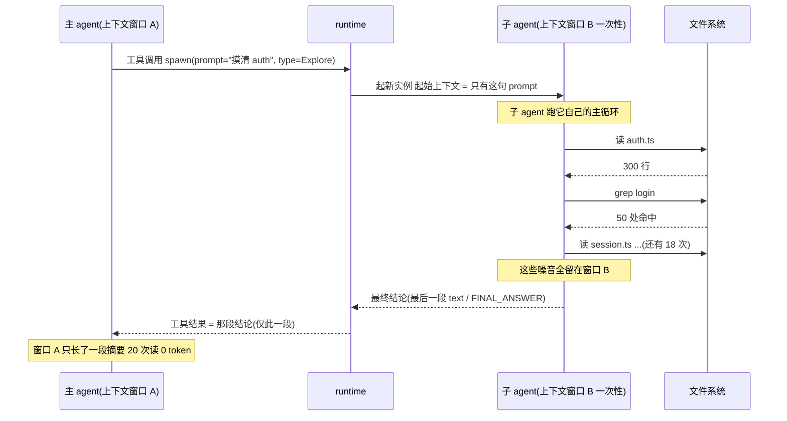
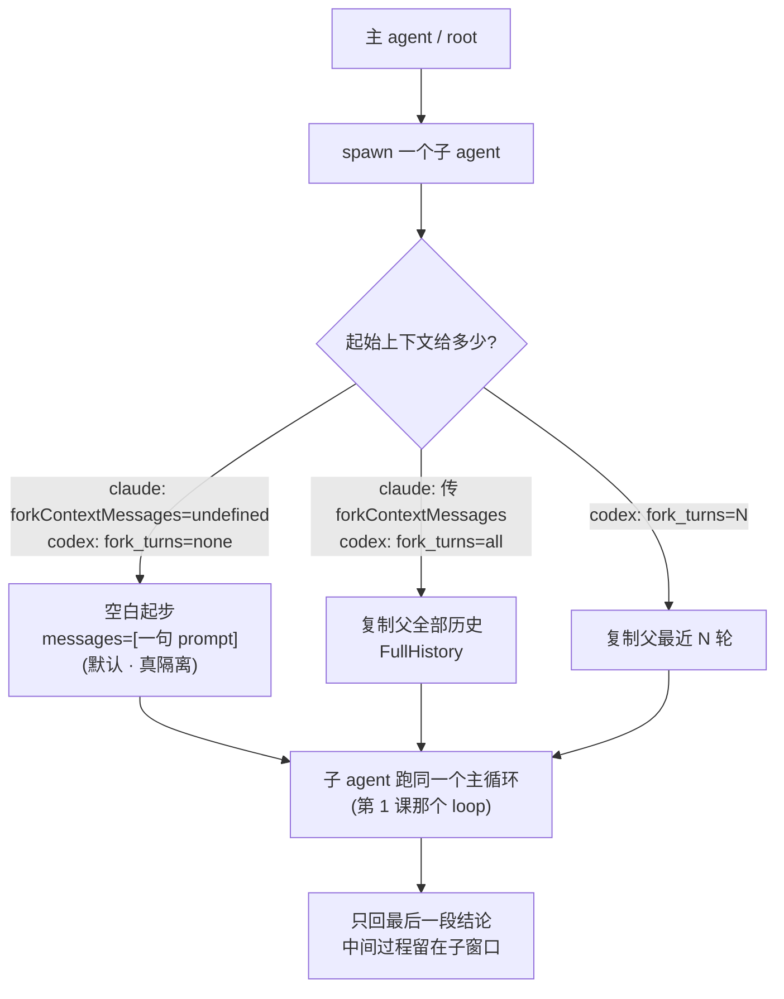
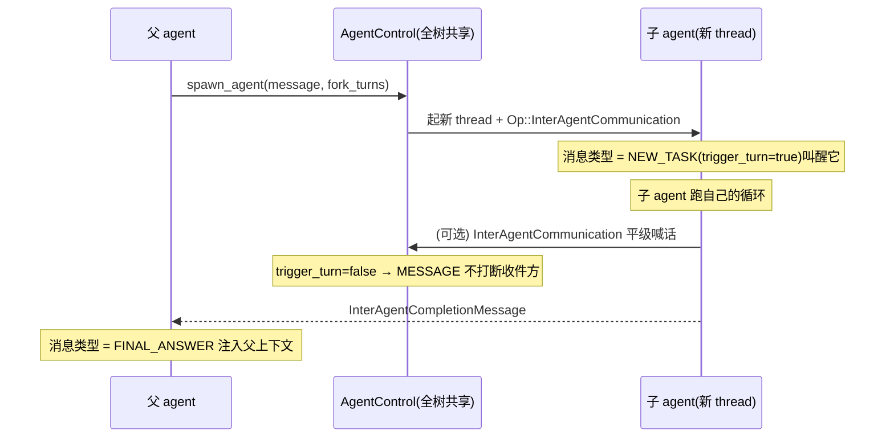
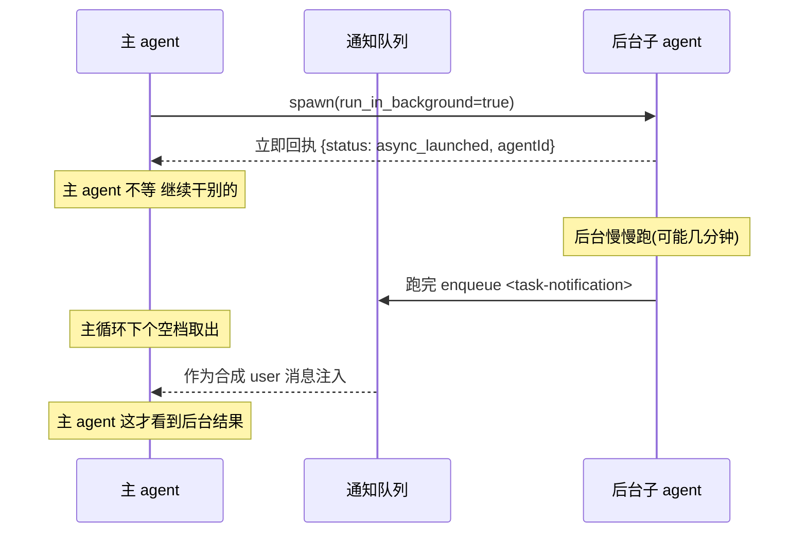
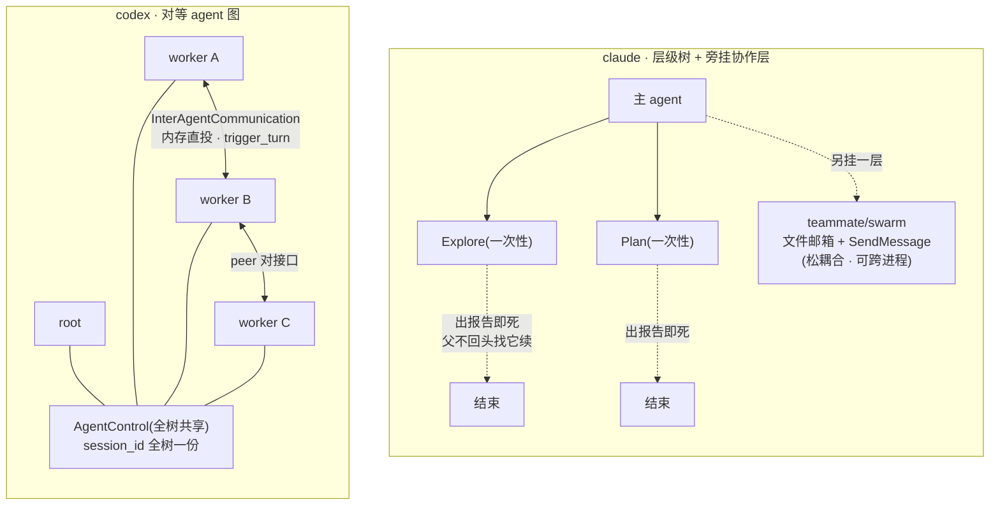

# 第 7 课：多 agent 编排与子 agent

> 面向 deepseek 自研的 agent runtime 设计课。基于 claude / codex 真实源码。
> 讲法：先立一根主线 + 一条具体轨迹，再展开；claude 与 codex 双实现当作"同一件事的两种做法"压在主线下，每节给出 deepseek 的落地结论。
> 本课所有结论都对着磁盘上的真源码核过（codex 在 `codex-rs/`，claude 在仓库根下、**注意没有 `src/` 前缀**）；所有可核验的 `file:line` 收在每个决策末尾的〔源码锚点〕行，正文只讲机制。前六课讲的都是"一个 agent 怎么转"，这一课开始讲"多个 agent 怎么协作"。

---

## 0. 一根主线，先记住

前六课的主线是一句话：**agent 是一个围绕上下文窗口的循环**。上下文窗口是整个系统里最稀缺的资源——第 3 课整课都在讲"窗口快满了怎么压缩"。

这一课讲的是省上下文（和并行）的另一条路。它的核心，记住这一句，后面全是细节：

> **派一个子 agent，第一价值不是"并行干活"，是"上下文隔离"。**
> **主 agent 把一个会产生大量过程噪音的子任务（读 30 个文件、grep、试错），连同一段干净的起始上下文，丢给一个全新的 agent 实例。子 agent 在它自己一次性的上下文窗口里把脏活干完，只把一段最终结论交回来。主 agent 的上下文里只多了那段结论——子任务烧掉的几十次工具调用、几十屏文件内容，主 agent 一个 token 都没花。**

这就是子 agent 和"主 agent 自己多转几圈"的本质区别：自己转，过程噪音全堆进主上下文（很快就要触发第 3 课的压缩）；派出去转，过程噪音留在别人的窗口里，**那个窗口用完即弃**。子 agent 是"上下文层面的外包"。

并行只是顺带的好处：既然子任务在独立上下文里跑，那就能同时派好几个。但**隔离是因，并行是果**——这个顺序记反了，后面很多设计取舍就解释不通。

### 一条具体轨迹（贯穿全课的例子）

主 agent 正在处理一个大任务："重构整个 auth 模块"。它决定先摸清 auth 现在怎么实现的，再动手。这件"摸清现状"的事会读一大堆文件，典型的过程噪音。于是：

1. **派子 agent。** 主 agent 发一个工具调用——claude 里这个工具叫 `Agent`，codex 里叫 `spawn_agent`——带上一句 prompt（"摸清 auth 模块现在怎么实现的，列出关键文件和数据流"）和一个 agent 类型。
2. **起一个隔离实例。** runtime 起一个全新的 agent 实例：**空白上下文 + 只有这句 prompt**。它看不到主 agent 之前聊了什么（除非显式 fork，见决策一）。
3. **子 agent 自己跑循环。** 它在自己的窗口里读 20 个文件、grep、试几条命令——这就是第 1 课那个主循环，只不过跑在一个独立实例里。
4. **只回一段结论。** 跑完，它的最后一段文字（claude）/ 一个 `FINAL_ANSWER` payload(codex)作为**工具结果**回到主 agent。那 20 次文件读、那 20 屏内容，主 agent 全看不到。
5. **主 agent 继续。** 主 agent 的上下文里只多了一段"auth 是这样实现的"摘要，然后接着干它的重构。

画成时序图，这就是全课的骨架——注意主 agent 的上下文（最上面那条线）从头到尾只长了一截：



这条主线下面挂五个决策，逐个展开。

---

## 决策一：派一个子 agent，到底发生了什么

### 一句话：起一个新 agent 实例，给它一段隔离的起始上下文，让它跑同一个主循环

子 agent 不是什么特殊机制。它就是**再跑一遍第 1 课那个主循环**，只不过：① 换了个起始上下文（通常是空白 + 一句 prompt）；② 换了个系统提示词（子 agent 有自己的"人设"）；③ 可能换了模型、收窄了工具集。跑循环的代码，主 agent 和子 agent 是**同一份**。

### claude：`Agent` 工具（`Task` 只是旧别名）

#### 先纠正命名：派 agent 的工具叫 `Agent`，不叫 `Task`

模型实际调用的工具叫 `Agent`，不叫 `Task`：

```
export const AGENT_TOOL_NAME = 'Agent'
// Legacy wire name for backward compat (permission rules, hooks, resumed sessions)
export const LEGACY_AGENT_TOOL_NAME = 'Task'
```

`Task` 是为了兼容老的权限规则、hook、恢复的会话才留的别名（注册时把 `Task` 挂成 `Agent` 的 alias）。**注意：仓库里另有一整套叫 `TaskCreate`/`TaskList`/`TaskUpdate` 的工具，那是管"待办清单"的，跟派 agent 完全是两回事**（决策四细说）。这是这套代码最大的命名坑。

#### `Agent` 工具的输入 schema

`Agent` 工具的输入 schema（我核过原文）：

```ts
{
  description: string,        // 3-5 词的人类可读标签
  prompt: string,            // 子 agent 的第一条 user 消息 = 它的全部任务
  subagent_type?: string,    // 选哪种 agent(general-purpose / Explore / Plan / 自定义…)
  model?: 'sonnet'|'opus'|'haiku',  // 单次模型覆盖
  run_in_background?: boolean,       // 同步等 还是 后台跑(决策四)
  // 以下是多 agent / 协作参数:
  name?: string,             // 给它起名 → 别的 agent 能 SendMessage 找它(决策三)
  team_name?: string,        // 派进某个 team
  mode?: PermissionMode,     // 子 agent 的权限模式(接第 6 课!)
  isolation?: 'worktree',    // 给它一个独立 git worktree(决策五)
  cwd?: string,              // 覆盖工作目录
}
```

#### 隔离的命门：起始消息数组里只放那一句 prompt

**起始上下文的隔离**，是子 agent 的命门，就这四行（我核过原文）：

```ts
const contextMessages: Message[] = forkContextMessages
  ? filterIncompleteToolCalls(forkContextMessages)
  : []
const initialMessages: Message[] = [...contextMessages, ...promptMessages]
```

正常派一个子 agent，`forkContextMessages` 是 `undefined`，所以 `contextMessages` 是空数组，`initialMessages` 就只有 `promptMessages`——**即那一句 prompt**。子 agent 的对话史从这一句开始，主 agent 之前的几十轮它一概看不见。这就是"隔离"在代码里的样子：不是加密、不是隔离进程，就是**起始消息数组里只放了那一句 prompt**。

然后把这个数组喂给 `query()`——**和主循环同一个函数**:

```ts
for await (const message of query({
  messages: initialMessages,          // 只有那句 prompt
  systemPrompt: agentSystemPrompt,    // 子 agent 自己的人设
  ...
  maxTurns: maxTurns ?? agentDefinition.maxTurns,
}))
```

所以"派子 agent"= 用一个新的 `messages` 数组 + 新的 `systemPrompt` 再调一次 `query()`。没有第二套引擎。

#### agent 类型从哪来：内置装配 + markdown 文件定义

内置的（general-purpose / Explore / Plan / statusline-setup / 等）在内置 agent 列表里装配；用户自定义的从 `.claude/agents/` 目录下的 markdown 文件加载——文件 frontmatter 里 `name`→类型名、`description`→何时用、`tools`→允许的工具列表（`['*']`=全部）、`model`→模型，**markdown 正文 = 这个 agent 的系统提示词**。这就是为什么你能用一个 markdown 文件定义一个子 agent：它被解析成 `{ 系统提示词, 模型, 工具集 }` 三件套。

#### 模型默认"继承父 agent"

子 agent 不写 `model` 时，默认值是字面量 `'inherit'`：

```ts
export function getDefaultSubagentModel(): string {
  return 'inherit'   // 子 agent 默认用父 agent 的模型
}
```

优先级链（`getAgentModel`，我核过）：环境变量 `CLAUDE_CODE_SUBAGENT_MODEL` > 工具调用里写的 `model` 参数 > agent 定义里的 `model` > `'inherit'`（回落到父模型）。

〔源码锚点：claude `Agent` 工具命名 `AGENT_TOOL_NAME='Agent'` / `LEGACY_AGENT_TOOL_NAME='Task'` = `tools/AgentTool/constants.ts:1,3`，注册 `name: AGENT_TOOL_NAME, aliases:[LEGACY_AGENT_TOOL_NAME]` = `tools/AgentTool/AgentTool.tsx:226,228`；输入 schema（description/prompt/subagent_type/`model: z.enum(['sonnet','opus','haiku'])`/run_in_background/name/team_name/mode/`isolation: z.enum(['worktree'])`/cwd）= `tools/AgentTool/AgentTool.tsx:82-101`；起始上下文隔离 `contextMessages = forkContextMessages ? filterIncompleteToolCalls(...) : []`、`initialMessages=[...contextMessages,...promptMessages]` = `tools/AgentTool/runAgent.ts:370-373`，喂给 `query({messages:initialMessages, systemPrompt:agentSystemPrompt, maxTurns: maxTurns ?? agentDefinition.maxTurns})` = `tools/AgentTool/runAgent.ts:748-757`；内置 agent 装配（general-purpose/statusline-setup + 按 gate 追加 Explore/Plan 等）= `tools/AgentTool/builtInAgents.ts:45-68`，自定义 agent 从 `.claude/agents/*.md` 解析 frontmatter（name/description/tools/model）+ 正文当 prompt = `loadAgentsDir.ts:75-79,408,412`；默认模型 `getDefaultSubagentModel`='inherit' = `utils/model/agent.ts:25-27`，优先级链 env `CLAUDE_CODE_SUBAGENT_MODEL` > 工具调用 model > agent 定义 model > 'inherit' = `utils/model/agent.ts:43,70,78`。〕

### codex：`spawn_agent` 工具（一等公民，而且是对等的）

codex 这边比我原以为的成熟得多——它有一套**一等公民、模型可直接调用**的多 agent 系统，藏在 `multi_agents_v2`（还有更老的 `multi_agents` V1）模块里，门控在 `Feature::MultiAgentV2` 后面。

#### `spawn_agent` 的参数：比 claude 多一个细分的 fork 旋钮

派子 agent 的工具就叫 `spawn_agent`：

```rust
fn tool_name(&self) -> ToolName { ToolName::plain("spawn_agent") }
```

它的参数（我核过原文）：

```rust
struct SpawnAgentArgs {
    message: String,                       // 给子 agent 的初始消息 = 任务
    task_name: String,                     // 子 agent 的名字(它在 agent 图里的路径)
    agent_type: Option<String>,            // 角色
    model: Option<String>,                 // 模型覆盖
    reasoning_effort: Option<ReasoningEffort>,  // 推理强度覆盖
    service_tier: Option<String>,
    fork_turns: Option<String>,            // 关键:fork 父的多少轮历史
    fork_context: Option<bool>,            // V2 已弃,改用 fork_turns
}
```

注意那个 `fork_turns`——这正是 claude 那个 `forkContextMessages` 的 codex 版，而且做得更细：

- `fork_turns = "none"` → 子 agent **空白起步**（对应 claude 正常路径）；
- `fork_turns = "all"` → 把父的**全部对话历史**塞给子 agent(`SpawnAgentForkMode::FullHistory`);
- `fork_turns = "5"` → 只 fork **最近 5 轮**。

也就是说，"隔离"在两家都是个**可调的旋钮**：默认隔离（空白），但需要时能把父的上下文（全部/最近 N 轮）复制给子 agent。把两家这个旋钮并排画出来，决策一这一步就是一张图——左边一个岔口（给多少起始上下文），三条路最后都汇到"跑同一个主循环、只回结论"：



#### 底层起的是一个新 thread/session

**底层起的是什么？** 一个新的 `CodexThread` / `Session`。codex 里"一个 agent"= "一个 thread/session"。`spawn_agent_with_metadata` 起一个新 thread，并把这条 prompt 包成一个 `InterAgentCommunication`（决策三的主角）作为子 agent 收到的第一个操作：

```rust
// 把初始 message 包成 agent 间通信投给新 agent
let mut communication =
    communication_from_tool_message(author, new_agent_path.clone(), message);
...
Op::InterAgentCommunication { communication }
```

#### 所有子 agent 共享一个控制平面（codex 与 claude 最大的结构差）

**所有子 agent 共享一个控制平面。** 这是 codex 和 claude 在结构上最大的不同。codex 有一个 `AgentControl`，整棵 agent 树共用一个（我核过原文）：

```rust
/// An `AgentControl` instance is intended to be created at most once per root
/// thread/session tree. That same `AgentControl` is then shared with every
/// sub-agent spawned from that root...
pub(crate) struct AgentControl {
    /// ID shared by the whole agent control session. This means every
    /// sub-agents from a common root share the same session ID.
    session_id: SessionId,
    manager: Weak<ThreadManagerState>,   // 弱引用回全局 thread 注册表,防引用环
    state: Arc<AgentRegistry>,
    v2_residency: Arc<V2Residency>,
    agent_execution_limiter: Arc<AgentExecutionLimiter>,  // 并发上限(决策五)
}
```

**根 agent 和它派生的所有子孙 agent，共享同一个 `session_id`、同一个 `AgentControl`、同一个 thread 注册表。** 这让 codex 的多 agent 更像一张"图"而不是一棵"调用栈"——任意两个 agent 之间能互相找到、互发消息（决策三）。claude 没有这个共享控制平面；它的子 agent 默认是"调用栈"式的：父调子、子返父（注意这说的是**"拓扑"**——sibling 之间互不寻址；与"能嵌多深"是两回事：claude 现已支持子 agent 嵌套 ≤5 层，见决策五现状补注）。

〔源码锚点：codex `spawn_agent` 工具名 `ToolName::plain("spawn_agent")` = `core/src/tools/handlers/multi_agents_v2/spawn.rs:28`，门控 `Feature::MultiAgentV2`；`SpawnAgentArgs`（message/task_name/agent_type/model/reasoning_effort/service_tier/fork_turns/fork_context 八字段，`#[serde(deny_unknown_fields)]`）= `spawn.rs:192-201`；`fork_mode()` 解析 none→`Ok(None)`、all（默认）→`Some(SpawnAgentForkMode::FullHistory)`、数字→`LastNTurns(N)` = `spawn.rs:204-237`；`spawn_agent_with_metadata` 起新 thread = `spawn.rs:108-109`，初始 message 经 `communication_from_tool_message(...)` 包成 `Op::InterAgentCommunication` = `spawn.rs:121-127`；`AgentControl` 结构（session_id / manager: `Weak<ThreadManagerState>` / state: `Arc<AgentRegistry>` / v2_residency / agent_execution_limiter）+ "created at most once per root thread/session tree" / "every sub-agents from a common root share the same session ID" 注释 = `core/src/agent/control.rs:85-103`。〕

> **决策一收口：**"派子 agent"= 起一个新实例，给它隔离的起始上下文，跑同一个主循环。隔离是默认、是命门，但**两家都把它做成可调旋钮**(claude `forkContextMessages` / codex `fork_turns: none/all/N`)。结构差异：claude 子 agent 默认是调用栈（父派子），codex 子 agent 默认进一张共享控制平面的图（全树共享 `AgentControl` + `session_id`）。

### deepseek 落地

1. **子 agent = "新 `messages` 数组 + 新系统提示词 + 同一个 loop"。别造第二套引擎。** 你第 1 课写的主循环，参数化掉"起始消息 / 系统提示词 / 工具集 / 模型"四样，就能复用来跑子 agent。
2. **隔离做成默认 + 一个 fork 旋钮。** M0 默认空白起步（`messages=[prompt]`）；留一个"fork 最近 N 轮"的口子以后用。别一上来就把父上下文全塞给子 agent——那等于没隔离，白付了子 agent 的钱。
3. **agent 类型用 markdown 文件定义**（frontmatter 配模型/工具，正文当系统提示词）——这是 claude 验证过的好设计，对产品来说"加一种专家 agent = 加一个 md 文件"，可维护性极高。
4. **M0 先做 claude 式的调用栈（父派子、子回主），别上 codex 的共享控制平面图。** 那张图很优雅，但它是为"多个长期 agent 互相喊话"准备的，deepseek M0 用不到（理由见设计反思）。

---

## 决策二：产出怎么收回——以及为什么这是子 agent 的灵魂

这一节正是全课那句话落到实处的地方。**子 agent 跑完一堆工具调用，但回到主 agent 的，只有最后一段结论文字。中间过程全部丢弃。** 这不是省事，这是子 agent 存在的全部理由——它兑现了第 0 节那句"过程噪音留在别人窗口里"。

### claude：只取最后一条 assistant 消息的 text

子 agent 的循环跑完后，`finalizeAgentTool` 负责把"一整段对话史"榨成"一段文字"（我核过原文）：

```ts
const lastAssistantMessage = getLastAssistantMessage(agentMessages)
...
// 取最后一条 assistant 消息里的 text 块
let content = lastAssistantMessage.message.content.filter(_ => _.type === 'text')
// 如果最后一条是纯 tool_use(循环在半路退出),往回扫到最近一条有 text 的
if (content.length === 0) {
  for (let i = agentMessages.length - 1; i >= 0; i--) {
    const m = agentMessages[i]!
    if (m.type !== 'assistant') continue
    const textBlocks = m.message.content.filter(_ => _.type === 'text')
    if (textBlocks.length > 0) { content = textBlocks; break }
  }
}
```

`agentMessages` 是子 agent 跑过的**全部消息**（几十条，含所有工具调用和结果）。`finalizeAgentTool` 从里头只挑出**最后一条 assistant 文字**，打包成 `{ agentId, content, totalTokens, totalToolUseCount, usage }` 还给主 agent。主 agent 在自己的对话里只看到一个 `tool_result` 块，内容就是那段 `content`——**子 agent 读过的文件、跑过的命令，主 agent 一个字都看不到**。

还有一个上下文经济学的细节：子 agent 一结束，就发一个信号让推理层把它的缓存链驱逐掉（`tengu_cache_eviction_hint`，`scope: 'subagent_end'`）。子 agent 的 prompt 缓存是一次性的，用完即弃——和它的上下文窗口一样。

〔源码锚点：claude `finalizeAgentTool` 用 `getLastAssistantMessage` 取最后 assistant 的 text 块、空则往回扫 = `tools/AgentTool/agentToolUtils.ts:297-317`；子 agent 结束发 `logEvent('tengu_cache_eviction_hint', { scope:'subagent_end' })` = `tools/AgentTool/agentToolUtils.ts:338-345`。〕

### codex:`FINAL_ANSWER` payload 回灌父上下文

codex 的子 agent 跑完，最终答案被包成一个 `InterAgentCompletionMessage`，回灌到父 agent 的上下文里（我核过整个文件）：

```rust
struct InterAgentCompletionMessage {
    task_name: AgentPath,   // 哪个子任务
    sender: AgentPath,      // 哪个子 agent
    payload: String,        // 子 agent 的最终答案
}

impl ContextualUserFragment for InterAgentCompletionMessage {
    fn role(&self) -> &'static str { "assistant" }   // 以 assistant 身份进父上下文
    fn body(&self) -> String {
        format!(
            "Message Type: FINAL_ANSWER\nTask name: {}\nSender: {}\nPayload:\n{}",
            self.task_name, self.sender, self.payload,
        )
    }
}
```

注意 codex 把它做成了一条**带类型的协议消息**：`Message Type: FINAL_ANSWER`。父 agent 在自己的上下文里读到的，是一条结构化的"某子任务的最终答案"。和 claude 一样，**子 agent 的中间过程不进父上下文**——回来的只有 `payload`。（这条 `FINAL_ANSWER` 是 codex 那套 `NEW_TASK / MESSAGE / FINAL_ANSWER` 消息协议的一员，完整协议在决策三。）

〔源码锚点：codex `InterAgentCompletionMessage`（task_name/sender/payload）、`role()` 返回 `"assistant"`、`body()` 以 `"Message Type: FINAL_ANSWER\n..."` 开头 = `core/src/context/inter_agent_completion_message.rs:6-9,23-24,35-38`。〕

### 为什么这是灵魂——一笔账

把第 3 课的账接上算一遍。假设"摸清 auth 模块"要读 20 个文件、平均每个 400 行、外加 15 次 grep:

- **不派子 agent（主 agent 自己读）：** 这 20 屏文件内容 + 15 次 grep 结果，**全部堆进主上下文**。几千上万 token，主 agent 还没开始重构，窗口已经被"调研垃圾"占掉一大块，很快触发第 3 课的压缩——而压缩还会炸缓存（第 3 课讲过）。
- **派子 agent:** 这些全在子 agent 的窗口里发生。回到主 agent 的只有一段几百 token 的摘要。**主 agent 的窗口干净如初。**

所以子 agent 的本质是一台"上下文压缩机":**用一个一次性窗口，把"大量原始信息"换成"一段提炼结论"。** 它和第 3 课的压缩是同一个目标（省主上下文）的两种手段——压缩是事后补救（窗口满了再砍），子 agent 是事前预防（脏活根本不进主窗口）。

这也解释了一个常见困惑：**为什么子 agent 不能"边干边把发现同步给我"?** 因为那样就破坏了隔离——过程噪音又流回主上下文了。子 agent 的契约就是"你别管我怎么干，我只给你结论"。要的就是这个信息屏障。

### deepseek 落地

1. **子 agent 的返回值 = 它最后一段文字，中间过程一律不回主上下文。** 这是默认契约，不是可选项。回灌中间过程 = 把子 agent 的全部价值清零。
2. **在子 agent 的系统提示词里明确要求它"最后输出一段结构化总结"。** 因为主 agent 只拿得到最后一段——如果子 agent 最后一句是"好的，我读完了"，主 agent 就只拿到这句废话。Explore/Plan 这类 agent 的提示词都在反复强调"你的最终输出就是交付物"。
3. **把子 agent 当"上下文压缩机"来用，而不是"多一个干活的"。** 选择派不派子 agent 的判据是：**这个子任务会不会产生大量我不想要的过程噪音？** 会 → 派出去隔离掉；不会（就几步） → 主 agent 自己干，省得付起一个实例的开销。
4. **子 agent 结束就驱逐它的缓存**（抄 claude 的 `subagent_end` 信号）——它的上下文一次性，缓存也一次性，别占着推理层的缓存预算。

---

## 决策三：agent 之间怎么说话

决策一二讲的是"父派子、子回父"这条主干。但一旦你有多个 agent 同时活着（尤其 codex 那张共享控制平面的图），就有了第二个问题：**两个平级的 agent，怎么互相喊话？** 这就是 inter-agent communication。两家做法差很远。

### claude：文件邮箱 + `SendMessage`，偏"跨进程协作"

claude 的 agent 间通信主要服务于"teammate / swarm"场景——好几个 agent（可能在不同 tmux 窗格、甚至不同进程）组成一个 team 协作。核心机制是**文件邮箱**（我核过原文）：

```
Teammate Mailbox - File-based messaging system for agent swarms
Each teammate has an inbox file at
  .claude/teams/{team_name}/inboxes/{agent_name}.json
Other teammates can write messages to it, and the recipient sees them as attachments.
```

每个 teammate 在磁盘上有一个收件箱 JSON 文件。别的 agent 给它发消息 = **往它的收件箱文件追加一条**；它自己轮询收件箱，把未读消息以 `<teammate-message>` XML 块注入自己下一轮的上下文。

发消息的工具是 `SendMessage`（我核过 schema）：

```ts
{
  to: string,        // 收件人:teammate 名字 / "*" 广播给全队 / "uds:<socket>" / "bridge:<session>"
  summary?: string,  // UI 里显示的 5-10 词预览
  message: string | StructuredMessage,  // 文本 或 结构化消息(shutdown_request / plan_approval_response 等)
}
```

一个 agent 怎么变得"可被寻址"？靠决策一里那个 `name` 参数。它的 schema 描述原文就是：

```ts
name: z.string().optional()
  .describe('Name for the spawned agent. Makes it addressable via SendMessage({to: name}) while running.')
```

派 agent 时给个 `name`，它就被登记进一张名字→agentId 的注册表，之后别人 `SendMessage({to: name})` 就能找到它。投递分三条路（我核过 SendMessageTool 的分支）：① **同进程子 agent**——直接挂到目标的待处理消息队列；② **跨进程/跨窗格**——写对方的收件箱文件（上面那个 JSON）；③ **跨机器**——走 `bridge:` / `uds:` socket。

注意 claude 这套是**叠在子 agent 主干之上的另一层**。普通的 Explore/Plan 子 agent 根本不参与——它们是"跑一次出报告就结束、父永不回头找它续"的一次性 agent:

```ts
// Built-in agents that run once and return a report — the parent never
// SendMessages back to continue them.
export const ONE_SHOT_BUILTIN_AGENT_TYPES = new Set(['Explore', 'Plan'])
```

只有显式组 team、带 `name` 派出去的 teammate，才进邮箱协作那一层。**所以 claude 其实有两套并存的形态：一次性子 agent（主干）+ 文件邮箱 teammate（协作层）。**

〔源码锚点：claude 文件邮箱 `.claude/teams/{team_name}/inboxes/{agent_name}.json` = `utils/teammateMailbox.ts:1-8`；`SendMessage` schema（to/summary/message）= `tools/SendMessageTool/SendMessageTool.ts:67-86`；`name` 字段 describe "Makes it addressable via SendMessage({to: name}) while running" = `tools/AgentTool/AgentTool.tsx:94`；一次性 agent 集合 `ONE_SHOT_BUILTIN_AGENT_TYPES=new Set(['Explore','Plan'])`（仅此两类）= `tools/AgentTool/constants.ts:9`。〕

### codex：`InterAgentCommunication` 总线 + 带类型的消息协议，偏"进程内对等图"

codex 没有"文件邮箱"——它所有 agent 都活在同一个进程、同一张共享控制平面的图里，所以消息直接在内存里投。核心类型 `InterAgentCommunication`（我核过原文）：

```rust
pub struct InterAgentCommunication {
    pub author: AgentPath,                 // 谁发的
    pub recipient: AgentPath,              // 发给谁
    pub other_recipients: Vec<AgentPath>,  // 抄送
    pub content: String,
    pub encrypted_content: Option<String>, // 可加密
    pub metadata: Option<ResponseItemMetadata>,
    pub trigger_turn: bool,                // 关键:这条消息要不要"叫醒"对方
}
```

它作为一个 `Op`（对 agent runtime 的操作，第 5 课讲过 Op/SQ）走正常的提交流程（`Op::InterAgentCommunication`）。投递路径是直接往目标 thread 的输入队列里塞（`send_inter_agent_communication` → `state.send_op(agent_id, op)`）——**没有文件、没有轮询，内存直投**。

最值得学的是那个 `trigger_turn` 字段 + 一套**带类型的消息协议**。看 `to_model_input_item`（我核过原文）：

```rust
let message_type = if self.trigger_turn {
    "NEW_TASK"     // 叫醒对方,立刻起一个 turn 干活
} else {
    "MESSAGE"      // 只投进上下文,不叫醒(对方下次自己醒了会看到)
};
```

加上决策二那条回程的 `FINAL_ANSWER`，codex 的 agent 间消息其实是一套有限的协议：

| 消息类型 | 何时 | 效果 |
|---|---|---|
| `NEW_TASK` | spawn 子 agent / 派新任务（`trigger_turn = true`） | 把消息投给对方 **并立刻叫醒它起一个 turn** 干活 |
| `MESSAGE` | 平级通知（`trigger_turn = false`） | 只把消息塞进对方上下文，**不打断它**，它下次自然醒来时才看到 |
| `FINAL_ANSWER` | 子 agent 干完回灌父（决策二） | 把最终答案以 assistant 身份注入父上下文 |

`trigger_turn` 这一个布尔，就把"主动派活（要立刻干）"和"顺手通知（别打断你）"分开了——这是个很精巧的设计。

画成时序图，codex 的一次"父派子→子干活→回灌"是这样（注意全程在内存的同一张图里）：



还有一个第 5 课的回扣：**这些 agent 间消息会落进 rollout 日志**——`RolloutItem::InterAgentCommunication`。也就是说多 agent 的对话和单 agent 的对话一样被持久化，能重放、能崩溃恢复。codex 把多 agent 当一等公民，连"对话落盘"这条都给它接上了。

〔源码锚点：codex `InterAgentCommunication` 结构（author/recipient/other_recipients: `Vec<AgentPath>`/content/encrypted_content/metadata/trigger_turn）= `protocol/src/protocol.rs:684-698`；作为 `Op::InterAgentCommunication` = `protocol/src/protocol.rs:559`；投递 `send_inter_agent_communication`（声明）→ 内部 `state.send_op(agent_id, op)` = `core/src/agent/control.rs:167,177`；`to_model_input_item` 按 `trigger_turn` 选 `"NEW_TASK"`/`"MESSAGE"` = `protocol/src/protocol.rs:747-754`；落 rollout `RolloutItem::InterAgentCommunication` = `protocol/src/protocol.rs:2956`。〕

### 两种通信的取舍

| | claude（文件邮箱） | codex（内存总线） |
|---|---|---|
| 介质 | 磁盘 JSON 收件箱 + 轮询 | 内存直投目标 thread 输入队列 |
| 跨进程/跨机器 | 天生支持（文件 / bridge / uds） | 不支持（都在一个进程的图里） |
| 延迟 | 高（轮询间隔） | 低（直投） |
| "叫醒 vs 不打断" | 靠消息结构（`shutdown_request` 等）+ 收件方自行处理 | 一个 `trigger_turn` 布尔显式区分 |
| 落盘/可重放 | 收件箱文件本身就是记录 | `RolloutItem::InterAgentCommunication` 进 rollout |
| 适合 | 松耦合、可能分布式的 teammate 协作 | 紧耦合、同进程的对等 agent 图 |

### deepseek 落地

1. **M0 大概率根本不需要 agent 间通信。** deepseek 是单用户桌面 coding agent，主干是"父派子摸清现状 / 干子任务、子回结论"。这条主干**不需要平级 agent 互相喊话**。先把决策一二做扎实，通信往后放。
2. **真要做，先抄 codex 的 `trigger_turn` 概念**——区分"派活（立刻干）"和"通知（别打断）"是个本质区分，一个布尔就能表达，很便宜。
3. **介质选内存还是文件，取决于你的 agent 跨不跨进程。** deepseek 的子 agent 如果都在同一个 Tauri 后端进程里 → 内存总线（codex 式），简单且低延迟。如果将来要跨进程/跨机器才考虑文件邮箱（claude 式）那套重机制。
4. **别把"父子回程（FINAL_ANSWER）"和"平级喊话（MESSAGE）"混成一个机制。** 父子回程是必做的（决策二）；平级喊话是可选的高级功能。codex 用同一个 `InterAgentCommunication` 类型 + 不同 message_type 表达两者，是个干净的统一，可以借鉴，但别因此以为"必须先有总线才能有子 agent"——claude 证明了一次性子 agent（决策一二）完全不需要总线。

---

## 决策四：同步收口 vs 后台长跑，以及怎么编排一群 agent

### 两种返回时机：阻塞等 vs 后台跑

派一个子 agent，有两种等法：

- **同步（默认）：** 主 agent 这一轮**阻塞**，等子 agent 跑完，把结论作为工具结果直接返回到同一轮。决策一二讲的就是这条。简单、可控，适合"我需要这个结论才能继续"。
- **后台（`run_in_background: true`）：** 主 agent **不等**，子 agent 被甩进后台跑，主 agent 当轮立刻拿到一个"已启动"的回执继续干别的。子 agent 跑完后，通过**通知**回来。

claude 的后台路径是"发射后不管"(fire-and-forget)：派出去时 `void runAsyncAgentLifecycle(...)`（那个 `void` 前缀让它和主调用栈彻底脱钩），主 agent 当轮就返回 `{status: 'async_launched', agentId, outputFile}`。子 agent 跑完，把结论包成一条 `<task-notification>` XML，通过 `enqueuePendingNotification({ value: message, mode: 'task-notification' })` 压进一个通知队列，主循环在下一个空档把它当成一条**合成的 user 消息**注入，主 agent 这才看到子 agent 的结果。



这就解释了一个你可能踩过的坑：**后台 agent 的结果不是"立刻"回来的，而是排队等主循环下一个空档**。如果主 agent 一直在忙，通知会等；它优先级是 `'later'`（低于用户输入）。所以"派了个后台 agent 然后它好像没动静"，往往不是它没跑完，是通知还在队里排着。

还有一道守卫：**in-process teammate 不能再派后台 agent**：`'In-process teammates cannot spawn background agents. Use run_in_background=false...'`——防止后台 agent 套后台 agent 套出失控的树。

〔源码锚点：claude 后台路径 `void runAsyncAgentLifecycle(...)` 回 `{status:'async_launched', agentId, outputFile}`；跑完 `enqueuePendingNotification({ value: message, mode:'task-notification' })` 注入合成 user 消息（优先级 `'later'`，低于用户输入）= `tasks/LocalMainSessionTask.ts:262`（及多处同走此路）；"In-process teammates cannot spawn background agents..." 守卫 = `tools/AgentTool/AgentTool.tsx:278`。〕

### 编排：一群 agent 的拓扑怎么记

派出去一堆 agent，得有个地方记着"现在有谁、谁是谁的子、谁还活着"。两家又是两条路。

**claude：`TeamFile` 花名册（磁盘）。** 一个 team 的全部成员记在 `.claude/teams/{team}/config.json` 里（我核过原文）：

```ts
type TeamFile = {
  name: string
  leadAgentId: string            // 谁是队长
  members: Array<{
    agentId: string
    name: string                 // 用来 SendMessage 寻址
    agentType?: string
    model?: string
    tmuxPaneId: string           // 在哪个 tmux 窗格(可视化)
    cwd: string
    worktreePath?: string        // 它的 worktree(决策五)
    subscriptions: string[]
    isActive?: boolean           // false = 空闲
    mode?: PermissionMode        // 它当前的权限模式
  }>
}
```

这是个**扁平的花名册**：一个 lead + 一串 member，主要支撑"广播给全队"和 UI 上把每个 agent 画出来（那个 tmuxPaneId）。它记的是"成员"，不太强调"谁派生了谁"的树形结构。

**codex：`AgentGraphStore` 父子拓扑（持久化的图）。** codex 专门有一个存储抽象记"谁 spawn 了谁"（我核过原文）：

```rust
pub trait AgentGraphStore: Send + Sync {
    // 插入/更新一条 父→子 的有向边
    fn upsert_thread_spawn_edge(&self, parent: ThreadId, child: ThreadId, status: ...);
    // 列出某个 agent 的直接子 agent
    fn list_thread_spawn_children(&self, parent: ThreadId, status_filter: ...);
    // 按广度优先列出某个 agent 的所有子孙
    fn list_thread_spawn_descendants(&self, root: ThreadId, status_filter: ...);
}
```

这是一张**真正的有向图**：节点是 agent(thread)，边是"spawn 关系"，带状态（open/closed）。而且它**持久化**——注释里写明"让调用方能把持久化的图状态和内存里的活状态合并"，目的是重启后能恢复整棵 agent 树。这又是第 5 课的回扣：codex 把多 agent 的拓扑也当成要落盘、要能恢复的状态。

**形态对比一句话：claude 记的是"一个队的花名册"（扁平、为协作和 UI），codex 记的是"一棵 spawn 树/图"（层级、持久、为恢复）。** 这对应了两家不同的多 agent 哲学（设计反思细说）。

〔源码锚点：claude `TeamFile`（name/leadAgentId/members[]，member 含 agentId/name/agentType/model/tmuxPaneId/cwd/worktreePath/subscriptions/isActive/mode）= `utils/swarm/teamHelpers.ts:64`；codex `AgentGraphStore` trait（`upsert_thread_spawn_edge`/`list_thread_spawn_children`/`list_thread_spawn_descendants`，边带 open/closed 状态、持久化合并内存活状态）= `agent-graph-store/src/store.rs:10`。〕

### 顺带澄清那套 `TaskCreate` / `TaskList` 工具

前面提过的命名坑，这里收掉。claude 有一组 `TaskCreate` / `TaskList` / `TaskUpdate` / `TaskGet` / `TaskStop` 工具，**它们管的不是 agent，是一张共享待办清单**(to-do list)。`Task` 数据结构是 `{ id, subject, description, owner, status: pending/in_progress/completed, blocks, blockedBy }`，存在 `~/.claude/tasks/{taskListId}/` 下，每个待办一个 JSON 文件，同一个 team 共享一个清单。它的用途是：一群 teammate 之间**协调"还有哪些活、谁认领了哪件、哪件卡在哪件后面"**——是项目管理，不是 agent 调度。运行中 agent 的注册表是另一个东西（内存里的 `AppState.tasks`）。**别被名字骗了：`TaskCreate` 建的是待办，`Agent` 派的才是 agent。**

### deepseek 落地

1. **M0 先只做同步子 agent。** 阻塞等、结论直接回当轮——最简单、最可控。后台 agent 是个大特性（要通知队列、要 agentId 寻址、要 UI 展示进度），等你真有"用户想让 agent 后台跑长任务"的需求再上。
2. **后台 agent 的结果靠"注入合成消息"回主上下文**（抄 claude 的 `task-notification` 注入）——这是把异步结果接回同步主循环的标准做法，记住它优先级要低于用户输入（用户说话永远插队在前）。
3. **拓扑：M0 一张扁平花名册足够**（像 claude 的 TeamFile:agentId + name + status）。codex 的持久化 spawn 图很漂亮，但它是为"重启恢复整棵 agent 树"准备的，deepseek M0 的子 agent 都是一次性的、不跨重启，不需要。
4. **务必把"待办清单"和"agent 注册表"分成两个东西**，别学某些代码把它们都叫 Task。deepseek 里：`Agent`/`Subagent` 管派 agent，`Todo` 管待办，名字就分开。

---

## 决策五：隔离、并发与底线

子 agent 能并行跑、能改文件、能再派 agent——这就带来一组安全问题。第 6 课讲的是"单个 agent 的权限闸"，这一节讲"多 agent 特有的几道底线"。

### 文件级隔离：worktree

多个子 agent 同时改同一个仓库的文件，会互相踩。claude 的解法是给 agent 一个**独立的 git worktree**——同一个仓库的另一个工作副本，在另一个分支上（`isolation: 'worktree'`，schema 原文："creates a temporary git worktree so the agent works on an isolated copy of the repo"）。

落地细节（我核过 worktree.ts）：worktree 建在 `<git根>/.claude/worktrees/agent-<id>/`，分支名 `worktree-agent-<id>`。**清理是按"有没有改动"条件触发的**:agent 跑完，如果它没提交任何改动 → 立刻删掉 worktree 和分支（`hasWorktreeChanges` 为 false）；如果有改动 → 保留，并在 `<task-notification>` 里把路径和分支名告诉你，让你去 review/合并。还有个 30 天的定期清理扫干净的过期 worktree。

这就是"并行改文件不打架"的标准答案：**每个 agent 一个工作副本，各改各的分支，事后再合**。codex 这边对应的是 spawn 时的 `environments`/工作区配置，思路一致——并行写必须靠文件系统层面的隔离，不能靠"大家小心点别踩"。

〔源码锚点：claude `isolation` schema describe "creates a temporary git worktree so the agent works on an isolated copy of the repo" = `tools/AgentTool/AgentTool.tsx:99`；worktree 落在 `.claude/worktrees/`、slug `agent-<id前 8 位>`、分支 `worktree-agent-<id>` = `utils/worktree.ts:204-206,222`、`tools/AgentTool/AgentTool.tsx:591`；按 `hasWorktreeChanges` 条件清理（无改动 `removeAgentWorktree`、有改动保留并在 `<task-notification>` 告知路径/分支）= `tools/AgentTool/AgentTool.tsx:666-680`，30 天定期清理 `cleanupStaleAgentWorktrees(cutoffDate)` = `utils/worktree.ts:1058`。〕

### 递归守卫：子 agent 默认不能再派子 agent

不防的话，一个 agent 派 10 个，每个再派 10 个，指数爆炸。claude 的防法很直接：**把 `Agent` 工具从子 agent 的工具集里删掉**（我核过原文）：

```ts
export const ALL_AGENT_DISALLOWED_TOOLS = new Set([
  TASK_OUTPUT_TOOL_NAME,
  ...
  // Allow Agent tool for agents when user is ant (enables nested agents)
  ...(process.env.USER_TYPE === 'ant' ? [] : [AGENT_TOOL_NAME]),
  ...
  // Prevent recursive workflow execution inside subagents.
  ...(feature('WORKFLOW_SCRIPTS') ? [WORKFLOW_TOOL_NAME] : []),
])
```

外部用户（`USER_TYPE !== 'ant'`）的子 agent **根本看不到 `Agent` 工具**，所以物理上没法再派 agent——这是个比"运行时计数器"更彻底的守卫：能力直接不给。（内部 ant build 才允许嵌套，且另有 fork 重入守卫。）

> **现状补注（2026-06；非本仓 ~2026-03 快照，据用户反馈，未在代码中复核）：** 上面这段 `USER_TYPE === 'ant' ? [] : [AGENT_TOOL_NAME]` 是本课分析的 claude 快照行为——当时外部用户的子 agent 拿不到 `Agent` 工具、物理上不能再派。**claude 现已对外部用户放开子 agent 嵌套，上限 5 层。** 但要分清两条轴：放开的是**深度/嵌套**（子能再派子、树最深 5 层），这**不等于** claude 有了 codex 的共享控制平面 / 平级总线（那是**拓扑**另一轴）——一棵 5 层深的一次性 fan-out 树**仍然是树**,sibling 之间仍互不寻址（见本课「效果谱系」对"深度 vs 拓扑"的拆分）。对 deepseek 的落地结论不变：**嵌套是高级特性，要显式开 + 设上限**。顺带一个对称观察：**codex V2 不卡深度、卡并发（=6）；claude 现在卡深度（=5）**——两家都给了"别无限递归"的闸，只是闸在不同轴上。

codex 这边对应的是按场景禁用 spawn 能力。最干净的例子是 review 模式：codex 的"代码评审"本身就是起一个受限子 agent 跑的，而它给这个子 agent 的配置里显式禁掉了再 spawn（我核过原文）：

```rust
let _ = sub_agent_config.features.disable(Feature::SpawnCsv);
let _ = sub_agent_config.features.disable(Feature::Collab);
let _ = sub_agent_config.features.disable(Feature::MultiAgentV2);   // 评审子 agent 不许再派 agent
...
sub_agent_config.base_instructions = Some(REVIEW_PROMPT.to_string());
sub_agent_config.permissions.approval_policy = Constrained::allow_only(AskForApproval::Never);  // 只读评审,从不问
```

这段还顺带展示了第 6 课的回扣：**子 agent 有自己独立的权限策略**。评审子 agent 被钉死成 `AskForApproval::Never`（从不弹窗问用户）——因为它只读、只评审，且评审过程不该打断主流程。子 agent 不是继承父的权限，而是按角色配自己的。

〔源码锚点：claude 递归守卫 `ALL_AGENT_DISALLOWED_TOOLS` 含 `...(process.env.USER_TYPE==='ant' ? [] : [AGENT_TOOL_NAME])`（外部用户子 agent 拿不到 `Agent` 工具）= `constants/tools.ts:36-46`（`AGENT_TOOL_NAME` 在 :41）；codex review 子 agent disable `Feature::SpawnCsv`/`Collab`/`MultiAgentV2`、`base_instructions=REVIEW_PROMPT`、`approval_policy=allow_only(AskForApproval::Never)` = `core/src/tasks/review.rs:111-117`。〕

### 工具集收窄 + 模型继承

子 agent 的工具集默认按它的 agent 类型定（`['*']`=全部，或显式列表）；后台异步 agent 还有一个更窄的白名单 `ASYNC_AGENT_ALLOWED_TOOLS`（读/写/grep/bash 等，**没有 Agent 工具**）。模型默认 `'inherit'`（继承父，决策一）。**原则：子 agent 的能力面应该 ≤ 它任务所需，而不是 = 主 agent 的全部能力。** 一个"只摸现状"的 Explore agent 不该有写文件的权限。

### 并发上限

这是两家一个实打实的差别。**codex 有硬并发上限**：`AgentControl` 持一个 `AgentExecutionLimiter`，`with_session_id(session_id, max_threads)` 初始化时就设了 `max_threads`，每次 spawn / send 前 `ensure_execution_capacity_for_op` 检查容量。**claude 这边我没找到代码级的硬上限**——它靠"模型一条消息里发几个 Agent 工具调用就并行几个"的自然约束 + 内存/API 限流兜着。对一个会无人值守跑、可能 spawn 很多 agent 的系统（codex 的定位），硬上限是必需的；对交互式、人盯着的 claude，松一点也能接受。

〔源码锚点：claude 后台异步 agent 更窄白名单 `ASYNC_AGENT_ALLOWED_TOOLS`（读/写/grep/bash/web 等、无 Agent 工具）= `constants/tools.ts:55-71`；codex `AgentControl` 持 `AgentExecutionLimiter`、`with_session_id(session_id, max_threads)` 初始化 + `ensure_execution_capacity_for_op` 检查容量 = `core/src/agent/control.rs:114-118,131,175`；claude 代码级硬上限 NOT FOUND（靠模型一条消息发几个 `Agent` 调用的自然约束 + 内存/API 限流）。〕

### deepseek 落地（多 agent 的安全清单）

1. **并行改文件 → 必须文件级隔离**（worktree 或独立工作副本）。M0 如果子 agent 只读（摸现状），可以不上 worktree；一旦子 agent 要写，worktree 立刻变必需，否则两个 agent 互删对方改动。
2. **子 agent 默认不能再派 agent**（把派 agent 的工具从它工具集里删掉，抄 claude 的能力剥夺式守卫，比计数器彻底）。要嵌套是高级特性，显式开。
3. **子 agent 按角色配权限，不继承父**（接第 6 课）：只读 agent 钉成"从不问、不能写"；要动手的 agent 才给写权限和审批。
4. **子 agent 工具集 ≤ 任务所需**，别图省事给 `['*']`。
5. **设一个并发上限**（抄 codex 的 limiter）。deepseek 是桌面 app，每个 agent 实例吃内存吃 API 配额，无上限地 spawn 会拖垮用户机器。一个 `max_concurrent_agents` 配置，M0 就该有。

---

## 设计反思：两种多 agent 哲学，deepseek 该抄哪种

读到这，两家的差别已经很清楚了，值得收一个口，因为它直接决定 deepseek 该抄哪边。

### claude = 层级树 + 旁挂的协作层；codex = 对等的 agent 图

> **claude 的主干是"一次性的层级 fan-out"：主 agent 派出 Explore/Plan 这类子 agent，子 agent 跑一次、出一份报告、结束，父收了报告继续。父子是调用栈关系，子 agent 之间互不知道。** 在这条主干之外，claude **另挂了一层** teammate/swarm 协作机制（文件邮箱 + SendMessage + TeamFile 花名册），给"多个长期 agent 在不同窗格/进程里协作"用。两层用的是两套不同机制（进程内队列 vs 文件收件箱），`ONE_SHOT_BUILTIN_AGENT_TYPES` 这个集合就是两层的分界线。

> **codex 的主干是"对等的 agent 图"：一个 `AgentControl` 管整棵树，所有 agent 共享 session_id，任意两个 agent 通过同一条 `InterAgentCommunication` 总线互发消息，`trigger_turn` 决定叫醒还是只投递，`AgentGraphStore` 把"谁 spawn 了谁"的拓扑持久化下来能重启恢复。** 派子 agent(`NEW_TASK`)、平级喊话（`MESSAGE`）、回灌结论（`FINAL_ANSWER`）是同一套机制的三个 message_type。它更统一、更对称，更像一个"agent 操作系统"。

一句话对比：**claude 是"主 agent 偶尔外包一件脏活，外加一个可选的协作插件";codex 是"一群平等 agent 在一张持久图里协作，父子只是图里的一种边"。** 两种拓扑并排画出来就是这张图——左边一棵"出报告即死"的一次性树外加一条旁挂的松耦合协作线，右边一张共享控制平面、worker 之间直接对接口的全连通图：



### 复杂度差在哪，为什么

和第 6 课那个"复杂度守恒"的观察一样，这里也能算清楚：

- **codex 多付的复杂度**：共享控制平面（`AgentControl` + 全树共享 session_id）、内存消息总线、`trigger_turn` 协议、持久化 agent 图（`AgentGraphStore`）、把 agent 间消息接进 rollout、并发 limiter。
- **这些复杂度买到了什么**：多个长期 agent 能在一个进程里**对等协作、互相喊话、崩溃后恢复整棵树**。这是为"agent 集群"准备的能力。
- **claude 用更便宜的方式覆盖了 80% 场景**：一次性 fan-out（决策一二）根本不需要总线、不需要持久图——子 agent 跑完就死，父收报告。需要真协作时才启用那层文件邮箱，而且故意用"松耦合的文件"而非"紧耦合的内存图"，代价是延迟高但能跨进程。

哪个"更好"取决于你要支撑什么形态：**codex 要支撑无人值守、云端、agent 集群，所以它把多 agent 做成一等公民的图；claude 主打交互式单用户，所以它把多 agent 做成"主干一次性 fan-out + 可选协作层"。** 都不是过度设计，是定位不同。

### codex 那张图，到底能做到什么（效果谱系）

上一节说"codex 多付的复杂度买到了'对等协作 + 崩溃恢复'"——这句太抽象。把它落到**具体能力**上：下面这些是**调用栈模型（父调子、子返父）做不到、而 codex 这套共享控制平面能跑出**的效果（每条机制的 `file:line` 都收在本节末尾的锚点行，对着 codex HEAD `5670360009` 核过）：

| 能做到 | 靠什么机制 | 一句话效果 |
|---|---|---|
| **横向协作：通信是图，不是树** | 任意 agent 按 path 寻址任意 agent 直投（`resolve_agent_reference`→`agent_id_for_path`） | 两个 sibling（前端/后端 agent）**自己对接口**，不必把消息冒泡到父再下发——spawn 拓扑是树，通信拓扑是全连通图 |
| **异步扇出 + 迟收割（真并行）** | spawn **立刻返回不阻塞**，子完成由 detached watcher 异步推 `FINAL_ANSWER` 或父显式 `wait_agent` | root 一口气 fan 出 5 个 explorer，自己接着推理，**结果落一个收一个** |
| **"叫醒 vs 留言"两档调度** | `followup_task`（`trigger_turn=true` 叫醒并驱动一个 turn）vs `send_message`（`false` 只投队列不打断） | 把"用户改主意了、顺手处理下 X"**滴灌进正在跑的 worker**，不重启它 |
| **上下文隔离按边拨 + 逐子配模型** | `fork_turns: none/all/N` + 逐 child 覆盖 `model`/`reasoning_effort`/`service_tier` | 杂活子 agent 给 `none`+便宜模型，接管型给 `all`+贵模型；强/省/干净**逐 agent 权衡** |
| **有界爆破：硬并发闸 + 级联关停** | 默认最多 6 个 sub-agent 同时活（`DEFAULT_AGENT_MAX_THREADS=Some(6)`，**限额只数 V2 subagent、root 不占额**）；`close_agent`→`shutdown_agent_tree` 级联关整棵子树 | 无人值守、递归 spawn **烧不穿机器**;root **一键杀掉**跑飞的子树 |
| **跨重启恢复整棵团队** | parent→child 边落 SQLite `thread_spawn_edges` 表带 `Open/Closed`（即决策四 `AgentGraphStore` trait 的落库实现），递归 CTE 把后代查回 | 进程重启后重建"谁 spawn 了谁、谁还开着",**resume 一支团队**（不只恢复一根线性对话） |
| **数据并行批处理** | `spawn_agents_on_csv`：一行 CSV 一个 agent，`FuturesUnordered` 滑动窗口 bounded 并发（参考 max_threads、**硬顶 64**） | 把同一任务 **map 到一个数据集**上 64 路并行，结果写回 output CSV |

外加两条把"一群 agent"兜成"一个团队"的底座：**统一权限**——子 agent 默认继承父的 exec policy + turn environments,root 设一次沙箱/审批档**全树继承**（接第 6 课）；**全程可观测**——`list_agents` 按 path 列出每个 agent 的 `status` + `last_task_message`,UI 能实时画出组织图。

> ⚠️ **一处特意没吹过头的：** `InterAgentCommunication` 有个 `other_recipients`（抄送）字段，但 core 里**没有任何生产代码消费它做群发投递**——它只是消息上带的一个 CC 名单（构造时一路原样存进字段、渲染给模型时只读 `recipient`/`author`，从不读它；spawn 与 watcher 路径还固定传空 `Vec`），**不是**验证过的"广播给全队"。所以上表没列多播。

#### 把它叠起来：一支自组织班组

**叠起来的画面**:codex 能跑的不是"函数调函数"，而是一支**自组织班组**——`/root` 当 supervisor，横向 fan 出一支**深度不限**（V2 不卡深度；V1 才卡在 `DEFAULT_AGENT_MAX_DEPTH=1`）、最多 6 个同时活的 worker 团队；worker 之间按 path 直接对接口、滴灌上下文、互相 `followup`；整队跑在一套沙箱/审批下、撞资源顶被 limiter 挡、root 能一键关停整棵子树、崩了能从 SQLite 把拓扑读回来接着跑。两个调用栈做不到的具体场景：① **长活 supervisor + 常驻 worker 池**：`/root` 跨多个用户 turn 维持一池 worker，用户追加需求就 `send_message` 进正在跑的 worker（不重启）、新活 `followup_task` 出去，app 崩了团队从落盘 spawn 边里回来；② **map-reduce 带横向对齐**：按模块各 spawn 一个 explorer，各报 `FINAL_ANSWER`，但其中两个发现共享了同一个接口，**先 peer-to-peer 对齐了再报**。

#### M0 真正用得上这谱系里的几条

**M0 真正用得上这谱系里的几条？** 就一条半：**异步扇出 + 迟收割（整条）+ 有界并发闸的那半条（limiter）**。父派子摸现状/干活、子回结论的一次性层级 fan-out + 一个"最多同时 N 个"的闸，就够撑桌面端主线。其余——横向 peer 总线、叫醒/留言调度、跨重启恢复、CSV 批——全是为"长活/对等/无人值守/集群"准备的，M0 没这场景。**但 codex 给的真正情报是升级路径平滑、逐旋钮长出来**：要横向协作，加的是"按 name/path 寻址 + `trigger_turn` 两档"；要跨重启，加的是"spawn 边落库 + 启动读回"。同一套 spawn 底座。所以 M0 砍掉这些不是欠债、是按需延后——**前提是一个几乎零成本、却锁死未来的决定：spawn 这层一开始就别写成阻塞调用栈（`await child.run()` 返回结果），要写成"返回 `agentId` 的异步节点 + 一张花名册"**。这条边际成本近乎零，却决定了你将来能不能从"一次性 subagent"长成"团队"——焊成阻塞调用栈，就把自己锁死在树里了。

〔源码锚点（效果谱系，codex HEAD `5670360009`）：横向寻址 `resolve_agent_reference`→`agent_id_for_path` = `core/src/agent/control.rs:269,281`；spawn 立刻返回 = `core/src/tools/handlers/multi_agents_v2/spawn.rs:142-181`，detached watcher 推 `FINAL_ANSWER`/`wait_agent` = `core/src/agent/control.rs:401-482`；`followup_task`/`send_message`（`trigger_turn` 二档）= `core/src/config/mod.rs:206`、`protocol/src/protocol.rs:747-754`；`fork_turns` = `spawn.rs:216-236`，逐 child 覆盖 model/reasoning_effort/service_tier = `spawn.rs:196-198`；`DEFAULT_AGENT_MAX_THREADS=Some(6)` = `core/src/config/mod.rs:195`，限额只对 V2 subagent（root 不占额）`is_execution_limited` = `core/src/agent/control/execution.rs:104-105`，`close_agent`(:29)→`shutdown_agent_tree` 级联 = `core/src/agent/control/legacy.rs:64,73-83`；`thread_spawn_edges` 表带 `Open/Closed` + 递归 CTE = `state/src/runtime/threads.rs:80-154`；`spawn_agents_on_csv` `FuturesUnordered` 硬顶 `MAX_AGENT_JOB_CONCURRENCY=64` = `core/src/tools/handlers/agent_jobs.rs:39,136,455`；子继承父 exec policy + turn environments = `core/src/agent/control.rs:530-576`，`list_agents` 列 status + last_task_message = `core/src/agent/control.rs:322-395`；V2 不卡深度（`MultiAgentVersion::V2 => true`）= `core/src/tools/spec_plan.rs:353`，V1 `DEFAULT_AGENT_MAX_DEPTH=1` = `core/src/config/mod.rs:259`；`other_recipients` 无生产消费方（仅字段声明 + 构造存值，渲染只读 recipient/author）= `protocol/src/protocol.rs:684-698,747-777`。〕


### deepseek 落地：抄 claude 的主干，codex 的图留着别上

deepseek 是单用户桌面 coding agent。它的多 agent 需求，**几乎全部是 claude 那条主干**：主 agent 干大活，遇到"会产生大量过程噪音的子任务"（摸现状、跑一大轮调研、并行改多个独立模块）就外包给隔离的子 agent，收一段结论回来。

1. **M0 只做一次性层级 fan-out**：同步派子 agent → 隔离上下文 → 跑 → 只回结论。这就是决策一二，是 80% 价值所在，且不需要总线、不需要图、不需要持久化拓扑。
2. **把子 agent 当"上下文压缩机 + 并行器"，不当"协作伙伴"。** 选择派不派的判据始终是"这子任务会不会脏了我的主上下文"，不是"我想要个帮手"。
3. **明确不抄的**:codex 的共享控制平面图、内存消息总线、`trigger_turn` 协议、`AgentGraphStore` 持久拓扑——这些是为"多个长期 agent 对等协作 + 集群恢复"准备的，deepseek M0 没有这个场景。**上了就是给自己背一套用不到的对称性。**
4. **但有两个 codex 的点便宜又值，可以早抄**:① `trigger_turn` 那个"派活 vs 通知"的二分概念（就算你只有父子，这个区分也清晰）；② 把子 agent 的产出也落进你的事件日志（接第 5 课），这样多 agent 的会话和单 agent 一样可重放、可调试。
5. **安全底线不打折**（决策五）：并行改文件上隔离、子 agent 默认不能再派 agent、按角色配权限、设并发上限。这几条不分形态，M0 就得有。

---

## 速查表

| 维度 | claude | codex | deepseek 结论 |
|---|---|---|---|
| ① 派 agent 的工具 | `Agent`（`Task` 是旧别名）；`tools/AgentTool/` | `spawn_agent`（`multi_agents_v2`，门控 `Feature::MultiAgentV2`） | 一个 spawn 工具：prompt + 类型 + 模型 + 隔离 |
| ② 起始上下文隔离 | `initialMessages=[...promptMessages]`（非 fork 时无父史） | 新 `CodexThread`，初始 message 包成 `InterAgentCommunication` | 默认空白起步 + 一个 fork 旋钮 |
| ③ fork 父上下文 | `forkContextMessages`（内部/ant） | `fork_turns: none/all/N` | M0 默认 none；留 fork 最近 N 轮的口子 |
| ④ 跑子 agent 的引擎 | **同一个 `query()`** | 新 thread 跑同一套 session/turn | 同一个主循环，参数化起始消息/提示词/工具/模型 |
| ⑤ 产出收回 | `finalizeAgentTool` 取**最后一条 assistant 的 text** | `InterAgentCompletionMessage` → `FINAL_ANSWER` payload | 只回最后一段结论，中间过程一律不进父上下文 |
| ⑥ agent 类型定义 | `.claude/agents/*.md`（frontmatter+正文当系统提示词） | `agent_type` + 角色配置 | markdown 文件定义专家 agent |
| ⑦ 默认模型 | `'inherit'` 继承父 | 可 `model`/`reasoning_effort` 覆盖 | 默认继承父，可单次覆盖 |
| ⑧ agent 间通信 | 文件邮箱 `.claude/teams/{t}/inboxes/{a}.json` + `SendMessage` | 内存 `InterAgentCommunication` 总线 + `trigger_turn` | M0 不做；要做先抄 `trigger_turn`（派活 vs 通知） |
| ⑨ 消息协议 | 结构化消息（shutdown/plan_approval…） | `NEW_TASK`/`MESSAGE`/`FINAL_ANSWER` 三类 | 至少分"父子回程"和"平级通知"两类 |
| ⑩ 同步 vs 后台 | `run_in_background`；后台靠 `<task-notification>` 注入合成 user 消息 | spawn 即异步，回灌靠 `FINAL_ANSWER` | M0 只做同步；后台靠低优先级注入 |
| ⑪ 编排拓扑 | `TeamFile` 扁平花名册 | `AgentGraphStore` 持久化父子图 | M0 一张扁平花名册够 |
| ⑫ 文件隔离 | `isolation:'worktree'` 独立 git 工作副本，按改动条件清理 | spawn 时工作区/environments 配置 | 并行写必上隔离；只读可省 |
| ⑬ 递归守卫 | 非 ant build 把 `Agent` 工具从子 agent 工具集删掉（**~2026-03 快照；现已放开外部嵌套 ≤5 层，见决策五注**） | 按场景 `disable(Feature::MultiAgentV2)`（如 review） | 子 agent 默认拿不到派 agent 的工具 |
| ⑭ 子 agent 权限 | spawn 带 `mode` 参数 | review 子 agent 钉 `AskForApproval::Never` | 按角色配权限，不继承父（接第 6 课） |
| ⑮ 并发上限 | 代码级硬上限 NOT FOUND（靠自然约束） | `AgentExecutionLimiter` 硬上限 | 设 `max_concurrent_agents`，M0 就要有 |
| ⑯ 多 agent 落盘 | 收件箱文件即记录 | `RolloutItem::InterAgentCommunication` 进 rollout | 子 agent 产出进事件日志，可重放（接第 5 课） |

总结：多 agent 的灵魂是**上下文隔离**——子 agent 用一个一次性窗口把脏活干完，只把一段结论交回主 agent，主 agent 的窗口不被过程噪音淹没（这是第 3 课"省上下文"的事前预防版）。两家殊途：**claude 把主干做成一次性层级 fan-out + 一个可选的文件邮箱协作层；codex 把多 agent 做成一等公民的对等图（共享控制平面 + 内存消息总线 + `NEW_TASK/MESSAGE/FINAL_ANSWER` 协议 + 持久 spawn 拓扑）。** deepseek 是单用户桌面 agent，该**抄 claude 的主干**（隔离上下文、只回结论、按需 fan-out），把 codex 那张优雅但厚重的图留到真有"agent 集群协作"场景再上；安全底线（文件隔离、递归守卫、按角色配权限、并发上限）则不分形态，M0 就得钉死。

## 下一课

到这里，从单个 agent（主循环、工具、压缩、记忆、持久化/回滚、权限/沙箱）到多个 agent（编排与子 agent）的核心机制就铺完了。前七课一直把两样东西当黑箱用——**送进模型的 prompt 到底怎么装、模型 / API 这条 wire 到底怎么走**。接下来两课就把这个黑箱拆开：第 8 课讲指令与 prompt 架构，第 9 课讲模型 / API 层。再往后第 10 课收口"别人不改源码怎么往 agent 里加东西"——MCP / 外部工具怎么接进工具系统、skill / 命令系统怎么扩展能力。
