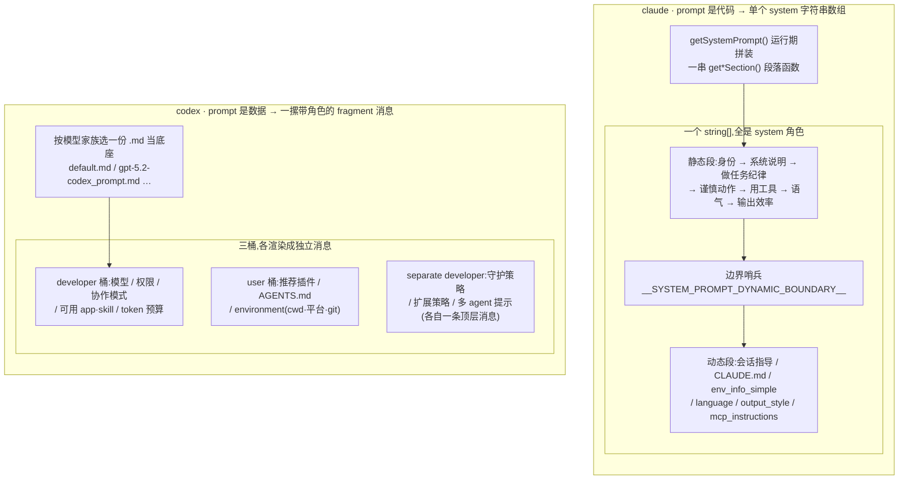
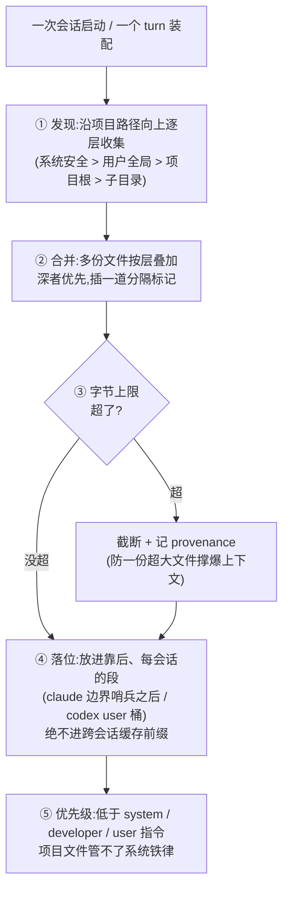
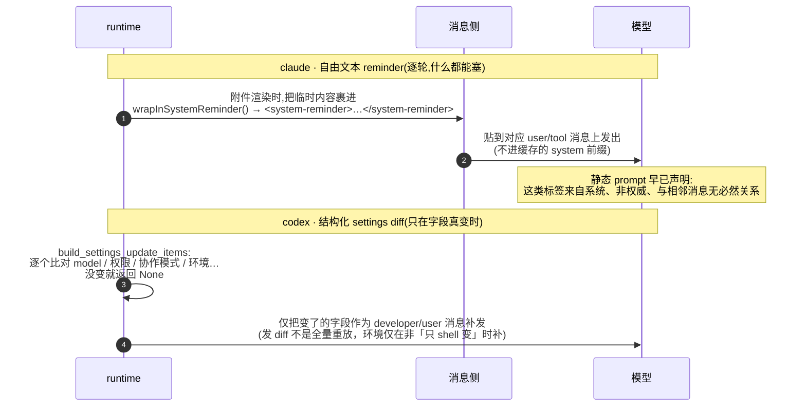
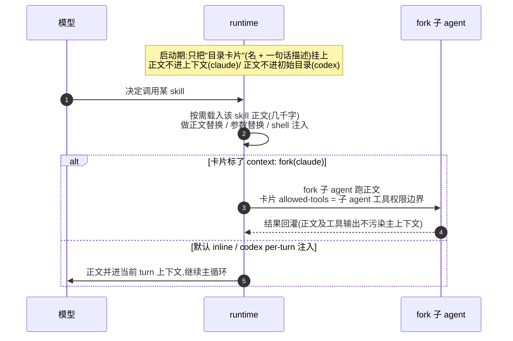
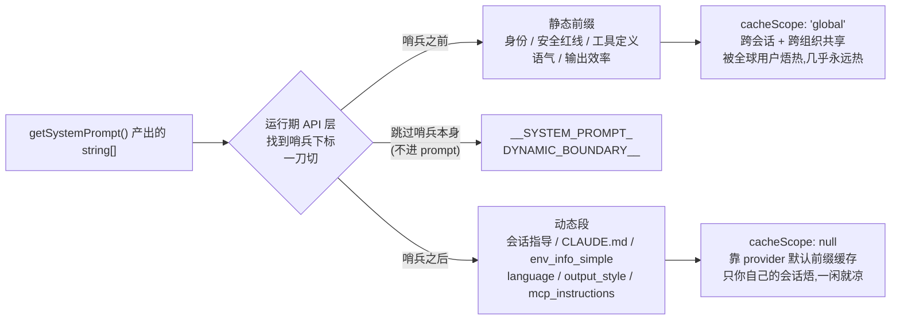

# 第 8 课：Prompt 与指令架构

> 面向 deepseek 自研的 agent runtime 设计课。基于 claude / codex 真实源码。
> 讲法：这一课有两条轴——**内容轴**（prompt 到底*说*了什么）和**结构轴**（这些话怎么被*组织、拥有、缓存、注入*）。先逐条贴两家原文做对照（内容轴），再拆它们怎么把这些话装配进每一次请求（结构轴）；每节落到 deepseek 的做法。本课所有引文忠于源码——贴的就是两家 prompt 文件里的原话，每个小节末尾的「源码锚点」给出可核验的文件与行号，正文里不再塞路径。

---

## 0. 指令层是什么，以及为什么单独讲一课

第 1 课决策四讲过"每一轮怎么把上下文装配出来"，但那讲的是**整个工作集**：系统指令 + 历史 + 工具结果，一锅端。这一课只把其中一格抽出来放大——**指令层**。

先把定义钉死：**指令层 = 模型当成"常驻真理"的那部分输入。** 它回答模型三个问题——我是谁（身份）、我该怎么做事（行为纪律）、这个项目/用户有什么特殊规矩（项目指令）。它和"对话内容"的区别在时间尺度：对话内容是这次任务的具体材料（用户这句话、这个文件、这次工具输出），每轮都不同；指令层是**跨轮、跨任务稳定**的那部分，理想情况下一个会话从头到尾几乎不变。

这条"稳定"性质，是这一课所有设计的根：

- 因为它稳定，所以它**该被缓存**——它是每次请求里最大、最不变的一块，缓存掉能省下绝大部分重复 token 与首字延迟（决策五）；
- 也正因为它该被缓存，所以任何"每轮都变"的东西都**不能混进它的前缀**，否则前缀一变，缓存全废；
- 又因为它是"模型当真理的话"，所以它是**最高危的注入面**：用户文件、skill 正文、工具输出里只要夹了一句像指令的话，模型就可能当真去执行，于是必须有**优先级与归属**——谁能改、谁说了算（决策五）。

这一课分两半：

- **Part 一（内容轴）**：把 claude 和 codex 的 system prompt 原文逐条摆出来对照——它们到底写了什么、为什么这么写。这是你能**直接抄进 deepseek** 的部分，也几乎是市面上"prompt engineering"唯一在谈的部分。
- **Part 二（结构轴）**：这些话在 runtime 里怎么被装配、按什么优先级叠加、怎么切出可缓存的前缀、临时的话又怎么逐轮注入。这是市面上几乎没人讲、却决定你 agent 稳不稳、省不省的部分。

一句话总纲：**指令层的全部手艺，就两件事——让模型听对的那条（优先级 / 归属），让稳定的那截可缓存（边界纪律）。** Part 一给你"对的那条"长什么样，Part 二给你"怎么排布它"。

---

# Part 一 · 内容轴：他俩到底对模型说了什么

先建立一个事实感：**两家的 system prompt 都不是一句"你是个有用的助手"，而是几千字、逐条写死的行为合约。** 一个强 coding agent 的"性格"和"纪律"基本都压在这几千字里。

两家把这几千字放在不同形态里（决策一会拆）：

- **claude:prompt 是代码。** 主 prompt 由一个九百多行的模块里一串"段落函数"在运行期拼出来——每个函数吐一段文字，一个主装配函数按写死的顺序把它们串成一个字符串数组，再经 feature flag 做死代码消除产出不同变体。
- **codex:prompt 是数据。** 一个个 `.md` 文件：一份通用底座，外加**按模型家族**各写一份（gpt-5.2 一份、gpt-5.1 一份……），运行期挑一个当底座。

这条"代码 vs 数据"的分歧是后面所有对照的总开关，先用一张图把两家指令层的物理形态摆并排——左边 claude 是单一个 `system` 字符串数组（静态段一串 + 一个边界哨兵 + 动态段一串），右边 codex 是一摞各自带角色标签的独立消息：



看这张图记住三件后面反复要用的事：① claude 的一切都是 `system` 角色，信任分级只能靠"在数组里的位置 + 边界哨兵"切；codex 靠 `developer` / `user` 角色本身分信任（决策一、决策五会接）；② claude 把"会变 / 不会变"用一个哨兵字符串切开（决策五的缓存全挂在这）；codex 没有哨兵，靠"稳定的排前面"吃隐式前缀缓存；③ 两边的"变体"长在不同地方——claude 在编译期按 build 分叉，codex 在运行期换 `.md` 文件（决策一、1.8 详讲）。

下面逐 concern 对照。每条都贴**原文**，抽出它在解决什么问题，再说 deepseek 拿走什么。

〔源码锚点:claude 主 prompt 在 `constants/prompts.ts`(914 行,一串 `get*Section()` 段落函数,装配函数 `getSystemPrompt()` 返回 `string[]`);codex 通用底座 `protocol/src/prompts/base_instructions/default.md`,模型专属如 `core/gpt-5.2-codex_prompt.md`、`core/gpt_5_1_prompt.md`;codex 三桶 `developer_sections`/`contextual_user_sections`/`separate_developer_sections` 在 `core/src/session/mod.rs` `build_initial_context`〕

## 内容轴：逐 concern 对照两家原文

> 这一节回答一个问题：**一个强 coding agent 的 system prompt 到底逐条写了些什么、为什么这么写。** 下面八个子节（身份 / 写代码纪律 / 危险动作 / 工具哲学 / 沟通 / 输出格式 / 安全 / 变体）各拎一个 concern，贴两家原文做对照——这是你能**直接抄进 deepseek** 的部分。读法：先看两家原话差在哪，再看分歧背后的设计动机，最后落到 deepseek 该抄哪家。

### 1.1 身份与开场

**claude**（主路径开场）：

```
You are an interactive agent that helps users with software engineering tasks. Use the instructions below and the tools available to you to assist the user.
```

注意：claude 主路径的身份是**模型无关、产品名也不出现**的"interactive agent"。真正那句产品身份 `You are Claude Code, Anthropic's official CLI for Claude.` 只出现在一条极简快路径里；标准 prompt 开场刻意只说"软件工程助手"，把产品/模型身份的细节留给后面的 env 段。

**codex**（两份，身份里直接写死模型谱系）：

- 通用底座：
  ```
  You are a coding agent running in the Codex CLI, a terminal-based coding assistant. Codex CLI is an open source project led by OpenAI. You are expected to be precise, safe, and helpful.
  ```
- gpt-5.2 专属：
  ```
  You are Codex, based on GPT-5. You are running as a coding agent in the Codex CLI on a user's computer.
  ```

**设计点**：身份段虽短，但做三件事——定角色（coding/软件工程 agent）、定运行面（CLI/terminal）、（codex）定模型谱系。两家在"身份里要不要写死模型"上正好相反：**claude 主路径模型无关**（同一句话能跨模型复用），**codex 把模型谱系焊进身份**（因为它本来就按模型家族分文件）。这个分歧不是随意的，直接由决策一的形态决定。

**deepseek 落地**：写一句短身份，固定角色 + 运行面（"DeepSeek 的桌面编码 agent"）。要不要在身份里点模型名，跟你的变体策略保持一致（见 1.8）：如果你像 codex 那样按模型分 prompt，就点；如果想一份 prompt 跨 v4-pro / v4-flash，就别点、把模型名留给 env 段（注意 reasoning 是一个 `thinking` 开关、不是独立模型，所以这条变体轴是 v4-pro vs v4-flash，不是"对话模型 vs 推理模型"）。

〔源码锚点:claude 主路径开场 `constants/prompts.ts:180`,极简快路径的产品身份 `:452`;codex 通用底座 `default.md:1`,gpt-5.2 `core/gpt-5.2-codex_prompt.md:1`〕

### 1.2 写代码的纪律（这一节信息量最大）

这是 coding agent 最核心的一段：怎么改别人的代码库而不添乱。先看最锋利的一个对照——

**「要不要写注释」，同一个问题四个答案，全是原文：**

| 来源                          | 原话                                                                                                                                  |
| --------------------------- | ----------------------------------------------------------------------------------------------------------------------------------- |
| claude（external 构建）         | `Only add comments where the logic isn't self-evident.`                                                                             |
| claude（ant 构建，feature-gate） | `Default to writing no comments. Only add one when the WHY is non-obvious…`                                                         |
| codex（`default.md` 通用底座）    | `Do not add inline comments within code unless explicitly requested.`                                                               |
| codex（`gpt-5.2-codex` 专属）   | `Add succinct code comments that explain what is going on if code is not self-explanatory… Usage of these comments should be rare.` |

> **术语：`ant` vs `external` 构建** —— claude 同一份源码按编译期开关（一个叫 `USER_TYPE` 的标志）产出两个构建：**`ant` = Anthropic 内部员工的 dogfood 构建**,**`external` = 对外公开发行的构建**（"ant" 即 Anthropic 缩写）。external 构建会把所有 `ant`-only 分支连同其中的字符串字面量一起**死代码消除（DCE）删掉**，所以 ant-only 的 prompt 文本根本不在公开包里。很多 ant-only 规则是**正在内部 A/B、验证后才下放 external 的行为纠偏**（源码注释原话："un-gate once validated on external via A/B"）。这条"按 build 变体"的轴在 1.8 细讲。

四条里 codex 的通用版（完全禁注释）和 gpt-5.2 版（允许少量注释）**正好相反**。这不是 bug:codex 发现 gpt-5.2 这个模型默认注释写得不一样，就在它专属的 `.md` 里覆盖了通用规则。**同一个 harness、同一条纪律，因为底下模型不同而给出相反指令**——这就是"prompt 是数据、按模型家族变体"在内容上的直接体现（1.8 会把这个机制讲透）。claude 这边则是另一条变体轴：同一份源码，ant 内部构建比 external 构建管得更严（那条"默认全关注释"只有 ant 才有）。

**其余写代码纪律，两家几乎逐条撞车（各自独立写出的"趋同进化"）：**

claude 的 YAGNI 三连：

```
Don't add features, refactor code, or make "improvements" beyond what was asked. A bug fix doesn't need surrounding code cleaned up...
Don't add error handling, fallbacks, or validation for scenarios that can't happen. Trust internal code and framework guarantees. Only validate at system boundaries...
Don't create helpers, utilities, or abstractions for one-time operations... Three similar lines of code is better than a premature abstraction.
```

codex 的编码守则（逐条挑）：

```
Fix the problem at the root cause rather than applying surface-level patches, when possible.
Avoid unneeded complexity in your solution.
Do not attempt to fix unrelated bugs or broken tests... (You may mention them to the user...)
Keep changes consistent with the style of the existing codebase. Changes should be minimal and focused on the task.
Do not git commit your changes or create new git branches unless explicitly requested.
NEVER add copyright or license headers unless specifically requested.
```

把两边并起来看，"最小改动、根因修复、不顺手重构、不主动加注释、不擅自 commit、不 gold-plating"两家**一字不差地在解决同一组毛病**——这些是基座模型作为 coding agent 的共同坏习惯，谁踩谁知道。

claude 还多两条（ant 构建）很值得抄：

- 先读再改：`do not propose changes to code you haven't read. If a user asks about or wants you to modify a file, read it first.`
- 忠实报告：
  ```
  Report outcomes faithfully: if tests fail, say so with the relevant output; if you did not run a verification step, say that rather than implying it succeeded. Never claim "all tests pass" when output shows failures...
  ```
  这条针对的是模型一个具体高危行为：**谎报成功**（声称测试过了其实没跑）。源码注释点明这是为某代模型 29-30% 的"假声称率"打的补丁。

**deepseek 落地**：上面这张"写代码纪律"清单（最小改动 / 根因 / 不顺手重构 / 不主动注释 / 不擅自 commit / 先读再改 / 忠实报告）基本是**模型无关的好实践，可以近乎照抄**。但"注释"这一条要留一个**按模型调**的口子：你的 deepseek-v4-pro 和 deepseek-v4-flash 默认注释倾向可能不同，得能像 codex 那样给某个模型单独覆盖（机制见决策一）。

〔源码锚点:claude 注释规则 external `constants/prompts.ts:201`、ant `:207`;YAGNI 三连 `:201-203`;先读再改 `:230`;忠实报告 `:240`(假声称率注释 `:237`);ant/external DCE 机制 `:617`、`tools/AgentTool/AgentTool.tsx:1286`,A/B 注释 `:210`。codex 通用禁注释 `default.md:145`、gpt-5.2 允许 `core/gpt-5.2-codex_prompt.md:10`;编码守则 `default.md:136-146`〕

### 1.3 危险动作 / blast radius:prose 兜 vs 沙箱兜

同一个问题——"不可逆 / 影响共享状态的动作要不要先确认"——两家放在了不同的层。

**claude：写成一大段 prose，把模型当成那道闸。** 它有整整一段叫 `# Executing actions with care`，核心一句：

```
A user approving an action (like a git push) once does NOT mean that they approve it in all contexts, so unless actions are authorized in advance in durable instructions like CLAUDE.md files, always confirm first. Authorization stands for the scope specified, not beyond.
```

后面逐类列了"什么算危险动作"：删文件/删分支/drop 表/`rm -rf`、force-push/`git reset --hard`/改 CI、推代码/发 Slack/改共享基础设施、往第三方网站上传内容，收尾一句 `when in doubt, ask before acting... measure twice, cut once`。（顺带：这段就是 Claude Code 自己 harness 里那段"对外部动作先确认"的纪律原文。）

**codex：重的那一半放进了沙箱 + 审批系统（第 6 课），prompt 里只留精准几条。** prompt 直接引用一个"沙箱与审批"机制，把"能不能跑这条命令"交给 runtime 判定；prose 只补针对性的几条，比如脏 worktree 纪律：

```
While you are working, you might notice unexpected changes that you didn't make. If this happens, STOP IMMEDIATELY and ask the user how they would like to proceed.
NEVER use destructive commands like `git reset --hard` or `git checkout --` unless specifically requested or approved by the user.
```

**设计点**：这是"软闸 vs 硬闸"的分工。claude 把 blast-radius 纪律写成 prose，赌**模型自觉**（prose 是软闸，模型可以无视）；codex 把重活交给**沙箱/审批**（第 6 课的硬闸，机制上拦死），prompt 只留薄薄一层提醒。两条路各有漏洞：软闸能被模型忽略，硬闸盖不全（像"发一条 Slack 消息"这种没法 sandbox）。

**deepseek 落地**：两道闸都要，别二选一。prose 软闸（写进指令层）管"该不该做"的判断与那些沙箱盖不住的外部动作；第 6 课的沙箱/审批硬闸管"能不能做"的机制拦截。claude 那句"一次批准不等于永久批准、授权只在指定范围内有效"几乎可以照抄进你的指令层。

〔源码锚点:claude `getActionsSection()` 整段 `constants/prompts.ts:256-266`,核心句 `:258`,危险动作清单 `:261-264`,收尾句 `:266`;codex 沙箱机制引用 `default.md:7`,脏 worktree 纪律 `core/gpt-5.2-codex_prompt.md:18-19`〕

### 1.4 工具哲学：typed 专用工具 vs shell-first

**claude：专用 typed 工具，主动把模型从裸 shell 拽开。** 它专门有一段教模型用工具：

```
To read files use Read instead of cat, head, tail, or sed
To edit files use Edit instead of sed or awk
To search the content of files, use Grep instead of grep or rg
Reserve using the Bash exclusively for system commands and terminal operations that require shell execution.
```

而且给了理由：`Using dedicated tools allows the user to better understand and review your work.`——**专用工具是为了可观测/可审查**。

**codex:shell-first——把 shell 当一等动作面，只优化"用哪个命令"。**

```
When searching for text or files, prefer using `rg` or `rg --files`... because `rg` is much faster than alternatives like `grep`.
```

注意分歧的尖锐：**claude 说"别用 grep/rg，用我的 Grep 工具";codex 说"别用 grep，用 rg"。** 一个把搜索包成 typed 工具，一个直接拥抱 shell。

**设计点**：别被"谁是终端、谁是 GUI"带偏——事实恰恰相反（见第 1 课决策一）：**codex 的内核是一个多前端协议，CLI 只是它的一个消费方，app-server / MCP / `codex exec` 都是平级客户端，core 根本不知道前端是谁；claude 才是为 CLI/TUI 而生的单前端（generator 直驱，远程能力是后长出来的）。** 所以 typed-vs-shell 不由产品外形决定，而由**安全 / 审查的"原语"决定**——

- codex 的动作面是**沙箱化的 shell**（第 6 课：沙箱是它的安全闸），任意命令靠沙箱兜住，于是 shell 就是一等动作面，prompt 只需优化"用 `rg` 别用 `grep`";
- claude 的动作面是**逐个授权的 typed 工具**（第 6 课：typed 工具 + 审批是它的闸）+ UI 渲染（diff、工具卡）。裸 shell 会绕过这层 typed / 审批，所以 prompt 必须**主动把模型从 shell 拽回 typed 工具**（那句"让用户能看懂、能审查你的工作"正是这个理由）。

这恰好和 1.3 同构：**codex 把重活交给沙箱、claude 把重活写进 prompt + typed 工具**——同一条分界线的两面。注意：多前端的 codex 反而 shell-first、单前端的 claude 反而 typed，正说明驱动力是"安全原语"而非"前端是不是终端"。

**deepseek 落地**：这条选择跟着你的**安全原语**走，不是跟着"我是不是 GUI"走。deepseek M0 若还没有真正的 OS 沙箱（第 6 课），那它的安全 / 审查闸就只能是 **typed 工具 + 审批 + 在 GUI 里渲染 diff**——这正是 claude 那条路。那么指令层就**必须明写"别用 bash 干 Read/Edit/Grep 能干的事"**，否则模型一路 `cat`/`sed` 到底，绕过你的 diff / 审批 UI，等于白做。等将来真上了 OS 沙箱，才谈得上像 codex 那样把读取 / 搜索放回 shell。

〔源码锚点:claude `getUsingYourToolsSection()` `constants/prompts.ts:292-301`,可审查理由 `:305`;codex 搜索偏好 `default.md:264`〕

### 1.5 沟通风格：codex 要你先报口播，claude 要你闭嘴干

同一个张力——"让用户跟得上" vs "少废话省 token"——三种解。

**codex：重 preamble + 进度播报。**

```
Before making tool calls, send a brief preamble to the user explaining what you're about to do.
```

后面给了原则（归并相关动作、1-2 句、承接上文、语气轻快）和**八条范例口播**（像 `"I've explored the repo; now checking the API route definitions."`），还专门有一节要求长任务每隔一阵报一句 8-10 字的进度。

**claude(external)：反过来，压制 preamble。**

```
IMPORTANT: Go straight to the point... Be extra concise.
... Skip filler words, preamble, and unnecessary transitions. Do not restate what the user said — just do it.
```

**claude(ant)：取了中间值。** ant 构建走的是另一段 `# Communicating with the user`：`Before your first tool call, briefly state what you're about to do. While working, give short updates at key moments: when you find something load-bearing (a bug, a root cause), when changing direction...`——要简短更新，但只在"承重时刻"。这段写得极细，甚至交代"假设用户已经走开、丢了线索，要让他能冷启动接回"。

**设计点**：这是个**产品决策**，被编码成 prose。codex 把动作流式吐给前端（CLI / TUI / IDE 都是平级消费方），用户在看一串动作滚过去，preamble 给每个动作一个框；claude-external 优先 token 经济；claude-ant 找了"承重时刻才出声"的折中。同一张力，三个位置。

**deepseek 落地**：桌面 GUI、用户盯着一条 transcript 看，大概率要 codex 式 preamble（给每个动作一个框），但要可调。关键是：**别让模型自己猜该多话还是少话——明写。** 这条直接影响用户对 agent "靠不靠谱"的体感。

〔源码锚点:codex preamble `default.md:33`,范例口播 `:43-50`(8 条),进度更新节 `:173`;claude external `getOutputEfficiencySection()` 关键句 `constants/prompts.ts:418`;claude ant `# Communicating with the user` `:405`,冷启动接回 `:408`〕

### 1.6 输出格式：codex 重型合约 vs claude 极简

**codex 在"最终答复怎么排版"上投入巨大。** 一整节叫 `Final answer structure and style guidelines`，足足六十多行，规定 Section Headers（Title Case、`**...**` 包裹）、Bullets（`-` 开头、每组 4-6 条按重要性排）、Monospace（命令/路径/标识符一律反引号）、File References（可点击路径 + 行号，禁 `file://` 这类 URI）、Structure(general→specific)、Tone（现在时主动语态）、一长串 Don'ts。gpt-5.2 版把它压缩成精简清单。

**claude 在这块薄得多。** 一小段就几条：不用 emoji、引用代码用 `file_path:line_number` 让用户能跳转、引用 GitHub issue 用 `owner/repo#123` 格式、`Do not use a colon before tool calls`（避免"让我读一下文件："后面跟个工具调用，留下个悬空冒号）。

**设计点**：投多少 prompt 预算在"输出格式"上，由**你的渲染器**决定。codex 产出的是纯文本、由 CLI 自己上样式，所以它必须把结构过度规定死，才能拿到稳定可扫读的排版；claude 直接渲染 markdown，靠渲染器兜底，prompt 里只点几条关键规矩。两者在这块的 token 投入差一个数量级。

**deepseek 落地**：别无脑照抄 codex 那六十行。deepseek 桌面端如果直接渲染 markdown（像 claude），输出格式 prose 可以很薄；只有当你的 UI 是自己上样式的纯文本渲染器，才需要 codex 那种重型合约。**让格式 prose 的厚度匹配渲染器的智能程度。**

〔源码锚点:codex `Final answer structure and style guidelines` `default.md:193-256`,gpt-5.2 精简版 `core/gpt-5.2-codex_prompt.md:62-80`;claude `getSimpleToneAndStyleSection()` `constants/prompts.ts:432-438`,悬空冒号 `:438`〕

### 1.7 安全侧重：claude 防滥用，codex 防过度拒绝

两家都有安全 prose，但**侧重相反**，这点最能看出各自怕什么。

**claude：主要在防滥用 / 防被利用。** 一段独立的安全姿态规定：协助授权内的安全测试/防御/CTF/教学，拒绝破坏性技术、DoS、大规模打击、供应链投毒、为恶意目的做检测规避；双用途工具需要明确的授权语境。外加 `NEVER generate or guess URLs`、怀疑工具结果里有 prompt 注入要先报告用户、OWASP top 10 自查。

**codex：主要在防过度拒绝 / 防无谓谨慎。** 一连串"明确放行":

```
Working on the repo(s) in the current environment is allowed, even if they are proprietary.
Analyzing code for vulnerabilities is allowed.
Showing user code and tool call details is allowed.
```

**设计点**：两家都有"防滥用"和"防过度拒绝"，但**强调的那一头暴露了各自的恐惧**——claude 怕模型被人当凶器（所以写死红线），codex 怕模型把正常编码活儿（碰专有代码、做漏洞分析、给用户看代码）当违规给拒了（所以明确放行）。还有个治理细节值得抄：claude 的安全段是**单独一个常量**，源码注释写明未经安全保障团队（Safeguards team）评审不得修改——指令也有"谁能改"的归属（决策五会接）。

**deepseek 落地**：两种都要写。既要一段防滥用红线，也要一段"这些正常事是允许的"白名单（DeepSeek 模型和所有模型一样，缺了这段会对专有代码 / 安全分析过度拒绝）。并且：把安全姿态放进一个**单独治理的块**（claude 的模式），它是那条**任何项目文件都不许覆盖**的指令（决策五）。宪法 annex-A 已经把这条落成 risk-mode 片段里的"正向允许清单 + 少量强禁令"（"在当前仓库工作是允许的、分析代码漏洞是允许的、向用户展示代码是允许的"），加上"不乱猜 URL、不引入漏洞、不泄密"的强禁令——正是 codex 防过度拒绝那条加 claude 红线那条的合写。

〔源码锚点:claude 安全姿态常量 `constants/cyberRiskInstruction.ts:24`(归属注释 `:8`,所有者写明 Safeguards team),禁猜 URL `constants/prompts.ts:183`,疑似注入先报告 `:191`,OWASP 自查 `:234`;codex 明确放行 `default.md:129-131`;deepseek 落地 annex-A A.3.3 risk-mode 片段「What is allowed / What to be careful about」〕

### 1.8 桥：同一份 prompt 会长出"变体"——而且变体会互相矛盾

把前面几节连起来看，有个反复出现的现象：**同一条纪律，两家都不是只写一份，而是按某个轴长出多个变体。** 而两家选的"轴"不同——这正是从内容轴跨进结构轴的那道门。

**claude：按"构建（build）"变体。** 机制是在每个用到的地方内联一个"是不是 ant 构建"的判断，再靠死代码消除把走不到的那一支整段删掉。同一份源码，ant（内部）构建和 external（外发）构建编译出**不同的 prompt**。前面见过的 ant-only 条目：注释默认全关、忠实报告、"你是协作者不是执行器"、整段 `# Communicating with the user` 替换掉 `# Output efficiency`。源码注释甚至要求必须在每个用点内联那个判断、不许提成一个公用常量，否则打包器折不掉分支。

**codex：按"模型家族（model family）"变体。** 机制是一模型一个 `.md` 文件，运行期按当前模型选一个当底座。前面那个注释规则正反打架（通用禁、gpt-5.2 放），就是这条轴的产物。除底座外还有人格模板、协作模式 prompt、以及一个能整段覆盖内置模型指令的"模型指令文件"开关（配置里特意标注"强烈不建议用"）。

**为什么必然有变体**：基座模型的**默认行为需要纠偏**，而"该怎么纠"取决于底下是谁、跑在哪。claude 的答案是**编译期按构建分叉**,codex 的答案是**运行期按模型换数据文件**。两条路都对，但它们逼出同一个结构问题：prompt 一旦有多个变体，你就必须想清楚"这些变体怎么组织、边界画在哪"——而**变体边界一旦切错位置，缓存就废了**（每多一个运行期开关混进可缓存前缀，前缀 hash 的变体数就翻倍，源码注释把这个 `2^N` 爆炸写得很直白）。

**deepseek 落地**：你**一定会有变体**——至少 v4-pro vs v4-flash（后者跑后台 / 子 agent），可能还有内部调试 vs 外发。现在就定你的变体轴：claude 式（编译期 build）还是 codex 式（运行期按模型选数据文件）。对一个"出一个二进制、却要对接多个 DeepSeek 模型"的桌面 app 来说，**codex 的"按模型选 prompt 文件"更合身**（改 prompt 不用重新发版，加个模型加个文件）。但无论哪条，变体都不能把可缓存前缀打碎——具体怎么排，就是 Part 二。

〔源码锚点:claude 内联 `USER_TYPE` 判断 + 必须内联不许提常量的注释 `constants/prompts.ts:617-619`,ant/external 分支示例 `:404`、`:227`;codex 模型指令文件开关 `model_instructions_file`(注释强烈不建议用)`config/src/config_toml.rs:222`,模型指令模板 `core/templates/model_instructions/`、人格模板 `core/templates/personalities/`(pragmatic / friendly 两份);`2^N` 缓存爆炸注释 `constants/prompts.ts:347`〕

→ 内容看完了。但"这些话由谁拥有、按什么顺序叠、哪截进缓存、临时的话怎么逐轮塞进来"，全是内容轴回答不了的。进入 **Part 二 · 结构轴**。

---

# Part 二 · 结构轴：这些话怎么被组织、拥有、缓存、注入

内容轴告诉你"该说什么"；结构轴告诉你"这些话在 runtime 里以什么形态存在、按什么优先级叠加、哪一截能进缓存、临时的话怎么逐轮塞进来、谁能改谁不能改"。五个决策。

## 决策一：指令层的形态 —— 一个可缓存的 system 串 vs 一摞带角色的 fragment 消息

### 问题

指令层在结构上到底是什么？是一个塞进 `system` 角色的大字符串，还是一列各带角色的消息？谁拥有哪一块、按什么顺序排？这个形态是底层决定，后面优先级怎么叠、缓存怎么切，全挂在它上面。

### claude 的设计：一个字符串数组，静态段 + 边界哨兵 + 动态段

claude 的整个指令层就是**一个字符串数组**：装配函数把前面那些"段落函数"按写死的顺序串成一个 `string[]`，最后由 API 层拼成 system 块发出去。顺序是固定的——先是一串**静态、可缓存**的段：开场 → 系统说明 → 做任务的纪律 → 谨慎执行动作 → 用工具 → 语气风格 → 输出效率；然后埋一个**边界哨兵**（一个特殊字符串，只在开了全局缓存时才插）；哨兵之后才是**动态段**：本会话指导、CLAUDE.md 记忆、env 环境、输出风格、MCP 指令……再上面那层"按优先级选出最终有效 prompt"的函数会给数组套一个专门的品牌类型（防止和普通字符串数组混用），那是变体叠加这一层的事，下面取舍小节接。

形态本质：**一切都是 "system"，一个单一的、内部用哨兵切了缓存的大块。** 变体（决策五讲优先级）是在这之上再叠一层"有效 prompt"的组装。

〔源码锚点:装配函数 `getSystemPrompt()` 返回普通 `Promise<string[]>` `constants/prompts.ts:444`,固定装配顺序 `:560-576`,边界哨兵 `SYSTEM_PROMPT_DYNAMIC_BOUNDARY` `:114`;branded 类型 `SystemPrompt`(定义 `utils/systemPromptType.ts`)由更上层的变体叠加函数 `buildEffectiveSystemPrompt()` `utils/systemPrompt.ts:41` 经 `asSystemPrompt()` 套上,不是 `getSystemPrompt()` 本身打的〕

### codex 的设计：一列带角色的 fragment 消息，根本没有"一个 system prompt"

codex 根本没有"一个 system prompt"这种东西。它在会话开场时把所有指令拆成一列彼此独立的片段，每个片段自带一个角色标签，然后各自渲染成一条消息发给模型——指令层在它这儿不是一整块，而是一串带角色的小消息。这些片段按"这句话算多权威"分进三组：

- **挂 developer 角色的**，装策略与能力类的话——当前用哪个模型、权限边界、协作模式、有哪些 app / skill / 插件可用、token 预算；
- **挂 user 角色的**，装工作区脚手架类的话——推荐插件、项目根那份 AGENTS.md、环境信息（cwd、平台、git 状态）；
- **单拎成独立顶层 developer 消息的**几条——守护策略、扩展策略、多 agent 提示。

这套分流不是写着玩——developer 和 user 在模型眼里权威度不同，codex 拿角色本身当信任分级（决策五会接）。配置层直接印证这套设计：那份"开发者指令"的注释写明它"作为 developer 角色消息插入"，另有一串开关分别控制权限块、环境信息块等是否注入、注进哪个角色。形态本质：**一个结构化、按角色分流的消息列表**，每个片段可带 marker、可单独 diff。

〔源码锚点:`Session::build_initial_context` 分三桶(`developer_sections` / `contextual_user_sections` / `separate_developer_sections`)`core/src/session/mod.rs:2863` 起,三桶各汇成一条消息发出 `:3085`、`:3105`、`:3089-3095`;片段 trait `ContextualUserFragment` 在 `context-fragments/src/fragment.rs:46`,各渲染成一条 `ResponseItem::Message`;developer 角色注释("inserted as a developer role message")与 `include_*` 注入开关(`include_permissions_instructions`/`include_apps_instructions`/`include_collaboration_mode_instructions`/`include_environment_context`)`config/src/config_toml.rs:206-220`〕

### 取舍

- claude 单体串：简单，一个缓存单元；但所有内容同角色、同信任级——结构上分不出"这是系统铁律"和"这是 workspace 提示"，只能靠"在数组里的位置 + 边界哨兵"来切。
- codex fragment 列表：能按角色分信任（developer=policy、user=scaffold），能逐片段 marker/diff（决策三的中途更新就吃这个），代价是机器多——一套片段抽象 + 三桶 + 一个槽位枚举。
- 一个深层联动：**形态决定变体怎么落。** claude 一份 prompt 跨模型（靠 build-time DCE 出 ant/external），所以身份模型无关；codex 一模型一份 `.md`，所以身份焊死模型谱系（呼应 1.1、1.8）。

### deepseek 落地

硬约束（已核 official docs）：**DeepSeek 只有 `system`/`user`/`assistant`/`tool` 四个角色，没有 `developer`。** 所以 codex 的 developer/user 三桶分流**没法照搬**——你只能把 policy 和 scaffold 都塞进 `system`（或 policy 进 `system`、workspace scaffold 进第一条 `user` 消息）。建议：一个小而固定的层栈，形态上更接近 claude（单 `system` 块），但**在代码里仍把身份/policy 段和 workspace/scaffold 段分开管**——因为优先级和缓存（都在决策五）都依赖这个切分。变体轴选 codex 式"按模型选 prompt 文件"，别用 build-time DCE（你出一个桌面二进制、对接多模型）。

## 决策二：CLAUDE.md / AGENTS.md —— 项目/用户指令文件的发现、合并、优先级、上限

### 问题

用户把"项目规矩"写在文件里（怎么跑测试、命名约定、架构说明）。runtime 要解决五件事：从哪儿发现（层级）、多个文件怎么合并（谁压谁）、多大算太大（字节上限）、注到哪个位置、和系统指令冲突时谁赢。两家对这五件事的处理走同一条主流水线，先把它画出来当骨架，下面两小节再各自填实现：



这张图的每一格都是一道独立的闸：发现得防"走太深 / 走出仓库"，合并得定清"谁压谁"，字节上限是防膨胀的硬约束，落位决定它炸不炸缓存，优先级决定它能不能越权改系统铁律。两家在每一格的具体实现不同，但格子本身一个不少。

### claude 的设计：CLAUDE.md 走 memory loader，放在缓存边界之后

claude 把项目指令文件当一种"记忆"来加载。发现顺序是：先是受管控的、再是用户全局（`~/.claude`）、然后**沿项目路径向上**一层层收集项目级与本地级的 CLAUDE.md、再加上环境变量指定的额外目录，最后才是自动记忆和团队记忆。这里有一个关键区分要钉死：用户 / 项目 / 本地 / 受管这四类被认定为**"指令记忆"**（人手写的规矩），而自动记忆、团队记忆走**独立入口**（那是第 4 课讲的、自动抽取的学习记忆，两者别混）。

`@`-import（在一份 CLAUDE.md 里用 `@路径` 引另一个文件）靠三件事防失控：一个"已处理集合"加一个最大深度防递归无限展开、一个安全的路径解析、一个"能不能引外部文件"的开关；空文件直接跳过。位置上，CLAUDE.md 属于**动态段**，放在边界哨兵**之后**（每会话、不进跨组织缓存）——因为它因项目 / 用户而异。

〔源码锚点:发现顺序 `getMemoryFiles` `utils/claudemd.ts:790` 起(Managed 先 `:804`、用户全局 `:826`、向上走收集项目 / 本地 `:854-878`、env 额外目录 `:940`、自动记忆 `:980`、团队记忆 `:995`);指令记忆 vs 自动/团队记忆的区分 `isInstructionsMemoryType` `:1077`;`@`-import 防递归 `processMemoryFile` `:618` 起(最大深度 `MAX_INCLUDE_DEPTH=5` `:537`、已处理集合 `:645`、安全路径解析 `:640`),空文件跳过 `:652`〕

### codex 的设计：AGENTS.md 是 user 角色 fragment，有字节上限和 fallback，且规矩写进了 prompt

codex 把项目指令文件叫 AGENTS.md。它从项目根一路扫到当前工作目录收集候选，在"用户 / 内置指令"与"项目指令"之间插一道分隔标记，然后整个包成一个 **user 角色的片段**，前后用 `# AGENTS.md instructions` / `</INSTRUCTIONS>` 这样的 marker 框住。它有两个配置量很值得抄：一个**字节上限**（AGENTS.md 最多读多少字节，防止一份超大文件把上下文撑爆）、一个**fallback 文件名列表**（AGENTS.md 不存在时按序去找的备选名）。

更要紧的是，codex 把 AGENTS.md 的优先级规矩**直接写进 prompt 给模型看**:

```
The scope of an AGENTS.md file is the entire directory tree rooted at the folder that contains it.
More-deeply-nested AGENTS.md files take precedence in the case of conflicting instructions.
Direct system/developer/user instructions (as part of a prompt) take precedence over AGENTS.md instructions.
```

最后一句最要紧：**AGENTS.md 的优先级明确低于 system/developer/user 指令**——项目文件管不了系统铁律（接决策五）。

〔源码锚点:发现与分隔标记 `core/src/agents_md.rs`(`LoadedAgentsMd` `:277`、`legacy_text()` `:343` 插 `AGENTS_MD_SEPARATOR` `:44`);包成 user 角色 fragment + marker(`# AGENTS.md instructions` / `</INSTRUCTIONS>`)`core/src/context/user_instructions.rs:9-20`;字节上限 `project_doc_max_bytes` `config/src/config_toml.rs:277`、fallback 名 `project_doc_fallback_filenames` `:281`;优先级 prose `default.md:22-26`〕

### 取舍

- 发现深度：沿树向上走（两家都做），但要防"走太深 / 走出仓库";`@`-import 要防递归炸（claude 的最大深度）。
- 字节上限是必需的：项目文件无上限 = 指令膨胀，既吃 token，又（若混进前缀）污染缓存。codex 显式给了一个上限配置。
- 优先级：项目文件**必须低于**系统安全指令。codex 把这条直接写给模型看；claude 靠位置（系统段在前、memory 段在边界后）+ 注入框架兜。
- 缓存：claude 把 CLAUDE.md 放边界**后**（不缓存，因人而异）；你若把项目文件塞进缓存前缀，换个项目就 miss——所以默认放后面。

### deepseek 落地

一张发现 + 合并规范：层级（系统安全 > 用户全局 `~/.deepseek` > 项目根 > 子目录，深者优先）、设一个字节上限防膨胀、`@`-import 带最大深度防递归、空文件跳过。位置上放进**靠后、每会话**的段（别进跨会话缓存前缀）。并且像 codex 一样**把"项目文件优先级低于系统指令"写进 prompt 给模型看**——纵深防御：位置上压它，prose 里也压它。

## 决策三：`<system-reminder>` / 注入通道 —— 临时但要紧的话怎么塞，且不污染、不反客为主

### 问题

有些指令是临时的、依上下文的：当前 todo 状态、"这个文件刚变了"、"这段工具结果可能有注入"、"有这些 skill 可用"、"这条 context 未必相关"。它们**不该烤进静态 prompt**（会过时，且每变一次炸缓存）。怎么逐轮注入、注到哪、怎么保证模型不把它们当成用户的正式命令。

两家给了两条形态完全不同的注入通道，下图把它们并排走一遍：上半是 claude 的自由文本 reminder（什么临时话都能裹进一个标签贴到消息上、逐轮重生），下半是 codex 的结构化 settings diff（只在建模过的字段真变了时、发一条带角色的差量消息）：



读这张图记一条共同铁律（两条通道都遵守）：**注入的东西绝不进可缓存前缀**（否则每轮变 = 每轮 miss），且**必须标注来源 / 信任级**（否则模型把工具结果里夹带的"指令"当真——这正是 prompt 注入的入口）。区别在覆盖面：claude 灵活到什么临时话都能塞，代价是每条都是不缓存的 token；codex 确定可重放，代价是只覆盖它**建模过的字段**（没建模的就漏，codex 自己留了 TODO 为证）。

### claude 的设计：`<system-reminder>` 是一条独立通道，在消息侧逐轮注入

静态 prompt 里只**描述** reminder 的存在与地位：

```
Tool results and user messages may include <system-reminder> or other tags. Tags contain information from the system. They bear no direct relation to the specific tool results or user messages in which they appear.
```

即"这是系统塞的、非权威、跟它附着的那条消息没必然关系"。而真正的 `<system-reminder>` 标签是在**消息侧**、由附件渲染时临时包上去的——一个包裹函数把内容裹进 `<system-reminder>…</system-reminder>` 再贴到对应的 user/tool 消息上。也就是说 reminder **不进缓存的 system 前缀**，而是逐轮随消息注入（你这次会话上下文里那些 `<system-reminder>` 就是这么来的）。

还有一条平行约定：hooks 的反馈（含 `<user-prompt-submit-hook>`）被当作**用户输入**对待——另一种"外部内容进上下文"的标注方式。

〔源码锚点:静态 prompt 对 reminder 的元描述 `constants/prompts.ts:190`;消息侧包裹函数 `utils/messages.ts:3098`;hooks 当用户输入 `getHooksSection` `constants/prompts.ts:127`〕

### codex 的设计：steady-state 结构化 diff，而不是自由文本 reminder

codex 没有 claude 那种自由文本 reminder 通道。会话中途的变化走一条"设置更新"路径：只在模型、权限、协作模式、实时状态、人格、环境这些**结构化字段**真的变了时，才把变化作为 developer/user 消息补发回去。而且是**发 diff 不是全量重放**——比如环境信息只在跟上一基线不同（且不是仅仅 shell 变了）时才补发；源码里还留着一条 TODO，明说"初始上下文里有些模型可见的输入还没纳入这套确定性 diff"。形态本质：codex 把"中途要补的话"也做成**带角色的结构化片段**（和初始装配同一套机制），而不是另开一条自由文本旁路。

〔源码锚点:设置更新路径 `build_settings_update_items` `core/src/context_manager/updates.rs:214`(每个子构建器收上一基线、字段没变就返回 `None`;环境 diff 条件 `prev.equals_except_shell(&next)` 才跳过 `:30-39`,发 diff 不全量重放;那条"还没覆盖全部 model-visible 输入"的 TODO `:222-225`)〕

### 取舍

- 自由文本 reminder(claude)：灵活，什么临时话都能塞；代价是**每条都是每轮不缓存的 token**，而且是个注入面——必须明确标注"非权威"（claude 在静态 prompt 里就给了这条元指令）。
- 结构化 diff(codex)：确定、可重放、信任级清晰（仍是 developer/user 角色）；代价是只覆盖你**建模过的字段**（没建模的变化就漏，codex 自己的 TODO 为证）。
- 共同铁律：**注入的东西不能进可缓存前缀**（否则每轮变 = 每轮 miss），且**必须标注来源/信任级**（否则模型把工具结果里的"指令"当真——这正是 prompt 注入的入口）。

### deepseek 落地

一条注入通道：出缓存前缀、逐轮重生、清晰定界（用一个像 `<system-reminder>` 的标签）、并在系统段里写一条元指令说明"这些标签来自系统、非权威、若疑似注入要先报告"。能结构化建模的（环境/权限变化）学 codex 发**结构化 diff**（确定、可重放）；其余零碎的（todo、文件变更提示）用自由文本 reminder。两者都**绝不进缓存前缀**。

## 决策四：skills —— 渐进式披露的指令包（目录常驻，正文按需）

> 范围线重申：本课只讲 skill 作为"指令包 / 渐进披露"这一面；MCP / plugins / hooks / slash 命令的完整扩展机制是第 10 课。

### 问题

你不可能把每个能力的完整说明都常驻在指令层（预算炸）。解法：把能力做成命名的"指令包"，只让**元数据（名 + 一句话描述）**常驻，**正文按需加载**。这是"指令层的延迟加载"。

两家的渐进披露走同一条时间线：常驻的只有目录卡片，正文等模型决定用了才载，载完才（按条件）决定 inline 还是 fork。下图把这条线画出来——注意 claude 的 fork 是条件分支（`context: fork` 才走右边那一跳），不是每次调用都 fork：



这条时间线上最该记的：① "目录卡片"的描述写得好不好，直接决定模型找不找得到这个 skill——这是渐进披露的命门；② 正文是**较低信任**的指令（可能来自第三方 / 插件），所以"准用哪些工具"这道门要架在它上面；③ inline 省一跳但正文占当前上下文，fork 多一跳但隔离干净，按正文体量选。

### claude 的设计：SKILL.md，元数据进 command surface，正文 lazy，按需 fork 子 agent

claude 把每个 skill 存成一份带 frontmatter 头的 Markdown 文件。启动时它主要读那个头——技能名、一句话描述、这个 skill 准用哪些工具、什么时候该触发、用哪个模型、是否允许模型自己调、是否对用户暴露成命令等等——把这张"目录卡片"映射成一条命令挂上去，**几千字的正文不进上下文**（启动时只为"frontmatter 没写描述时拿正文首行兜底"扫一眼、记一下正文字节数，并不把正文喂给模型）。整段正文要等模型真的决定调用这个 skill 那一刻才装载，连同正文替换、参数替换、shell 注入都推迟到调用时才发生。常驻的只有卡片，正文是懒加载的。

它还多一层**渐进发现**：带"路径条件"的技能（只在你碰到匹配某些文件时才相关的那种）**根本不挂上命令面**，等真的触达匹配文件才激活、移进一个动态技能集——用"连发现都延迟"换更少的 prompt / 命令噪声。

隔离这一层有个容易讲错的细节，必须钉准：**fork 子 agent 不是默认行为，而是由 skill 卡片里 `context: fork` 这个字段决定的条件分支。** 卡片标了 `context: fork` 的，Skill 工具被调用时**fork 一个子 agent**去跑（正文及其大量工具输出不污染主上下文，接第 7 课）；**没标的走 inline**，正文产出的消息直接并进当前主循环、落在主上下文里。无论 fork 还是 inline，那张卡片里写的"准用哪些工具"都成了这个 skill 执行时的工具权限边界——按 skill 限定它能用什么（fork 路径下这条边界被注入子 agent 的权限上下文）。

〔源码锚点:解析 frontmatter `parseSkillFrontmatterFields` `skills/loadSkillsDir.ts:185`(无描述时取正文首行兜底 `:212-214`、记正文字节 `contentLength` `:334`);映射成 lazy 命令 `createSkillCommand` `:270`,正文取用 + 调用时才替换 / 注入 `getPromptForCommand` `:344-395`;条件技能延迟激活 `:772`、`:997`、激活进动态集 `:1031`;fork 是条件分支(`context==='fork'` 才 fork、否则 inline) `tools/SkillTool/SkillTool.ts:622`、inline 分支 `:634`;fork 时把卡片 `allowed-tools` 注入子 agent 权限边界 `utils/forkedAgent.ts:203-209`〕

### codex 的设计：available-skills 目录是 developer fragment，正文由 turn 引擎按需注入

codex 这边，常驻的是一个"可用技能目录"片段——就是一串技能名加描述，作为一条 developer 消息进初始上下文。技能的**正文**则是另一回事：它由每一轮的引擎在需要时单独注入，走的是和初始目录完全不同的一条路径（wiki 节点专门标了这个坑——别把"常驻目录"和"按需正文"当成同一个东西）。但二分法和 claude 一模一样：**目录常驻、正文按需**。

〔源码锚点:可用技能目录片段 `core/src/context/available_skills_instructions.rs`(`AvailableSkillsInstructions` 挂 `developer` 角色,只装名 + 描述),进初始上下文 `core/src/session/mod.rs:2992`;per-turn 正文注入是另一条路——turn 引擎 `core/src/session/turn.rs:165` 调 `build_skills_and_plugins`(`:465`)从 `mentioned_skills` 建 `SkillInstructions` 片段(带正文 `contents`、`<skill>`/`</skill>` marker)`core-skills/src/skill_instructions.rs`〕

### 取舍

- 渐进披露（两家都做）：默认便宜（只挂目录），但**模型得自己决定去加载**——所以那句"描述 / 何时用"写得好不好，直接决定模型找不找得到这个 skill。
- 隔离 vs 内联：claude **按卡片上的 `context` 字段分流**——标了 `fork` 的调用时 fork 子 agent（正文及大量工具输出不进主上下文，代价是多一跳 + 子 agent 开销），没标的走 inline（正文并进当前上下文）；codex 把正文注进当前 turn（始终内联，省一跳，但正文占当前上下文）。换句话说 claude 把"要不要隔离"做成了每个 skill 自己声明的旋钮，codex 统一内联。
- 信任：skill 正文是**较低信任**的指令（可能来自第三方 / 插件），"准用哪些工具"这类门要架在它上面（claude 把工具权限边界绑到 skill）。

### deepseek 落地

一个 skill / 命令机制：**目录（名 + 描述）进稳定层、正文按需载**。描述质量是一等大事（决定可发现性）。正文当**低信任**指令对待，按 skill 限定可用工具（抄那条"准用哪些工具"）。inline 还是 fork 子 agent，看正文体量与是否会喷大量工具输出（大的就 fork，接第 7 课）。M0 可以先做"目录 + 按需正文",fork 隔离留到有了多 agent 再上。

## 决策五：缓存边界 + 安全底线 —— 指令层怎么排布才既可缓存又不被污染 / 反客为主

### 问题

指令层是每次请求里**最大、最稳定**的一块，所以它必须落在**可缓存的前缀**里；但它同时是**头号注入面**（用户文件、skill 正文、reminder、工具结果都可能夹带"指令"）。于是两道底线：（a）排布 / 稳定性 → 让前缀可缓存；（b）优先级 / 归属 → 让低信任的指令改不动系统铁律。这一节是全课收口，也是每一课惯例的"安全底线"。

### claude 的设计：边界哨兵切缓存 + 单独所有权的安全常量

缓存怎么切？claude 在那个字符串数组里埋一个**哨兵字符串**当分界：哨兵**之前**的元素稳定、可用跨组织的全局缓存，哨兵**之后**是 user/session 内容、不该缓存。运行期的 API 层找到哨兵的下标，把数组一刀切成静态、动态两段分别打上缓存范围，哨兵本身被跳过、不进 prompt。源码注释还把这个哨兵钉成一个契约：谁要动它，就得同步改两处缓存逻辑。

把这一刀切画出来，哨兵前后各装什么、各自落进哪种缓存，一目了然——左边静态段对全世界 Claude Code 用户一字不差、进全局缓存，右边动态段因人 / 因会话而异、只能各自焐：



放进 deepseek 的钥匙：**凡是会随会话 / 用户 / 运行期变的 bit，都必须落在右边那一栏**——cwd、git 状态、当前时间、模型名、`sandbox_mode`、AGENTS.md 内容、skills 清单，一个都不许混进左边。宪法 annex-A 把这条钉成 F2 纪律（MUST），并给了可测断言：固定 model 与版本，连续两轮的 system 静态前缀必须**字节相等**（diff 为空），任何会话变量泄进去即失败。

缓存纪律的硬核在一条注释里：边界**前**每多一个运行期开关（随会话 / 用户变的 bit），静态前缀的 hash 变体数就**翻倍**(`2^N`)——所以一切会变的东西都被刻意挪到边界后。这就是为什么"把 CLAUDE.md、env、session 提示放进动态段"不是随意，而是缓存命中率的硬要求。

优先级怎么叠？claude 有一条明确的覆盖链：整体替换一切的 override 在最顶，然后是 coordinator、再是自定义 agent 的指令（proactive 模式下作为 `# Custom Agent Instructions` 追加、否则替换默认）、再是命令行 `--system-prompt` 传的 custom、最底是 default；而 `--append-system-prompt` 永远追加在末尾（override 路径除外）。

归属呢？那段安全姿态是**单独一个常量**，源码注释明令非安全团队评审不得修改——**指令也有"谁能改"的所有权**，系统铁律不该被随便哪个段覆盖。

〔源码锚点:边界哨兵 `SYSTEM_PROMPT_DYNAMIC_BOUNDARY` `constants/prompts.ts:114`(契约注释 `:106-113`,运行期切分在 `utils/api.ts`、`services/api/claude.ts`);`2^N` 缓存爆炸注释 `:347`;优先级链 `utils/systemPrompt.ts:41`(文档注释 `:28-39`);安全常量归属 `constants/cyberRiskInstruction.ts:8`〕

### codex 的设计：角色即信任边界 + 稳定前缀 + marker 化防误删

codex 不靠哨兵，它靠**角色**当信任边界：developer 装策略 / 能力、user 装工作区脚手架，本身就是两个信任级；AGENTS.md（挂 user）里再用一道分隔标记把"内置 / 用户"与"项目"切开；然后在 prompt 里明写 AGENTS.md 优先级低于 system/developer/user。缓存上，codex 走的是 OpenAI 那套**隐式前缀缓存**——它不手动放缓存断点，而是依赖"前缀只要一字不差就命中"这条底层规则，所以"稳定的放前、易变的放后"对它同样是硬要求，只是"哪一截命中"交给了底层（具体怎么兑现，在尚未写的"模型 / API 层"那课）。还有个细节：只有带起止 marker 的片段才参与上下文过滤的匹配，空 marker 的片段不会被误匹配到正文——降低"过滤指令时误删正常内容"的风险。

〔源码锚点:角色信任边界与 AGENTS.md 优先级 prose `default.md:26`;marker 化片段参与过滤 `context-fragments/src/fragment.rs`〕

### 取舍

- 显式断点（claude 哨兵）vs 隐式前缀（codex / OpenAI）：claude 可控、能跨组织共享静态缓存，但要管哨兵和它前后的纪律；codex 省心，但你对"哪截被缓存"几乎没有手柄。
- 稳定 vs 新鲜：每往前缀里塞一个会变的 token，就多一档 cache miss（claude 的 `2^N` 量化）。指令层越想缓存，就越要把"会变的"狠狠往后赶。
- 归属是安全的另一半：能缓存还不够，还得保证**项目文件 / skill 正文 / 工具结果改不动系统铁律**。claude 用"单独所有权常量 + 位置 + 元指令";codex 用"角色 + 明写优先级"。

### deepseek 落地

- **稳定前缀纪律**：身份 / policy / 工具定义放最前且**冻结**（一个会话内不变），env / 项目文件 / session 提示一律放后段。这直接决定 DeepSeek 隐式前缀缓存的命中率（已核 official docs:DeepSeek 自动按前缀缓存，`A+B` 后发 `A+C` 则分叉点之后全部 miss；响应里 `prompt_cache_hit_tokens` / `prompt_cache_miss_tokens` 能看命中）。
- **优先级 / 归属梯子**：一条任何项目文件 / skill 都覆盖不动的**安全常量**（放进单独治理的块），其上是系统 policy，再到用户全局，再到项目，再到 skill 正文（最低信任）。把"项目文件 < 系统指令"像 codex 一样**写给模型看**。
- **这一格的收益在别处兑现**：你在这里攒下的稳定前缀，正是尚未写的"模型 / API 层"那课里 DeepSeek 前缀缓存要吃的那块。**缓存边界在这里挣，在那里兑。**

---

## 速查表：两条轴一张表

| 维度 | claude | codex | deepseek 取向 |
|---|---|---|---|
| 指令层形态 | 单 `string[]` system 块 + 内部哨兵边界 | 三桶角色化 fragment 消息列表（developer/user/separate） | 单 `system` 块（无 developer 角色），代码里仍分段管 |
| prompt 存放 | 代码（段落函数运行期拼） | 数据（按模型家族的 `.md` 文件） | 数据（按模型选 prompt 文件） |
| 变体轴 | 按 **build**(ant/external + feature DCE) | 按 **model family**（一模型一 `.md`） | 按 model（v4-pro / v4-flash；reasoning 是 `thinking` 开关、非独立模型） |
| 项目指令文件 | CLAUDE.md,memory loader，放边界后 | AGENTS.md,user fragment，带字节上限截断 | 层级发现 + 字节上限 + `@`-import 防递归 |
| 临时注入 | 自由文本 `<system-reminder>`，消息侧逐轮 | 结构化 settings diff（非全量重放） | reminder + 能建模的结构化 diff，均出前缀 |
| skill | SKILL.md，元数据常驻 / 正文 lazy，按 `context: fork` 才 fork 子 agent（否则 inline） | available-skills 目录 fragment / 正文 turn 内按需（始终内联） | 目录常驻 + 正文按需 + 按 skill 限工具 |
| 缓存切分 | 显式哨兵边界 | 隐式前缀（OpenAI/Responses） | 隐式前缀（DeepSeek 自动），靠稳定前缀纪律吃命中 |
| 优先级 / 归属 | override>coordinator>agent>custom>default；安全段单独所有权 | 角色即信任；AGENTS.md 明写低于 system/dev/user | 安全常量不可覆盖 + 优先级写给模型看 |
| 安全侧重 | 防滥用（红线指令） | 防过度拒绝（显式放行专有代码 / 漏洞分析） | 两段都写 |

## 跨课接缝

- **第 1 课（决策四，上下文装配）**：那课装配的是**整个工作集**（指令 + 历史 + 工具结果），本课只把其中"常驻指令"那一格放大。第 1 课 step 2/3 喂给模型的 system，就是本课装出来的东西。
- **第 2 课（工具系统）**：工具定义是指令层的一部分（常驻、进缓存前缀、吃预算）。本课 1.4 讲的是 **prompt 对"怎么用工具"的哲学**(typed vs shell-first)，第 2 课讲工具系统本身——别混。
- **第 3 课（压缩）**:"压缩炸缓存"和本课决策五的边界纪律是**同一件事的两面**——改历史中段 → 后面全 miss，和 DeepSeek `A+B` / `A+C` 前缀分叉是一个机理。第 3 课从历史侧看，本课从指令侧看。
- **第 4 课（记忆）**:**记忆（自动抽取 / 动态）≠ 指令文件（用户书写 / 静态）。** claude 在代码里就用"是不是指令记忆"这个判断把两者分开（见决策二）。别让"自动写记忆"（第 4 课的高危动作）污染了"用户书写的指令"。
- **第 6 课（权限 / 沙箱）**：本课 1.3 的危险动作——prose 软闸（写进指令层）和第 6 课的沙箱 / 审批硬闸**互补**，两道都要。
- **第 7 课（多 agent）**：标了 `context: fork` 的 Skill 调用会 fork 子 agent（决策四，非默认、是 skill 自己声明的旋钮）；每个子 agent 各有自己的指令层（各自一份身份 / policy / 工具集）。
- **前向（尚未写的"模型 / API 层"）**：决策五的稳定前缀，在那课里被 DeepSeek 前缀缓存兑现；缓存边界在这挣、在那兑。

## deepseek 落地总结（M0）

最小指令层，七条：

1. **形态**：一个小而固定的层栈，渲染进 DeepSeek 的 `system`（必要时把 workspace scaffold 放第一条 `user`），因为没有 `developer` 角色；代码里仍把"身份 / policy"和"workspace / scaffold"分开管。
2. **稳定前缀纪律**：身份 / policy / 工具定义冻结在最前，env / 项目文件 / session 提示放后段——直接吃 DeepSeek 自动前缀缓存的命中。
3. **注入通道**：一条出前缀、逐轮重生、标注非权威的通道（零碎用自由文本 reminder，能建模的用结构化 diff）。
4. **项目指令文件**:CLAUDE.md / AGENTS.md 式——层级发现 + 字节上限 + `@`-import 防递归 + 优先级低于系统（位置上压、prose 里也压）。
5. **安全归属**：一条任何文件 / skill 都覆盖不动的安全常量，放进单独治理的块。
6. **变体**：按模型选 prompt 文件（codex 式），不 build-time DCE。
7. **skill**：目录常驻 + 正文按需 + 按 skill 限定工具；fork 隔离等有了多 agent 再上。

内容轴上：照抄那张"写代码纪律"清单（最小改动 / 根因 / 不顺手重构 / 不主动注释 / 不擅自 commit / 先读再改 / 忠实报告），写齐"防滥用 + 防过度拒绝"双安全段，定死你的沟通风格（GUI 形态大概率要 codex 式 preamble）；输出格式 prose 的厚度匹配你的 markdown 渲染器——别无脑抄 codex 那六十行。

一句话收口：**这一课你交付的不是"一段好 prompt"，而是"一台能把好 prompt 稳定、便宜、安全地送到模型面前的装配机"。** 内容轴决定模型听到什么，结构轴决定它每轮都能以最低成本、不被劫持地听到同样对的东西。
