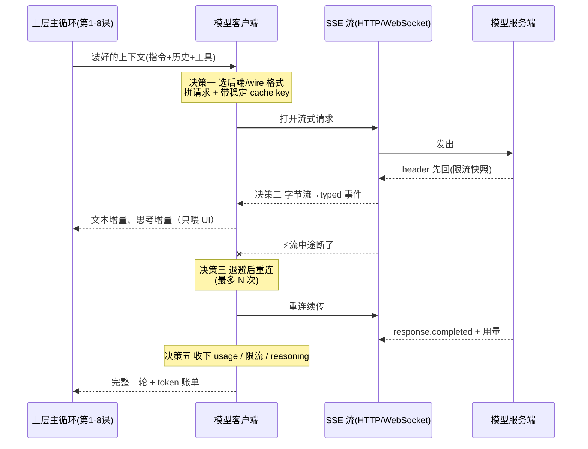
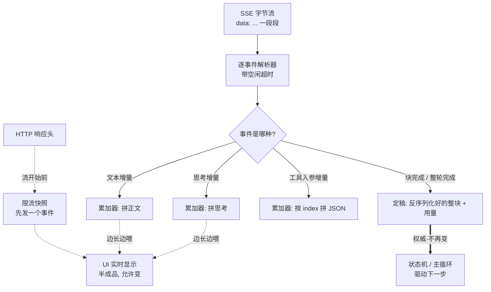
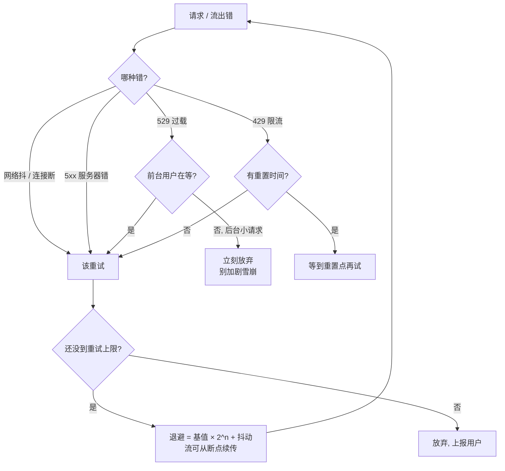
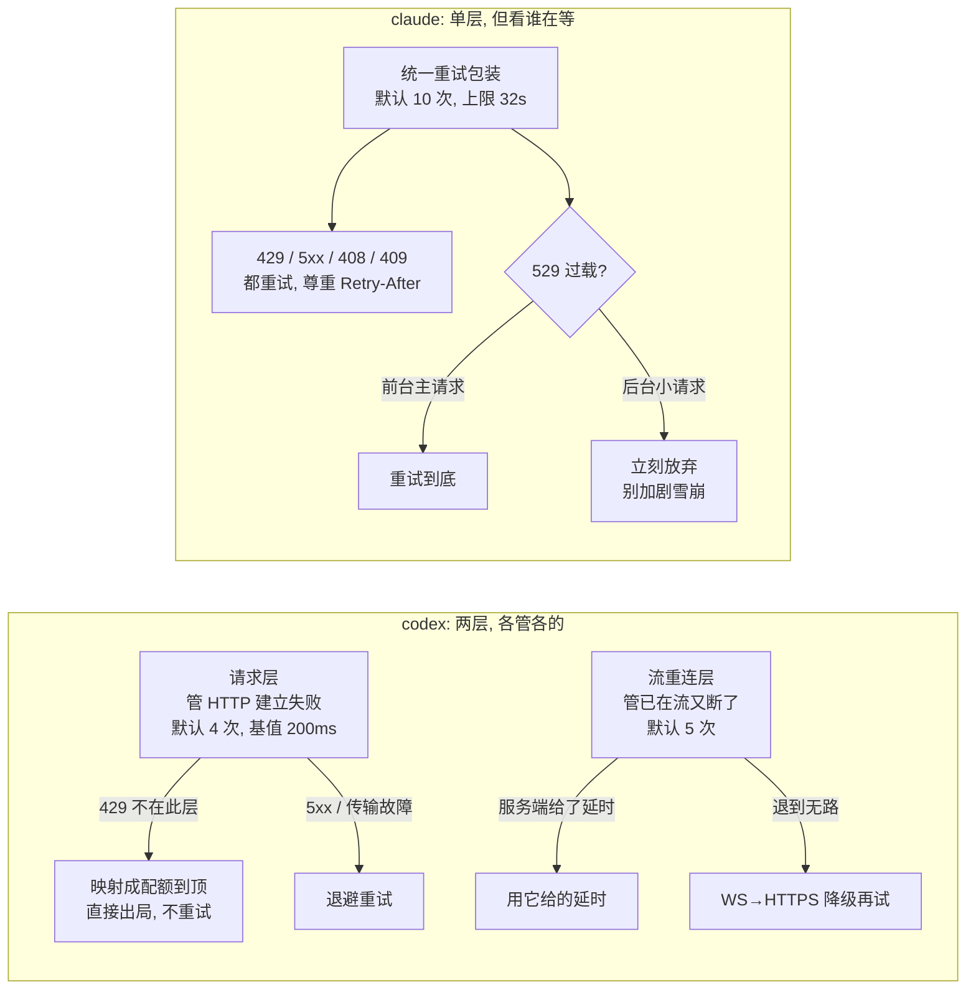
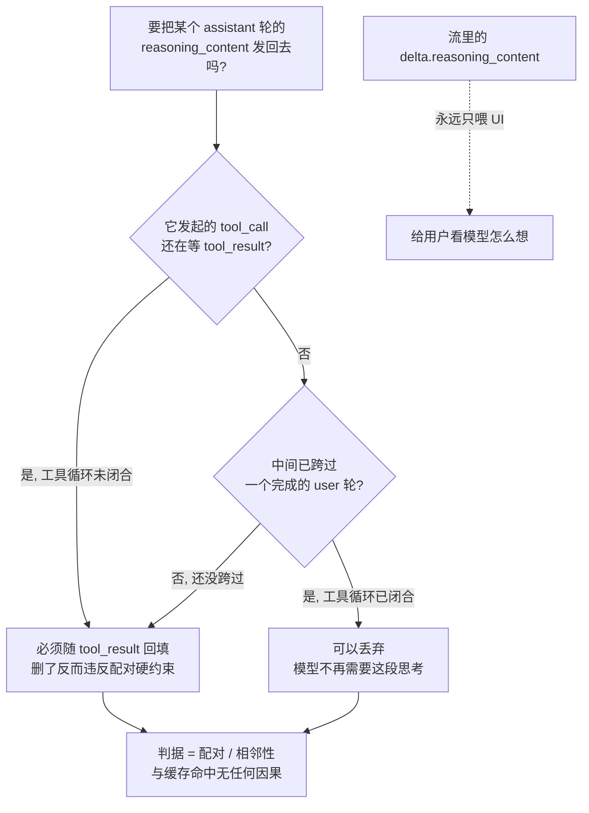

# 第 9 课：模型 / API 层

> 面向 deepseek 自研的 agent runtime 设计课。基于 claude / codex 真实源码。
> 这一课兑现第 8 课结尾那句欠账——"稳定前缀的收益在'模型 / API 层'兑现"。它是原始大纲的 #8。
> 讲法承接第 8 课定下的 register：正文不塞路径，每个小节末尾用「源码锚点」给可核验的文件与行号；符号名只在它本身帮你记住概念时才出现，且出现就当场解释。

---

## 0. 这一层是什么，以及它在挡什么

前面八课讲的都是"上层"：主循环怎么转（第 1 课）、工具怎么跑（第 2 课）、上下文怎么压（第 3 课）、指令怎么装配（第 8 课）……这些都默认了一件事——**"把这坨上下文发给模型，会回来一串 token"这个动作是可靠的**。这一课就专讲那个被默认掉的动作，以及它其实**一点都不可靠**。

先把这一课的主线钉死：

> **模型 / API 层 = 把"一次会断、会被限流、格式还各家不同的流式 HTTP 调用"，包装成"上层可以当成一个可靠函数来用"的那层。**

它挡的是四件随时会出岔子的事：**网络会在流到一半时断**;**服务端会甩回 429（限流）、529（过载）、5xx（服务器错）**;**不同后端说的"话"不一样**（OpenAI 的 Responses 格式、OpenAI 的 Chat Completions 格式、Anthropic 的消息流格式、Bedrock / Vertex 的转译）；**每次调用都在花钱、都在吃配额，而且缓存会无声地失效**。上层不该知道这些。上层只想要一个干净的约定：`把上下文给我 → 还我一串有类型的事件(文本增量、思考增量、工具调用、用量)`。这一层的全部工作，就是把上面四种乱七八糟吸收掉，让那个约定**看起来**永远成立。

**一次正常的调用，在这一层里实际经历了什么**（把它当成本课的主线，后面五个决策都是这条线上的一段）：

注意图里的两条返回线：**增量（delta）只喂给 UI 让用户看着字往外蹦，完整的、权威的那一份在流跑完时才定稿交回状态机。** 这个"增量给人看 / 完整给状态用"的二分，两家都这么做，是这一层的核心手法之一（决策二）。

下面五个决策，逐个拆。每个都给 claude / codex 的真实做法、对照、再落到 deepseek。

〔源码锚点:codex 模型客户端入口 `core/src/client.rs`(`stream()` 在 `:1619`),HTTP/SSE/重试机器搬进了独立的 `codex-api` crate;claude 走 `services/api/client.ts`(建客户端)+ `services/api/claude.ts`(流式主循环,`:1940`)〕

---

## 决策一：provider 抽象与 wire 格式 —— "对接谁、说哪种话"收口在一处

### 问题

你的 agent 早晚要面对不止一个后端：不同厂商、同厂商不同部署（自建网关 / 云转售）、甚至同一次会话里主模型和小模型走不同地方。"连哪个 URL、用什么 key、说哪种协议、加哪些 header、重试几次"——这些**不能撒在调用点到处都是**，得收口成一个东西。这就是 provider 抽象。

### codex 的设计：一个可序列化的 provider 配置结构，但 wire 格式如今只剩一种

codex 把"一个后端长什么样"建模成一个配置结构，字段非常全：base_url（注释明写是"provider 的 **OpenAI 兼容** API 的基址"）、装 key 的环境变量名、说哪种 wire 协议、要附的查询参数和 HTTP header、以及**两个独立的重试上限**（普通请求重试几次、流断了重连几次）。运行期再把这个配置转成一个带好了 header、重试策略、空闲超时的"活"的 provider 对象去真正发请求。

但有一件大事必须讲清楚，因为它推翻了旧资料：**codex 现在只剩一种 wire 格式——OpenAI 的 Responses API。** 那个"说哪种协议"的枚举，如今只有 `Responses` 一个取值；你要是在配置里写 `wire_api = "chat"`（老的 Chat Completions 格式），它**不是默默兼容，而是直接报错**，错误信息叫你改成 `"responses"`。也就是说，Chat Completions 这条路在这份代码里被**整条删掉了**。所以现在那个"按 wire 格式分发"的地方，实际只是在选传输方式（HTTP 长连 vs WebSocket），而不是在选协议。

〔源码锚点:provider 配置结构 `model-provider-info/src/lib.rs:85`(base_url 注释 `:89`、env_key `:92`、wire_api `:107`、http_headers `:112`、request_max_retries `:119`、stream_max_retries `:121`);wire 枚举只剩 `Responses` `:53-57`,写 `"chat"` 报错 `:46`、`:76`;运行期 provider 对象 `codex-api/src/provider.rs:43`;wire 分发(实为选传输)`core/src/client.rs:1619` 起(`:1631`)〕

### claude 的设计：一个二进制内置四个后端 SDK，按环境变量分叉

claude 这边是单厂商（都是 Anthropic 的模型），但**部署后端有四个**:Anthropic 第一方 API、亚马逊 Bedrock、谷歌 Vertex、微软 Foundry。建客户端时它按环境变量依次判断——开了 Bedrock 就加载 Bedrock 的 SDK、开了 Foundry / Vertex 就各自加载，都没开就走第一方。四条路差在认证方式（第一方用 API key / 订阅的 OAuth,Bedrock 用 AWS 凭证，Vertex 用 Google 鉴权，Foundry 用 Azure 鉴权）、区域（约等于基址）、以及**模型 id 还要按后端改写**——比如 Bedrock 要给模型名加跨区推理前缀（`us.` / `eu.` 这类），而且子 agent 得继承父 agent 的前缀，不然一个会话里混着带前缀和不带前缀的 id 会出错。还有些只有第一方才开的特性（细粒度工具流式、请求 id header）被显式 gate 在"是第一方且是 Anthropic 官方基址"上。

### 取舍

- **codex：配置即数据，换后端不改代码。** 加一个 provider 就是加一段配置；但代价是协议被收窄到只剩 Responses，任何不说 Responses 的后端现在接不进来。
- **claude：后端即代码，每个后端一套 SDK 分支。** 好处是每个后端的认证 / 区域 / id 改写都能精细处理；代价是加一个后端要动代码、要引一个新 SDK。
- 共同点：不管数据驱动还是代码驱动，**"连谁、用什么 key、说哪种话、重试几次"都被收口成一个明确的东西**，而不是散在每个调用点。这是这一层存在的第一个理由。

### deepseek 落地

这里有个对你**最要命的事实**，正是上面那个 codex 大更正的直接后果：**DeepSeek 的 API 是 OpenAI 兼容的 Chat Completions 格式，不是 Responses。** 所以——

- **你没法照抄 codex 现在的 wire 层**。codex 把 Chat Completions 删干净了，只剩 Responses；而 DeepSeek 恰恰只说 Chat Completions。把 codex 当前的 provider 配置指向 DeepSeek，`wire_api` 那一关就直接报错。你能从 codex 拿走的是**结构**（把后端建模成一个 base_url / key / header / 重试上限的配置），拿不走它当前的 wire 实现。
- **你更像是"自己写一个 Chat Completions 客户端"**，或直接用 OpenAI 的 SDK 把 base_url 指到 DeepSeek。请求体是 `messages` 数组 + `stream: true`，回来是 OpenAI 那套 `choices[].delta` 增量。
- 结构上仍按 codex 的思路：一个 provider 配置 + 留好"换后端 / 换 wire"的接缝（万一以后 DeepSeek 出 Responses 风格端点，或你要接别的厂商）。但 M0 就老老实实一个 Chat Completions 客户端。

〔源码锚点:claude 后端分支 `services/api/client.ts:153`(Bedrock)/`:191`(Foundry)/`:221`(Vertex)/`:301`(第一方);后端选择器 `utils/model/providers.ts:6`;Bedrock 跨区前缀 `utils/model/bedrock.ts:222`、`:248`,子 agent 继承 `utils/model/agent.ts:50`。DeepSeek wire 事实:OpenAI 兼容 Chat Completions(官方文档)〕

## 决策二：流式解析 —— 把 SSE 字节流变成 typed 事件，增量给 UI、完整给状态机

### 问题

模型不是一次性把答案吐完，而是**流式**地一个 token 一个 token 地推。底层收到的是一条 SSE（server-sent events，服务器逐条推送的事件流）的字节流，长得像 `data: {...}\n\n` 一段段。这层得把这堆字节**逐事件解析成有类型的东西**，还要回答两个工程问题：用户要立刻看到字往外蹦（低延迟），状态机又要拿到一份**完整、定稿、不会再变**的结果去驱动下一步——这两个需求时序不同，怎么同时满足。

解法是同一条字节流**分出两条去向**：增量边到边喂给 UI（半成品、允许变），块完成 / 整轮完成时才把权威版本定稿交给状态机（成品、不再变）。两家的解析器虽然消费的事件名不同，分流的形状完全一样：

注意两类返回线画法不同：点线（增量 / 限流快照）是给人看的、随时会被后续增量覆盖；粗线（定稿块）才是上层敢拿去推进状态的。**上层只信粗线。** 下面看两家怎么各自落到这张图。

### codex 的设计：一个 SSE 解析器，把事件翻成统一的 ResponseEvent

codex 有一个专门的函数把 SSE 流接过来：它给字节流套上事件源解析，带一个空闲超时（一段时间没动静就当连接死了），逐条把 `data` 解析成服务端的原始事件，再翻译成 runtime 内部统一消费的事件类型。关键的几种：**文本增量**（模型正在吐正文）、**思考摘要增量**（reasoning 的摘要在流）、**完整 item 完成**（一个输出块定稿了，这里给的是反序列化好的**整块**，是权威版本）、**整轮完成**（带回 token 用量）。还有个细节：**限流快照不是从流里来的，而是在流开始前就从 HTTP 响应头里解析好、先发一个事件出去**——所以你在第一个 token 之前就知道自己还剩多少配额。

这就把那个时序问题解了：**增量事件**喂给上层做实时显示，但它们只是"正在长出来"的半成品；**真正权威的完整块**在该块的"完成"事件里到达。上层信后者，前者只用来给人看。

### claude 的设计：直接消费 Anthropic 的消息流事件，按 index 累积成块

claude 直接消费 Anthropic 自家的 SSE 事件序列，一个状态机按事件类型推进：**消息开始**（建一个空壳、播下用量种子）→ **内容块开始**（按这个块是文本 / 工具调用 / 思考，初始化第几号槽位）→ **内容块增量**（往对应槽位上累加：文本增量累到文本上、工具入参的 JSON 片段累到入参上、思考增量累到思考上）→ **内容块结束**（把这一槽定稿成一条助手消息、推出去）→ **消息增量**（把最终用量和停止原因写回最后一条消息）。有个值得记的工程取舍：它故意**不用 SDK 那个帮你拼好 JSON 的便捷流**，而是用更原始的流自己拼——因为便捷流在长的工具入参上会反复重解析整段 JSON，变成 O(n²)，长输出会卡。

两家殊途同归到**同一个模式**:delta 累积出"正在长出来"的样子给 UI，块结束 / 整轮结束时才定稿出权威结果给状态机。

### deepseek 落地

DeepSeek 的 Chat Completions 流是 OpenAI 那套 `choices[].delta` 格式——正文增量在 `delta.content`，而 **开了 thinking 时的思考增量在 `delta.reasoning_content`**，两者分开来。（v4 把 reasoning 做成请求里的 `thinking` 开关，不再是单独的 reasoner 模型；老 `deepseek-reasoner` 别名 2026-07-24 下线。）你这层要做的就是上面那套状态机的简化版：

- 一个累加器把 `delta.content` 拼成最终正文、把 `delta.reasoning_content` 拼成思考（**两条分开存**，因为它们去处不同——思考给 UI 显示，回传则按决策五那条**条件规则**：工具调用链里要带、跨 user 轮才丢）；
- 工具调用的 `delta.tool_calls` 也要按 index 累加（函数名 + 入参 JSON 片段）；
- 流结束（`finish_reason` 到了）时定稿，把完整 assistant 消息交回主循环。
- 同样遵守"增量喂 UI、完整给状态机"：用户看着字蹦，主循环只信定稿。

〔源码锚点:codex SSE 解析器 `codex-api/src/sse/responses.rs:434`,事件翻译 `:298`(文本增量 `:310-312`、思考摘要增量 `:326-328`、完整 item `:302-305`、整轮完成带用量 `:393-401`),统一事件类型 `codex-api/src/common.rs:73`,限流快照在流前从 header 预发 `sse/responses.rs:31`、`:37`。claude 累积主循环 `services/api/claude.ts:1940`(消息开始 `:1980`、块开始 `:1995`、块增量 `:2053` 内含文本 `:2125`/思考 `:2160`/工具入参 `:2111`、块结束定稿 `:2171`、`:2195`、消息增量写回用量 `:2213`),避免 O(n²) 用原始流的注释 `:1818`。DeepSeek `reasoning_content` 走 delta:官方文档〕

## 决策三：重试与退避 —— 哪些错该重试、退避多少、流断了怎么续

### 问题

网络**就是会**抖，服务端**就是会**限流和过载。如果你不在这一层兜住，这些瞬时故障就会变成用户面前一次次失败的对话。但重试不能蛮干：有些错重试是对的（网络抖、过载），有些错重试只会火上浇油（你已经超配额了，再撞只会更糟），退避太短等于 DDoS 自己的供应商，太长用户又干等。这一层要把"哪些重试、退避多久、流断了能不能接着续"全定下来。

### codex 的设计：两层重试，且把 429 当"别重试"

codex 把重试分成**两层、各管各的**:

- **请求层**（管整次 HTTP 调用建立时的失败）：指数退避，基值 200 毫秒、每次翻倍、加 ±10% 抖动，默认最多 4 次。这一层有个反直觉的设定：**429 限流明确不在这层重试**——它被映射成"配额到顶"这种**不可重试**的错误，直接往上报，而不是傻乎乎再撞一次。会重试的是 5xx 和传输层故障（超时 / 网络）。
- **流重连层**（管已经在流了、流中途断了）：默认最多 5 次。退避有个聪明处：**如果服务端在错误里明说了"过 N 秒再来"，就用它给的那个延时，而不是自己算的退避**。而且这层退到无路可走时，还能**从 WebSocket 传输降级到普通 HTTPS 流**再试一次——换条路而不是干放弃。

有意思的是 codex **不解析标准的 `Retry-After` 响应头**；它认的是两种"软"信号：错误消息文本里那句 "try again in N seconds"，和 429 响应体里给的"配额重置时间"。

### claude 的设计：单层重试，默认狠（10 次），且把"谁在等"纳入决策

claude 是一层统一的重试包装，默认最多 **10 次**（可用环境变量调），基值 500 毫秒、指数翻倍、**上限封到 32 秒**、再加最多 25% 抖动。会重试的面很宽：429、5xx、529 过载、408 超时、409 锁冲突、连接错误都试。它**会**解析标准 `Retry-After` 头，也会读 Anthropic 自家的统一限流重置头、在持久模式下一直等到重置点。

但它最值得抄的是一个**产品级判断**:**529 过载错误，要看"是不是用户正前台等着这个结果"**。如果是前台主请求（用户盯着），就重试；如果是后台的小请求（自动生成标题、摘要、建议这类），**立刻放弃，不重试**——因为容量雪崩的时候，每个后台请求的重试都是在给已经过载的网关再加一脚，前台用户反而更难拿到结果。这个"前台重试、后台快速失败"的区分，是高负载下体验不崩的关键。

把两家的重试**结构**摆在一起看，差别一眼就清楚——codex 按"调用建立"和"流中途断"切成两层、各有上限，且 429 直接出局；claude 一层兜全部、上限给得狠、却额外拿"谁在等"作分流：

### 取舍

- **退避必须有抖动 + 上限。** 两家都加抖动（防止一堆客户端同时醒来再次撞墙），claude 还封了 32 秒上限，codex 请求层不封、靠次数兜底。
- **429 怎么处理两家相反**:codex 当"别重试，直接报配额到顶";claude 会重试且尊重重置头。这其实反映后端语义不同——但对你而言要点是：**429 不是普通错误，得专门判，别和 5xx 混为一谈。**
- **"谁在等"该进重试决策**（claude 的洞见）：雪崩时无差别重试会把自己拖垮，前台 / 后台要区别对待。

### deepseek 落地

- **重试是必须的，不是优化**：网络就是会断，没有重试层你的 agent 在弱网下没法用。给 DeepSeek 调用套一层：指数退避 + 抖动 + 上限 + 次数封顶。
- **认 DeepSeek 的 429 和它的 `Retry-After`**：限流时尊重服务端给的重置时间，别自己瞎退避。
- **抄 claude 那个前台 / 后台区分**：用户在等的对话请求该重试到底；你后台跑的那些小请求（自动起标题、做嵌入、压缩摘要）在限流时该快速放弃，别和前台抢配额。
- **流断了要能接着发**:DeepSeek 流式中途断，至少要能重发整轮重来；如果将来支持断点续传更好，M0 重发整轮也够用。

〔源码锚点:codex 请求层重试决策 `codex-client/src/retry.rs:23`(429/5xx 规则 `:29-30`)、退避 `:38`,重试配置 `model-provider-info/src/lib.rs:257`(`retry_429:false` `:260`、`retry_5xx:true` `:261`),默认请求 4 次 `:28`/流 5 次 `:27`、上限 100 `:31`、`:33`;流重连层 `core/src/responses_retry.rs:22`(重试闸 `:48`、服务端给的延时优先 `:51-56`、WS→HTTPS 降级 `:31-46`),核心退避 `core/src/util.rs:85`(基值 200ms `:8`、翻倍 `:9`),429 映射成配额到顶 `codex-api/src/api_bridge.rs`,"try again in N" 解析 `sse/responses.rs:531`、`:596`。claude 重试包装 `services/api/withRetry.ts:170`,常量默认 10 次 `:52`、529 上限 3 `:54`、基值 500ms `:55`,该不该重试 `:696`(429 `:767`、5xx `:784`、529 `:722`),退避上限 32s + 抖动 `:530`、`:542-547`,解析 Retry-After / 统一重置头 `:519-528`、`:814-822`,后台 529 立刻放弃 `:84-89`,环境变量调次数 `:789-794`〕

## 决策四：缓存协作 —— 这一层怎么让第 8 课的稳定前缀真的省到钱

### 问题

第 8 课花了一整节（决策五）讲"把指令层的稳定部分排到前面、好被缓存"。但那只是把话排好；**真正让缓存生效的动作发生在这一层**——要么由这层在请求里**显式打缓存断点**告诉服务端"这一截可以缓存"，要么这层**配合隐式前缀缓存**（发一个稳定的 key、保持前缀一字不变）。第 8 课在这里兑现。

### claude 的设计：在 API 层显式打 `cache_control` 断点，且断点极其吝啬

claude 走**显式断点**。还记得第 8 课那个埋在系统 prompt 数组里的边界哨兵吗？**就是在这一层被消费的**：这层找到哨兵的下标，把数组一刀两断——哨兵**之前**的拼成一块、打上"全局可缓存"的标记，哨兵**之后**的拼成一块、**不**缓存。然后给那块可缓存的加上 `cache_control: { type: 'ephemeral' }` 这个标记发出去。

最值得记的是它有多**吝啬**:Anthropic 的缓存断点总数有硬上限，代码注释直接写"**别再加 block 了，否则会 400 报错**"。所以它精打细算地只在三个地方各放极少的断点——系统 prompt 一个、工具定义一个、消息历史里**恰好一个**（放在最后一条或倒数第二条），再让更早的工具结果"引用"这个断点而不是各自再开。这呼应第 8 课那个 `2^N` 的道理：缓存断点是稀缺资源，乱放不但不省、还直接报错。另外它有一整套**诊断**机制，专门追踪"这次和上次比，系统 prompt / 工具 / 模型 / 标记 哪里变了导致缓存断了"，写成 diff 帮你查为什么没命中。

### codex 的设计：不打断点，只发一个稳定的 cache key，靠隐式前缀缓存

codex 走**隐式前缀缓存**：它不在请求里打任何缓存断点，而是依赖 OpenAI 那套"前缀只要一字不差就自动命中缓存"的底层规则。它为这套规则做的唯一一件事，是**每轮都发一个稳定的 `prompt_cache_key`**，值就是这个会话的线程 id——同一会话的每次请求都带同一个 key，帮服务端把缓存路由到对的地方、提高命中率。命中了多少，它从回来的用量里读那个"缓存命中的输入 token 数"来看。没有断点、没有 `cache_control`，全交给底层。

### 取舍

- **显式断点（claude）**：可控、能跨组织共享静态缓存，但你要管断点放哪、放几个，放错直接 400。
- **隐式前缀（codex）**：省心，代码里几乎不用操心缓存，但你对"到底缓存了哪一截"没有手柄，只能靠"保持前缀稳定 + 发稳定 key"去间接影响，再从用量里事后观测。
- 不管哪条，**第 8 课那条"会变的东西往后排"的纪律都是前提**：显式断点要靠它知道切在哪，隐式前缀更是命就在它身上——前缀一旦在中间变了，后面全部 miss。

### deepseek 落地

**DeepSeek 用的是隐式自动前缀缓存**（和 codex / OpenAI 那侧同构），这把你的选择基本定死了：

- **你不用、也没法打显式断点**，走隐式这条。所以**第 8 课的稳定前缀纪律在这一层 100% 兑现**：身份 / policy / 工具定义冻在最前一字不变，env / 项目文件 / 临时注入全排到后面。已核官方文档：DeepSeek 自动按前缀缓存、改了代码即享，**`A+B` 之后再发 `A+C`，分叉点之后的全部 miss**——这就是为什么前缀一点都不能在中间动。
- **发一个稳定的会话标识**帮命中（对应 codex 那个 `prompt_cache_key`=线程 id 的做法）：同一会话每轮带同一个标识。
- **从响应里观测命中**:DeepSeek 的响应带 `prompt_cache_hit_tokens` 和 `prompt_cache_miss_tokens`，把它打到日志 / 状态栏，你才知道自己的前缀纪律有没有真的省到钱。这是你验证第 8 课那一课没白上的唯一手段。

〔源码锚点:claude 边界哨兵 `constants/prompts.ts:114`,在 API 层切分 `utils/api.ts:321`(找哨兵下标 `:363`、静态块→全局缓存 `:394`、动态块→不缓存 `:396`、工具型 / 三方→组织级 `:353`),加 `cache_control` 标记 `services/api/claude.ts:358`、`:3213`("别再加 block 否则 400" `:3221`),消息侧恰好一个断点 `:3063`(`:3078`、断点位置 `:3089`、更早工具结果引用断点 `:3187-3206`),缓存断裂诊断 `services/api/promptCacheBreakDetection.ts`。codex 缓存 key 字段 `codex-api/src/common.rs:198`,每轮赋值 `core/src/client.rs:812`、`:826`,值=线程 id `:418-421`,命中 token 读回 `codex-api/src/sse/responses.rs:123-126`。DeepSeek 隐式前缀缓存 + `prompt_cache_hit_tokens`/`miss_tokens`:官方文档〕

## 决策五：回传的东西 —— 用量计费、限流快照、reasoning 处理（收口与底线）

### 问题

模型回来的不只是正文。还有三样**上层迟早要用、但又最容易处理错**的东西：**用量**（这轮花了多少 token、多少钱）、**限流快照**（还剩多少配额、几点重置）、以及 **reasoning**（思考过程）。前两样是观测和成本；第三样对 DeepSeek 来说是**正确性红线**——处理错了不是省不省的问题，是会直接出错（该带的没带，模型就接不上它没做完的工具调用）。这是本课收口，也是每课惯例的"底线"。

### 用量：把 token 拆开记，而且读写缓存计价不同

两家都把一次调用的 token **拆成几类分开记**：输入 token、输出 token、**缓存命中的输入 token**、以及 **reasoning token**（思考也烧 token，得单独算）。claude 还把成本算得很细——**写缓存和读缓存是两个不同的价**（写进缓存比正常输入还贵一点、读缓存则便宜一个数量级），所以同样是"输入 token"，命中缓存的那部分按便宜价、第一次写进去的按贵价。这就是为什么前面那么在乎缓存命中率：命中率直接换算成账单。

### 限流快照：从响应头解析成结构，好告诉用户"还剩多少"

两家都把限流信息**从 HTTP 响应头里解析成一个结构**：有主窗口 / 次窗口、用了百分之多少、几点重置。codex 在流开始前就把它发出来（前面决策二提过），claude 把它解析后用来给用户**生成那句"你的额度 X 点 Y 分重置"**的提示。意义是：限流不该是一个神秘的失败，而该是一个**能告诉用户具体状态**的信息。

### reasoning:codex 当加密 blob 回传，而 DeepSeek 按「配对 / 相邻」条件规则处理

这是对 deepseek **最要命**的一节，两家做法又正好给了你正反两个参照。

**codex** 把 reasoning 当**加密不透明块**来处理：发请求时，如果开了 reasoning，它额外要求服务端"把加密的思考内容回给我"；回来的思考块带着一段加密内容。到了**下一轮要把历史发回去**时——关键来了——它**把明文的思考正文 strip 掉、只回传那段加密内容和摘要**。也就是说，模型的思考链不以可读明文在轮次间来回传，只以加密 blob 形式回去（让服务端自己解，客户端不碰）。它还会认一个服务端 header，意思是"过去那些 reasoning 的 token 我已经替你算过了，你别重复估"。

**DeepSeek 的规矩**要命的地方，在于它**容不得你乱删、也容不得你乱留**；而且它**不是**早期那个流传很广的「一律剥离 `reasoning_content`、否则 400」（那个说法已被我们的架构宪法明确作废）。真实规则是**条件式**的，核心是**配对 / 相邻性**:

- **工具调用链里，必须把 `reasoning_content` 带回去。** 发起 `tool_call` 的那个 assistant 轮，在你下一次把对应的 `tool_result` 发回去时，**必须随它一起回填这一轮的 `reasoning_content`**——模型要靠这段思考接着它没做完的工具调用。**这里删了反而违反它的配对硬约束**，跟「无条件删」正好相反。
- **跨过一个已完成的普通 user 轮之后，才可以丢。** 用户开了新的一轮、上一个工具循环闭合了，那段旧 `reasoning_content` 不再需要，可以丢弃。
- **思考增量（`delta.reasoning_content`）永远只喂 UI**——给用户看模型怎么想的；但「要不要回传给模型」按上面这条配对规则走，**不是一刀切删掉**。
- **别把它跟缓存挂钩**：带不带 `reasoning_content` 是为了**配对正确**（不违约），跟「命中缓存」**没有任何因果关系**——这两件事很容易被搞混。官方缓存文档只对**输入前缀**生效、整篇**根本没提 reasoning**;reasoning 那套也没提缓存。所以「剔除 reasoning 才能命中缓存」「reasoning 不参与缓存」都是没文档依据的错误说法，它们是两条互不相干的线。

把这条条件规则画成一张判定图——拿到历史里某个 assistant 轮的 `reasoning_content`，要回传还是丢，全看它那个工具循环闭没闭，而不是看任何缓存：

注意这张图的判据**只有**"工具循环闭没闭"——没有一个分支问"缓存命中没有"，因为那是另一条互不相干的线。最容易栽的坑就是把这两条线缠在一起，照着早期那句「一律剥离否则 400」无脑删，结果在工具调用链里删掉了模型接着干活要用的思考，直接报配对错误。

由于这条规则的边角（尤其旧别名在跨轮场景下到底报不报 400）还有不确定性，**稳妥做法是把「带 / 丢」做成一个配置开关**（`keep_reasoning`，默认**保留**），拿真实请求实测后再翻转，而不是把某个固定行为硬编码进逻辑。

codex 那套（strip 明文、只回传加密 blob + 摘要）和 DeepSeek 这条（按配对规则带 / 丢明文 `reasoning_content`）**目标一致**：让思考链在轮次间「该在时在、不该在时不在」，而不是无脑塞回、也不是无脑删。

### deepseek 落地（本层底线清单）

1. **用量拆类记账**：输入 / 输出 / 缓存命中 / reasoning 四类分开，把缓存命中率和花费打到可见的地方（成本意识 + 验证第 8 课的前缀纪律）。
2. **限流当信息不当谜**：解析 DeepSeek 的限流 / 余额信息，转成给用户看的"还剩多少 / 几点恢复"，别只甩一个失败。
3. **reasoning 按条件规则处理（不是无脑删）**：工具调用链里**必须随 `tool_result` 回填上一轮的 `reasoning_content`**（删了反而违约），跨过普通 user 轮后才可丢；`delta.reasoning_content` 永远只喂 UI。把「带 / 丢」做成一个 `keep_reasoning` 配置开关（默认保留、按实测翻转），别硬编码——它是**配对正确性**约束，跟缓存无关。

〔源码锚点:用量——codex 用量结构 `protocol/src/protocol.rs:2003`(输入/缓存/输出/reasoning 分字段 `:2005-2013`),从 wire 解析 `codex-api/src/sse/responses.rs:119-135`;claude 用量累加 `services/api/claude.ts:2924`、空用量模板 `services/api/emptyUsage.ts:8`,读写缓存分费率与计价 `utils/modelCost.ts:27-33`、`:131`。限流——codex 快照结构 `protocol/src/protocol.rs:2090`(窗口 用百分比/重置点 `:2128-2136`),从 header 解析 `codex-api/src/rate_limits.rs:28`;claude 统一限流头分类 `services/api/errors.ts:465`(重置点 `:489-494`)。reasoning——codex 构建 reasoning `core/src/client.rs:749`、请求 include 加密 `:791-795`、回传时 strip 明文只留加密 `protocol/src/models.rs:1353`、服务端"已算过 reasoning token"信号 `codex-api/src/common.rs:84`、`sse/responses.rs:77`。DeepSeek `reasoning_content` 按**条件规则**(工具调用链随 `tool_result` 回填、跨 user 轮可丢;真正硬约束 = 配对 / 相邻性,`keep_reasoning` 默认保留)——权威源 = deepseek 架构宪法 §1.4 / §2.D2 / §4(§4 明确作废旧「一律剥离否则 400」说法);缓存是另一篇 context-caching 文档,只覆盖输入前缀、未提 reasoning,两者无因果〕

---

## 速查表：模型 / API 层一张表

| 维度 | claude | codex | deepseek 取向 |
|---|---|---|---|
| 后端抽象 | 一个二进制内置 4 个 SDK（第一方/Bedrock/Vertex/Foundry），按环境变量分叉 | 一个可序列化 provider 配置（base_url/key/wire/header/重试），换后端不改码 | 抄配置结构，M0 自写一个 Chat Completions 客户端 |
| wire 格式 | Anthropic 消息流 | **只剩 OpenAI Responses**（Chat Completions 已删，写 `chat` 报错） | OpenAI 兼容 **Chat Completions**（照抄不了 codex 当前 wire） |
| 流式解析 | 按 index 累积内容块，块结束定稿；避 O(n²) 用原始流 | SSE→统一事件；完整 item 在 done 事件、delta 只喂 UI | 累 `delta.content`/`reasoning_content`/`tool_calls`，结束定稿 |
| 重试结构 | 单层，默认 10 次，上限 32s + 抖动 | 两层（请求 4 次 / 流重连 5 次） | 一层够用 + 退避抖动上限 |
| 429 处理 | 重试且尊重重置头 | **不在传输层重试**，映射成配额到顶 | 专门判 429、认 Retry-After |
| 雪崩防护 | **前台重试、后台立刻放弃** | 流重连可 WS→HTTPS 降级 | 抄"前台/后台分别对待" |
| 缓存协作 | 显式 `cache_control` 断点，极吝啬（多打就 400） | 隐式前缀，只发稳定 `prompt_cache_key`=线程 id | 隐式自动前缀，保前缀稳定 + 发稳定会话 id + 看命中 token |
| 用量 | input/output/缓存读写（分价）/reasoning | input/cached/output/reasoning | 四类分记，缓存命中率可见 |
| reasoning 回传 | strip 明文，只回传加密 blob + 摘要 | 同上（请求 include 加密） | **条件规则：工具链里随 `tool_result` 回填 `reasoning_content`、跨 user 轮才丢（配对正确性，与缓存无关）；`keep_reasoning` 默认保留** |

## 跨课接缝

- **第 1 课（主循环）**：主循环里"把上下文发给模型、拿回事件"那一步，整个就是这一课。第 1 课把它当成一个可靠调用，这一课讲它为什么其实不可靠、怎么被兜住。
- **第 3 课（压缩）**：压缩改的是历史中段，会让前缀分叉、缓存 miss——和本课决策四的前缀纪律是同一个机理（DeepSeek `A+B`/`A+C`）。第 3 课从历史侧看，本课从请求侧看。
- **第 8 课（指令架构）**：第 8 课决策五排好的稳定前缀，在本课决策四真正兑现成缓存命中；那个边界哨兵就是在本课的 API 层被消费的。**缓存边界在第 8 课挣，在本课兑。**
- **第 5 课（持久化）**:reasoning 的处理也牵涉持久化——加密思考块 / `reasoning_content` 要不要落盘、回放时怎么办，和第 5 课的 rollout 是一组问题。

## deepseek 落地总结（M0）

模型 / API 层，六条：

1. **provider 配置化**：一个结构装 base_url / key / header / 重试上限；M0 自写一个 OpenAI 兼容 **Chat Completions** 客户端（codex 现在只剩 Responses,wire 层抄不了）。
2. **流式解析两路**:`delta.content`→正文、`delta.reasoning_content`→思考（分开存）、`delta.tool_calls`→工具，按 index 累加，结束定稿；增量喂 UI、完整给主循环。
3. **重试层**：指数退避 + 抖动 + 上限 + 次数封顶；专门判 429、认 Retry-After;**前台请求重试到底、后台小请求限流时立刻放弃**。
4. **缓存协作**：走 DeepSeek 隐式自动前缀缓存——不打断点，靠**第 8 课的稳定前缀纪律** + 发稳定会话 id + 从 `prompt_cache_hit_tokens`/`miss_tokens` 观测命中。
5. **用量与限流可见**:token 分四类记账、读写缓存分价；限流信息解析成"还剩多少 / 几点重置"给用户。
6. **reasoning 按条件规则**：工具调用链里**随 `tool_result` 回填** `reasoning_content`、跨 user 轮才丢（配对正确性，删错反而违约）；`delta.reasoning_content` 只喂 UI；「带 / 丢」做成 `keep_reasoning` 开关（默认保留、按实测翻转），与缓存无关。

一句话收口：**这一层交付的不是"会调模型"，而是"把一个会断、会被限流、会算错账、会因思考链回传而报错的网络调用，变成上层可以闭着眼当可靠函数用的东西"。** 上面八课所有的优雅，都默认了这一层先把脏活兜干净。
