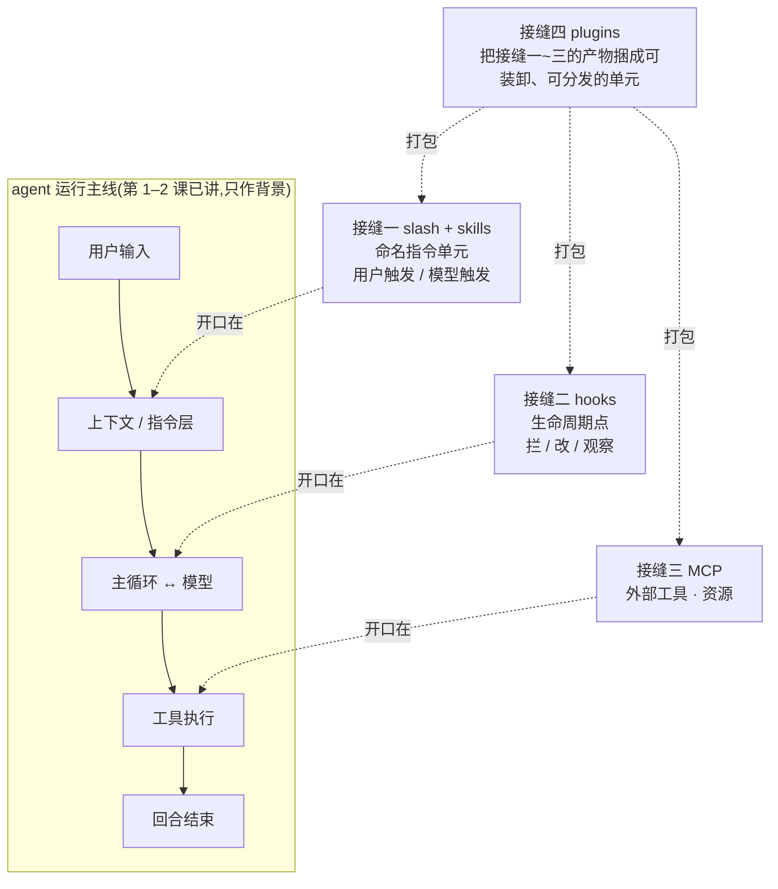
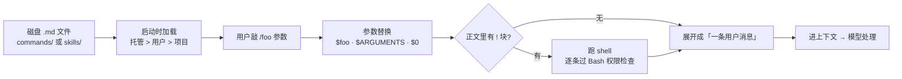
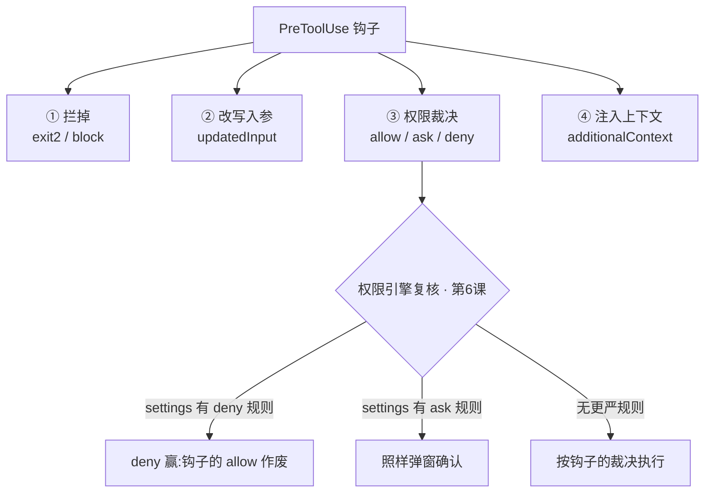
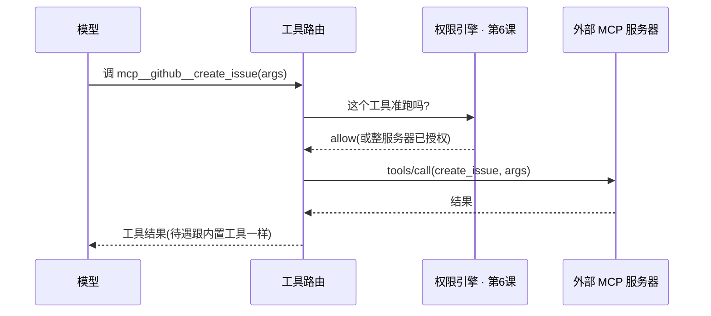
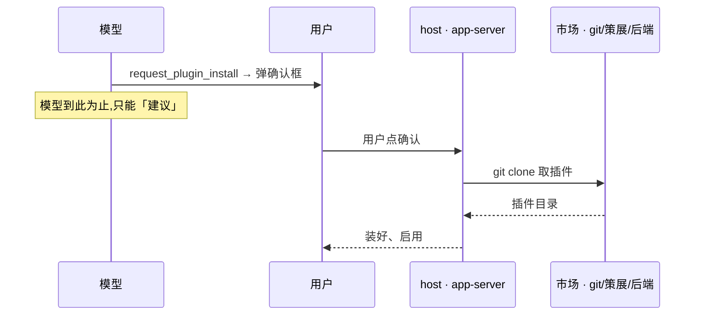

# 第 10 课：可扩展性 —— 让别人不改源码就能往 agent 里加东西

> 面向 deepseek 自研的 agent runtime 设计课。基于 claude、codex 真实源码。
> 这一课讲四个扩展接缝：slash 命令、hooks、MCP、plugins。它是原始大纲的 #9。
> 讲法承接前几课的写法：正文不塞路径，每个小节末尾用「源码锚点」给可核验的文件与行号；符号名只在它本身帮你记住概念时才出现，且一出现就当场解释。

---

## 0. 这一层是什么，以及它在回答什么问题

前面九课讲的都是 agent 内核自己怎么转：主循环（第 1 课）、工具（第 2 课）、压缩（第 3 课）、记忆与持久化（第 4、5 课）、权限沙箱（第 6 课）、多 agent（第 7 课）、指令架构（第 8 课）、模型 / API 层（第 9 课）。这一课换一个视角：**内核写好之后，别人——第三方开发者、公司管理员、高级用户——怎么不改你一行内核源码，就往这个 agent 里加东西？**

先把这一课的主线定下来，后面所有内容都挂在它上面：

> **可扩展性 = 内核在几个固定的位置对外开口，让别人不动内核就能往 agent 里塞东西。这种「内核对外开口的固定位置」，下面统一叫「接缝」。每个接缝的设计，本质上都在回答三个问题：开在哪一层（用户输入 / 运行时生命周期 / 模型能力 / 分发打包）、给进来的东西多大权力（只能往上下文里塞字 / 能拦能改动作 / 能跑任意进程）、信任谁（编译期写死 / 企业策略放行 / 用户配置即信任 / 哈希签名 / 模型只能建议）。**

原始大纲点名的四个机制，正好是开在四个不同层上的四个接缝：

- **slash 命令与它的孪生 skills** —— 开在**用户输入 / 指令**那一端：把一段指令存成命名单元，用户敲斜杠唤出（slash），或让模型按需自己调用（skill）。它俩是同一个接缝的两半，差别只在谁触发。（skill 的渐进披露机制第 8 课讲透了，这一课讲它在扩展体系里的位置。）
- **hooks** —— 开在**运行时生命周期**上：在内核干活的固定时刻（调工具前、跑完后、会话开始、想收尾时）自动插一脚。
- **MCP** —— 开在**模型能力 / 工具**层：让任意外部进程经一个标准协议，把工具和资源供给模型。
- **plugins** —— 开在**分发打包**层：把上面三样捆成一个可安装、可版本化、可装卸的单元。

把这四个接缝按「各自开口在哪一层」摆出来，大致是下面这样——**实线是你已经熟的运行主线（第 1–2 课，只作背景），虚线才是第三方往里插的口**：



这张图就是这一课的主线：**前三个接缝各自「开口在」运行主线的某一层——slash/skills 开在指令层、hooks 开在生命周期、MCP 开在工具层；第四个接缝 plugins 不直接开口，它只是把前三个的产物打包成能装卸、能分发的单元。** 记住这个「三个口 + 一个打包」的形状，下面四节就是逐个拆这四处。

**贯穿全课有一条对照主线，先提前说一句：codex 这一两年明显在「向 claude 立下的扩展标准靠拢」。** 它的插件清单认 claude 的 `.claude-plugin/plugin.json`，它的 hooks 在注释里自称「Claude 风格」，它专门做了个 `/import` 把整套 Claude Code 配置搬过来。但 codex 在「谁可信、放不放进来」这件事上划得比 claude 严——同样的开口，它每一处都按「这个扩展能干多狠」多设一道准入检查。这条「靠拢、但更紧」的线，你会在四个接缝里反复看到，它也正是给 deepseek 的最强信号。

下面四个接缝逐个拆，每个都给 claude、codex 的真实做法、对照、再落到 deepseek。

〔源码锚点:四个接缝的代码归处——claude 的命令在 `commands/` 与 `skills/`、钩子在 `utils/hooks*` 与 `services/tools/toolHooks.ts`、插件在 `plugins/` 与 `utils/plugins/*`、MCP 在 `services/mcp/*`;codex 的钩子在 `hooks/` crate、插件在 `plugin/`+`core-plugins/`、MCP 在 `rmcp-client/`+`mcp-server/`+`codex-mcp/`、内部扩展在 `ext/extension-api/`。两家「收敛」的铁证=codex 插件清单回退认 `.claude-plugin/plugin.json`(`utils/plugins/src/plugin_namespace.rs:10-11`)、有 `/import` 专门搬 Claude Code(`tui/src/slash_command.rs:103`)〕

---

## 接缝一：slash 命令与 skills —— 「命名的指令单元」，用户触发 vs 模型触发

### 问题

用户老在重复输入同一段指令——「审查我这次的改动，重点看错误处理和边界条件」。他想给这段话起个短名字，敲 `/review` 一键唤出。这是最浅的一个扩展点：在用户输入那一端，让人把一段 prompt 模板存成文件，用一个斜杠命令调出来。设计问题有三个：模板存哪、怎么往里传参数、唤出来之后是直接变成「给模型的话」，还是能跑真代码。

但这里还藏着第二根轴，放在「可扩展性」这一课里**不能略过：这个命名单元由谁触发？** 用户敲 `/它` 是一种（slash）；让模型自己判断「这活儿该用那个单元」是另一种（skill）。同一个东西——一段命名好的指令——既可以朝用户开口，也可以朝模型开口。两家的取法正好相反，这也是 skill 必须在这一课占一席的原因：**它就是 slash 的另一半，是「命名指令单元」朝模型那一侧开的口。**

### claude 的设计：markdown 文件展开成一条用户消息，还能跑 shell

claude 的自定义命令就是一个 markdown 文件。它从磁盘被加载、到用户敲 `/foo` 后变成模型看到的东西，中间这条路是这样的：



图上几个点拎出来说清楚。

**存哪、谁优先。** 三处 `.claude/commands/` 目录：企业托管 > 用户（`~/.claude`）> 项目；项目目录从当前目录往上走到 git 仓库根**为止**（免得父仓库的命令泄进来）；放进子目录的命令拿到 `子目录:命令名` 的命名空间。

#### frontmatter 字段，以及它们各自的权力上限

**头部 frontmatter 支持的字段**（挑真实存在的）：

| 字段 | 作用 |
|---|---|
| `description` / `argument-hint` | 给人 / 模型看的说明、参数提示 |
| `allowed-tools` | 给本命令 `!` 块的工具**预授权**（仍受权限引擎压制，见表下） |
| `arguments` | 声明具名参数（供 `$foo` 替换） |
| `model` | 用哪个模型（`inherit` = 继承父级） |
| `context` | `inline` 当场展开 / `fork` 丢给子 agent 跑 |
| `user-invocable` / `disable-model-invocation` | 两个**触发开关**：能不能被用户敲 `/它` / 能不能被模型调 |
| `hooks` | 命令触发时顺带注册的钩子 |
| `shell` | shell 块用 bash 还是 powershell |

**先别被这张表吓到——「连用啥模型、用啥工具都让命令文件定义」听着像是「命令文件想干啥就能干啥」，其实没有。** 按「能造成多大破坏」把字段分三类看：

- **设限类**（`user-invocable` / `disable-model-invocation`）：只会**缩小**这个单元能被谁触发，不给任何权力。
- **偏好类**（`model` / `effort` / `shell`）：选哪个模型、思考多深、shell 用 bash 还是 powershell。命令确实能换模型，但最坏后果是**多花钱**，不是安全口子；而且 `shell` 还压不过用户的开关——frontmatter 写 powershell、用户没开启它就用不上。
- **看着唬人、其实被权限引擎管住的**（`allowed-tools`）：它**不是**「给命令发工具权限」。它只给这条命令**自己的 `!` shell 块**预先加一条「允许」，而且每个 `!` 块仍然**整个走一遍权限引擎**——引擎里 **deny 规则最先判、直接压死「允许」**（和下面 hooks 那条底线是同一个引擎、同一个道理），敏感路径（`.git/`、`.claude/` 等）**强制弹窗、谁都绕不过**，来自 MCP 的命令更是**根本不准跑 `!` 块**。所以一个 `allowed-tools` 最多帮你把「没被 deny 的命令」免去逐次确认，绝跑不了你 / 企业明令禁止的东西，也不会扩大模型在这一轮里的工具权限。

**一句话：frontmatter 字段的权力上限，等于「你对写这个文件的人有多信任」。** 真正管事的不是 frontmatter 本身，是「谁有权往 `.claude/commands` 写文件」加上那个永远在场的权限引擎（第 6 课）——你自己写的命令，这些字段是给自己用的便利；插件带进来的命令，那是接缝四的插件信任决定；远程 MCP 来的，连 shell 都不让碰。你刚才那个「权力是不是太大」的直觉没错，只是真正的关卡不在 frontmatter，在它背后（这正是后面「权力分级 × 信任分级」两节要展开的）。

#### 运行时：参数替换、`!` 块、三种命令型

**参数替换**是真有一套引擎，按固定顺序命中（命中一种就用一种）：

1. 具名 `$foo`（对应 `arguments` 里声明的名字）
2. 带下标 `$ARGUMENTS[0]`、`$ARGUMENTS[1]`
3. 简写下标 `$0`、`$1`
4. 整串 `$ARGUMENTS`
5. 以上一个都没写、却带了参数 → 把参数当 `ARGUMENTS: …` 附到末尾

正文里那个 `! 块`（行内 ``!`命令` `` 或围栏 ` ```! `）在展开前逐条跑，**每条都过一遍 Bash 工具的权限检查**，输出再拼回 prompt。一条安全约束记牢：**来自 MCP 的命令永远不准跑 shell 块**——外部来源不给任意代码执行的口子。

**运行时把命令分三型**，这一刀直接划出了第三方能拿到多大权力：

| 命令型 | 谁能是这型 | 运行时干什么 |
|---|---|---|
| `prompt` | 内置 + **所有自定义 markdown / skills** | 展开成**一条用户消息**喂给模型 |
| `local` | **只有内置** | 跑一段 JS |
| `local-jsx` | **只有内置** | 渲染一个终端 UI 组件 |

天花板就在这张表里：**第三方写的 markdown 命令只能是 `prompt` 型——最多展开成一段话喂给模型，永远不能当任意 JS 跑。**

**一条延伸：MCP 服务器自带的 prompts 也会被拉成 slash 命令**（显示成「服务器名：prompt 名（MCP）」）。这把接缝三的一部分能力接到了接缝一这条线上——记住这点，等下讲 MCP 时 codex 在这里会分叉。

**最后，也是这一课要补的一点：在 claude 里「用户命令」和「模型 skill」根本是同一套机制。** 它俩走同一个 markdown 加载器，区别只在放哪个目录、以及上面那两个**触发开关**。把 `user-invocable` 关掉，这个 markdown 单元就成了「只有模型能用」的纯 skill（用户直接敲会被挡：「这个技能只能由 Claude 调用」）；两个都开，它就既是 `/命令` 又是模型 skill。所以 claude 是**用一套机制实现「命名指令单元」这个接缝、靠标志决定谁能触发**——连那个老的 `commands/` 目录都标着 DEPRECATED、往 skill 收。模型触发那侧的渐进披露细节（名字 + 描述常驻、正文按需读）是第 8 课的内容，这里只点出它和 slash 是同一个接缝的两半。

### codex 的设计：根本没有自定义命令，用户宏被 Skills 顶了

反差很大，而且正好体现了那条主线的另一面：**codex 把「用户触发」和「模型触发」这两半分开处理——前者写死、后者才开放扩展。**

- **slash 这一半，codex 写死成闭集**：它的 slash 命令是一个编译期写死的枚举（`/model`、`/review`、`/compact`、`/skills`、`/hooks`、`/plugins`、`/mcp`、`/import` 这些），**没有「用户自定义」那一档**，枚举里压根没这个变体。换句话说，**codex 的 slash 根本不是一个扩展点**。
- **skills 这一半，才是 codex 唯一的用户扩展原语**：一个技能是一个带 `SKILL.md` 的目录，从多处 scope 扫进来——仓库内（`.codex/skills`、`.agents/skills`）、用户家目录（`~/.agents/skills`）、随二进制内置的系统级、以及管理员级（`/etc/codex/skills`）。每个技能都记着自己来自哪个 scope；但要把一句话说准：**这里并没有「同名技能按 scope 互相覆盖」那回事**——去重只按物理路径（同一份 `SKILL.md` 才算一个），不按名字消解冲突，四个 scope 里的同名技能会并列存在。唯一跟 scope 有关的处理只是渲染时的排序，按 scope 把列表排成「仓库 → 用户 → 系统 → 管理员」（loader 注释自称这是「优先级高的在前」，即它眼里仓库级反而排最前），并不构成一条「管理员压过用户、用户压过仓库」的覆盖序。它是**模型驱动**的：名字 + 描述按一个上下文预算（约占上下文窗口 2%）常驻成一份目录，模型判断该用某个技能时，才自己去把那一篇 `SKILL.md` 的整篇正文读进来（这套渐进披露第 8 课讲透了，这里只放它在扩展体系里的位置）。
- **`/import`** 是这两半之间的桥：它把 Claude Code 的 `commands/*.md` 搬过来，但凡用了 `$ARGUMENTS`、`$1`、`@file` 这类模板特性的命令**直接跳过不导**（codex 没有那套替换引擎），剩下的转成 codex 的 skill。注意这个转换方向——**claude 的「用户命令」到了 codex 这边，落点是「模型 skill」**——正说明 codex 认定这类东西该归模型触发。

### 对照与落到 deepseek

这是同一个接缝上两条相反的选择。**claude 用一套 markdown 机制同时供养两半**（靠 invocability 标志决定谁触发），把「命名指令单元」做成一个面向人也面向模型的扩展点——口开得宽，代价是要扛住 prompt 注入和任意 shell 两类风险。**codex 把两半分开**：用户触发那半写死成闭集（根本不是扩展点）、模型触发那半（skills）才是唯一的用户扩展原语，还让它从多个 scope（仓库 / 用户 / 系统内置 / 管理员）一起扫进来（每个技能记着自己来自哪个 scope，但并不靠 scope 互相覆盖同名技能）。一句话记：**claude 统一、codex 拆分；但两家都同意「这类命名单元里更值得对外开放的，是朝模型那一侧」**（claude 把老 `commands/` 标 DEPRECATED 往 skill 收，codex 干脆只留 skill）。

落到 deepseek：你们的架构已经拍板了——**skill 是用户侧唯一的一等扩展原语，不设独立的 command / slash 子系统**。这跟 claude 把老 `commands/` 往 skill 收、codex 干脆只留 skill 是同一个方向，你们走到头。所以「用户触发 vs 模型触发」这根轴，在 deepseek 里不落成两套机制，而是**同一个 skill 单元的两种唤起方式**：用户显式唤起（敲 `$SkillName` 或从选择器里选）是一种，模型按需自调是另一种。claude 那套「统一 markdown + invocability 标志」是最好的教学参照——它恰好证明了一个命名单元足以同时吞下「命令」和「skill」两半，所以你们不必再单独立一个 command 概念，直接把 skill 做成一等公民即可。按你们 annex-A，这一层带渐进披露、排在 **M2**。安全原则照旧：skill 喂进来的只是 prompt，真正的动作仍要走第 6 课的权限引擎；将来接了 MCP，外部来源一律不准直接拿 shell。

### 实战：这些字段凑起来，命令长什么样；以及一个缓存陷阱

#### 三个真实命令：字段是给什么场景用的

光看字段表没感觉，看三个真实命令就懂这些字段是给什么场景用的（下面是 claude 的命令文件，`model` 写 claude 的别名；deepseek 这边把别名换成 `deepseek-v4-pro` / `deepseek-v4-flash` 即可）。

**① 重活升配——`/review` 强制用强模型**
```markdown
---
description: 审查当前 git 改动,重点找 bug 和边界问题
model: opus
allowed-tools: Bash(git diff:*)
---
审查我这次的改动。先看 diff:
!`git diff HEAD`
重点:错误处理、边界条件、并发。$ARGUMENTS
```
你平时用便宜模型写代码图快，review 想要强模型的深度——把「review 用强模型」固化进命令，省得每次手动切。

**② 小活降配省钱——`/explain-error` 用小模型**
```markdown
---
description: 把报错翻成一句中文 + 两个最可能原因
model: haiku
disable-model-invocation: true
---
一句话解释这段报错,列 2 个最可能原因:
$ARGUMENTS
```
高频小工具用大模型是浪费；`disable-model-invocation` 让它只给人手敲用，不让主模型干活时乱调。

**③ 脏活隔离——`/test-triage` 丢给子 agent**
```markdown
---
description: 隔离跑测试并总结失败,不污染主对话
context: fork
allowed-tools: Bash(npm test:*)
---
跑 npm test,把失败用例归类总结,给修复建议。别改代码。
```
`context: fork` 开一个全新子 agent（只带这条命令正文、**不带你的对话历史**），跑完只把结论带回主线——一大坨测试输出不淹主上下文（第 3、7 课）。（还想看「写了危险 `allowed-tools` 也被权限引擎管住」那个反例，见上面那段权力边界说明。）

#### 缓存陷阱：`model` 字段最该警惕的地方

命令能换模型，但换模型不是免费的，它和第 9 课的前缀缓存直接打架：

| 做法 | 切到的模型 | 主对话模型的缓存 |
|---|---|---|
| inline + 切模型 | 全 miss：**整段历史**按新模型价重发 | 长 turn 空转过 TTL → 凉，切回去再全付 |
| fork + 切模型 | 全 miss，但只发**命令正文**（小） | 同样空转 → 同样可能凉 |
| 不切、留原模型 | —— | 每轮都在喂它 → TTL 一直被刷新 → 全程热 |

要点：杀死主缓存的不是「切模型」本身（前缀没动），是**时间**——一个 review turn 跑十几分钟很常见，主对话那十几分钟没人喂，缓存按 TTL 过期（Anthropic 的 ephemeral 默认 5 分钟），切回去就凉了。所以一个长 review 用 inline + 换模型，基本**两头亏**：新模型为整段历史全 miss + 主模型过期再全付。fork 只救前者（只发命令正文），救不了后者（主缓存照样空转过期）。**最省缓存的，反而是别切、就在原模型上跑**（每轮续 TTL、全程热）。

**落到 deepseek。** 你们现在是 **`deepseek-v4-pro` / `deepseek-v4-flash`** 两档（老的 `deepseek-chat` / `deepseek-reasoner` 2026-07-24 下线，reasoning 改成请求里的 `thinking` 开关、不再是单独模型）。两档是**两个独立模型、两套独立前缀缓存**，所以「命令里换档」就是上表那个陷阱；而 deepseek 官方定价把代价摆得明明白白——**缓存命中 vs 未命中，输入价差 flash 50 倍（$0.0028→$0.14 / 1M）、pro 120 倍（$0.003625→$0.435 / 1M）**。一个长 review 用 inline 切到 pro，就是把你整段历史按 pro 未命中价（$0.435/1M）重发一遍，那 120 倍的一刀。所以你的设计结论应是：**命令的 `model` 覆盖只在 `fork` 路径认**（至少省掉「整段历史重发」那半），inline 切档要给明确成本提示；pro↔flash 这种**会话内换档**默认就该劝退。（另一根轴：`thinking` 是同一模型上的开关、不是换模型，跟「pro↔flash 换模型」别混——`thinking` 切换会不会动缓存，按老规矩查官方文档 / 实测，别凭印象写死。）

〔源码锚点:claude——命令目录扫描与优先级 `utils/markdownConfigLoader.ts:303-378`(项目目录走到 git 根 `:234-289`),子目录命名空间 `skills/loadSkillsDir.ts:523-552`,frontmatter 字段 `utils/frontmatterParser.ts:10-59`+`skills/loadSkillsDir.ts:185-265`,参数替换引擎 `utils/argumentSubstitution.ts:94-145`,shell 块识别 `utils/promptShellExecution.ts:49-56`/执行 `skills/loadSkillsDir.ts:374-396`、MCP 来源禁跑 `:374`,三型与「展开成用户消息」`processSlashCommand.tsx:549-761`(prompt 型 `:827-869`),MCP prompts 当 slash `services/mcp/client.ts:2058-2069`;**命令与 skill 同一加载器、老 `commands/` 标 DEPRECATED** `skills/loadSkillsDir.ts:566`、`:608`、`:713`,invocability 双标志 `user-invocable` `skills/loadSkillsDir.ts:216-219` / `disable-model-invocation` `:255-256`、关掉用户调即被挡回 `utils/processUserInput/processSlashCommand.tsx:534`、`:543`;**字段权力边界**——`allowed-tools` 仅作本命令 `!` 块的 alwaysAllow 注入 `skills/loadSkillsDir.ts:385-388`、每个 `!` 块仍过完整权限引擎 `utils/promptShellExecution.ts:98-113`、引擎 deny 规则最先判直接压死 allow `utils/permissions/permissions.ts:1171-1181`、敏感路径强制弹窗不可绕 `:1144-1152`、`shell` 压不过用户开关 `utils/promptShellExecution.ts:79-83`、命令 `model`/`effort` 进 prompt 路径 `utils/processUserInput/processSlashCommand.tsx:864`、`:911-917`。codex——slash 闭集枚举 `tui/src/slash_command.rs:12-79`(`/import` 描述 `:103`),`$ARGUMENTS` 仅作「不支持、跳过」的判据 `external-agent-migration/src/lib.rs:1182`、命令转 Skill `:198-224`;**skills=带 `SKILL.md` 的目录、多 scope(仓库/用户/系统内置/管理员)** `core-skills/src/loader.rs:108`、`:287-371`,**去重只按物理路径(无同名跨 scope 覆盖)** `:200-203`、**唯一的 scope 处理是渲染排序 `scope_rank` Repo=0…Admin=3、注释自称「优先级高的在前」(即仓库排最前)** `:217-232`,目录按 ~2% 上下文预算常驻、正文按需读(渐进披露详见第 8 课)〕

---

## 接缝二：hooks —— 扩「运行时生命周期」

### 问题

有些扩展不想等用户唤出，而想**在 agent 干活的固定时刻自动插一脚**：每次模型要调工具前先审一道、每次工具跑完记一笔、会话开始时灌一段上下文、模型想收尾时拦住让它再检查一遍。这就是 hooks：在内核的若干生命周期事件上，挂外部程序。它跟接缝一最大的不同是**触发权不在用户手里、在内核的事件流里**。

### claude 的设计：27 个事件，能拦能改，任意 shell

claude 的 hooks 覆盖面非常宽——**一共 27 个事件**，几乎 agent 生命周期里每个有意思的瞬间都开了口。按阶段归一下，顺手和 codex 的 10 个对一栏（codex 那栏先提一句，下一节细说）：

| 生命周期阶段                  | claude 的事件                                                                                                                                                         | codex 有？              |
| ----------------------- | ------------------------------------------------------------------------------------------------------------------------------------------------------------------ | --------------------- |
| 工具调用前 / 后               | PreToolUse · PostToolUse · PostToolUseFailure                                                                                                                      | ✅ 前两个                 |
| 权限                      | PermissionRequest · PermissionDenied                                                                                                                               | ✅ PermissionRequest   |
| 用户输入                    | UserPromptSubmit                                                                                                                                                   | ✅                     |
| 会话起止                    | SessionStart · SessionEnd · Stop · StopFailure                                                                                                                     | ✅ SessionStart · Stop |
| 子 agent                 | SubagentStart · SubagentStop                                                                                                                                       | ✅                     |
| 上下文压缩                   | PreCompact · PostCompact                                                                                                                                           | ✅                     |
| 任务 / worktree / 文件 / 杂项 | TaskCreated/Completed · WorktreeCreate/Remove · FileChanged · CwdChanged · InstructionsLoaded · ConfigChange · Notification · Setup · Elicitation 系 · TeammateIdle | ❌ 都没有                 |
| **合计**                  | **27 个**                                                                                                                                                           | **10 个（核心子集）**        |

**配置**写在 settings.json：`hooks: { 事件名: [{ matcher, hooks: [...] }] }`，`matcher` 按工具名等来筛（可写正则）。每个处理器有**四型**：`command`（跑命令）、`prompt`（交 LLM 判）、`agent`（派校验器）、`http`（POST 出去）。

**I/O 很干净**：事件 JSON 从标准输入喂进去（带 session id、transcript 路径、cwd、工具名、工具入参）；钩子从标准输出还一段 JSON，或者只用退出码表态：

| 退出码 / 输出 | 含义 |
|---|---|
| `exit 0` | 成功（stdout 若是 JSON 就按 JSON 决策） |
| `exit 2` | **阻断**——stderr 当原因喂回模型 |
| 其它非零 | 非阻断报错（给用户看，不拦） |

**PreToolUse 这个事件本事最大**，能干四件事；而且其中「裁决权限」那件有条硬底线——它的 `allow` 越不过 settings 里的 `deny` / `ask`：



这条底线要记牢：**钩子只能在权限引擎（第 6 课）的框子里加严或补充，不能把权限放宽到突破用户 / 企业明令禁止的地步。** 而命令钩子本身，是**以用户的全部权限跑任意 shell、没有沙箱**——实打实的任意代码执行口子；约束它的关卡只在策略级（全关 / 只托管 / 只插件来源，这几个开关都得从托管设置里拧）。

### codex 的设计：照抄了 claude 的 hooks，但加了一道哈希信任检查

这是本课最大的一处「我记错了，得纠正」：**codex 现在有一套完整的、注释里明说是「Claude 风格」的 hooks 系统，而且它是 Stable、默认开的。** 我原本以为 codex 没有 hooks——这个印象没有哪份笔记白纸黑字写过，是从 codex 源码 wiki**把整个扩展面只收成「ext 扩展系统 + external-agent 导入」两节、压根没列 `hooks` / `plugin` crate**推断出来的；亲手翻 crate 才发现这个「从缺失推断不存在」整个站不住。

- **事件是 claude 27 个的核心子集**（上表已对照：工具、权限、会话、子 agent、压缩那几类共 10 个；worktree / 文件 / 任务那些外围的没要）。
- 配置可以写在 config.toml 的 `[hooks]` 表里，也可以放进一个专门的 `hooks.json` 文件，按配置层层叠加，还会把插件捆带的 hooks 一并拉进来。处理器声明了 command / prompt / agent 三型，但**当前只实现了 command 型**——prompt 型、agent 型、还有异步的，现在发现了就跳过 + 打一条告警。
- 能力跟 claude 对齐：PreToolUse 能 block（让模型收到一段「被拦了」的错误）或 rewrite（换掉工具入参）——这两条我亲手核过，确实在工具分发的代码里被真正消费了。命令钩子走的是登录 shell（`$SHELL -lc`），事件 JSON 从标准输入进。
- **最关键的差异——它给 hooks 加了一道 claude 没有的检查：信任检查。** codex 默认假设「配置文件里突然冒出来的钩子，未必是你自己加的」（可能是 `git pull` 带进来的，可能是别的工具写的）。所以**一条非托管的钩子，必须「被信任」才会真的挂上**：要么它带一个显式的绕过标记，要么它那份归一化后的配置算出来的哈希，命中了一个你确认过的 `trusted_hash`；否则即使发现了也不挂。托管 / 企业来源的钩子才自动信任。

### 对照与落到 deepseek

codex 几乎是照着 claude 的 hooks 抄的：事件名、标准输入喂 JSON、退出码 2 表示阻断、PreToolUse 能拦能改——连「Claude 风格」都写进了注释。但两点不同清楚地体现了那条主线：① claude 的事件更多、处理器更多型（prompt / agent / http 都真能用），它把口开得更宽、权力面更大；② codex 在「挂载」这一步加了**哈希信任检查**——同样是任意代码执行的钩子，它非得你显式确认过的那份配置才放行。**靠拢（抄了机制），但更紧（加了一道检查）。**

落到 deepseek：hooks 对一个单厂商桌面应用，**M0 不是刚需**——它主要服务「企业要插审计 / 策略」「高级用户要搞自动化」这类需求，可以放到 M1/M2。但真要做，有两条被两家共同验证过的底线必须守：① PreToolUse 的 allow **绝不能**越过你权限引擎（第 6 课）的 deny——钩子只能加严；② 命令钩子是任意代码执行的口子，默认就该带上 codex 那种「用户显式信任过这份配置才挂」的检查，别让配置文件里冒出来的钩子静默生效。

〔源码锚点:claude——27 事件 `entrypoints/sdk/coreTypes.ts:25-53`,配置形态与四型处理器 `schemas/hooks.ts:176-213`,标准输入写入 `utils/hooks.ts:1006-1007`、退出码 0/2 处理 `:2606`、`:2647-2668`,PreToolUse 能 deny/rewrite `services/tools/toolHooks.ts:435-650`、消费处替换入参 `services/tools/toolExecution.ts:834-838`、「allow 压不过 settings deny/ask」`services/tools/toolHooks.ts:373-405`,策略门 `utils/hooks/hooksConfigSnapshot.ts:18-53`。codex——10 事件 `hooks/src/lib.rs:19-30`,CodexHooks 为 Stable 且默认开 `features/src/lib.rs:919-924`,信任门(trusted/managed 才挂)`hooks/src/engine/discovery.rs:527-545`、prompt/agent 型跳过 `:548-555`,PreToolUse block/rewrite 接入工具分发 `core/src/tools/registry.rs:495-520`,命令走登录 shell `hooks/src/engine/command_runner.rs:103-135`〕

---

## 接缝三：MCP —— 扩「模型能力 / 工具」

### 问题

工具（第 2 课）是 agent 的手。但你不可能把全世界的工具都内置进来。你需要一个**标准协议**，让任意一个外部进程——一个 GitHub 服务器、一个数据库网关、一个公司内部 API——把自己的工具、资源、prompt 暴露出来，被任何一个 agent 用同一种方式接进去；而不是「每家 agent × 每个工具」各搞一套私有插件。这就是 MCP（Model Context Protocol）。它是四个接缝里**最划算**的一个：自己几乎不用写一行，接上它就能用上整个生态的现成工具。

### 两家都是 MCP 客户端，但细节有分叉

**先看一次 MCP 工具调用的全程**，它把命名空间、权限、外部进程三件事一次串清：



**配置形态**两家都收口成「一台服务器一段配置」，但判别 transport 的方式不同：

| | claude | codex（config.toml `[mcp_servers.<名>]`） |
|---|---|---|
| 怎么判 transport | 看 `type` 字段（8 变体联合） | **看出现了哪些字段**：有 `command`=stdio、有 `url`=http |
| 本地 stdio | command / args / env | command / args / env / cwd |
| 远端 http | url / headers（+oauth） | url / 装 token 的环境变量 / headers |
| 命名空间 | `mcp__服务器__工具` 拼成**扁平串** | 同名，但 `name` / `namespace` **分两个字段**走 |

最后那行的差别有讲究：codex 把服务器名和工具名分两个字段传、回来也分字段查，**不切字符串**；claude 拼成一个扁平串。要是哪个服务器名里本身带了 `__`，靠切串还原的实现就会错位，codex 的分字段法天然没这毛病。

**资源消费，prompt 分叉。** MCP 除工具外还供 **resources（资源）** 和 **prompts（预制提示）**：资源两家都消费、都包装成「列资源 / 读资源」工具；prompts 则分叉——claude 消费、还把它们当 slash 命令暴露（接上接缝一那条线），codex **完全不消费**（客户端根本没有取 prompt 的调用）。

**权限关卡。** 上面时序图里「准跑吗」那一步，claude 走 `passthrough`——MCP 工具不特殊对待，直接落进正常权限引擎（第 6 课），还支持**整服务器一把授权**（`mcp__服务器__*` 放行该服务器全部工具）；另有一道装载期策略检查（服务器级允许 / 拒绝名单，拒绝优先）。codex 则是 per-server / per-tool 的审批模式 + 每台服务器的工具允许 / 拒绝名单。远端鉴权两家都用 OAuth（授权码 + PKCE、本地回环回调），token 进操作系统 keychain（codex 还多一个加密本地文件回退）。

### codex 独有的两轴：它还能「当服务器」，还能接「托管 MCP」

**codex 还能当 MCP 服务器。** `codex mcp-server` 这条命令把 codex 自己作为一个 stdio MCP 服务器跑起来，对外只暴露两个工具——`codex`（跑一个 codex 会话）和 `codex-reply`（按 thread id 续上一个会话）——好让**别的 host 把整个 codex 当成一个工具嵌进自己**。（注意区分命名：`codex mcp-server` 是「我来当服务器」，`codex mcp` 是「管理我连接的那些外部服务器」，两码事。）它的审批是个非标准的回问机制，失败时默认 Denied。这一轴跟 codex 整体气质一致——它的内核本来就是个多前端协议、CLI 只是它的消费方之一（第 1 课讲过），所以它乐意被别人嵌。

**connectors = 托管 MCP。** ChatGPT 的那些「Apps」（Gmail、日历那类托管集成），在 codex 里就是一种托管版的 MCP——它们是一台特殊 MCP 服务器（名字就叫 `codex_apps`）的工具，靠一个 `connector_id` 字段跟本地 MCP 工具区分开，过一道专门的 App 工具策略检查，还要求登录 ChatGPT 后端。

### 对照与落到 deepseek

作为客户端接 MCP，是 deepseek **最划算**的扩展动作：接上之后，你一夜之间就能用上整个 MCP 生态里现成的工具，自己一行不写。但「最划算」说的是它**值得做**，不等于**排得早**。按你们 annex-A，MCP 客户端排在 **M2**——一旦接进来，工具数会暴涨，得先有渐进式工具暴露（也是 M2）压住 prompt；HTTP 传输又要等 M3 的本地网络代理才能安全出网。所以到 M2 再自写这个客户端，先把 stdio 那条做扎实（本地起进程是最常用的），HTTP 加 OAuth 等网络代理到位再补。命名空间直接抄 `mcp__服务器__工具`（若想省事躲开「服务器名带 `__`」的坑，可以借鉴 codex 的分字段做法）。权限上抄 claude 的 passthrough——MCP 工具不要特殊对待，一律落进你自己的权限引擎（第 6 课），并支持整服务器授权，省得用户一个工具一个工具地点同意。codex 那两轴——「当服务器被嵌」和「connectors」——M0 都不用碰：前者是「被别人集成」，后者绑死了 ChatGPT 后端。

〔源码锚点:claude(客户端)——服务器配置 8 变体按 type 判别 `services/mcp/types.ts:124-135`(stdio 缺省 `:28-35`),`mcp__服务器__工具` 前缀 `services/mcp/mcpStringUtils.ts:39-52`、包装命名 `services/mcp/client.ts:1768-1774`,读资源工具 `tools/ReadMcpResourceTool/ReadMcpResourceTool.ts:75-143`,prompts 当 slash `services/mcp/client.ts:2058-2069`,passthrough 权限 `tools/MCPTool/MCPTool.ts:56-60`、整服务器授权 `utils/permissions/permissions.ts:258-268`,OAuth `services/mcp/auth.ts:847-901`。codex(客户端)——transport 按字段判别 `config/src/mcp_types.rs:320-357`(stdio `:426-436`/http `:438-451`),`mcp__` 前缀 `codex-mcp/src/mcp/mod.rs:49-70`、FunctionCall 的 name/namespace 分字段 `protocol/src/models.rs:977-994`、回查不切字符串 `core/src/tools/router.rs:113-128`,资源工具 `core/src/tools/spec_plan.rs:680-686`、不消费 prompts(服务器侧空 stub)`mcp-server/src/message_processor.rs:304-310`,OAuth `rmcp-client/src/perform_oauth_login.rs:630-633`。codex(服务器/connector)——`codex mcp-server` 暴露 `codex`/`codex-reply` `mcp-server/src/codex_tool_config.rs:119-126`、`:227-245`,connectors 服务器名 `codex_apps` `codex-mcp/src/mcp/mod.rs:48`、connector_id 区分 `codex-mcp/src/tools.rs:52`、App 工具策略门 `connectors/src/app_tool_policy.rs:25-122`〕

---

## 接缝四：plugins —— 「打包」层，把前三样捆成可分发单元

### 问题

接缝一到三，产出的是三种零散的扩展物件：一个命令、一个钩子、一个 MCP 服务器配置。但用户怎么**分发、版本化、一键装卸**一整套？「我做了套 React 开发工具包，里头有 3 个 slash 命令、2 个钩子、1 个 MCP 服务器、4 个 skill」——得有个容器把它们捆成一个能安装的单元，还得有个地方（市场）让别人发现它。这就是 plugin。

### claude 的设计：一个清单捆六类组件，加一个市场

claude 的插件清单是 `.claude-plugin/plugin.json`（必填 `name`，用来做命名空间）。一个插件能捆的组件，正好就是前面几个接缝的产物——下面这张表顺手把 codex 能捆的也对上（codex 那栏下一节细说）：

| 能捆进一个插件的组件 | claude | codex |
|---|---|---|
| slash 命令 | ✅ | ❌（codex 无自定义 slash） |
| 子 agent（第 7 课） | ✅ | —— |
| skills（第 8 课） | ✅ | ✅ |
| output styles | ✅ | —— |
| hooks | ✅ | ✅ |
| MCP 服务器 | ✅ | ✅ |
| apps / connector | —— | ✅ |
| **清单文件** | `.claude-plugin/plugin.json` | `.codex-plugin/plugin.json`（**找不到回退认 `.claude-plugin/`**） |

放在 `commands/` / `agents/` / `skills/` / `output-styles/` 这些子目录里的组件会被自动探测到，每类对应一个加载器。

市场端是一个 `.claude-plugin/marketplace.json`（必填 name / owner / plugins[]），来源支持 git、github 简写、本地路径、本地目录（npm 那条标着「还没实现」）。安装动作分两层：往 settings.json 的 `enabledPlugins` 写下「我要启用它」的意图，再物化到一个 `installed_plugins.json`。企业策略能把某个插件钉成禁用。内置插件目前是个**空脚手架**——机制全连好了，但一个都还没 ship。

### codex 的设计：认 claude 的清单，但把「安装」的权力从模型手里收走

又是一处「靠拢 + 收紧」。**靠拢**：清单回退认 `.claude-plugin/plugin.json`（上表最后一行），捆的组件也跟 claude 高度重叠（就是没 slash）。市场是个 JSON 目录，来源有本地、git（真去 `git clone`、稀疏检出只拉子目录）、**OpenAI 官方策展仓**、以及走 ChatGPT 登录的**后端目录**。

**收紧**在「安装」这一步，而且这是 codex 在整个扩展面上最值得抄的一笔——**模型只能「建议装」，不能自己装**：



模型能调的两个工具，一个「列出可装的插件」、一个「请求安装」；但「请求安装」**并不真的装**，它只发一个面向用户的确认弹窗，真正的 `git clone` 跑在 host 侧。用户对着这个弹窗能直接拒，还能选「以后别再建议这个」把这条建议持久禁掉——但能不能装本身仍在用户和 host 手里，模型够不着。**「装东西进来」这个动作的权力，被从模型手里拿走，交给用户拍板、host 执行。**

### 对照与落到 deepseek

还是那条主线。codex 直接复用 claude 的清单格式（连找不到就回退认 claude 路径这种事都做了），但把 claude 那套「用户配置即信任、enable 了就生效」的模型，在「安装」这一步收紧成「模型只能建议、人来拍板、host 来执行」。

落到 deepseek：打包和市场是**后期的事**——M0 阶段你一个插件生态都还没有，现在做 marketplace 是给空气盖楼，明确 defer。但有一件便宜事现在就该做：**插件清单的 schema 设计趁早跟 claude 对齐**（认 `.claude-plugin/plugin.json` 那套字段），理由有两条：① 抄 claude 的 schema 等于抄一个事实标准，生态里现成的插件能直接为你所用；② 将来你要做「从 Claude Code 搬家」（像 codex 的 `/import`），格式一致能省掉一半功夫。而「安装」的权力，从第一天就学 codex——**模型不许自己装东西，一律走「建议 → 用户确认 → host 执行」**。这条几乎零成本，却能在你将来真开放插件时，挡掉一整类「模型被诱导装恶意插件」的风险。

〔源码锚点:claude——清单 `.claude-plugin/plugin.json` `utils/plugins/pluginLoader.ts:1359`、schema `utils/plugins/schemas.ts:884-897`,组件→加载器(命令 `loadPluginCommands.ts:414`、agent `loadPluginAgents.ts:231`、skill `loadPluginCommands.ts:840`、style `loadPluginOutputStyles.ts:87`、hook `loadPluginHooks.ts:91`、MCP `mcpPluginIntegration.ts:131`),市场清单 schema `utils/plugins/schemas.ts:1293-1326`、来源解析 `utils/plugins/parseMarketplaceInput.ts`,安装=enabledPlugins+installed_plugins.json `utils/plugins/installedPluginsManager.ts:370-394`,内置空脚手架 `plugins/bundled/index.ts:20-23`。codex——清单回退认 `.claude-plugin` `utils/plugins/src/plugin_namespace.rs:10-11`,捆四类 `plugin/src/manifest.rs:19-24`,市场来源(本地/git/策展/后端)`core-plugins/src/marketplace.rs:69-80`、git-clone 安装 `core-plugins/src/loader.rs:1342-1385`、OpenAI 策展同步 `core-plugins/src/startup_sync.rs:22-120`,模型只能建议(请求安装=发 elicitation)`core/src/tools/handlers/request_plugin_install.rs:183-186`、真装在 host 侧 `app-server/src/request_processors/plugins.rs:1450`〕

---

## 把四个接缝串起来：内部 vs 外部、权力分级、信任分级

把四个接缝抬高一层看，能落下三个一般性结论，它们才是这一课真正要你带走的东西。

### 内部扩展点 vs 外部扩展点

上面四个都是**外部**接缝——给第三方和用户开的口。但内核自己也得「可扩展地」长：团队加新能力时，也不该改一大堆核心代码。这里两家分道：

- **codex 有一套统一的内部扩展系统**（代码里叫 extension-api）。它的做法是：定义一组 Rust trait（trait 就是 Rust 里的接口），每个 trait 对应内核里的一类可扩展点——「往工具表里加工具」「往上下文里加一段片段」「往这一回合的输入里加东西」「往里接一个 MCP 服务器」「认领一个审批决定」「旁观线程 / 回合 / 工具的生命周期」。一个内部功能想接进来，就实现它对应的那个 trait；代码里把这些实现统称 contributor（直译「贡献者」，意思是它「贡献」了某一类能力），编译时全部组装进一张注册表。但要看清它的边界：这些 contributor 是**编译期就写进二进制、跑在内核同一个进程里、拥有完全信任的 Rust 代码**——内置的 web 搜索、图像生成、记忆、skills 这些功能都是这么挂上去的，**没有「程序跑起来之后再加载第三方原生代码」这回事**；运行期能做的，只是用开关（feature flag）开关这些已经编译进去的功能。用户插件带来的 MCP 服务器，是通过其中那个「MCP contributor」被引进来的，但它们隔在 MCP 协议这道边界之外，拿不到 contributor 那种「进程内、全信任」的权限。
- **claude 没有这样一张统一的内部 trait 注册表**。它是**每种机制各自一个加载器**（命令一个加载器、子 agent 一个、hooks 一个、MCP 一个），结构更松散；但也正因为没有那张「编译期写死的清单」，反而少了一层约束。
- 有意思的是：**hooks 在两家都没走内部扩展系统，而是直接插在核心循环里**。hooks 离权限和控制流太近，两家都没把它做成一个 contributor 或加载器，而是在内核代码里硬接的一道。

### 权力分级：一个扩展能干多狠

一个扩展能造成多大影响，从弱到强正好三档，刚好对上前面三个接缝：

1. **只能往上下文里塞字** —— slash 命令展开出来的那段话、skill 注入的内容、hook 返回的附加上下文，都属于这档。最弱，本质上就是 prompt 注入，最坏也只是「影响模型怎么想」，动不了真实世界。
2. **能拦截、能改写动作** —— hook 可以 deny 一个工具调用、可以改掉工具的入参。到这档就开始能左右**实际执行**了（比如改掉一个文件路径、拦下一条命令）。
3. **能跑任意进程** —— 命令型 hook、MCP 服务器、插件里捆带的可执行文件，都属于这档。这是真正的任意代码执行，跟「用户自己在终端里敲命令」是一回事。

### 信任分级：谁有资格往里塞

谁有资格往内核里塞东西，从「最信任」到「最不信任」也正好排成一条线：

- **编译期写死**（codex 的内部 contributor，完全信任）—— 只有内核作者本人能加。
- **托管 / 企业策略放行**（两家的托管设置）—— 由组织管理员说了算。
- **用户显式确认过这份配置**（codex hooks 的 trusted_hash：用户先确认、留下一个哈希指纹，配置对得上才放行）—— 用户得为这份配置背书。
- **用户配置即信任**（claude 大体如此：在配置里 enable 了就生效）—— 最宽松，方便但也最危险。
- **模型只能建议**（codex 的插件安装）—— 连「用户配置」都不算：模型只能提议，最终由人拍板、host 执行。

把「权力分几档」和「信任分几档」这两条叠起来，就解释了两家不同的安全姿态：**一个扩展的权力越大，放它进来之前的信任检查就该越严。** claude 偏向「把口开足、用策略兜底」；codex 偏向「同样的口，但每一档权力都配一道对应严格度的准入检查」。

最后把那条主线收口：codex 这一两年明显在**向 claude 立下的扩展标准靠拢**——认 `.claude-plugin` 清单、照抄 Claude 风格的 hooks、专门做 `/import` 把 Claude Code 整套搬过来。这件事本身就是给 deepseek 的最强信号：**claude 的扩展格式已经是事实标准，抄它不丢人，而且抄它能让你的生态从第一天起就不空。** 但要抄，就连 codex 在上面补的那几道信任检查一起抄。

---

## 速查表：四个接缝一张表

| 维度 | claude | codex | deepseek 取向 |
|---|---|---|---|
| slash + skills（命名指令单元） | **同一套 markdown 机制**，靠 `user-invocable` / `disable-model-invocation` 标志决定用户触发（slash）还是模型触发（skill）；slash 展开成用户消息、skill 渐进披露（第 8 课）；MCP prompts 也当 slash | **拆成两半**：slash=闭集枚举（不可扩展）；skills=唯一可扩展用户原语、模型驱动、多 scope（仓库 / 用户 / 系统 / 管理员，但无同名跨 scope 覆盖）；`/import` 把 claude 命令转 skill（丢弃带 `$ARGUMENTS` 的） | **skill 一等公民**：不设独立 command/slash；同一个 skill 单元，用户显式唤起（`$SkillName`/选择器）或模型自调；渐进披露（第 8 课）；按 annex-A 落 M2 |
| hooks | 27 事件；4 型处理器（command/prompt/agent/http）；PreToolUse 能 allow/deny/ask/rewrite，但 allow 压不过 settings deny | **10 事件**（claude 子集）；只实现 command 型；能 block/rewrite；**加了 trusted_hash 信任检查** | M1+；allow 不得越权（第 6 课）；命令钩子默认要「用户信任过才挂」 |
| MCP（客户端） | 8 变体按 type 判别；`mcp__s__t` 拼扁平串；消费 resources **和 prompts**（prompt 当 slash）；passthrough 权限 + 整服务器授权 | 按字段判别 transport；`mcp__s__t` 走 Responses namespace（name/namespace 分字段）；只消费 resources、**不消费 prompts**；per-server/tool 审批 | **M2**（杠杆最高，但要等渐进暴露 + 网络代理，故非更早）：自写客户端先 stdio；命名空间照抄；权限走 passthrough + 整服务器授权 |
| MCP（服务器/connector） | 主要是客户端（另有 SDK / channels） | **能当 MCP 服务器**（`codex mcp-server` 暴露 `codex`/`codex-reply`）；connectors=托管 MCP（ChatGPT Apps） | M0 不碰（被集成 / 绑后端） |
| plugins | `.claude-plugin/plugin.json`；捆 6 类（命令/agent/skill/style/hook/MCP）；市场（git/github/local）；enabledPlugins+installed_plugins.json | `.codex-plugin/plugin.json`（**回退认 `.claude-plugin`**）；捆 4 类（skill/mcp/app/hook）；市场（local/git/OpenAI 策展/后端）；**模型只能建议装，host 侧 git-clone** | 打包 defer；但**清单 schema 趁早对齐 claude**；装东西模型只能建议 |
| 内部扩展 | 每机制一个加载器（松散） | extension-api：contributor trait 族，**编译期内置全信任 Rust**，无运行期第三方原生码 | 不急；先把外部接缝做好，别过度设计 |
| 总姿态 | 把口开足、策略兜底（事实标准的制定者） | 靠拢 claude 的 schema，但每道口按权力加信任检查 | 抄 claude 的标准 + 抄 codex 的信任检查 |

---

## 跨课接缝

- **第 2 课（工具）**：MCP 工具最终还是落在第 2 课那套工具协议上（它只是工具的一个外部来源）；hooks 拦的、改的，也正是第 2 课的工具调用。
- **第 6 课（权限沙箱）**：本课反复撞上它——hooks 的 allow/deny 必须臣服于权限引擎（allow 压不过 deny）、MCP 工具走 passthrough 落进权限引擎、命令钩子是绕过 typed 工具审查的任意代码口子。**可扩展性每开一个口，第 6 课就得补一道对应的门。** 这是两课之间最硬的咬合。
- **第 7 课（多 agent）**：子 agent 是插件能捆的组件之一；codex 的内部扩展系统还能 spawn 子 agent。
- **第 8 课（指令架构）**：skills 的渐进披露，就是 codex 给「用户宏」找的落点；而 slash 展开出来的那段 prompt，进的正是第 8 课装配的那坨上下文——**扩展点喂进去的字，最后都汇进指令架构。**

---

## deepseek 落地总结（M0 → 后期）

可扩展性别一把全做，按「价值多高、成本多大」排个序：

1. **用户侧扩展只立 skill 一个一等原语（不做 command / slash 子系统）**：一个带 `SKILL.md` 的命名单元，既能被用户显式唤起（敲 `$SkillName` 或从选择器选）、也能被模型按需自调——同一个单元、两种唤起，不拆成两套机制；正文走渐进披露（第 8 课）。这跟 claude「老 `commands/` 往 skill 收」、codex「只留 skill」同向，你们走到头。按 annex-A，它带渐进披露、排在 **M2**（和下面的 MCP 客户端同档；这份清单按「价值 / 成本」归组，不是严格时间序）。
2. **MCP 客户端（最划算，但同样排 M2）**：杠杆最高 ≠ 排得早——工具数暴涨要先有渐进暴露（M2）、HTTP 出网要等网络代理（M3）。M2 自写客户端先攻 stdio，命名空间 `mcp__服务器__工具` 照抄，权限走 passthrough 落进第 6 课引擎 + 整服务器授权；HTTP / OAuth 随网络代理补。
3. **hooks 放 M1+**：做就守两条底线——钩子的 allow 不得越过权限引擎的 deny；命令钩子默认「用户显式信任过这份配置才挂」（抄 codex 的 trusted_hash 检查）。
4. **plugins / marketplace 明确 defer**：但**插件清单 schema 现在就对齐 claude 的 `.claude-plugin/plugin.json`**（抄事实标准 + 为将来 `/import` 式搬家铺路）；安装权力从第一天就学 codex——模型只能建议，用户拍板，host 执行。
5. **内部别急着学 codex 的编译期 contributor 注册表**：那是大工程，M0 上它是过度设计。每种外部机制配一个简单加载器就够，等机制多到乱了再抽象。
6. **一条总纲**：每开一个扩展口，先把那三个问题问一遍——开在哪一层、给多大权力、信任谁；并守住那条底线：**权力越高，信任检查越严。**

〔源码锚点:内部扩展——codex 贡献者 trait 族 `ext/extension-api/src/contributors.rs:54-259`、注册表在 app-server 处组装且为编译期静态 `app-server/src/extensions.rs:44-94`,hooks 独立于扩展系统、直插核心 `core/src/hook_runtime.rs`(`SessionServices` 里 hooks 与 extensions 并列字段 `core/src/state/service.rs:52`、`:67`);claude 无统一注册表、每机制各自加载(命令 `commands.ts:454-468`、agent `tools/AgentTool/loadAgentsDir.ts`、hooks `utils/hooks.ts`、MCP `services/mcp/config.ts`)〕
