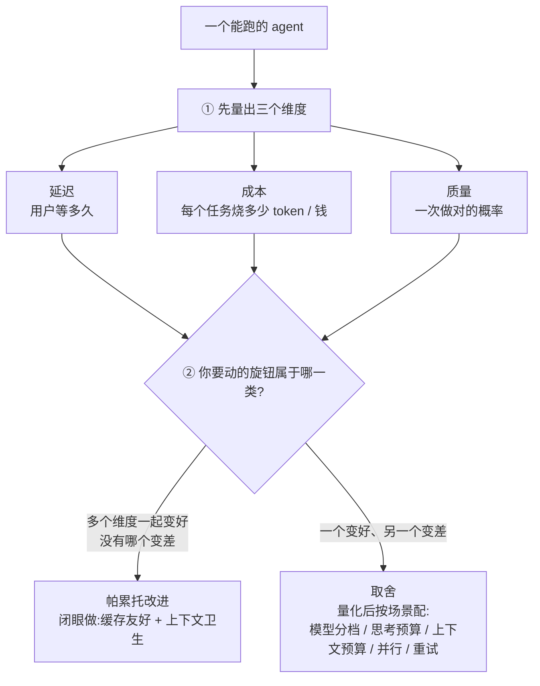
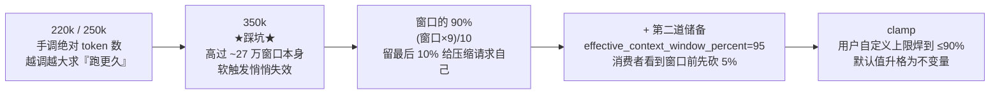
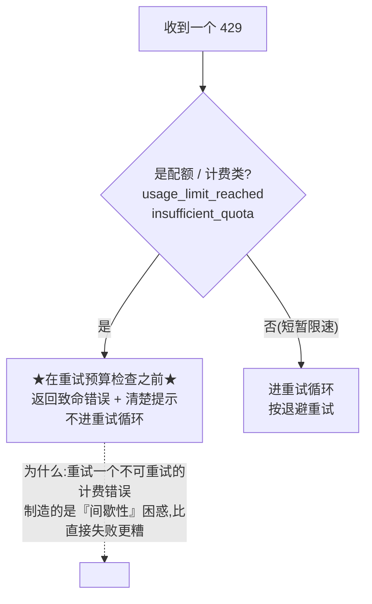
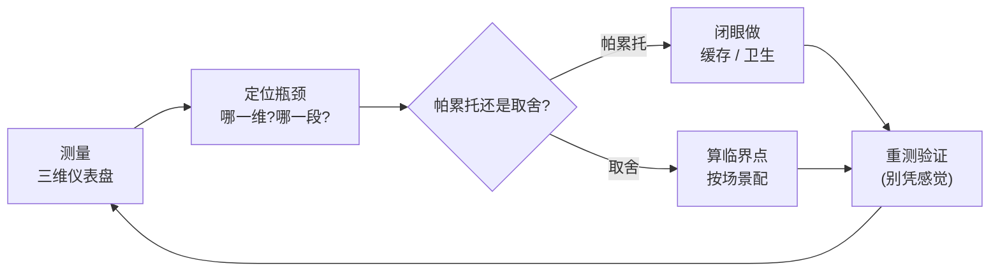

# 第 11 课：优化方法论 —— 从 codex 一年多的真实优化提交里提炼

> 面向 deepseek 自研的 agent runtime 设计课。基于 claude、codex、opencode 真实源码与 **git 提交历史**。
> 这一课和前十课不同：前十课拆子系统，这一课是横切的优化方法论。但它**不干讲框架**——而是翻 codex 这一年多、7000 多个提交里真刀真枪打过的优化仗（包括上线两天就回滚的决定），从开发者亲手记录的「把 X 从 A 改成 B、因为 Y」里提炼方法。
> 讲法承接前几课：正文不塞路径与 SHA，每个小节末尾用「源码与提交锚点」给可核验的提交号（可自己 `git show <SHA>` 复核）和文件行号；符号名只在它本身帮你记住概念时才出现，且一出现就当场解释。

---

## 0. 这一课在回答什么问题

前面十课，你已经能造出一个跑通任务的 agent。但「能跑」和「好用」之间隔着一大段：用户嫌慢、账单嫌贵、结果嫌不靠谱。这一课讲怎么有方法地把它调好。

先把主线定下来：

> **优化一个 agent = 在「延迟、成本、质量」三个维度上，先把它们量出来、定位瓶颈，再分清你要动的旋钮（可调的参数，下面统一叫旋钮）属于哪一类——是「白给的帕累托改进」（多个维度一起变好、没有哪个变差，经济学把这种叫帕累托改进），还是「此消彼长的取舍」（一个维度变好、另一个就变差）。前者闭眼做，后者必须量化之后按场景配置。**

这是骨架。但这一课最该记住的一点，是一句要反复敲的话：**agent 优化是实证的，不是显然的。** 这个领域到处反直觉——上下文给越多不一定越准、换便宜模型不一定更省、删掉思考过程不一定省钱、prewarm 不一定更快。怎么证明它反直觉？最硬的证据不是我说，是 **codex 开发者自己在提交历史里反复「试了、错了、改回来」**：一个为了省请求体积而删除跨轮推理的优化，上线**两天**就被回滚；一个把自动压缩阈值调大「让会话跑更久」的改动，结果悄悄把整个触发机制关掉了；一个为了降延迟的连接预热，反手把首回合挂起了**五分钟**。

所以下面六节，每一节都是一组**真实的优化战役**——带提交号、日期、和开发者写下的理由。读完你拿到的不是几条口号，是一套「这些坑别人替你踩过了」的清单。每个结论都能自己 `git show` 复核。

---

## 1. 缓存命中率：最隐蔽、最致命的战场

这一节回答一个问题：为什么缓存是帕累托改进里收益最高、却又最容易在你看不见的地方崩掉的那一个。

### 1.1 为什么缓存是头号帕累托支柱

缓存（前缀缓存，第 8、9 课讲过机制）是帕累托改进的头号支柱：命中的输入只要约 1/10 的价（claude 的定价表里，缓存读取单价恰好是普通输入的 0.1 倍），命中的前缀还不用重新预填（省延迟），模型看到的内容一字不差（质量不变）。三个维度——成本、延迟、质量——一起变好或不变，没有哪个变差，这就是帕累托改进的定义。

但它脆得吓人——**会从无数个非显而易见的地方悄悄崩掉，而且你不测就看不见。** codex 的提交历史几乎是一部「缓存命中率失而复得」的血泪史。

### 1.2 五场「缓存被悄悄打碎」的真实战役

下表每一行都是一个真实提交：左边是缓存怎么崩的，右边是怎么发现、怎么修的。读的时候盯一个共性——崩点全都是「某个会变的东西混进了本该不变的前缀」：

| 缓存被什么打碎的 | 怎么发现 / 怎么修 |
|---|---|
| **工具列表顺序每轮变** | MCP 工具存在哈希表里、迭代顺序不固定，导致工具顺序每轮变，**多轮会话的前缀缓存基本失效**。修法：发出去前按全限定名排序。开发者还算过账——「不至于有那么多 MCP 工具让排序成为性能问题」，所以选了轻量排序而非换有序结构 |
| **工具描述随运行时设置变** | 工具的描述文字会随沙箱策略、审批策略变；用户一按 `/approvals` 改审批，工具描述就变、整段缓存就炸。修法：工具定义恒定不变（统一一个带「提权参数」的 shell 工具），策略改在**调用时**强制，不进缓存前缀 |
| **工具描述里插了项目绝对路径**（opencode） | bash 工具描述里插了当前工作目录的绝对路径，于是**每换一个项目就全 miss**。修法：把动态路径从描述里抠掉、硬编码成「当前工作目录」。注意这个提交标题里写着「**again**」——这是个回归，动态值被重新泄进去了一次 |
| **历史布局随并行工具调用错乱** | 并行工具调用让「模型产出」和「工具结果」交错，前缀就长不成 append-only。修法：规范化布局——所有 `function_call`（模型产出）排在所有 `function_call_output`（新输入）之前，缓存才对得齐 |
| **一堆临时注入的小消息** | 模型切换、记忆、人格、AGENTS.md…… 各自往上下文里塞一条消息，形状不固定。修法：收成**至多一条 developer 信封 + 一条 contextual user 信封**，并且用规范注入重建、而不是「先剥离再贴回」那种缓存杀手 |

这些战役指向同一条铁律：**任何随会话、项目、策略、时间变化的东西混进静态前缀，都会悄悄打碎缓存。** 静态前缀必须逐字节稳定。

### 1.3 两个延伸点：派生路径复用键 + 命中率必须可观测

上表是「前缀本身被污染」这一类。还有两个被开发者反复栽进去的延伸点，性质不同——一个是「同一份前缀被错分成多份缓存」，一个是「崩了你根本不知道」。

#### 派生请求路径必须复用同一个缓存键

codex 给每次请求带一个稳定的缓存键（最早就是会话 id，一个三行的改动）。但**压缩**请求、**子 agent** 请求是另外的代码路径——压缩请求一度没带上主路径那个键，于是每次压缩都悄悄掉出主对话攒起来的缓存；子 agent 的 review 分叉本该共享缓存，却用了各自的线程 id 当键，导致本该命中的全 miss。修法：把缓存键做成一个可覆盖的函数，让本该共享缓存的分叉去哈希一个稳定身份（父线程 + 复用键），而不是各自的 id。

#### 缓存命中率必须被测量、被归因

claude 专门有一段逻辑在每轮之间比对缓存读取量：一旦比上一轮掉超过 5%、且绝对掉了超过 2000 个 token，就判定缓存断了、报警，还**归因**到底是系统提示、工具、模型、思考强度、还是单纯 TTL 过期把它打碎的。codex 则更早就把「前缀逐字节一致」钉进了集成测试。opencode 更进一步，把缓存断点的放置做成一个声明式策略对象（在工具尾、系统尾、最后一条用户消息处打断点），并硬编码了服务端的约束——**最多 4 个断点，超了静默丢弃**（多打一个服务端直接 400），TTL 按 ≥1 小时归到「1h 桶」否则默认 5 分钟。

### 1.4 落到 deepseek

缓存友好是 M0 就该闭眼做的帕累托改进，但要把上面这些坑当 checklist：① 任何进静态前缀的东西（系统提示、工具定义、scaffold）逐字节稳定，时间戳 / 项目路径 / 策略相关的字一律后置或抠掉；② 工具列表排序固定；③ 压缩、子 agent 等派生路径复用同一个缓存键；④ 像 claude 那样**盯命中率并能归因**——DeepSeek 响应里直接有 `prompt_cache_hit_tokens` / `prompt_cache_miss_tokens`，每轮比一比，掉了就查谁动了前缀。还有一个 opencode 提醒的部署层坑：如果你前面架了网关 / 代理，命中率还取决于**把同一会话路由到同一个缓存热的节点**（opencode 为此加了个 `X-Session-Id` 头做亲和路由）——前缀稳定只是必要条件，路由命中是另一半。

〔提交锚点（`git show <SHA>` 可复核）：codex——`ee2ccb5cb6` 2025-08-24 Fix cache hit rate by making MCP tools order deterministic、`a7fda70053` 2025-09-19 Use a unified shell tell to not break cache、`cfcc87a953` 2025-11-14 Order outputs before inputs、`07aefffb1f` 2026-02-26 bundle settings diff updates into one dev/user envelope、`6a6bf99e2c` 2025-08-11 Send prompt_cache_key、`5d6f23a27b` 2026-05-06 Propagate cache key and service tiers in compact、`3307240195` 2026-05-28 Use stable Guardian prompt cache keys、`d33793d31d` 2025-08-11 integration test prompt caching；opencode——`38014fe44` 2026-04-02 rm dynamic part from bash tool description again to restore cache hits、`942630eb4` 2026-05-10 cache-policy auto-placement、`77e6c0d32` 2026-05-10 cache hint TTL/breakpoint cap、`80c0b0698` 2026-06-10 X-Session-Id for proxy cache routing。源码锚点：codex 工具排序 `core/src/openai_tools.rs`、缓存键 `core/src/client.rs`；claude 缓存断裂检测 `services/api/promptCacheBreakDetection.ts:120`、定价表(读 0.1×) `utils/modelCost.ts:36-126`〕

---

## 2. reasoning：一个上线两天就回滚的优化

这一节回答一个问题：「删掉模型的思考过程能省钱」这条听起来天经地义的直觉，错在哪。它是「优化是实证、不是显然」的最佳活教材，也是「删 reasoning 省钱」这条反直觉的真实出处。

### 2.1 完整时间线：从无状态到删 reasoning 再到两天回滚

先看整条弧（每一步都在 codex 提交里）：

### 2.2 逐步拆这条弧

#### 第一步：无状态化逼出「加密思考」

codex 一度去掉了「让服务端记住上一条响应」（`previous_response_id`）那条路、改成每轮把整段历史重发（无状态）。代价是：服务端不替它存思考链了，它就得**自己把思考链带回去**——于是请求里要加密思考（`encrypted_content`）。明文思考是给人看的摘要，**加密块是给模型回放用的**。

#### 第二步：那个被回滚的优化

2025-10-28，开发者删掉了「上一轮以前的 reasoning」，理由写得很实在：「缩小请求体积，并防止跨 API 组织切换时的 400 错误」。听起来完全合理——少发点东西，省钱省麻烦。

#### 第三步：两天后回滚

2025-10-30，这个删除被整个撤掉。相邻的提交把方向写明白了：「我们正在研究**把 reasoning 在整段会话里保留下来，以提升性能和缓存**」。也就是说——**保留全部加密思考、跨轮回放**带来的缓存命中和推理连续性，价值压过了「请求小一点」。删它是错的，上线两天就改回来。

### 2.3 保留 reasoning 带来的两类后续坑

#### 一串 token 账本 bug

保留 reasoning 之后，服务端报的 token 数**不包含**这些被回放的加密思考块，于是自动压缩按错的数字算、压得太晚。修法：本地按字节长度估算这些加密块的 token、补进总账。

#### 思考参数是「模型能力」，乱发就报错

这是一类硬约束：给不支持推理的模型发 `reasoning.effort` 直接 400；保留加密思考后又必须**每轮都请求它**、否则下一个请求 500；思考摘要要关就得**省略字段**、不能发字面量 `"none"`（否则 400）。

### 2.4 收口与落到 deepseek

**收口。** 「删掉思考过程能省钱」是一条听起来天经地义、实则要命的直觉。codex 真的这么试了——两天就改回来了。教训有两层：一是**缓存和推理连续性的价值，常常压过「请求小一点」**；二是这正好坐实第 9、10 课那条——**删 reasoning 是正确性 / 配对要求，跟省钱、跟命中缓存没有因果**。

**落到 deepseek。** 这条直接对上你们架构宪法里的**条件式 reasoning 规则**（发起 tool_call 的 assistant 轮必须随 tool_result 回填它的 `reasoning_content`、跨已完成的普通 user 轮才可丢弃；真正的硬约束是配对 / 相邻性）——别图省事「一律删 reasoning」，那既不省缓存、又可能破坏配对。思考参数也照 codex 的教训处理：按模型能力发、要关就省略字段而非发 `"none"`。

〔提交锚点：codex——`591cb6149a` 2025-07-23 Always send entire request context(去 previous_response_id + 请求加密 COT)、`1b8f2543ac` 2025-10-28 Filter out reasoning items from previous turns、`a3d3719481` 2025-10-30 Remove last turn reasoning filtering(★两天后回滚★)、`e5e13479d0` 2025-11-03 Include reasoning tokens in the context window calculation(写明保留方向)、`b519267d05` 2025-11-21 Account for encrypted reasoning for auto compaction、`0f3cc8f842`/`414b8be8b6`/`0af7e4a195`(effort/summary 的 400/500 三连)。源码锚点：codex reasoning 装配 `core/src/client.rs:749-795`(include `reasoning.encrypted_content`)；权威 = deepseek 架构宪法 §1.4/§2.D2/§4、[[deepseek-desktop-project]]〕

---

## 3. 上下文预算：魔法数字如何熬成不变量

这一节回答一个问题：决定「攒多少历史才压缩」的那个阈值，应该是个写死的数字、还是别的什么。

### 3.1 为什么这是个倒 U 上选点的旋钮

上下文预算是一个在「先升后降」的倒 U 曲线上选点的旋钮：给太少漏信息、质量掉；给太多又贵又慢，还撞上「噪音淹没重点」的 context rot（这条曲线是大模型的经验性质，不是某行代码能证明的——但下面这堆提交全是工程师在跟它搏斗，这本身就是他们相信它的实证）。codex 的提交历史在这条曲线上选点选了一年多，从拍脑袋的魔法数字熬成了不变量。

### 3.2 阈值演化：220k → 250k → 350k（踩坑）→ 90%（讲理）→ clamp（焊死）

整条演化路线，从手调的绝对数一路走到一条用户也破坏不了的不变量：

逐档拆：

- 最早是每个模型一个手调的绝对 token 数：220k、250k，越调越大，想让会话「跑更久才压缩」。
- 然后调到了 **350k**——但那个模型的上下文窗口只有约 **27 万** token。350k 已经**高过窗口本身**，于是软触发永远先撞不到、等于被**悄悄关掉了**，会话直接撞硬墙。这是个典型「想当然把阈值调大」的反例。
- 修正：改成 **窗口的 90%**（`(窗口 × 9) / 10`）触发，理由写得很直白——「用户老是撞到窗口超限、又不知道该咋办」。为什么是 90%？**留最后 10% 给压缩本身**：压缩要发一个「请帮我总结历史」的模型请求，那个请求自己也得装得下。而且还有**第二道储备**——`effective_context_window_percent = 95`，在消费者看到窗口之前先砍掉 5%，留给系统提示、工具开销、模型输出。
- 焊死：后来又把「用户自定义的压缩上限」**clamp 到不超过 90%**，让「90%」从一个默认值变成一条用户也破坏不了的不变量——堵死前面那个「设过窗口就失效」的坑再次发生。

### 3.3 工具输出截断：截哪段、覆盖哪条路径

工具输出是上下文里最容易失控的噪音源，截断是控体积的主力。但这里有两个坑。

#### 为什么截中间，不截尾

codex 的提交把「为什么截中间」的理由白纸黑字写了出来：**「命令输出的重要信息常在开头或结尾，所以截中间。」** 开头是意图 / 表头，结尾是结果 / 错误，中间才是可丢的冗余。（claude 的选择不同——它截尾、保开头，赌的是输出开头信息密度高；两家都对，但都**显式标注**截了多少。）

#### 截断只防得住你覆盖到的路径

有个提交修的是「76% 上下文还剩着、却报 input exceeded context window，很奇怪」——原因是**错误路径和超时路径的输出绕过了截断**，一条没截的巨型 stderr 就把窗口撑爆了。教训：**一个截断策略，强度等于它覆盖最差的那条路径**；漏一条就全功尽弃。（截断的预算单位后来也从字节迁到了 token，并按模型族走不同的分词。）

### 3.4 四个「少算了占窗口的东西」的账本 bug

自动压缩靠「现在用了多少 token」决定何时触发，所以**少算就压得太晚、然后撞墙**。codex 修过的一串：① mid-turn 不该减掉 reasoning 输出 token（它确实占着窗口）；② 服务端的 token 总数不含被回放的加密思考块，得本地按字节估；③ 上一次响应之后本地又追加的消息（用户输入、注入上下文、工具结果）服务端不知道，得估进去；④ 图片的 token 一度被低估 **20 倍**（按一个偏小的字节估算），让图多的会话压得太晚还压不动。共同教训：**API 报的 token 是「上一次响应那一刻」的快照，之后本地长出来的、以及加密思考 / 图片这些 API 不计的，全得自己补估**。（顺带：给用户**显示**的 token 数要用「混合数」——排除命中缓存的输入，因为那部分不收钱、是实现细节，算进去会虚高。）

### 3.5 把旋钮交给模型自己（codex 的新做法）

与其全靠系统在固定阈值上自动压，codex 在 2026 年中给模型加了三样：① 用量首次越过 **25% / 50% / 75%** 时**边沿触发**地告诉模型「还剩多少预算」（只在跨档时发、不每轮重复，省钱又不破缓存）；② 一个 `get_context_remaining` 工具让模型主动问「我还剩多少」；③ 一个 `new_context` 工具——模型觉得当前上下文没用了，可以请求**重开一个干净上下文、不花钱写摘要**（比压缩更便宜的硬重置）。还有一个针对「保留前缀导致反复压缩」的修法：当你跨压缩保留一段前缀，预算要按「这一压缩窗口内新长出来的量」算（`body_after_prefix` 基线），否则被保留的大前缀本身就吃满预算、刚压完又触发、来回抖。

### 3.6 落到 deepseek

① 压缩阈值用百分比、不用绝对数，并留两道储备（给压缩请求本身 + 给系统/输出开销），还要 clamp 成不变量；② 工具输出截断，截中间或截尾都行但**必须覆盖到错误 / 超时路径**、且标注原始大小；③ token 账本要把「API 没算的」（本地追加项、加密思考、图片）补估进去，否则压得太晚；④ 显示用混合数；⑤ 把「还剩多少 / 主动重开」做成模型可调的旋钮可以放到 M1+，但「系统自动压 + 两道储备」M0 就得有。opencode 这边也印证：它给压缩留了 `COMPACTION_BUFFER = 20000` 的储备 token，并把超大工具输出**落盘 + 只回预览**（默认 2000 行 / 51200 字节封顶）——后者是比纯截断更优雅的一招，full 内容可回取、上下文还小，值得抄。

〔提交锚点：codex——`db4aa6f916` 2025-09-24 nit: 350k tokens(超窗口踩坑)、`049a61bcfc` 2025-10-20 Auto compact at ~90%(90% + effective_context_window_percent:95)、`40de788c4d` 2026-02-11 Clamp auto-compact limit to context window、`9d8d7d8704` 2025-08-11 Middle-truncate tool output(写明为什么截中间)、`d7acd146fb` 2025-10-04 fix: exec commands that blows up context window(76% 却 overflow)、`3de8790714` 2025-11-18 truncate by tokens、`e5e13479d0`/`b519267d05`/`0883e5d3e5`/`8da40c9251`(四个 token 账本 bug)、`f86d95a242` 2026-05-08 Display blended token count、`80fdd4688f` 2026-05-19 body_after_prefix scope、`658af936fd`(25/50/75 阈值)/`87ab01834a`(new_context)/`dac5f07403`(get_context_remaining) 2026-06；opencode——`0fd6f365b` 2026-02-10 reserve token buffer、`f8c6ddd4c` 2026-04-23 配置化截断 + 落盘预览。源码锚点：codex 阈值 `core/src/openai_model_info.rs`、`model_family.rs`(effective_context_window_percent)、截断 `core/src/truncate.rs`；claude 自动压缩=有效窗口−1.3 万 `services/compact/autoCompact.ts:62`〕

---

## 4. 延迟：审计关键路径，别让优化变回归

这一节回答一个问题：用户嫌「慢」时，到底该往哪儿下手——以及为什么有些「明显能加速」的优化反而把延迟搞回去了。

### 4.1 方法论一句话：逐段审计，搬走不成比例慢的那段

延迟优化的方法论是一句话：**逐段审计关键路径，找出那一段不成比例地慢的，把它搬走。** codex 的提交给了几个极具体的样本，下面分四类看。

### 4.2 把非必需的同步调用挪到后台

**一个非必需的同步调用，吃掉了全部延迟。** TUI 启动时同步去拉「账号限流信息」，结果发现：**这一个调用加了约 670 毫秒的阻塞延迟，而其它三个 RPC（读账号、列模型、起线程）加起来不到 70 毫秒**——而限流信息根本不是渲染首屏所必需的。修法：改成后台异步拉、先把界面起起来，状态栏的限流数字晚个几百毫秒再补上。**一个非关键的同步调用（670ms）能盖过其它所有（70ms）的总和**——这就是为什么要逐个 RPC 审计、而不是笼统说「启动慢」。

### 4.3 优化反手变成回归：预热挂五分钟的那条弧

为了降首回合延迟，codex 加了「连接预热」：会话一启动就在后台把到服务端的连接握手做好，但**只握手、绝不提前发 prompt**（保住回合语义）。思路很对。但这个预热**会卡住**——有一版里，预热一旦卡住，`initialize → thread/start → turn/start` 整条会**干等预热长达五分钟**，客户端连「回合开始了」都收不到、连「中断」都按不动。修法：给预热加超时上限、一旦卡住就立刻发「回合已开始」、不再傻等。**这就是「prewarm 总是好的」这条直觉的反例——预热本身要做成尽力而为、超时兜底、永不阻塞主流程。**

### 4.4 渲染热路径上的同步读，在繁忙时变成冻屏

TUI 渲染每条线程通知前要同步去读线程元数据；可一旦在**大规模子 agent 扇出**时，那个被查询的内嵌服务端正忙着起 agent，这些同步读就排在扇出后面、堵死渲染事件循环——**界面看着像死了，其实底下的 agent 还在跑**。修法：本地缓存、惰性补元数据，挪出热路径。教训：**一个同步读，当它查询的服务端正被「它要渲染的那批工作」占满时，就会变成冻屏**。

### 4.5 并行工具：能力只是一半，教会模型用是另一半

codex 加了「单回合内多工具并行」的能力（可并行的工具走并发、遇到会改东西的工具就拉一道串行屏障）。但光有能力没用——开启并行时，它**专门给模型加了一段指令**教它什么时候并行才安全，原话是：「**只有当你真的不看上一个结果就无法知道下一个文件时，才做串行调用。**」否则模型要么不敢并行、要么把有依赖的读错误地并行了。还有个坑：一个新的 web 搜索工具因为**继承了「默认串行」**、悄悄拿了独占锁，把本可并行的搜索串行化了——**每个新工具都得显式重新声明「我可并行」，否则默认就把并行抵消了**。

### 4.6 先遥测，再优化

codex 有个提交专门加「启动各阶段 + 首 token 延迟」的生产遥测，理由一针见血：**「有用的问题不是『启动慢不慢』，而是『生产里到底哪个阶段慢』。」** 你优化的是遥测能暴露的那一段，不是你猜的那一段。

### 4.7 落到 deepseek

① 启动 / 首回合逐段计时，把非必需的同步调用（拉配额、拉元数据）一律挪到后台、接受首屏短暂不全；② 连接预热可以做，但必须超时兜底、绝不阻塞回合；③ 并行工具是降延迟的大杠杆，但要把「可并行」做成每个工具显式声明的属性（默认串行）、并在 prompt 里教模型「独立的读才并行」；④ 先把延迟的阶段遥测建起来，再动手。claude 这边的对照：工具并发上限 10、读并行写串行；首 token 延迟（TTFT）每次重试都重置以测真实模型延迟——这些现成做法可直接抄。

〔提交锚点：codex——`359e17a852` 2026-04-07 reduce startup and new-session latency(670ms vs <70ms)、`e416e578bb` 2026-02-06 preconnect Responses websocket(只握手不发 prompt)、`6ea041032b` 2026-03-17 prevent hanging turn/start due to websocket warming(★预热挂五分钟★)、`90c0bec50c` 2026-05-09 Avoid blocking TUI on agent metadata hydration(扇出冻屏)、`dc3c6bf62a` 2025-10-05 parallel tool calls、`f5d9939cda` 2025-11-18 enable parallel tool calls(配 `core/templates/parallel/instructions.md` 教模型何时并行)、`b3c4157034` 2026-06-01 enable parallel standalone web search(串行默认抵消并行)、`e15ecc9c35` 2026-05-11 startup and TTFT telemetry；opencode——`7dd2306da` 2026-06-02 improve startup time by 38%(惰性动态 import)。源码锚点：codex 预热 `core/src/client.rs`、并行 `core/src/tools/parallel.rs`；claude 工具并发上限 10 `services/tools/toolOrchestration.ts:8-12`、TTFT `services/api/claude.ts:1789`〕

---

## 5. 重试：同一个状态码、相反的处理，别自己造重试风暴

这一节回答一个问题：什么时候该重试、什么时候重试本身就是 bug——以及怎么不让自己的重试逻辑把服务器锤垮。

### 5.1 为什么重试是把双刃剑

重试提升稳健性，但每次都多花钱、加延迟，过猛还会**雪崩**。codex 的重试提交集中体现了几条非显然的判断，下面分四条看。

### 5.2 同一个 429，两种相反的处理

限流返回 429，但它是双模态的：一种是「请慢点」（短暂限速 → 该重试），另一种是「你额度到顶了」（配额 / 计费问题 → 重试一万次也没用）。codex 的关键决定是：把配额类 429（`usage_limit_reached`、`insufficient_quota`）**在重试预算检查之前就返回成致命错误**，不进重试循环。

为什么这么分？提交写得很实在——「我们收到多份用户报告说**重试行为时好时坏、很迷惑**，这个改动能解释其中一些；干脆消除重试、给一条清楚的错误」。**重试一个本就不可重试的计费错误，比直接失败更糟——它制造的是「间歇性」的困惑。**

### 5.3 服务端给的延时，永远压过你自己算的退避

codex 的重试退避是 200 毫秒起、每次翻倍、加抖动（0.9~1.1 倍）。但核心那行逻辑是：**「如果服务端给了重试延时，就用它；没给，才用自己算的退避。」** 服务端比你更知道该等多久。它甚至在服务端「没有结构化延时字段」时，从错误消息里**正则抠出**「Please try again in Xs」来用——宁可抠字符串，也要听服务端的。

### 5.4 别给自己留出造风暴的余地

重试次数允许用户配（默认请求 4 次、流 5 次），但**加了硬上限 100**，理由直白：「不设上限的话，用户理论上能配一个近乎无限的重试数、把服务器锤爆。」更细的一招：**昂贵的操作给更小的重试预算**——压缩请求跑得比普通回合久得多，所以它的重试预算被砍成 `min(流重试数, 2)`，免得一个失败的昂贵调用把成本翻几倍。

### 5.5 传输降级不是放弃，是第二个预算

WebSocket 可能被代理挡住而 HTTPS 能通。所以 codex 在「WS 重试预算耗尽」时不是失败，而是**切到 HTTPS、并把重试计数清零重来**；服务端还能用一个 HTTP 426 状态**主动命令**客户端立刻降级（不烧重试预算）；而第一次 WS 重连是**静默**的（快速重连本就正常，不该惊动用户）。

### 5.6 落到 deepseek

① 429 分两类——配额类做成致命错误、在进重试循环前就返回、给清楚提示，别傻重试；② 服务端给的重试延时优先于自己算的退避；③ 用户可配的重试数也要有硬上限，昂贵操作（压缩、长 review）给更小的重试预算；④ 退避用指数 + 抖动。claude 这边的对照值得一并抄：它默认重试 10 次，但**只有前台请求**（用户正等着的）才在过载时重试、**后台辅助请求一过载就立刻放弃**——因为容量雪崩时每次重试是 3~10 倍的放大，让后台先让路。opencode 还补一条：**5xx 即使 SDK 没标「可重试」也要重试**（别盲信 SDK 的 flag），但上下文溢出错误永不重试。

〔提交锚点：codex——`62ed5907f9` 2025-08-07 Better usage errors(usage_limit_reached → 致命、退避前返回)、`0c647bc566` 2025-11-06 Don't retry insufficient_quota errors(「间歇性」困惑)、`41eb59a07d` 2025-08-13 Wait for requested delay(从消息正则抠延时)、`d32e4f25cf` 2025-08-25 caps on retry config(硬上限 100、默认 4/5)、`3b1cddf001` 2026-01-29 Fall back to http when websockets fail、`6d08298f4e` 2026-02-08 Fallback on UPGRADE_REQUIRED(HTTP 426)、`d391f3e2f9` 2026-02-11 Hide first websocket retry、`dac98cb635` 2026-05-22 retry remote compaction(min(stream,2))、`04a8580f33` 2026-05-26 centralize Responses retry policy(server-delay 优先那行)；opencode——`4ca809ef4` 2026-04-15 retry 5xx even when isRetryable unset。源码锚点：codex 退避 `core/src/util.rs`(200ms·2^n、抖动 0.9~1.1)、重试策略 `core/src/responses_retry.rs`、上限 `core/src/model_provider_info.rs`；claude 仅前台重试 529 `services/api/withRetry.ts:57-82`〕

---

## 6. 把战役串成方法论 + 想当然清单

这一节回答一个问题：把前五节的零散战役收成一个可重复的流程，应该长什么样——以及把所有教训压成一张能贴在显示器边上的清单。

### 6.1 优化循环：测量 → 定位 → 分类 → 验证

有了三维仪表盘和两类旋钮，优化就是一个可重复的循环：

循环里最容易跳过、也最致命的是**「重测验证」**——下面那张清单的每一条，都是有人跳过这一步才栽进去的。

### 6.2 想当然清单：每条都有真实出处

这张「想当然清单」是这一课的高光——每一条都不是我说的，是 **codex 自己在提交历史里栽过、又爬出来**的：

| 想当然 | 真实出处（codex 提交） |
|---|---|
| 删掉思考过程能省钱 | 试了，**两天就回滚**——缓存 + 推理连续性压过请求体积（`a3d3719481`） |
| 工具集顺序无所谓 | 哈希表顺序每轮变，**多轮缓存基本失效**（`ee2ccb5cb6`） |
| 把阈值调大能让会话跑更久 | 调到超过窗口本身，**软触发被悄悄关掉**、直接撞硬墙（`db4aa6f916`） |
| 连接预热总是好的 | 预热卡住把首回合**挂了五分钟**（`6ea041032b`） |
| 重试越多越稳 | 重试不可重试的计费错误 = 用户报「**间歇性**」困惑（`0c647bc566`）；无上限 = **自己锤爆服务器**（`d32e4f25cf`） |
| 新工具自动享受并行 | 继承「默认串行」，**悄悄把并行抵消**（`b3c4157034`） |
| API 报的 token 就是真实占用 | 漏算加密思考 / 本地追加项 / 图片，**压缩太晚再撞墙**（一串账本 bug） |
| 上下文给越多越准 | 倒 U / context rot——所以 codex 反而给模型加了「问还剩多少 + 主动重开」的旋钮去**管住**它 |

### 6.3 量化思维：取舍旋钮用真实价算，别争感觉

遇到取舍旋钮，别争「感觉哪个好」，用真实价算。DeepSeek 的价（每 1M token，已核：flash 命中 \$0.0028 / 未命中 \$0.14；pro 命中 \$0.003625 / 未命中 \$0.435）能把缓存这件事的分量算到吓人：

- **同一段历史、同一个模型，只因缓存热不热**——50 万 input token，全命中 vs 全未命中：flash 是 \$0.0014 vs \$0.07（**50 倍**），pro 是 \$0.0018 vs \$0.218（**120 倍**）。这就是为什么第 1 节那些「工具顺序、策略变动、一个路径字符串」打碎缓存的 bug，每一个都是在烧 50~120 倍的钱——而且**不测命中率你根本看不见它在烧**。
- **会话内为 review 升档到 pro**：一个 10 万 token 上下文的 review 回合，中途切到 pro 且全未命中 = \$0.0435；留在 flash 且命中本是 \$0.00028——**单这一轮贵约 155 倍**，还没算主缓存在这十几分钟里过期。所以「升档值不值」量化后变成一句可判断的话：这一段质量提升，值不值这 155 倍差价。

---

## 7. 落到 deepseek：一张优化路线图

把六场战役的可抄项收成排期，原则是——**帕累托改进从第一天闭眼做，取舍旋钮先建测量再按场景配。**

1. **M0 闭眼做的帕累托改进。** ① 缓存友好的 prompt 布局：静态前缀逐字节稳定、工具列表排序固定、会变的全后置（把第 1 节那张「缓存被什么打碎」的表当 checklist）；② 上下文卫生：工具输出截断（覆盖错误 / 超时路径、标注大小，或学 opencode 落盘+预览）、脏活外包子 agent 只回结论。
2. **测量底座第一天就建。** token 账本拆开记（命中 / 未命中 / 输出 / reasoning，DeepSeek 现成有 `prompt_cache_hit_tokens` / `prompt_cache_miss_tokens`）+ 每轮盯缓存命中率并能归因（学 claude 的断裂检测）+ 启动 / TTFT 的阶段遥测（学 codex「问哪个 bucket 慢」）。**不测就只能拍脑袋。**
3. **取舍旋钮按场景配。** flash 默认 / pro 升档给 review；思考用 `thinking` 开关按难度，但 reasoning 多轮走宪法的**条件式规则**（配对 / 相邻性，别一律删）；会话内别乱换档（120 倍缓存陷阱），要换走 fork。
4. **上下文预算两道储备 + 把旋钮逐步交给模型。** 压缩阈值用百分比、留给「压缩请求本身 + 系统开销」两道储备、clamp 成不变量；token 账本补估「API 没算的」；M1+ 再给模型「问还剩多少 + 主动重开」的工具。
5. **重试分类 + 防风暴。** 配额类 429 做成致命、不进重试；服务端延时优先；用户可配也要硬上限、昂贵操作更小预算；后台请求过载先让路。
6. **一条总纲（也是整课收口）：优化是实证的，不是显然的。** 每动一个旋钮，先问它是帕累托还是取舍，动完一定回仪表盘重测——因为这个领域，连 codex 自己都常常试了、错了、改回来。你的优势是：**这些坑，他们的提交历史已经替你踩过、记下来了。**

---

## 跨课接缝

- **第 3 课（上下文压缩）**：本课 §3 的阈值演化、两道储备、token 账本 bug，是第 3 课那套压缩机制背后的「为什么是这些数字」。
- **第 7 课（多 agent）**：本课 §1 子 agent 的缓存键共享、§4 扇出冻屏、§3 子 agent 只回结论省上下文，都是第 7 课多 agent 的优化面。
- **第 8 课（指令架构）**：本课 §1 的「静态前缀逐字节稳定、一条 dev + 一条 user 信封」，就是第 8 课静态 / 动态划分的优化动机。
- **第 9 课（模型 / API 层）**：本课 §2 reasoning、§5 重试经济学、成本测量的 token 账本，都在第 9 课那层兑现。
- **第 10 课（可扩展性）**：本课 §1 工具描述随策略变炸缓存，正是第 10 课「扩展点喂进前缀的东西必须稳定」的代价案例。

---

## 速查表：六场战役一张表

| 战场 | codex 提交历史教的（真实出处） | claude 现状对照 | deepseek 取向 |
|---|---|---|---|
| 缓存命中率 | 工具顺序 / 策略 / 路径 / 注入消息任一变就炸缓存（`ee2ccb5cb6`/`a7fda70053`/`07aefffb1f`）；派生路径复用同一键 | 缓存断裂检测 + 归因；读价 0.1× | 静态前缀逐字节稳、排序固定、盯命中率 |
| reasoning | 删跨轮 reasoning **两天回滚**（`a3d3719481`）——缓存+连续性压过请求体积 | —— | 走宪法条件式规则，别一律删 |
| 上下文预算 | 阈值 220k→350k（超窗口失效）→90%+95%两储备→clamp(`db4aa6f916`/`049a61bcfc`)；截中间；账本补估 | 撑到约 16.7 万才压；超大结果落盘 | 百分比阈值+两储备+clamp；账本补估；显示用混合数 |
| 延迟 | 670ms 阻塞调用挪后台；预热挂五分钟→超时兜底；并行要教模型+显式声明（`359e17a852`/`6ea041032b`/`b3c4157034`） | 工具并发 10、读并行写串行；TTFT 重置 | 逐段遥测；预热超时兜底；并行默认串行+教模型 |
| 重试 | 配额 429 致命不重试；服务端延时优先；硬上限+昂贵操作更小预算（`0c647bc566`/`d32e4f25cf`/`04a8580f33`） | 默认 10、仅前台重试 529 | 配额类致命；延时优先；硬上限+分级预算 |
| 方法论 | 想当然清单每条都有真实出处；先遥测再优化 | 测量细、客户端算钱 | 帕累托闭眼做、取舍按场景算、**拧完必重测** |

〔说明：本课所有提交号均可在 `/Users/bytedance/Mine/Agent/Best/codex`(HEAD 5670360009)与 `/Users/bytedance/Mine/Agent/Best/opencode`(HEAD 355a0bcf5)用 `git show <SHA>` 复核；各战役的提交锚点与源码锚点见对应小节末尾。DeepSeek 定价 / 缓存字段以官方文档为准，见 [[deepseek-desktop-project]] 与第 9、10 课。〕
