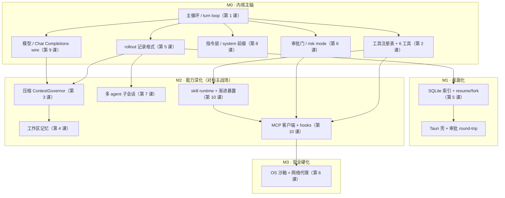
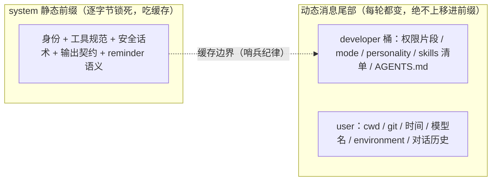
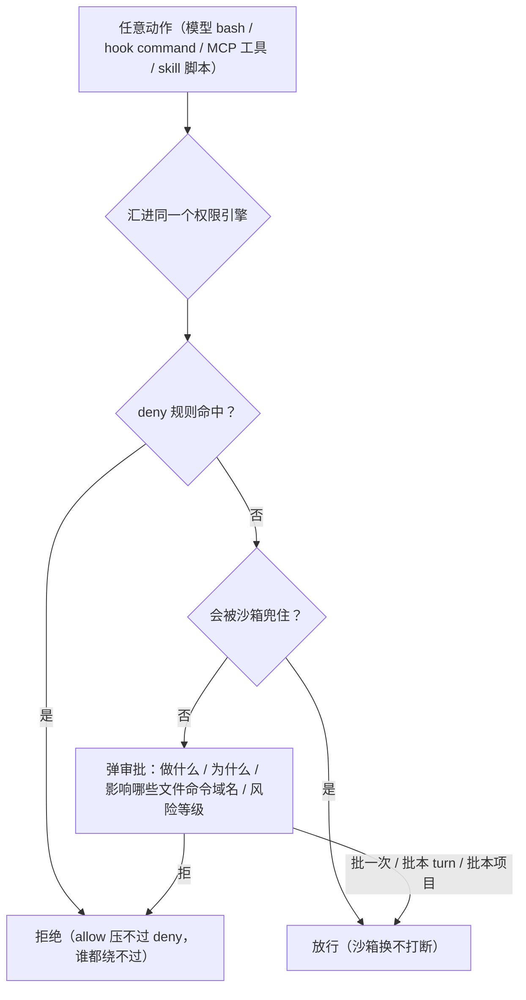

# 第 12 课：把十一个子系统装成一台 agent（capstone）

> 面向 deepseek 自研的 agent runtime 设计课。基于 claude、codex 真实源码（前十一课）与你们自己的**架构宪法**（`deepseek/docs/architecture/`，唯一真相源）。
> 这一课不再新增子系统。它干一件别的事：把前十一课各自落下的那个 deepseek 结论**装在一起**，看会冒出什么单看一课永远看不见的东西。
> 讲法承接前几课：正文不塞路径与条款号，每个小节末尾用「依据」行给可核验的宪法条款（`§X.Y` / `annex-A A.Z`）和对应课号；自创的词一出现就当场说清它指什么。

---

## 0. 这一课在回答什么问题

前面十一课，你已经能逐个讲清一台 agent 的每一个零件：主循环（第 1 课）、工具（第 2 课）、上下文压缩（第 3 课）、记忆（第 4 课）、持久化（第 5 课）、权限沙箱（第 6 课）、多 agent（第 7 课）、指令架构（第 8 课）、模型 / API 层（第 9 课）、可扩展性（第 10 课）、优化方法论（第 11 课）。每一课结尾都给了 deepseek 一个落地结论。

但**一台能用的 agent，不是这十一个结论的并集**。把它们装到一起，会逼出三样单看一课永远看不见的东西——这一课就讲这三样：

1. **装配顺序**：谁依赖谁，决定了什么先建、什么后建。注意，这个顺序**不是按「哪个零件重要」排的，是按「哪个零件的地基已经到位」排的**——这两者经常给出相反的答案，下面第 1 节会拿一个真实的矛盾点（MCP 客户端）把这件事钉死。
2. **横切不变量**：一条规则，同时约束好几个子系统，必须**全局一致**。所谓「不变量（invariant）」，就是不管系统跑到哪一步、装了多少东西，它都必须恒成立的一条约束。它的麻烦在于：错一处，往往崩在很远的另一处，极难定位。
3. **早决定、贵反悔的旋钮**：这里「旋钮」指一个你能拍板的设计选择。有一类旋钮，用它的人要到 M1 / M2 才出现，但它的格式 / 边界**必须在 M0 就拧死**——因为等用户的会话、数据、插件铺开了再改，代价是一次全量迁移。

把这三样从前十一课的结论里推出来、对着你们的架构宪法核一遍、合成一张能交付的总装图——就是这一课。

先把全课的主线钉死，它是一张**依赖图**（有向无环图，DAG：节点是子系统，箭头是「A 依赖 B」，没有环）。后面每一节都在这张图上做文章：

> 第 11 课（优化）不在这张图上——它不是一个子系统，是一条横切所有子系统的纪律。它出现在第 2 节的最后一条不变量里。

〔依据：宪法 §3.1 分层总览、§3.2 crate 地图、§7 路线图；第 1–11 课。〕

---

## 1. 装配顺序：依赖决定排期，重要性不决定排期

一台 agent 的子系统排进哪个里程碑，由四种力**叠加**决定，不是单看哪个重要：

| 力 | 一句话 | 它把什么往前推 / 往后压 |
|---|---|---|
| **依赖** | 地基没到位就建不起来 | 把「上游」往前压：被很多东西依赖的，必须早 |
| **风险不可延** | 有些洞不能带着上线 | 把「安全底线」往前压：哪怕实现晚，门也得早 |
| **杠杆** | 同样工作量，回报最高的先做 | 在「依赖允许的范围内」决定先后 |
| **可逆性** | 改起来贵的，早定死 | 把「格式 / 边界类旋钮」往前压：用它的人晚，定它要早 |

你们的宪法自己用一句话给出了这个顺序（§7 路线图的原则）：**先把「协议 + 内核 + Chat Completions wire」这条主轴打通 → 再桌面化 → 再深化能力（对标主战场）→ 再安全硬化 → 最后强用户打磨**。落到里程碑就是 M0 内核 → M1 桌面 → M2 能力 → M3 安全 → M4 打磨。

这一句不是拍脑袋，它就是上面那张 DAG 的拓扑排序，叠上后三种力。逐个对一遍：

| 子系统（课） | 它依赖谁 | 排哪里 | 主导的力 |
|---|---|---|---|
| 主循环（第 1 课） | 无（DAG 的根） | M0 | 依赖 |
| 模型 / wire（第 9 课） | 主循环 | M0 | 依赖（loop 没东西可调就跑不起来） |
| 工具 + apply_patch（第 2 课） | 主循环 | M0 | 依赖 |
| 指令层 / system 前缀（第 8 课） | 主循环 | M0 | 依赖 + 可逆性（缓存边界要早定，见第 3 节） |
| rollout 记录格式（第 5 课） | 主循环 | M0 | **可逆性**（用它的人晚，格式要早定死） |
| 审批门 / risk mode（第 6 课） | 工具 | M0 | **风险不可延**（无门就跑 shell 不能上线） |
| SQLite 索引 + resume/fork（第 5 课） | rollout 格式 | M1 | 依赖（索引是 rollout 的派生） |
| 压缩（第 3 课） | rollout + 模型层 | M2 | 依赖（压缩自身是一次模型调用） |
| 工作区记忆（第 4 课） | rollout + 压缩 | M2 | 依赖 |
| 多 agent（第 7 课） | 主循环 + rollout（fork） | M2 | 依赖 + 杠杆（复用稳定的 loop） |
| skill / 渐进暴露（第 10 课） | 工具 + 工具数量增长 | M2 | 依赖 |
| MCP 客户端 / hooks（第 10 课） | 工具 + 审批门 + 渐进暴露 | **M2** | 依赖（见下） |
| OS 沙箱（第 6 课纵深） | 扩展放开了外部执行 | M3 | 风险（需求被前面的能力挣出来） |

### 这一节最该记住的一点：杠杆高 ≠ 排得早

这一节最该记住的反直觉点，正好被两个真实的排期张力照亮。第一个讲「杠杆最高的能力，反而被地基压晚」，第二个讲「一个能力的门和它的完整实现，可以排在不同里程碑」。

#### 案例一：MCP —— 杠杆最高，却被地基压到 M2

**MCP 是四个扩展接缝里最划算的一个**：自己几乎一行不写，接上就白嫖整个生态的现成工具（第 10 课）。从「杠杆」这一种力看，它该尽早做——一个只算回报的排期，会把它直接放进 M0 / M1。

**但你们的宪法把 `ds-mcp` 锁在 M2**。为什么？因为：

- MCP 一接进来，工具数会被推高到必须先有**渐进式工具暴露**才压得住 prompt——而渐进暴露本身也是 M2 能力（门槛约 40 个工具时触发）；
- MCP 的 HTTP 传输又依赖 **M3 的本地网络代理**才能安全出网。

也就是说：**杠杆决定一件事该不该做，依赖决定它什么时候才能做。** MCP 的杠杆很高（该做），但它的地基（渐进暴露 + 网络代理）要到 M2 / M3 才齐（现在做不了）。两种力别混。

**结论：MCP 客户端排 M2**，和 skill 同档。把它单拎出来当例子，是因为它把「杠杆高 ≠ 排得早」摆得最锋利——只盯回报，就会把一个**地基还没到、根本建不起来**的能力排进 M0。这也是 capstone 这道「装到一起、对着宪法核一遍」工序的意义：单看一课容易只算到杠杆，整合时才照得出真正的依赖。

#### 案例二：安全沙箱 —— 「门」和「完整实现」可以排在不同里程碑

这条道理还有另一面：**安全沙箱排在很晚的 M3，但这绝不等于「M0 不管安全」。** M0 有一层应用层 **risk mode**，它做这五件事：

- canonical-path 路径收束（把符号链接等解析成真实路径，挡住越界写）；
- `.git` 只读；
- bash `env_clear()` + 环境变量白名单；
- timeout + 输出 cap；
- secret 脱敏。

但 risk mode 被宪法明确写成**不是安全边界**，只是 OS 沙箱到位前的最小防护。这里有两种力在分头拉：是「风险不可延」让**审批门**必须 M0（你不能发一个无门就跑 shell 的 agent），同时是「这是大工程、且 risk mode 能兜底到那时」让**真隔离**可以等到 M3。一个能力的「门」和它的「完整实现」可以排在不同里程碑——这是排期里最容易拍错的地方。

〔依据：宪法 §7（排序原则）、§4.10（MCP=M2）、§4.2（渐进暴露=M2、阈值约 40）、§4.4 / §2.G2（M0=risk mode 非安全边界、沙箱 M3）、§3.2 crate 里程碑；第 10 课（MCP 落点）、第 6 课（审批 vs 沙箱）。〕

---

## 2. 横切不变量：一个决定，锁死好几个子系统

前十一课每课只盯自己那一面。装到一起，有五条规则横穿多课、必须全局一致。这一节是全课最核心的部分：每条不变量给四样东西——规则一句话、它穿过哪几课、错了会怎样（尽量给真实事故）、deepseek 怎么落。

### 不变量一：缓存前缀确定性

**规则**：发给模型的请求，**静态前缀必须逐字节稳定**；任何会话动态信息（cwd、git 状态、时间、模型名、sandbox 状态、AGENTS.md、skills 清单）**绝不进静态前缀**，一律下沉到独立的动态消息；派生出来的上下文（压缩后的、子 agent fork 出来的）必须复用同一条缓存键。

**穿过**：工具装配顺序（第 2 课，工具表的字节顺序要稳）、prompt 装配（第 8 课，静态 / 动态分层）、压缩（第 3 课，压缩完别把缓存键换了）、模型层（第 9 课，缓存命中靠它读 usage 算账）、多 agent（第 7 课，fork 出去的子会话别另起一套前缀）。

**错了会怎样**：第 11 课讲过 codex 的真实事故——MCP 工具一度存在哈希表里、**顺序每轮都变**，导致多轮缓存基本失效，按名排序才修好。一个看不见的非确定性渗进前缀，就能让全局缓存命中率塌掉。

**deepseek 怎么落**：宪法把这条定成 **F2 的 MUST**——身份 / 工具规范 / 安全话术 / 输出契约进 system 静态前缀，会话变量进静态前缀**就算漂移**；再配一道「**cache-break 回归守卫**」：哈希一段稳定前缀输入、在响应后比对 cache-hit token 的跌幅，一旦 F2 被违反（会话变量泄进前缀）就触发测试 / 遥测告警。这里有一个 deepseek 专属的**简化**值得记牢：**不要抄 claude 那套「手工摆放 `cache_control` 断点」的工程**——DeepSeek 服务端是自动前缀缓存，那套断点机制对你们 N/A，不算缺口。所以在 deepseek 这边，「缓存稳定」= 纯粹的**前缀纪律**（别污染前缀），而不是「断点摆得好不好」。

〔依据：宪法 §2.F2（稳定前缀 MUST）、§2.D3（删客户端缓存打点、不做 claude 断点工程）、§4.5（cache-break 回归守卫）、annex-A A.2.1 / A.5（静态 / 动态边界）；第 2、3、7、8、9、11 课。〕

### 不变量二：reasoning_content 的配对 / 相邻纪律

**规则**（是条件式的，不是「一律剥离」）：发起 tool_call 的那个 assistant 轮，**必须**随它的 tool_result 一起把 reasoning_content 回填回去；只有**跨过已完成的普通 user 轮**之后才可以丢弃。真正的硬约束是**配对 / 相邻性**，不是「永远删」。

**穿过**：模型层（第 9 课，每轮回传带不带 reasoning）、持久化（第 5 课，rollout 里存不存）、压缩（第 3 课，压缩后留不留）。

**错了会怎样**：配对一断，要么 API 直接 400，要么缓存前缀被污染。第 11 课讲过这条反直觉的真实出处——codex 为省请求体积删掉跨轮 reasoning，**上线两天就整个回滚**，因为缓存连续性和推理连续性压过了「请求小一点」。

**deepseek 怎么落**：把 `keep_reasoning` 做成 **config 开关、默认保留**，按实测翻转，别把任何一种规则硬化成铁律；思考流对 UI 的可见性、对持久化和回放的处理，统一走「脱敏后的规范化 transcript」。这条直接接上下一条不变量——它的前提是一个角色事实。

〔依据：宪法 §1.4（reasoning 条件规则）、§2.D2（keep_reasoning config）、§2.D8（sanitized transcript）、§4.5（旧「一律剥离否则 400」表作废）；第 3、5、9、11 课。〕

### 不变量三：只有四个角色，没有 developer——但架构仍需要一个「developer 桶」

这是 prompt 层（第 8 课）和模型 / wire 层（第 9 课）撞在一起的接缝，也是「为什么 codex 的分桶不能照搬」的精确答案。

**事实**：DeepSeek 的 OpenAI 兼容端点只有 **system / user / assistant / tool 四个角色，没有 developer**（已对官方文档核验）。

**张力**：上一条不变量（缓存前缀确定性）要求那一堆动态策略——权限片段、collaboration mode、personality、skills 清单、AGENTS.md——**不能进 system 静态前缀**。可它们又是「常驻指令」性质的东西，得有个**独立的动态桶**装着，既不污染前缀、又比普通对话内容更「指令」。

**解法**：宪法给这个桶起名叫 `developer`，但写死了一句——`developer` 是**内部组装角色，不是 DeepSeek 的 wire 角色**；DeepSeek adapter 在序列化时，把 developer 消息**保守地塌缩成 provider 支持的 system 形态**，并用 live smoke 固化可用写法。所以同一个「system」在两个层面是两回事：

| 层面 | 看到的角色 | 谁锁死、谁每轮变 |
|---|---|---|
| **逻辑组装** | system 静态前缀 / `developer` 动态桶 / user | 前缀锁死；developer 桶和 user 每轮变 |
| **DeepSeek wire** | system / user / assistant / tool（developer 塌缩回 system） | 静态前缀那条 system 锁死，其余 system / user 消息每轮变 |

**对照**：codex 真有 developer 角色、真用 developer / user 分桶，所以它能把策略和脚手架天然分开——deepseek **抄不了这一层**，必须在 adapter 里把逻辑上的 developer 塌缩进 wire 的 system。**错了会怎样**：偷懒把动态内容写回那条 system 静态前缀，就碎裂缓存——直接打回不变量一。

〔依据：宪法 §1.4（四角色、tool 回填）、§2.F2 / §5（动态下沉为 developer/user）、annex-A A.2.1（developer 是内部组装角色、序列化为 system，依 D.1.2）；第 8、9 课。〕

### 不变量四：信任 / 审批的裁决顺序——一个引擎，deny 最先判，谁都绕不过

**规则**：可扩展性每开一个口（slash / hook / MCP / plugin），权限引擎（第 6 课）就得在那个口上补一道对应的门；而且所有门最终汇到**同一个引擎**，**deny 规则最先判、直接压死任何 allow**。

**穿过**：权限（第 6 课）、工具（第 2 课，一切动作最终是工具调用）、扩展（第 10 课的 hooks + MCP + plugin）。

**证据**（都来自第 10 课）：hook 的 PreToolUse allow **压不过** settings 的 deny；MCP 工具走 passthrough、不特殊对待、直接落进同一个权限引擎；命令型 hook 是绕过 typed 工具审查的**任意代码口**，默认就该带「用户显式信任过这份配置才挂」的检查（codex 的 trusted_hash）；来自 MCP 的命令**永远不准跑 shell 块**。一句话：**可扩展性每开一个口，第 6 课就得补一道对应的门**——这是两课之间最硬的咬合。

**deepseek 怎么落**：全程 **fail-closed**（没有 allowlist 就阻断）；审批弹窗必须回答「做什么 / 为什么 / 影响哪些文件、命令、域名 / 风险等级 / 批一次还是批本 turn 还是批本项目」，**别只给一个 Allow 按钮**；M2 放开的 web / MCP HTTP，在 M3 网络代理到位前默认关闭，只能作为显式批准的例外跑。

〔依据：宪法 §2.G1（fail-closed）、§2.G4（审批弹窗要素）、§2.G5 / §4.4（HTTP 默认关到 M3）；第 2、6、10 课。〕

### 不变量五：token 账本一个口径，先埋点后优化

**规则**：整个系统对「还剩多少上下文、这一轮花了多少」必须有**单一真相源的账本**；主循环、压缩、多 agent 都读同一本账。而且——**任何优化动作之前，埋点必须先在**。

**穿过**：上下文（第 3 课，靠账本判断该不该压）、模型层（第 9 课，从 usage 回传记账）、优化（第 11 课）、多 agent（第 7 课，子会话各自的预算也走这本账）。

**错了会怎样**：第 11 课讲过 codex 有过**四个 token 账本 bug**，最典型的是「**76% 上下文还剩着，却报 input exceeded**」——错误 / 超时路径漏了一道 cap，账本算错，触发判断就全错。账本不准，压缩、成本、硬闸全跟着错，而且错得很隐蔽。

**deepseek 怎么落**：这正是第 11 课那条方法论上升成全局纪律——**优化是实证的，不是显然的**，所以账本和埋点必须先于任何优化动作存在。宪法把它落成硬指标：M0 就**记录 cache token**、M1 就**UI 展示**成本 / 缓存；§8 把 cache hit ratio、每任务 turns、每任务成本、权限通过 / 拒绝率列成**从 M1 起就可观测**的产品指标。还有一个 deepseek 的克制要记住：codex 的 WS→HTTPS 降级重试（第 11 课重试那节提过）你们**显式不做**——单 provider 的 SSE 没有那种失败模式，抄过来属于「还没挣得的范围」。优化要落在你**实测到**的瓶颈上，不是别人仓库里的瓶颈上。

〔依据：宪法 §4.12（M0 记 cache token、M1 UI）、§8.1 / §8.2（不变量与指标从 M0 / M1 可测）、§2.C5（显式不做 WS→HTTP fallback）；第 3、7、9、11 课。〕

---

## 3. 早决定、贵反悔：M0 必须拧死的旋钮

第 1 节说过「可逆性」是一种排期的力。这一节单独把它拎出来，因为它最反直觉：**有一类旋钮，用它的人要到 M1 / M2 才出现，但你必须 M0 就把它拧死**——因为改它的代价不是改一段代码，是给已经铺开的用户会话 / 数据 / 插件做一次全量迁移。

| 旋钮 | 它约束什么 | 用它的人何时才出现 | 为什么必须 M0 定 | 定错的代价 |
|---|---|---|---|---|
| **rollout 记录格式**（append-only JSONL） | resume / replay / rollback / 子 agent fork | M1 / M2 才铺开 | 它是会话的唯一真相源，所有恢复都按它重建 | 用户已有会话**全量迁移** |
| **缓存边界 / 动态哨兵**（静态前缀 vs developer 桶那条线） | 每一轮每一个动态片段往哪放 | 每个动态片段（贯穿始终） | 边界一松，非确定性渗进前缀 | 事后要把整条 prompt 装配链**扫一遍雷** |
| **skill 是用户侧唯一一等原语**（不另立 command / slash 子系统） | M2 才实装 skill | M2 | 「不另起 command 子系统」这个**决定**必须 M0 拍 | 否则你会先建一套 command、再 deprecate 它（claude 正在还这笔债） |
| **reasoning_content 回填规则 + keep_reasoning 开关** | 每个带工具调用的轮 | M0 wire 就用 | 配对 / 相邻是 wire 级硬约束 | 400 或缓存污染 |
| **角色塌缩**（developer→system） | adapter 的 wire 序列化 | M0 | 没有 developer 角色这件事 M0 就在 | 动态内容误入 system 前缀 = 碎裂缓存 |
| **自写 Chat Completions wire**（保留 `WireApi::ChatCompletions`、不收敛到单一变体） | 整个模型层 | M0 | codex 删了 chat wire 是它的奢侈，deepseek 正相反、必须自写 | 把内核绑死在抄不动的 wire 上 |
| **三道硬闸**（max_turns / max_tool_calls / token_budget） | 整个主循环 | M0 | 成本低 ≠ 可失控，别学 codex「无 maxTurns 赌收敛」 | 一个跑飞的循环烧穿账单 |

这一节的总规律一句话：**可逆性是排期里那个隐藏的维度。** 一个旋钮排得多早，不只看「用它的人多早出现」，更看「改它多贵」。格式类、边界类、裁决类的旋钮，即使用它的人很晚才到，也得 M0 拧死。你们宪法里那条「type-reserved 但还没接线的 stub 必须带 `// replace in milestone X` 账本注释」，就是把这件事做成了纪律——**轻量、推迟可以，但义务要写在账本上，不许只留一个裸 TODO。**

〔依据：宪法 §2.B1 / §2.B6（rollout 单源、stub 账本注释）、§2.F2（缓存边界）、§4.9 / annex-A（skill 留位 M0、实装 M2）、§2.D2（reasoning 回填）、annex-A A.2.1（角色塌缩）、§2.D5（保留 Chat Completions wire）、§2.C4（三道硬闸）；第 5、8、9、10 课。〕

---

## 4. 总装蓝图：每个里程碑装什么，为什么现在装得起

把前三节合成一张可交付排期。每个里程碑回答两件事：**装哪些**（对到课），和一句**「为什么现在装得起」**（它依赖的地基已经到位）。顺带标出 deepseek 相对 claude / codex 的**删减**——还没挣得的范围不做。

### M0 · 内核主轴 PoC

端到端验证最 risky 的那条线：`deepseek-v4-pro`（thinking、流式）驱动的 agent loop，能调工具、能持久化、能流式呈现。

- **装**：主循环 + 唯一权威 history（第 1 课）｜6 工具含 apply_patch 式模糊编辑（第 2 课）｜自写 Chat Completions 流式 wire + 条件式 reasoning + 自建 429 退避带 jitter（第 9 课）｜最小 system prompt（3 个资产）含缓存边界（第 8 课）｜append-only rollout 格式 + 最小 resume（第 5 课）｜应用层审批门 risk mode（第 6 课）｜三道硬闸 + 中断 / 合成 aborted result ｜M0 就开始记 cache token（第 11 课埋点起点）。
- **为什么现在装得起**：它是 DAG 的根，不依赖任何别的子系统；而且这条线最 risky，先把它跑通，后面才有地基。

### M1 · 桌面化（Desktop MVP）

- **装**：ws 传输 + `ts-rs` 自动生成前端类型 ｜Tauri 桌面壳 + ThreadItem 渲染 + delta 流 ｜审批 round-trip（异步反向请求）｜SQLite 索引 + resume / fork + read-repair（第 5 课）｜collaboration mode 的 default + plan（第 8 课）｜成本 / 缓存可见化 UI（第 11 课）。
- **为什么现在装得起**：内核在 M0 稳了，前端才有一条稳定协议可接；**SQLite 索引是 rollout 格式（M0）的派生**——rollout 不先在，索引就建不起来（这正是第 3 节「rollout 格式必须 M0 定」的回报兑现）。

### M2 · 能力深化（对标主战场）

- **装**：压缩 ContextGovernor（第 3 课）｜工作区记忆 AGENTS.md 发现 + MEMORY.md 索引 + 模型自主 grep 召回（第 4 课）｜skill runtime + 渐进披露（第 10 课）｜渐进式工具暴露（第 2 课那个「工具多到几百个怎么办」的发现问题）｜MCP 客户端先攻 stdio + hooks 6 事件（第 10 课）｜多 agent 子会话 + `max_threads` / `max_depth`（第 7 课）。
- **为什么现在装得起**：这些**全是「工具 / 上下文涨了一个量级」才需要的东西**——skill 和 MCP 把工具数推高，**才**需要渐进暴露和压缩来配套；多 agent 复用的是 M0 稳定的 turn loop + rollout fork。一句话：**M2 是「规模带来的问题」集中爆发、也集中解决的里程碑**。第 1 节那个 MCP=M2 的结论，到这里看就顺理成章了——它的两个地基（渐进暴露、网络代理）正好在这一档前后才齐。

### M3 · 安全硬化

- **装**：内核级 OS 沙箱（macOS seatbelt 先行）｜本地网络代理 + 域名 allowlist + DNS-rebinding 防护，作唯一出网通道 ｜escalation（沙箱内全自动、破墙才问一次）。
- **为什么现在装得起**：M2 放开了 MCP / web / skill 这些「能跑外部东西」的口，**真隔离的需求这才被前面的能力挣出来**；在它到位前，M0 的 risk mode 一直兜着底。

### M4 · 强用户 & 打磨

- **装**：本地后台 / daemon session（关窗续跑、热重连）｜plugin 系统（贡献 skills / mcp / hooks，manifest + checksum + enable 审批）｜项目记忆 + 用户偏好 ｜CLI `run` / `resume` / `skill` / `doctor`。

### 与宪法的对齐声明

这份蓝图就是你们宪法 §7 路线图 + §3.2 crate 地图 + §4 能力账本的合成，不是新东西。它的作用是给每一课的「落到 deepseek」结论一个统一的校准基准：凡某一课的措辞和这份蓝图（即宪法）**不一致**，一律**以宪法为准**——最典型的就是第 1 节那个 MCP=M2（杠杆 vs 依赖）。把十一课装到一起、对着唯一真相源核一遍、让所有结论收敛到同一个里程碑账本上，正是 capstone 的职责。

〔依据：宪法 §7（M0–M4 路线图）、§3.2（crate 里程碑）、§4.1–4.13（逐维度账本）、§5（prompt 族 M0=3）、§6（工具 Tier）；第 1–11 课。〕

---

## 5. 十一根旋钮怎么咬合（参照卡）

下面这张表是给你的速查卡：每一课的结论压成「一句话旋钮」，再标出它在总装里**和谁咬合**。这是这门课唯一一次「回顾」，但它不复述内容——它画的是**接线关系**。任何一个 agent 设计，你都能拿这十一根轴去过一遍。

| 课 | 一句话旋钮 | 在总装里咬合谁 |
|---|---|---|
| 1 主循环 | 无状态模型 + 只追加历史 + 一个显式状态机 turn loop，每轮从权威 history 重建请求 | 一切的根；缓存友好（不变量一）靠「只追加」 |
| 2 工具 | 薄声明（ToolSpec）/ 执行（Handler）分离 + 声明式装配 + 工具表字节稳定 | 工具表顺序 → 不变量一；工具调用 → 不变量四 |
| 3 上下文压缩 | 两个数字（何时压 + 压到多低）+ 熔断器，压缩自身是一次模型调用 | 读 token 账本（不变量五）；压缩后复用缓存键（不变量一） |
| 4 记忆 | 把会被压掉的历史，提炼成可跨会话复用的资产；模型自主召回（pull） | 喂给压缩（第 3 课）；走 rollout 单源（第 5 课） |
| 5 持久化 | append-only JSONL 单源 + SQLite 索引；先持久化、后送出 | rollout 格式是早决定旋钮（第 3 节）；索引派生自它 |
| 6 权限沙箱 | 一个引擎、deny 最先判；沙箱换不打断 | 扩展每开一个口就补一道门（不变量四） |
| 7 多 agent | 子 agent 跑一堆工具，只回最后一段结论文字，过程噪音留在它自己窗口 | 复用 loop + rollout fork；fork 复用缓存键（不变量一） |
| 8 指令架构 | 常驻真理进 system 静态前缀，会话变量下沉动态桶 | 缓存边界（不变量一、三）；M0 就要定边界（第 3 节） |
| 9 模型 / API 层 | 把会断、会限流、格式各异的流式 HTTP，包成一个可靠函数 | 自写 wire（早决定旋钮）；回传 reasoning（不变量二）、记 usage（不变量五） |
| 10 可扩展性 | 内核在固定接缝开口，每个接缝答三问：哪层 / 多大权力 / 信任谁 | 每个口臣服权限引擎（不变量四）；MCP=M2（第 1 节） |
| 11 优化 | 优化是实证的、不是显然的；先埋点、后优化 | 账本与埋点先在（不变量五）；只优化你实测到的瓶颈 |

---

## 6. 结课：怎么用这门课检查任何一个 agent 设计

这门课不打算用一串金句收尾。给你一套**可操作的检查动作**——拿到任何一个 agent 设计（你们自己的，或者将来评估别人的），按这个顺序过：

1. **先画依赖 DAG，拓扑排序定里程碑**（第 1 节）。别按「哪个功能听起来重要」排，按「哪个的地基已经到位」排。每次想把一个高杠杆的东西提前，先问一句：它的地基齐了吗？（MCP 那一课就是反面教材。）
2. **列出横切不变量，逐条确认全局一致**（第 2 节）。缓存前缀确定性、reasoning 配对、角色塌缩、审批裁决顺序、token 账本——这五条任意一条在某个子系统里破了，都会崩在很远的地方。
3. **标出早决定、贵反悔的旋钮，确认 M0 就拧死**（第 3 节）。格式类、边界类、裁决类的旋钮，用它的人再晚，定它也要早。
4. **每一个「超越」的念头，先问北极星那一句**：它是让我们更接近「与 claude / codex 效果对齐」，还是引入了我们**还没挣得的范围**？帮对齐就做，是花活就推迟（架构上不堵死），既不帮对齐又加复杂度就不做。
5. **任何 load-bearing 的外部 API 行为，先查官方文档再写进设计**；残余的不确定性编码成 config 开关 + 实测项，**别硬化成一条新「铁律」**。这门课自己就踩过这个坑——把废弃别名 `deepseek-reasoner`、把「reasoning_content 一律剥离否则 400」当事实写进早期 spec，核验后才改回条件规则。flag 了不确定却不去消解，等于没 flag。

最后一句，把这门课收成一句：**它教的不是十一个子系统各自怎么写，是它们怎么装在一起还不散架。** 而「不散架」靠的就是这三样的全局一致——装配顺序对、横切不变量齐、早决定的旋钮 M0 就拧死。对齐效果 = 机制覆盖齐 + 效果不输，最终落在你们宪法 §8 的那组工程不变量和产品指标上：tool_call / tool_result 配对零失配、取消零孤儿进程、secret 零泄漏、回放可重建、缓存命中率、每任务成本——这些数字达标了，「对齐」才算数。

〔依据：宪法 §1.1（北极星）、§1.2（五条设计灵魂）、§2.I1 / §9.3（外部 API 核验纪律、deepseek-reasoner 踩坑）、§8.1 / §8.2（工程不变量与产品指标）；第 1–11 课。〕
