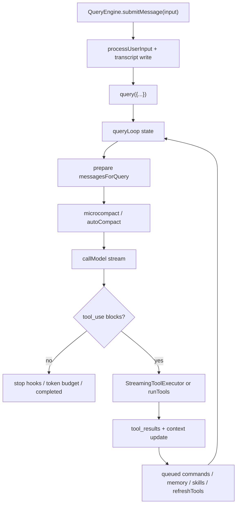

Agent loop 是 `QueryEngine.submitMessage()` 包装 SDK/会话状态, 再由 `query()` 和 `queryLoop()` 反复执行 auto-compact、模型请求、工具调用、stop hook 与下一轮状态更新。[E: QueryEngine.ts:176][E: QueryEngine.ts:209][E: query.ts:219][E: query.ts:241][E: query.ts:453][E: query.ts:659][E: query.ts:1380][E: query.ts:1518][E: query.ts:1714]

## 能回答的问题

- SDK 一次 `submitMessage()` 如何进入通用 `query()` 循环?
- loop 每一轮在哪些位置更新 context、调用模型、执行工具?
- loop 如何处理 max turns、queued command、compaction 和 abort?

## 1. QueryEngine 边界

`QueryEngine` 注释说明它拥有 query lifecycle 与 session state, 一个 conversation 对应一个 `QueryEngine`, `submitMessage()` 启动新 turn 且状态持续存在。[E: QueryEngine.ts:176] 类内保存 config、mutable messages、abortController、permission denials、usage、readFileState、discovered skills 和 loaded nested memory paths。[E: QueryEngine.ts:184]

`submitMessage()` 设置 cwd 和 persistSession, 包装 `canUseTool` 以追踪 permission denials, 计算模型和 thinking 配置, 构造 `ProcessUserInputContext`, 然后调用 `processUserInput(...)`。[E: QueryEngine.ts:209][E: QueryEngine.ts:273][E: QueryEngine.ts:335][E: QueryEngine.ts:410] 用户消息会先写入 transcript, 这样 query loop 出错或恢复时仍有输入记录。[E: QueryEngine.ts:436]

## 2. 进入 query()

`submitMessage()` 在准备 agent definitions、skills/plugins、system init message 后, 使用 `for await (const message of query({...}))` 消费通用 loop。[E: QueryEngine.ts:529][E: QueryEngine.ts:540][E: QueryEngine.ts:675] QueryEngine 对从 `query()` 出来的 assistant/user/compact boundary 写 transcript 并更新 `mutableMessages`, 还把 system compact boundary 用来裁剪 messages。[E: QueryEngine.ts:687][E: QueryEngine.ts:897]

## 3. queryLoop 单轮

`queryLoop()` 每轮从 compact boundary 之后取上下文, 先做 tool result budget、snip/microcompact、context collapse、system prompt 和 auto-compact。[E: query.ts:365][E: query.ts:369][E: query.ts:396][E: query.ts:412][E: query.ts:428][E: query.ts:449][E: query.ts:453] auto-compact 成功时会重建 post-compact messages, yield compact 产生的消息, 并把后续模型输入替换为 compact 后上下文。[E: query.ts:470][E: query.ts:535]

模型调用前, `toolUseContext.messages` 被设置为 `messagesForQuery`; 模型请求实际发送的是 `prependUserContext(messagesForQuery, userContext)` 后的消息。[E: query.ts:545][E: query.ts:659] 这让工具上下文与模型输入共享同一批 compact boundary 后消息作为基础, 但模型输入额外带 user context 前缀。[I] `deps.callModel(...)` 的输入还包含 system prompt、thinking config、tools、signal 和模型选项。[E: query.ts:659][E: query.ts:661][E: query.ts:662][E: query.ts:663][E: query.ts:664]

## 4. 工具跟进

流式响应期间, loop 收集 assistant messages 和 `tool_use` blocks, 并在 streaming tool execution gate 开启时把工具块加入 `StreamingToolExecutor`。[E: query.ts:551][E: query.ts:560][E: query.ts:826][E: query.ts:839] executor 已完成的结果会在模型流期间 yield, 未完成的工具会在模型流结束后通过 `getRemainingResults()` 继续消费; 未启用 streaming executor 时, loop 调用 `runTools(...)` 批量执行工具。[E: query.ts:847][E: query.ts:1360]

工具结果会被规范化进 `toolResults`; `updatedToolUseContext` 初始指向 `toolUseContext`, 只有当 executor 或 `runTools` 产出 `update.newContext` 时才替换为带 `queryTracking` 的新上下文。[E: query.ts:858][E: query.ts:1361][E: query.ts:1395][E: query.ts:1402]

## 5. 下一轮与终止

没有工具 follow-up 时, loop 处理 withheld 413/media、reactive compact、stop hooks、token budget continuation 和 completed 退出。[E: query.ts:1070][E: query.ts:1082][E: query.ts:1119][E: query.ts:1267][E: query.ts:1316][E: query.ts:1357] 有工具 follow-up 时, loop 会生成工具摘要, 处理中断、hook stop、queued commands、memory prefetch、skill attachments、refreshTools 和 maxTurns, 再用更新后的 `messages` 写入下一轮 state。[E: query.ts:1411][E: query.ts:1484][E: query.ts:1518][E: query.ts:1535][E: query.ts:1592][E: query.ts:1616][E: query.ts:1659][E: query.ts:1704][E: query.ts:1714][E: query.ts:1727]

## 6. query/ 支撑模块

`query()` 的纯数据配置与 I/O 依赖被拆到 `query/` 目录的小模块,集中可测、便于把 loop 抽成纯 reducer。

- **`query/config.ts`** — `buildQueryConfig()` 在 query() 入口一次性快照不可变 `QueryConfig`:`sessionId` 加一组 runtime gates(`streamingToolExecution`、`emitToolUseSummaries`、`isAnt`、`fastModeEnabled`)。[E: query/config.ts:29][E: query/config.ts:15][E: query/config.ts:31][E: query/config.ts:33] gates 走 `CACHED_MAY_BE_STALE` 的 statsig 读,所以一次 query 只快照一次;把不可变 config 与 per-iteration state、mutable ToolUseContext 分开是为未来 `step(state,event,config)` reducer 抽取做准备,且刻意不含 `feature()` gate(那是 tree-shaking 边界)。[I]
- **`query/deps.ts`** — `productionDeps()` 把 query() 的 4 个 I/O 依赖(`callModel`=`queryModelWithStreaming`、`microcompact`、`autocompact`、`uuid`)收成一个 `QueryDeps`,测试可直接注入 fake 而非 per-module spyOn。[E: query/deps.ts:33][E: query/deps.ts:21][E: query/deps.ts:23] 这正是 §3 中 `deps.callModel(...)` 的来源。[E: query.ts:659]
- **`query/stopHooks.ts`** — `handleStopHooks()` async generator 在一轮结束、模型不再要工具时运行:执行 Stop hooks(blockingErrors / preventContinuation)、turn 末背景簿记(prompt suggestion、memory extraction、auto-dream)、并对 teammate 追加 TaskCompleted / TeammateIdle hooks。[E: query/stopHooks.ts:65][E: query/stopHooks.ts:180][E: query/stopHooks.ts:139][E: query/stopHooks.ts:149][E: query/stopHooks.ts:155][E: query/stopHooks.ts:335] 返回 `{ blockingErrors, preventContinuation }` 决定是否阻断续跑。[E: query/stopHooks.ts:60]
- **`query/tokenBudget.ts`** — `checkTokenBudget()` 决定 token-budget 模式下是否续跑:未达 90%(`COMPLETION_THRESHOLD`)且非 diminishing 时返回 `continue` 并带 nudge 消息,否则 `stop`;连续 ≥3 次续跑且增量都 < 500 token(`DIMINISHING_THRESHOLD`)判定 diminishing returns 而停。[E: query/tokenBudget.ts:45][E: query/tokenBudget.ts:64][E: query/tokenBudget.ts:3][E: query/tokenBudget.ts:59][E: query/tokenBudget.ts:4] subagent(有 `agentId`)或无 budget 时直接 stop,不做 budget 续跑。[E: query/tokenBudget.ts:51]

## Sources

- `query.ts`
- `QueryEngine.ts`
- `query/config.ts`
- `query/deps.ts`
- `query/stopHooks.ts`
- `query/tokenBudget.ts`

## 相关

- [Tool call anatomy](tool-call-anatomy.md)
- `subsys.compaction`
