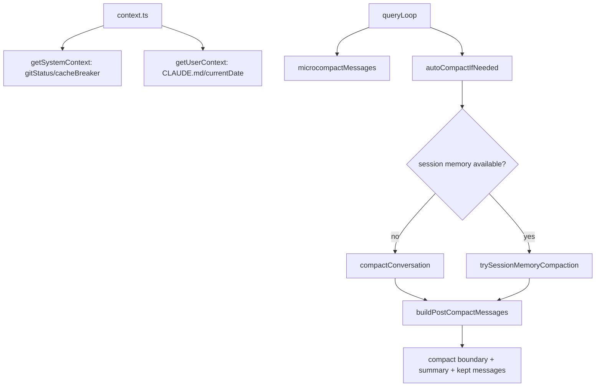

Context 由 `context.ts` 提供 git/user/system 快照, compaction 由 `services/compact/` 减少消息和工具结果体积; query turn 会把二者组合成本轮模型上下文。[E: context.ts:113][E: context.ts:152][E: services/compact/autoCompact.ts:241][E: services/compact/compact.ts:387][E: services/compact/microCompact.ts:253][I]

## 能回答的问题

- `getSystemContext()` 和 `getUserContext()` 分别注入什么?
- auto-compact、microcompact、session memory compact 的触发边界是什么?
- compaction 后有哪些状态会被清理或重建?

## 1. System/User context

`getSystemPromptInjection()` 和 `setSystemPromptInjection()` 维护全局 system prompt injection; 设置时会清空 user/system context cache。[E: context.ts:22] `getGitStatus()` 会检测 git 可用性, 并行获取 branch、default branch、status、log、userName 等信息, status 超过 2000 字符会截断。[E: context.ts:36][E: context.ts:64][E: context.ts:96]

`getSystemContext()` 是 memoized function, 在 remote 或禁用 git instructions 时跳过 git status, 否则返回 `gitStatus`, 并可在 feature gate 下加入 cache breaker。[E: context.ts:113][E: context.ts:124][E: context.ts:139] `getUserContext()` 是 memoized function, 在 env 或 bare 模式下可禁用 `CLAUDE.md`, 否则读取 memory files/Claude MDs, 并返回 `claudeMd` 与 `currentDate`。[E: context.ts:152][E: context.ts:161][E: context.ts:175]

## 2. Auto compact

`services/compact/autoCompact.ts` 把 effective context window 定义为 context window 减 reserved summary tokens; `CLAUDE_CODE_AUTO_COMPACT_WINDOW` 解析为正整数时会通过 `Math.min(contextWindow, parsed)` 降低有效窗口上限。[E: services/compact/autoCompact.ts:32][E: services/compact/autoCompact.ts:40] `isAutoCompactEnabled()` 受 `DISABLE_COMPACT`、`DISABLE_AUTO_COMPACT` 和 global config `autoCompactEnabled` 控制。[E: services/compact/autoCompact.ts:147]

`shouldAutoCompact()` 会避开 `session_memory` 和 `compact` querySource 等递归场景, 并基于 token threshold 判断是否触发。[E: services/compact/autoCompact.ts:160][E: services/compact/autoCompact.ts:207] `autoCompactIfNeeded()` 先检查关闭条件和 circuit breaker, 再优先尝试 session memory compaction, 失败或不可用时调用 `compactConversation(...)`; 连续失败次数达到 3 会 trip circuit breaker。[E: services/compact/autoCompact.ts:241][E: services/compact/autoCompact.ts:287][E: services/compact/autoCompact.ts:312][E: services/compact/autoCompact.ts:334]

## 3. compactConversation()

`compactConversation()` 在消息不足时直接抛错, 然后执行 PreCompact hooks, 设置 compact progress stream, 请求 summary, 并处理 PTL retry/truncate 与错误。[E: services/compact/compact.ts:387][E: services/compact/compact.ts:396][E: services/compact/compact.ts:406][E: services/compact/compact.ts:426][E: services/compact/compact.ts:440] 成功后会清空 `readFileState` 和 `loadedNestedMemoryPaths`, 构造保留文件、async agents、plan、skills、deferred tools、agents、MCP 等 attachments, 再创建 boundary 和 summary messages。[E: services/compact/compact.ts:517][E: services/compact/compact.ts:531][E: services/compact/compact.ts:596]

`buildPostCompactMessages()` 的顺序是 boundary marker、summary messages、kept messages、attachments、hook results。[E: services/compact/compact.ts:325] compact 结束还会记录 token metrics、通知 compaction、执行 post compact hooks; `finally` 中把 stream mode 设为 `requesting`, response length 清零, 发出 `compact_end`, 并清空 SDK status。[E: services/compact/compact.ts:626][E: services/compact/compact.ts:697][E: services/compact/compact.ts:719][E: services/compact/compact.ts:757]

## 4. Microcompact

`microCompact.ts` 的 compactable tools 集合包括 Read、shell、Grep/Glob、WebSearch/WebFetch、Edit/Write 等工具类别。[E: services/compact/microCompact.ts:40] `microcompactMessages()` 先处理 time-based trigger, 再检查 cached microcompact 是否只在 main thread、支持模型和 gate 下启用。[E: services/compact/microCompact.ts:253][E: services/compact/microCompact.ts:272] cached path 会注册 tool results、计算 `toolsToDelete`, 生成 cache edits, 但返回的 messages 本体不变。[E: services/compact/microCompact.ts:295] time-based path 会清空较旧 tool_result content, 保留最近 N 个 tool result, 并重置 microcompact 状态。[E: services/compact/microCompact.ts:422][E: services/compact/microCompact.ts:446]

## 5. Session memory 与 cleanup

`shouldUseSessionMemoryCompaction()` 由 env overrides 和 `tengu_session_memory`/`tengu_sm_compact` gates 控制。[E: services/compact/sessionMemoryCompact.ts:403] `trySessionMemoryCompaction()` 在禁用、无 memory、memory 为空时返回 null; 可处理 normal/resumed 场景, 选择保留消息并避免切开 tool_use/tool_result, 然后构造 post-compact messages 和 result。[E: services/compact/sessionMemoryCompact.ts:514]

`runPostCompactCleanup()` 是 compaction 后清理入口, 会在主线程重置 context collapse/memory file cache, 总是 reset microcompact state, 并清理 system prompt、classifier approvals、speculative checks、beta tracing 和 session messages cache。[E: services/compact/postCompactCleanup.ts:12][E: services/compact/postCompactCleanup.ts:31][E: services/compact/postCompactCleanup.ts:41][E: services/compact/postCompactCleanup.ts:47][E: services/compact/postCompactCleanup.ts:59][E: services/compact/postCompactCleanup.ts:62][E: services/compact/postCompactCleanup.ts:70][E: services/compact/postCompactCleanup.ts:76]

## 6. 不确定项

`query.ts` 动态引用的 `reactiveCompact` 与 `snipCompact` 模块在当前 `services/compact/` 文件列表中没有对应源码文件; 本节点只把它们作为 query 层存在的动态路径记录, 不推断实现行为。[U]

## Sources

- `context.ts`
- `services/compact/autoCompact.ts`
- `services/compact/compact.ts`
- `services/compact/microCompact.ts`
- `services/compact/sessionMemoryCompact.ts`
- `services/compact/postCompactCleanup.ts`

## 相关

- `subsys.compaction`
- `subsys.memory`
