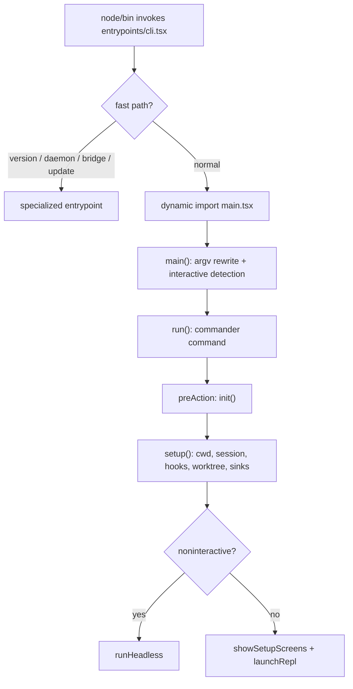

Claude Code 的生命周期是 `entrypoints/cli.tsx` 做快速分流, `main.tsx` 做 CLI 模式和 UI/headless 分派, `setup.ts` 做会话级准备, `entrypoints/init.ts` 做进程级一次性初始化。[E: entrypoints/cli.tsx:28][E: main.tsx:585][E: setup.ts:56][E: entrypoints/init.ts:57]

## 能回答的问题

- 为什么 `entrypoints/cli.tsx` 里大量使用 dynamic import?
- `setup()` 与 `init()` 各自负责什么边界?
- interactive 与 headless 在哪里分开?

## 1. Bootstrap

`entrypoints/cli.tsx` 顶层先设置 `COREPACK_ENABLE_AUTO_PIN=0`, 并在 import 之前设置 ablation baseline 环境变量, 因为工具模块可能在 import 时捕获 feature flag。[E: entrypoints/cli.tsx:3][E: entrypoints/cli.tsx:16] 该文件把 `--version`、system prompt dump、chrome/computer-use MCP、daemon、bridge、remote-control、background sessions、templates、environment runner 和 self-hosted runner 等路径做成提前返回的 fast paths。[E: entrypoints/cli.tsx:28][E: entrypoints/cli.tsx:50][E: entrypoints/cli.tsx:72][E: entrypoints/cli.tsx:95][E: entrypoints/cli.tsx:108][E: entrypoints/cli.tsx:182][E: entrypoints/cli.tsx:211][E: entrypoints/cli.tsx:224][E: entrypoints/cli.tsx:235] `--worktree --tmux` 只有在 `execIntoTmuxWorktree(...)` 返回 handled 时才提前退出; `--update`/`--upgrade` 会重写 argv 到 `update` 子命令, `--bare` 会提前设置 `CLAUDE_CODE_SIMPLE=1`。[E: entrypoints/cli.tsx:247][E: entrypoints/cli.tsx:263][E: entrypoints/cli.tsx:276][E: entrypoints/cli.tsx:281]

普通 CLI 路径会启动早期输入捕获, 再动态导入 `../main.js` 并调用 `cliMain()`。[E: entrypoints/cli.tsx:287]

## 2. main() 与 run()

`main()` 安装 warning、exit、SIGINT 处理, 然后做 URL/deeplink/assistant/ssh 参数重写。[E: main.tsx:585][E: main.tsx:609] non-interactive 的判断来自 `-p`、`--print`、`--init-only`、`--sdk-url` 或 stdout 非 TTY, 判断完成后会停止早期输入捕获并初始化 entrypoint。[E: main.tsx:797][E: main.tsx:814]

`run()` 创建 commander 程序, 并在 `preAction` 中等待 MDM/keychain、调用 `init()`、设置 `process.title`、初始化 sinks、插件目录、migrations、remote settings/policy 和 settings sync。[E: main.tsx:884][E: main.tsx:905]

## 3. init()

`entrypoints/init.ts` 的 `init` 是 memoized async function, 负责启用配置、加载安全环境变量和 CA 证书、注册 graceful shutdown、启动事件日志、准备 OAuth/remote settings/policy、初始化代理/preconnect、注册 LSP manager 与 session teams cleanup 回调、创建 scratchpad 目录。[E: entrypoints/init.ts:57][E: entrypoints/init.ts:62][E: entrypoints/init.ts:71][E: entrypoints/init.ts:86][E: entrypoints/init.ts:90][E: entrypoints/init.ts:120][E: entrypoints/init.ts:134][E: entrypoints/init.ts:188][E: entrypoints/init.ts:202] `initializeTelemetryAfterTrust()` 是 trust 后的 telemetry 初始化入口, 与 `init()` 的早期初始化分离。[E: entrypoints/init.ts:240]

## 4. setup()

`setup()` 做 Node 版本检查、自定义 session id、UDS messaging server、teammate snapshot、interactive terminal 备份恢复, 然后调用 `setCwd(cwd)` 以保证后续 cwd 依赖逻辑一致。[E: setup.ts:56][E: setup.ts:69][E: setup.ts:81][E: setup.ts:86][E: setup.ts:104][E: setup.ts:112][E: setup.ts:160] worktree 参数会在 `setup()` 内部改变 cwd 并记录 project root/worktree 状态。[E: setup.ts:174] 非 bare 会启动 session memory, context collapse 还需要 `CONTEXT_COLLAPSE` feature gate; plugin/hook prefetch 会在 sync plugin install 或 bare 模式下跳过。[E: setup.ts:287][E: setup.ts:293][E: setup.ts:295][E: setup.ts:315][E: setup.ts:321]

## 5. 进入会话

主命令路径初始化 `toolPermissionContext`, 对 ant 用户移除过宽 shell allow rules, 并在 `TRANSCRIPT_CLASSIFIER` gate 下为 auto mode 去掉 dangerous permissions; 随后解析 MCP configs、获取输入 prompt、构造 `tools = getTools(toolPermissionContext)`。[E: main.tsx:1744][E: main.tsx:1762][E: main.tsx:1769][E: main.tsx:1780][E: main.tsx:1861][E: main.tsx:1868] `setup(...)` 后, non-interactive 路径并行准备 system/user context 与 model strings, 然后调用 `runHeadless(...)`。[E: main.tsx:1903][E: main.tsx:1952][E: main.tsx:2823] interactive 路径会执行 trust/setup screens 和 LSP 初始化, 启动 MCP prefetch 与 startup hooks; MCP 不阻塞 REPL render 或第一轮 TTFT, 慢 MCP server 会在后续 turn 填入 app state。[E: main.tsx:2228][E: main.tsx:2241][E: main.tsx:2317][E: main.tsx:2380][E: main.tsx:2432][E: main.tsx:2442][E: main.tsx:3797]

## Sources

- `entrypoints/cli.tsx`
- `main.tsx`
- `setup.ts`
- `entrypoints/init.ts`

## 相关

- `subsys.cli-modes`
