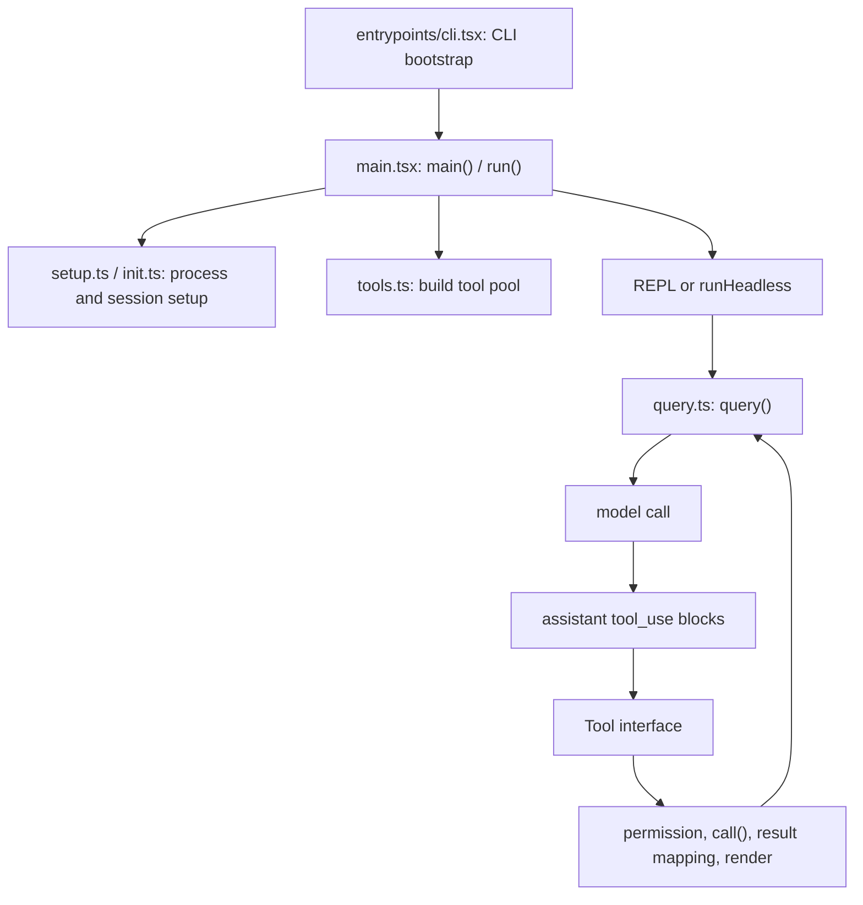

Claude Code 的主干由 `main()` 负责进程入口与模式选择, `query()` 负责单轮到多轮的模型循环, `Tool` 接口负责把工具能力约束成可验证的执行契约。[E: main.tsx:585][E: query.ts:219][E: Tool.ts:362]

## 能回答的问题

- CLI 启动后, 哪个函数把命令行模式、权限上下文、工具列表和 REPL/headless 运行串起来?
- 模型循环在哪里决定是否继续下一轮、执行工具、触发 compaction?
- 一个工具对象必须暴露哪些能力位、schema、权限和渲染入口?

## 1. 入口分层

`entrypoints/cli.tsx` 是最薄的启动壳: 普通路径动态导入 `../main.js` 并调用 `cliMain()`, 这样 `--version` 等快速路径可以少做模块求值。[E: entrypoints/cli.tsx:28][E: entrypoints/cli.tsx:287] `main.tsx` 中导出的 `main()` 先处理平台环境、URL/deeplink/assistant/ssh 参数重写, 再根据 `--print`、`--init-only`、`--sdk-url` 或 stdout TTY 状态判断是否 non-interactive。[E: main.tsx:585][E: main.tsx:609][E: main.tsx:797]

`run()` 构造 commander 程序并在 `preAction` 中调用 `init()`, 然后初始化 sinks、plugin 目录、migration、remote settings/policy 和 settings sync。[E: main.tsx:884][E: main.tsx:905] 主命令路径会初始化 `toolPermissionContext`, 生成 `tools = getTools(toolPermissionContext)`, 执行 `setup(...)`, 再按 headless 或 REPL 路径进入会话。[E: main.tsx:1744][E: main.tsx:1868][E: main.tsx:1903][E: main.tsx:2823][E: main.tsx:3797]

## 2. Query 主循环

`query(params)` 是 async generator, 它把传入参数交给 `queryLoop()` 并逐条 yield 消息; 正常退出后会通知 consumed command lifecycle 完成。[E: query.ts:219] `queryLoop()` 初始化 `messages`、`toolUseContext`、max output token override/recovery tracking、auto-compact tracking、turn counter 等状态, 然后进入 `while` 循环。[E: query.ts:241][E: query.ts:307]

每轮开始时, `queryLoop()` 从 `messages` 取 compact boundary 之后的上下文, 处理 tool result budget、microcompact、context collapse、auto-compact, 然后把最新 `messagesForQuery` 写回 `toolUseContext.messages`。[E: query.ts:365][E: query.ts:369][E: query.ts:412][E: query.ts:428][E: query.ts:453][E: query.ts:545] 模型调用通过 `deps.callModel(...)` 完成, 参数包括经过 `prependUserContext(...)` 的消息、system prompt、thinking config、tools 和 signal。[E: query.ts:657]

## 3. 工具契约

`Tool` 接口把工具定义拆成 schema、执行、权限、并发、读写、副作用、defer、路径、prompt、渲染和结果映射等维度。[E: Tool.ts:362][E: Tool.ts:430][E: Tool.ts:442][E: Tool.ts:455][E: Tool.ts:514][E: Tool.ts:556][E: Tool.ts:570] `buildTool()` 会把 `TOOL_DEFAULTS` 和工具定义合并, 因此未声明的工具默认 `isConcurrencySafe=false`、`isReadOnly=false`、`isDestructive=false`、`isEnabled=true`, 权限默认允许。[E: Tool.ts:757][E: Tool.ts:783]

`ToolUseContext` 是工具运行时上下文, 包含命令、主循环模型、可用工具、MCP、non-interactive 标志、agent 定义、abortController、readFileState、AppState 读写和 UI/progress 更新入口。[E: Tool.ts:158][E: Tool.ts:180] `ToolResult` 允许工具返回 `data`、追加 `newMessages`、修改上下文的 `contextModifier`, 以及 MCP meta。[E: Tool.ts:321]

## 4. 关键设计判断

- `main.tsx` 先完成权限上下文和基础工具池构造, 再进入 headless 或 REPL; REPL 运行中仍可能结合 MCP/dynamic tools 重新计算工具 surface, 但初始工具集合不是 `query.ts` 临时拼出来的。[E: main.tsx:1868][E: main.tsx:2823][E: main.tsx:3797][I]
- `query.ts` 不信任 `stop_reason === "tool_use"` 作为唯一继续条件, 而是在流式响应期间收集 `tool_use` blocks 并用它们决定是否需要工具 follow-up。[E: query.ts:551]
- `Tool` 层的行为位不是注释性元数据; `Tool` contract 把并发、权限、读写和结果处理入口暴露为函数, 调度与执行层会据此决策。[E: Tool.ts:430][E: Tool.ts:454][E: Tool.ts:570][I]

## Sources

- `main.tsx`
- `query.ts`
- `Tool.ts`

## 相关

- [Agent loop](agent-loop.md)
- [Lifecycle](lifecycle.md)
