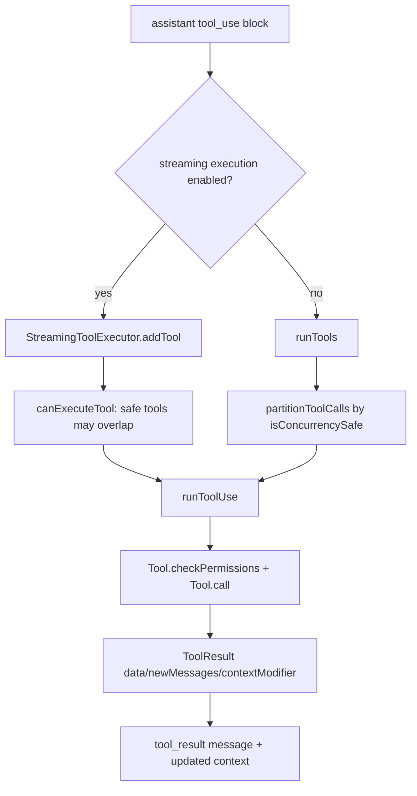

工具调用的骨架是: `Tool` 定义 schema/权限/执行/渲染, `runTools()` 按并发安全性批处理完整工具块, `StreamingToolExecutor` 在模型流式输出期间尽早启动工具; non-concurrent 工具会独占执行, concurrency-safe 工具可以并行。[E: Tool.ts:362][E: services/tools/toolOrchestration.ts:19][E: services/tools/StreamingToolExecutor.ts:34]

## 能回答的问题

- `isConcurrencySafe()` 如何影响工具调度?
- streaming tool execution 如何处理顺序、abort 和 context modifier?
- 工具结果如何把 data、newMessages、contextModifier 带回主循环?

## 1. Tool 定义面

`Tool` 接口要求 `call(input, context, canUseTool, assistantMessage, onProgress)` 返回 `Promise<ToolResult<Output>>`。[E: Tool.ts:379] 工具可以声明 `inputSchema`、`inputJSONSchema`、`outputSchema`、`isConcurrencySafe`、`isReadOnly`、`isDestructive`、`shouldDefer`、`maxResultSizeChars`、`validateInput`、`checkPermissions`、`getPath`、`preparePermissionMatcher` 和多种 render 方法。[E: Tool.ts:394][E: Tool.ts:397][E: Tool.ts:400][E: Tool.ts:402][E: Tool.ts:404][E: Tool.ts:406][E: Tool.ts:442][E: Tool.ts:466][E: Tool.ts:489][E: Tool.ts:500][E: Tool.ts:506][E: Tool.ts:514][E: Tool.ts:566][E: Tool.ts:625][E: Tool.ts:641] 默认值由 `TOOL_DEFAULTS` 提供, 未声明工具默认不并发安全、不只读、不破坏、默认启用、权限默认 allow。[E: Tool.ts:757]

`ToolResult` 包含 `data`, 可选 `newMessages`, 可选 `contextModifier`, 以及用于 SDK consumers 的 MCP protocol metadata `mcpMeta`。[E: Tool.ts:321]

## 2. runTools 批处理

`runTools()` 先把 `currentContext` 设为传入 context, 然后用 `partitionToolCalls(...)` 分组。[E: services/tools/toolOrchestration.ts:19][E: services/tools/toolOrchestration.ts:29] `partitionToolCalls()` 会解析工具 input, 调用工具的 `isConcurrencySafe(parsedInput)`, 若抛错则视为 false; 并发安全工具被合并为批次, 非并发安全工具单独成批。[E: services/tools/toolOrchestration.ts:84][E: services/tools/toolOrchestration.ts:100]

并发安全批次通过 `runToolsConcurrently()` 使用 `all(..., getMaxToolUseConcurrency())` 执行, 最大并发来自 `CLAUDE_CODE_MAX_TOOL_USE_CONCURRENCY` 或默认 10。[E: services/tools/toolOrchestration.ts:8][E: services/tools/toolOrchestration.ts:152] 非并发安全批次通过 `runToolsSerially()` 顺序执行, 每个工具的 `contextModifier` 会立即应用到 `currentContext`。[E: services/tools/toolOrchestration.ts:118][E: services/tools/toolOrchestration.ts:139]

## 3. StreamingToolExecutor

`StreamingToolExecutor` 的类注释说明它会在工具流出时执行工具: concurrency-safe 工具可以并行, non-concurrent 工具独占, 结果会被 buffer 再释放。[E: services/tools/StreamingToolExecutor.ts:34] 具体释放逻辑还会受 pending progress、completed 状态和正在执行的 non-concurrent 工具影响。[E: services/tools/StreamingToolExecutor.ts:417] `addTool()` 对未知工具直接生成 completed error result; 对已知工具解析输入并调用 `isConcurrencySafe`, 失败则降级为 false。[E: services/tools/StreamingToolExecutor.ts:76][E: services/tools/StreamingToolExecutor.ts:104]

`canExecuteTool()` 的规则是: 没有正在执行的工具时可执行; 或新工具并发安全且所有正在执行的工具也并发安全时可执行。[E: services/tools/StreamingToolExecutor.ts:129] `processQueue()` 遇到不能执行的 queued 工具时, 只有该 queued 工具本身 non-concurrent 才 break; queued concurrency-safe 工具会留在队列中继续扫描后续项。[E: services/tools/StreamingToolExecutor.ts:140]

## 4. Abort 与错误

`getAbortReason()` 会把 discard 映射为 `streaming_fallback`, sibling error 映射为 `sibling_error`, 父 signal abort 映射为 `user_interrupted`; 若父 abort reason 是 `interrupt`, 只有 `interruptBehavior(...)` 返回 `cancel` 的工具会被取消。[E: services/tools/StreamingToolExecutor.ts:210][E: services/tools/StreamingToolExecutor.ts:233] `executeTool()` 对 Bash 工具错误会触发 sibling abort controller, 让同批兄弟工具收到 sibling error。[E: services/tools/StreamingToolExecutor.ts:347]

## 5. 结果释放和上下文

`executeTool()` 调用 `runToolUse(...)`, 将 progress message 立即缓冲/释放, 普通 messages 进入 tool 的 message 列表, `contextModifier` 进入 tracked tool 的 context modifiers。[E: services/tools/StreamingToolExecutor.ts:320][E: services/tools/StreamingToolExecutor.ts:366][E: services/tools/StreamingToolExecutor.ts:377] streaming executor 只自动应用非并发安全工具的 context modifier; 并发安全工具的 context modifier 不会在 executor 内更新 `updatedContext`。[E: services/tools/StreamingToolExecutor.ts:388] `getCompletedResults()` 对每个 tracked tool 先释放 pending progress, 再释放 completed results; 如果遇到正在执行的 non-concurrent 工具会停止继续释放后续结果。[E: services/tools/StreamingToolExecutor.ts:412][E: services/tools/StreamingToolExecutor.ts:417][E: services/tools/StreamingToolExecutor.ts:436]

## Sources

- `services/tools/toolOrchestration.ts`
- `services/tools/StreamingToolExecutor.ts`
- `Tool.ts`

## 相关

- `subsys.tool-system`
- `subsys.permissions`
