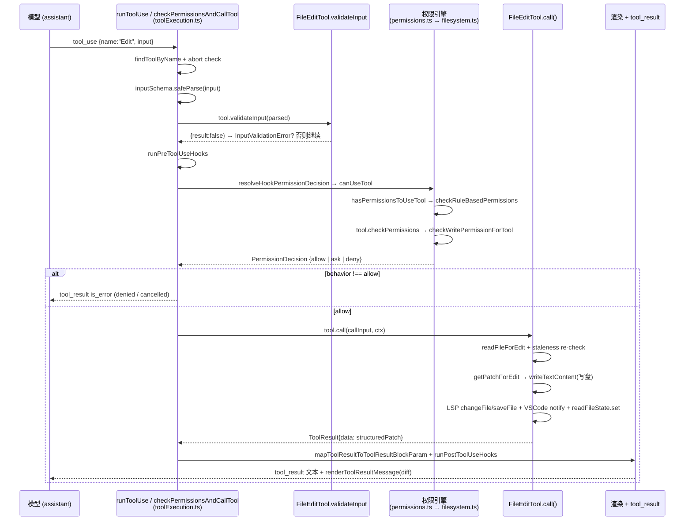

> 一次 `Edit` 工具调用从模型 `tool_use` 块到改动落盘并渲染 diff 的完整路径:`runToolUse` 分发 → zod 解析 + `validateInput` staleness guard → PreToolUse hooks → 权限引擎 `hasPermissionsToUseTool` → `checkWritePermissionForTool` 的 deny/safety/ask/acceptEdits/allow 阶梯 → allow 后 `tool.call()` 同步 read-modify-write 写盘 → `mapToolResultToToolResultBlockParam` + PostToolUse hooks + `renderToolResultMessage` 渲染 structured patch。[E: services/tools/toolExecution.ts:337][E: services/tools/toolExecution.ts:683][E: utils/permissions/filesystem.ts:1205][E: tools/FileEditTool/FileEditTool.ts:387]

本节是 worked-example trace,逐步落在真实源码行上;工具调度的总体骨架见 [Tool call anatomy](tool-call-anatomy.md),`Edit` 字段级细节见 [Edit tool](../surface/tools/edit.md),权限引擎完整决策见 [权限系统](../subsystems/permissions.md)。

## 能回答的问题

- 一次 `Edit` 调用从 `tool_use` 到写盘,依次经过哪些函数?
- `Edit` 的 staleness guard(未读 / 被改文件拒绝)在哪一步、由谁触发?
- `Edit` 的 allow/ask/deny 决策具体在 `checkWritePermissionForTool` 的哪个阶梯产生?
- `acceptEdits` 模式如何让 working dir 内的 `Edit` 直接放行?
- 权限被拒后,模型收到的是什么消息,`tool.call()` 还会执行吗?
- 编辑结果如何变成 tool_result 文本 + UI 的 diff 渲染?

## Trace 总览(mermaid)

## 端到端编号步骤

### 1. 分发:`runToolUse` 接住 `tool_use` 块

模型在 assistant 消息里发出 `{type:'tool_use', name:'Edit', input:{file_path, old_string, new_string, replace_all?}}`。调度层(streaming 路径的 `StreamingToolExecutor` 或非 streaming 的 `runTools`,边界见 [Tool call anatomy](tool-call-anatomy.md))最终都调用 `runToolUse(toolUse, assistantMessage, canUseTool, toolUseContext)`。[E: services/tools/toolExecution.ts:337][I]

`runToolUse` 先 `findToolByName(toolUseContext.options.tools, toolName)` 在模型可见工具池里查 `Edit`;查不到再按 alias 回退到 `getAllBaseTools()`,仅当命中 alias 才用 fallback。[E: services/tools/toolExecution.ts:345][E: services/tools/toolExecution.ts:350][E: services/tools/toolExecution.ts:353] 工具不存在则直接 yield 一条 `No such tool available` 的 `is_error` tool_result 并 return。[E: services/tools/toolExecution.ts:369][E: services/tools/toolExecution.ts:401] 进入 try 后第一道闸是 abort:若 `toolUseContext.abortController.signal.aborted`,记 `tengu_tool_use_cancelled` 并返回 `CANCEL_MESSAGE`,不执行任何编辑。[E: services/tools/toolExecution.ts:415][E: services/tools/toolExecution.ts:443] 否则进入 `streamedCheckPermissionsAndCallTool`,它把 `checkPermissionsAndCallTool` 的 progress 与最终结果合并成一个 async iterable。[E: services/tools/toolExecution.ts:455][E: services/tools/toolExecution.ts:492][E: services/tools/toolExecution.ts:510]

### 2. zod 解析:schema 先于一切业务校验

`checkPermissionsAndCallTool` 第一步是 `tool.inputSchema.safeParse(input)`。[E: services/tools/toolExecution.ts:615] 解析失败立即返回 `InputValidationError` 文本的 `is_error` tool_result(对 deferred 工具还会追加 schema-not-sent 提示),`validateInput` 和权限检查都不会跑。[E: services/tools/toolExecution.ts:616][E: services/tools/toolExecution.ts:619][E: services/tools/toolExecution.ts:664] `Edit` 的 `inputSchema` 要求 `file_path`/`old_string`/`new_string` 为 string、`replace_all` 为 optional boolean(字段细节见 [Edit tool](../surface/tools/edit.md))。

### 3. `validateInput`:Edit 的 staleness guard 与编辑前置校验

解析成功后调用 `tool.validateInput?.(parsedInput.data, toolUseContext)`;返回 `{result:false}` 时返回该 message 的 `is_error` tool_result,同样短路在权限检查之前。[E: services/tools/toolExecution.ts:683][E: services/tools/toolExecution.ts:687][E: services/tools/toolExecution.ts:717] `Edit` 的 `validateInput` 是一条长的拒绝阶梯,按源码顺序:

1. team-memory secret:`checkTeamMemSecrets(fullFilePath, new_string)` 命中则 `result:false, errorCode:0`。[E: tools/FileEditTool/FileEditTool.ts:144]
2. `old_string === new_string` → `behavior:'ask'`,errorCode 1(无变化)。[E: tools/FileEditTool/FileEditTool.ts:148]
3. edit deny rule:`matchingRuleForInput(fullFilePath, ctx, 'edit', 'deny')` 命中 → ask,errorCode 2。[E: tools/FileEditTool/FileEditTool.ts:160][E: tools/FileEditTool/FileEditTool.ts:166]
4. Windows UNC path(`\\` / `//`)直接 `result:true`,不做 filesystem 操作以避免 SMB 凭据泄漏。[E: tools/FileEditTool/FileEditTool.ts:179]
5. 文件过大(> `MAX_EDIT_FILE_SIZE` = 1 GiB)→ ask,errorCode 10。[E: tools/FileEditTool/FileEditTool.ts:188]
6. 文件不存在 + `old_string === ''` → `result:true`(新建文件);不存在但 `old_string` 非空 → ask,errorCode 4。[E: tools/FileEditTool/FileEditTool.ts:224][E: tools/FileEditTool/FileEditTool.ts:226][E: tools/FileEditTool/FileEditTool.ts:240]
7. 文件已存在 + `old_string === ''`:trimmed 内容非空 → ask errorCode 3(不能当新建);空 / 纯空白文件 → `result:true`。[E: tools/FileEditTool/FileEditTool.ts:249][E: tools/FileEditTool/FileEditTool.ts:251][E: tools/FileEditTool/FileEditTool.ts:261]
8. `.ipynb` → ask errorCode 5,要求改用 `NotebookEditTool`。[E: tools/FileEditTool/FileEditTool.ts:266]
9. **staleness guard(关键):** `readFileState.get(fullFilePath)` 为空或 `isPartialView` → ask errorCode 6 "File has not been read yet";否则比对 `getFileModificationTime` 与 read timestamp,mtime 更新且(非 full-read 或内容已变)→ ask errorCode 7 "File has been modified since read"。[E: tools/FileEditTool/FileEditTool.ts:275][E: tools/FileEditTool/FileEditTool.ts:276][E: tools/FileEditTool/FileEditTool.ts:290][E: tools/FileEditTool/FileEditTool.ts:292][E: tools/FileEditTool/FileEditTool.ts:302]
10. `findActualString` 找不到 `old_string` → ask errorCode 8;命中多处但 `replace_all=false` → ask errorCode 9。[E: tools/FileEditTool/FileEditTool.ts:316][E: tools/FileEditTool/FileEditTool.ts:317][E: tools/FileEditTool/FileEditTool.ts:329][E: tools/FileEditTool/FileEditTool.ts:332] 最后对 Claude settings 文件做额外校验,全通过则 `result:true, meta:{actualOldString}`。[E: tools/FileEditTool/FileEditTool.ts:346][E: tools/FileEditTool/FileEditTool.ts:361]

> 注意:`validateInput` 里这些 `behavior:'ask'` 是**校验失败消息**(返回 `is_error` tool_result),与第 5 步权限引擎产生的 `ask`(弹权限对话框)是不同机制——这里 `result:false` 直接短路,根本走不到权限检查。[E: services/tools/toolExecution.ts:687][I]

### 4. PreToolUse hooks

校验通过后,`checkPermissionsAndCallTool` 先 backfill 一份 observable input 的 clone(`Edit` 的 `backfillObservableInput` 用 `expandPath` 展开 `file_path`,供 hooks/权限观测,但不污染 `call()` 看到的原始路径),然后跑 `runPreToolUseHooks`。[E: services/tools/toolExecution.ts:784][E: services/tools/toolExecution.ts:800][E: tools/FileEditTool/FileEditTool.ts:115] hook 可返回 `hookPermissionResult`(allow/ask/deny 预决策)、`hookUpdatedInput`(改写输入)、或 `stop`(直接终止该工具并返回 stop message)。[E: services/tools/toolExecution.ts:831][E: services/tools/toolExecution.ts:834][E: services/tools/toolExecution.ts:848]

### 5. 权限引擎:`canUseTool` → `hasPermissionsToUseTool` → `checkWritePermissionForTool`

核心权限决策由 `resolveHookPermissionDecision(hookPermissionResult, tool, processedInput, ctx, canUseTool, ...)` 产生。[E: services/tools/toolExecution.ts:921][E: services/tools/toolHooks.ts:332] 它的逻辑:

- hook 已 `allow` 且工具不需交互、又不强制 canUseTool → 仍跑 `checkRuleBasedPermissions` 兜底,deny/ask rule 仍可推翻 hook 的 allow。[E: services/tools/toolHooks.ts:347][E: services/tools/toolHooks.ts:373][E: services/tools/toolHooks.ts:386]
- hook 已 `deny` → 直接返回 deny。[E: services/tools/toolHooks.ts:408]
- 无 hook 决策或 hook 为 `ask` → 走正常 `canUseTool(tool, askInput, ctx, assistantMessage, toolUseID, forceDecision?)`。[E: services/tools/toolHooks.ts:415][E: services/tools/toolHooks.ts:423]

`canUseTool` 在交互式 REPL 下是 `useCanUseTool` 返回的闭包:`forceDecision` 存在则直接用,否则调 `hasPermissionsToUseTool(...)`;若结果是 `ask` 则把请求推进 `setToolUseConfirmQueue` 弹对话框等用户选择。[E: hooks/useCanUseTool.tsx:28][E: hooks/useCanUseTool.tsx:37] headless / 子 agent / 打印模式则直接以 `hasPermissionsToUseTool` 作为 `canUseTool`。[E: cli/print.ts:4162][E: utils/swarm/inProcessRunner.ts:143][I]

`hasPermissionsToUseTool`(`permissions.ts:473`)先 `hasPermissionsToUseToolInner(...)` 拿到 raw 结果;[E: utils/permissions/permissions.ts:473][E: utils/permissions/permissions.ts:480] inner engine 的 `checkRuleBasedPermissions` 在 blanket deny/ask 之后,对 `Edit` 调用 `tool.inputSchema.parse(input)` 再 `tool.checkPermissions(parsedInput, context)`。[E: utils/permissions/permissions.ts:1119][E: utils/permissions/permissions.ts:1120] `Edit` 的 `checkPermissions` 委托给 `checkWritePermissionForTool(FileEditTool, input, appState.toolPermissionContext)`。[E: tools/FileEditTool/FileEditTool.ts:125][E: tools/FileEditTool/FileEditTool.ts:127]

`checkWritePermissionForTool`(`filesystem.ts:1205`)是 `Edit` 真正的 allow/ask/deny 阶梯,按源码顺序:

1. **deny rules**:对原始路径与 resolved symlink 路径都查 `matchingRuleForInput(..., 'edit', 'deny')`,命中 → `behavior:'deny'`,reason `{type:'rule'}`。[E: utils/permissions/filesystem.ts:1219][E: utils/permissions/filesystem.ts:1223][E: utils/permissions/filesystem.ts:1229]
2. **internal editable path**:plan 文件 / scratchpad 等内部可写路径 → 非 passthrough 即直接返回(在 dangerous-path 检查之前)。[E: utils/permissions/filesystem.ts:1244][E: utils/permissions/filesystem.ts:1248]
3. **`.claude/**` session allow**:仅 session 级 allow rule 且 ruleContent 落在 `.claude/` 下 → allow,让 "本会话允许编辑自己的设置" 生效。[E: utils/permissions/filesystem.ts:1262][E: utils/permissions/filesystem.ts:1273][E: utils/permissions/filesystem.ts:1291]
4. **safety check**:`checkPathSafetyForAutoEdit`(.git/、.claude/settings.json、.vscode/、Windows 危险模式等)不安全 → ask,reason `{type:'safetyCheck', classifierApprovable}`,**先于 allow rules** 以防误授权。[E: utils/permissions/filesystem.ts:1305][E: utils/permissions/filesystem.ts:1306][E: utils/permissions/filesystem.ts:1328]
5. **ask rules**:命中 `'edit','ask'` rule → ask,reason `{type:'rule'}`。[E: utils/permissions/filesystem.ts:1341][E: utils/permissions/filesystem.ts:1348]
6. **acceptEdits fast path**:`mode === 'acceptEdits'` 且路径在 allowed working dir 内 → allow,reason `{type:'mode'}`。[E: utils/permissions/filesystem.ts:1361][E: utils/permissions/filesystem.ts:1366]
7. **allow rules**:命中 `'edit','allow'` rule → allow,reason `{type:'rule'}`。[E: utils/permissions/filesystem.ts:1378][E: utils/permissions/filesystem.ts:1384]
8. **默认 ask**:都不命中 → ask;路径在工作目录外时 reason 标 `{type:'workingDir'}`。[E: utils/permissions/filesystem.ts:1396][E: utils/permissions/filesystem.ts:1405]

回到 `hasPermissionsToUseTool`:inner 返回 `ask` 时还会做两道末端变换(放在最后,防止被早 return 绕过)——`dontAsk` 模式把 `ask` 直接变 `deny`;`TRANSCRIPT_CLASSIFIER` 打开且 mode 为 `auto`(或 plan+auto-active)时交给 AI classifier 而非弹框。[E: utils/permissions/permissions.ts:505][E: utils/permissions/permissions.ts:508][E: utils/permissions/permissions.ts:520][E: utils/permissions/permissions.ts:521]

### 6. 决策落地:deny/ask 短路,allow 才进 call()

`checkPermissionsAndCallTool` 拿到 `permissionDecision` 后:`behavior !== 'allow'` → 关闭 span、记 `tengu_tool_use_can_use_tool_rejected`、push 一条 `is_error` 的 tool_result(内容是 `permissionDecision.message`),`tool.call()` **不执行**;auto-mode classifier 拒绝时还会跑 PermissionDenied hooks。[E: services/tools/toolExecution.ts:995][E: services/tools/toolExecution.ts:1001][E: services/tools/toolExecution.ts:1064][E: services/tools/toolExecution.ts:1075] `behavior === 'allow'` → 记 `tengu_tool_use_can_use_tool_allowed`,若 `permissionDecision.updatedInput` 存在则覆盖 `processedInput`。[E: services/tools/toolExecution.ts:1105][E: services/tools/toolExecution.ts:1130]

### 7. `tool.call()`:Edit 的同步 read-modify-write 写盘

`tool.call(callInput, {...ctx, toolUseId, userModified}, canUseTool, assistantMessage, onProgress)` 被调用;`callInput` 经过一段还原逻辑,使 `call()` 看到模型原始的 `file_path`(而非 backfill 展开后的),以保持 transcript/VCR hash 稳定。[E: services/tools/toolExecution.ts:1189][E: services/tools/toolExecution.ts:1207] `Edit` 的 `call()`(`FileEditTool.ts:387`)流程:

1. `expandPath(file_path)`;非 simple 模式下从该路径 discover/activate skills(fire-and-forget)。[E: tools/FileEditTool/FileEditTool.ts:402][E: tools/FileEditTool/FileEditTool.ts:408][E: tools/FileEditTool/FileEditTool.ts:422]
2. `diagnosticTracker.beforeFileEdited`;`fs.mkdir(dirname)` 确保父目录;`fileHistoryEnabled()` 时 `fileHistoryTrackEdit` 备份。[E: tools/FileEditTool/FileEditTool.ts:425][E: tools/FileEditTool/FileEditTool.ts:430][E: tools/FileEditTool/FileEditTool.ts:431] 源码注释要求这些 await 留在临界区**之外**,避免 staleness 检查与写盘之间被并发编辑 interleave。[E: tools/FileEditTool/FileEditTool.ts:427]
3. **临界区(避免 async):** `readFileForEdit(absoluteFilePath)` 读 content/exists/encoding/lineEndings;再次 staleness re-check(mtime > lastRead 且内容确实变)→ throw `FILE_UNEXPECTEDLY_MODIFIED_ERROR`。[E: tools/FileEditTool/FileEditTool.ts:444][E: tools/FileEditTool/FileEditTool.ts:449][E: tools/FileEditTool/FileEditTool.ts:452][E: tools/FileEditTool/FileEditTool.ts:465]
4. `findActualString` + `preserveQuoteStyle` 归一化引号;`getPatchForEdit({...replaceAll})` 生成 `patch` 与 `updatedFile`;`writeTextContent(absoluteFilePath, updatedFile, encoding, endings)` 写盘。[E: tools/FileEditTool/FileEditTool.ts:471][E: tools/FileEditTool/FileEditTool.ts:482][E: tools/FileEditTool/FileEditTool.ts:491]
5. 写后:LSP `clearDeliveredDiagnosticsForFile` + `changeFile`/`saveFile`;`notifyVscodeFileUpdated` 供 diff 视图;`readFileState.set` 更新为新内容与新 mtime(使旧的 stale 写失效)。[E: tools/FileEditTool/FileEditTool.ts:497][E: tools/FileEditTool/FileEditTool.ts:500][E: tools/FileEditTool/FileEditTool.ts:517][E: tools/FileEditTool/FileEditTool.ts:520]
6. 记 analytics(CLAUDE.md 写入、`countLinesChanged`、`logFileOperation`、`tengu_edit_string_lengths`);在 `CLAUDE_CODE_REMOTE` + `tengu_quartz_lantern` feature 下取单文件 git diff;返回 `{data:{filePath, oldString, newString, originalFile, structuredPatch, userModified, replaceAll, gitDiff?}}`。[E: tools/FileEditTool/FileEditTool.ts:528][E: tools/FileEditTool/FileEditTool.ts:533][E: tools/FileEditTool/FileEditTool.ts:546][E: tools/FileEditTool/FileEditTool.ts:561][E: tools/FileEditTool/FileEditTool.ts:571]

### 8. 结果映射、PostToolUse hooks 与渲染

`call()` 成功后,`checkPermissionsAndCallTool` 记 `tengu_tool_use_success`,并 `tool.mapToolResultToToolResultBlockParam(result.data, toolUseID)` 把 data 映射成给模型的 tool_result 文本。[E: services/tools/toolExecution.ts:1331][E: services/tools/toolExecution.ts:1292] `Edit` 的映射返回简短成功句:普通编辑 "The file {filePath} has been updated successfully";`replaceAll` 为 true 时改为 "All occurrences were successfully replaced";用户改过提案则追加 modified note。[E: tools/FileEditTool/FileEditTool.ts:575][E: tools/FileEditTool/FileEditTool.ts:585][E: tools/FileEditTool/FileEditTool.ts:592] 随后跑 PostToolUse hooks(`runPostToolUseHooks`,可注入 additionalContext)。[E: services/tools/toolExecution.ts:1483][E: services/tools/toolHooks.ts:39]

UI 侧用 `Edit` 的 `renderToolResultMessage` 渲染:它把 `structuredPatch`/`originalFile` 交给 `FileEditToolUpdatedMessage` 展示 diff;plan 文件还带 `/plan to preview` 提示。[E: tools/FileEditTool/UI.tsx:77][E: tools/FileEditTool/UI.tsx:90] tool_result 文本随下一轮 user 消息回到模型,带 `structuredPatch` 的渲染则呈现给用户。

## 关键决策点

- **schema → validateInput → 权限,三道闸严格顺序**:zod 解析失败、`validateInput` 返回 `result:false`,都在权限检查**之前**短路(分别返回 InputValidationError / 校验消息),根本走不到 `tool.call()`。[E: services/tools/toolExecution.ts:616][E: services/tools/toolExecution.ts:687]
- **只读 / staleness 校验**:`Edit` 对"已有非空内容"的替换要求文件先被完整 Read 且未被改动——未读 / partial view → errorCode 6;mtime 漂移且内容变 → errorCode 7;`call()` 临界区内还会再 staleness 检查一次并在失败时 throw。[E: tools/FileEditTool/FileEditTool.ts:276][E: tools/FileEditTool/FileEditTool.ts:292][E: tools/FileEditTool/FileEditTool.ts:465]
- **allow / ask / deny 出处**:`Edit` 的 allow/ask/deny 由 `checkWritePermissionForTool` 的阶梯产生(deny rule → internal path → .claude session allow → safety check → ask rule → acceptEdits → allow rule → 默认 ask),safety check 故意排在 allow rule 之前以防误授权。[E: utils/permissions/filesystem.ts:1219][E: utils/permissions/filesystem.ts:1305][E: utils/permissions/filesystem.ts:1378][E: utils/permissions/filesystem.ts:1396]
- **acceptEdits 直放**:`mode==='acceptEdits'` 且路径在 allowed working dir 内时,跳过弹框直接 allow(reason `mode`)。[E: utils/permissions/filesystem.ts:1366]
- **deny ≠ 执行**:`permissionDecision.behavior !== 'allow'` 时 `tool.call()` 完全不跑,模型只收到 `is_error` 的拒绝/取消 tool_result。[E: services/tools/toolExecution.ts:995][E: services/tools/toolExecution.ts:1207]
- **dontAsk / auto 末端变换**:`ask` 在 inner 之后才被 `dontAsk` 变 `deny` 或被 auto-mode classifier 接管,确保 tool-specific deny / safety check 能先给出更具体 reason。[E: utils/permissions/permissions.ts:505][E: utils/permissions/permissions.ts:520]

## 指向深挖

- 工具调度骨架(streaming vs 串行、`partitionToolCalls`、`ToolResult.contextModifier`)→ [Tool call anatomy](tool-call-anatomy.md)
- `Edit` 字段 schema、行为标志、`call()` 完整走读 → [Edit tool](../surface/tools/edit.md)
- 权限 mode / rule / decision 数据模型、`hasPermissionsToUseTool` 完整控制流、auto classifier → [权限系统](../subsystems/permissions.md)
- `Tool` 契约、`buildTool` 默认值、工具池装配 → [工具系统机制](../subsystems/tool-system.md)
- 编辑前的文件读取与 read-state → [Read tool](../surface/tools/read.md)

## Sources

- `services/tools/toolExecution.ts`
- `services/tools/toolHooks.ts`
- `hooks/useCanUseTool.tsx`
- `utils/permissions/permissions.ts`
- `utils/permissions/filesystem.ts`
- `tools/FileEditTool/FileEditTool.ts`
- `tools/FileEditTool/UI.tsx`
- `cli/print.ts`
- `utils/swarm/inProcessRunner.ts`

## 相关

- [Tool call anatomy](tool-call-anatomy.md)
- [Edit tool](../surface/tools/edit.md)
- [权限系统](../subsystems/permissions.md)
- [工具系统机制](../subsystems/tool-system.md)
