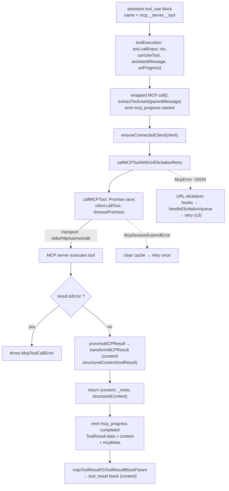

> 一次 MCP 工具调用的端到端路径: 模型发出 `tool_use` → orchestration 调被包装的 MCP `call()` → `client.callTool()` 经 transport 发到 MCP server → server 执行 → result 经 `processMCPResult` 归一化 → `mapToolResultToToolResultBlockParam` 写回 `tool_result` block。[E: services/tools/toolExecution.ts:1207][E: services/mcp/client.ts:3091][E: services/mcp/client.ts:3171][E: services/tools/toolExecution.ts:1292]

本节点是 worked-example trace, 描述「一次具体 MCP tool call 怎么走完」。`MCPTool` 的字段/标志逐项解剖见 [MCPTool 工具节点](../surface/tools/mcp.md); MCP 子系统的 config/transport/connection 生命周期见 [MCP 子系统](../subsystems/mcp.md); 通用工具调度(并发分批、streaming)见 [Tool call anatomy](tool-call-anatomy.md)。

## 能回答的问题

- 一次 MCP 工具调用从 `tool_use` 到 `tool_result` 经过哪些函数?
- `mcp__server__tool` 这种全限定名是怎么映射回真实 server name + tool name 的?
- MCP tool 的结果(content/`_meta`/`structuredContent`)如何被映射回模型可见的 `tool_result`?
- URL elicitation、session 过期、超时这些 MCP 特有决策点在调用链哪一步发生?
- MCP tool call 的 progress(started/progress/completed/failed)从哪里发出?

## 1. 入口:模型 tool_use → orchestration 调 `call()`

模型在一个 turn 中产出 `tool_use` block, 其 `name` 是 MCP tool 的全限定名(默认 `mcp__<server>__<tool>`); orchestration 层在 `executeTool()` 中通过 `tool.call(callInput, context, canUseTool, assistantMessage, onProgress)` 调用该工具的 `call()`。[E: services/tools/toolExecution.ts:1207][E: services/tools/toolExecution.ts:1215] 第 4 个实参 `assistantMessage` 就是含该 `tool_use` block 的 assistant message, 它会以 `parentMessage` 身份传进 MCP `call()`。[E: services/tools/toolExecution.ts:1215][E: services/mcp/client.ts:1837]

这里被调用的 `call()` **不是** `tools/MCPTool/MCPTool.ts` 里的 skeleton(skeleton 的 `call()` 只返回 `{ data: '' }`), 而是 `fetchToolsForClient()` 在把每个 server tool 转成本地 `Tool` 时 spread `...MCPTool` 后覆盖的 runtime wrapper `call()`。[E: tools/MCPTool/MCPTool.ts:51][E: tools/MCPTool/MCPTool.ts:53][E: services/mcp/client.ts:1770][E: services/mcp/client.ts:1833] 通用工具调度(`isConcurrencySafe` 分批、streaming 执行)由 [Tool call anatomy](tool-call-anatomy.md) 处理, 对 MCP tool 而言 `isConcurrencySafe()` 返回 server 的 `readOnlyHint`。[E: services/mcp/client.ts:1795][E: services/mcp/client.ts:1796]

## 2. 名字解析:全限定名 ↔ server/tool 身份

runtime wrapper 闭包里直接捕获了 `client`(server connection)和 `tool`(server 报告的原始 tool 对象), 所以 wrapper 调底层时用的是**原始** `tool.name`, 不需要从全限定名反解。[E: services/mcp/client.ts:1767][E: services/mcp/client.ts:1866] 全限定名由 `buildMcpToolName(client.name, tool.name)` 生成: `mcp__<normalized server>__<normalized tool>`。[E: services/mcp/client.ts:1768][E: services/mcp/mcpStringUtils.ts:50][E: services/mcp/mcpStringUtils.ts:51]

反向解析 `mcpInfoFromString()`(把 `mcp__server__tool` split 回 serverName/toolName)主要服务 permission rule 匹配, 不在 hot-path 调用链上; 它对 server 名含 `__` 的情况会解析错。[E: services/mcp/mcpStringUtils.ts:19][E: services/mcp/mcpStringUtils.ts:23][E: services/mcp/mcpStringUtils.ts:14] wrapper 同时把原始身份存进 `mcpInfo: { serverName, toolName }`, 这样即使 `CLAUDE_AGENT_SDK_MCP_NO_PREFIX` 让 model 用 unprefixed 名调用, permission 仍能依赖 `mcpInfo` 而非显示名。[E: services/mcp/client.ts:1773][E: services/mcp/client.ts:1774]

## 3. wrapper `call()`:toolUseId、meta、started progress

wrapper `call(args, context, _canUseTool, parentMessage, onProgress)` 第一步用 `extractToolUseId(parentMessage)` 取出 tool use id —— 它读 `message.message.content[0]`, 只有当第一个 block 是 `tool_use` 时才返回其 `id`。[E: services/mcp/client.ts:1840][E: services/mcp/client.ts:3247][E: services/mcp/client.ts:3248][E: services/mcp/client.ts:3251] 若有 id, 则构造 `meta = { 'claudecode/toolUseId': toolUseId }` 随调用透传给 server; 没有则空对象。[E: services/mcp/client.ts:1841][E: services/mcp/client.ts:1842] 随后若 `onProgress` 与 `toolUseId` 都在, 发一条 `mcp_progress` status `started`(带 serverName/toolName)。[E: services/mcp/client.ts:1846][E: services/mcp/client.ts:1850][E: services/mcp/client.ts:1851]

整个调用包在 `for (let attempt = 0; ; attempt++)` 里, `MAX_SESSION_RETRIES = 1`: 这是为 session 过期重试预留的循环。[E: services/mcp/client.ts:1859][E: services/mcp/client.ts:1860]

## 4. 确保连接 → elicitation retry 包装层

wrapper 先调 `ensureConnectedClient(client)`: SDK(in-process)server 直接返回, 其它 transport 会 `connectToServer(client.name, client.config)` 拿到 connected client, 拿不到就抛 not-connected error。[E: services/mcp/client.ts:1862][E: services/mcp/client.ts:1688][E: services/mcp/client.ts:1692][E: services/mcp/client.ts:1696][E: services/mcp/client.ts:1698] 然后进入 `callMCPToolWithUrlElicitationRetry(...)`, 传入 connected client、原始 `tool.name`、`args`、`meta`、`context.abortController.signal`、progress bridge 和 `context.handleElicitation`。[E: services/mcp/client.ts:1863][E: services/mcp/client.ts:1866][E: services/mcp/client.ts:1867][E: services/mcp/client.ts:1868][E: services/mcp/client.ts:1869][E: services/mcp/client.ts:1880]

`callMCPToolWithUrlElicitationRetry()` 本体是另一个 `for` 循环(`MAX_URL_ELICITATION_RETRIES = 3`): 它把实际调用委托给 `callToolFn`(默认 `callMCPTool`), 正常返回就直接返回; 只有 catch 到 `McpError` 且 `error.code === ErrorCode.UrlElicitationRequired`(-32042)时才进入 elicitation 分支, 其它错误原样 rethrow。[E: services/mcp/client.ts:2850][E: services/mcp/client.ts:2851][E: services/mcp/client.ts:2853][E: services/mcp/client.ts:2865][E: services/mcp/client.ts:2866][E: services/mcp/client.ts:2868] 这一层是 MCP 特有的 —— 普通本地工具没有「让用户先打开 URL 才能完成」这种 path。详见 [§关键决策点 · URL elicitation](#关键决策点)。

## 5. `callMCPTool`:Promise.race 发请求到 transport

`callMCPTool()` 是真正打到 MCP server 的地方。它用 `Promise.race([client.callTool(...), timeoutPromise])` 同时跑 SDK 调用和一个本地超时, 防止 SSE 流中断时 SDK 自带超时失效。[E: services/mcp/client.ts:3068][E: services/mcp/client.ts:3091][E: services/mcp/client.ts:3092][E: services/mcp/client.ts:3117] `client.callTool()` 的 payload 是 `{ name: tool, arguments: args, _meta: meta }`(`CallToolResultSchema` 校验返回), options 带 `signal`、`timeout`、`onprogress`。[E: services/mcp/client.ts:3092][E: services/mcp/client.ts:3094][E: services/mcp/client.ts:3095][E: services/mcp/client.ts:3096][E: services/mcp/client.ts:3098][E: services/mcp/client.ts:3100][E: services/mcp/client.ts:3101] SDK 的 progress 回调被映射成 `mcp_progress` status `progress`, 带 `progress`/`total`/`progressMessage`。[E: services/mcp/client.ts:3102][E: services/mcp/client.ts:3105][E: services/mcp/client.ts:3109][E: services/mcp/client.ts:3110][E: services/mcp/client.ts:3111]

具体经哪种 transport(stdio / http / sse / ws / in-process SDK)发出去, 由 connection 在 `connectToServer()` 建立时决定; 本 trace 之上的 transport 选择见 [MCP 子系统 · 控制流](../subsystems/mcp.md)。timeout 由 `getMcpToolTimeoutMs()` 给出: 默认 `DEFAULT_MCP_TOOL_TIMEOUT_MS = 100_000_000` ms(约 27.8 小时, 等价于「基本不超时」), 可由 `MCP_TOOL_TIMEOUT` env 覆盖。[E: services/mcp/client.ts:3070][E: services/mcp/client.ts:211][E: services/mcp/client.ts:224][E: services/mcp/client.ts:226]

## 6. server 执行 → 结果/错误映射

server 返回后, `callMCPTool()` 先看 `'isError' in result && result.isError`: 若是, 从 `result.content[0].text`(或 legacy `result.error`)取错误文本, 抛 `McpToolCallError_...`(并把 `_meta` 透传)。[E: services/mcp/client.ts:3124][E: services/mcp/client.ts:3131][E: services/mcp/client.ts:3137][E: services/mcp/client.ts:3144][E: services/mcp/client.ts:3147] 成功则调 `processMCPResult(result, tool, name)` 归一化 content, 并返回 `{ content, _meta, structuredContent }`。[E: services/mcp/client.ts:3171][E: services/mcp/client.ts:3173][E: services/mcp/client.ts:3174][E: services/mcp/client.ts:3175]

`processMCPResult()` 内部先调 `transformMCPResult()`, 它按优先级识别三种返回形态: 含 `toolResult` 字段 → 转字符串; 含 `structuredContent` → `jsonStringify`; 含 `content` 数组 → 逐 item transform 后 flat。三者都不匹配则抛 `unexpected response format`。[E: services/mcp/client.ts:2662][E: services/mcp/client.ts:2668][E: services/mcp/client.ts:2676][E: services/mcp/client.ts:2686][E: services/mcp/client.ts:2700][E: services/mcp/client.ts:2702] 归一化后, `ide` server 的结果不进大输出处理直接返回; 否则按需 truncation 或落盘(含 image 的内容回退 truncation, 以保住图片压缩与可视性)。[E: services/mcp/client.ts:2729][E: services/mcp/client.ts:2734][E: services/mcp/client.ts:2747][E: services/mcp/client.ts:2758][E: services/mcp/client.ts:2764][E: services/mcp/client.ts:2773]

## 7. 回到 wrapper:completed progress、ToolResult、tool_result block

回到 wrapper `call()`: 成功后(若有 progress)发 `mcp_progress` status `completed`(带 `elapsedTimeMs`), 然后返回 `ToolResult`: `data: mcpResult.content`, 并在 `_meta` 或 `structuredContent` 存在时附加 `mcpMeta`(把 `_meta`/`structuredContent` 透传给 SDK/hook 消费者)。[E: services/mcp/client.ts:1884][E: services/mcp/client.ts:1889][E: services/mcp/client.ts:1897][E: services/mcp/client.ts:1898][E: services/mcp/client.ts:1899][E: services/mcp/client.ts:1900] 模型可见的部分始终只来自 `data`(processed content), `mcpMeta` 不进 model context。[E: services/mcp/client.ts:1898][E: tools/MCPTool/MCPTool.ts:74][I]

orchestration 层拿到 `ToolResult` 后, 调 `tool.mapToolResultToToolResultBlockParam(result.data, toolUseID)` 把它映射成 API 的 `tool_result` block。[E: services/tools/toolExecution.ts:1292][E: services/tools/toolExecution.ts:1293] MCPTool 的该方法是直通的: `{ tool_use_id: toolUseID, type: 'tool_result', content }` —— 即把 processed content 原样塞进 `tool_result.content`。[E: tools/MCPTool/MCPTool.ts:70][E: tools/MCPTool/MCPTool.ts:71][E: tools/MCPTool/MCPTool.ts:72][E: tools/MCPTool/MCPTool.ts:74] 这条 `tool_result` 随后进入下一轮 model 请求, 闭合 turn(turn 级循环见 [Tool call anatomy](tool-call-anatomy.md))。

## 关键决策点

- **server / tool 解析**: 不靠从全限定名反解, 而靠 wrapper 闭包捕获的 `client` + 原始 `tool`; 全限定名只用于 model 展示与 permission 匹配。[E: services/mcp/client.ts:1767][E: services/mcp/client.ts:1768][E: services/mcp/client.ts:1866]
- **URL elicitation (`-32042`)**: server 可回 `UrlElicitationRequired`, 表示需用户先打开 URL。`callMCPToolWithUrlElicitationRetry()` 校验 `error.data.elicitations`, 先跑 `runElicitationHooks`(hook 可程序化 accept/decline), 没 hook 处理则 print/SDK 模式走 `handleElicitation` 回调、REPL 模式 push 进 `setAppState` 的 elicitation queue 等用户; 非 accept 返回说明文本, accept 则回 retry loop, 最多 3 次。[E: services/mcp/client.ts:2865][E: services/mcp/client.ts:2876][E: services/mcp/client.ts:2886][E: services/mcp/client.ts:2924][E: services/mcp/client.ts:2945][E: services/mcp/client.ts:2947][E: services/mcp/client.ts:2964][E: services/mcp/client.ts:3008][E: services/mcp/client.ts:2872]
- **session 过期**: `callMCPTool()` catch 到 404/-32001 或 http/claudeai-proxy 上的 `-32000 Connection closed` 时, `clearServerCache()` 后抛 `McpSessionExpiredError`; wrapper 的 `attempt < MAX_SESSION_RETRIES(=1)` 分支据此用全新 client 重试一次。[E: services/mcp/client.ts:3217][E: services/mcp/client.ts:3218][E: services/mcp/client.ts:3223][E: services/mcp/client.ts:3229][E: services/mcp/client.ts:3230][E: services/mcp/client.ts:1914][E: services/mcp/client.ts:1915][E: services/mcp/client.ts:1921]
- **auth (401)**: tool call 返回 401 或 `UnauthorizedError` 时, 抛 `McpAuthError`(server 需重新授权), 不在本 hot-path 内静默处理。[E: services/mcp/client.ts:3196][E: services/mcp/client.ts:3198][E: services/mcp/client.ts:3204]
- **content block 映射**: `transformMCPResult` 决定 content 形态(toolResult/structuredContent/contentArray), `processMCPResult` 决定大输出走 truncation 还是落盘, 最后 `mapToolResultToToolResultBlockParam` 把它原样写进 `tool_result.content`。[E: services/mcp/client.ts:2668][E: services/mcp/client.ts:2675][E: services/mcp/client.ts:2686][E: services/mcp/client.ts:2734][E: tools/MCPTool/MCPTool.ts:74]
- **失败 telemetry**: 非 `TelemetrySafeError` 的 generic `Error`/`McpError` 在 wrapper 末尾被包装成 telemetry-safe error(因为 MCP 协议层错误不含用户文件路径/代码), 并先发 `failed` progress。[E: services/mcp/client.ts:1925][E: services/mcp/client.ts:1942][E: services/mcp/client.ts:1948][E: services/mcp/client.ts:1950][E: services/mcp/client.ts:1962]

## 指向深挖

- [MCPTool 工具节点](../surface/tools/mcp.md) —— `MCPTool` skeleton 与 runtime wrapper 的字段/标志/schema/权限逐项解剖。
- [MCP 子系统](../subsystems/mcp.md) —— config precedence、transport 建立、connection 生命周期、list_changed 刷新、OAuth/XAA。
- [Tool call anatomy](tool-call-anatomy.md) —— 通用工具调度: `isConcurrencySafe` 分批、`StreamingToolExecutor`、`ToolResult` 回主循环。

## Sources

- `services/tools/toolExecution.ts`
- `services/mcp/client.ts`
- `services/mcp/mcpStringUtils.ts`
- `tools/MCPTool/MCPTool.ts`

## 相关

- [MCPTool 工具节点](../surface/tools/mcp.md)
- [MCP 子系统](../subsystems/mcp.md)
- [Tool call anatomy](tool-call-anatomy.md)
