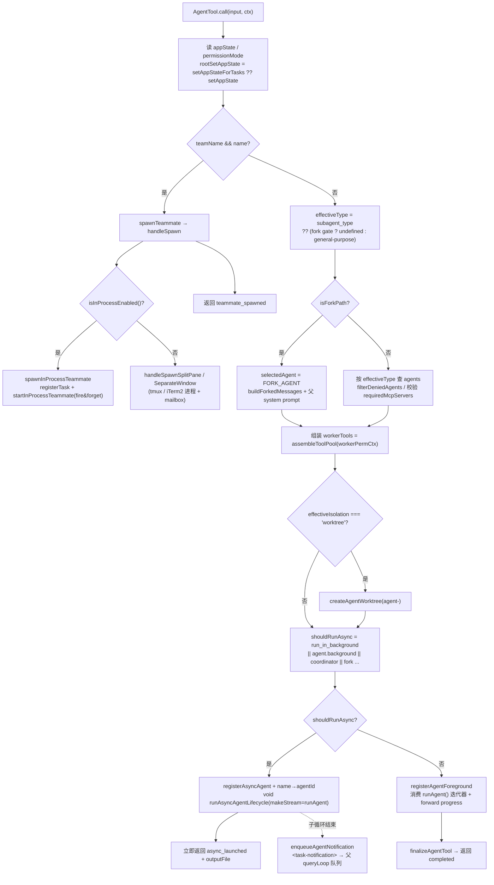

这是一篇 worked-example:跟着一次 `Agent`(legacy 名 `Task`)工具调用,看 `AgentTool.call()` 如何解析 agentType、选 teammate / fork / sync / async / worktree / remote 分支,把 worker 工具池组装好,调 `runAgent()` 跑子 agent 自己的 `query()` 循环,最后把结果或 `<task-notification>` 回流父 agent loop。[E: tools/AgentTool/AgentTool.tsx:239][E: tools/AgentTool/runAgent.ts:248][E: tools/AgentTool/runAgent.ts:748]

## 能回答的问题

- 一次 `Agent` 工具调用从 `call()` 到子 agent 真正跑起来,中间经过哪些分支判断?
- subagent / teammate / fork / async / worktree 这些路径在源码里是哪几个 `if` 决定的?
- 子 agent 的 system prompt、工具池、permission mode、abortController 在哪里构造?
- sync agent 的结果怎么作为 `completed` 返回父 loop,async agent 怎么靠 `<task-notification>` 回流?
- in-process teammate 和普通 subagent 最终是不是同一个 `runAgent()`?

## 1. 入口:`AgentTool.call()` 解参与状态

`AgentTool.call({prompt, subagent_type, description, model, run_in_background, name, team_name, mode, isolation, cwd}, toolUseContext, canUseTool, assistantMessage, onProgress?)` 是单一入口。[E: tools/AgentTool/AgentTool.tsx:239] 它先记 `startTime`,在 coordinator mode 下把 `model` 清成 `undefined`,从 `toolUseContext.getAppState()` 取 `permissionMode`,并解析 `rootSetAppState = toolUseContext.setAppStateForTasks ?? toolUseContext.setAppState`(in-process teammate 拿到的 `setAppState` 是 no-op,所以任务注册必须走 `setAppStateForTasks` 才能到达 root store)。[E: tools/AgentTool/AgentTool.tsx:251][E: tools/AgentTool/AgentTool.tsx:252][E: tools/AgentTool/AgentTool.tsx:255][E: tools/AgentTool/AgentTool.tsx:256][E: tools/AgentTool/AgentTool.tsx:259]

随后做三道前置守卫:`team_name` 但 swarm 未启用 → 抛错;`isTeammate() && teamName && name`(teammate 想再生 teammate)→ 抛错;`isInProcessTeammate() && teamName && run_in_background === true` → 抛错。[E: tools/AgentTool/AgentTool.tsx:262][E: tools/AgentTool/AgentTool.tsx:272][E: tools/AgentTool/AgentTool.tsx:278]

## 2. 决策点 A:teammate 分支(`teamName && name`)

如果 `teamName && name` 同时成立(`teamName` 由 `resolveTeamName` 从参数或 current team context 得到),这是一次 multi-agent spawn:先按 `subagent_type` 找 agent definition 设置 grouped UI 颜色,再调 `spawnTeammate({...})`,把返回 data 包成 `status: 'teammate_spawned'` 返回。[E: tools/AgentTool/AgentTool.tsx:269][E: tools/AgentTool/AgentTool.tsx:284][E: tools/AgentTool/AgentTool.tsx:286][E: tools/AgentTool/AgentTool.tsx:290][E: tools/AgentTool/AgentTool.tsx:306]

`spawnTeammate(config, context)` 直接转 `handleSpawn(config, context)`。[E: tools/shared/spawnMultiAgent.ts:1088][E: tools/shared/spawnMultiAgent.ts:1092] `handleSpawn` 按 backend 路由:`isInProcessEnabled()` 为真(或 pane backend 检测失败且处于 auto 模式时 fallback)走 `handleSpawnInProcess`,否则按 `use_splitpane` 走 `handleSpawnSplitPane` / `handleSpawnSeparateWindow`。[E: tools/shared/spawnMultiAgent.ts:1040][E: tools/shared/spawnMultiAgent.ts:1045][E: tools/shared/spawnMultiAgent.ts:1068][E: tools/shared/spawnMultiAgent.ts:1074][E: tools/shared/spawnMultiAgent.ts:1077]

in-process 路径:`handleSpawnInProcess` 调 `spawnInProcessTeammate(config, context)` 创建独立 `AbortController`、`TeammateIdentity`、teammate context 和 `InProcessTeammateTaskState`,再 `registerTask(taskState, setAppState)` 把任务登记进后台任务系统。[E: utils/swarm/spawnInProcess.ts:104][E: utils/swarm/spawnInProcess.ts:122][E: utils/swarm/spawnInProcess.ts:128][E: utils/swarm/spawnInProcess.ts:139][E: utils/swarm/spawnInProcess.ts:157][E: utils/swarm/spawnInProcess.ts:191] spawn 成功后,`handleSpawnInProcess` 以 fire-and-forget 调 `startInProcessTeammate({...})` 真正启动 teammate 的执行循环。[E: tools/shared/spawnMultiAgent.ts:899][E: tools/shared/spawnMultiAgent.ts:912] 该 runner 最终也进入 `runAgent()`——与普通 subagent 同一个函数(第 6 节)。[E: utils/swarm/inProcessRunner.ts:48][E: utils/swarm/inProcessRunner.ts:1175] [I] in-process teammate 的 prompt **不**走 mailbox 初始消息,而 tmux/iTerm2 进程路径会把初始 prompt 写入 mailbox。[E: tools/shared/spawnMultiAgent.ts:1011]

## 3. 决策点 B:agentType 解析(fork vs 普通 subagent)

非 teammate 路径先算 `effectiveType = subagent_type ?? (isForkSubagentEnabled() ? undefined : GENERAL_PURPOSE_AGENT.agentType)`,`isForkPath = effectiveType === undefined`。即:显式 `subagent_type` 永远优先;省略时 fork gate 开走 fork、关用 general-purpose。[E: tools/AgentTool/AgentTool.tsx:322][E: tools/AgentTool/AgentTool.tsx:323]

- fork 分支:`selectedAgent = FORK_AGENT`,但先有递归守卫——若 `querySource === agent:builtin:<FORK_AGENT.agentType>` 或 `isInForkChild(messages)`,抛 "Fork is not available inside a forked worker"。[E: tools/AgentTool/AgentTool.tsx:332][E: tools/AgentTool/AgentTool.tsx:335]
- 普通分支:从 `agentDefinitions.activeAgents` 经 `filterDeniedAgents(...)`(若有 `allowedAgentTypes` 则先收窄)过滤后按 `effectiveType` 查找;查不到时区分 "被 deny rule 拒绝" 与 "不存在" 两种报错。[E: tools/AgentTool/AgentTool.tsx:342][E: tools/AgentTool/AgentTool.tsx:345][E: tools/AgentTool/AgentTool.tsx:350][E: tools/AgentTool/AgentTool.tsx:353]

选定 `selectedAgent` 后再校验:in-process teammate 不能生 `background: true` 的 agent;`selectedAgent.requiredMcpServers` 有要求时,等待 pending MCP server 连接(最多 30s)并核对 "有 tools 的 server",不满足就抛错。[E: tools/AgentTool/AgentTool.tsx:361][E: tools/AgentTool/AgentTool.tsx:367][E: tools/AgentTool/AgentTool.tsx:371][E: tools/AgentTool/AgentTool.tsx:406]

## 4. 决策点 C:remote isolation(external build 不可达)

`effectiveIsolation = isolation ?? selectedAgent.isolation`。[E: tools/AgentTool/AgentTool.tsx:431] remote 分支被 `"external" === 'ant'` guard 包住——在当前 external build 里这是常假条件,整块代码被 dead-code elimination,所以普通构建不会 teleport 到 CCR。[E: tools/AgentTool/AgentTool.tsx:435] (若可达,它会 `checkRemoteAgentEligibility` → `teleportToRemote` → `registerRemoteAgentTask`,返回 `remote_launched`。[E: tools/AgentTool/AgentTool.tsx:436][E: tools/AgentTool/AgentTool.tsx:442][E: tools/AgentTool/AgentTool.tsx:456][E: tools/AgentTool/AgentTool.tsx:470])

## 5. 构造 prompt、worker 工具池、worktree;决策点 D:async vs sync

system prompt 与 prompt messages 按 fork 分支:fork 继承父 system prompt(cache-identical)并用 `buildForkedMessages(prompt, assistantMessage)`;普通路径用 `selectedAgent.getSystemPrompt({toolUseContext})` 经 `enhanceSystemPromptWithEnvDetails(...)`,prompt 用单条 `createUserMessage({content: prompt})`。[E: tools/AgentTool/AgentTool.tsx:495][E: tools/AgentTool/AgentTool.tsx:512][E: tools/AgentTool/AgentTool.tsx:518][E: tools/AgentTool/AgentTool.tsx:534][E: tools/AgentTool/AgentTool.tsx:538]

**worker 工具池独立于父**:`workerPermissionContext = {...appState.toolPermissionContext, mode: selectedAgent.permissionMode ?? 'acceptEdits'}`,再 `workerTools = assembleToolPool(workerPermissionContext, appState.mcp.tools)`——所以子 agent 的工具不受父的 tool restriction 影响。[E: tools/AgentTool/AgentTool.tsx:573][E: tools/AgentTool/AgentTool.tsx:577] (`assembleToolPool` 的合并 / 去重语义见 [工具系统机制](../subsystems/tool-system.md)。)

worktree:`earlyAgentId = createAgentId()` 先建稳定 ID;若 `effectiveIsolation === 'worktree'`,`createAgentWorktree('agent-' + earlyAgentId.slice(0,8))`。[E: tools/AgentTool/AgentTool.tsx:580][E: tools/AgentTool/AgentTool.tsx:590][E: tools/AgentTool/AgentTool.tsx:592]

**async 判定**:`shouldRunAsync = (run_in_background === true || selectedAgent.background === true || isCoordinator || forceAsync || assistantForceAsync || isProactiveActive()) && !isBackgroundTasksDisabled`,其中 `forceAsync = isForkSubagentEnabled()`(fork 实验强制所有 spawn 异步)。[E: tools/AgentTool/AgentTool.tsx:557][E: tools/AgentTool/AgentTool.tsx:567]

`runAgentParams` 在此统一组装:fork 路径传 `useExactTools: true` + 父的 `tools` 数组 + `forkContextMessages: toolUseContext.messages`;普通路径传 `availableTools: workerTools`;有 cwd / worktree override 时跳过预建 system prompt 让 runAgent 在 `wrapWithCwd` 内重建。[E: tools/AgentTool/AgentTool.tsx:603][E: tools/AgentTool/AgentTool.tsx:622][E: tools/AgentTool/AgentTool.tsx:627][E: tools/AgentTool/AgentTool.tsx:630]

## 6. 子循环:`runAgent()` 跑子 agent 自己的 `query()`

`runAgent({...})` 是 **async generator**(`export async function* runAgent`)。[E: tools/AgentTool/runAgent.ts:248] 它初始化 agent 专属 MCP server、解析 worker tools、构造 agent system prompt、决定 abortController、跑 `SubagentStart` hooks,然后用 `createSubagentContext(...)` 建子上下文,最后 `for await (const message of query({...}))` 消费通用 loop。[E: tools/AgentTool/runAgent.ts:500][E: tools/AgentTool/runAgent.ts:508][E: tools/AgentTool/runAgent.ts:524][E: tools/AgentTool/runAgent.ts:532][E: tools/AgentTool/runAgent.ts:700][E: tools/AgentTool/runAgent.ts:748] 这个内层 `query()` 就是 [Agent loop](agent-loop.md) 同一个通用循环,只是上下文换成子 agent 的 messages / system prompt / tools。[E: tools/AgentTool/runAgent.ts:748]

**abortController 与隔离是 sync/async 的关键差异**:abortController 选择为 `override?.abortController ? override : isAsync ? new AbortController() : toolUseContext.abortController`——async agent 拿全新、**不链接**父的 controller(用户按 ESC 取消主线程时它继续存活,只能显式 kill)。[E: tools/AgentTool/runAgent.ts:524][E: tools/AgentTool/AgentTool.tsx:688] `createSubagentContext` 中 sync agent `shareSetAppState: !isAsync` 为 true 共享父 `setAppState`,async agent 拿 no-op `setAppState`(但 `setAppStateForTasks` 仍到 root store)。[E: tools/AgentTool/runAgent.ts:709][E: utils/forkedAgent.ts:410][E: utils/forkedAgent.ts:416]

循环里:`stream_event` 的 TTFT 转发父 metrics 后 `continue`;`attachment` 中 `max_turns_reached` 直接 `break`,其余 `yield`;`isRecordableMessage` 的消息先 `recordSidechainTranscript([message], agentId, lastRecordedUuid)` 再 `yield`(这些 yield 出去的消息正是父侧消费的)。[E: tools/AgentTool/runAgent.ts:761][E: tools/AgentTool/runAgent.ts:773][E: tools/AgentTool/runAgent.ts:788][E: tools/AgentTool/runAgent.ts:792][E: tools/AgentTool/runAgent.ts:804] `finally` 块在正常 / abort / 错误下都清理 MCP、session hooks、prompt cache tracking 等。[E: tools/AgentTool/runAgent.ts:816][E: tools/AgentTool/runAgent.ts:818]

## 7. 结果回流(A):async 路径 → `<task-notification>`

async 分支:`asyncAgentId = earlyAgentId`,`registerAsyncAgent({...})` 登记后台任务;若有 `name`,把 `name → agentId` 写入 `agentNameRegistry`(供 SendMessage 路由)。[E: tools/AgentTool/AgentTool.tsx:687][E: tools/AgentTool/AgentTool.tsx:688][E: tools/AgentTool/AgentTool.tsx:703] 然后 **fire-and-forget** `void runWithAgentContext(..., () => wrapWithCwd(() => runAsyncAgentLifecycle({taskId, abortController, makeStream: onCacheSafeParams => runAgent({...}), ...})))`,并**立即**返回 `status: 'async_launched'` + `outputFile` + `canReadOutputFile`,不等子 agent 完成。[E: tools/AgentTool/AgentTool.tsx:733][E: tools/AgentTool/AgentTool.tsx:736][E: tools/AgentTool/AgentTool.tsx:754]

`runAsyncAgentLifecycle` 在后台 `for await (const message of makeStream(...))` 消费子 agent 流,把消息累进 `agentMessages` 与 task state、更新进度;流结束后 `finalizeAgentTool(agentMessages, taskId, metadata)` → `completeAsyncAgent(...)` 标记完成 → `enqueueAgentNotification({taskId, status: 'completed', finalMessage, usage, ...})`。[E: tools/AgentTool/agentToolUtils.ts:554][E: tools/AgentTool/agentToolUtils.ts:597][E: tools/AgentTool/agentToolUtils.ts:603][E: tools/AgentTool/agentToolUtils.ts:624] abort / 错误分支分别走 `killAsyncAgent` / `failAsyncAgent` 并 enqueue `killed` / `failed` 通知。[E: tools/AgentTool/agentToolUtils.ts:645][E: tools/AgentTool/agentToolUtils.ts:659][E: tools/AgentTool/agentToolUtils.ts:671]

`enqueueAgentNotification` 原子检查 `notified` 防重复,拼出 `<task-notification>...<result>...</result><usage>...</usage></task-notification>` 文本,调 `enqueuePendingNotification({value, mode: 'task-notification'})` 把它排进待处理通知。[E: tasks/LocalAgentTask/LocalAgentTask.tsx:228][E: tasks/LocalAgentTask/LocalAgentTask.tsx:252][E: tasks/LocalAgentTask/LocalAgentTask.tsx:258] [I] 之后该通知作为 queued command 在父 `queryLoop` 下一轮被取出注入(参见 [Agent loop](agent-loop.md) 的 "queued commands" 处理),具体取出行号未逐行核到,标 [I]。

## 8. 结果回流(B):sync 路径 → `completed`

sync 分支:`syncAgentId = asAgentId(earlyAgentId)`,在 `runWithAgentContext(..., wrapWithCwd(async () => {...}))` 内执行。[E: tools/AgentTool/AgentTool.tsx:767][E: tools/AgentTool/AgentTool.tsx:785] 先 `registerAgentForeground({...})` 登记前台任务并拿到 `backgroundSignal`(任务可中途被转后台)。[E: tools/AgentTool/AgentTool.tsx:819] 主体是 `while (true)` 循环:`agentIterator.next()` 与 `backgroundPromise` `Promise.race`;非 background 时取 `result.value` 推入 `agentMessages`,`updateProgressFromMessage` 更新进度,把 `bash_progress` / `tool_use` / `tool_result` 经 `onProgress` 转发给父(SDK / VS Code panel)。[E: tools/AgentTool/AgentTool.tsx:846][E: tools/AgentTool/AgentTool.tsx:885][E: tools/AgentTool/AgentTool.tsx:886][E: tools/AgentTool/AgentTool.tsx:1063][E: tools/AgentTool/AgentTool.tsx:1065][E: tools/AgentTool/AgentTool.tsx:1084][E: tools/AgentTool/AgentTool.tsx:1111] `result.done` 时 break。[E: tools/AgentTool/AgentTool.tsx:1063]

循环结束后 `finalizeAgentTool(agentMessages, syncAgentId, metadata)`,返回 `{data: {status: 'completed', prompt, ...agentResult, ...worktreeResult}}`——这是父 loop 当轮 `tool_result` 的来源。[E: tools/AgentTool/AgentTool.tsx:1235][E: tools/AgentTool/AgentTool.tsx:1253][E: tools/AgentTool/AgentTool.tsx:1255] 若中途被转后台,则改走 fire-and-forget 后台续跑并返回 `async_launched`。[E: tools/AgentTool/AgentTool.tsx:897][E: tools/AgentTool/AgentTool.tsx:911][E: tools/AgentTool/AgentTool.tsx:1044]

## 9. 结果映射:`mapToolResultToToolResultBlockParam`

无论哪条分支,返回的 `data.status` 最终由 `mapToolResultToToolResultBlockParam(data, toolUseID)` 转成模型可见的 `tool_result` 文本:`teammate_spawned` → "Spawned successfully + agent_id / mailbox";`remote_launched` → "Remote agent launched in CCR";`async_launched` → "Async agent launched + 用 SendMessage(to: agentId) 续";`completed` → subagent content(空内容时补占位符,one-shot 内建 `Explore`/`Plan` 省 agentId/usage trailer)。[E: tools/AgentTool/AgentTool.tsx:1298][E: tools/AgentTool/AgentTool.tsx:1301][E: tools/AgentTool/AgentTool.tsx:1316][E: tools/AgentTool/AgentTool.tsx:1327][E: tools/AgentTool/AgentTool.tsx:1340][E: tools/AgentTool/AgentTool.tsx:1356]

## 指向深挖

- 工具 schema 字段 / 行为标志 / 权限逐项:[Agent tool](../surface/tools/agent.md)。
- 多 agent 任务状态、coordinator mode、backend 选择(tmux / iTerm2 / in-process):[多 agent 与 Swarm](../subsystems/swarm.md)。
- 子 agent 内层 `query()` / `queryLoop()` 单轮细节:[Agent loop](agent-loop.md)。
- worker 工具池如何合并 built-in 与 MCP、去重、排序:[工具系统机制](../subsystems/tool-system.md)。
- worker permission mode、deny rule 过滤的细粒度决策:[权限系统](../subsystems/permissions.md)。

## Sources

- `tools/AgentTool/AgentTool.tsx`
- `tools/AgentTool/runAgent.ts`
- `tools/AgentTool/agentToolUtils.ts`
- `tools/shared/spawnMultiAgent.ts`
- `utils/swarm/spawnInProcess.ts`
- `utils/swarm/inProcessRunner.ts`
- `utils/forkedAgent.ts`
- `tasks/LocalAgentTask/LocalAgentTask.tsx`

## 相关

- [Agent tool](../surface/tools/agent.md)
- [多 agent 与 Swarm](../subsystems/swarm.md)
- [Agent loop](agent-loop.md)
- [工具系统机制](../subsystems/tool-system.md)
- [权限系统](../subsystems/permissions.md)
