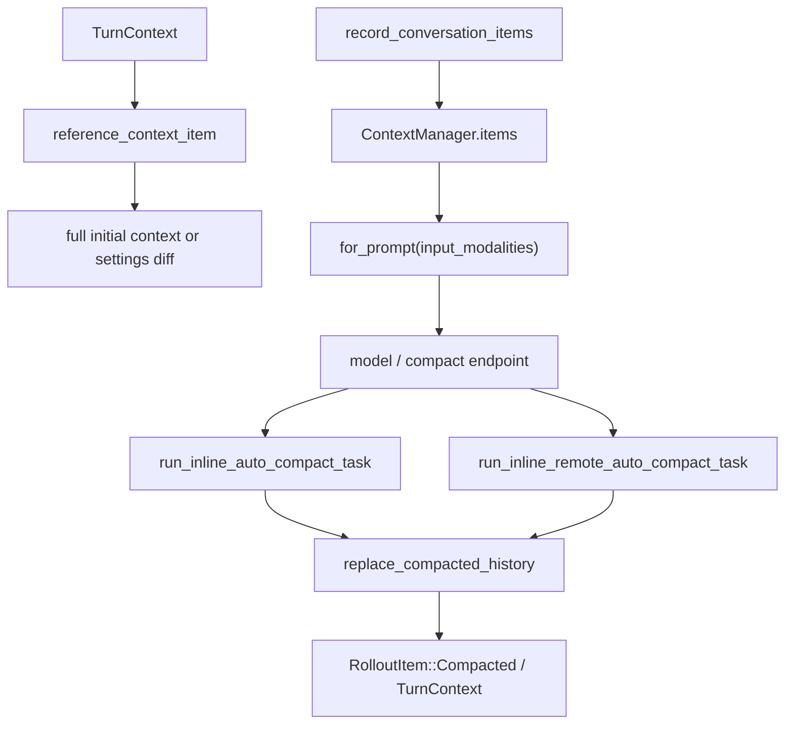

> Context system 用 `ContextManager` 保存 model-visible history、token info 和 settings diff baseline；compaction 在 pre-turn 或 mid-turn 把历史替换成 compacted history，并把 replacement 通过 rollout 持久化。[E: codex-rs/core/src/context_manager/history.rs:34][E: codex-rs/core/src/context_manager/history.rs:39][E: codex-rs/core/src/context_manager/history.rs:50][E: codex-rs/core/src/session/mod.rs:2781][E: codex-rs/core/src/session/mod.rs:2792]

## 能回答的问题

- `ContextManager` 保存哪些 state？
- history 发送模型前如何 normalize 和按 modality 过滤？
- `reference_context_item` 如何驱动 full context 与 settings diff？
- local compaction 与 remote compaction 的边界是什么？
- compaction 后 rollout、token usage、pending session start 如何更新？

## 端到端步骤

1. `ContextManager` 的核心 state 是 ordered `items`、`history_version`、`token_info` 和 `reference_context_item`；`new` 初始化空 history、`history_version = 0` 和空 baseline。[E: codex-rs/core/src/context_manager/history.rs:34][E: codex-rs/core/src/context_manager/history.rs:36][E: codex-rs/core/src/context_manager/history.rs:38][E: codex-rs/core/src/context_manager/history.rs:39][E: codex-rs/core/src/context_manager/history.rs:50][E: codex-rs/core/src/context_manager/history.rs:54]
2. `record_items` 只记录 API-message items；每个保留项经过 `process_item` 后追加到 history。[E: codex-rs/core/src/context_manager/history.rs:91][E: codex-rs/core/src/context_manager/history.rs:98][E: codex-rs/core/src/context_manager/history.rs:102][E: codex-rs/core/src/context_manager/history.rs:103]
3. `for_prompt` 是发送模型前的边界：它调用 `normalize_history(input_modalities)`，并在模型不支持 image input 时剥离 message/tool output 中的 images。[E: codex-rs/core/src/context_manager/history.rs:107][E: codex-rs/core/src/context_manager/history.rs:111][E: codex-rs/core/src/context_manager/history.rs:112]
4. regular turn 开头，`run_turn` 调 `record_context_updates_and_set_reference_context_item`；该函数在 baseline 为空时 build full initial context，否则 build settings update items。[E: codex-rs/core/src/session/turn.rs:162][E: codex-rs/core/src/session/mod.rs:3206][E: codex-rs/core/src/session/mod.rs:3214][E: codex-rs/core/src/session/mod.rs:3215][E: codex-rs/core/src/session/mod.rs:3219]
5. `build_settings_update_items` 可生成 environment update、model instructions update、permissions update、collaboration mode update、realtime update 和 personality update。[E: codex-rs/core/src/context_manager/updates.rs:214][E: codex-rs/core/src/context_manager/updates.rs:226][E: codex-rs/core/src/context_manager/updates.rs:230][E: codex-rs/core/src/context_manager/updates.rs:231][E: codex-rs/core/src/context_manager/updates.rs:232][E: codex-rs/core/src/context_manager/updates.rs:233][E: codex-rs/core/src/context_manager/updates.rs:234]
6. `record_context_updates_and_set_reference_context_item` 即使没有 model-visible diff，也会持久化 `RolloutItem::TurnContext` 并更新 in-memory baseline。[E: codex-rs/core/src/session/mod.rs:3222][E: codex-rs/core/src/session/mod.rs:3227][E: codex-rs/core/src/session/mod.rs:3229][E: codex-rs/core/src/session/mod.rs:3234]
7. `run_pre_sampling_compact` 在 sampling 前检查 token status；token limit reached 时以 `InitialContextInjection::DoNotInject` 运行 pre-turn auto compact。[E: codex-rs/core/src/session/turn.rs:799][E: codex-rs/core/src/session/turn.rs:805][E: codex-rs/core/src/session/turn.rs:807][E: codex-rs/core/src/session/turn.rs:812][E: codex-rs/core/src/session/turn.rs:814]
8. sampling 后若 token limit reached 且仍需 follow-up，`run_turn` 以 `InitialContextInjection::BeforeLastUserMessage` 和 `CompactionPhase::MidTurn` 运行 auto compact。[E: codex-rs/core/src/session/turn.rs:305][E: codex-rs/core/src/session/turn.rs:306][E: codex-rs/core/src/session/turn.rs:310][E: codex-rs/core/src/session/turn.rs:312]
9. `run_auto_compact` 根据 provider 和 feature 选择 remote v2、remote 或 local compaction implementation。[E: codex-rs/core/src/session/turn.rs:907][E: codex-rs/core/src/session/turn.rs:915][E: codex-rs/core/src/session/turn.rs:926][E: codex-rs/core/src/session/turn.rs:942][E: codex-rs/core/src/session/turn.rs:957]
10. local auto compact 构造 compact prompt，调用 `run_compact_task_inner`；manual compact 会先发送 `TurnStarted` 再进入同一 inner path。[E: codex-rs/core/src/compact.rs:73][E: codex-rs/core/src/compact.rs:80][E: codex-rs/core/src/compact.rs:92][E: codex-rs/core/src/compact.rs:105][E: codex-rs/core/src/compact.rs:110][E: codex-rs/core/src/compact.rs:118]
11. local compaction inner 克隆 history，把 compact prompt 记录进临时 history，然后用新的 `ModelClientSession` streaming 生成 summary；context window exceeded 时移除最老 history item 后重试。[E: codex-rs/core/src/compact.rs:202][E: codex-rs/core/src/compact.rs:214][E: codex-rs/core/src/compact.rs:215][E: codex-rs/core/src/compact.rs:222][E: codex-rs/core/src/compact.rs:260][E: codex-rs/core/src/compact.rs:266]
12. local compaction 用 summary 和 user messages 构造 replacement history；mid-turn 模式会把 initial context 插到最后一个真实 user message 或 summary 前，并保存当前 turn snapshot 作为新的 baseline。[E: codex-rs/core/src/compact.rs:298][E: codex-rs/core/src/compact.rs:304][E: codex-rs/core/src/compact.rs:307][E: codex-rs/core/src/compact.rs:311][E: codex-rs/core/src/compact.rs:315]
13. remote compaction 使用 `history.for_prompt`、`built_tools` 和 `tool_router.model_visible_specs()` 构造 Compact endpoint prompt，再调用 `model_client.compact_conversation_history`。[E: codex-rs/core/src/compact_remote.rs:219][E: codex-rs/core/src/compact_remote.rs:220][E: codex-rs/core/src/compact_remote.rs:226][E: codex-rs/core/src/compact_remote.rs:228][E: codex-rs/core/src/compact_remote.rs:240][E: codex-rs/core/src/compact_remote.rs:243]
14. `replace_compacted_history` 替换 in-memory history，持久化 `RolloutItem::Compacted`，可选持久化 `RolloutItem::TurnContext`，并 queue `SessionStartSource::Compact`。[E: codex-rs/core/src/session/mod.rs:2781][E: codex-rs/core/src/session/mod.rs:2789][E: codex-rs/core/src/session/mod.rs:2792][E: codex-rs/core/src/session/mod.rs:2794][E: codex-rs/core/src/session/mod.rs:2800]
15. compaction 完成后 local/remote path 都调用 `recompute_token_usage`；普通 token usage 则由 `record_token_usage_info` 从 provider usage 更新 state。[E: codex-rs/core/src/compact.rs:326][E: codex-rs/core/src/compact_remote.rs:288][E: codex-rs/core/src/session/mod.rs:3248][E: codex-rs/core/src/session/mod.rs:3257]

## 关键决策点

- `reference_context_item` 是 context diff baseline；baseline 为空意味着下一次 regular turn 要 full reinject context。[E: codex-rs/core/src/context_manager/history.rs:40][E: codex-rs/core/src/context_manager/history.rs:46][E: codex-rs/core/src/session/mod.rs:3214]
- pre-turn compaction 不注入 initial context，mid-turn compaction 会在 replacement history 内重新插入 initial context 并保存 baseline。[E: codex-rs/core/src/session/turn.rs:812][E: codex-rs/core/src/session/turn.rs:310][E: codex-rs/core/src/compact.rs:315]
- remote compact 会把当前工具 specs 放入 Compact endpoint prompt；local compact streaming path 不在 `Prompt` 中显式加入 tool specs。[E: codex-rs/core/src/compact_remote.rs:228][E: codex-rs/core/src/compact.rs:214][I]

## 深挖入口

- `spine.turn-end-to-end` 说明 context update 与 sampling 的顺序。
- `subsys.core.session-lifecycle` 展开 rollout replay、resume、rollback 与 history version。
- `ref.protocol-event-lifecycle` 列出 context compaction 和 token usage events。

## Sources

- codex-rs/core/src/context_manager/history.rs
- codex-rs/core/src/context_manager/updates.rs
- codex-rs/core/src/session/mod.rs
- codex-rs/core/src/session/turn.rs
- codex-rs/core/src/compact.rs
- codex-rs/core/src/compact_remote.rs

## 相关

- [一次 turn 端到端](turn-end-to-end.md)
- [SQ/EQ 双队列架构](sq-eq-architecture.md)
- [core session lifecycle](../subsystems/core/session-lifecycle.md)
- 索引 id：`ref.protocol-event-lifecycle`
