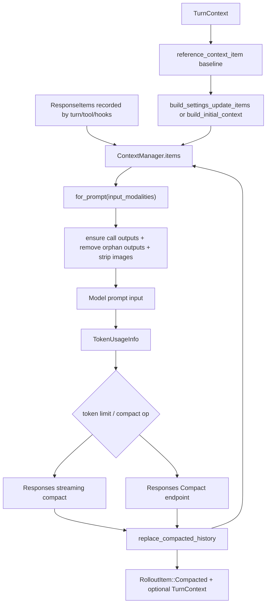

> Codex 的 context system 由 `ContextManager` 保存 model-visible history；regular turn 在没有 reference context 时注入 full initial context，已有 reference context 时注入 settings diff；token pressure 或用户请求会用 compaction summary 替换历史。[I]

## 能回答的问题

- `ContextManager` 保存哪些 state？
- history 进入 prompt 前会做哪些 normalization？
- `reference_context_item` 怎样支持 context diff？
- manual compact、pre-sampling compact、mid-turn auto compact 和 remote compact 的区别是什么？
- compaction 后 token usage 和 rollout 如何更新？

该 flowchart 是后续编号步骤的视觉索引；具体控制流事实以编号步骤中的源码证据为准。[I]

## 端到端步骤

1. `ContextManager` 的核心 state 是 `items: Vec<ResponseItem>`、`history_version`、`token_info` 和 `reference_context_item`。[E: codex-rs/core/src/context_manager/history.rs:34][E: codex-rs/core/src/context_manager/history.rs:36][E: codex-rs/core/src/context_manager/history.rs:38][E: codex-rs/core/src/context_manager/history.rs:39][E: codex-rs/core/src/context_manager/history.rs:50]
2. `ContextManager::new` 初始化空 history、`history_version = 0`、初始 `TokenUsageInfo` 和空 `reference_context_item`。[E: codex-rs/core/src/context_manager/history.rs:62][E: codex-rs/core/src/context_manager/history.rs:64][E: codex-rs/core/src/context_manager/history.rs:65][E: codex-rs/core/src/context_manager/history.rs:66][E: codex-rs/core/src/context_manager/history.rs:69]
3. `ContextManager::record_items` 只记录 API message 和 ghost snapshot；非 API message 且非 ghost snapshot 的 item 会被跳过，保留下来的 item 会进入 `process_item` 后写入 history。[E: codex-rs/core/src/context_manager/history.rs:99][E: codex-rs/core/src/context_manager/history.rs:106][E: codex-rs/core/src/context_manager/history.rs:107][E: codex-rs/core/src/context_manager/history.rs:108][E: codex-rs/core/src/context_manager/history.rs:111][E: codex-rs/core/src/context_manager/history.rs:112]
4. tool outputs 进入 history 时会经过 `process_item`，Function/Custom tool output 走 `truncate_function_output_payload`，其他 model-visible item 通常 clone 原 item。[E: codex-rs/core/src/context_manager/history.rs:375][E: codex-rs/core/src/context_manager/history.rs:378][E: codex-rs/core/src/context_manager/history.rs:381][E: codex-rs/core/src/context_manager/history.rs:387][E: codex-rs/core/src/context_manager/history.rs:394][E: codex-rs/core/src/context_manager/history.rs:407]
5. `for_prompt` 先调用 `normalize_history(input_modalities)`，再移除 `GhostSnapshot`，最后返回 prompt items。[E: codex-rs/core/src/context_manager/history.rs:120][E: codex-rs/core/src/context_manager/history.rs:121][E: codex-rs/core/src/context_manager/history.rs:123][E: codex-rs/core/src/context_manager/history.rs:124][E: codex-rs/core/src/context_manager/history.rs:125]
6. `normalize_history` 依次调用 `ensure_call_outputs_present`、`remove_orphan_outputs` 和 `strip_images_when_unsupported`。[E: codex-rs/core/src/context_manager/history.rs:364][E: codex-rs/core/src/context_manager/history.rs:366][E: codex-rs/core/src/context_manager/history.rs:369][E: codex-rs/core/src/context_manager/history.rs:372]
7. `ensure_call_outputs_present` 会为缺失 output 的 FunctionCall、client ToolSearchCall、CustomToolCall、LocalShellCall 插入 synthetic output，FunctionCall output 文本是 `"aborted"`，client ToolSearch synthetic output 标记 `execution: "client"`。[E: codex-rs/core/src/context_manager/normalize.rs:22][E: codex-rs/core/src/context_manager/normalize.rs:30][E: codex-rs/core/src/context_manager/normalize.rs:36][E: codex-rs/core/src/context_manager/normalize.rs:41][E: codex-rs/core/src/context_manager/normalize.rs:58][E: codex-rs/core/src/context_manager/normalize.rs:60][E: codex-rs/core/src/context_manager/normalize.rs:66][E: codex-rs/core/src/context_manager/normalize.rs:83][E: codex-rs/core/src/context_manager/normalize.rs:89][E: codex-rs/core/src/context_manager/normalize.rs:105][E: codex-rs/core/src/context_manager/normalize.rs:117][E: codex-rs/core/src/context_manager/normalize.rs:118]
8. `remove_orphan_outputs` 收集现有 call ids，并 retain 只有匹配 call 的 FunctionCallOutput、CustomToolCallOutput、client ToolSearchOutput；server ToolSearchOutput 和没有 `call_id` 的 ToolSearchOutput 会直接保留。[E: codex-rs/core/src/context_manager/normalize.rs:122][E: codex-rs/core/src/context_manager/normalize.rs:123][E: codex-rs/core/src/context_manager/normalize.rs:131][E: codex-rs/core/src/context_manager/normalize.rs:142][E: codex-rs/core/src/context_manager/normalize.rs:153][E: codex-rs/core/src/context_manager/normalize.rs:161][E: codex-rs/core/src/context_manager/normalize.rs:163][E: codex-rs/core/src/context_manager/normalize.rs:164][E: codex-rs/core/src/context_manager/normalize.rs:172][E: codex-rs/core/src/context_manager/normalize.rs:173][E: codex-rs/core/src/context_manager/normalize.rs:181][E: codex-rs/core/src/context_manager/normalize.rs:186][E: codex-rs/core/src/context_manager/normalize.rs:192]
9. `Session::record_conversation_items` 同时写入 in-memory history、rollout response items 和 raw response item events；`record_into_history` 只写 `ContextManager`。[E: codex-rs/core/src/session/mod.rs:2233][E: codex-rs/core/src/session/mod.rs:2238][E: codex-rs/core/src/session/mod.rs:2239][E: codex-rs/core/src/session/mod.rs:2240][E: codex-rs/core/src/session/mod.rs:2244][E: codex-rs/core/src/session/mod.rs:2249][E: codex-rs/core/src/session/mod.rs:2250]
10. regular turn 前，`run_turn` 调用 `Session::record_context_updates_and_set_reference_context_item`；该函数读取当前 `reference_context_item`，为空时 `build_initial_context`，否则 `build_settings_update_items`。[E: codex-rs/core/src/session/turn.rs:168][E: codex-rs/core/src/session/mod.rs:2612][E: codex-rs/core/src/session/mod.rs:2616][E: codex-rs/core/src/session/mod.rs:2618][E: codex-rs/core/src/session/mod.rs:2620][E: codex-rs/core/src/session/mod.rs:2622][E: codex-rs/core/src/session/mod.rs:2625]
11. `build_settings_update_items` 可生成 environment diff、permissions diff、collaboration mode update、realtime update、personality update 和 model switch instructions。[E: codex-rs/core/src/context_manager/updates.rs:205][E: codex-rs/core/src/context_manager/updates.rs:217][E: codex-rs/core/src/context_manager/updates.rs:221][E: codex-rs/core/src/context_manager/updates.rs:222][E: codex-rs/core/src/context_manager/updates.rs:223][E: codex-rs/core/src/context_manager/updates.rs:224][E: codex-rs/core/src/context_manager/updates.rs:225]
12. `record_context_updates_and_set_reference_context_item` 在记录 context items 后持久化 `RolloutItem::TurnContext`，并把 state 的 reference context 更新为当前 turn snapshot。[E: codex-rs/core/src/session/mod.rs:2628][E: codex-rs/core/src/session/mod.rs:2630][E: codex-rs/core/src/session/mod.rs:2635][E: codex-rs/core/src/session/mod.rs:2640][E: codex-rs/core/src/session/mod.rs:2641]
13. `run_turn` 在模型 sampling 前调用 `run_pre_sampling_compact`，sampling 后根据 total usage 与 auto compact limit 决定是否执行 `run_auto_compact(..., CompactionPhase::MidTurn)`。[E: codex-rs/core/src/session/turn.rs:155][E: codex-rs/core/src/session/turn.rs:471][E: codex-rs/core/src/session/turn.rs:472][E: codex-rs/core/src/session/turn.rs:490][E: codex-rs/core/src/session/turn.rs:491][E: codex-rs/core/src/session/turn.rs:496]
14. manual compact 的 `run_compact_task` 会先发送 `TurnStarted`，再使用 `InitialContextInjection::DoNotInject`、`CompactionTrigger::Manual`、`CompactionReason::UserRequested`。[E: codex-rs/core/src/compact.rs:92][E: codex-rs/core/src/compact.rs:97][E: codex-rs/core/src/compact.rs:103][E: codex-rs/core/src/compact.rs:108][E: codex-rs/core/src/compact.rs:109][E: codex-rs/core/src/compact.rs:110]
15. local compaction 用普通 Responses streaming：`run_compact_task_inner_impl` clone history、加入 compact prompt input、调用 `drain_to_completed`，并在 context window exceeded 时移除 oldest item 后重试。[E: codex-rs/core/src/compact.rs:160][E: codex-rs/core/src/compact.rs:162][E: codex-rs/core/src/compact.rs:163][E: codex-rs/core/src/compact.rs:165][E: codex-rs/core/src/compact.rs:177][E: codex-rs/core/src/compact.rs:190][E: codex-rs/core/src/compact.rs:215][E: codex-rs/core/src/compact.rs:221][E: codex-rs/core/src/compact.rs:224]
16. `drain_to_completed` 只记录 `OutputItemDone` 到 history，遇到 `ResponseEvent::Completed` 后更新 token usage 并返回。[E: codex-rs/core/src/compact.rs:540][E: codex-rs/core/src/compact.rs:560][E: codex-rs/core/src/compact.rs:561][E: codex-rs/core/src/compact.rs:570][E: codex-rs/core/src/compact.rs:571][E: codex-rs/core/src/compact.rs:573]
17. local compaction 取原 history 中最后 assistant message 形成 summary text，收集 real user messages，再用 `build_compacted_history` 生成 replacement history。[E: codex-rs/core/src/compact.rs:252][E: codex-rs/core/src/compact.rs:254][E: codex-rs/core/src/compact.rs:255][E: codex-rs/core/src/compact.rs:256][E: codex-rs/core/src/compact.rs:258]
18. `build_compacted_history` 保留最近 user messages 的 token budget，最后追加 role=`"user"` 的 summary message。[E: codex-rs/core/src/compact.rs:484][E: codex-rs/core/src/compact.rs:487][E: codex-rs/core/src/compact.rs:492][E: codex-rs/core/src/compact.rs:496][E: codex-rs/core/src/compact.rs:504][E: codex-rs/core/src/compact.rs:522][E: codex-rs/core/src/compact.rs:524]
19. mid-turn compact 使用 `InitialContextInjection::BeforeLastUserMessage` 时，会调用 `build_initial_context` 并把 initial context 插入 compacted history 的 last real user、summary 或 compaction item 前，replacement 的 reference context 也会保存当前 turn snapshot。[E: codex-rs/core/src/compact.rs:260][E: codex-rs/core/src/compact.rs:264][E: codex-rs/core/src/compact.rs:266][E: codex-rs/core/src/compact.rs:424][E: codex-rs/core/src/compact.rs:437][E: codex-rs/core/src/compact.rs:443][E: codex-rs/core/src/compact.rs:447][E: codex-rs/core/src/compact.rs:457][E: codex-rs/core/src/compact.rs:276]
20. compaction replacement 会保留 ghost snapshots，按 `InitialContextInjection` 设置或清空 `reference_context_item`，调用 `replace_compacted_history`，reset websocket session，并 recompute token usage。[E: codex-rs/core/src/compact.rs:268][E: codex-rs/core/src/compact.rs:273][E: codex-rs/core/src/compact.rs:275][E: codex-rs/core/src/compact.rs:276][E: codex-rs/core/src/compact.rs:282][E: codex-rs/core/src/compact.rs:284][E: codex-rs/core/src/compact.rs:285]
21. remote compaction 先从 history 构造 prompt input，再构造 `Prompt { input, tools, parallel_tool_calls, base_instructions, ... }`，随后调用 `ModelClient::compact_conversation_history`；`ModelClient` 为 Compact endpoint 构建 `ApiCompactClient` 并把 prompt tools 序列化进请求 payload。[E: codex-rs/core/src/compact_remote.rs:142][E: codex-rs/core/src/compact_remote.rs:153][E: codex-rs/core/src/compact_remote.rs:154][E: codex-rs/core/src/compact_remote.rs:155][E: codex-rs/core/src/compact_remote.rs:156][E: codex-rs/core/src/compact_remote.rs:165][E: codex-rs/core/src/client.rs:427][E: codex-rs/core/src/client.rs:431][E: codex-rs/core/src/client.rs:436][E: codex-rs/core/src/client.rs:454][E: codex-rs/core/src/client.rs:458]
22. `replace_compacted_history` 替换 in-memory history，持久化 `RolloutItem::Compacted`，在有 reference context 时额外持久化 `RolloutItem::TurnContext`，并 advance model window generation。[E: codex-rs/core/src/session/mod.rs:2320][E: codex-rs/core/src/session/mod.rs:2326][E: codex-rs/core/src/session/mod.rs:2329][E: codex-rs/core/src/session/mod.rs:2331][E: codex-rs/core/src/session/mod.rs:2332][E: codex-rs/core/src/session/mod.rs:2335]

## 关键设计点

- context diff 的 baseline 是 `reference_context_item`；regular turn 在 baseline 为空时 full inject，否则生成 settings diff，mid-turn compaction 的 replacement 可以保存当前 turn snapshot 作为新 baseline。[E: codex-rs/core/src/session/mod.rs:2618][E: codex-rs/core/src/session/mod.rs:2620][E: codex-rs/core/src/session/mod.rs:2622][E: codex-rs/core/src/session/mod.rs:2625][E: codex-rs/core/src/session/mod.rs:2641][E: codex-rs/core/src/compact.rs:276]
- prompt history 在发送模型前会修复 call/output 对，避免模型看到悬空 tool call 或 orphan output。[E: codex-rs/core/src/context_manager/history.rs:366][E: codex-rs/core/src/context_manager/history.rs:369]
- manual compact 和 pre-turn compact 使用 `InitialContextInjection::DoNotInject`，该模式在 replacement 中清空 reference context；后续 regular turn 因 baseline 为空会 full reinject。mid-turn compact 的 `BeforeLastUserMessage` 会在 replacement history 内直接注入 context 并保存 baseline。[E: codex-rs/core/src/compact.rs:108][E: codex-rs/core/src/session/turn.rs:730][E: codex-rs/core/src/session/turn.rs:777][E: codex-rs/core/src/compact.rs:264][E: codex-rs/core/src/compact.rs:275][E: codex-rs/core/src/compact.rs:276][E: codex-rs/core/src/session/mod.rs:2620][E: codex-rs/core/src/session/mod.rs:2622]
- remote compact 会把 tools 也放进 Compact endpoint prompt；local compact 的 streaming path 使用 `Prompt { input, base_instructions, personality, ...Default::default() }`，没有显式带 tool specs。[E: codex-rs/core/src/compact.rs:183][E: codex-rs/core/src/compact.rs:184][E: codex-rs/core/src/compact.rs:185][E: codex-rs/core/src/compact.rs:186][E: codex-rs/core/src/compact.rs:187][E: codex-rs/core/src/compact_remote.rs:154]

## 深挖入口

- `spine.turn-end-to-end` 展开 `run_turn` 中 compaction 与 sampling 的交界。
- 索引 id：`ref.protocol-event-lifecycle` 应列出 `ContextCompacted`、`TokenCount`、`TurnDiff`、`Warning` 等事件。
- `subsys.core.session-lifecycle` 应补充 rollout replay、resume、rollback 与 `history_version` 的关系。

## Sources

- codex-rs/core/src/context_manager/history.rs
- codex-rs/core/src/context_manager/normalize.rs
- codex-rs/core/src/context_manager/updates.rs
- codex-rs/core/src/session/mod.rs
- codex-rs/core/src/session/turn.rs
- codex-rs/core/src/compact.rs
- codex-rs/core/src/compact_remote.rs
- codex-rs/core/src/client.rs

## 相关

- [一次 turn 端到端](turn-end-to-end.md)
- [SQ/EQ 双队列架构](sq-eq-architecture.md)
- 索引 id：`ref.protocol-event-lifecycle`
- 索引 id：`subsys.core.session-lifecycle`
