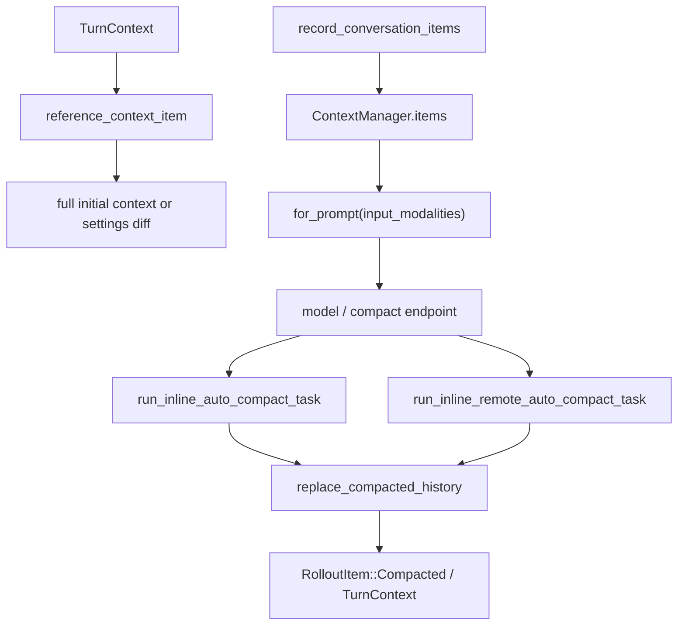

> Context system 用 `ContextManager` 保存 model-visible history、token info、settings diff baseline 和 world-state baseline；compaction 在 pre-turn 或 mid-turn 把历史替换成 compacted history，并把 replacement 通过 rollout 持久化。[E: codex-rs/core/src/context_manager/history.rs:38][E: codex-rs/core/src/context_manager/history.rs:43][E: codex-rs/core/src/context_manager/history.rs:54][E: codex-rs/core/src/context_manager/history.rs:56][E: codex-rs/core/src/session/mod.rs:3021][E: codex-rs/core/src/session/mod.rs:3050]

## 能回答的问题

- `ContextManager` 保存哪些 state？
- history 发送模型前如何 normalize 和按 modality 过滤？
- `reference_context_item` 如何驱动 full context 与 settings diff？
- local compaction 与 remote compaction 的边界是什么？
- compaction 后 rollout、token usage、pending session start 如何更新？

```mermaid
flowchart TD
    ITEMS["record_conversation_items"] --> CM["ContextManager.items"]
    TURN["TurnContext"] --> BASE["reference_context_item"]
    BASE --> DIFF["full initial context or settings diff"]
    CM --> PROMPT["for_prompt(input_modalities)"]
    PROMPT --> MODEL["model / compact endpoint"]
    MODEL --> LOCAL["run_inline_auto_compact_task"]
    MODEL --> REMOTE["run_inline_remote_auto_compact_task"]
    LOCAL --> REPLACE["replace_compacted_history"]
    REMOTE --> REPLACE
    REPLACE --> ROLLOUT["RolloutItem::Compacted / TurnContext"]
```

## 端到端步骤

1. `ContextManager` 的核心 state 是 ordered `items`、`history_version`、`token_info`、`reference_context_item` 和 `world_state_baseline`；`new` 初始化空 history、`history_version = 0` 和空 baseline。[E: codex-rs/core/src/context_manager/history.rs:38][E: codex-rs/core/src/context_manager/history.rs:40][E: codex-rs/core/src/context_manager/history.rs:42][E: codex-rs/core/src/context_manager/history.rs:43][E: codex-rs/core/src/context_manager/history.rs:54][E: codex-rs/core/src/context_manager/history.rs:56][E: codex-rs/core/src/context_manager/history.rs:60][E: codex-rs/core/src/context_manager/history.rs:68]
2. `record_items` 只记录 API-message items；每个保留项经过 `process_item` 后追加到 history。[E: codex-rs/core/src/context_manager/history.rs:121][E: codex-rs/core/src/context_manager/history.rs:128][E: codex-rs/core/src/context_manager/history.rs:132][E: codex-rs/core/src/context_manager/history.rs:133]
3. `for_prompt` 是发送模型前的边界：它调用 `normalize_history(input_modalities)`，并在模型不支持 image input 时剥离 message/tool output 中的 images。[E: codex-rs/core/src/context_manager/history.rs:140][E: codex-rs/core/src/context_manager/history.rs:141]
4. regular turn 开头，`run_turn` 调 `record_context_updates_and_set_reference_context_item`；该函数在 baseline 为空时 build full initial context 和 full world state，否则 build settings update items 与 world-state diffs。[E: codex-rs/core/src/session/turn.rs:173][E: codex-rs/core/src/session/mod.rs:3534][E: codex-rs/core/src/session/mod.rs:3545][E: codex-rs/core/src/session/mod.rs:3548][E: codex-rs/core/src/session/mod.rs:3569][E: codex-rs/core/src/session/mod.rs:3575]
5. `build_settings_update_items` 现在只负责 model switch、multi-agent mode 与 personality；permissions、collaboration、realtime、environment 等 typed sections 由 `build_world_state_for_step` 构造，并通过 `ContextManager::update_world_state` 做 snapshot/diff。[E: codex-rs/core/src/context_manager/updates.rs:134][E: codex-rs/core/src/context_manager/updates.rs:144][E: codex-rs/core/src/context_manager/updates.rs:149][E: codex-rs/core/src/session/world_state.rs:17][E: codex-rs/core/src/session/world_state.rs:36][E: codex-rs/core/src/session/mod.rs:3572]
6. `record_context_updates_and_set_reference_context_item` 按需持久化 `RolloutItem::WorldState` 和 `RolloutItem::TurnContext`，并更新 in-memory settings baseline。[E: codex-rs/core/src/session/mod.rs:3600][E: codex-rs/core/src/session/mod.rs:3610][E: codex-rs/core/src/session/mod.rs:3616]
7. `run_pre_sampling_compact` 在 sampling 前检查 token status；token limit reached 时以 `InitialContextInjection::DoNotInject` 运行 pre-turn auto compact。[E: codex-rs/core/src/session/turn.rs:809][E: codex-rs/core/src/session/turn.rs:817][E: codex-rs/core/src/session/turn.rs:819][E: codex-rs/core/src/session/turn.rs:824][E: codex-rs/core/src/session/turn.rs:827]
8. sampling 后若 token limit reached 且仍需 follow-up，`run_turn` 以 `InitialContextInjection::BeforeLastUserMessage` 和 `CompactionPhase::MidTurn` 运行 auto compact。[E: codex-rs/core/src/session/turn.rs:309][E: codex-rs/core/src/session/turn.rs:355][E: codex-rs/core/src/session/turn.rs:362]
9. `run_auto_compact` 根据 provider 和 feature 选择 remote v2、remote 或 local compaction implementation。[E: codex-rs/core/src/session/turn.rs:965][E: codex-rs/core/src/session/turn.rs:987][E: codex-rs/core/src/session/turn.rs:998][E: codex-rs/core/src/session/turn.rs:1015][E: codex-rs/core/src/session/turn.rs:1031]
10. local auto compact 构造 compact prompt，调用 `run_compact_task_inner`；manual compact 会先发送 `TurnStarted` 再进入同一 inner path。[E: codex-rs/core/src/compact.rs:92][E: codex-rs/core/src/compact.rs:99][E: codex-rs/core/src/compact.rs:93][E: codex-rs/core/src/compact.rs:124][E: codex-rs/core/src/compact.rs:129]
11. local compaction inner 克隆 history，把 compact prompt 记录进临时 history，然后用新的 `ModelClientSession` streaming 生成 summary；context window exceeded 时移除最老 history item 后重试。[E: codex-rs/core/src/compact.rs:221][E: codex-rs/core/src/compact.rs:233][E: codex-rs/core/src/compact.rs:234][E: codex-rs/core/src/compact.rs:241][E: codex-rs/core/src/compact.rs:285][E: codex-rs/core/src/compact.rs:291]
12. local compaction 用 summary 和 user messages 构造 replacement history；mid-turn 模式会把 initial context 插到最后一个真实 user message 或 summary 前，并保存当前 turn snapshot 作为新的 baseline。[E: codex-rs/core/src/compact.rs:323][E: codex-rs/core/src/compact.rs:329][E: codex-rs/core/src/compact.rs:308][E: codex-rs/core/src/compact.rs:312][E: codex-rs/core/src/compact.rs:347]
13. remote v1 request preparation 已抽到 `compact_remote_request.rs`：先截短 oversize tool outputs，再用 `history.for_prompt`、`built_tools` 和 model-visible specs 构造 Compact endpoint prompt；remote v2 attempt 同样构造 prompt，但额外 append `CompactionTrigger` 并走普通 Responses stream。[E: codex-rs/core/src/compact_remote_request.rs:25][E: codex-rs/core/src/compact_remote_request.rs:36][E: codex-rs/core/src/compact_remote_request.rs:61][E: codex-rs/core/src/compact_remote_request.rs:68][E: codex-rs/core/src/compact_remote_request.rs:82][E: codex-rs/core/src/compact_remote_v2_attempt.rs:68][E: codex-rs/core/src/compact_remote_v2_attempt.rs:77]
14. `replace_compacted_history` 替换 in-memory history，持久化 `RolloutItem::Compacted`，可选持久化 `RolloutItem::WorldState` 和 `RolloutItem::TurnContext`，并 queue `SessionStartSource::Compact`。[E: codex-rs/core/src/session/mod.rs:3021][E: codex-rs/core/src/session/mod.rs:3042][E: codex-rs/core/src/session/mod.rs:3050][E: codex-rs/core/src/session/mod.rs:3054][E: codex-rs/core/src/session/mod.rs:3058][E: codex-rs/core/src/session/mod.rs:3063]
15. compaction 完成后 local/remote path 都调用 `recompute_token_usage`；普通 token usage 则由 `record_token_usage_info` 从 provider usage 更新 state。[E: codex-rs/core/src/compact.rs:369][E: codex-rs/core/src/compact_remote.rs:306][E: codex-rs/core/src/session/mod.rs:3632][E: codex-rs/core/src/session/mod.rs:3641]

## 关键决策点

- `reference_context_item` 是 context diff baseline；baseline 为空意味着下一次 regular turn 要 full reinject context。[E: codex-rs/core/src/session/mod.rs:3545]
- pre-turn compaction 不注入 initial context，mid-turn compaction 会在 replacement history 内重新插入 initial context 并保存 baseline。[E: codex-rs/core/src/session/turn.rs:824][E: codex-rs/core/src/compact.rs:347]
- 两条 remote compact 都把当前 model-visible tool specs 放入 prompt；local summary stream 不显式加入 tool specs。[E: codex-rs/core/src/compact_remote_request.rs:62][E: codex-rs/core/src/compact_remote_request.rs:70][E: codex-rs/core/src/compact_remote_v2_attempt.rs:70][E: codex-rs/core/src/compact_remote_v2_attempt.rs:80][E: codex-rs/core/src/compact.rs:233][I]

## 深挖入口

- `spine.turn-end-to-end` 说明 context update 与 sampling 的顺序。
- `subsys.core.session-lifecycle` 展开 rollout replay、resume、rollback 与 history version。
- `ref.protocol-event-lifecycle` 列出 context compaction 和 token usage events。

## Sources

- codex-rs/core/src/context_manager/history.rs
- codex-rs/core/src/context_manager/updates.rs
- codex-rs/core/src/context/world_state/mod.rs
- codex-rs/core/src/session/world_state.rs
- codex-rs/core/src/session/mod.rs
- codex-rs/core/src/session/turn.rs
- codex-rs/core/src/compact.rs
- codex-rs/core/src/compact_remote.rs
- codex-rs/core/src/compact_remote_request.rs
- codex-rs/core/src/compact_remote_v2.rs
- codex-rs/core/src/compact_remote_v2_attempt.rs

## 相关

- [一次 turn 端到端](turn-end-to-end.md)
- [SQ/EQ 双队列架构](sq-eq-architecture.md)
- [core session lifecycle](../subsystems/core/session-lifecycle.md)
- 索引 id：`ref.protocol-event-lifecycle`
