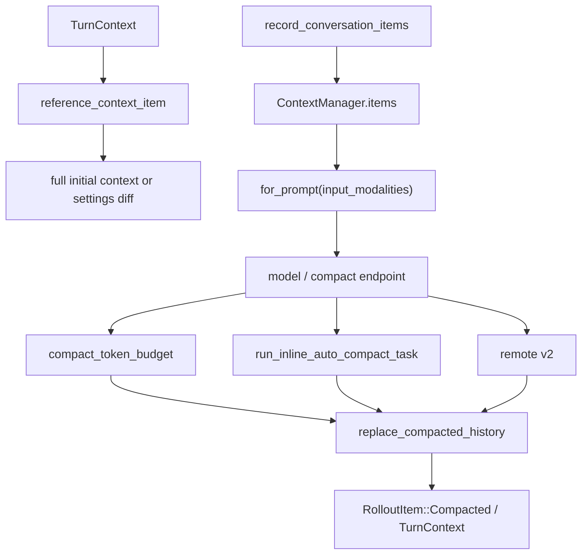

> Context system 用 `ContextManager` 保存 model-visible history、`history_version`、独立的 `user_message_revision`、token info、settings diff baseline 和 world-state baseline；compaction 在 pre-turn 或 mid-turn 把历史替换成 compacted history，并把 replacement 通过 rollout 持久化。`Feature::TokenBudget` 打开时 auto compact 走 token-budget 短路，不再走 remote/local summarizer。[E: codex-rs/core/src/context_manager/history.rs:70][E: codex-rs/core/src/context_manager/history.rs:84][E: codex-rs/core/src/session/turn.rs:1408][E: codex-rs/core/src/session/mod.rs:3933]

## 能回答的问题

- `ContextManager` 保存哪些 state？`user_message_revision` 和 `history_version` 有何不同？
- history 发送模型前如何 normalize 和按 modality 过滤？
- `reference_context_item` 如何驱动 full context 与 settings diff？
- local / remote / TokenBudget compaction 的边界是什么？
- compaction 后 rollout、token usage、pending session start 如何更新？

```mermaid
flowchart TD
    ITEMS["record_conversation_items"] --> CM["ContextManager.items"]
    TURN["TurnContext"] --> BASE["reference_context_item"]
    BASE --> DIFF["full initial context or settings diff"]
    CM --> PROMPT["for_prompt(input_modalities)"]
    PROMPT --> MODEL["model / compact endpoint"]
    MODEL --> TB["compact_token_budget"]
    MODEL --> LOCAL["run_inline_auto_compact_task"]
    MODEL --> REMOTE["remote v2"]
    TB --> REPLACE["replace_compacted_history"]
    LOCAL --> REPLACE
    REMOTE --> REPLACE
    REPLACE --> ROLLOUT["RolloutItem::Compacted / TurnContext"]
```

## 端到端步骤

1. `ContextManager` 的核心 state 是 `Arc<Vec<ResponseItemEnvelope>>` 的 `items`、`history_version`、**`user_message_revision`**、`token_info`、`reference_context_item` 和 `world_state_baseline`。`new()` 把两个 revision 都置 0，baseline 为空。[E: codex-rs/core/src/context_manager/history.rs:70][E: codex-rs/core/src/context_manager/history.rs:82][E: codex-rs/core/src/context_manager/history.rs:84][E: codex-rs/core/src/context_manager/history.rs:173]
2. `record_items` 只记录 API-message items；实际写入走 `record_items_with_metadata`，其中 `is_api_message` 决定是否入列。truncation 可用 metadata 的 `history_truncation_token_limit`，否则 `with_serialization_allowance(policy)`。用户授权消息会递增 `user_message_revision`。[E: codex-rs/core/src/context_manager/history.rs:328][E: codex-rs/core/src/context_manager/history.rs:350][E: codex-rs/core/src/context_manager/history.rs:357][E: codex-rs/core/src/context_manager/history.rs:370][E: codex-rs/core/src/context_manager/history_user_authorization.rs:103]
3. `for_prompt` 是发送模型前的边界：它调用 `for_prompt_annotated` → `normalize_history(input_modalities)`。normalize 补齐 call/output 配对，并在模型不支持时剥离 image 与 audio。audio token 估计走 `codex_utils_audio::estimate_audio_token_count`。[E: codex-rs/core/src/context_manager/history.rs:393][E: codex-rs/core/src/context_manager/history.rs:401][E: codex-rs/core/src/context_manager/history.rs:707][E: codex-rs/core/src/context_manager/history.rs:52]
4. regular turn 开头，`run_turn` 先跑 `run_pre_sampling_compact`（在 context updates / user input **之前**），再调 `record_context_updates_and_set_reference_context_item`。baseline 为空时 build full initial context；否则由 `ContextManager::update_world_state` 生成 diff，并在 `TurnContextItem` 变化时追加 extension contributions。[E: codex-rs/core/src/session/turn.rs:183][E: codex-rs/core/src/session/mod.rs:4461][E: codex-rs/core/src/session/mod.rs:4472][E: codex-rs/core/src/session/mod.rs:4501]
5. model instructions、personality、context-window guidance、permissions、collaboration、realtime、environment、extension state 与 multi-agent policy 都由 `build_world_state_for_step` 组装成 typed sections。V2 usage hint 优先读 model catalog 的 `model_messages.multi_agent`，再回落到 bundled/config 文本。[E: codex-rs/core/src/session/world_state.rs:35][E: codex-rs/core/src/session/world_state.rs:198][E: codex-rs/core/src/session/world_state.rs:319][E: codex-rs/core/src/session/multi_agents.rs:81]
6. `record_context_updates_and_set_reference_context_item` 按需持久化 `RolloutItem::WorldState` 和 `RolloutItem::TurnContext`，并更新 in-memory settings baseline。[E: codex-rs/core/src/session/mod.rs:4522][E: codex-rs/core/src/session/mod.rs:4531]
7. `run_pre_sampling_compact` 在 sampling 前检查 token status；token limit reached 时以 `InitialContextInjection::DoNotInject` 运行 pre-turn auto compact。[E: codex-rs/core/src/session/turn.rs:1231][E: codex-rs/core/src/session/turn.rs:1243]
8. sampling 后若仍需 follow-up 且存在 `new_context` 请求或 token limit reached，`run_turn` 以 `InitialContextInjection::BeforeLastUserMessage { world_state, step_context }` 跑 mid-turn compact。[E: codex-rs/core/src/session/turn.rs:600][E: codex-rs/core/src/session/turn.rs:618]
9. `run_auto_compact` 先看 `Feature::TokenBudget`：开则调用 `compact_token_budget::run_inline_auto_compact_task` 并立刻返回。否则按 provider `RemoteCompactionSupport::V2` 走 `compact_remote_v2::run_inline_remote_auto_compact_task`，`Unsupported` 走 local。不再选 remote v1。[E: codex-rs/core/src/session/turn.rs:1408][E: codex-rs/core/src/session/turn.rs:1420][E: codex-rs/core/src/session/turn.rs:1427]
10. local auto compact 构造 compact prompt，调用 `run_compact_task_inner`；inner 克隆 history，把 compact prompt 记进临时 history，再用普通 stream 生成 summary；context window exceeded 时移除最老 item 后重试。[E: codex-rs/core/src/compact.rs:114][E: codex-rs/core/src/compact.rs:236][E: codex-rs/core/src/compact.rs:248][E: codex-rs/core/src/compact.rs:271][E: codex-rs/core/src/compact.rs:314]
11. local compaction 用 summary 和 user messages 构造 replacement history；mid-turn 会把 initial context 插到最后一个真实 user / non-final agent message 前，并保存当前 turn snapshot 作为新 baseline。[E: codex-rs/core/src/compact.rs:354][E: codex-rs/core/src/compact.rs:374][E: codex-rs/core/src/compact.rs:376]
12. remote v2 attempt 在 `compact_remote_v2_attempt.rs`：先用 `compact_remote_history::trim_function_call_history_to_fit_context_window` 截短 oversize tool outputs，再用 `history.for_prompt_annotated` 和 model-visible specs 构造 prompt，末尾 append `CompactionTrigger`，走普通 Responses stream。[E: codex-rs/core/src/compact_remote_v2_attempt.rs:43][E: codex-rs/core/src/compact_remote_v2_attempt.rs:76][E: codex-rs/core/src/compact_remote_history.rs:68]
13. `replace_compacted_history` 先补缺失 item id，再替换 in-memory history（`HistoryReplacement::Compaction`，不递增 `user_message_revision`），持久化 `RolloutItem::Compacted`，可选持久化 `WorldState` / `TurnContext`，并 queue `SessionStartSource::Compact`。[E: codex-rs/core/src/session/mod.rs:3933][E: codex-rs/core/src/session/mod.rs:3982][E: codex-rs/core/src/session/mod.rs:4009][E: codex-rs/core/src/context_manager/history.rs:502]
14. compaction 完成后 local path 调用 `recompute_token_usage`。[E: codex-rs/core/src/compact.rs:395]

## 关键决策点

- `reference_context_item` 是 context diff baseline；baseline 为空意味着下一次 regular turn 要 full reinject context。[E: codex-rs/core/src/session/mod.rs:4472]
- pre-turn compaction 不注入 initial context；mid-turn compaction 的 injection 现在是结构体 `{ world_state, step_context }`，不再是单独的 `Arc<WorldState>`。[E: codex-rs/core/src/compact.rs:72][E: codex-rs/core/src/session/turn.rs:618]
- `replace_annotated` 会递增 `user_message_revision`；compaction 只走 `replace_compacted`，不改用户修订号。[E: codex-rs/core/src/context_manager/history.rs:487][E: codex-rs/core/src/context_manager/history.rs:502]
- `is_api_message` 现含 `AdditionalTools`；`CompactionTrigger` 与 `Other` 仍不记入 history。[E: codex-rs/core/src/context_manager/history.rs:778][E: codex-rs/core/src/context_manager/history.rs:792]
- TokenBudget compact 跳过模型/server summarization，但仍走 compact hooks 与 `ContextCompaction` lifecycle。[E: codex-rs/core/src/compact_token_budget.rs:43][E: codex-rs/core/src/compact_token_budget.rs:70][E: codex-rs/core/src/compact_token_budget.rs:78]
- audio 处理在 `utils/audio`；`ContextManager` 通过 `codex_utils_audio::estimate_audio_token_count` 消费它。[E: codex-rs/core/src/context_manager/history.rs:52][E: codex-rs/utils/audio/src/lib.rs:146]
- compaction 截断后的旧窗口细节，可由 History notes 扩展经 backend `history`/`notes` 回读；那是另一份 private store，不是 `ContextManager.items`。

## 深挖入口

- `spine.turn-end-to-end` 说明 context update 与 sampling 的顺序。
- `subsys.core.session-lifecycle` 展开 rollout replay、resume、rollback 与 history version。
- `subsys.core.compaction` 展开三条 compact 实现与 TokenBudget 短路。
- `subsys.core.history-notes` 说明 compaction 之后如何回读私有 history/notes。
- `ref.protocol-event-lifecycle` 列出 context compaction 和 token usage events。

## Sources

- codex-rs/core/src/context_manager/history.rs
- codex-rs/core/src/context_manager/history_user_authorization.rs
- codex-rs/core/src/context_manager/updates.rs
- codex-rs/core/src/context/world_state/mod.rs
- codex-rs/core/src/session/world_state.rs
- codex-rs/core/src/session/multi_agents.rs
- codex-rs/core/src/session/mod.rs
- codex-rs/core/src/session/turn.rs
- codex-rs/core/src/compact.rs
- codex-rs/core/src/compact_token_budget.rs
- codex-rs/core/src/compact_remote_v2.rs
- codex-rs/core/src/compact_remote_v2_attempt.rs
- codex-rs/core/src/compact_remote_history.rs
- codex-rs/utils/audio/src/lib.rs

## 相关

- [一次 turn 端到端](turn-end-to-end.md)
- [SQ/EQ 双队列架构](sq-eq-architecture.md)
- [core session lifecycle](../subsystems/core/session-lifecycle.md)
- [历史压缩与 compaction](../subsystems/core/compaction.md)
- [Context manager](../subsystems/core/context-manager.md)
- [History notes 扩展](../subsystems/core/history-notes.md)
- 索引 id：`ref.protocol-event-lifecycle`
