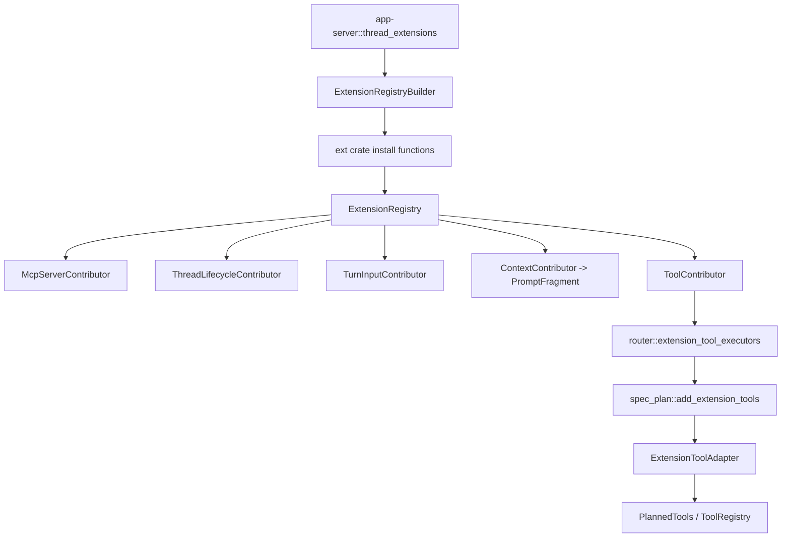

> `ext/` 扩展插件系统用 `ExtensionRegistry<C>` 收集 typed contributor，host 安装扩展后，contributor 可以向 Codex core 注入 MCP server、线程/turn 生命周期钩子、turn 输入、prompt 片段和 model-visible native tools；用户指令另由 `UserInstructionsProvider` trait 表示，不是 registry 字段。[E: codex-rs/ext/extension-api/src/registry.rs:152][E: codex-rs/ext/extension-api/src/registry.rs:160][E: codex-rs/ext/extension-api/src/contributors.rs:54][E: codex-rs/ext/extension-api/src/contributors.rs:78][E: codex-rs/ext/extension-api/src/contributors.rs:162][E: codex-rs/ext/extension-api/src/contributors.rs:211][E: codex-rs/ext/extension-api/src/contributors/prompt.rs:12][E: codex-rs/ext/extension-api/src/user_instructions.rs:38]

## 能回答的问题

- `ExtensionRegistry<C>` 和 `ExtensionRegistryBuilder<C>` 当前保存哪些 contributor？
- 扩展怎样把 native tools 汇入 core `ToolRegistry`？
- 哪些 contributor trait 对应 MCP server、thread lifecycle、turn input、tools、prompt fragments，用户指令 provider 又是什么？
- app-server 当前安装了哪些 ext 子 crate？
- 8 个 `ext/` workspace crate 分别负责什么？

## Registry 与 contributor 面

`ExtensionRegistryBuilder<C>` 是可变安装期容器，字段直接保存 thread lifecycle、turn lifecycle、config、token usage、context/prompt、MCP server、turn input、tool、tool lifecycle、turn item 和 approval review contributors。[E: codex-rs/ext/extension-api/src/registry.rs:21][E: codex-rs/ext/extension-api/src/registry.rs:23][E: codex-rs/ext/extension-api/src/registry.rs:33] builder 的 `thread_lifecycle_contributor`、`mcp_server_contributor`、`turn_input_contributor`、`tool_contributor` 等方法只是把 `Arc<dyn ...>` push 到对应 vec，`build()` 再冻结成 `ExtensionRegistry<C>`。[E: codex-rs/ext/extension-api/src/registry.rs:80][E: codex-rs/ext/extension-api/src/registry.rs:108][E: codex-rs/ext/extension-api/src/registry.rs:113][E: codex-rs/ext/extension-api/src/registry.rs:118][E: codex-rs/ext/extension-api/src/registry.rs:133]

`ExtensionRegistry<C>` 是 runtime 读取面，提供 `mcp_server_contributors()`、`turn_input_contributors()`、`tool_contributors()` 等 slice getters；core 不需要知道具体扩展类型，只消费这些 trait object。[E: codex-rs/ext/extension-api/src/registry.rs:219][E: codex-rs/ext/extension-api/src/registry.rs:224][E: codex-rs/ext/extension-api/src/registry.rs:229]

| Contributor / 类型 | 定义处 | 注入语义 |
|---|---|---|
| `McpServerContributor<C>` | `contributors.rs` | contributor 提供 stable `id()` 并基于 `McpServerContributionContext` 返回 `Vec<McpServerContribution>`，用于由 host config 解析 runtime MCP server。[E: codex-rs/ext/extension-api/src/contributors.rs:54][E: codex-rs/ext/extension-api/src/contributors.rs:58] |
| `ThreadLifecycleContributor<C>` | `contributors.rs` | contributor 可实现 `on_thread_start/resume/idle/stop`，host 在 thread-scoped store 建好或 runtime 复原/空闲/停止时调用。[E: codex-rs/ext/extension-api/src/contributors.rs:78][E: codex-rs/ext/extension-api/src/contributors.rs:80][E: codex-rs/ext/extension-api/src/contributors.rs:88][E: codex-rs/ext/extension-api/src/contributors.rs:100][E: codex-rs/ext/extension-api/src/contributors.rs:108] |
| `TurnInputContributor` | `contributors.rs` | contributor 为一次 submitted turn 返回 `Vec<Box<dyn ContextualUserFragment + Send>>`，并接收 session/thread/turn extension stores。[E: codex-rs/ext/extension-api/src/contributors.rs:162][E: codex-rs/ext/extension-api/src/contributors.rs:164][E: codex-rs/ext/extension-api/src/contributors.rs:170] |
| `ToolContributor` | `contributors.rs` | contributor 从 session/thread stores 生成 `Vec<Arc<dyn ToolExecutor<ToolCall>>>`，这是扩展 native tools 进入 core 的入口。[E: codex-rs/ext/extension-api/src/contributors.rs:211][E: codex-rs/ext/extension-api/src/contributors.rs:213][E: codex-rs/ext/extension-api/src/contributors.rs:217] |
| `PromptFragment` | `contributors/prompt.rs` | prompt fragment 保存 `PromptSlot` 和 model-visible text，factory 覆盖 developer policy、developer capability 和 separate developer slots。[E: codex-rs/ext/extension-api/src/contributors/prompt.rs:4][E: codex-rs/ext/extension-api/src/contributors/prompt.rs:12][E: codex-rs/ext/extension-api/src/contributors/prompt.rs:27][E: codex-rs/ext/extension-api/src/contributors/prompt.rs:32][E: codex-rs/ext/extension-api/src/contributors/prompt.rs:37] |
| `UserInstructionsProvider` | `user_instructions.rs` | provider 在 root thread runtime 启动时加载 host-provided user instructions，返回 instructions 或 recoverable warnings。[E: codex-rs/ext/extension-api/src/user_instructions.rs:34][E: codex-rs/ext/extension-api/src/user_instructions.rs:38][E: codex-rs/ext/extension-api/src/user_instructions.rs:40] |

## ToolContributor 到 core registry

扩展工具不是在 `spec_plan.rs` 里直接构造具体工具；`router::extension_tool_executors(session)` 从 `session.services.extensions.tool_contributors()` 读取所有 `ToolContributor`，对每个 contributor 调 `tools(session_extension_data, thread_extension_data)`，产出 extension executors。[E: codex-rs/core/src/tools/router.rs:244][E: codex-rs/core/src/tools/router.rs:247][E: codex-rs/core/src/tools/router.rs:250][E: codex-rs/core/src/tools/router.rs:253]

turn 采样前构建 `ToolRouterParams` 时，core 把 `extension_tool_executors(sess)` 放入参数；`add_tool_sources` 固定在 MCP runtime 后、dynamic tools 前调用 `add_extension_tools(context, planned_tools)`。[E: codex-rs/core/src/session/turn.rs:1273][E: codex-rs/core/src/session/turn.rs:1279][E: codex-rs/core/src/tools/spec_plan.rs:604][E: codex-rs/core/src/tools/spec_plan.rs:609][E: codex-rs/core/src/tools/spec_plan.rs:610][E: codex-rs/core/src/tools/spec_plan.rs:611]

`add_extension_tools` 只把已解析好的 extension executors 交给 `append_extension_tool_executors`；该函数过滤重复 tool name，并对 standalone `web.run`、`image_gen.imagegen` 应用 core gate，最后用 `ExtensionToolAdapter::new(executor)` 加进 `PlannedTools`。[E: codex-rs/core/src/tools/spec_plan.rs:925][E: codex-rs/core/src/tools/spec_plan.rs:928][E: codex-rs/core/src/tools/spec_plan.rs:977][E: codex-rs/core/src/tools/spec_plan.rs:1002][E: codex-rs/core/src/tools/spec_plan.rs:1007][E: codex-rs/core/src/tools/spec_plan.rs:1012][E: codex-rs/core/src/tools/spec_plan.rs:1016]

`ExtensionToolAdapter` 是 core runtime shim：它持有 `Arc<dyn codex_tools::ToolExecutor<ExtensionToolCall>>`，把 `tool_name/spec/exposure/supports_parallel_tool_calls/search_info` 透传给 extension executor，并把 core `ToolInvocation` 转成 extension `ToolCall` 后调用 extension executor `handle()`。[E: codex-rs/core/src/tools/handlers/extension_tools.rs:26][E: codex-rs/core/src/tools/handlers/extension_tools.rs:29][E: codex-rs/core/src/tools/handlers/extension_tools.rs:34][E: codex-rs/core/src/tools/handlers/extension_tools.rs:35][E: codex-rs/core/src/tools/handlers/extension_tools.rs:36][E: codex-rs/core/src/tools/handlers/extension_tools.rs:39][E: codex-rs/core/src/tools/handlers/extension_tools.rs:43][E: codex-rs/core/src/tools/handlers/extension_tools.rs:44][E: codex-rs/core/src/tools/handlers/extension_tools.rs:47][E: codex-rs/core/src/tools/handlers/extension_tools.rs:51][E: codex-rs/core/src/tools/handlers/extension_tools.rs:52][E: codex-rs/core/src/tools/handlers/extension_tools.rs:55][E: codex-rs/core/src/tools/handlers/extension_tools.rs:56] adapter 的 `CoreToolRuntime::matches_kind` 只接受 `ToolPayload::Function`，所以 extension tools 当前进入 core 的 payload branch 是 function payload。[E: codex-rs/core/src/tools/handlers/extension_tools.rs:60][E: codex-rs/core/src/tools/handlers/extension_tools.rs:62]

## Host 安装点

app-server 的 `thread_extensions` 用 host dependencies 建 `ExtensionRegistryBuilder<Config>`；`state_db` 存在时安装 goal extension，随后安装 guardian、memories、mcp、web-search、image-generation 和 skills extensions，最后 `builder.build()` 生成 `Arc<ExtensionRegistry<Config>>`。[E: codex-rs/app-server/src/extensions.rs:44][E: codex-rs/app-server/src/extensions.rs:62][E: codex-rs/app-server/src/extensions.rs:63][E: codex-rs/app-server/src/extensions.rs:64][E: codex-rs/app-server/src/extensions.rs:74][E: codex-rs/app-server/src/extensions.rs:75][E: codex-rs/app-server/src/extensions.rs:76][E: codex-rs/app-server/src/extensions.rs:77][E: codex-rs/app-server/src/extensions.rs:78][E: codex-rs/app-server/src/extensions.rs:79][E: codex-rs/app-server/src/extensions.rs:85][E: codex-rs/app-server/src/extensions.rs:93]

## 8 个 ext 子 crate

| crate | 定位 |
|---|---|
| `ext/extension-api` | workspace member；公开 `ExtensionRegistry`、`ExtensionRegistryBuilder` 和 contributor traits，是扩展系统 API 本体。[E: codex-rs/Cargo.toml:50][E: codex-rs/ext/extension-api/src/lib.rs:40][E: codex-rs/ext/extension-api/src/lib.rs:51][E: codex-rs/ext/extension-api/src/lib.rs:65][E: codex-rs/ext/extension-api/src/lib.rs:66] |
| `ext/goal` | workspace member；crate doc 标明是 `/goal` feature extension，导出 `GoalService`、`install_with_backend` 和 `create/get/update` goal tool names；extension 注册 thread/config/turn/token/tool lifecycle 和 tool contributors。[E: codex-rs/Cargo.toml:51][E: codex-rs/ext/goal/src/lib.rs:1][E: codex-rs/ext/goal/src/lib.rs:15][E: codex-rs/ext/goal/src/lib.rs:22][E: codex-rs/ext/goal/src/lib.rs:25][E: codex-rs/ext/goal/src/lib.rs:26][E: codex-rs/ext/goal/src/lib.rs:27][E: codex-rs/ext/goal/src/extension.rs:471][E: codex-rs/ext/goal/src/extension.rs:472][E: codex-rs/ext/goal/src/extension.rs:473][E: codex-rs/ext/goal/src/extension.rs:474][E: codex-rs/ext/goal/src/extension.rs:475][E: codex-rs/ext/goal/src/extension.rs:476] |
| `ext/guardian` | workspace member；`GuardianExtension` 实现 `ThreadLifecycleContributor<Config>`，在线程 start 时把 guardian fork source thread id 写入 thread store，安装函数只注册 thread lifecycle contributor。[E: codex-rs/Cargo.toml:52][E: codex-rs/ext/guardian/src/lib.rs:51][E: codex-rs/ext/guardian/src/lib.rs:60][E: codex-rs/ext/guardian/src/lib.rs:64][E: codex-rs/ext/guardian/src/lib.rs:72][E: codex-rs/ext/guardian/src/lib.rs:76] |
| `ext/image-generation` | workspace member；定义 `image_gen` namespace 和 `imagegen` tool name，extension 在 provider/auth 可用时创建 `ImageGenerationTool` 并注册 thread lifecycle、config 和 tool contributors。[E: codex-rs/Cargo.toml:53][E: codex-rs/ext/image-generation/src/lib.rs:7][E: codex-rs/ext/image-generation/src/lib.rs:8][E: codex-rs/ext/image-generation/src/extension.rs:72][E: codex-rs/ext/image-generation/src/extension.rs:86][E: codex-rs/ext/image-generation/src/extension.rs:98][E: codex-rs/ext/image-generation/src/extension.rs:100][E: codex-rs/ext/image-generation/src/extension.rs:101][E: codex-rs/ext/image-generation/src/extension.rs:102] |
| `ext/mcp` | workspace member；`HostedPluginRuntimeExtension` 实现 `McpServerContributor<Config>`，按 Apps feature set/remove hosted plugin runtime MCP server；`install_executor_plugins` 还注册 thread-selected executor plugin MCP contributor。[E: codex-rs/Cargo.toml:55][E: codex-rs/ext/mcp/src/lib.rs:14][E: codex-rs/ext/mcp/src/lib.rs:26][E: codex-rs/ext/mcp/src/lib.rs:30][E: codex-rs/ext/mcp/src/lib.rs:41][E: codex-rs/ext/mcp/src/lib.rs:46][E: codex-rs/ext/mcp/src/lib.rs:50] |
| `ext/memories` | workspace member；定义 dedicated memory tools namespace 和 `add_ad_hoc_note/list/read/search` tool names，extension 安装 thread/config/prompt/tool contributors。[E: codex-rs/Cargo.toml:54][E: codex-rs/ext/memories/src/lib.rs:18][E: codex-rs/ext/memories/src/lib.rs:19][E: codex-rs/ext/memories/src/lib.rs:20][E: codex-rs/ext/memories/src/lib.rs:21][E: codex-rs/ext/memories/src/lib.rs:22][E: codex-rs/ext/memories/src/extension.rs:119][E: codex-rs/ext/memories/src/extension.rs:124][E: codex-rs/ext/memories/src/extension.rs:125][E: codex-rs/ext/memories/src/extension.rs:126][E: codex-rs/ext/memories/src/extension.rs:127] |
| `ext/skills` | workspace member；crate exposes catalog/provider/config modules and `install_with_providers`，extension 注册 thread/config/prompt/turn-input/tool contributors；tool surface 是 `skills.list` 与 `skills.read`。[E: codex-rs/Cargo.toml:56][E: codex-rs/ext/skills/src/lib.rs:1][E: codex-rs/ext/skills/src/lib.rs:5][E: codex-rs/ext/skills/src/lib.rs:12][E: codex-rs/ext/skills/src/lib.rs:14][E: codex-rs/ext/skills/src/extension.rs:369][E: codex-rs/ext/skills/src/extension.rs:370][E: codex-rs/ext/skills/src/extension.rs:371][E: codex-rs/ext/skills/src/extension.rs:372][E: codex-rs/ext/skills/src/extension.rs:373][E: codex-rs/ext/skills/src/tools/mod.rs:33][E: codex-rs/ext/skills/src/tools/mod.rs:36][E: codex-rs/ext/skills/src/tools/mod.rs:47][E: codex-rs/ext/skills/src/tools/mod.rs:50] |
| `ext/web-search` | workspace member；extension 注册 thread lifecycle/config/tool contributors并创建 `WebSearchTool`，`history::recent_input` 为 standalone web search 构造最近用户/assistant conversation tail。[E: codex-rs/Cargo.toml:57][E: codex-rs/ext/web-search/src/lib.rs:7][E: codex-rs/ext/web-search/src/extension.rs:109][E: codex-rs/ext/web-search/src/extension.rs:122][E: codex-rs/ext/web-search/src/extension.rs:133][E: codex-rs/ext/web-search/src/extension.rs:135][E: codex-rs/ext/web-search/src/extension.rs:136][E: codex-rs/ext/web-search/src/extension.rs:137][E: codex-rs/ext/web-search/src/history.rs:14][E: codex-rs/ext/web-search/src/history.rs:18] |

## 深挖入口

- `tool.web-search` 和 `tool.image-generation` 展开 hosted fallback、standalone extension gate 和 provider response item 映射。
- `subsys.core.memory` 展开 `ext/memories` 的 prompt contributor、dedicated memory tools 和 memories read/write split。
- `subsys.mcp.client` 展开 MCP manager、resource client 和 tool/resource aggregation；`ext/mcp` 只说明 hosted plugin runtime contributor 怎样把 server 注入 MCP layer。
- `subsys.config-auth.skills` 展开 core skill loader；`ext/skills` 只说明 extension contributor 怎样把 skills discovery、turn input 和 skills tools挂到 runtime。

## Sources

- `codex-rs/Cargo.toml`
- `codex-rs/ext/extension-api/src/lib.rs`
- `codex-rs/ext/extension-api/src/contributors.rs`
- `codex-rs/ext/extension-api/src/contributors/prompt.rs`
- `codex-rs/ext/extension-api/src/registry.rs`
- `codex-rs/ext/extension-api/src/user_instructions.rs`
- `codex-rs/core/src/tools/router.rs`
- `codex-rs/core/src/session/turn.rs`
- `codex-rs/core/src/tools/handlers/extension_tools.rs`
- `codex-rs/core/src/tools/spec_plan.rs`
- `codex-rs/app-server/src/extensions.rs`
- `codex-rs/ext/goal/src/lib.rs`
- `codex-rs/ext/goal/src/extension.rs`
- `codex-rs/ext/guardian/src/lib.rs`
- `codex-rs/ext/image-generation/src/lib.rs`
- `codex-rs/ext/image-generation/src/extension.rs`
- `codex-rs/ext/mcp/src/lib.rs`
- `codex-rs/ext/memories/src/lib.rs`
- `codex-rs/ext/memories/src/extension.rs`
- `codex-rs/ext/skills/src/lib.rs`
- `codex-rs/ext/skills/src/extension.rs`
- `codex-rs/ext/skills/src/tools/mod.rs`
- `codex-rs/ext/skills/src/provider/orchestrator.rs`
- `codex-rs/ext/web-search/src/lib.rs`
- `codex-rs/ext/web-search/src/extension.rs`
- `codex-rs/ext/web-search/src/history.rs`

## 相关

- [工具调用解剖](tool-call-anatomy.md)
- [Tool router 与并行执行](../subsystems/core/tool-router.md)
- [web_search 工具](../surface/tools/web-search.md)
- [image_generation 工具](../surface/tools/image-generation.md)
- [长期 Memory](../subsystems/core/memory.md)
- [MCP client](../subsystems/mcp/client.md)
- [Skills 系统](../subsystems/config-auth/skills.md)
- [会话与线程命令](../surface/slash-commands/session-thread.md)
