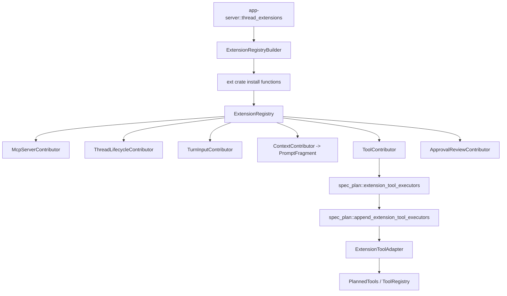

> `ext/` 扩展插件系统用 `ExtensionRegistry<C>` 收集 typed contributor，host 安装扩展后，contributor 可以向 Codex core 注入 MCP server、线程/turn 生命周期钩子、turn 输入、prompt 片段、approval review 和 model-visible native tools；用户指令另由 `UserInstructionsProvider` trait 表示，不是 registry 字段。[E: codex-rs/ext/extension-api/src/registry.rs:147][E: codex-rs/ext/extension-api/src/registry.rs:157][E: codex-rs/ext/extension-api/src/contributors.rs:78][E: codex-rs/ext/extension-api/src/contributors.rs:136][E: codex-rs/ext/extension-api/src/contributors.rs:238][E: codex-rs/ext/extension-api/src/contributors.rs:313][E: codex-rs/ext/extension-api/src/contributors.rs:362][E: codex-rs/ext/extension-api/src/contributors/prompt.rs:16][E: codex-rs/ext/extension-api/src/user_instructions.rs:55]

这里的 Rust `ext/` contributor registry 与用户可安装 plugin manifest 是两个层次。本地主机的 `find_plugin_manifest_path` 才会先检查 plugin root `plugin.json`：regular file 且 schema 不是 `Unrelated` 时选 root；root `plugin.json` 是 symlink 或非 regular file 时直接返回无 manifest；否则回退 `.codex-plugin/.claude-plugin/.cursor-plugin`。executor/`PathUri` discovery 则只遍历这三条 nested legacy paths，不检查 root manifest。portable manifest 能贡献 skills/MCP/apps/hooks 等资源，但不会动态装载新的 Rust contributor crate。[E: codex-rs/utils/plugins/src/plugin_namespace.rs:42][E: codex-rs/utils/plugins/src/plugin_namespace.rs:45][E: codex-rs/utils/plugins/src/plugin_namespace.rs:52][E: codex-rs/utils/plugins/src/plugin_namespace.rs:62][E: codex-rs/utils/plugins/src/plugin_namespace.rs:94][E: codex-rs/exec-server-protocol/src/protocol.rs:47][E: codex-rs/core-plugins/src/manifest.rs:156][E: codex-rs/core-plugins/src/manifest.rs:166]

## 能回答的问题

- `ExtensionRegistry<C>` 和 `ExtensionRegistryBuilder<C>` 当前保存哪些 contributor？
- 扩展怎样把 native tools 汇入 core `ToolRegistry`？
- 哪些 contributor trait 对应 MCP server、thread lifecycle、turn input、tools、prompt fragments，用户指令 provider 又是什么？
- app-server 当前安装了哪些 ext 子 crate？
- 15 个 `ext/` workspace crate 分别负责什么？

```mermaid
flowchart TD
    HOST["app-server::thread_extensions"] --> BUILDER["ExtensionRegistryBuilder<Config>"]
    BUILDER --> INSTALL["ext crate install functions"]
    INSTALL --> REGISTRY["ExtensionRegistry<Config>"]
    REGISTRY --> MCP["McpServerContributor"]
    REGISTRY --> LIFE["ThreadLifecycleContributor"]
    REGISTRY --> TURNINPUT["TurnInputContributor"]
    REGISTRY --> PROMPT["ContextContributor -> PromptFragment"]
    REGISTRY --> TOOLS["ToolContributor"]
    REGISTRY --> REVIEW["ApprovalReviewContributor"]
    TOOLS --> EXECUTORS["spec_plan::extension_tool_executors"]
    EXECUTORS --> PLAN["spec_plan::append_extension_tool_executors"]
    PLAN --> ADAPTER["ExtensionToolAdapter"]
    ADAPTER --> CORE["PlannedTools / ToolRegistry"]
```

## Registry 与 contributor 面

`ExtensionRegistryBuilder<C>` 是可变安装期容器，但 target 已把所有 vec 收进 builder 拥有的 `ExtensionRegistry<C>`，注册方法直接 push 到该 registry，`build()` 只转移 ownership。registry 保存 thread/turn/config/token/skill invocation/approval review/context/MCP/turn input/tool/tool lifecycle/turn item contributors。[E: codex-rs/ext/extension-api/src/registry.rs:20][E: codex-rs/ext/extension-api/src/registry.rs:27][E: codex-rs/ext/extension-api/src/registry.rs:141][E: codex-rs/ext/extension-api/src/registry.rs:147][E: codex-rs/ext/extension-api/src/registry.rs:161]

`ExtensionRegistry<C>` 是 runtime 读取面，提供 `mcp_server_contributors()`、`turn_input_contributors()`、`tool_contributors()` 等 slice getters；core 不需要知道具体扩展类型，只消费这些 trait object。[E: codex-rs/ext/extension-api/src/registry.rs:234][E: codex-rs/ext/extension-api/src/registry.rs:239][E: codex-rs/ext/extension-api/src/registry.rs:244]

| Contributor / 类型 | 定义处 | 注入语义 |
|---|---|---|
| `McpServerContributor<C>` | `contributors.rs` | contributor 提供 stable `id()` 并基于 `McpServerContributionContext` 返回 `Vec<McpServerContribution>`，用于由 host config 解析 runtime MCP server。[E: codex-rs/ext/extension-api/src/contributors.rs:78][E: codex-rs/ext/extension-api/src/contributors.rs:80][E: codex-rs/ext/extension-api/src/contributors.rs:82] |
| `ThreadLifecycleContributor<C>` | `contributors.rs` | contributor 可实现 `on_thread_start/ready/resume/idle/stop`，host 在 thread-scoped store 建好或 runtime 复原/空闲/停止时调用。[E: codex-rs/ext/extension-api/src/contributors.rs:136][E: codex-rs/ext/extension-api/src/contributors.rs:138][E: codex-rs/ext/extension-api/src/contributors.rs:146][E: codex-rs/ext/extension-api/src/contributors.rs:154][E: codex-rs/ext/extension-api/src/contributors.rs:166][E: codex-rs/ext/extension-api/src/contributors.rs:174] |
| `TurnInputContributor` | `contributors.rs` | contributor 为一次 submitted turn 返回 `Vec<Box<dyn ContextualUserFragment + Send>>`，并接收 session/thread/turn extension stores。[E: codex-rs/ext/extension-api/src/contributors.rs:238][E: codex-rs/ext/extension-api/src/contributors.rs:241] |
| `ToolContributor` | `contributors.rs` | contributor 从 session/thread stores 生成 `Vec<Arc<dyn ToolExecutor<ToolCall>>>`，并可提供 step-scoped `tools_for_step`；这是扩展 native tools 进入 core 的入口。[E: codex-rs/ext/extension-api/src/contributors.rs:313][E: codex-rs/ext/extension-api/src/contributors.rs:315][E: codex-rs/ext/extension-api/src/contributors.rs:322] |
| `ApprovalReviewContributor` | `contributors.rs` | contributor 实现 `decide`；registry 按安装顺序取第一个 `Some(...)`。Guardian V2 的 `async_scorer` `GuardianApprovalReviewer` 是当前实现。[E: codex-rs/ext/extension-api/src/contributors.rs:362][E: codex-rs/ext/extension-api/src/registry.rs:216][E: codex-rs/ext/guardian-v2/src/async_scorer/approval.rs:34] |
| `PromptFragment` | `contributors/prompt.rs` | prompt fragment 保存 `PromptSlot` 和 model-visible text，factory 覆盖 developer policy、developer capability 和 context-window slots。[E: codex-rs/ext/extension-api/src/contributors/prompt.rs:8][E: codex-rs/ext/extension-api/src/contributors/prompt.rs:16][E: codex-rs/ext/extension-api/src/contributors/prompt.rs:33][E: codex-rs/ext/extension-api/src/contributors/prompt.rs:38] |
| `UserInstructionsProvider` | `user_instructions.rs` | provider 在 root thread runtime 启动时加载 host-provided user instructions，返回 instructions 或 recoverable warnings。[E: codex-rs/ext/extension-api/src/user_instructions.rs:23][E: codex-rs/ext/extension-api/src/user_instructions.rs:55][E: codex-rs/ext/extension-api/src/user_instructions.rs:57] |

## ToolContributor 到 core registry

扩展工具不是在 planner 里直接构造具体工具；`spec_plan::extension_tool_executors(session, step_store)` 从 `session.services.extensions.tool_contributors()` 读取所有 `ToolContributor`，对每个 contributor 调 step-scoped `tools_for_step(...)`，产出 extension executors。[E: codex-rs/core/src/tools/spec_plan.rs:340][E: codex-rs/core/src/tools/spec_plan.rs:343][E: codex-rs/core/src/tools/spec_plan.rs:333]

planner 在同一个 registry 上先追加 MCP tools，再把 `extension_tool_executors(session, step_store)` 交给 extension adapter，最后追加 dynamic tools；这一顺序决定同轮 router 的注册面。Guardian reviewer turn 整段跳过 MCP / extension / hosted / utility，只保留 `exec_command` / `write_stdin` / `view_image`，不会挂 `history.*`。[E: codex-rs/core/src/tools/spec_plan.rs:154][E: codex-rs/core/src/tools/spec_plan.rs:156][E: codex-rs/core/src/tools/spec_plan.rs:159][E: codex-rs/core/src/tools/spec_plan.rs:174][E: codex-rs/core/src/tools/spec_plan.rs:180][E: codex-rs/core/src/tools/spec_plan.rs:978][E: codex-rs/core/src/tools/spec_plan.rs:1029]

`append_extension_tool_executors` 对 standalone `web.run`、`image_gen.imagegen` 应用 core gate，再用 `ExtensionToolAdapter::new(executor)` 注册外部 runtime；同名冲突由 registry 的注册结果决定，standalone web tool 仅在注册成功时被记入 hosted-spec 选择。[E: codex-rs/core/src/tools/spec_plan.rs:1425][E: codex-rs/core/src/tools/spec_plan.rs:1447][E: codex-rs/core/src/tools/spec_plan.rs:1441][E: codex-rs/core/src/tools/spec_plan.rs:1446][E: codex-rs/core/src/tools/spec_plan.rs:1447]

`ExtensionToolAdapter` 是 core runtime shim：它持有 `Arc<dyn codex_tools::ToolExecutor<ExtensionToolCall>>`，把 `tool_name/spec/exposure/supports_parallel_tool_calls/search_info` 透传给 extension executor，并把 core `ToolInvocation` 转成 extension `ToolCall` 后调用 extension executor `handle()`。[E: codex-rs/core/src/tools/handlers/extension_tools.rs:31][E: codex-rs/core/src/tools/handlers/extension_tools.rs:43][E: codex-rs/core/src/tools/handlers/extension_tools.rs:64] adapter 的 `matches_kind` 接受 `ToolPayload::Function`；`Custom` payload 匹配 `Freeform` spec，或 namespace 里同名 `Custom` tool。[E: codex-rs/core/src/tools/handlers/extension_tools.rs:97][E: codex-rs/core/src/tools/handlers/extension_tools.rs:100]

## Host capabilities 与 skills observability

`ExtensionMetrics` 是 host-provided histogram capability；core 将 session telemetry 包装成该 trait，而 skills extension 在 thread/executor/host/turn-input 四种 catalog surface 记录 enabled、kept、omitted 与 description truncation 指标。这让 extension 不需要依赖 core 的具体 telemetry 类型。[E: codex-rs/ext/extension-api/src/capabilities/metrics.rs:5][E: codex-rs/core/src/session/extension_metrics.rs:6][E: codex-rs/core/src/session/extension_metrics.rs:16]

## Host 安装点

app-server 的 `thread_extensions` 用 host dependencies 建 builder；`queue_service` 可用时先安装 `ext/queue`，然后**无条件**安装 `ext/history-notes`，state DB 可用时安装 goal，随后无条件安装 Git attribution，再**只**调用一次 `codex_guardian_v2::install`（不再单独 `codex_guardian::install`），然后 memories、MCP/exec plugins、web search、image generation，并为 skills 组合 executor/orchestrator/host providers。`SkillSearch` feature 目前只打开 shadow-selection experiment，不裁剪 model-visible catalog。[E: codex-rs/app-server/src/extensions.rs:55][E: codex-rs/app-server/src/extensions.rs:80][E: codex-rs/app-server/src/extensions.rs:83][E: codex-rs/app-server/src/extensions.rs:84][E: codex-rs/app-server/src/extensions.rs:98][E: codex-rs/app-server/src/extensions.rs:104][E: codex-rs/app-server/src/extensions.rs:110][E: codex-rs/app-server/src/extensions.rs:123][E: codex-rs/app-server/src/extensions.rs:134]

`codex_guardian_v2::install` 先注册 crate 根 `GuardianExtension`（thread start 时写入 fork source thread id），再装 `async_scorer` 与 `sync_reviewer`。[E: codex-rs/ext/guardian-v2/src/lib.rs:80][E: codex-rs/ext/guardian-v2/src/lib.rs:88][E: codex-rs/ext/guardian-v2/src/lib.rs:90]

`codex-rs/mcp-server` 已删除，不再有 MCP-server host 的 extension install 路径；生产安装点是 app-server `thread_extensions`。[E: codex-rs/app-server/src/extensions.rs:55]

## 15 个 ext 子 crate

| crate | 定位 |
|---|---|
| `ext/agent` | resolved agent invocation runner；通过 owning `ThreadManager` spawn isolated forked subagent，提交 initial prompt，并返回 thread/turn handle。[E: codex-rs/Cargo.toml:60][E: codex-rs/ext/agent/src/lib.rs:35][E: codex-rs/ext/agent/src/lib.rs:45] |
| `ext/connectors` | workspace member；crate doc 标明是 executor-backed connector declaration loading，并导出 executor plugin connector provider 及其 error 类型。[E: codex-rs/Cargo.toml:61][E: codex-rs/ext/connectors/src/lib.rs:5][E: codex-rs/ext/connectors/src/lib.rs:6] |
| `ext/extension-api` | workspace member；公开 `ExtensionRegistry`、`ExtensionRegistryBuilder` 和 contributor traits，是扩展系统 API 本体。[E: codex-rs/Cargo.toml:62][E: codex-rs/ext/extension-api/src/lib.rs:100] |
| `ext/goal` | workspace member；crate doc 标明是 `/goal` feature extension，导出 `GoalService`、`install_with_backend` 和 `create/get/update` goal tool names；extension 注册 thread/config/turn/token/tool lifecycle 和 tool contributors。[E: codex-rs/Cargo.toml:63][E: codex-rs/ext/goal/src/lib.rs:15][E: codex-rs/ext/goal/src/lib.rs:22][E: codex-rs/ext/goal/src/lib.rs:25][E: codex-rs/ext/goal/src/lib.rs:26][E: codex-rs/ext/goal/src/lib.rs:27][E: codex-rs/ext/goal/src/extension.rs:571][E: codex-rs/ext/goal/src/extension.rs:591] |
| `ext/git-attribution` | prompt/context contributor；从 backend user settings 解析 commit attribution policy，并向 world state 注入 commit trailer 与 PR marker 指令或显式 disabled transition。[E: codex-rs/Cargo.toml:64][E: codex-rs/ext/git-attribution/src/lib.rs:98][E: codex-rs/ext/git-attribution/src/world_state.rs:17] |
| `ext/guardian-reviewer` | workspace member；crate 导出 `ReviewerPool` / `MAX_REVIEW_ATTEMPTS` 等同步 review 策略符号，独立于 host session runtime。host 侧由 `guardian-v2` 的 `sync_reviewer::install` 接线，不在本页展开 reviewer 符号。[E: codex-rs/Cargo.toml:65][E: codex-rs/ext/guardian-reviewer/src/lib.rs:35][E: codex-rs/ext/guardian-reviewer/src/lib.rs:40][E: codex-rs/ext/guardian-v2/src/sync_reviewer/mod.rs:55] |
| `ext/guardian-v2` | 拆成 `async_scorer`（Luna 风险分类 + `decide`）和 `sync_reviewer`（同步 reviewer 接线）。crate 根 `GuardianExtension` 写 fork source thread id；旧独立 crate `ext/guardian` 已删除。[E: codex-rs/Cargo.toml:66][E: codex-rs/ext/guardian-v2/src/lib.rs:15][E: codex-rs/ext/guardian-v2/src/lib.rs:16][E: codex-rs/ext/guardian-v2/src/lib.rs:80][E: codex-rs/ext/guardian-v2/src/async_scorer/approval.rs:34] |
| `ext/history-notes` | 独立 history / notes 工具：`history.{list_windows,list_items,read_item,search_contents}` 与 `notes.{list_files_by_prefix,read_file,search_contents,append_to_file,write_file}`。`install` 注册 thread/config/prompt/tool contributors。私有 model-only，notes 单文件 ≤ 1_000_000 UTF-8 bytes。[E: codex-rs/Cargo.toml:67][E: codex-rs/ext/history-notes/src/extension.rs:182][E: codex-rs/ext/history-notes/src/tools.rs:72][E: codex-rs/ext/history-notes/src/tools.rs:27] |
| `ext/image-generation` | workspace member；定义 `image_gen` namespace 和 `imagegen` tool name，extension 在 config 标记 available 且 auth manager 可用时创建 `ImageGenerationTool`，并注册 thread lifecycle、config 和 tool contributors。[E: codex-rs/Cargo.toml:68][E: codex-rs/ext/image-generation/src/lib.rs:8][E: codex-rs/ext/image-generation/src/lib.rs:9][E: codex-rs/ext/image-generation/src/extension.rs:111][E: codex-rs/ext/image-generation/src/extension.rs:120] |
| `ext/items` | extension-owned typed turn-item envelope；当前 namespaced `kind` 覆盖 standalone image generation、sleep、web search，core 只依赖 stable `id()`。[E: codex-rs/ext/items/src/lib.rs:35][E: codex-rs/ext/items/src/lib.rs:50] |
| `ext/mcp` | workspace member；`HostedPluginRuntimeExtension` 实现 `McpServerContributor<Config>`，按 Apps feature set/remove hosted plugin runtime MCP server；`install_executor_plugins` 还注册 thread-selected executor plugin MCP contributor。[E: codex-rs/Cargo.toml:71][E: codex-rs/ext/mcp/src/lib.rs:25][E: codex-rs/ext/mcp/src/lib.rs:52][E: codex-rs/ext/mcp/src/lib.rs:57] |
| `ext/memories` | workspace member；定义 dedicated memory tools namespace 和 `add_ad_hoc_note/list/read/search` tool names，extension 安装 thread/config/prompt/tool contributors。[E: codex-rs/Cargo.toml:70][E: codex-rs/ext/memories/src/lib.rs:18][E: codex-rs/ext/memories/src/extension.rs:163] |
| `ext/queue` | durable、storage-neutral per-thread user-message queue 与 idle dispatch；`install` 把 caller-owned `QueuedItemService` 注册为 thread lifecycle contributor，排在较低优先级 idle contributor 之前。[E: codex-rs/Cargo.toml:72][E: codex-rs/ext/queue/src/lib.rs:14][E: codex-rs/ext/queue/src/lib.rs:19] |
| `ext/skills` | catalog/provider/config 与 `skills.list/read` contributors；shadow experiment 构造器固定 6 种 cheap selector（`WeightedLexical` / `FieldedBm25` / `CharacterNgram` / `MultiQueryLexical` / `RrfLexicalChar` / `RoutingCardLexical`），`run()` 再追加 routing card、LRU 与若干 LRU+lexical/character 融合，以及 `task_context_fusion_v1`。query 上限 16 KiB、结果上限 50，仅记 metrics/skill-read hit，不改变 model-visible catalog。[E: codex-rs/Cargo.toml:73][E: codex-rs/ext/skills/src/shadow_selection_experiment/mod.rs:39][E: codex-rs/ext/skills/src/shadow_selection_experiment/mod.rs:58][E: codex-rs/ext/skills/src/shadow_selection_experiment/mod.rs:158] |
| `ext/web-search` | workspace member；extension 注册 thread lifecycle/config/tool contributors 并创建 `WebSearchTool`，`history::recent_input` 为 standalone web search 构造最近用户/assistant conversation tail。[E: codex-rs/Cargo.toml:74][E: codex-rs/ext/web-search/src/lib.rs:7][E: codex-rs/ext/web-search/src/extension.rs:119][E: codex-rs/ext/web-search/src/history.rs:18] |

另有 workspace crate `codex-guardian-context`（路径 `codex-rs/guardian-context/`，**不是** `ext/` 成员）：提供 `ContextTarget`、`SectionRegistry`、`collect_transcript` 与 truncation。`codex-guardian-v2` 已依赖该 crate；async scorer transcript 通过 `default_registry` 收集。[E: codex-rs/Cargo.toml:49][E: codex-rs/ext/guardian-v2/Cargo.toml:21][E: codex-rs/ext/guardian-v2/src/async_scorer/transcript.rs:22][E: codex-rs/guardian-context/src/lib.rs:100][E: codex-rs/guardian-context/src/lib.rs:236]

## 深挖入口

- `tool.web-search` 和 `tool.image-generation` 展开 hosted fallback、standalone extension gate 和 provider response item 映射。
- `subsys.core.memory` 展开 `ext/memories` 的 prompt contributor、dedicated memory tools 和 memories read/write split。
- `subsys.mcp.client` 展开 MCP manager、resource client 和 tool/resource aggregation；`ext/mcp` 只说明 hosted plugin runtime contributor 怎样把 server 注入 MCP layer。
- `subsys.config-auth.skills` 展开 skill loader；`ext/skills` 只说明 extension contributor 怎样把 skills discovery、turn input 和 skills tools 挂到 runtime。`core-skills` crate 已删除。
- `subsys.core.approval-guardian-v2` 展开 Luna 短路径、`async_scorer` / `sync_reviewer` 拆分，以及 `codex-guardian-context` 接线。

## Sources

- `codex-rs/Cargo.toml`
- `codex-rs/ext/agent/src/lib.rs`
- `codex-rs/ext/connectors/src/lib.rs`
- `codex-rs/ext/extension-api/src/lib.rs`
- `codex-rs/ext/extension-api/src/capabilities/metrics.rs`
- `codex-rs/ext/extension-api/src/contributors.rs`
- `codex-rs/ext/extension-api/src/contributors/prompt.rs`
- `codex-rs/ext/extension-api/src/registry.rs`
- `codex-rs/ext/extension-api/src/user_instructions.rs`
- `codex-rs/ext/git-attribution/src/lib.rs`
- `codex-rs/ext/git-attribution/src/policy.rs`
- `codex-rs/ext/git-attribution/src/world_state.rs`
- `codex-rs/ext/items/src/lib.rs`
- `codex-rs/core/src/session/extension_metrics.rs`
- `codex-rs/core/src/tools/router.rs`
- `codex-rs/core/src/session/turn.rs`
- `codex-rs/core/src/tools/handlers/extension_tools.rs`
- `codex-rs/core/src/tools/spec_plan.rs`
- `codex-rs/core-plugins/src/manifest.rs`
- `codex-rs/utils/plugins/src/plugin_namespace.rs`
- `codex-rs/app-server/src/extensions.rs`
- `codex-rs/ext/goal/src/lib.rs`
- `codex-rs/ext/goal/src/extension.rs`
- `codex-rs/ext/guardian-reviewer/src/lib.rs`
- `codex-rs/ext/guardian-v2/src/lib.rs`
- `codex-rs/ext/guardian-v2/src/async_scorer/approval.rs`
- `codex-rs/ext/guardian-v2/src/async_scorer/extension.rs`
- `codex-rs/ext/guardian-v2/src/async_scorer/transcript.rs`
- `codex-rs/ext/guardian-v2/src/sync_reviewer/mod.rs`
- `codex-rs/guardian-context/src/lib.rs`
- `codex-rs/ext/history-notes/src/lib.rs`
- `codex-rs/ext/history-notes/src/extension.rs`
- `codex-rs/ext/history-notes/src/tools.rs`
- `codex-rs/ext/guardian-v2/Cargo.toml`
- `codex-rs/exec-server-protocol/src/protocol.rs`
- `codex-rs/ext/image-generation/src/lib.rs`
- `codex-rs/ext/image-generation/src/extension.rs`
- `codex-rs/ext/mcp/src/lib.rs`
- `codex-rs/ext/memories/src/lib.rs`
- `codex-rs/ext/memories/src/extension.rs`
- `codex-rs/ext/queue/src/lib.rs`
- `codex-rs/ext/skills/src/lib.rs`
- `codex-rs/ext/skills/src/extension.rs`
- `codex-rs/ext/skills/src/render.rs`
- `codex-rs/ext/skills/src/render_observability.rs`
- `codex-rs/ext/skills/src/dynamic_skill_selector.rs`
- `codex-rs/ext/skills/src/shadow_selection_experiment/mod.rs`
- `codex-rs/ext/skills/src/tools/mod.rs`
- `codex-rs/ext/skills/src/provider/orchestrator.rs`
- `codex-rs/ext/web-search/src/lib.rs`
- `codex-rs/ext/web-search/src/extension.rs`
- `codex-rs/ext/web-search/src/history.rs`

## 相关

- [工具调用解剖](tool-call-anatomy.md)
- [Tool router 与并行执行](../subsystems/core/tool-router.md)
- [web_search 工具](../surface/tools/web-search.md)
- [image_generation 工具](../surface/tools/image-generation.md)
- [长期 Memory](../subsystems/core/memory.md)
- [MCP client](../subsystems/mcp/client.md)
- [Skills 系统](../subsystems/config-auth/skills.md)
- [会话与线程命令](../surface/slash-commands/session-thread.md)
