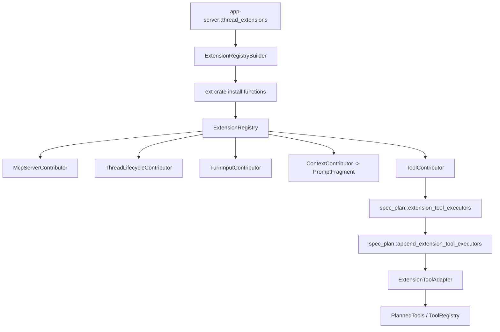

> `ext/` 扩展插件系统用 `ExtensionRegistry<C>` 收集 typed contributor，host 安装扩展后，contributor 可以向 Codex core 注入 MCP server、线程/turn 生命周期钩子、turn 输入、prompt 片段和 model-visible native tools；用户指令另由 `UserInstructionsProvider` trait 表示，不是 registry 字段。[E: codex-rs/ext/extension-api/src/registry.rs:143][E: codex-rs/ext/extension-api/src/registry.rs:152][E: codex-rs/ext/extension-api/src/contributors.rs:66][E: codex-rs/ext/extension-api/src/contributors.rs:124][E: codex-rs/ext/extension-api/src/contributors.rs:208][E: codex-rs/ext/extension-api/src/contributors.rs:276][E: codex-rs/ext/extension-api/src/contributors/prompt.rs:12][E: codex-rs/ext/extension-api/src/user_instructions.rs:38]

这里的 Rust `ext/` contributor registry 与用户可安装 plugin manifest 是两个层次。本地主机的 `find_plugin_manifest_path` 才会先检查 plugin root `plugin.json`：regular file 声明受支持或未来 Agent Plugins schema 时选 root，内容无关时回退 `.codex-plugin/.claude-plugin/.cursor-plugin`；root 是 symlink 或非 regular file 时直接返回无 manifest。executor/`PathUri` discovery 则只遍历三条 nested legacy paths，不检查 root manifest。portable manifest 能贡献 skills/MCP/apps/hooks 等资源，但不会动态装载新的 Rust contributor crate。[E: codex-rs/utils/plugins/src/plugin_namespace.rs:41][E: codex-rs/utils/plugins/src/plugin_namespace.rs:44][E: codex-rs/utils/plugins/src/plugin_namespace.rs:48][E: codex-rs/utils/plugins/src/plugin_namespace.rs:54][E: codex-rs/utils/plugins/src/plugin_namespace.rs:61][E: codex-rs/utils/plugins/src/plugin_namespace.rs:80][E: codex-rs/core-plugins/src/manifest.rs:145][E: codex-rs/core-plugins/src/manifest.rs:166]

## 能回答的问题

- `ExtensionRegistry<C>` 和 `ExtensionRegistryBuilder<C>` 当前保存哪些 contributor？
- 扩展怎样把 native tools 汇入 core `ToolRegistry`？
- 哪些 contributor trait 对应 MCP server、thread lifecycle、turn input、tools、prompt fragments，用户指令 provider 又是什么？
- app-server 当前安装了哪些 ext 子 crate？
- 12 个 `ext/` workspace crate 分别负责什么？

```mermaid
flowchart TD
    HOST["app-server::thread_extensions"] --> BUILDER["ExtensionRegistryBuilder<Config>"]
    BUILDER --> INSTALL["ext crate install functions"]
    INSTALL --> REGISTRY["ExtensionRegistry<Config>"]
    REGISTRY --> MCP["McpServerContributor"]
    REGISTRY --> LIFE["ThreadLifecycleContributor"]
    REGISTRY --> TURNINPUT["TurnInputContributor"]
    REGISTRY --> PROMPT["ContextContributor -> PromptFragment"]
    REGISTRY --> TOOLS["ToolContributor"]
    TOOLS --> EXECUTORS["spec_plan::extension_tool_executors"]
    EXECUTORS --> PLAN["spec_plan::append_extension_tool_executors"]
    PLAN --> ADAPTER["ExtensionToolAdapter"]
    ADAPTER --> CORE["PlannedTools / ToolRegistry"]
```

## Registry 与 contributor 面

`ExtensionRegistryBuilder<C>` 是可变安装期容器，但 target 已把所有 vec 收进 builder 拥有的 `ExtensionRegistry<C>`，注册方法直接 push 到该 registry，`build()` 只转移 ownership。registry 保存 thread/turn/config/token/skill invocation/context/MCP/turn input/tool/tool lifecycle/turn item/approval review contributors。[E: codex-rs/ext/extension-api/src/registry.rs:22][E: codex-rs/ext/extension-api/src/registry.rs:29][E: codex-rs/ext/extension-api/src/registry.rs:35][E: codex-rs/ext/extension-api/src/registry.rs:38][E: codex-rs/ext/extension-api/src/registry.rs:42][E: codex-rs/ext/extension-api/src/registry.rs:72][E: codex-rs/ext/extension-api/src/registry.rs:112][E: codex-rs/ext/extension-api/src/registry.rs:122][E: codex-rs/ext/extension-api/src/registry.rs:137]

`ExtensionRegistry<C>` 是 runtime 读取面，提供 `mcp_server_contributors()`、`turn_input_contributors()`、`tool_contributors()` 等 slice getters；core 不需要知道具体扩展类型，只消费这些 trait object。[E: codex-rs/ext/extension-api/src/registry.rs:216][E: codex-rs/ext/extension-api/src/registry.rs:221][E: codex-rs/ext/extension-api/src/registry.rs:226]

| Contributor / 类型 | 定义处 | 注入语义 |
|---|---|---|
| `McpServerContributor<C>` | `contributors.rs` | contributor 提供 stable `id()` 并基于 `McpServerContributionContext` 返回 `Vec<McpServerContribution>`，用于由 host config 解析 runtime MCP server。[E: codex-rs/ext/extension-api/src/contributors.rs:66][E: codex-rs/ext/extension-api/src/contributors.rs:68][E: codex-rs/ext/extension-api/src/contributors.rs:70] |
| `ThreadLifecycleContributor<C>` | `contributors.rs` | contributor 可实现 `on_thread_start/resume/idle/stop`，host 在 thread-scoped store 建好或 runtime 复原/空闲/停止时调用。[E: codex-rs/ext/extension-api/src/contributors.rs:124][E: codex-rs/ext/extension-api/src/contributors.rs:126][E: codex-rs/ext/extension-api/src/contributors.rs:134][E: codex-rs/ext/extension-api/src/contributors.rs:146][E: codex-rs/ext/extension-api/src/contributors.rs:154] |
| `TurnInputContributor` | `contributors.rs` | contributor 为一次 submitted turn 返回 `Vec<Box<dyn ContextualUserFragment + Send>>`，并接收 session/thread/turn extension stores。[E: codex-rs/ext/extension-api/src/contributors.rs:208][E: codex-rs/ext/extension-api/src/contributors.rs:211][E: codex-rs/ext/extension-api/src/contributors.rs:218] |
| `ToolContributor` | `contributors.rs` | contributor 从 session/thread stores 生成 `Vec<Arc<dyn ToolExecutor<ToolCall>>>`，这是扩展 native tools 进入 core 的入口。[E: codex-rs/ext/extension-api/src/contributors.rs:276][E: codex-rs/ext/extension-api/src/contributors.rs:278][E: codex-rs/ext/extension-api/src/contributors.rs:282] |
| `PromptFragment` | `contributors/prompt.rs` | prompt fragment 保存 `PromptSlot` 和 model-visible text，factory 覆盖 developer policy、developer capability 和 separate developer slots。[E: codex-rs/ext/extension-api/src/contributors/prompt.rs:4][E: codex-rs/ext/extension-api/src/contributors/prompt.rs:12][E: codex-rs/ext/extension-api/src/contributors/prompt.rs:27][E: codex-rs/ext/extension-api/src/contributors/prompt.rs:32][E: codex-rs/ext/extension-api/src/contributors/prompt.rs:37] |
| `UserInstructionsProvider` | `user_instructions.rs` | provider 在 root thread runtime 启动时加载 host-provided user instructions，返回 instructions 或 recoverable warnings。[E: codex-rs/ext/extension-api/src/user_instructions.rs:27][E: codex-rs/ext/extension-api/src/user_instructions.rs:38][E: codex-rs/ext/extension-api/src/user_instructions.rs:40] |

## ToolContributor 到 core registry

扩展工具不是在 planner 里直接构造具体工具；`spec_plan::extension_tool_executors(session, step_store)` 从 `session.services.extensions.tool_contributors()` 读取所有 `ToolContributor`，对每个 contributor 调 step-scoped `tools_for_step(...)`，产出 extension executors。[E: codex-rs/core/src/tools/spec_plan.rs:217][E: codex-rs/core/src/tools/spec_plan.rs:221][E: codex-rs/core/src/tools/spec_plan.rs:224][E: codex-rs/core/src/tools/spec_plan.rs:227][E: codex-rs/core/src/tools/spec_plan.rs:228][E: codex-rs/core/src/tools/spec_plan.rs:230]

planner 在同一个 registry 上先追加 MCP tools，再把 `extension_tool_executors(session, step_store)` 交给 extension adapter，最后追加 dynamic tools；这一顺序决定同轮 router 的注册面。[E: codex-rs/core/src/tools/spec_plan.rs:145][E: codex-rs/core/src/tools/spec_plan.rs:152][E: codex-rs/core/src/tools/spec_plan.rs:154][E: codex-rs/core/src/tools/spec_plan.rs:155][E: codex-rs/core/src/tools/spec_plan.rs:157]

`append_extension_tool_executors` 对 standalone `web.run`、`image_gen.imagegen` 应用 core gate，再用 `ExtensionToolAdapter::new(executor)` 注册外部 runtime；同名冲突由 registry 的注册结果决定，standalone web tool 仅在注册成功时被记入 hosted-spec 选择。[E: codex-rs/core/src/tools/spec_plan.rs:1039][E: codex-rs/core/src/tools/spec_plan.rs:1041][E: codex-rs/core/src/tools/spec_plan.rs:1042][E: codex-rs/core/src/tools/spec_plan.rs:1045][E: codex-rs/core/src/tools/spec_plan.rs:1046][E: codex-rs/core/src/tools/spec_plan.rs:1050][E: codex-rs/core/src/tools/spec_plan.rs:1051][E: codex-rs/core/src/tools/spec_plan.rs:1052]

`ExtensionToolAdapter` 是 core runtime shim：它持有 `Arc<dyn codex_tools::ToolExecutor<ExtensionToolCall>>`，把 `tool_name/spec/exposure/supports_parallel_tool_calls/search_info` 透传给 extension executor，并把 core `ToolInvocation` 转成 extension `ToolCall` 后调用 extension executor `handle()`。[E: codex-rs/core/src/tools/handlers/extension_tools.rs:28][E: codex-rs/core/src/tools/handlers/extension_tools.rs:31][E: codex-rs/core/src/tools/handlers/extension_tools.rs:36][E: codex-rs/core/src/tools/handlers/extension_tools.rs:37][E: codex-rs/core/src/tools/handlers/extension_tools.rs:38][E: codex-rs/core/src/tools/handlers/extension_tools.rs:41][E: codex-rs/core/src/tools/handlers/extension_tools.rs:45][E: codex-rs/core/src/tools/handlers/extension_tools.rs:46][E: codex-rs/core/src/tools/handlers/extension_tools.rs:49][E: codex-rs/core/src/tools/handlers/extension_tools.rs:53][E: codex-rs/core/src/tools/handlers/extension_tools.rs:54][E: codex-rs/core/src/tools/handlers/extension_tools.rs:57][E: codex-rs/core/src/tools/handlers/extension_tools.rs:58] adapter 的 `CoreToolRuntime::matches_kind` 只接受 `ToolPayload::Function`，所以 extension tools 当前进入 core 的 payload branch 是 function payload。[E: codex-rs/core/src/tools/handlers/extension_tools.rs:62][E: codex-rs/core/src/tools/handlers/extension_tools.rs:64]

## Host capabilities 与 skills observability

`ExtensionMetrics` 是 host-provided histogram capability；core 将 session telemetry 包装成该 trait，而 skills extension 在 thread/executor/host/turn-input 四种 catalog surface 记录 enabled、kept、omitted 与 description truncation 指标。这让 extension 不需要依赖 core 的具体 telemetry 类型。[E: codex-rs/ext/extension-api/src/capabilities/metrics.rs:5][E: codex-rs/core/src/session/extension_metrics.rs:6][E: codex-rs/core/src/session/extension_metrics.rs:16][E: codex-rs/ext/skills/src/render_observability.rs:10][E: codex-rs/ext/skills/src/render_observability.rs:29][E: codex-rs/ext/skills/src/render_observability.rs:64]

## Host 安装点

app-server 的 `thread_extensions` 用 host dependencies 建 builder；state DB 可用时安装 goal，随后无条件安装 Git attribution contributor，再安装 guardian、memories、MCP/exec plugins、web search、image generation，并为 skills 组合 executor/orchestrator/host providers。`SkillSearch` feature 目前只打开 shadow-selection experiment，不裁剪 model-visible catalog。[E: codex-rs/app-server/src/extensions.rs:51][E: codex-rs/app-server/src/extensions.rs:71][E: codex-rs/app-server/src/extensions.rs:83][E: codex-rs/app-server/src/extensions.rs:89][E: codex-rs/app-server/src/extensions.rs:92][E: codex-rs/app-server/src/extensions.rs:93][E: codex-rs/app-server/src/extensions.rs:97][E: codex-rs/app-server/src/extensions.rs:103][E: codex-rs/app-server/src/extensions.rs:111]

MCP server host 也不再只安装 image generation：它用 active-turn-aware event sink 建 registry，安装 Git attribution、image generation 与带 host provider/metrics 的 skills extension。skills warning 只在能映射到 active MCP request 的 turn 中作为 notification 发出，过长消息截到 256 bytes。[E: codex-rs/mcp-server/src/message_processor.rs:68][E: codex-rs/mcp-server/src/message_processor.rs:69][E: codex-rs/mcp-server/src/message_processor.rs:72][E: codex-rs/mcp-server/src/message_processor.rs:78][E: codex-rs/mcp-server/src/message_processor.rs:83][E: codex-rs/mcp-server/src/message_processor.rs:85][E: codex-rs/mcp-server/src/extension_event_sink.rs:14][E: codex-rs/mcp-server/src/extension_event_sink.rs:40][E: codex-rs/mcp-server/src/extension_event_sink.rs:54][E: codex-rs/mcp-server/src/extension_event_sink.rs:62]

## 12 个 ext 子 crate

| crate | 定位 |
|---|---|
| `ext/agent` | resolved agent invocation runner；通过 owning `ThreadManager` spawn isolated forked subagent，提交 initial prompt，并返回 thread/turn handle。[E: codex-rs/ext/agent/src/lib.rs:85] |
| `ext/connectors` | workspace member；crate doc 标明是 executor-backed connector declaration loading，并导出 executor plugin connector provider 及其 error 类型。[E: codex-rs/Cargo.toml:55][E: codex-rs/ext/connectors/src/lib.rs:5][E: codex-rs/ext/connectors/src/lib.rs:6] |
| `ext/extension-api` | workspace member；公开 `ExtensionRegistry`、`ExtensionRegistryBuilder` 和 contributor traits，是扩展系统 API 本体。[E: codex-rs/Cargo.toml:56][E: codex-rs/ext/extension-api/src/lib.rs:42][E: codex-rs/ext/extension-api/src/lib.rs:59][E: codex-rs/ext/extension-api/src/lib.rs:76][E: codex-rs/ext/extension-api/src/lib.rs:77] |
| `ext/git-attribution` | prompt/context contributor；从 backend user settings 解析 commit attribution policy，并向 world state 注入 commit trailer 与 PR marker 指令或显式 disabled transition。[E: codex-rs/Cargo.toml:58][E: codex-rs/ext/git-attribution/src/lib.rs:25][E: codex-rs/ext/git-attribution/src/lib.rs:98][E: codex-rs/ext/git-attribution/src/world_state.rs:17][E: codex-rs/ext/git-attribution/src/world_state.rs:25] |
| `ext/goal` | workspace member；crate doc 标明是 `/goal` feature extension，导出 `GoalService`、`install_with_backend` 和 `create/get/update` goal tool names；extension 注册 thread/config/turn/token/tool lifecycle 和 tool contributors。[E: codex-rs/Cargo.toml:57][E: codex-rs/ext/goal/src/lib.rs:15][E: codex-rs/ext/goal/src/lib.rs:22][E: codex-rs/ext/goal/src/lib.rs:25][E: codex-rs/ext/goal/src/lib.rs:26][E: codex-rs/ext/goal/src/lib.rs:27][E: codex-rs/ext/goal/src/extension.rs:480][E: codex-rs/ext/goal/src/extension.rs:481][E: codex-rs/ext/goal/src/extension.rs:482][E: codex-rs/ext/goal/src/extension.rs:483][E: codex-rs/ext/goal/src/extension.rs:484][E: codex-rs/ext/goal/src/extension.rs:485] |
| `ext/guardian` | workspace member；`GuardianExtension` 实现 `ThreadLifecycleContributor<Config>`，在线程 start 时把 guardian fork source thread id 写入 thread store，安装函数只注册 thread lifecycle contributor。[E: codex-rs/Cargo.toml:59][E: codex-rs/ext/guardian/src/lib.rs:51][E: codex-rs/ext/guardian/src/lib.rs:60][E: codex-rs/ext/guardian/src/lib.rs:64][E: codex-rs/ext/guardian/src/lib.rs:72][E: codex-rs/ext/guardian/src/lib.rs:76] |
| `ext/image-generation` | workspace member；定义 `image_gen` namespace 和 `imagegen` tool name，extension 在 config 标记 available 且 auth manager 可用时创建 `ImageGenerationTool`，并注册 thread lifecycle、config 和 tool contributors。[E: codex-rs/Cargo.toml:60][E: codex-rs/ext/image-generation/src/lib.rs:8][E: codex-rs/ext/image-generation/src/lib.rs:9][E: codex-rs/ext/image-generation/src/extension.rs:83][E: codex-rs/ext/image-generation/src/extension.rs:93][E: codex-rs/ext/image-generation/src/extension.rs:97][E: codex-rs/ext/image-generation/src/extension.rs:98][E: codex-rs/ext/image-generation/src/extension.rs:120][E: codex-rs/ext/image-generation/src/extension.rs:121][E: codex-rs/ext/image-generation/src/extension.rs:122] |
| `ext/items` | extension-owned typed turn-item envelope；当前 namespaced `kind` 覆盖 standalone image generation、sleep、web search，core 只依赖 stable `id()`。[E: codex-rs/ext/items/src/lib.rs:35][E: codex-rs/ext/items/src/lib.rs:47] |
| `ext/mcp` | workspace member；`HostedPluginRuntimeExtension` 实现 `McpServerContributor<Config>`，按 Apps feature set/remove hosted plugin runtime MCP server；`install_executor_plugins` 还注册 thread-selected executor plugin MCP contributor。[E: codex-rs/Cargo.toml:63][E: codex-rs/ext/mcp/src/lib.rs:14][E: codex-rs/ext/mcp/src/lib.rs:26][E: codex-rs/ext/mcp/src/lib.rs:30][E: codex-rs/ext/mcp/src/lib.rs:42][E: codex-rs/ext/mcp/src/lib.rs:47][E: codex-rs/ext/mcp/src/lib.rs:51] |
| `ext/memories` | workspace member；定义 dedicated memory tools namespace 和 `add_ad_hoc_note/list/read/search` tool names，extension 安装 thread/config/prompt/tool contributors。[E: codex-rs/Cargo.toml:62][E: codex-rs/ext/memories/src/lib.rs:18][E: codex-rs/ext/memories/src/lib.rs:19][E: codex-rs/ext/memories/src/lib.rs:20][E: codex-rs/ext/memories/src/lib.rs:21][E: codex-rs/ext/memories/src/lib.rs:22][E: codex-rs/ext/memories/src/extension.rs:119][E: codex-rs/ext/memories/src/extension.rs:124][E: codex-rs/ext/memories/src/extension.rs:125][E: codex-rs/ext/memories/src/extension.rs:126][E: codex-rs/ext/memories/src/extension.rs:127] |
| `ext/skills` | catalog/provider/config 与 `skills.list/read` contributors；shadow experiment 每轮运行七种 deterministic cheap selectors：构造器中的六种，加一条 per-catalog `CharacterRoutingCardSkillSelector`。query 上限 16 KiB、结果上限 20，仅记 metrics/skill-read hit，不改变 model-visible catalog。[E: codex-rs/ext/skills/src/lib.rs:1][E: codex-rs/ext/skills/src/dynamic_skill_selector.rs:1][E: codex-rs/ext/skills/src/dynamic_skill_selector.rs:15][E: codex-rs/ext/skills/src/shadow_selection_experiment.rs:27][E: codex-rs/ext/skills/src/shadow_selection_experiment.rs:28][E: codex-rs/ext/skills/src/shadow_selection_experiment.rs:46][E: codex-rs/ext/skills/src/shadow_selection_experiment.rs:52][E: codex-rs/ext/skills/src/shadow_selection_experiment.rs:104][E: codex-rs/ext/skills/src/shadow_selection_experiment.rs:111][E: codex-rs/ext/skills/src/shadow_selection_experiment.rs:156] |
| `ext/web-search` | workspace member；extension 注册 thread lifecycle/config/tool contributors并创建 `WebSearchTool`，`history::recent_input` 为 standalone web search 构造最近用户/assistant conversation tail。[E: codex-rs/Cargo.toml:65][E: codex-rs/ext/web-search/src/lib.rs:7][E: codex-rs/ext/web-search/src/extension.rs:119][E: codex-rs/ext/web-search/src/extension.rs:132][E: codex-rs/ext/web-search/src/extension.rs:146][E: codex-rs/ext/web-search/src/extension.rs:148][E: codex-rs/ext/web-search/src/extension.rs:149][E: codex-rs/ext/web-search/src/extension.rs:150][E: codex-rs/ext/web-search/src/history.rs:18] |

## 深挖入口

- `tool.web-search` 和 `tool.image-generation` 展开 hosted fallback、standalone extension gate 和 provider response item 映射。
- `subsys.core.memory` 展开 `ext/memories` 的 prompt contributor、dedicated memory tools 和 memories read/write split。
- `subsys.mcp.client` 展开 MCP manager、resource client 和 tool/resource aggregation；`ext/mcp` 只说明 hosted plugin runtime contributor 怎样把 server 注入 MCP layer。
- `subsys.config-auth.skills` 展开 core skill loader；`ext/skills` 只说明 extension contributor 怎样把 skills discovery、turn input 和 skills tools挂到 runtime。

## Sources

- `codex-rs/Cargo.toml`
- `codex-rs/ext/agent/src/lib.rs`
- `codex-rs/ext/connectors/src/lib.rs`
- `codex-rs/ext/extension-api/src/lib.rs`
- `codex-rs/ext/extension-api/src/capabilities/metrics.rs`
- `codex-rs/ext/extension-api/src/contributors.rs`
- `codex-rs/ext/extension-api/src/contributors/prompt.rs`
- `codex-rs/ext/extension-api/src/registry.rs`
- `codex-rs/ext/extension-api/src/user_instructions.rs`
- `codex-rs/ext/git-attribution/src/lib.rs`
- `codex-rs/ext/git-attribution/src/policy.rs`
- `codex-rs/ext/git-attribution/src/world_state.rs`
- `codex-rs/ext/items/src/lib.rs`
- `codex-rs/core/src/session/extension_metrics.rs`
- `codex-rs/core/src/tools/router.rs`
- `codex-rs/core/src/session/turn.rs`
- `codex-rs/core/src/tools/handlers/extension_tools.rs`
- `codex-rs/core/src/tools/spec_plan.rs`
- `codex-rs/core-plugins/src/manifest.rs`
- `codex-rs/utils/plugins/src/plugin_namespace.rs`
- `codex-rs/app-server/src/extensions.rs`
- `codex-rs/mcp-server/src/message_processor.rs`
- `codex-rs/mcp-server/src/extension_event_sink.rs`
- `codex-rs/ext/goal/src/lib.rs`
- `codex-rs/ext/goal/src/extension.rs`
- `codex-rs/ext/guardian/src/lib.rs`
- `codex-rs/ext/image-generation/src/lib.rs`
- `codex-rs/ext/image-generation/src/extension.rs`
- `codex-rs/ext/mcp/src/lib.rs`
- `codex-rs/ext/memories/src/lib.rs`
- `codex-rs/ext/memories/src/extension.rs`
- `codex-rs/ext/skills/src/lib.rs`
- `codex-rs/ext/skills/src/extension.rs`
- `codex-rs/ext/skills/src/render.rs`
- `codex-rs/ext/skills/src/render_observability.rs`
- `codex-rs/ext/skills/src/dynamic_skill_selector.rs`
- `codex-rs/ext/skills/src/shadow_selection_experiment.rs`
- `codex-rs/ext/skills/src/tools/mod.rs`
- `codex-rs/ext/skills/src/provider/orchestrator.rs`
- `codex-rs/ext/web-search/src/lib.rs`
- `codex-rs/ext/web-search/src/extension.rs`
- `codex-rs/ext/web-search/src/history.rs`

## 相关

- [工具调用解剖](tool-call-anatomy.md)
- [Tool router 与并行执行](../subsystems/core/tool-router.md)
- [web_search 工具](../surface/tools/web-search.md)
- [image_generation 工具](../surface/tools/image-generation.md)
- [长期 Memory](../subsystems/core/memory.md)
- [MCP client](../subsystems/mcp/client.md)
- [Skills 系统](../subsystems/config-auth/skills.md)
- [会话与线程命令](../surface/slash-commands/session-thread.md)
