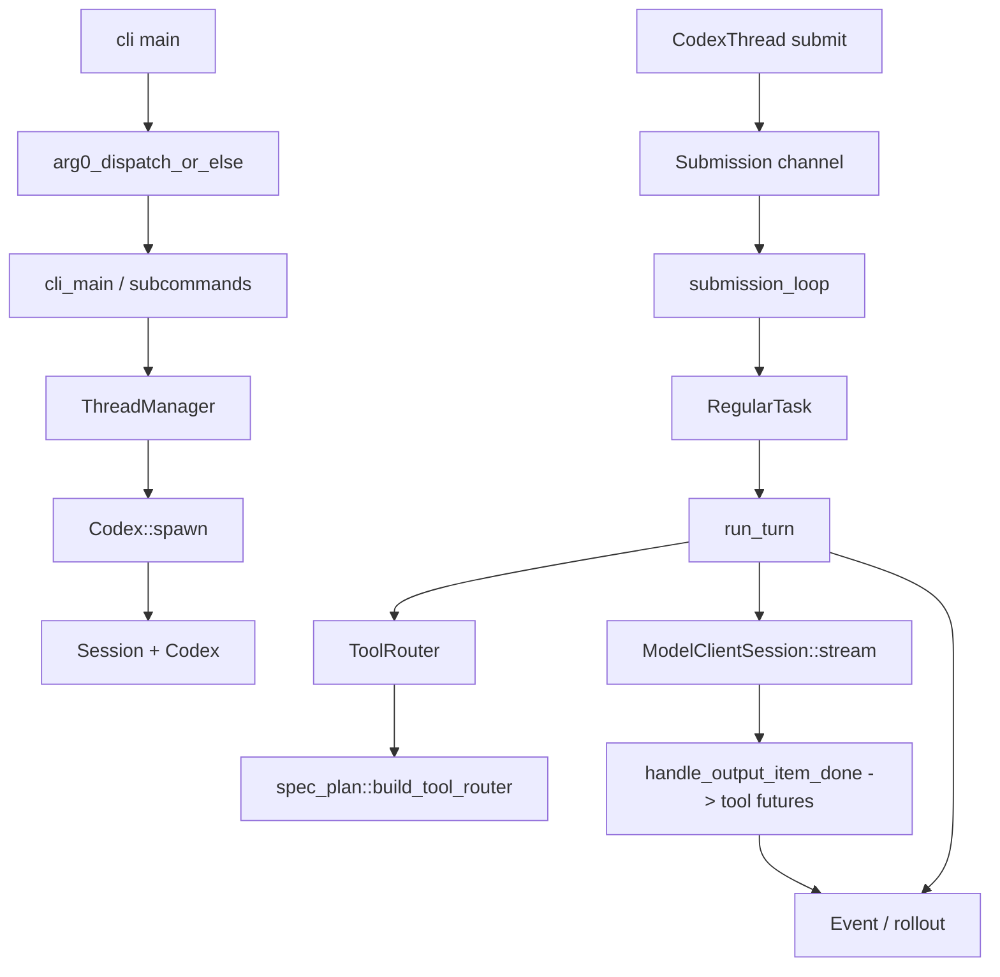

> Codex 的主干是一条从 CLI/arg0 dispatch 进入 core `ThreadManager`，再经 `Codex` session 的 Submission Queue、regular turn、Responses streaming、ToolRouter runtime、Event Queue 回到 UI/client 的 agent runtime。[E: codex-rs/cli/src/main.rs:956][E: codex-rs/core/src/thread_manager.rs:1505][E: codex-rs/core/src/session/mod.rs:538][E: codex-rs/core/src/session/turn.rs:1912][E: codex-rs/core/src/tools/router.rs:35]

## 能回答的问题

- CLI/TUI/exec/app-server/MCP surface 如何汇入 core？
- Thread、Session、Submission Queue、Event Queue 的主边界在哪里？
- 一次 regular turn 如何从 `Op` 到 model stream，再到 tool futures？
- 当前工具系统入口为什么是 `ToolRouter::from_context` / `spec_plan::build_tool_router`？

该图是当前源码主线的压缩索引；细节以本节点下面的 evidence 为准。

## 1 Entry Surfaces

CLI binary 的 `main` 调用 `arg0_dispatch_or_else`；wrapper 调 `arg0_dispatch()` 先处理 argv0/argv1 helper dispatch，然后在运行时线程中执行传入的 async main closure。[E: codex-rs/cli/src/main.rs:956][E: codex-rs/cli/src/main.rs:958][E: codex-rs/cli/src/main.rs:959][E: codex-rs/arg0/src/lib.rs:58][E: codex-rs/arg0/src/lib.rs:100][E: codex-rs/arg0/src/lib.rs:216][E: codex-rs/arg0/src/lib.rs:222]

`cli_main` 解析 `MultitoolCli`，把 feature toggles 折叠进 config overrides，然后按 subcommand 分流到 TUI、exec、review、MCP server 等 surface。[E: codex-rs/cli/src/main.rs:964][E: codex-rs/cli/src/main.rs:978][E: codex-rs/cli/src/main.rs:1002][E: codex-rs/cli/src/main.rs:1045]

`codex-core` 是共享 runtime crate：`lib.rs` 公开 re-export `CodexThread`、`TurnContext`、`ThreadManager` 等 selected surfaces，同时以 private modules 挂载 `unified_exec`、`thread_manager`、`tools` 等内部实现。[E: codex-rs/core/src/lib.rs:21][E: codex-rs/core/src/lib.rs:32][E: codex-rs/core/src/lib.rs:105][E: codex-rs/core/src/lib.rs:112][E: codex-rs/core/src/lib.rs:149]

## 2 Thread 与 Session

`ThreadManagerState::spawn_thread_with_source` 是创建/恢复 thread 的核心入口；它会处理 resumed thread 已运行的情况，然后调用 `Codex::spawn` 并在 `finalize_thread_spawn` 中把 `Codex` 包成 `CodexThread` 登记到 thread map。[E: codex-rs/core/src/thread_manager.rs:1505][E: codex-rs/core/src/thread_manager.rs:1527][E: codex-rs/core/src/thread_manager.rs:1573][E: codex-rs/core/src/thread_manager.rs:1614][E: codex-rs/core/src/thread_manager.rs:1642]

`Codex::spawn` 初始化 session；当前 submission channel capacity 常量为 512，`Session::new` 得到 event sender 并创建 session 服务。[E: codex-rs/core/src/session/mod.rs:470][E: codex-rs/core/src/session/mod.rs:476][E: codex-rs/core/src/session/mod.rs:538][E: codex-rs/core/src/session/mod.rs:677][E: codex-rs/core/src/session/mod.rs:685]

协议层把输入建模成 `Submission { id, op, client_user_message_id, trace }` 和 `Op` enum，把输出建模成 `Event { id, msg }` 和 `EventMsg` enum。[E: codex-rs/protocol/src/protocol.rs:161][E: codex-rs/protocol/src/protocol.rs:169][E: codex-rs/protocol/src/protocol.rs:515][E: codex-rs/protocol/src/protocol.rs:1254][E: codex-rs/protocol/src/protocol.rs:1267]

`CodexThread::submit` 委托给 `Codex::submit`；`Codex::submit_with_trace` 生成 UUID v7 submission id 后走 `submit_with_id`，`submit_with_id` 补 trace 并发送到 SQ；`CodexThread::next_event` 委托给 `Codex::next_event` 从 EQ 取事件。[E: codex-rs/core/src/codex_thread.rs:194][E: codex-rs/core/src/session/mod.rs:736][E: codex-rs/core/src/session/mod.rs:741][E: codex-rs/core/src/codex_thread.rs:412][E: codex-rs/core/src/session/mod.rs:805]

## 3 Turn 主线

`submission_loop` 从 SQ 读取 `Submission` 并按 `Op` 分派；用户 turn path 会调用 `sess.spawn_task(..., RegularTask::new())`。[E: codex-rs/core/src/session/handlers.rs:702][E: codex-rs/core/src/session/handlers.rs:709][E: codex-rs/core/src/session/handlers.rs:713][E: codex-rs/core/src/session/handlers.rs:260][E: codex-rs/core/src/session/handlers.rs:263]

`RegularTask` 在 run_turn 前发送 `TurnStarted`，消费 startup prewarm，然后循环调用 `run_turn`；如果一轮结束后还有 pending input，任务可继续下一次 sampling。[E: codex-rs/core/src/tasks/regular.rs:49][E: codex-rs/core/src/tasks/regular.rs:58][E: codex-rs/core/src/tasks/regular.rs:73][E: codex-rs/core/src/tasks/regular.rs:82]

`run_turn` 先做 pre-sampling compaction、context update、skills/plugins build、hooks/input recording，然后进入 sampling request。[E: codex-rs/core/src/session/turn.rs:142][E: codex-rs/core/src/session/turn.rs:156][E: codex-rs/core/src/session/turn.rs:171][E: codex-rs/core/src/session/turn.rs:175][E: codex-rs/core/src/session/turn.rs:190]

`run_sampling_request` 通过 `built_tools` 拿到 `ToolRouter`，构造 `ToolCallRuntime`，用 prompt + router 构造请求，并通过 `ModelClientSession::stream` 发起 streaming。[E: codex-rs/core/src/session/turn.rs:1072][E: codex-rs/core/src/session/turn.rs:1083][E: codex-rs/core/src/session/turn.rs:1087][E: codex-rs/core/src/session/turn.rs:1111][E: codex-rs/core/src/session/turn.rs:1912][E: codex-rs/core/src/session/turn.rs:1913]

`built_tools` 的当前工具系统入口是 `ToolRouter::from_context(...)`，它接收 direct/deferred MCP、tool suggest、extension executors 和 dynamic tools，再进入 `spec_plan::build_tool_router`。[E: codex-rs/core/src/session/turn.rs:1291][E: codex-rs/core/src/session/turn.rs:1305][E: codex-rs/core/src/tools/router.rs:60][E: codex-rs/core/src/tools/spec_plan.rs:160]

当 stream item 完成时，`handle_output_item_done` 调 `ToolRouter::build_tool_call`；若产生 tool future，sampling loop 放入 `in_flight`，最后 `drain_in_flight` 把 tool output 写回 conversation history。[E: codex-rs/core/src/stream_events_utils.rs:405][E: codex-rs/core/src/stream_events_utils.rs:415][E: codex-rs/core/src/session/turn.rs:2059][E: codex-rs/core/src/session/turn.rs:2068][E: codex-rs/core/src/session/turn.rs:1853][E: codex-rs/core/src/session/turn.rs:1862]

事件由 `Session::send_event` 包成 `Event { id: turn_context.sub_id, msg }` 后进入 `send_event_raw`；`send_event_raw` 先持久化 rollout item，再记录 protocol event 并 deliver 到 event channel。[E: codex-rs/core/src/session/mod.rs:1742][E: codex-rs/core/src/session/mod.rs:1762][E: codex-rs/core/src/session/mod.rs:1763][E: codex-rs/core/src/session/mod.rs:1766][E: codex-rs/core/src/session/mod.rs:1916][E: codex-rs/core/src/session/mod.rs:1918][E: codex-rs/core/src/session/mod.rs:1923]

## Sources

- `codex-rs/cli/src/main.rs`
- `codex-rs/arg0/src/lib.rs`
- `codex-rs/core/src/lib.rs`
- `codex-rs/protocol/src/protocol.rs`
- `codex-rs/core/src/thread_manager.rs`
- `codex-rs/core/src/codex_thread.rs`
- `codex-rs/core/src/session/mod.rs`
- `codex-rs/core/src/session/handlers.rs`
- `codex-rs/core/src/tasks/regular.rs`
- `codex-rs/core/src/session/turn.rs`
- `codex-rs/core/src/stream_events_utils.rs`
- `codex-rs/core/src/tools/router.rs`
- `codex-rs/core/src/tools/spec_plan.rs`

## 相关

- [SQ/EQ 架构](sq-eq-architecture.md)
- [进程生命周期](process-lifecycle.md)
- [一次 turn 端到端](turn-end-to-end.md)
- [工具调用解剖](tool-call-anatomy.md)
- [工具系统机制](../subsystems/core/tool-system.md)
