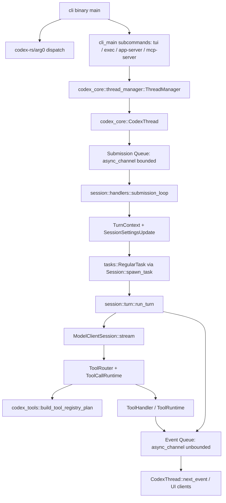

> Codex 源码的主干是一条从 CLI 进程入口、Thread/Session 队列、turn 引擎、模型 streaming、工具 runtime、事件回传组成的 bidirectional agent runtime。[I]

## 能回答的问题

- Codex 从命令行入口到一次模型 turn 的主控制流是什么？
- `codex-rs/core` 在源码架构中承担哪些职责？
- SQ/EQ、ThreadManager、Session、Turn 和 ToolRouter 的关系是什么？
- 为什么工具清单要从 `build_tool_registry_plan` 开始追？
- CLI/TUI/exec/app-server/MCP server 这些 surface 怎样进入同一个 core runtime？

该 flowchart 是后续编号步骤的视觉索引；具体控制流事实以编号步骤中的源码证据为准。[I]

## 端到端步骤

1. CLI binary 的 `main` 调用 `arg0_dispatch_or_else`；`arg0_dispatch_or_else` 先执行 `arg0_dispatch` 分流 argv0/argv1 helper，正常入口再构建 runtime 并执行传入的 `cli_main` closure。[E: codex-rs/cli/src/main.rs:677][E: codex-rs/cli/src/main.rs:678][E: codex-rs/cli/src/main.rs:679][E: codex-rs/arg0/src/lib.rs:183][E: codex-rs/arg0/src/lib.rs:187][E: codex-rs/arg0/src/lib.rs:202]
2. `arg0_dispatch` 处理 `codex-execve-wrapper`、linux sandbox、`apply_patch`/`applypatch`、filesystem helper 和 core apply-patch helper 这些别名或 helper 参数。[E: codex-rs/arg0/src/lib.rs:81][E: codex-rs/arg0/src/lib.rs:91][E: codex-rs/arg0/src/lib.rs:93][E: codex-rs/arg0/src/lib.rs:98][E: codex-rs/arg0/src/lib.rs:100][E: codex-rs/arg0/src/lib.rs:117]
3. `codex_cli::cli_main` 用 clap 解析 `MultitoolCli`，折叠 feature toggles，然后按 subcommand 分流到 TUI、`exec`、`review`、MCP server、MCP CLI、app-server、resume/fork/cloud 等 surface。[E: codex-rs/cli/src/main.rs:691][E: codex-rs/cli/src/main.rs:694][E: codex-rs/cli/src/main.rs:705][E: codex-rs/cli/src/main.rs:727][E: codex-rs/cli/src/main.rs:741][E: codex-rs/cli/src/main.rs:749][E: codex-rs/cli/src/main.rs:759][E: codex-rs/cli/src/main.rs:795][E: codex-rs/cli/src/main.rs:845][E: codex-rs/cli/src/main.rs:872][E: codex-rs/cli/src/main.rs:957]
4. 创建新 thread 的 runtime path 会进入 `ThreadManagerState::spawn_thread_with_source`；该函数调用 `Codex::spawn`，后续 finalize path 把返回的 `Codex` 包进 `CodexThread` 并登记到 thread map。恢复已有 thread 也属于 agent runtime lifecycle，但不由这三行单独完整证明。[E: codex-rs/core/src/thread_manager.rs:939][E: codex-rs/core/src/thread_manager.rs:982][E: codex-rs/core/src/thread_manager.rs:988][I]
5. `codex_core::session::Codex::spawn_internal` 建立核心双队列：`tx_sub/rx_sub` 是 bounded submission channel，`tx_event/rx_event` 是 unbounded event channel；随后创建 `Session` 并用 Tokio task 启动 `submission_loop(session_for_loop, config, rx_sub)`。[E: codex-rs/core/src/session/mod.rs:458][E: codex-rs/core/src/session/mod.rs:459][E: codex-rs/core/src/session/mod.rs:633][E: codex-rs/core/src/session/mod.rs:661]
6. 客户端用 `CodexThread::submit` 或 `Codex::submit` 把 `Op` 包成 `Submission`；`submit_with_trace` 生成 UUID v7 作为 submission id，`submit_with_id` 在缺少 trace 时补 W3C trace 并发送到 SQ。[E: codex-rs/core/src/codex_thread.rs:78][E: codex-rs/core/src/session/mod.rs:686][E: codex-rs/core/src/session/mod.rs:687][E: codex-rs/core/src/session/mod.rs:688][E: codex-rs/core/src/session/mod.rs:689][E: codex-rs/core/src/session/mod.rs:690][E: codex-rs/core/src/session/mod.rs:700][E: codex-rs/core/src/session/mod.rs:703]
7. `session::handlers::submission_loop` 从 SQ 读 `Submission`，按 `Op` 变体分派；`Op::UserInput` 和 `Op::UserTurn` 进入 `user_input_or_turn`，审批响应、MCP 列表、compact、shell command、shutdown 等操作走各自 handler。[E: codex-rs/core/src/session/handlers.rs:1012][E: codex-rs/core/src/session/handlers.rs:1099][E: codex-rs/core/src/session/handlers.rs:1106][E: codex-rs/core/src/session/handlers.rs:1158][E: codex-rs/core/src/session/handlers.rs:1182][E: codex-rs/core/src/session/handlers.rs:1197]
8. `user_input_or_turn_inner` 把 `Op::UserTurn` 的 cwd、approval policy、sandbox policy、reasoning summary、service tier、final output schema、personality 写入 `SessionSettingsUpdate`；model 和 reasoning effort 进入 fallback `CollaborationMode` settings；`environments` 作为单独参数传给 `Session::new_turn_with_sub_id`。[E: codex-rs/core/src/session/handlers.rs:144][E: codex-rs/core/src/session/handlers.rs:148][E: codex-rs/core/src/session/handlers.rs:149][E: codex-rs/core/src/session/handlers.rs:156][E: codex-rs/core/src/session/handlers.rs:157][E: codex-rs/core/src/session/handlers.rs:158][E: codex-rs/core/src/session/handlers.rs:160][E: codex-rs/core/src/session/handlers.rs:163][E: codex-rs/core/src/session/handlers.rs:164][E: codex-rs/core/src/session/handlers.rs:165][E: codex-rs/core/src/session/handlers.rs:166][E: codex-rs/core/src/session/handlers.rs:171][E: codex-rs/core/src/session/handlers.rs:192]
9. 如果当前没有 active turn，`user_input_or_turn_inner` 调用 `Session::spawn_task(..., RegularTask::new())`；`Session::spawn_task` 会先 abort 旧任务、清空 connector selection，再进入 `start_task` 记录 active turn 并启动 Tokio task。[E: codex-rs/core/src/session/handlers.rs:212][E: codex-rs/core/src/session/handlers.rs:222][E: codex-rs/core/src/tasks/mod.rs:242][E: codex-rs/core/src/tasks/mod.rs:248][E: codex-rs/core/src/tasks/mod.rs:250][E: codex-rs/core/src/tasks/mod.rs:275][E: codex-rs/core/src/tasks/mod.rs:291][E: codex-rs/core/src/tasks/mod.rs:308][E: codex-rs/core/src/tasks/mod.rs:354]
10. `RegularTask::run` 发 `TurnStarted`，消费 startup prewarm，然后循环调用 `session::turn::run_turn`；如果 run_turn 结束后还有 pending input，RegularTask 会用空输入继续下一轮 sampling。[E: codex-rs/core/src/tasks/regular.rs:47][E: codex-rs/core/src/tasks/regular.rs:55][E: codex-rs/core/src/tasks/regular.rs:56][E: codex-rs/core/src/tasks/regular.rs:57][E: codex-rs/core/src/tasks/regular.rs:59][E: codex-rs/core/src/tasks/regular.rs:60][E: codex-rs/core/src/tasks/regular.rs:61][E: codex-rs/core/src/tasks/regular.rs:62][E: codex-rs/core/src/tasks/regular.rs:68][E: codex-rs/core/src/tasks/regular.rs:77][E: codex-rs/core/src/tasks/regular.rs:80]
11. `run_turn` 在模型请求前运行 context/skill/plugin/MCP 准备逻辑，用 `clone_history().for_prompt(...)` 构造 `sampling_request_input` 并传入 `run_sampling_request`；`run_sampling_request` 通过 `built_tools` 创建 `ToolRouter`，再通过 `ModelClientSession::stream` 发起 Responses streaming。[E: codex-rs/core/src/session/turn.rs:155][E: codex-rs/core/src/session/turn.rs:168][E: codex-rs/core/src/session/turn.rs:171][E: codex-rs/core/src/session/turn.rs:435][E: codex-rs/core/src/session/turn.rs:437][E: codex-rs/core/src/session/turn.rs:449][E: codex-rs/core/src/session/turn.rs:455][E: codex-rs/core/src/session/turn.rs:1028][E: codex-rs/core/src/session/turn.rs:1035][E: codex-rs/core/src/session/turn.rs:1880][E: codex-rs/core/src/session/turn.rs:1881]
12. 工具集合的 ground truth 是公共 re-export `codex_tools::build_tool_registry_plan`；它按 `ToolsConfig`、MCP tools、dynamic tools、feature flags 把 `ToolSpec` 和 `ToolHandlerKind` 放进 plan，再由 core 的 `build_specs_with_discoverable_tools` 调用 plan builder 并按 handler kind 注册 handler。[E: codex-rs/tools/src/lib.rs:121][E: codex-rs/tools/src/tool_registry_plan.rs:71][E: codex-rs/tools/src/tool_registry_plan.rs:535][E: codex-rs/tools/src/tool_registry_plan.rs:548][E: codex-rs/tools/src/tool_registry_plan.rs:566][E: codex-rs/tools/src/tool_registry_plan.rs:577][E: codex-rs/core/src/tools/spec.rs:128][E: codex-rs/core/src/tools/spec.rs:228][E: codex-rs/core/src/tools/spec.rs:252][E: codex-rs/core/src/tools/spec.rs:261][E: codex-rs/core/src/tools/spec.rs:275]
13. 模型 stream 产生 `ResponseItem::FunctionCall`、`CustomToolCall` 或 `LocalShellCall` 时，`handle_output_item_done` 调用 `ToolRouter::build_tool_call` 并构造 `ToolCallRuntime::handle_tool_call` 的 future；sampling loop 把 future 放入 `in_flight`，drain 后转成 tool output item 写回 history，推动下一次 sampling。[E: codex-rs/core/src/stream_events_utils.rs:228][E: codex-rs/core/src/stream_events_utils.rs:247][E: codex-rs/core/src/stream_events_utils.rs:248][E: codex-rs/core/src/stream_events_utils.rs:249][E: codex-rs/core/src/stream_events_utils.rs:250][E: codex-rs/core/src/stream_events_utils.rs:253][E: codex-rs/core/src/session/turn.rs:2013][E: codex-rs/core/src/session/turn.rs:2240][E: codex-rs/core/src/session/turn.rs:1836]
14. `Session::send_event` 把事件封装为 `Event { id: turn_context.sub_id, msg }`，经 `send_event_raw` 持久化为 rollout item，再发送到 event channel；`Codex::next_event` 和 `CodexThread::next_event` 从 EQ 取事件交给 UI 或调用方。[E: codex-rs/core/src/session/mod.rs:1397][E: codex-rs/core/src/session/mod.rs:1401][E: codex-rs/core/src/session/mod.rs:1512][E: codex-rs/core/src/session/mod.rs:1513][E: codex-rs/core/src/session/mod.rs:1514][E: codex-rs/core/src/session/mod.rs:1522][E: codex-rs/core/src/session/mod.rs:733][E: codex-rs/core/src/session/mod.rs:734][E: codex-rs/core/src/codex_thread.rs:135]

## 关键设计点

- `codex-rs/core/src/lib.rs` 明确把 `session`、`CodexThread`、`config`、`exec`、`mcp`、`tools`、`unified_exec` 等模块集中导出或挂载，因此 `codex-core` 是 CLI/TUI/app-server/MCP surface 共享的 runtime crate。[E: codex-rs/core/src/lib.rs:16][E: codex-rs/core/src/lib.rs:20][E: codex-rs/core/src/lib.rs:26][E: codex-rs/core/src/lib.rs:31][E: codex-rs/core/src/lib.rs:43][E: codex-rs/core/src/lib.rs:108][E: codex-rs/core/src/lib.rs:145][I]
- Protocol 层把入口动作建模成 `Op`，把出口消息建模成 `EventMsg`；这使 front-end、app-server、subagent、tests 都能围绕同一组 Submission/Event 类型工作。[E: codex-rs/protocol/src/protocol.rs:398][E: codex-rs/protocol/src/protocol.rs:1426][I]
- `ThreadManager` 负责“创建和登记 thread”，`Session` 负责“处理 turn 和工具”，`ToolRouter/ToolRegistry` 负责“把模型输出绑定到 handler”；这三个边界是对实际调用链的归纳。[E: codex-rs/core/src/thread_manager.rs:939][E: codex-rs/core/src/thread_manager.rs:988][E: codex-rs/core/src/session/handlers.rs:1099][E: codex-rs/core/src/tools/router.rs:185][I]
- 设计动机可以概括为“surface thin, core stateful, protocol explicit, tools planned”。其中 “thin/core/protocol/planned” 是对源码边界的归纳，不是单行注释里的声明。[I]

## 深挖入口

- `spine.sq-eq-architecture` 解释 Submission Queue 和 Event Queue 的职责、容量和跨 thread 事件转发。
- `spine.process-lifecycle` 解释 argv0 dispatch、CLI subcommand、Tokio runtime 和 process aliases。
- `spine.turn-end-to-end` 逐步走读一次 regular turn 的 context、model、tool、follow-up loop。
- `spine.tool-call-anatomy` 拆解 `ToolSpec`、`ToolRouter`、`ToolCallRuntime`、`ToolRegistry` 和并行锁。

## Sources

- codex-rs/cli/src/main.rs
- codex-rs/arg0/src/lib.rs
- codex-rs/core/src/lib.rs
- codex-rs/protocol/src/protocol.rs
- codex-rs/core/src/codex_thread.rs
- codex-rs/core/src/session/mod.rs
- codex-rs/core/src/session/handlers.rs
- codex-rs/core/src/session/turn.rs
- codex-rs/core/src/stream_events_utils.rs
- codex-rs/core/src/tasks/mod.rs
- codex-rs/core/src/tasks/regular.rs
- codex-rs/core/src/tools/router.rs
- codex-rs/core/src/tools/spec.rs
- codex-rs/tools/src/lib.rs
- codex-rs/tools/src/tool_registry_plan.rs
- codex-rs/core/src/thread_manager.rs

## 相关

- [SQ/EQ 架构](sq-eq-architecture.md)
- [进程生命周期](process-lifecycle.md)
- [一次 turn 端到端](turn-end-to-end.md)
- [工具调用解剖](tool-call-anatomy.md)
- 索引 id：`subsys.core.session-lifecycle`
