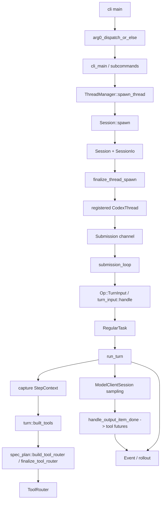

> Codex 的主干从 CLI/arg0 dispatch 进入 `ThreadManagerState::spawn_thread`，由 `Session::spawn` 返回 runtime state 与 `SessionIo` queue endpoints，`CodexThread` 再把它们组合成 thread conduit；之后经 `Op::TurnInput`、regular turn、Responses stream、ToolRouter、Event Queue 返回 client。[E: codex-rs/cli/src/main.rs:1126][E: codex-rs/core/src/thread_manager.rs:1925][E: codex-rs/core/src/session/mod.rs:502][E: codex-rs/core/src/codex_thread.rs:227][E: codex-rs/protocol/src/protocol.rs:628][E: codex-rs/core/src/session/turn.rs:163]

## 能回答的问题

- CLI/TUI/exec/app-server 如何汇入 core？`codex mcp-server` 是否还存在？
- 当前 workspace 有多少 crate，本轮新增了哪些？
- Thread、Session、Submission Queue、Event Queue 的主边界在哪里？
- 一次 regular turn 如何从 `Op::TurnInput` 到 model stream，再到 tool futures？
- 当前工具系统为什么在 `StepContext` capture 时经 `turn::built_tools` / `spec_plan::build_tool_router` 组装？

```mermaid
flowchart TD
    CLI["cli main"] --> ARG0["arg0_dispatch_or_else"]
    ARG0 --> CLI_MAIN["cli_main / subcommands"]
    CLI_MAIN --> TM["ThreadManager::spawn_thread"]
    TM --> SPAWN["Session::spawn"]
    SPAWN --> SESSION["Session + SessionIo"]
    SESSION --> FINALIZE["finalize_thread_spawn"]
    FINALIZE --> CLIENT["registered CodexThread"]
    CLIENT --> SQ["Submission channel"]
    SQ --> LOOP["submission_loop"]
    LOOP --> TURNIN["Op::TurnInput / turn_input::handle"]
    TURNIN --> TASK["RegularTask"]
    TASK --> TURN["run_turn"]
    TURN --> STEP["capture StepContext"]
    STEP --> BUILT["turn::built_tools"]
    BUILT --> SPECPLAN["spec_plan::build_tool_router / finalize_tool_router"]
    SPECPLAN --> ROUTER["ToolRouter"]
    TURN --> STREAM["ModelClientSession sampling"]
    STREAM --> TOOLS["handle_output_item_done -> tool futures"]
    TOOLS --> EQ["Event / rollout"]
    TURN --> EQ
```

该图是当前源码主线的压缩索引；细节以本节点下面的 evidence 为准。

## 0 Workspace crates

`codex-rs/Cargo.toml` workspace `members` 共 **147** 个 crate（`members` 列表第 3–149 行，含 `exec-server/tests/support`）。[E: codex-rs/Cargo.toml:2][E: codex-rs/Cargo.toml:149]

相对上一轮 wiki 基线（145）净增 2：`ext/guardian-reviewer`、`user-verification`。[E: codex-rs/Cargo.toml:65][E: codex-rs/Cargo.toml:105]

没有 `mcp-server` member；MCP **client** crates `codex-mcp` / `rmcp-client` 仍在。[E: codex-rs/Cargo.toml:82][E: codex-rs/Cargo.toml:97]

Folder consent（`check_directory_trust`）是 TUI 在 picker 解析 destination 之后、创建/resume task 之前的门，不是新 crate。[E: codex-rs/tui/src/lib.rs:1719][E: codex-rs/tui/src/onboarding/directory_trust.rs:33]

`Feature` enum 与 `FEATURES` registry 均为 **144** 项。[E: codex-rs/features/src/lib.rs:93][E: codex-rs/features/src/lib.rs:908]

wiki 总节点 **185**，工具节点 **39**（含 `request_user_input_async`）。[I]

技能 discovery/namespace 仍在 `ext/skills`，invocation/selection 在 `skills`。[E: codex-rs/Cargo.toml:73][E: codex-rs/Cargo.toml:44]

## 1 Entry Surfaces

CLI binary 的 `main` 读取 remote-control env，然后把 `cli_main` closure 交给 `arg0_dispatch_or_else`。[E: codex-rs/cli/src/main.rs:1126][E: codex-rs/cli/src/main.rs:1128][E: codex-rs/cli/src/main.rs:1129]

`arg0_dispatch` 先处理 argv0/argv1 helper dispatch；未接管时 `arg0_dispatch_or_else` 在 `codex-main` 线程里构建 Tokio runtime 并运行 async main。[E: codex-rs/arg0/src/lib.rs:60][E: codex-rs/arg0/src/lib.rs:102][E: codex-rs/arg0/src/lib.rs:222][E: codex-rs/arg0/src/lib.rs:236]

`cli_main` 解析 `MultitoolCli`，把 `--enable/--disable` feature toggles 折叠进 config overrides，然后按 `Subcommand`（**29** 个变体，无 `McpServer`）分流到 TUI（含 `codex agents`）、exec、review、MCP **client** 管理、app-server、exec-server、doctor 等 surface。`codex mcp-server` 已删除。[E: codex-rs/cli/src/main.rs:1135][E: codex-rs/cli/src/main.rs:1148][E: codex-rs/cli/src/main.rs:1149][E: codex-rs/cli/src/main.rs:1182][E: codex-rs/cli/src/main.rs:1234][E: codex-rs/cli/src/main.rs:1271][E: codex-rs/cli/src/main.rs:1319][E: codex-rs/cli/src/main.rs:1671][E: codex-rs/cli/src/main.rs:1842][E: codex-rs/cli/src/main.rs:148]

`codex-core` 是共享 runtime crate：`lib.rs` 公开 re-export `TurnInput`/`TurnInputRequest`/`CodexThread`/`TurnContext`/`ThreadManager` 等 selected surfaces，同时以 private modules 挂载 `unified_exec`、`thread_manager`、`tools` 等内部实现。[E: codex-rs/core/src/lib.rs:24][E: codex-rs/core/src/lib.rs:25][E: codex-rs/core/src/lib.rs:44][E: codex-rs/core/src/lib.rs:50][E: codex-rs/core/src/lib.rs:112][E: codex-rs/core/src/lib.rs:120][E: codex-rs/core/src/lib.rs:159]

## 2 Thread 与 Session

`ThreadManagerState::spawn_new_thread_with_source` / `spawn_thread` 是创建/恢复入口；`spawn_thread` 处理 resumed-thread 去重，调用 `Session::spawn(SessionSpawnArgs)` 得到 `(session, io)`，再由 `finalize_thread_spawn` 组装 `CodexThread` 并登记。[E: codex-rs/core/src/thread_manager.rs:1799][E: codex-rs/core/src/thread_manager.rs:1925][E: codex-rs/core/src/thread_manager.rs:2096][E: codex-rs/core/src/thread_manager.rs:2180]

`Session::spawn` 初始化 session；submission channel capacity 为 512；spawn 最终返回 `Arc<Session>` 与独立 `SessionIo`。[E: codex-rs/core/src/session/mod.rs:494][E: codex-rs/core/src/session/mod.rs:502][E: codex-rs/core/src/session/mod.rs:530][E: codex-rs/core/src/session/mod.rs:574][E: codex-rs/core/src/session/mod.rs:884][E: codex-rs/core/src/session/mod.rs:891]

协议层把输入建模成 `Submission { id, op, trace, parent_turn_id, root_turn_id }` 和 `Op` enum（**28** 个变体，从 `Interrupt` 到 `RunUserShellCommand`）。没有 `Op::ThreadRollback`。[E: codex-rs/protocol/src/protocol.rs:192][E: codex-rs/protocol/src/protocol.rs:196][E: codex-rs/protocol/src/protocol.rs:202][E: codex-rs/protocol/src/protocol.rs:204][E: codex-rs/protocol/src/protocol.rs:600][E: codex-rs/protocol/src/protocol.rs:603][E: codex-rs/protocol/src/protocol.rs:760] `parent_turn_id` 是 core-provided direct-parent provenance，`root_turn_id` 是因果根 turn。regular turn 入口是 `Op::TurnInput`，另有独立 `Op::ThreadSettings`、`Op::TurnSettings`、`Op::SuspendTurnAndShutdown`、`Op::ApproveGuardianDeniedAction`。[E: codex-rs/protocol/src/protocol.rs:628][E: codex-rs/protocol/src/protocol.rs:650][E: codex-rs/protocol/src/protocol.rs:657][E: codex-rs/protocol/src/protocol.rs:642][E: codex-rs/protocol/src/protocol.rs:750] 输出仍是 `Event { id, msg }` 和 `EventMsg` enum（**83** 个变体）。`EventMsg::ThreadRolledBack` 仍在，只用于 replay 已写入 rollout 的 legacy marker，不是活 Op。[E: codex-rs/protocol/src/protocol.rs:1339][E: codex-rs/protocol/src/protocol.rs:1357][E: codex-rs/protocol/src/protocol.rs:1403]

`CodexThread::submit`/`submit_with_trace` 委托给内部 `SessionIo`。普通 `submit` / `submit_with_trace` 强制 parent/root 为空；公开 turn API 是 `start_or_steer_turn` / `start_turn_if_idle` / `steer_turn`，经 `submit_turn_input` 发送带 oneshot reply 的 `Op::TurnInput`。[E: codex-rs/core/src/codex_thread.rs:227][E: codex-rs/core/src/codex_thread.rs:311][E: codex-rs/core/src/codex_thread.rs:328][E: codex-rs/core/src/session/mod.rs:897][E: codex-rs/core/src/session/mod.rs:904][E: codex-rs/core/src/session/mod.rs:939]

## 3 Turn 主线

`submission_loop` 从 SQ 读取 `Submission` 并按 `Op` 分派；`Op::TurnInput` 交给 `turn_input::handle`，由后者决定 start / steer / reject，并在 start 路径 `spawn_task(..., RegularTask::new())`。[E: codex-rs/core/src/session/handlers.rs:411][E: codex-rs/core/src/session/handlers.rs:426][E: codex-rs/core/src/session/handlers.rs:471][E: codex-rs/core/src/session/turn_input.rs:202][E: codex-rs/core/src/session/turn_input.rs:328]

`RegularTask` 在 run_turn 前发送 `TurnStarted`，消费 startup prewarm，然后循环调用 `run_turn`；如果一轮结束后 session input queue 仍有 pending input，任务以空 input 继续下一次 sampling。[E: codex-rs/core/src/tasks/regular.rs:49][E: codex-rs/core/src/tasks/regular.rs:51][E: codex-rs/core/src/tasks/regular.rs:77][E: codex-rs/core/src/tasks/regular.rs:92]

`run_turn` 先做 pre-sampling compaction，再解析 input 所需 MCP servers，capture 第一份 `StepContext`，随后记录 context update、构建 skills/plugins、运行 hooks/记录 input，然后进入 sampling loop。[E: codex-rs/core/src/session/turn.rs:183][E: codex-rs/core/src/session/turn.rs:234][E: codex-rs/core/src/session/turn.rs:258][E: codex-rs/core/src/session/turn.rs:283]

`capture_step_context_with_required_mcp_servers` 固定 environment/capability roots，再调用 `turn::built_tools` 把 router 放入 `StepContext`；`run_sampling_request` 从 `step_context` 构造 `ToolCallRuntime` 与 prompt。[E: codex-rs/core/src/session/mod.rs:3661][E: codex-rs/core/src/session/mod.rs:3803][E: codex-rs/core/src/session/turn.rs:1538][E: codex-rs/core/src/session/turn.rs:1551]

`turn::built_tools` 汇总 connectors 与 tool-suggest candidates 后调用 `spec_plan::build_tool_router`。后者按 core → MCP → extension → dynamic sources 填充 ordered `ToolRegistry`，构造 hosted specs，并由 `finalize_tool_router` 产出最终 router。Guardian reviewer turn（`is_basic_session_source`）跳过普通 MCP/extension/dynamic，并把 hosted specs 置空；core 面只保留 reviewer 工具。[E: codex-rs/core/src/session/turn.rs:1774][E: codex-rs/core/src/tools/spec_plan.rs:125][E: codex-rs/core/src/tools/spec_plan.rs:154][E: codex-rs/core/src/tools/spec_plan.rs:156][E: codex-rs/core/src/tools/spec_plan.rs:188][E: codex-rs/core/src/tools/spec_plan.rs:978]

当 stream item 完成时，`handle_output_item_done` 调 `ToolRouter::build_tool_call`；若产生 tool future，sampling loop 放入 `in_flight`，最后 drain 把 tool output 写回 conversation history。[E: codex-rs/core/src/stream_events_utils.rs:300][E: codex-rs/core/src/stream_events_utils.rs:308]

事件由 `Session::send_event` 包成 `Event { id: turn_context.sub_id, msg }` 后进入 `send_event_raw`；`send_event_raw` 经 `send_event_raw_with_persistence` 持久化 rollout 并 deliver 到 event channel。[E: codex-rs/core/src/session/mod.rs:2229][E: codex-rs/core/src/session/mod.rs:2249][E: codex-rs/core/src/session/mod.rs:2509][E: codex-rs/core/src/session/mod.rs:2527]

## Sources

- `codex-rs/Cargo.toml`
- `codex-rs/cli/src/main.rs`
- `codex-rs/arg0/src/lib.rs`
- `codex-rs/core/src/lib.rs`
- `codex-rs/protocol/src/protocol.rs`
- `codex-rs/core/src/thread_manager.rs`
- `codex-rs/core/src/codex_thread.rs`
- `codex-rs/core/src/session/mod.rs`
- `codex-rs/core/src/session/handlers.rs`
- `codex-rs/core/src/session/turn_input.rs`
- `codex-rs/core/src/tasks/regular.rs`
- `codex-rs/core/src/session/turn.rs`
- `codex-rs/core/src/stream_events_utils.rs`
- `codex-rs/core/src/tools/router.rs`
- `codex-rs/core/src/tools/spec_plan.rs`
- `codex-rs/features/src/lib.rs`
- `codex-rs/tui/src/lib.rs`
- `codex-rs/tui/src/onboarding/directory_trust.rs`

## 相关

- [SQ/EQ 架构](sq-eq-architecture.md)
- [进程生命周期](process-lifecycle.md)
- [一次 turn 端到端](turn-end-to-end.md)
- [工具调用解剖](tool-call-anatomy.md)
- [工具系统机制](../subsystems/core/tool-system.md)
