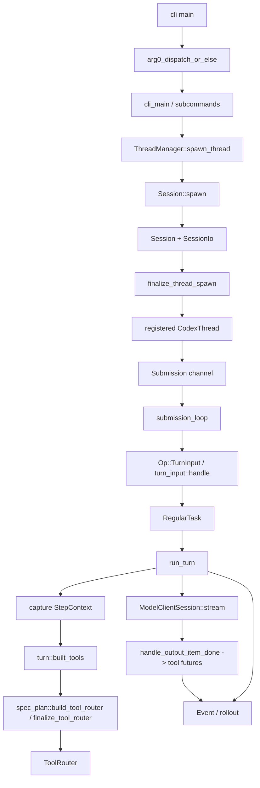

> Codex 的主干从 CLI/arg0 dispatch 进入 `ThreadManager::spawn_thread`，由 `Session::spawn` 返回 runtime state 与 `SessionIo` queue endpoints，`CodexThread` 再把它们组合成 thread conduit；之后经 `Op::TurnInput`、regular turn、Responses stream、ToolRouter、Event Queue 返回 client。[E: codex-rs/cli/src/main.rs:1038][E: codex-rs/core/src/thread_manager.rs:1864][E: codex-rs/core/src/session/mod.rs:481][E: codex-rs/core/src/codex_thread.rs:206][E: codex-rs/protocol/src/protocol.rs:601][E: codex-rs/core/src/session/turn.rs:156]

## 能回答的问题

- CLI/TUI/exec/app-server/MCP surface 如何汇入 core？
- 当前 workspace 有多少 crate，本轮新增了哪些？
- Thread、Session、Submission Queue、Event Queue 的主边界在哪里？
- 一次 regular turn 如何从 `Op::TurnInput` 到 model stream，再到 tool futures？
- 当前工具系统为什么在 `StepContext` capture 时经 `turn::built_tools` / `spec_plan::build_tool_router` 组装？

```mermaid
flowchart TD
    CLI["cli main"] --> ARG0["arg0_dispatch_or_else"]
    ARG0 --> CLI_MAIN["cli_main / subcommands"]
    CLI_MAIN --> TM["ThreadManager::spawn_thread"]
    TM --> SPAWN["Session::spawn"]
    SPAWN --> SESSION["Session + SessionIo"]
    SESSION --> FINALIZE["finalize_thread_spawn"]
    FINALIZE --> CLIENT["registered CodexThread"]
    CLIENT --> SQ["Submission channel"]
    SQ --> LOOP["submission_loop"]
    LOOP --> TURNIN["Op::TurnInput / turn_input::handle"]
    TURNIN --> TASK["RegularTask"]
    TASK --> TURN["run_turn"]
    TURN --> STEP["capture StepContext"]
    STEP --> BUILT["turn::built_tools"]
    BUILT --> SPECPLAN["spec_plan::build_tool_router / finalize_tool_router"]
    SPECPLAN --> ROUTER["ToolRouter"]
    TURN --> STREAM["ModelClientSession::stream"]
    STREAM --> TOOLS["handle_output_item_done -> tool futures"]
    TOOLS --> EQ["Event / rollout"]
    TURN --> EQ
```

该图是当前源码主线的压缩索引；细节以本节点下面的 evidence 为准。

## 0 Workspace crates

`codex-rs/Cargo.toml` workspace `members` 共 **138** 个 crate。[E: codex-rs/Cargo.toml:2]

相对上一轮 wiki 基线（134）净增 4：新增 `agent-roles`、`ext/history-notes`、`worktree`、`utils/redacted-string`；`ext/guardian` 改名为 `guardian-context`，不另占成员数。[E: codex-rs/Cargo.toml:7][E: codex-rs/Cargo.toml:47][E: codex-rs/Cargo.toml:64][E: codex-rs/Cargo.toml:102][E: codex-rs/Cargo.toml:115]

技能 discovery/namespace 仍在 `ext/skills`，invocation/selection 在 `skills`。[E: codex-rs/Cargo.toml:42][E: codex-rs/Cargo.toml:70]

## 1 Entry Surfaces

CLI binary 的 `main` 读取 remote-control env，然后把 `cli_main` closure 交给 `arg0_dispatch_or_else`。[E: codex-rs/cli/src/main.rs:1038][E: codex-rs/cli/src/main.rs:1040][E: codex-rs/cli/src/main.rs:1041][E: codex-rs/arg0/src/lib.rs:219]

`arg0_dispatch` 先处理 argv0/argv1 helper dispatch；未接管时 `arg0_dispatch_or_else` 在 `codex-main` 线程里构建 Tokio runtime 并运行 async main。[E: codex-rs/arg0/src/lib.rs:60][E: codex-rs/arg0/src/lib.rs:102][E: codex-rs/arg0/src/lib.rs:233][E: codex-rs/arg0/src/lib.rs:238]

`cli_main` 解析 `MultitoolCli`，把 `--enable/--disable` feature toggles 折叠进 config overrides，然后按 subcommand 分流到 TUI（含 `codex agents`）、exec、review、MCP server、app-server、exec-server、doctor 等 surface。[E: codex-rs/cli/src/main.rs:1046][E: codex-rs/cli/src/main.rs:1058][E: codex-rs/cli/src/main.rs:1059][E: codex-rs/cli/src/main.rs:1091][E: codex-rs/cli/src/main.rs:1144][E: codex-rs/cli/src/main.rs:1181][E: codex-rs/cli/src/main.rs:1245][E: codex-rs/cli/src/main.rs:1587][E: codex-rs/cli/src/main.rs:1758]

`codex-core` 是共享 runtime crate：`lib.rs` 公开 re-export `TurnInput`/`TurnInputRequest`/`CodexThread`/`TurnContext`/`ThreadManager` 等 selected surfaces，同时以 private modules 挂载 `unified_exec`、`thread_manager`、`tools` 等内部实现。[E: codex-rs/core/src/lib.rs:23][E: codex-rs/core/src/lib.rs:24][E: codex-rs/core/src/lib.rs:44][E: codex-rs/core/src/lib.rs:50][E: codex-rs/core/src/lib.rs:111][E: codex-rs/core/src/lib.rs:117][E: codex-rs/core/src/lib.rs:155]

## 2 Thread 与 Session

`ThreadManagerState::spawn_new_thread_with_source` / `spawn_thread` 是创建/恢复入口；`spawn_thread` 处理 resumed-thread 去重，调用 `Session::spawn(SessionSpawnArgs)` 得到 `(session, io)`，再由 `finalize_thread_spawn` 组装 `CodexThread` 并登记。[E: codex-rs/core/src/thread_manager.rs:1740][E: codex-rs/core/src/thread_manager.rs:1864][E: codex-rs/core/src/thread_manager.rs:1907][E: codex-rs/core/src/thread_manager.rs:1990][E: codex-rs/core/src/thread_manager.rs:2056]

`Session::spawn` 初始化 session；submission channel capacity 为 512，EQ 是 unbounded；spawn 最终返回 `Arc<Session>` 与独立 `SessionIo`。[E: codex-rs/core/src/session/mod.rs:475][E: codex-rs/core/src/session/mod.rs:481][E: codex-rs/core/src/session/mod.rs:547][E: codex-rs/core/src/session/mod.rs:548][E: codex-rs/core/src/session/mod.rs:819]

协议层把输入建模成 `Submission { id, op, trace, parent_turn_id, root_turn_id }` 和 `Op` enum（**29** 个变体）。`parent_turn_id` 是 core-provided direct-parent provenance，`root_turn_id` 是因果根 turn。regular turn 入口是 `Op::TurnInput`，另有独立 `Op::ThreadSettings`、`Op::TurnSettings`、`Op::ThreadRollback`、`Op::SuspendTurnAndShutdown`、`Op::ApproveGuardianDeniedAction`。输出仍是 `Event { id, msg }` 和 `EventMsg` enum（**83** 个变体）。[E: codex-rs/protocol/src/protocol.rs:190][E: codex-rs/protocol/src/protocol.rs:194][E: codex-rs/protocol/src/protocol.rs:200][E: codex-rs/protocol/src/protocol.rs:202][E: codex-rs/protocol/src/protocol.rs:573][E: codex-rs/protocol/src/protocol.rs:601][E: codex-rs/protocol/src/protocol.rs:615][E: codex-rs/protocol/src/protocol.rs:623][E: codex-rs/protocol/src/protocol.rs:630][E: codex-rs/protocol/src/protocol.rs:723][E: codex-rs/protocol/src/protocol.rs:729][E: codex-rs/protocol/src/protocol.rs:1319][E: codex-rs/protocol/src/protocol.rs:1337]

`CodexThread::submit`/`next_event` 委托给内部 `SessionIo`。普通 `submit` / `submit_with_trace` 强制 parent/root 为空；公开 turn API 是 `start_or_steer_turn` / `start_turn_if_idle` / `steer_turn`，经 `submit_turn_input` 发送带 oneshot reply 的 `Op::TurnInput`。[E: codex-rs/core/src/codex_thread.rs:251][E: codex-rs/core/src/codex_thread.rs:325][E: codex-rs/core/src/codex_thread.rs:342][E: codex-rs/core/src/session/mod.rs:825][E: codex-rs/core/src/session/mod.rs:867]

## 3 Turn 主线

`submission_loop` 从 SQ 读取 `Submission` 并按 `Op` 分派；`Op::TurnInput` 交给 `turn_input::handle`，由后者决定 start / steer / reject，并在 start 路径 `spawn_task(..., RegularTask::new())`。[E: codex-rs/core/src/session/handlers.rs:530][E: codex-rs/core/src/session/handlers.rs:537][E: codex-rs/core/src/session/handlers.rs:586][E: codex-rs/core/src/session/turn_input.rs:197][E: codex-rs/core/src/session/turn_input.rs:317]

`RegularTask` 在 run_turn 前发送 `TurnStarted`，消费 startup prewarm，然后循环调用 `run_turn`；如果一轮结束后 session input queue 仍有 pending input，任务以空 input 继续下一次 sampling。[E: codex-rs/core/src/tasks/regular.rs:50][E: codex-rs/core/src/tasks/regular.rs:59][E: codex-rs/core/src/tasks/regular.rs:77][E: codex-rs/core/src/tasks/regular.rs:91][E: codex-rs/core/src/tasks/regular.rs:94]

`run_turn` 先做 pre-sampling compaction，再解析 input 所需 MCP servers，capture 第一份 `StepContext`，随后记录 context update、构建 skills/plugins、运行 hooks/记录 input，然后进入 sampling loop。[E: codex-rs/core/src/session/turn.rs:172][E: codex-rs/core/src/session/turn.rs:196][E: codex-rs/core/src/session/turn.rs:210][E: codex-rs/core/src/session/turn.rs:253][E: codex-rs/core/src/session/turn.rs:269]

`capture_step_context_with_required_mcp_servers` 固定 environment/capability roots，parallel 获取 MCP binding 与 prepared tool recommendations，再调用 `turn::built_tools` 把 router 放入 `StepContext`；`run_sampling_request` 直接复用这份 router，构造 `ToolCallRuntime` 与 prompt，再通过 `ModelClientSession::stream` 发起 streaming。[E: codex-rs/core/src/session/mod.rs:3368][E: codex-rs/core/src/session/turn.rs:1362][E: codex-rs/core/src/session/turn.rs:1375][E: codex-rs/core/src/session/turn.rs:1405][E: codex-rs/core/src/session/turn.rs:1517][E: codex-rs/core/src/session/turn.rs:1587]

`turn::built_tools` 汇总 connectors 与 tool-suggest candidates 后调用 `spec_plan::build_tool_router`。后者按 core → MCP → extension → dynamic sources 填充 ordered `ToolRegistry`，构造 hosted specs，并由 `finalize_tool_router` 产出最终 router。Guardian reviewer turn 跳过普通 MCP/extension/dynamic，并把 hosted specs 置空；core 面只保留 reviewer 工具，且 thread store 若有 `GuardianReadOnlyHistoryTools` 会再挂只读 `history.*` extension tools。[E: codex-rs/core/src/session/turn.rs:1587][E: codex-rs/core/src/tools/spec_plan.rs:124][E: codex-rs/core/src/tools/spec_plan.rs:153][E: codex-rs/core/src/tools/spec_plan.rs:155][E: codex-rs/core/src/tools/spec_plan.rs:161][E: codex-rs/core/src/tools/spec_plan.rs:168][E: codex-rs/core/src/tools/spec_plan.rs:199][E: codex-rs/core/src/tools/spec_plan.rs:985]

当 `executed_tool_calls` recorder 存在时，sampling retry 在 build prompt 前把 pending executed-tool-call metadata 附加到 response-item 并统一 bound；这条 warehouse-only path 不改变 model-visible tool list。[E: codex-rs/core/src/session/turn.rs:1399][E: codex-rs/core/src/session/turn.rs:1403][I]

当 stream item 完成时，`handle_output_item_done` 调 `ToolRouter::build_tool_call`；若产生 tool future，sampling loop 放入 `in_flight`，最后 drain 把 tool output 写回 conversation history。[E: codex-rs/core/src/stream_events_utils.rs:290][E: codex-rs/core/src/stream_events_utils.rs:298][E: codex-rs/core/src/session/turn.rs:2415][E: codex-rs/core/src/session/turn.rs:2423]

事件由 `Session::send_event` 包成 `Event { id: turn_context.sub_id, msg }` 后进入 `send_event_raw`；`send_event_raw` 先持久化 rollout item，再记录 protocol event 并 deliver 到 event channel。[E: codex-rs/core/src/session/mod.rs:2011][E: codex-rs/core/src/session/mod.rs:2031][E: codex-rs/core/src/session/mod.rs:2291][E: codex-rs/core/src/session/mod.rs:2312][E: codex-rs/core/src/session/mod.rs:2318][E: codex-rs/core/src/session/mod.rs:2327]

## Sources

- `codex-rs/Cargo.toml`
- `codex-rs/cli/src/main.rs`
- `codex-rs/arg0/src/lib.rs`
- `codex-rs/core/src/lib.rs`
- `codex-rs/protocol/src/protocol.rs`
- `codex-rs/core/src/thread_manager.rs`
- `codex-rs/core/src/codex_thread.rs`
- `codex-rs/core/src/session/mod.rs`
- `codex-rs/core/src/session/handlers.rs`
- `codex-rs/core/src/session/turn_input.rs`
- `codex-rs/core/src/tasks/regular.rs`
- `codex-rs/core/src/session/turn.rs`
- `codex-rs/core/src/stream_events_utils.rs`
- `codex-rs/core/src/tools/router.rs`
- `codex-rs/core/src/tools/spec_plan.rs`

## 相关

- [SQ/EQ 架构](sq-eq-architecture.md)
- [进程生命周期](process-lifecycle.md)
- [一次 turn 端到端](turn-end-to-end.md)
- [工具调用解剖](tool-call-anatomy.md)
- [工具系统机制](../subsystems/core/tool-system.md)
