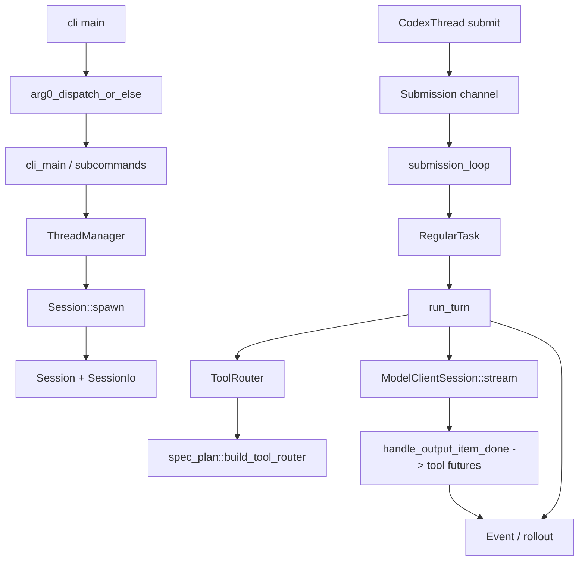

> Codex 的主干从 CLI/arg0 dispatch 进入 `ThreadManager`，由 `Session::spawn` 返回 runtime state 与 `SessionIo` queue endpoints，`CodexThread` 再把它们组合成 thread conduit；之后经 regular turn、Responses stream、ToolRouter、Event Queue 返回 client。[E: codex-rs/cli/src/main.rs:956][E: codex-rs/core/src/thread_manager.rs:1584][E: codex-rs/core/src/session/mod.rs:471][E: codex-rs/core/src/codex_thread.rs:162][E: codex-rs/core/src/session/turn.rs:1978]

## 能回答的问题

- CLI/TUI/exec/app-server/MCP surface 如何汇入 core？
- Thread、Session、Submission Queue、Event Queue 的主边界在哪里？
- 一次 regular turn 如何从 `Op` 到 model stream，再到 tool futures？
- 当前工具系统入口为什么是 `ToolRouter::from_context` / `spec_plan::build_tool_router`？

```mermaid
flowchart TD
    CLI["cli main"] --> ARG0["arg0_dispatch_or_else"]
    ARG0 --> CLI_MAIN["cli_main / subcommands"]
    CLI_MAIN --> TM["ThreadManager"]
    TM --> SPAWN["Session::spawn"]
    SPAWN --> SESSION["Session + SessionIo"]
    CLIENT["CodexThread submit"] --> SQ["Submission channel"]
    SQ --> LOOP["submission_loop"]
    LOOP --> TASK["RegularTask"]
    TASK --> TURN["run_turn"]
    TURN --> STREAM["ModelClientSession::stream"]
    TURN --> ROUTER["ToolRouter"]
    ROUTER --> SPECPLAN["spec_plan::build_tool_router"]
    STREAM --> TOOLS["handle_output_item_done -> tool futures"]
    TOOLS --> EQ["Event / rollout"]
    TURN --> EQ
```

该图是当前源码主线的压缩索引；细节以本节点下面的 evidence 为准。

## 1 Entry Surfaces

CLI binary 的 `main` 调用 `arg0_dispatch_or_else`；wrapper 调 `arg0_dispatch()` 先处理 argv0/argv1 helper dispatch，然后在运行时线程中执行传入的 async main closure。[E: codex-rs/cli/src/main.rs:956][E: codex-rs/cli/src/main.rs:958][E: codex-rs/cli/src/main.rs:959][E: codex-rs/arg0/src/lib.rs:58][E: codex-rs/arg0/src/lib.rs:100][E: codex-rs/arg0/src/lib.rs:216][E: codex-rs/arg0/src/lib.rs:222]

`cli_main` 解析 `MultitoolCli`，把 feature toggles 折叠进 config overrides，然后按 subcommand 分流到 TUI、exec、review、MCP server 等 surface。[E: codex-rs/cli/src/main.rs:964][E: codex-rs/cli/src/main.rs:978][E: codex-rs/cli/src/main.rs:1002][E: codex-rs/cli/src/main.rs:1045]

`codex-core` 是共享 runtime crate：`lib.rs` 公开 re-export `CodexThread`、`TurnContext`、`ThreadManager` 等 selected surfaces，同时以 private modules 挂载 `unified_exec`、`thread_manager`、`tools` 等内部实现。[E: codex-rs/core/src/lib.rs:22][E: codex-rs/core/src/lib.rs:34][E: codex-rs/core/src/lib.rs:105][E: codex-rs/core/src/lib.rs:111][E: codex-rs/core/src/lib.rs:149]

## 2 Thread 与 Session

`ThreadManagerState::spawn_thread_with_source` 是创建/恢复入口；它处理 resumed-thread 去重，调用 `Session::spawn(SessionSpawnArgs)` 得到 `(session, io)`，再由 `finalize_thread_spawn` 组装 `CodexThread` 并登记。[E: codex-rs/core/src/thread_manager.rs:1584][E: codex-rs/core/src/thread_manager.rs:1606][E: codex-rs/core/src/thread_manager.rs:1652][E: codex-rs/core/src/thread_manager.rs:1690][E: codex-rs/core/src/thread_manager.rs:1720]

`Session::spawn` 初始化 session；submission channel capacity 为 512，EQ 是 unbounded；spawn 最终返回 `Arc<Session>` 与独立 `SessionIo`。[E: codex-rs/core/src/session/mod.rs:465][E: codex-rs/core/src/session/mod.rs:471][E: codex-rs/core/src/session/mod.rs:533][E: codex-rs/core/src/session/mod.rs:726][E: codex-rs/core/src/session/mod.rs:733]

协议层把输入建模成 `Submission { id, op, client_user_message_id, trace }` 和 `Op` enum，把输出建模成 `Event { id, msg }` 和 `EventMsg` enum。[E: codex-rs/protocol/src/protocol.rs:174][E: codex-rs/protocol/src/protocol.rs:182][E: codex-rs/protocol/src/protocol.rs:528][E: codex-rs/protocol/src/protocol.rs:1267][E: codex-rs/protocol/src/protocol.rs:1285]

`CodexThread::submit`/`next_event` 委托给内部 `SessionIo`；`submit_with_trace` 生成 UUID v7 id，`submit_with_id` 补 W3C trace 后送入 SQ。[E: codex-rs/core/src/codex_thread.rs:205][E: codex-rs/core/src/codex_thread.rs:253][E: codex-rs/core/src/codex_thread.rs:410][E: codex-rs/core/src/codex_thread.rs:414][E: codex-rs/core/src/session/mod.rs:748][E: codex-rs/core/src/session/mod.rs:778]

## 3 Turn 主线

`submission_loop` 从 SQ 读取 `Submission` 并按 `Op` 分派；用户 turn path 会调用 `sess.spawn_task(..., RegularTask::new())`。[E: codex-rs/core/src/session/handlers.rs:710][E: codex-rs/core/src/session/handlers.rs:717][E: codex-rs/core/src/session/handlers.rs:721][E: codex-rs/core/src/session/handlers.rs:269][E: codex-rs/core/src/session/handlers.rs:272]

`RegularTask` 在 run_turn 前发送 `TurnStarted`，消费 startup prewarm，然后循环调用 `run_turn`；如果一轮结束后还有 pending input，任务可继续下一次 sampling。[E: codex-rs/core/src/tasks/regular.rs:49][E: codex-rs/core/src/tasks/regular.rs:58][E: codex-rs/core/src/tasks/regular.rs:73][E: codex-rs/core/src/tasks/regular.rs:82]

`run_turn` 先做 pre-sampling compaction、context update、skills/plugins build、hooks/input recording，然后进入 sampling request。[E: codex-rs/core/src/session/turn.rs:144][E: codex-rs/core/src/session/turn.rs:158][E: codex-rs/core/src/session/turn.rs:173][E: codex-rs/core/src/session/turn.rs:177][E: codex-rs/core/src/session/turn.rs:192]

`run_sampling_request` 通过 `built_tools` 拿到 `ToolRouter`，构造 `ToolCallRuntime`，用 prompt + router 构造请求，并通过 `ModelClientSession::stream` 发起 streaming。[E: codex-rs/core/src/session/turn.rs:1123][E: codex-rs/core/src/session/turn.rs:1134][E: codex-rs/core/src/session/turn.rs:1138][E: codex-rs/core/src/session/turn.rs:1162][E: codex-rs/core/src/session/turn.rs:1978][E: codex-rs/core/src/session/turn.rs:1979]

`built_tools` 的当前工具系统入口是 `ToolRouter::from_context(...)`，它接收 direct/deferred MCP、tool suggest、extension executors 和 dynamic tools，再进入 `spec_plan::build_tool_router`。[E: codex-rs/core/src/session/turn.rs:1291][E: codex-rs/core/src/session/turn.rs:1351][E: codex-rs/core/src/tools/router.rs:59][E: codex-rs/core/src/tools/spec_plan.rs:156]

当 stream item 完成时，`handle_output_item_done` 调 `ToolRouter::build_tool_call`；若产生 tool future，sampling loop 放入 `in_flight`，最后 `drain_in_flight` 把 tool output 写回 conversation history。[E: codex-rs/core/src/stream_events_utils.rs:319][E: codex-rs/core/src/stream_events_utils.rs:329][E: codex-rs/core/src/session/turn.rs:2129][E: codex-rs/core/src/session/turn.rs:2138][E: codex-rs/core/src/session/turn.rs:1901][E: codex-rs/core/src/session/turn.rs:1910]

事件由 `Session::send_event` 包成 `Event { id: turn_context.sub_id, msg }` 后进入 `send_event_raw`；`send_event_raw` 先持久化 rollout item，再记录 protocol event 并 deliver 到 event channel。[E: codex-rs/core/src/session/mod.rs:1729][E: codex-rs/core/src/session/mod.rs:1749][E: codex-rs/core/src/session/mod.rs:1750][E: codex-rs/core/src/session/mod.rs:1753][E: codex-rs/core/src/session/mod.rs:1940][E: codex-rs/core/src/session/mod.rs:1961][E: codex-rs/core/src/session/mod.rs:1967]

## Sources

- `codex-rs/cli/src/main.rs`
- `codex-rs/arg0/src/lib.rs`
- `codex-rs/core/src/lib.rs`
- `codex-rs/protocol/src/protocol.rs`
- `codex-rs/core/src/thread_manager.rs`
- `codex-rs/core/src/codex_thread.rs`
- `codex-rs/core/src/session/mod.rs`
- `codex-rs/core/src/session/handlers.rs`
- `codex-rs/core/src/tasks/regular.rs`
- `codex-rs/core/src/session/turn.rs`
- `codex-rs/core/src/stream_events_utils.rs`
- `codex-rs/core/src/tools/router.rs`
- `codex-rs/core/src/tools/spec_plan.rs`

## 相关

- [SQ/EQ 架构](sq-eq-architecture.md)
- [进程生命周期](process-lifecycle.md)
- [一次 turn 端到端](turn-end-to-end.md)
- [工具调用解剖](tool-call-anatomy.md)
- [工具系统机制](../subsystems/core/tool-system.md)
