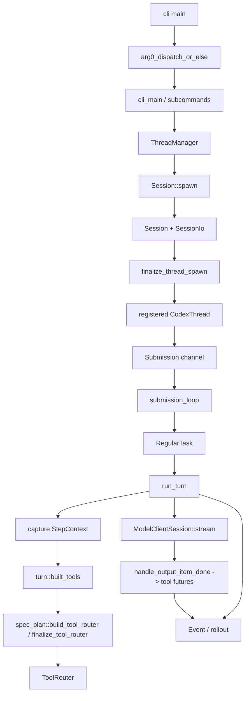

> Codex 的主干从 CLI/arg0 dispatch 进入 `ThreadManager`，由 `Session::spawn` 返回 runtime state 与 `SessionIo` queue endpoints，`CodexThread` 再把它们组合成 thread conduit；之后经 regular turn、Responses stream、ToolRouter、Event Queue 返回 client。[E: codex-rs/cli/src/main.rs:967][E: codex-rs/core/src/thread_manager.rs:1724][E: codex-rs/core/src/session/mod.rs:490][E: codex-rs/core/src/codex_thread.rs:183][E: codex-rs/core/src/session/turn.rs:2187]

## 能回答的问题

- CLI/TUI/exec/app-server/MCP surface 如何汇入 core？
- Thread、Session、Submission Queue、Event Queue 的主边界在哪里？
- 一次 regular turn 如何从 `Op` 到 model stream，再到 tool futures？
- 当前工具系统为什么在 `StepContext` capture 时经 `turn::built_tools` / `spec_plan::build_tool_router` 组装？

```mermaid
flowchart TD
    CLI["cli main"] --> ARG0["arg0_dispatch_or_else"]
    ARG0 --> CLI_MAIN["cli_main / subcommands"]
    CLI_MAIN --> TM["ThreadManager"]
    TM --> SPAWN["Session::spawn"]
    SPAWN --> SESSION["Session + SessionIo"]
    SESSION --> FINALIZE["finalize_thread_spawn"]
    FINALIZE --> CLIENT["registered CodexThread"]
    CLIENT --> SQ["Submission channel"]
    SQ --> LOOP["submission_loop"]
    LOOP --> TASK["RegularTask"]
    TASK --> TURN["run_turn"]
    TURN --> STEP["capture StepContext"]
    STEP --> BUILT["turn::built_tools"]
    BUILT --> SPECPLAN["spec_plan::build_tool_router / finalize_tool_router"]
    SPECPLAN --> ROUTER["ToolRouter"]
    TURN --> STREAM["ModelClientSession::stream"]
    STREAM --> TOOLS["handle_output_item_done -> tool futures"]
    TOOLS --> EQ["Event / rollout"]
    TURN --> EQ
```

该图是当前源码主线的压缩索引；细节以本节点下面的 evidence 为准。

## 1 Entry Surfaces

CLI binary 的 `main` 调用 `arg0_dispatch_or_else`；wrapper 调 `arg0_dispatch()` 先处理 argv0/argv1 helper dispatch，然后在运行时线程中执行传入的 async main closure。[E: codex-rs/cli/src/main.rs:967][E: codex-rs/cli/src/main.rs:969][E: codex-rs/cli/src/main.rs:970][E: codex-rs/arg0/src/lib.rs:60][E: codex-rs/arg0/src/lib.rs:102][E: codex-rs/arg0/src/lib.rs:222][E: codex-rs/arg0/src/lib.rs:228]

`cli_main` 解析 `MultitoolCli`，把 feature toggles 折叠进 config overrides，然后按 subcommand 分流到 TUI、exec、review、MCP server 等 surface。[E: codex-rs/cli/src/main.rs:975][E: codex-rs/cli/src/main.rs:989][E: codex-rs/cli/src/main.rs:1016][E: codex-rs/cli/src/main.rs:1059]

`codex-core` 是共享 runtime crate：`lib.rs` 公开 re-export `CodexThread`、`TurnContext`、`ThreadManager` 等 selected surfaces，同时以 private modules 挂载 `unified_exec`、`thread_manager`、`tools` 等内部实现。[E: codex-rs/core/src/lib.rs:22][E: codex-rs/core/src/lib.rs:35][E: codex-rs/core/src/lib.rs:102][E: codex-rs/core/src/lib.rs:108][E: codex-rs/core/src/lib.rs:146]

## 2 Thread 与 Session

`ThreadManagerState::spawn_thread_with_source` 是创建/恢复入口；它处理 resumed-thread 去重，调用 `Session::spawn(SessionSpawnArgs)` 得到 `(session, io)`，再由 `finalize_thread_spawn` 组装 `CodexThread` 并登记。[E: codex-rs/core/src/thread_manager.rs:1724][E: codex-rs/core/src/thread_manager.rs:1756][E: codex-rs/core/src/thread_manager.rs:1811][E: codex-rs/core/src/thread_manager.rs:1853][E: codex-rs/core/src/thread_manager.rs:1886]

`Session::spawn` 初始化 session；submission channel capacity 为 512，EQ 是 unbounded；spawn 最终返回 `Arc<Session>` 与独立 `SessionIo`。[E: codex-rs/core/src/session/mod.rs:484][E: codex-rs/core/src/session/mod.rs:490][E: codex-rs/core/src/session/mod.rs:555][E: codex-rs/core/src/session/mod.rs:772][E: codex-rs/core/src/session/mod.rs:779]

协议层把输入建模成 `Submission { id, op, client_user_message_id, trace, parent_turn_id }` 和 `Op` enum；`parent_turn_id` 是 core-provided direct-parent provenance。输出仍是 `Event { id, msg }` 和 `EventMsg` enum。[E: codex-rs/protocol/src/protocol.rs:176][E: codex-rs/protocol/src/protocol.rs:180][E: codex-rs/protocol/src/protocol.rs:184][E: codex-rs/protocol/src/protocol.rs:186][E: codex-rs/protocol/src/protocol.rs:531][E: codex-rs/protocol/src/protocol.rs:1270][E: codex-rs/protocol/src/protocol.rs:1288]

`CodexThread::submit`/`next_event` 委托给内部 `SessionIo`；`submit_with_trace` 生成 UUID v7 id，`submit_with_id` 补 W3C trace 后送入 SQ。[E: codex-rs/core/src/codex_thread.rs:226][E: codex-rs/core/src/codex_thread.rs:274][E: codex-rs/core/src/codex_thread.rs:430][E: codex-rs/core/src/codex_thread.rs:476][E: codex-rs/core/src/session/mod.rs:796][E: codex-rs/core/src/session/mod.rs:828]

## 3 Turn 主线

`submission_loop` 从 SQ 读取 `Submission` 并按 `Op` 分派；用户 turn path 会调用 `sess.spawn_task(..., RegularTask::new())`。[E: codex-rs/core/src/session/handlers.rs:714][E: codex-rs/core/src/session/handlers.rs:721][E: codex-rs/core/src/session/handlers.rs:725][E: codex-rs/core/src/session/handlers.rs:264][E: codex-rs/core/src/session/handlers.rs:267]

`RegularTask` 在 run_turn 前发送 `TurnStarted`，消费 startup prewarm，然后循环调用 `run_turn`；如果一轮结束后还有 pending input，任务可继续下一次 sampling。[E: codex-rs/core/src/tasks/regular.rs:48][E: codex-rs/core/src/tasks/regular.rs:57][E: codex-rs/core/src/tasks/regular.rs:75][E: codex-rs/core/src/tasks/regular.rs:83]

`run_turn` 先做 pre-sampling compaction，再解析 input 所需 MCP servers，capture 第一份 `StepContext`，随后记录 context update、构建 skills/plugins、运行 hooks/记录 input，然后进入 sampling loop。[E: codex-rs/core/src/session/turn.rs:149][E: codex-rs/core/src/session/turn.rs:162][E: codex-rs/core/src/session/turn.rs:182][E: codex-rs/core/src/session/turn.rs:196][E: codex-rs/core/src/session/turn.rs:211][E: codex-rs/core/src/session/turn.rs:217][E: codex-rs/core/src/session/turn.rs:233][E: codex-rs/core/src/session/turn.rs:267]

`capture_step_context_with_required_mcp_servers` 固定 environment/capability roots，parallel 获取 MCP binding 与 prepared tool recommendations，再调用 `turn::built_tools` 把 router 放入 `StepContext`；`run_sampling_request` 直接复用这份 router，构造 `ToolCallRuntime` 与 prompt，再通过 `ModelClientSession::stream` 发起 streaming。[E: codex-rs/core/src/session/mod.rs:3048][E: codex-rs/core/src/session/mod.rs:3055][E: codex-rs/core/src/session/mod.rs:3101][E: codex-rs/core/src/session/mod.rs:3108][E: codex-rs/core/src/session/mod.rs:3113][E: codex-rs/core/src/session/mod.rs:3123][E: codex-rs/core/src/session/mod.rs:3129][E: codex-rs/core/src/session/turn.rs:1318][E: codex-rs/core/src/session/turn.rs:1319][E: codex-rs/core/src/session/turn.rs:1323][E: codex-rs/core/src/session/turn.rs:1353][E: codex-rs/core/src/session/turn.rs:2187][E: codex-rs/core/src/session/turn.rs:2188]

`turn::built_tools` 汇总 connectors 与 tool-suggest candidates 后调用 `spec_plan::build_tool_router`；后者按 core → MCP → extension → dynamic sources 填充 ordered `ToolRegistry`，构造 hosted specs，并由 `finalize_tool_router` 产出最终 router。[E: codex-rs/core/src/session/turn.rs:1465][E: codex-rs/core/src/session/turn.rs:1473][E: codex-rs/core/src/session/turn.rs:1498][E: codex-rs/core/src/session/turn.rs:1554][E: codex-rs/core/src/tools/spec_plan.rs:114][E: codex-rs/core/src/tools/spec_plan.rs:138][E: codex-rs/core/src/tools/spec_plan.rs:139][E: codex-rs/core/src/tools/spec_plan.rs:145][E: codex-rs/core/src/tools/spec_plan.rs:152][E: codex-rs/core/src/tools/spec_plan.rs:157][E: codex-rs/core/src/tools/spec_plan.rs:161]

当 `executed_tool_call_metadata` recorder 存在时，sampling retry 在 build prompt 前把 pending direct/nested calls 附加到 response-item metadata 并统一执行 32 KiB request bound；这条 warehouse-only path 不改变 model-visible tool list。[E: codex-rs/core/src/session/turn.rs:1337][E: codex-rs/core/src/session/turn.rs:1347][E: codex-rs/core/src/session/turn.rs:1349][E: codex-rs/core/src/session/turn.rs:1351][E: codex-rs/core/src/session/turn.rs:1353][I]

当 stream item 完成时，`handle_output_item_done` 调 `ToolRouter::build_tool_call`；若产生 tool future，sampling loop 放入 `in_flight`，最后 `drain_in_flight` 把 tool output 写回 conversation history。[E: codex-rs/core/src/stream_events_utils.rs:288][E: codex-rs/core/src/stream_events_utils.rs:298][E: codex-rs/core/src/session/turn.rs:2355][E: codex-rs/core/src/session/turn.rs:2364][E: codex-rs/core/src/session/turn.rs:2108][E: codex-rs/core/src/session/turn.rs:2117]

事件由 `Session::send_event` 包成 `Event { id: turn_context.sub_id, msg }` 后进入 `send_event_raw`；`send_event_raw` 先持久化 rollout item，再记录 protocol event 并 deliver 到 event channel。[E: codex-rs/core/src/session/mod.rs:1823][E: codex-rs/core/src/session/mod.rs:1843][E: codex-rs/core/src/session/mod.rs:1844][E: codex-rs/core/src/session/mod.rs:1847][E: codex-rs/core/src/session/mod.rs:2039][E: codex-rs/core/src/session/mod.rs:2060][E: codex-rs/core/src/session/mod.rs:2066]

## Sources

- `codex-rs/cli/src/main.rs`
- `codex-rs/arg0/src/lib.rs`
- `codex-rs/core/src/lib.rs`
- `codex-rs/protocol/src/protocol.rs`
- `codex-rs/core/src/thread_manager.rs`
- `codex-rs/core/src/codex_thread.rs`
- `codex-rs/core/src/session/mod.rs`
- `codex-rs/core/src/session/handlers.rs`
- `codex-rs/core/src/tasks/regular.rs`
- `codex-rs/core/src/session/turn.rs`
- `codex-rs/core/src/stream_events_utils.rs`
- `codex-rs/core/src/tools/router.rs`
- `codex-rs/core/src/tools/spec_plan.rs`

## 相关

- [SQ/EQ 架构](sq-eq-architecture.md)
- [进程生命周期](process-lifecycle.md)
- [一次 turn 端到端](turn-end-to-end.md)
- [工具调用解剖](tool-call-anatomy.md)
- [工具系统机制](../subsystems/core/tool-system.md)
