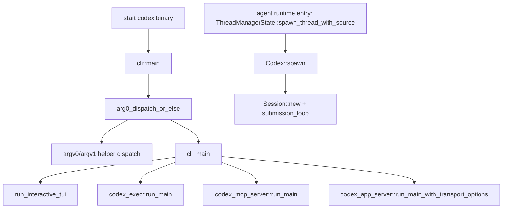

> Codex 进程生命周期先由 CLI `main` 进入 arg0/argv1 helper dispatch，再由 `cli_main` 选择 TUI、exec、MCP server、app-server 等 surface；本节点把 agent runtime 的已证源码边界收窄到 `ThreadManagerState::spawn_thread_with_source` 创建 `Codex` session 的入口。[E: codex-rs/cli/src/main.rs:955][E: codex-rs/arg0/src/lib.rs:207][E: codex-rs/cli/src/main.rs:963][E: codex-rs/core/src/thread_manager.rs:1344][E: codex-rs/core/src/session/mod.rs:466]

## 能回答的问题

- `codex` 可执行文件如何复用 argv0/argv1 helper 身份？
- TUI、exec、MCP server、app-server 在 CLI 入口如何分流？
- 一个 agent thread 何时从 process lifecycle 进入 session lifecycle？
- 为什么 `SessionConfigured` 必须作为新 thread 第一条事件？

## 端到端步骤

1. CLI binary 的 `main` 读取 remote-control env，然后把 `cli_main` closure 交给 `arg0_dispatch_or_else`。[E: codex-rs/cli/src/main.rs:955][E: codex-rs/cli/src/main.rs:956][E: codex-rs/cli/src/main.rs:957]
2. `arg0_dispatch` 先检查 argv0：`codex-execve-wrapper` 走 shell escalation wrapper，`codex-linux-sandbox` 走 linux sandbox main，`apply_patch`/`applypatch` 走 standalone apply-patch main。[E: codex-rs/arg0/src/lib.rs:58][E: codex-rs/arg0/src/lib.rs:68][E: codex-rs/arg0/src/lib.rs:93][E: codex-rs/arg0/src/lib.rs:96]
3. `arg0_dispatch` 还检查 argv1：filesystem helper、Windows sandbox wrapper 和 `CODEX_CORE_APPLY_PATCH_ARG1` 都可以在进入普通 CLI 前被处理。[E: codex-rs/arg0/src/lib.rs:100][E: codex-rs/arg0/src/lib.rs:101][E: codex-rs/arg0/src/lib.rs:108]
4. 普通路径下，`arg0_dispatch_or_else` 创建 `codex-main` thread，在线程内构建 Tokio runtime 并运行 async main closure；`run_main_with_arg0_guard` 给 main_fn 传入 helper executable paths。[E: codex-rs/arg0/src/lib.rs:221][E: codex-rs/arg0/src/lib.rs:225][E: codex-rs/arg0/src/lib.rs:247][E: codex-rs/arg0/src/lib.rs:259]
5. `cli_main` 解析 `MultitoolCli`，把 `--enable/--disable` feature toggles 折叠为 config overrides，然后按 subcommand 分流。[E: codex-rs/cli/src/main.rs:967][E: codex-rs/cli/src/main.rs:975][E: codex-rs/cli/src/main.rs:986]
6. 没有 subcommand 时进入 interactive TUI；`exec` 分支调用 `codex_exec::run_main`；MCP server 分支调用 `codex_mcp_server::run_main`；VS Code app-server 分支调用 `codex_app_server::run_main_with_transport_options`。[E: codex-rs/cli/src/main.rs:987][E: codex-rs/cli/src/main.rs:1001][E: codex-rs/cli/src/main.rs:1015][E: codex-rs/cli/src/main.rs:1038][E: codex-rs/cli/src/main.rs:1044][E: codex-rs/cli/src/main.rs:1139]
7. Interactive TUI 的 retry loop 调用 `codex_tui::run_main`；本节点不展开各 surface 到 core 的桥接文件，agent runtime 的已证源码边界从下一步的 ThreadManager entry 开始。[E: codex-rs/cli/src/main.rs:2260][E: codex-rs/cli/src/main.rs:2261][E: codex-rs/cli/src/main.rs:2269][I]
8. `ThreadManagerState::spawn_thread_with_source` 处理 resumed-thread 去重，加载 user instructions 和 parent rollout trace，再调用 `Codex::spawn(CodexSpawnArgs { ... })`。[E: codex-rs/core/src/thread_manager.rs:1344][E: codex-rs/core/src/thread_manager.rs:1363][E: codex-rs/core/src/thread_manager.rs:1385][E: codex-rs/core/src/thread_manager.rs:1388][E: codex-rs/core/src/thread_manager.rs:1400]
9. `Codex::spawn` 包装 parent trace，调用 `spawn_internal`；`spawn_internal` 创建 channels、解析 model/session configuration、创建 `Session` 并启动 submission loop。[E: codex-rs/core/src/session/mod.rs:466][E: codex-rs/core/src/session/mod.rs:478][E: codex-rs/core/src/session/mod.rs:490][E: codex-rs/core/src/session/mod.rs:522][E: codex-rs/core/src/session/mod.rs:605][E: codex-rs/core/src/session/mod.rs:642][E: codex-rs/core/src/session/mod.rs:675]
10. `finalize_thread_spawn` 先读取 `codex.next_event()`，要求第一条事件必须是 `EventMsg::SessionConfigured` 且 id 等于 `INITIAL_SUBMIT_ID`，然后才把 `CodexThread` 插入 thread map。[E: codex-rs/core/src/thread_manager.rs:1443][E: codex-rs/core/src/thread_manager.rs:1449][E: codex-rs/core/src/thread_manager.rs:1451][E: codex-rs/core/src/thread_manager.rs:1454][E: codex-rs/core/src/thread_manager.rs:1461]

## 关键决策点

- argv0/argv1 helper dispatch 让一个 binary 承担 helper 和普通 CLI 多种身份；普通 Codex runtime 只在 helper dispatch 未接管时启动。[E: codex-rs/arg0/src/lib.rs:58][E: codex-rs/arg0/src/lib.rs:96][E: codex-rs/arg0/src/lib.rs:108][E: codex-rs/arg0/src/lib.rs:221]
- `SessionConfigured` first-event gate 是 thread 注册前的启动握手；不满足该约束时 `finalize_thread_spawn` 返回 `SessionConfiguredNotFirstEvent`。[E: codex-rs/core/src/thread_manager.rs:1450][E: codex-rs/core/src/thread_manager.rs:1456]
- process lifecycle 到 turn lifecycle 的边界是 `Codex` session 已创建并开始接收 submissions；一次 user turn 的细节属于 `spine.turn-end-to-end`。[I]

## 深挖入口

- `cli.subcommands` 应列出 `Subcommand` enum 与每个 CLI surface。
- `subsys.core.session-lifecycle` 应展开 `Session::new`、resume/fork、rollout replay。
- `spine.sq-eq-architecture` 解释 thread 创建后 SQ/EQ 如何承载请求和事件。

## Sources

- codex-rs/cli/src/main.rs
- codex-rs/arg0/src/lib.rs
- codex-rs/core/src/thread_manager.rs
- codex-rs/core/src/session/mod.rs

## 相关

- [Codex 源码总览](overview.md)
- [SQ/EQ 双队列架构](sq-eq-architecture.md)
- [一次 turn 端到端](turn-end-to-end.md)
- 索引 id：`cli.subcommands`
- [core session lifecycle](../subsystems/core/session-lifecycle.md)
