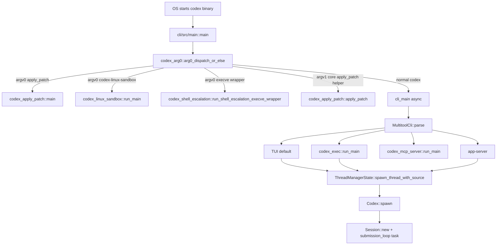

> Codex 进程生命周期从 argv0/argv1 alias dispatch 开始，经 CLI subcommand 选择 surface，最后在需要 agent runtime 时创建 ThreadManager/Codex/Session 任务树。[I]

## 能回答的问题

- Codex 进程入口如何处理 `apply_patch` 和 sandbox helper 这类 alias？
- `codex` 无 subcommand、`exec`、`review`、MCP server、app-server 分别走哪里？
- Tokio runtime 在 CLI 入口何时创建？
- 一个新 thread 的 `SessionConfigured` 为什么必须是第一条事件？
- 进程级 lifecycle 和一次 turn lifecycle 的边界是什么？

该 flowchart 是后续编号步骤的视觉索引；具体控制流事实以编号步骤中的源码证据为准。[I]

## 端到端步骤

1. CLI binary 的 `main` 调用 `arg0_dispatch_or_else`，把 CLI async main 作为 fallback closure 交给 arg0 layer；fallback closure 会执行 `cli_main(arg0_paths).await`。[E: codex-rs/cli/src/main.rs:677][E: codex-rs/cli/src/main.rs:678][E: codex-rs/cli/src/main.rs:679]
2. `codex_arg0::arg0_dispatch_or_else` 先运行 `arg0_dispatch`，正常 `codex` 入口则构建 Tokio runtime 并执行 `main_fn(paths).await`。[E: codex-rs/arg0/src/lib.rs:183][E: codex-rs/arg0/src/lib.rs:187][E: codex-rs/arg0/src/lib.rs:202]
3. `arg0_dispatch` 读取 `argv[0]` 的 file name；如果 argv0 是 `codex-execve-wrapper`，它调用 `codex_shell_escalation::run_shell_escalation_execve_wrapper`；如果 argv0 是 linux sandbox alias，调用 `codex_linux_sandbox::run_main`；如果 argv0 是 `apply_patch` 或 `applypatch`，调用 standalone apply-patch main。[E: codex-rs/arg0/src/lib.rs:59][E: codex-rs/arg0/src/lib.rs:81][E: codex-rs/arg0/src/lib.rs:91][E: codex-rs/arg0/src/lib.rs:93]
4. `arg0_dispatch` 还处理 argv1 helper：`CODEX_FS_HELPER_ARG1` 进入 exec-server filesystem helper，`CODEX_CORE_APPLY_PATCH_ARG1` 从下一个 argv 参数读取 UTF-8 patch 字符串并调用 `codex_apply_patch::apply_patch`。[E: codex-rs/arg0/src/lib.rs:97][E: codex-rs/arg0/src/lib.rs:98][E: codex-rs/arg0/src/lib.rs:100][E: codex-rs/arg0/src/lib.rs:101][E: codex-rs/arg0/src/lib.rs:117]
5. 正常 CLI fallback 进入 `cli_main`，先执行 `MultitoolCli::parse()`；全局 `--enable/--disable` feature flag 会被折叠成 config override。[E: codex-rs/cli/src/main.rs:691][E: codex-rs/cli/src/main.rs:694][E: codex-rs/cli/src/main.rs:695]
6. `cli_main` 在没有 subcommand 时调用 `run_interactive_tui`；`exec` subcommand 调用 `codex_exec::run_main`；`review` subcommand 构造 `ExecCli`、设置 `ExecCommand::Review(review_args)`，再调用 `codex_exec::run_main`。[E: codex-rs/cli/src/main.rs:705][E: codex-rs/cli/src/main.rs:727][E: codex-rs/cli/src/main.rs:735][E: codex-rs/cli/src/main.rs:736][E: codex-rs/cli/src/main.rs:741]
7. `cli_main` 的 MCP server 分支调用 `codex_mcp_server::run_main`，MCP client 管理分支调用 `mcp_cli.run().await`，app-server 分支调用 `codex_app_server::run_main_with_transport`。[E: codex-rs/cli/src/main.rs:749][E: codex-rs/cli/src/main.rs:759][E: codex-rs/cli/src/main.rs:795]
8. resume/fork 是 CLI-level lifecycle：resume branch 调用 `finalize_resume_interactive` 后运行 TUI，fork branch 调用 `finalize_fork_interactive` 后运行 TUI。[E: codex-rs/cli/src/main.rs:845][E: codex-rs/cli/src/main.rs:854][E: codex-rs/cli/src/main.rs:872][E: codex-rs/cli/src/main.rs:880]
9. 当 surface 需要 agent thread 时，`ThreadManagerState::spawn_thread_with_source` 取得 default environment，在本地环境时注册 skills watcher，然后调用 `Codex::spawn(CodexSpawnArgs { ... })`。[E: codex-rs/core/src/thread_manager.rs:923][E: codex-rs/core/src/thread_manager.rs:925][E: codex-rs/core/src/thread_manager.rs:927][E: codex-rs/core/src/thread_manager.rs:939]
10. `Codex::spawn` 包装 `spawn_internal` 并把 parent trace 写入 `thread_spawn` tracing span；`spawn_internal` 加载 plugins/skills，准备 model，用 `Session::new` 初始化 Session，然后启动 `submission_loop(session_for_loop, config, rx_sub)` task。[E: codex-rs/core/src/session/mod.rs:424][E: codex-rs/core/src/session/mod.rs:426][E: codex-rs/core/src/session/mod.rs:428][E: codex-rs/core/src/session/mod.rs:465][E: codex-rs/core/src/session/mod.rs:468][E: codex-rs/core/src/session/mod.rs:545][E: codex-rs/core/src/session/mod.rs:633][E: codex-rs/core/src/session/mod.rs:660][E: codex-rs/core/src/session/mod.rs:661][E: codex-rs/core/src/session/mod.rs:662]
11. 新 thread 注册前，`ThreadManagerState::finalize_thread_spawn` 先从 Codex EQ 读取第一条事件，并要求它必须是 `EventMsg::SessionConfigured` 且 event id 等于 `INITIAL_SUBMIT_ID`；否则返回 `SessionConfiguredNotFirstEvent`。[E: codex-rs/core/src/thread_manager.rs:971][E: codex-rs/core/src/thread_manager.rs:975][E: codex-rs/core/src/thread_manager.rs:976][E: codex-rs/core/src/thread_manager.rs:978]
12. `finalize_thread_spawn` 用 `CodexThread::new` 包装 `Codex` 和 rollout path，再把 `Arc<CodexThread>` 插入 `ThreadManagerState.threads` map。[E: codex-rs/core/src/thread_manager.rs:983][E: codex-rs/core/src/thread_manager.rs:984][E: codex-rs/core/src/thread_manager.rs:988]

## 关键决策点

- argv0 alias dispatch 让同一个可执行文件可以承担 `apply_patch`、sandbox helper、execve wrapper 多种身份；这是由 `argv0`/`argv1` 条件分支实现的进程级 multiplexing。[E: codex-rs/arg0/src/lib.rs:64][E: codex-rs/arg0/src/lib.rs:89][E: codex-rs/arg0/src/lib.rs:92][E: codex-rs/arg0/src/lib.rs:97][E: codex-rs/arg0/src/lib.rs:100]
- `arg0_dispatch_or_else` 在调用 async main 之前才创建 Tokio runtime，因此特殊 alias 可以在不启动完整 Codex core 的情况下直接运行。[E: codex-rs/arg0/src/lib.rs:183][E: codex-rs/arg0/src/lib.rs:187][E: codex-rs/arg0/src/lib.rs:202]
- `SessionConfigured` first-event 约束把 thread 启动握手变成可验证协议：ThreadManager 不会把没有完成 session 配置确认的 Codex 放进 thread map。[E: codex-rs/core/src/thread_manager.rs:971][E: codex-rs/core/src/thread_manager.rs:975][E: codex-rs/core/src/thread_manager.rs:978][E: codex-rs/core/src/thread_manager.rs:988]
- 进程 lifecycle 只负责选择 surface 和启动 runtime；一次 user turn 的生命周期从 `Op::UserTurn` 进入 SQ 后才开始。[I]

## 深挖入口

- `cli.subcommands` 应逐项列出 `Subcommand` enum 中每个 CLI 子命令和参数。
- `subsys.exec-sandbox.arg0-dispatch` 应展开 alias symlink、PATH 注入、core apply-patch helper 等细节。
- `spine.turn-end-to-end` 应解释 thread 启动后每个 turn 的 `TurnStarted`、model streaming、tool drain、`TurnComplete`。

## Sources

- codex-rs/cli/src/main.rs
- codex-rs/arg0/src/lib.rs
- codex-rs/core/src/thread_manager.rs
- codex-rs/core/src/session/mod.rs

## 相关

- [Codex 源码总览](overview.md)
- [SQ/EQ 双队列架构](sq-eq-architecture.md)
- 索引 id：`cli.subcommands`
- 索引 id：`subsys.exec-sandbox.arg0-dispatch`
- 索引 id：`subsys.core.session-lifecycle`
