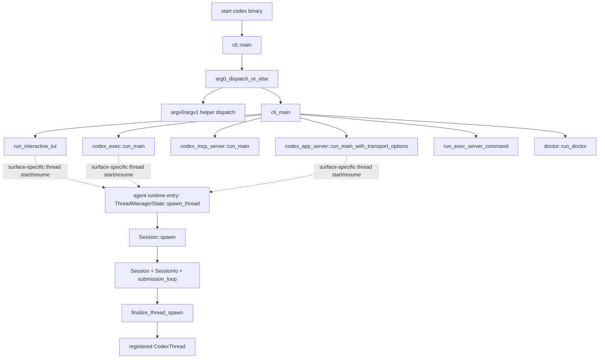

> Codex 进程生命周期先由 CLI `main` 进入 arg0/argv1 helper dispatch，再由 `cli_main` 选择各 surface；standalone `exec-server` surface 可运行 local listener 或注册 remote environment，`codex doctor` 走独立 diagnostics crate。agent runtime 边界仍是 `ThreadManagerState::spawn_thread` 调用 `Session::spawn`，返回 `Session` state 与 `SessionIo` endpoints。[E: codex-rs/cli/src/main.rs:985][E: codex-rs/cli/src/main.rs:1461][E: codex-rs/cli/src/main.rs:1632][E: codex-rs/core/src/thread_manager.rs:1741][E: codex-rs/core/src/session/mod.rs:461]

## 能回答的问题

- `codex` 可执行文件如何复用 argv0/argv1 helper 身份？
- TUI、exec、MCP server、app-server、standalone exec-server、doctor 在 CLI 入口如何分流？
- 一个 agent thread 何时从 process lifecycle 进入 session lifecycle？
- 为什么 `SessionConfigured` 必须作为新 thread 第一条事件？

```mermaid
flowchart TD
    OS["start codex binary"] --> MAIN["cli::main"]
    MAIN --> ARG0["arg0_dispatch_or_else"]
    ARG0 --> ALIAS["argv0/argv1 helper dispatch"]
    ARG0 --> CLI["cli_main"]
    CLI --> TUI["run_interactive_tui"]
    CLI --> EXEC["codex_exec::run_main"]
    CLI --> MCP["codex_mcp_server::run_main"]
    CLI --> APP["codex_app_server::run_main_with_transport_options"]
    CLI --> EXECSERVER["run_exec_server_command"]
    CLI --> DOCTOR["doctor::run_doctor"]
    TM["agent runtime entry: ThreadManagerState::spawn_thread"]
    TUI -. "surface-specific thread start/resume" .-> TM
    EXEC -. "surface-specific thread start/resume" .-> TM
    APP -. "surface-specific thread start/resume" .-> TM
    TM --> SPAWN["Session::spawn"]
    SPAWN --> SESSION["Session + SessionIo + submission_loop"]
    SESSION --> FINALIZE["finalize_thread_spawn"]
    FINALIZE --> THREAD["registered CodexThread"]
```

## 端到端步骤

1. CLI binary 的 `main` 读取 remote-control env，然后把 `cli_main` closure 交给 `arg0_dispatch_or_else`。[E: codex-rs/cli/src/main.rs:985][E: codex-rs/cli/src/main.rs:986][E: codex-rs/cli/src/main.rs:987]
2. `arg0_dispatch` 先检查 argv0：`codex-execve-wrapper` 走 shell escalation wrapper，`codex-linux-sandbox` 走 linux sandbox main，`apply_patch`/`applypatch` 走 standalone apply-patch main。[E: codex-rs/arg0/src/lib.rs:60][E: codex-rs/arg0/src/lib.rs:70][E: codex-rs/arg0/src/lib.rs:95][E: codex-rs/arg0/src/lib.rs:98]
3. `arg0_dispatch` 还检查 argv1：unix exec helper、filesystem helper、Windows sandbox wrapper 和 `CODEX_CORE_APPLY_PATCH_ARG1` 都可以在进入普通 CLI 前被处理。apply-patch helper 读取 `apply_patch_file_update_mode_from_env` 决定是否保留原文件换行。[E: codex-rs/arg0/src/lib.rs:102][E: codex-rs/arg0/src/lib.rs:104][E: codex-rs/arg0/src/lib.rs:107][E: codex-rs/arg0/src/lib.rs:111][E: codex-rs/arg0/src/lib.rs:114][E: codex-rs/arg0/src/lib.rs:132]
4. 普通路径下，`arg0_dispatch_or_else` 创建 `codex-main` thread，在线程内构建 Tokio runtime 并运行 async main closure；`run_main_with_arg0_guard` 给 main_fn 传入 helper executable paths。[E: codex-rs/arg0/src/lib.rs:216][E: codex-rs/arg0/src/lib.rs:230][E: codex-rs/arg0/src/lib.rs:233][E: codex-rs/arg0/src/lib.rs:247][E: codex-rs/arg0/src/lib.rs:268]
5. `cli_main` 解析 `MultitoolCli`，把 `--enable/--disable` feature toggles 折叠为 config overrides，然后按 subcommand 分流。[E: codex-rs/cli/src/main.rs:993][E: codex-rs/cli/src/main.rs:1005][E: codex-rs/cli/src/main.rs:1006][E: codex-rs/cli/src/main.rs:1018]
6. 没有 subcommand 时进入 interactive TUI；`exec` 分支调用 `codex_exec::run_main`；MCP server 分支调用 `codex_mcp_server::run_main`；VS Code app-server 分支调用 `codex_app_server::run_main_with_transport_options`；`doctor` 分支调用 `doctor::run_doctor`。[E: codex-rs/cli/src/main.rs:1019][E: codex-rs/cli/src/main.rs:1024][E: codex-rs/cli/src/main.rs:1047][E: codex-rs/cli/src/main.rs:1076][E: codex-rs/cli/src/main.rs:1173][E: codex-rs/cli/src/main.rs:1467]
7. `Subcommand::ExecServer` 调用 `run_exec_server_command`：remote 模式加载完整 config/auth 并注册 remote environment，且 `enable_workload_identity` 为 true；local 模式选择 listener URL 后运行 exec-server，workload identity 关闭。`--exit-on-stdin-close` 只在 remote 模式生效，并把 parent lifetime 从独立进程改为 stdin pipe；环境变量 `CODEX_EXEC_SERVER_EXIT_ON_STDIN_CLOSE` 是同一 opt-in 的进程级名字。[E: codex-rs/cli/src/main.rs:1632][E: codex-rs/cli/src/main.rs:1639][E: codex-rs/cli/src/main.rs:1725][E: codex-rs/cli/src/main.rs:1739][E: codex-rs/cli/src/main.rs:1748][E: codex-rs/cli/src/main.rs:1764][E: codex-rs/cli/src/main.rs:1792][E: codex-rs/exec-server/src/lib.rs:46]
8. Interactive TUI 的入口是 `run_interactive_tui`，内部再调 `codex_tui::run_main`；本节点不展开各 surface 到 core 的桥接文件，agent runtime 的已证源码边界从下一步的 ThreadManager entry 开始。[E: codex-rs/cli/src/main.rs:2413][E: codex-rs/cli/src/main.rs:2450]
9. `spawn_new_thread_with_source` / `spawn_thread` 处理 reserved-thread-id 约束、resumed-thread 去重，加载 user instructions/parent trace，再调用 `Session::spawn(SessionSpawnArgs { ... })`。[E: codex-rs/core/src/thread_manager.rs:1623][E: codex-rs/core/src/thread_manager.rs:1741][E: codex-rs/core/src/thread_manager.rs:1777][E: codex-rs/core/src/thread_manager.rs:1803][E: codex-rs/core/src/thread_manager.rs:1836]
10. `Session::spawn` 包装 parent trace，`spawn_internal` 创建 channels、session state/services 和 background submission loop，返回 `(Arc<Session>, SessionIo)`。[E: codex-rs/core/src/session/mod.rs:461][E: codex-rs/core/src/session/mod.rs:477][E: codex-rs/core/src/session/mod.rs:527][E: codex-rs/core/src/session/mod.rs:776][E: codex-rs/core/src/session/mod.rs:788]
11. `finalize_thread_spawn` 先通过 `io.next_event()` 读取启动握手，要求第一条是 `SessionConfigured`/`INITIAL_SUBMIT_ID`，然后才把 session+io 组装成 `CodexThread` 插入 map。[E: codex-rs/core/src/thread_manager.rs:1902][E: codex-rs/core/src/thread_manager.rs:1909][E: codex-rs/core/src/thread_manager.rs:1914][E: codex-rs/core/src/thread_manager.rs:1923]

## 关键决策点

- argv0/argv1 helper dispatch 让一个 binary 承担 helper 和普通 CLI 多种身份；普通 Codex runtime 只在 helper dispatch 未接管时启动。[E: codex-rs/arg0/src/lib.rs:60][E: codex-rs/arg0/src/lib.rs:98][E: codex-rs/arg0/src/lib.rs:114][E: codex-rs/arg0/src/lib.rs:216]
- standalone exec-server 的 remote 与 local 生命周期不同：remote 模式可绑定 parent stdin 并优雅 shutdown，local listener 固定 independent/immediate shutdown；该 stdin 绑定是显式 opt-in，而非 exec-server 的默认退出策略。remote 模式才会打开 workload-identity。[E: codex-rs/cli/src/main.rs:1748][E: codex-rs/cli/src/main.rs:1764][E: codex-rs/cli/src/main.rs:1781][E: codex-rs/cli/src/main.rs:1792]
- `SessionConfigured` first-event gate 是 thread 注册前的启动握手；不满足该约束时 `finalize_thread_spawn` 返回 `SessionConfiguredNotFirstEvent`。[E: codex-rs/core/src/thread_manager.rs:1914][E: codex-rs/core/src/thread_manager.rs:1916]
- process lifecycle 到 turn lifecycle 的边界是 `Session` 已创建、`SessionIo` 开始接收 submissions；一次 user turn 的细节属于 `spine.turn-end-to-end`。[I]

## 深挖入口

- `cli.subcommands` 应列出 `Subcommand` enum 与每个 CLI surface。
- `subsys.core.session-lifecycle` 应展开 `Session::new`、resume/fork、rollout replay。
- `spine.sq-eq-architecture` 解释 thread 创建后 SQ/EQ 如何承载请求和事件。

## Sources

- codex-rs/cli/src/main.rs
- codex-rs/arg0/src/lib.rs
- codex-rs/exec-server/src/lib.rs
- codex-rs/core/src/thread_manager.rs
- codex-rs/core/src/session/mod.rs

## 相关

- [Codex 源码总览](overview.md)
- [SQ/EQ 双队列架构](sq-eq-architecture.md)
- [一次 turn 端到端](turn-end-to-end.md)
- 索引 id：`cli.subcommands`
- [core session lifecycle](../subsystems/core/session-lifecycle.md)
