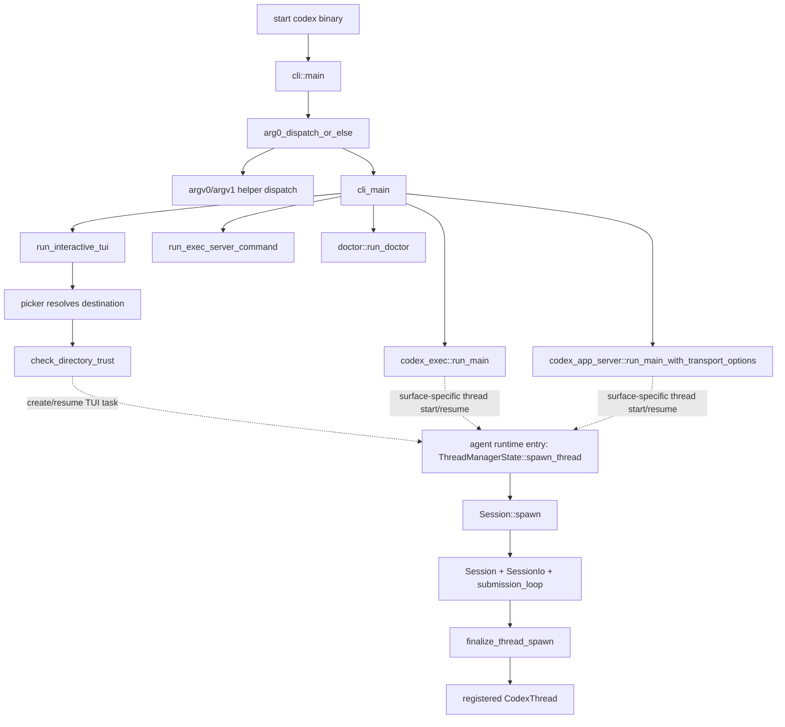

> Codex 进程生命周期先由 CLI `main` 进入 arg0/argv1 helper dispatch，再由 `cli_main` 选择各 surface；standalone `exec-server` surface 可运行 local listener 或注册 remote environment，`codex doctor` 走独立 diagnostics crate。agent runtime 边界仍是 `ThreadManagerState::spawn_thread` 调用 `Session::spawn`，返回 `Session` state 与 `SessionIo` endpoints。[E: codex-rs/cli/src/main.rs:1126][E: codex-rs/cli/src/main.rs:1937][E: codex-rs/cli/src/main.rs:1671][E: codex-rs/core/src/thread_manager.rs:1937][E: codex-rs/core/src/session/mod.rs:502]

## 能回答的问题

- `codex` 可执行文件如何复用 argv0/argv1 helper 身份？
- TUI、exec、app-server、standalone exec-server、doctor 在 CLI 入口如何分流？`codex mcp-server` 是否还存在？
- 创建或 resume TUI task 时 folder consent 在 picker 之后的哪一步？
- 一个 agent thread 何时从 process lifecycle 进入 session lifecycle？
- 为什么 `SessionConfigured` 必须作为新 thread 第一条事件？

```mermaid
flowchart TD
    OS["start codex binary"] --> MAIN["cli::main"]
    MAIN --> ARG0["arg0_dispatch_or_else"]
    ARG0 --> ALIAS["argv0/argv1 helper dispatch"]
    ARG0 --> CLI["cli_main"]
    CLI --> TUI["run_interactive_tui"]
    CLI --> EXEC["codex_exec::run_main"]
    CLI --> APP["codex_app_server::run_main_with_transport_options"]
    CLI --> EXECSERVER["run_exec_server_command"]
    CLI --> DOCTOR["doctor::run_doctor"]
    TUI --> PICKER["picker resolves destination"]
    PICKER --> CONSENT["check_directory_trust"]
    TM["agent runtime entry: ThreadManagerState::spawn_thread"]
    CONSENT -. "create/resume TUI task" .-> TM
    EXEC -. "surface-specific thread start/resume" .-> TM
    APP -. "surface-specific thread start/resume" .-> TM
    TM --> SPAWN["Session::spawn"]
    SPAWN --> SESSION["Session + SessionIo + submission_loop"]
    SESSION --> FINALIZE["finalize_thread_spawn"]
    FINALIZE --> THREAD["registered CodexThread"]
```

## 端到端步骤

1. CLI binary 的 `main` 读取 remote-control env，然后把 `cli_main` closure 交给 `arg0_dispatch_or_else`。[E: codex-rs/cli/src/main.rs:1126][E: codex-rs/cli/src/main.rs:1128][E: codex-rs/cli/src/main.rs:1129]
2. `arg0_dispatch` 先检查 argv0：`codex-execve-wrapper` 走 shell escalation wrapper，`codex-linux-sandbox` 走 linux sandbox main，`apply_patch`/`applypatch` 走 standalone apply-patch main。[E: codex-rs/arg0/src/lib.rs:60][E: codex-rs/arg0/src/lib.rs:70][E: codex-rs/arg0/src/lib.rs:95][E: codex-rs/arg0/src/lib.rs:98]
3. `arg0_dispatch` 还检查 argv1：unix exec helper、filesystem helper、Windows sandbox wrapper 和 `CODEX_CORE_APPLY_PATCH_ARG1` 都可以在进入普通 CLI 前被处理。apply-patch helper 读取 `apply_patch_file_update_mode_from_env` 决定是否保留原文件换行。[E: codex-rs/arg0/src/lib.rs:102][E: codex-rs/arg0/src/lib.rs:104][E: codex-rs/arg0/src/lib.rs:107][E: codex-rs/arg0/src/lib.rs:111][E: codex-rs/arg0/src/lib.rs:114][E: codex-rs/arg0/src/lib.rs:132]
4. 普通路径下，`arg0_dispatch_or_else` 创建 `codex-main` thread，在线程内构建 Tokio runtime 并运行 async main closure；`run_main_with_arg0_guard` 给 main_fn 传入 helper executable paths。[E: codex-rs/arg0/src/lib.rs:219][E: codex-rs/arg0/src/lib.rs:233][E: codex-rs/arg0/src/lib.rs:238][E: codex-rs/arg0/src/lib.rs:250][E: codex-rs/arg0/src/lib.rs:271]
5. `cli_main` 解析 `MultitoolCli`，把 `--enable/--disable` feature toggles 折叠为 config overrides，然后按 subcommand 分流。`Subcommand` 共 **29** 个变体，没有 `McpServer`。[E: codex-rs/cli/src/main.rs:1135][E: codex-rs/cli/src/main.rs:1148][E: codex-rs/cli/src/main.rs:1181][E: codex-rs/cli/src/main.rs:148]
6. 没有 subcommand（以及 `codex agents`）时进入 interactive TUI；`exec` 分支调用 `codex_exec::run_main`；VS Code app-server 分支调用 `codex_app_server`；`doctor` 分支调用 doctor crate。stdio MCP **server** 入口已下线；`codex mcp` 只管理外部 MCP servers。[E: codex-rs/cli/src/main.rs:1182][E: codex-rs/cli/src/main.rs:1225][E: codex-rs/cli/src/main.rs:1234][E: codex-rs/cli/src/main.rs:1271][E: codex-rs/cli/src/main.rs:1319][E: codex-rs/cli/src/main.rs:1671]
7. `Subcommand::ExecServer` 调用 `run_exec_server_command`：remote 模式加载完整 config/auth 并注册 remote environment，且 `enable_workload_identity` 为 true；local 模式选择 listener URL 后运行 exec-server。`--exit-on-stdin-close` 只在 remote 模式生效，并把 parent lifetime 从独立进程改为 stdin pipe。[E: codex-rs/cli/src/main.rs:1842][E: codex-rs/cli/src/main.rs:1937][E: codex-rs/cli/src/main.rs:1955][E: codex-rs/cli/src/main.rs:1990][E: codex-rs/cli/src/main.rs:2057]
8. Interactive TUI 的入口是 `run_interactive_tui`，内部再调 `codex_tui::run_main`。[E: codex-rs/cli/src/main.rs:2705]
9. 创建或 resume TUI task 时，folder consent 不是“只在首次 onboarding 问一次”。picker 先解析 destination（resume/fork 选中的 thread 与 cwd），然后 `run_main` 调用 `onboarding::check_directory_trust`；local daemon resume 还会在 consent 期间 `ThreadRead` 再检查 folder 是否被其它 client 改掉。[E: codex-rs/tui/src/lib.rs:1548][E: codex-rs/tui/src/lib.rs:1707][E: codex-rs/tui/src/onboarding/directory_trust.rs:33][E: codex-rs/tui/src/onboarding/directory_trust.rs:45][E: codex-rs/tui/src/onboarding/directory_trust.rs:138]
10. `spawn_new_thread_with_source` / `spawn_thread` 处理 reserved-thread-id 约束、resumed-thread 去重，加载 user instructions/parent trace，再调用 `Session::spawn(SessionSpawnArgs { ... })`。[E: codex-rs/core/src/thread_manager.rs:1811][E: codex-rs/core/src/thread_manager.rs:1937][E: codex-rs/core/src/thread_manager.rs:2108]
11. `Session::spawn` 包装 parent trace，`spawn_internal` 创建 channels、session state/services 和 background submission loop，返回 `(Arc<Session>, SessionIo)`。[E: codex-rs/core/src/session/mod.rs:502][E: codex-rs/core/src/session/mod.rs:521][E: codex-rs/core/src/session/mod.rs:530][E: codex-rs/core/src/session/mod.rs:870][E: codex-rs/core/src/session/mod.rs:881]
12. `finalize_thread_spawn` 先通过 `io.next_event()` 读取启动握手，要求第一条是 `SessionConfigured`/`INITIAL_SUBMIT_ID`，然后才把 session+io 组装成 `CodexThread` 插入 map。[E: codex-rs/core/src/thread_manager.rs:2192][E: codex-rs/core/src/thread_manager.rs:2199][E: codex-rs/core/src/thread_manager.rs:2203][E: codex-rs/core/src/thread_manager.rs:2206]

## 关键决策点

- argv0/argv1 helper dispatch 让一个 binary 承担 helper 和普通 CLI 多种身份；普通 Codex runtime 只在 helper dispatch 未接管时启动。[E: codex-rs/arg0/src/lib.rs:60][E: codex-rs/arg0/src/lib.rs:98][E: codex-rs/arg0/src/lib.rs:114][E: codex-rs/arg0/src/lib.rs:219]
- standalone exec-server 的 remote 与 local 生命周期不同：remote 模式可绑定 parent stdin 并优雅 shutdown；该 stdin 绑定是显式 opt-in。remote 模式才会打开 workload-identity。[E: codex-rs/cli/src/main.rs:1955][E: codex-rs/cli/src/main.rs:1990]
- TUI folder consent 发生在 destination 已解析之后、thread spawn 之前；local daemon resume 会把 saved cwd 与当前 cwd 都排进 pending 队列，并在 consent 后 `ThreadRead` 再入队最新 cwd。[E: codex-rs/tui/src/onboarding/directory_trust.rs:45][E: codex-rs/tui/src/onboarding/directory_trust.rs:138][E: codex-rs/tui/src/onboarding/directory_trust.rs:155]
- `SessionConfigured` first-event gate 是 thread 注册前的启动握手；不满足该约束时 `finalize_thread_spawn` 返回 `SessionConfiguredNotFirstEvent`。[E: codex-rs/core/src/thread_manager.rs:2203][E: codex-rs/core/src/thread_manager.rs:2206]
- process lifecycle 到 turn lifecycle 的边界是 `Session` 已创建、`SessionIo` 开始接收 submissions；一次 user turn 的细节属于 `spine.turn-end-to-end`。[I]

## 深挖入口

- `cli.subcommands` 应列出 `Subcommand` enum 与每个 CLI surface。
- `subsys.tui.onboarding` 应展开 `check_directory_trust` 与 first-login onboarding screen。
- `subsys.core.session-lifecycle` 应展开 `Session::new`、resume/fork、rollout replay。
- `spine.sq-eq-architecture` 解释 thread 创建后 SQ/EQ 如何承载请求和事件。

## Sources

- codex-rs/cli/src/main.rs
- codex-rs/arg0/src/lib.rs
- codex-rs/exec-server/src/lib.rs
- codex-rs/core/src/thread_manager.rs
- codex-rs/core/src/session/mod.rs
- codex-rs/tui/src/lib.rs
- codex-rs/tui/src/onboarding/directory_trust.rs

## 相关

- [Codex 源码总览](overview.md)
- [SQ/EQ 双队列架构](sq-eq-architecture.md)
- [一次 turn 端到端](turn-end-to-end.md)
- 索引 id：`cli.subcommands`
- [core session lifecycle](../subsystems/core/session-lifecycle.md)
- [TUI Onboarding](../subsystems/tui/onboarding.md)
