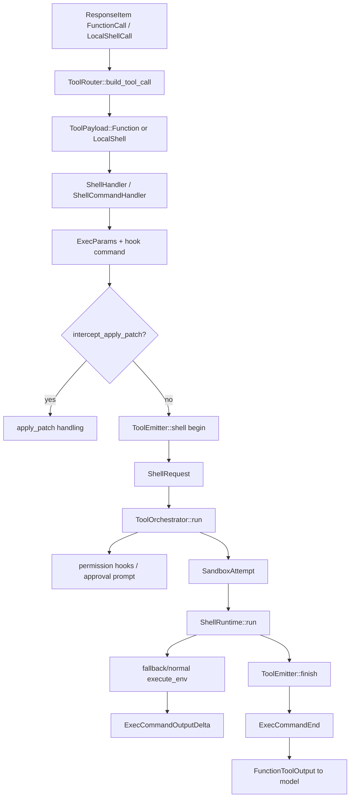

> shell exec flow 是模型 shell/local_shell/shell_command 调用经过 handler 参数解析、permission policy、apply_patch interception、ToolOrchestrator approval/sandbox、ShellRuntime 普通/fallback `execute_env` 路径和 ExecCommand events 的路径。[I]

## 能回答的问题

- shell、local_shell、shell_command 三条入口怎样汇合？
- `ExecParams`、`ShellRequest` 和 `SandboxAttempt` 分别承载什么？
- approval policy、exec policy、sandbox retry 的顺序是什么？
- stdout delta、begin/end event 在哪里发出？
- apply_patch 为什么会被 shell flow 截获？

该 flowchart 是后续编号步骤的视觉索引；具体控制流事实以编号步骤中的源码证据为准。[I]

## 端到端步骤

1. `build_tool_registry_plan` 的 shell branch 根据 `ConfigShellToolType` 创建 shell/local/unified/shell_command specs，并为 `shell`、`container.exec`、`local_shell`、`shell_command` 注册 handler。[E: codex-rs/tools/src/tool_registry_plan.rs:137][E: codex-rs/tools/src/tool_registry_plan.rs:141][E: codex-rs/tools/src/tool_registry_plan.rs:150][E: codex-rs/tools/src/tool_registry_plan.rs:157][E: codex-rs/tools/src/tool_registry_plan.rs:165][E: codex-rs/tools/src/tool_registry_plan.rs:175][E: codex-rs/tools/src/tool_registry_plan.rs:187][E: codex-rs/tools/src/tool_registry_plan.rs:188][E: codex-rs/tools/src/tool_registry_plan.rs:189][E: codex-rs/tools/src/tool_registry_plan.rs:190]
2. `ToolRouter::build_tool_call` 对 `LocalShellCall` 生成 `ToolPayload::LocalShell { params }`，并强制 `sandbox_permissions: UseDefault`。[E: codex-rs/core/src/tools/router.rs:233][E: codex-rs/core/src/tools/router.rs:239][E: codex-rs/core/src/tools/router.rs:245][E: codex-rs/core/src/tools/router.rs:249][E: codex-rs/core/src/tools/router.rs:257]
3. `ShellHandler` 接受 `ToolPayload::Function` 和 `ToolPayload::LocalShell`；它用 command 是否 known-safe 判断 mutating，并为 hooks 暴露 bash command。[E: codex-rs/core/src/tools/handlers/shell.rs:190][E: codex-rs/core/src/tools/handlers/shell.rs:191][E: codex-rs/core/src/tools/handlers/shell.rs:192][E: codex-rs/core/src/tools/handlers/shell.rs:193][E: codex-rs/core/src/tools/handlers/shell.rs:198][E: codex-rs/core/src/tools/handlers/shell.rs:199][E: codex-rs/core/src/tools/handlers/shell.rs:200][E: codex-rs/core/src/tools/handlers/shell.rs:203][E: codex-rs/core/src/tools/handlers/shell.rs:209][E: codex-rs/core/src/tools/handlers/shell.rs:210][E: codex-rs/core/src/tools/handlers/shell.rs:211]
4. `ShellHandler::to_exec_params` 把 shell tool params 转成 `ExecParams`，包括 command、cwd、timeout、env、network、sandbox permissions、Windows sandbox 和 justification。[E: codex-rs/core/src/tools/handlers/shell.rs:98][E: codex-rs/core/src/tools/handlers/shell.rs:99][E: codex-rs/core/src/tools/handlers/shell.rs:100][E: codex-rs/core/src/tools/handlers/shell.rs:101][E: codex-rs/core/src/tools/handlers/shell.rs:103][E: codex-rs/core/src/tools/handlers/shell.rs:104][E: codex-rs/core/src/tools/handlers/shell.rs:105][E: codex-rs/core/src/tools/handlers/shell.rs:106][E: codex-rs/core/src/tools/handlers/shell.rs:111]
5. `ShellCommandHandler` 先解析 `login` 是否允许，再用用户 shell 派生 exec args；其 `handle` 会调用 `maybe_emit_implicit_skill_invocation`，最后汇入 `ShellHandler::run_exec_like`。[E: codex-rs/core/src/tools/handlers/shell.rs:129][E: codex-rs/core/src/tools/handlers/shell.rs:130][E: codex-rs/core/src/tools/handlers/shell.rs:135][E: codex-rs/core/src/tools/handlers/shell.rs:149][E: codex-rs/core/src/tools/handlers/shell.rs:150][E: codex-rs/core/src/tools/handlers/shell.rs:151][E: codex-rs/core/src/tools/handlers/shell.rs:362][E: codex-rs/core/src/tools/handlers/shell.rs:377]
6. `run_exec_like` 要求 turn 有 environment，否则返回 “shell is unavailable in this session”；它从 environment 取 filesystem，并把 dependency env 合并进 exec env。[E: codex-rs/core/src/tools/handlers/shell.rs:410][E: codex-rs/core/src/tools/handlers/shell.rs:411][E: codex-rs/core/src/tools/handlers/shell.rs:416][E: codex-rs/core/src/tools/handlers/shell.rs:418][E: codex-rs/core/src/tools/handlers/shell.rs:420]
7. `run_exec_like` 计算 granted turn permissions、additional permissions 是否允许、normalized additional permissions；如果请求 sandbox override 但 approval policy 不是 `OnRequest` 且没有预审批，直接返回给模型拒绝信息。[E: codex-rs/core/src/tools/handlers/shell.rs:430][E: codex-rs/core/src/tools/handlers/shell.rs:433][E: codex-rs/core/src/tools/handlers/shell.rs:440][E: codex-rs/core/src/tools/handlers/shell.rs:443][E: codex-rs/core/src/tools/handlers/shell.rs:466][E: codex-rs/core/src/tools/handlers/shell.rs:468][E: codex-rs/core/src/tools/handlers/shell.rs:469][E: codex-rs/core/src/tools/handlers/shell.rs:470][E: codex-rs/core/src/tools/handlers/shell.rs:471][E: codex-rs/core/src/tools/handlers/shell.rs:472][E: codex-rs/core/src/tools/handlers/shell.rs:476][E: codex-rs/core/src/tools/handlers/shell.rs:477][E: codex-rs/core/src/tools/handlers/shell.rs:478]
8. 普通 shell 执行前，`run_exec_like` 调用 `intercept_apply_patch`；如果 command 可解析为 apply_patch body，它会提前返回 apply_patch handling 的 output，不再走 shell runtime；apply_patch handling 内部可能直接返回 model output，也可能 delegate 到 `ApplyPatchRuntime`。[E: codex-rs/core/src/tools/handlers/shell.rs:481][E: codex-rs/core/src/tools/handlers/shell.rs:482][E: codex-rs/core/src/tools/handlers/shell.rs:494][E: codex-rs/core/src/tools/handlers/apply_patch.rs:483][E: codex-rs/core/src/tools/handlers/apply_patch.rs:497][E: codex-rs/core/src/tools/handlers/apply_patch.rs:499][E: codex-rs/core/src/tools/handlers/apply_patch.rs:501][E: codex-rs/core/src/tools/handlers/apply_patch.rs:548]
9. 非 apply_patch path 创建 `ToolEmitter::shell(command, cwd, ExecCommandSource::Agent, freeform)`，并通过 `emitter.begin` 进入 `ToolEventStage::Begin`，最终发送 `EventMsg::ExecCommandBegin`。[E: codex-rs/core/src/tools/handlers/shell.rs:497][E: codex-rs/core/src/tools/handlers/shell.rs:498][E: codex-rs/core/src/tools/handlers/shell.rs:504][E: codex-rs/core/src/tools/handlers/shell.rs:510][E: codex-rs/core/src/tools/events.rs:285][E: codex-rs/core/src/tools/events.rs:286][E: codex-rs/core/src/tools/events.rs:151][E: codex-rs/core/src/tools/events.rs:163][E: codex-rs/core/src/tools/events.rs:407][E: codex-rs/core/src/tools/events.rs:408]
10. `run_exec_like` 调用 exec policy 生成 `ExecApprovalRequirement`，再组装 `ShellRequest`，字段包括 command、hook command、cwd、timeout、env、explicit env overrides、network、sandbox permissions、additional permissions、Unix preapproval、justification 和 requirement。[E: codex-rs/core/src/tools/handlers/shell.rs:512][E: codex-rs/core/src/tools/handlers/shell.rs:515][E: codex-rs/core/src/tools/runtimes/shell.rs:47][E: codex-rs/core/src/tools/runtimes/shell.rs:48][E: codex-rs/core/src/tools/runtimes/shell.rs:49][E: codex-rs/core/src/tools/runtimes/shell.rs:50][E: codex-rs/core/src/tools/runtimes/shell.rs:51][E: codex-rs/core/src/tools/runtimes/shell.rs:52][E: codex-rs/core/src/tools/runtimes/shell.rs:53][E: codex-rs/core/src/tools/runtimes/shell.rs:54][E: codex-rs/core/src/tools/runtimes/shell.rs:55][E: codex-rs/core/src/tools/runtimes/shell.rs:56][E: codex-rs/core/src/tools/runtimes/shell.rs:58][E: codex-rs/core/src/tools/runtimes/shell.rs:59][E: codex-rs/core/src/tools/runtimes/shell.rs:60][E: codex-rs/core/src/tools/handlers/shell.rs:529][E: codex-rs/core/src/tools/handlers/shell.rs:531][E: codex-rs/core/src/tools/handlers/shell.rs:535][E: codex-rs/core/src/tools/handlers/shell.rs:540][E: codex-rs/core/src/tools/handlers/shell.rs:543]
11. `ToolOrchestrator::run` 先处理 approval requirement：`Skip` 记录 config approval，`Forbidden` 返回 rejected，`NeedsApproval` 调用 `request_approval`。[E: codex-rs/core/src/tools/orchestrator.rs:121][E: codex-rs/core/src/tools/orchestrator.rs:124][E: codex-rs/core/src/tools/orchestrator.rs:128][E: codex-rs/core/src/tools/orchestrator.rs:136][E: codex-rs/core/src/tools/orchestrator.rs:139][E: codex-rs/core/src/tools/orchestrator.rs:149]
12. `ShellRuntime::start_approval_async` 通过 guardian 或 `session.request_command_approval` 请求用户/自动 reviewer 决策，并可走 `with_cached_approval`。[E: codex-rs/core/src/tools/runtimes/shell.rs:144][E: codex-rs/core/src/tools/runtimes/shell.rs:159][E: codex-rs/core/src/tools/runtimes/shell.rs:176][E: codex-rs/core/src/tools/runtimes/shell.rs:179]
13. approval 后，`ToolOrchestrator::run` 选择 initial sandbox，构造 `SandboxAttempt`，然后调用 `run_attempt`。[E: codex-rs/core/src/tools/orchestrator.rs:188][E: codex-rs/core/src/tools/orchestrator.rs:190][E: codex-rs/core/src/tools/orchestrator.rs:203][E: codex-rs/core/src/tools/orchestrator.rs:220]
14. 如果第一次 attempt 返回 sandbox denied 且 runtime 支持 escalation，orchestrator 可请求 retry approval，并用 `SandboxType::None` 构造第二次 attempt。[E: codex-rs/core/src/tools/orchestrator.rs:236][E: codex-rs/core/src/tools/orchestrator.rs:253][E: codex-rs/core/src/tools/orchestrator.rs:290][E: codex-rs/core/src/tools/orchestrator.rs:306][E: codex-rs/core/src/tools/orchestrator.rs:315][E: codex-rs/core/src/tools/orchestrator.rs:344][E: codex-rs/core/src/tools/orchestrator.rs:345][E: codex-rs/core/src/tools/orchestrator.rs:361][E: codex-rs/core/src/tools/orchestrator.rs:362][E: codex-rs/core/src/tools/orchestrator.rs:366]
15. `ShellRuntime::run` 会包装 shell command、处理 PowerShell UTF-8 前缀、必要时尝试 zsh-fork backend；当 zsh-fork 返回 `Some(out)` 时会提前返回，只有 zsh-fork 不适用或普通 backend 才继续构造 sandbox command。[E: codex-rs/core/src/tools/runtimes/shell.rs:230][E: codex-rs/core/src/tools/runtimes/shell.rs:236][E: codex-rs/core/src/tools/runtimes/shell.rs:244][E: codex-rs/core/src/tools/runtimes/shell.rs:250][E: codex-rs/core/src/tools/runtimes/shell.rs:251][E: codex-rs/core/src/tools/runtimes/shell.rs:252][E: codex-rs/core/src/tools/runtimes/shell.rs:261]
16. 普通/fallback path 中，`ShellRuntime::run` 用 `attempt.env_for(command, options, req.network.as_ref())` 生成执行环境，调用 `execute_env(env, Self::stdout_stream(ctx))` 执行命令。[E: codex-rs/core/src/tools/runtimes/shell.rs:267][E: codex-rs/core/src/tools/runtimes/shell.rs:271][E: codex-rs/core/src/tools/runtimes/shell.rs:274]
17. `ShellRuntime::stdout_stream` 构造 `StdoutStream { sub_id, call_id, tx_event }`；`exec.rs` 的 reader 用该 stream 构造 `ExecCommandOutputDelta` 并发送到 event channel。[E: codex-rs/core/src/tools/runtimes/shell.rs:114][E: codex-rs/core/src/tools/runtimes/shell.rs:116][E: codex-rs/core/src/tools/runtimes/shell.rs:117][E: codex-rs/core/src/tools/runtimes/shell.rs:118][E: codex-rs/core/src/exec.rs:1358][E: codex-rs/core/src/exec.rs:1362][E: codex-rs/core/src/exec.rs:1371][E: codex-rs/core/src/exec.rs:1376]
18. `ToolEmitter::finish` 根据 `ExecToolCallOutput.exit_code` 生成 model response：exit 0 返回 Ok(content)，非零返回 `RespondToModel(content)`；sandbox output failure、Codex error 和 rejected 分支也会转换成 event 和 model text。[E: codex-rs/core/src/tools/events.rs:302][E: codex-rs/core/src/tools/events.rs:307][E: codex-rs/core/src/tools/events.rs:312][E: codex-rs/core/src/tools/events.rs:315][E: codex-rs/core/src/tools/events.rs:321][E: codex-rs/core/src/tools/events.rs:322][E: codex-rs/core/src/tools/events.rs:323][E: codex-rs/core/src/tools/events.rs:327][E: codex-rs/core/src/tools/events.rs:328][E: codex-rs/core/src/tools/events.rs:329][E: codex-rs/core/src/tools/events.rs:342][E: codex-rs/core/src/tools/events.rs:352][E: codex-rs/core/src/tools/events.rs:353][E: codex-rs/core/src/tools/events.rs:357][E: codex-rs/core/src/tools/events.rs:358]
19. exec end event 由 `emit_exec_stage`/`emit_exec_end` 生成，包含 stdout、stderr、aggregated_output、exit_code、duration、formatted_output 和 status。[E: codex-rs/core/src/tools/events.rs:419][E: codex-rs/core/src/tools/events.rs:421][E: codex-rs/core/src/tools/events.rs:422][E: codex-rs/core/src/tools/events.rs:423][E: codex-rs/core/src/tools/events.rs:424][E: codex-rs/core/src/tools/events.rs:425][E: codex-rs/core/src/tools/events.rs:426][E: codex-rs/core/src/tools/events.rs:427][E: codex-rs/core/src/tools/events.rs:473][E: codex-rs/core/src/tools/events.rs:482][E: codex-rs/core/src/tools/events.rs:483][E: codex-rs/core/src/tools/events.rs:484][E: codex-rs/core/src/tools/events.rs:485][E: codex-rs/core/src/tools/events.rs:486][E: codex-rs/core/src/tools/events.rs:487][E: codex-rs/core/src/tools/events.rs:488]

## 关键设计点

- shell/local_shell/shell_command 的普通 path 先做 apply_patch interception，再创建 shell begin/end events；UnifiedExec 的 `exec_command` path 也在执行前调用同一个 `intercept_apply_patch`，因此把 patch 放进 `exec_command` 会先进入 apply_patch handling；需要 runtime 时再 delegate 到 `ApplyPatchRuntime`，并记录 warning。[E: codex-rs/core/src/tools/handlers/shell.rs:481][E: codex-rs/core/src/tools/handlers/shell.rs:482][E: codex-rs/core/src/tools/handlers/unified_exec.rs:294][E: codex-rs/core/src/tools/handlers/apply_patch.rs:483][E: codex-rs/core/src/tools/handlers/apply_patch.rs:487][E: codex-rs/core/src/tools/handlers/apply_patch.rs:501]
- approval 决策发生在 sandbox attempt 前；sandbox denial retry 是第二阶段，可能再触发一次 approval。[E: codex-rs/core/src/tools/orchestrator.rs:121][E: codex-rs/core/src/tools/orchestrator.rs:188][E: codex-rs/core/src/tools/orchestrator.rs:290]
- handler 构造 `ShellRequest`，`ShellRuntime` 以 `ShellRequest` 作为 runtime request 执行；“policy/runtime boundary”是对该分层的归纳。[E: codex-rs/core/src/tools/handlers/shell.rs:529][E: codex-rs/core/src/tools/handlers/shell.rs:543][E: codex-rs/core/src/tools/runtimes/shell.rs:47][E: codex-rs/core/src/tools/runtimes/shell.rs:60][E: codex-rs/core/src/tools/runtimes/shell.rs:216][E: codex-rs/core/src/tools/runtimes/shell.rs:230][I]
- `ToolEmitter` 是 shell、apply_patch、unified exec 的统一事件 emitter enum；`finish` 负责把 runtime output 转成 exec-style end event 和 model-facing text。[E: codex-rs/core/src/tools/events.rs:90][E: codex-rs/core/src/tools/events.rs:91][E: codex-rs/core/src/tools/events.rs:98][E: codex-rs/core/src/tools/events.rs:102][E: codex-rs/core/src/tools/events.rs:302][E: codex-rs/core/src/tools/events.rs:307][E: codex-rs/core/src/tools/events.rs:309]

## 深挖入口

- `spine.trace-apply-patch` 走读 shell interception 和 apply_patch direct tool。
- `subsys.exec-sandbox` 应展开 `SandboxManager::select_initial`、platform transform 和 `execute_env`。
- `ref.protocol-event-lifecycle` 应列出 `ExecCommandBegin`、`ExecCommandOutputDelta`、`ExecCommandEnd` 的字段。

## Sources

- codex-rs/tools/src/tool_registry_plan.rs
- codex-rs/core/src/tools/router.rs
- codex-rs/core/src/tools/handlers/shell.rs
- codex-rs/core/src/tools/handlers/apply_patch.rs
- codex-rs/core/src/tools/handlers/unified_exec.rs
- codex-rs/core/src/tools/orchestrator.rs
- codex-rs/core/src/tools/runtimes/shell.rs
- codex-rs/core/src/tools/sandboxing.rs
- codex-rs/core/src/tools/events.rs
- codex-rs/core/src/exec.rs
- codex-rs/core/src/sandboxing/mod.rs
- codex-rs/core/src/spawn.rs

## 相关

- [工具调用解剖](tool-call-anatomy.md)
- [trace: apply_patch](trace-apply-patch.md)
- [exec sandbox](../subsystems/exec-sandbox/index.md)
- 索引 id：`ref.protocol-event-lifecycle`
