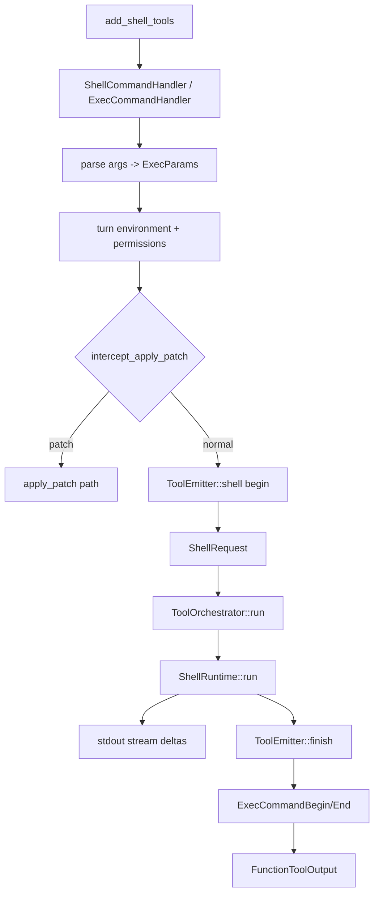

> shell exec flow 是 shell/unified exec handlers 汇入 `run_exec_like` 或 unified exec runtime 后，先处理环境与权限、apply_patch interception、approval/sandbox orchestration；handler 侧 `ToolEmitter` 包住 runtime 执行并发 begin/end events，`ShellRuntime` 负责实际命令执行和 stdout stream。[E: codex-rs/core/src/tools/spec_plan.rs:641][E: codex-rs/core/src/tools/handlers/shell.rs:63][E: codex-rs/core/src/tools/handlers/apply_patch.rs:546][E: codex-rs/core/src/tools/orchestrator.rs:134][E: codex-rs/core/src/tools/runtimes/shell.rs:243][E: codex-rs/core/src/tools/events.rs:96]

## 能回答的问题

- shell tools 在当前 `spec_plan.rs` 中如何门控？
- `shell_command` 如何汇入 `run_exec_like`？
- explicit escalation、apply_patch interception、approval、sandbox 的顺序是什么？
- exec begin/end events 在哪里发？
- UnifiedExec 的 `exec_command` 如何复用 apply_patch interception？

## 端到端步骤

1. `add_shell_tools` 读取 `tool_environment_mode()`；没有 environment 时直接不注册 shell tools。[E: codex-rs/core/src/tools/spec_plan.rs:641][E: codex-rs/core/src/tools/spec_plan.rs:631][E: codex-rs/core/src/tools/spec_plan.rs:645]
2. UnifiedExec 分支注册 `ExecCommandHandler` 和 `WriteStdinHandler`，同时保留 dispatch-only `ShellCommandHandler`；Default/Local/ShellCommand 分支注册 `ShellCommandHandler`。[E: codex-rs/core/src/tools/spec_plan.rs:658][E: codex-rs/core/src/tools/spec_plan.rs:660][E: codex-rs/core/src/tools/spec_plan.rs:669][E: codex-rs/core/src/tools/spec_plan.rs:673][E: codex-rs/core/src/tools/spec_plan.rs:676][E: codex-rs/core/src/tools/spec_plan.rs:679]
3. `ShellCommandHandler` 要求 `ToolPayload::Function`，解析 arguments、workdir 和 shell command params，触发 implicit skill invocation，然后构造 exec params。[E: codex-rs/core/src/tools/handlers/shell/shell_command.rs:177][E: codex-rs/core/src/tools/handlers/shell/shell_command.rs:175][E: codex-rs/core/src/tools/handlers/shell/shell_command.rs:197][E: codex-rs/core/src/tools/handlers/shell/shell_command.rs:198][E: codex-rs/core/src/tools/handlers/shell/shell_command.rs:206]
4. `ShellCommandHandler` 最后调用 `run_exec_like`，传入 tool name、exec params、cancellation token、hook command、additional permissions、tracker、call id 和 runtime backend。[E: codex-rs/core/src/tools/handlers/shell/shell_command.rs:220][E: codex-rs/core/src/tools/handlers/shell/shell_command.rs:224][E: codex-rs/core/src/tools/handlers/shell/shell_command.rs:226][E: codex-rs/core/src/tools/handlers/shell/shell_command.rs:233]
5. `ShellCommandHandler` 要求 step context 有 primary environment，否则向模型返回 shell unavailable；`run_exec_like` 随后从传入的 environment 取 filesystem 并处理 permission/env state。[E: codex-rs/core/src/tools/handlers/shell/shell_command.rs:184][E: codex-rs/core/src/tools/handlers/shell/shell_command.rs:185][E: codex-rs/core/src/tools/handlers/shell.rs:63][E: codex-rs/core/src/tools/handlers/shell.rs:80][E: codex-rs/core/src/tools/handlers/shell.rs:82]
6. explicit sandbox override 在非 `OnRequest` 且未预批准时会被拒绝，避免模型在不允许请求升级的模式下要求 escalated permissions。[E: codex-rs/core/src/tools/handlers/shell.rs:125][E: codex-rs/core/src/tools/handlers/shell.rs:127][E: codex-rs/core/src/tools/handlers/shell.rs:129][E: codex-rs/core/src/tools/handlers/shell.rs:135]
7. 普通 shell path 在发 shell begin event 前调用 `intercept_apply_patch`；如果命令被验证为 apply_patch body，会直接返回 patch output，不再走 shell runtime。[E: codex-rs/core/src/tools/handlers/shell.rs:142][E: codex-rs/core/src/tools/handlers/shell.rs:155][E: codex-rs/core/src/tools/handlers/shell.rs:158][E: codex-rs/core/src/tools/handlers/apply_patch.rs:558]
8. UnifiedExec 的 `exec_command` path 在权限归一化后调用同一个 `intercept_apply_patch`；命中后释放 process id 并把 patch output 包成 exec-command tool output。[E: codex-rs/core/src/tools/handlers/unified_exec/exec_command.rs:289][E: codex-rs/core/src/tools/handlers/unified_exec/exec_command.rs:314][E: codex-rs/core/src/tools/handlers/unified_exec/exec_command.rs:327][E: codex-rs/core/src/tools/handlers/unified_exec/exec_command.rs:328]
9. 非 apply_patch path 创建 `ToolEmitter::shell`，计算 exec approval requirement，组装 `ShellRequest`，再调用 `ToolOrchestrator::run`。[E: codex-rs/core/src/tools/handlers/shell.rs:158][E: codex-rs/core/src/tools/handlers/shell.rs:168][E: codex-rs/core/src/tools/handlers/shell.rs:185][E: codex-rs/core/src/tools/handlers/shell.rs:204][E: codex-rs/core/src/tools/handlers/shell.rs:212]
10. `ShellRequest` 保存 command、turn environment、shell type、cwd、timeout、env、network、sandbox permissions、additional permissions、justification 和 exec approval requirement。[E: codex-rs/core/src/tools/runtimes/shell.rs:55][E: codex-rs/core/src/tools/runtimes/shell.rs:56][E: codex-rs/core/src/tools/runtimes/shell.rs:60][E: codex-rs/core/src/tools/runtimes/shell.rs:65][E: codex-rs/core/src/tools/runtimes/shell.rs:66][E: codex-rs/core/src/tools/runtimes/shell.rs:70][E: codex-rs/core/src/tools/runtimes/shell.rs:71]
11. `ToolOrchestrator::run` 先处理 approval requirement，`Forbidden` 直接 rejected，`NeedsApproval` 走 approval request；随后选择 first sandbox attempt 并运行 runtime。[E: codex-rs/core/src/tools/orchestrator.rs:156][E: codex-rs/core/src/tools/orchestrator.rs:193][E: codex-rs/core/src/tools/orchestrator.rs:196][E: codex-rs/core/src/tools/orchestrator.rs:206][E: codex-rs/core/src/tools/orchestrator.rs:240][E: codex-rs/core/src/tools/orchestrator.rs:280]
12. `ShellRuntime` 是 `Sandboxable`，偏好 Auto sandbox 并支持 failure escalation；approval key 由 environment id、canonical command、cwd、sandbox permissions 和 additional permissions 组成。[E: codex-rs/core/src/tools/runtimes/shell.rs:117][E: codex-rs/core/src/tools/runtimes/shell.rs:121][E: codex-rs/core/src/tools/runtimes/shell.rs:126][E: codex-rs/core/src/tools/runtimes/shell.rs:129][E: codex-rs/core/src/tools/runtimes/shell.rs:130][E: codex-rs/core/src/tools/runtimes/shell.rs:131][E: codex-rs/core/src/tools/runtimes/shell.rs:132][E: codex-rs/core/src/tools/runtimes/shell.rs:133][E: codex-rs/core/src/tools/runtimes/shell.rs:134][E: codex-rs/core/src/tools/runtimes/shell.rs:135]
13. `ShellRuntime::run` 选择 shell、计算 sandbox permissions 和 env，必要时准备 zsh-fork path；stdout stream 带 turn sub-id、call id 和 event sender。[E: codex-rs/core/src/tools/runtimes/shell.rs:243][E: codex-rs/core/src/tools/runtimes/shell.rs:249][E: codex-rs/core/src/tools/runtimes/shell.rs:256][E: codex-rs/core/src/tools/runtimes/shell.rs:263][E: codex-rs/core/src/tools/runtimes/shell.rs:108][E: codex-rs/core/src/tools/runtimes/shell.rs:109][E: codex-rs/core/src/tools/runtimes/shell.rs:110][E: codex-rs/core/src/tools/runtimes/shell.rs:111][E: codex-rs/core/src/tools/runtimes/shell.rs:112]
14. `ToolEmitter::finish` 把 runtime output 转成 exec-style terminal event 和 model-facing text；exec begin/end events 分别由 `emit_exec_command_begin` 和 `emit_exec_end` 路径生成。[E: codex-rs/core/src/tools/handlers/shell.rs:235][E: codex-rs/core/src/tools/events.rs:96][E: codex-rs/core/src/tools/events.rs:473][E: codex-rs/core/src/tools/events.rs:480][E: codex-rs/core/src/tools/events.rs:509]

## 关键决策点

- apply_patch interception 在 shell begin event 之前发生，因此被重路由的 patch 不会表现为普通 shell command lifecycle。[E: codex-rs/core/src/tools/handlers/shell.rs:142][E: codex-rs/core/src/tools/handlers/shell.rs:158]
- approval 先于 sandbox attempt；sandbox failure escalation 是 orchestrator 的第二阶段能力，不是 shell handler 内部自己 retry。[E: codex-rs/core/src/tools/orchestrator.rs:156][E: codex-rs/core/src/tools/orchestrator.rs:240][E: codex-rs/core/src/tools/runtimes/shell.rs:121]
- shell tool 注册当前应以 `spec_plan.rs::add_shell_tools` 为准。[E: codex-rs/core/src/tools/spec_plan.rs:641]

## 深挖入口

- `spine.trace-apply-patch` 走读 direct apply_patch 和 shell interception 的共用 patch runtime。
- `subsys.exec-sandbox.overview` 展开 sandbox selection、platform sandbox 和 filesystem policy。
- `ref.protocol-event-lifecycle` 列出 exec begin/delta/end 事件字段。

## Sources

- codex-rs/core/src/tools/spec_plan.rs
- codex-rs/core/src/tools/handlers/shell.rs
- codex-rs/core/src/tools/handlers/shell/shell_command.rs
- codex-rs/core/src/tools/handlers/unified_exec/exec_command.rs
- codex-rs/core/src/tools/handlers/apply_patch.rs
- codex-rs/core/src/tools/orchestrator.rs
- codex-rs/core/src/tools/runtimes/shell.rs
- codex-rs/core/src/tools/events.rs

## 相关

- [工具调用解剖](tool-call-anatomy.md)
- [trace: apply_patch](trace-apply-patch.md)
- [exec_command 工具](../surface/tools/exec-command.md)
- [shell_command 工具](../surface/tools/shell-command.md)
- [exec sandbox](../subsystems/exec-sandbox/overview.md)
- 索引 id：`ref.protocol-event-lifecycle`
