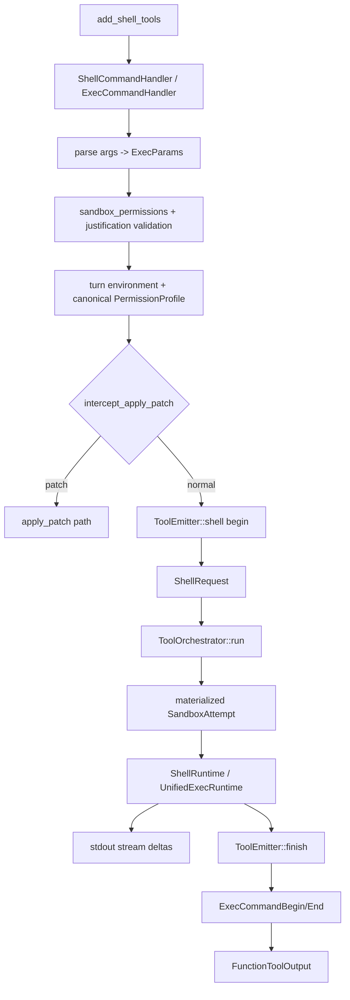

> shell exec flow 是 shell/unified exec handlers 汇入 `run_exec_like` 或 unified exec runtime 后，先处理环境与权限、apply_patch interception、approval/sandbox orchestration；handler 侧 `ToolEmitter` 包住 runtime 执行并发 begin/end events，`ShellRuntime` 负责实际命令执行和 stdout stream。Windows 上 `Feature::UnifiedExec` 现默认开启。[E: codex-rs/core/src/tools/spec_plan.rs:961][E: codex-rs/core/src/tools/handlers/shell.rs:64][E: codex-rs/core/src/tools/handlers/apply_patch.rs:500][E: codex-rs/core/src/tools/orchestrator.rs:136][E: codex-rs/features/src/lib.rs:838]

## 能回答的问题

- shell tools 在当前 `spec_plan.rs` 中如何门控？
- `shell_command` 如何汇入 `run_exec_like`？
- explicit escalation、apply_patch interception、approval、sandbox 的顺序是什么？
- exec begin/end events 在哪里发？
- UnifiedExec 的 `exec_command` 如何复用 apply_patch interception？

```mermaid
flowchart TD
    SPEC["add_shell_tools"] --> HANDLER["ShellCommandHandler / ExecCommandHandler"]
    HANDLER --> PARAMS["parse args -> ExecParams"]
    PARAMS --> VALIDATE["sandbox_permissions + justification validation"]
    VALIDATE --> ENV["turn environment + canonical PermissionProfile"]
    ENV --> PATCH{"intercept_apply_patch"}
    PATCH -->|patch| APPLY["apply_patch path"]
    PATCH -->|normal| EMIT["ToolEmitter::shell begin"]
    EMIT --> REQ["ShellRequest"]
    REQ --> ORCH["ToolOrchestrator::run"]
    ORCH --> ATTEMPT["materialized SandboxAttempt"]
    ATTEMPT --> RUNTIME["ShellRuntime / UnifiedExecRuntime"]
    RUNTIME --> STDOUT["stdout stream deltas"]
    RUNTIME --> FINISH["ToolEmitter::finish"]
    FINISH --> EVENTS["ExecCommandBegin/End"]
    EVENTS --> MODEL["FunctionToolOutput"]
```

## 端到端步骤

1. `add_shell_tools` 读取 `tool_environment_mode()`；没有 environment 时直接不注册 shell tools。[E: codex-rs/core/src/tools/spec_plan.rs:961][E: codex-rs/core/src/tools/spec_plan.rs:964][E: codex-rs/core/src/tools/spec_plan.rs:966]
2. UnifiedExec 分支注册 `ExecCommandHandler` 和 `WriteStdinHandler`，在单一 local environment 下同时 hidden 注册 legacy `ShellCommandHandler`；Disabled 分支不注册，Default/Local/ShellCommand 分支按 local environment 可用性注册 `ShellCommandHandler`。`Feature::UnifiedExec` 现为 Stable、`default_enabled: true`，因此 Windows 默认走 UnifiedExec 分支。[E: codex-rs/core/src/tools/spec_plan.rs:979][E: codex-rs/core/src/tools/spec_plan.rs:990][E: codex-rs/core/src/tools/spec_plan.rs:992][E: codex-rs/core/src/tools/spec_plan.rs:1001][E: codex-rs/features/src/lib.rs:838][E: codex-rs/features/src/lib.rs:841]
3. `ShellCommandHandler` 要求 `ToolPayload::Function`，解析 arguments、workdir 和 shell command params，触发 implicit skill invocation，然后构造 exec params；共用 validator 还要求 `justification` 必须伴随显式 `sandbox_permissions`。[E: codex-rs/core/src/tools/handlers/shell/shell_command.rs:191][E: codex-rs/core/src/tools/handlers/shell/shell_command.rs:210][E: codex-rs/core/src/tools/handlers/shell/shell_command.rs:221][E: codex-rs/core/src/tools/handlers/mod.rs:92][E: codex-rs/core/src/tools/handlers/mod.rs:96]
4. `ShellCommandHandler` 最后调用 `run_exec_like`，传入 tool name、exec params、cancellation token、hook command、additional permissions、tracker、call id 和 runtime backend。[E: codex-rs/core/src/tools/handlers/shell/shell_command.rs:234]
5. `ShellCommandHandler` 要求 step context 有 primary environment，否则向模型返回 shell unavailable；`run_exec_like` 随后从传入的 environment 取 filesystem 并处理 permission/env state。[E: codex-rs/core/src/tools/handlers/shell/shell_command.rs:197][E: codex-rs/core/src/tools/handlers/shell.rs:64][E: codex-rs/core/src/tools/handlers/shell.rs:82]
6. explicit sandbox override 在非 `OnRequest` 且未预批准时会被拒绝，避免模型在不允许请求升级的模式下要求 escalated permissions。[E: codex-rs/core/src/tools/handlers/shell.rs:130][E: codex-rs/core/src/tools/handlers/shell.rs:140]
7. 普通 shell path 在发 shell begin event 前调用 `intercept_apply_patch`；如果命令被验证为 apply_patch body，会直接返回 patch output，不再走 shell runtime。[E: codex-rs/core/src/tools/handlers/shell.rs:147][E: codex-rs/core/src/tools/handlers/shell.rs:160][E: codex-rs/core/src/tools/handlers/apply_patch.rs:500]
8. UnifiedExec 的 `exec_command` path 在权限归一化后调用同一个 `intercept_apply_patch`；命中后释放 process id 并把 patch output 包成 exec-command tool output。[E: codex-rs/core/src/tools/handlers/unified_exec/exec_command.rs:314][E: codex-rs/core/src/tools/handlers/unified_exec/exec_command.rs:331][E: codex-rs/core/src/tools/handlers/unified_exec/exec_command.rs:333]
9. 非 apply_patch path 创建 `ToolEmitter::shell`，计算 exec approval requirement，组装 `ShellRequest`，再调用 `ToolOrchestrator::run`。[E: codex-rs/core/src/tools/handlers/shell.rs:166][E: codex-rs/core/src/tools/handlers/shell.rs:180][E: codex-rs/core/src/tools/handlers/shell.rs:198][E: codex-rs/core/src/tools/handlers/shell.rs:225]
10. `ShellRequest` 保存 command、turn environment、shell type、cwd、timeout、env、network、sandbox permissions、additional permissions、justification 和 exec approval requirement。[E: codex-rs/core/src/tools/runtimes/shell.rs:53][E: codex-rs/core/src/tools/runtimes/shell.rs:55][E: codex-rs/core/src/tools/runtimes/shell.rs:69]
11. `ToolOrchestrator::run` 先从 environment 取 `PermissionProfile` 并 materialize workspace roots，再处理 approval requirement；`Forbidden` 直接 rejected，`NeedsApproval` 走 approval request。随后选择 first sandbox attempt 并运行 runtime。[E: codex-rs/core/src/tools/orchestrator.rs:136][E: codex-rs/core/src/tools/orchestrator.rs:160][E: codex-rs/core/src/tools/orchestrator.rs:168][E: codex-rs/core/src/tools/orchestrator.rs:171]
12. `ShellRuntime` 是 `Sandboxable`，偏好 Auto sandbox 并支持 failure escalation；approval key 由 environment id、canonical command、`PathUri` cwd、sandbox permissions 和 additional permissions 组成。[E: codex-rs/core/src/tools/runtimes/shell.rs:115][E: codex-rs/core/src/tools/runtimes/shell.rs:119][E: codex-rs/core/src/tools/runtimes/shell.rs:93][E: codex-rs/core/src/tools/runtimes/shell.rs:135]
13. `ShellRuntime::run` 选择 shell、计算 sandbox permissions 和 env，必要时准备 zsh-fork path；stdout stream 带 turn sub-id、call id 和 event sender。[E: codex-rs/core/src/tools/runtimes/shell.rs:106][E: codex-rs/core/src/tools/runtimes/shell.rs:244][E: codex-rs/core/src/tools/runtimes/shell.rs:264]
14. `ToolEmitter::finish` 把 runtime output 转成 exec-style terminal event 和 model-facing text；exec begin/end events 分别由 `emit_exec_command_begin` 和 `emit_exec_end` 路径生成。[E: codex-rs/core/src/tools/events.rs:109][E: codex-rs/core/src/tools/events.rs:430][E: codex-rs/core/src/tools/events.rs:616]

## 关键决策点

- apply_patch interception 在 shell begin event 之前发生，因此被重路由的 patch 不会表现为普通 shell command lifecycle。[E: codex-rs/core/src/tools/handlers/shell.rs:147][E: codex-rs/core/src/tools/handlers/shell.rs:166]
- approval 先于 sandbox attempt；sandbox failure escalation 是 orchestrator 的第二阶段能力，不是 shell handler 内部自己 retry。[E: codex-rs/core/src/tools/orchestrator.rs:168][E: codex-rs/core/src/tools/runtimes/shell.rs:119]
- shell tool 注册当前应以 `spec_plan.rs::add_shell_tools` 为准；Windows 不再因 UnifiedExec default-off 而回退到 `shell_command`。[E: codex-rs/core/src/tools/spec_plan.rs:961][E: codex-rs/features/src/lib.rs:841]

## 深挖入口

- `spine.trace-apply-patch` 走读 direct apply_patch 和 shell interception 的共用 patch runtime。
- `subsys.exec-sandbox.overview` 展开 sandbox selection、platform sandbox 和 filesystem policy。
- `ref.protocol-event-lifecycle` 列出 exec begin/delta/end 事件字段。

## Sources

- codex-rs/core/src/tools/spec_plan.rs
- codex-rs/core/src/tools/handlers/mod.rs
- codex-rs/core/src/tools/handlers/shell.rs
- codex-rs/core/src/tools/handlers/shell/shell_command.rs
- codex-rs/core/src/tools/handlers/unified_exec/exec_command.rs
- codex-rs/core/src/tools/handlers/apply_patch.rs
- codex-rs/core/src/tools/orchestrator.rs
- codex-rs/core/src/tools/runtimes/shell.rs
- codex-rs/core/src/tools/runtimes/unified_exec.rs
- codex-rs/core/src/unified_exec/process_manager.rs
- codex-rs/core/src/unified_exec/process.rs
- codex-rs/core/src/tools/events.rs
- codex-rs/features/src/lib.rs

## 相关

- [工具调用解剖](tool-call-anatomy.md)
- [trace: apply_patch](trace-apply-patch.md)
- [exec_command 工具](../surface/tools/exec-command.md)
- [shell_command 工具](../surface/tools/shell-command.md)
- [exec sandbox](../subsystems/exec-sandbox/overview.md)
- 索引 id：`ref.protocol-event-lifecycle`
