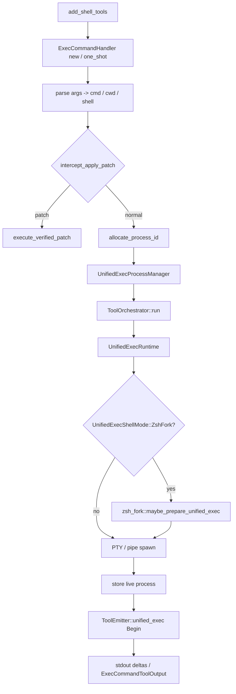

> shell exec flow 是当前命令执行面：`add_shell_tools` 只注册 `ExecCommandHandler`（UnifiedExec 开则加 `WriteStdinHandler`，关则 `ExecCommandHandler::one_shot`）。handler 解析 `cmd`、拦截 apply_patch、再经 `UnifiedExecProcessManager` → `ToolOrchestrator` → `UnifiedExecRuntime` 做 approval/sandbox 并 spawn。`shell_command` 不再注册 handler，只是 reserved name。[E: codex-rs/core/src/tools/spec_plan.rs:1104][E: codex-rs/core/src/tools/spec_plan.rs:1111][E: codex-rs/core/src/tools/registry.rs:364][E: codex-rs/core/src/tools/handlers/unified_exec/exec_command.rs:385]

## 能回答的问题

- `add_shell_tools` 现在注册哪些 handler？
- `Feature::UnifiedExec` 关时为什么仍有 `exec_command`，却没有 `write_stdin`？
- apply_patch interception、approval、sandbox 的顺序是什么？
- exec begin/end events 在哪里发？
- zsh-fork 如何挂到 unified-exec runtime？

```mermaid
flowchart TD
    SPEC["add_shell_tools"] --> HANDLER["ExecCommandHandler new / one_shot"]
    HANDLER --> PARAMS["parse args -> cmd / cwd / shell"]
    PARAMS --> PATCH{"intercept_apply_patch"}
    PATCH -->|patch| APPLY["execute_verified_patch"]
    PATCH -->|normal| PID["allocate_process_id"]
    PID --> MGR["UnifiedExecProcessManager"]
    MGR --> ORCH["ToolOrchestrator::run"]
    ORCH --> RT["UnifiedExecRuntime"]
    RT --> ZSH{"UnifiedExecShellMode::ZshFork?"}
    ZSH -->|yes| ZF["zsh_fork::maybe_prepare_unified_exec"]
    ZSH -->|no| SPAWN["PTY / pipe spawn"]
    ZF --> SPAWN
    SPAWN --> STORE["store live process"]
    STORE --> BEGIN["ToolEmitter::unified_exec Begin"]
    BEGIN --> OUT["stdout deltas / ExecCommandToolOutput"]
```

## 端到端步骤

1. `add_shell_tools` 在没有 environment、`Feature::ShellTool` 关闭、或 `model_info.shell_type == ConfigShellToolType::Disabled` 时直接返回。[E: codex-rs/core/src/tools/spec_plan.rs:1079][E: codex-rs/core/src/tools/spec_plan.rs:1083]
2. 否则构造 `ExecCommandHandlerOptions`。`Feature::UnifiedExec` 开启时 `registry.add(ExecCommandHandler::new)` 再 `registry.add(WriteStdinHandler)`；关闭时只 `registry.add(ExecCommandHandler::one_shot)`，注释写明这是为了在 managed requirements 禁用 unified exec 时仍能执行命令，但不暴露 resumable process / `write_stdin`。[E: codex-rs/core/src/tools/spec_plan.rs:1104][E: codex-rs/core/src/tools/spec_plan.rs:1105][E: codex-rs/core/src/tools/spec_plan.rs:1111]
3. Guardian reviewer 不走 `add_shell_tools`：Managed permission profile 且有 environment、并且 `ShellTool` + `UnifiedExec` 都开、模型 shell type 不是 Disabled 时，才注册 interactive `ExecCommandHandler` 与 `WriteStdinHandler`。[E: codex-rs/core/src/tools/spec_plan.rs:978][E: codex-rs/core/src/tools/spec_plan.rs:994][E: codex-rs/core/src/tools/spec_plan.rs:998][E: codex-rs/core/src/tools/spec_plan.rs:1014]
4. `shell_command` 不再有 handler。`register_external` 把 `"exec_command" | "shell_command"` 当作 reserved name，跳过外部 runtime。[E: codex-rs/core/src/tools/registry.rs:364][E: codex-rs/core/src/tools/registry.rs:366]
5. `ExecCommandHandler` 只接受 `ToolPayload::Function`，解析 environment/workdir，派生 argv，分配 process id，再调用 `intercept_apply_patch`。命中 verified patch 时释放 process id，返回合成 `ExecCommandToolOutput`（`process_id: None`）。[E: codex-rs/core/src/tools/handlers/unified_exec/exec_command.rs:170][E: codex-rs/core/src/tools/handlers/unified_exec/exec_command.rs:289][E: codex-rs/core/src/tools/handlers/unified_exec/exec_command.rs:385][E: codex-rs/core/src/tools/handlers/unified_exec/exec_command.rs:404]
6. Interactive lifetime 调 `manager.exec_command`；OneShot lifetime 强制 `tty = false`，用 `timeout_ms`（默认 `DEFAULT_EXEC_COMMAND_TIMEOUT_MS = 10_000`）走 `exec_command_to_completion`，超时或取消会 terminate 进程且不可 resume。[E: codex-rs/core/src/tools/handlers/unified_exec/exec_command.rs:310][E: codex-rs/core/src/tools/handlers/unified_exec/exec_command.rs:441][E: codex-rs/core/src/unified_exec/oneshot.rs:26][E: codex-rs/core/src/exec.rs:61]
7. `UnifiedExecProcessManager::exec_command_inner` 先 `open_session_with_sandbox`，再发 `ToolEmitter::unified_exec` Begin，启动 output streaming；进程仍活着时在 initial yield wait **之前** `store_process`，避免 turn interrupt drop 最后一个 `Arc`。[E: codex-rs/core/src/unified_exec/process_manager.rs:503][E: codex-rs/core/src/unified_exec/process_manager.rs:556][E: codex-rs/core/src/unified_exec/process_manager.rs:572]
8. `open_session_with_sandbox` 组装 env（含 `CODEX_THREAD_ID`）、`ExecServerEnvConfig` 和 exec approval requirement，创建 `UnifiedExecRuntime`，交给 `ToolOrchestrator::run`。[E: codex-rs/core/src/unified_exec/process_manager.rs:1362][E: codex-rs/core/src/unified_exec/process_manager.rs:1373][E: codex-rs/core/src/unified_exec/process_manager.rs:1389]
9. orchestrator 先处理 approval：`Forbidden` 直接 rejected，`NeedsApproval` 走 `request_approval`；通过后再选 sandbox attempt 并跑 runtime。[E: codex-rs/core/src/tools/orchestrator.rs:121][E: codex-rs/core/src/tools/orchestrator.rs:209][E: codex-rs/core/src/tools/orchestrator.rs:212]
10. `UnifiedExecRuntime` 的 sandbox preference 是 `Auto`，`escalate_on_failure()` 为 true。`shell_mode` 为 `ZshFork` 时调用 `zsh_fork::maybe_prepare_unified_exec`；条件不满足则回退 Direct spawn。[E: codex-rs/core/src/tools/runtimes/unified_exec.rs:158][E: codex-rs/core/src/tools/runtimes/unified_exec.rs:162][E: codex-rs/core/src/tools/runtimes/unified_exec.rs:440][E: codex-rs/core/src/tools/runtimes/unified_exec.rs:464]
11. `Feature::UnifiedExec` 是 Stable、`default_enabled: true`（含 Windows）。[E: codex-rs/features/src/lib.rs:939]

## 关键决策点

- apply_patch interception 发生在 `manager.exec_command` 之前；被重路由的 patch 不会进入 process store，也不会带 live `session_id`。[E: codex-rs/core/src/tools/handlers/unified_exec/exec_command.rs:385][E: codex-rs/core/src/tools/handlers/unified_exec/exec_command.rs:412]
- approval 先于 sandbox attempt；sandbox failure escalation 是 orchestrator 的第二阶段，不是 handler 自己 retry。[E: codex-rs/core/src/tools/orchestrator.rs:209][E: codex-rs/core/src/tools/runtimes/unified_exec.rs:162]
- `shell_command` 已退役：不要再写 `ShellCommandHandler` 还活着。UnifiedExec=off 时的兼容面是 `ExecCommandHandler::one_shot`，wire name 仍是 `exec_command`。[E: codex-rs/core/src/tools/spec_plan.rs:1111][E: codex-rs/core/src/tools/handlers/unified_exec/exec_command.rs:114]

## 深挖入口

- `spine.trace-apply-patch` 走读 direct apply_patch 与 exec interception 的共用 patch runtime。
- `subsys.core.unified-exec` 展开 process manager、one-shot、PTY 与 stdin 续写。
- `subsys.exec-sandbox.overview` 展开 sandbox selection 与 filesystem policy。

## Sources

- `codex-rs/core/src/tools/spec_plan.rs`
- `codex-rs/core/src/tools/registry.rs`
- `codex-rs/core/src/tools/handlers/unified_exec/exec_command.rs`
- `codex-rs/core/src/tools/handlers/unified_exec.rs`
- `codex-rs/core/src/unified_exec/oneshot.rs`
- `codex-rs/core/src/unified_exec/process_manager.rs`
- `codex-rs/core/src/tools/runtimes/unified_exec.rs`
- `codex-rs/core/src/tools/runtimes/zsh_fork.rs`
- `codex-rs/core/src/tools/handlers/apply_patch.rs`
- `codex-rs/core/src/tools/orchestrator.rs`
- `codex-rs/core/src/tools/events.rs`
- `codex-rs/features/src/lib.rs`

## 相关

- [工具调用解剖](tool-call-anatomy.md)
- [trace: apply_patch](trace-apply-patch.md)
- [exec_command 工具](../surface/tools/exec-command.md)
- [shell_command（已退役）](../surface/tools/shell-command.md)
- [write_stdin 工具](../surface/tools/write-stdin.md)
- [Unified Exec](../subsystems/core/unified-exec.md)
- [exec sandbox](../subsystems/exec-sandbox/overview.md)
- 索引 id：`ref.protocol-event-lifecycle`
