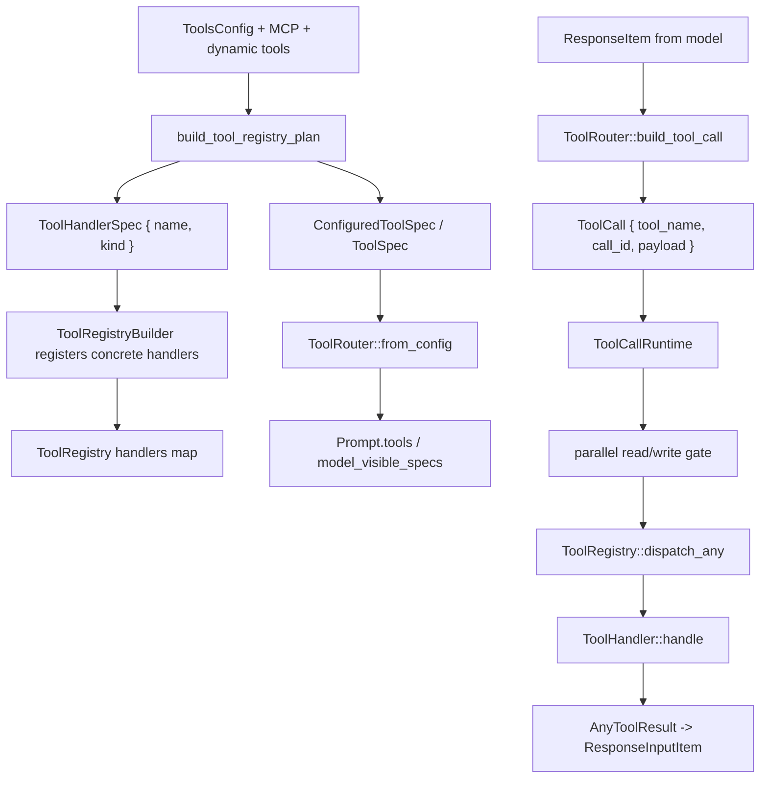

> 工具调用的 ground truth 是 `codex_tools::build_tool_registry_plan` 生成 spec/handler plan，core 再把模型输出转换为 `ToolCall` 并交给 `ToolRegistry::dispatch_any`。[I]

## 能回答的问题

- 一个 tool 在 Codex 中由哪些对象表示？
- `ToolSpec` 和 `ToolHandlerKind` 的职责为什么分离？
- model-visible tools 和 runtime handlers 是怎样从同一份 plan 派生的？
- Function/MCP/Custom/LocalShell output item 怎样归一成 `ToolCall`？
- 并行 tool call 为什么会用 read/write lock？

该 flowchart 是后续编号步骤的视觉索引；具体控制流事实以编号步骤中的源码证据为准。[I]

## 端到端步骤

1. `ToolRegistryPlan` 同时保存 `specs: Vec<ConfiguredToolSpec>` 和 `handlers: Vec<ToolHandlerSpec>`；`ToolHandlerSpec` 由 `ToolName` 和 `ToolHandlerKind` 组成。[E: codex-rs/tools/src/tool_registry_plan_types.rs:48][E: codex-rs/tools/src/tool_registry_plan_types.rs:49][E: codex-rs/tools/src/tool_registry_plan_types.rs:53][E: codex-rs/tools/src/tool_registry_plan_types.rs:54][E: codex-rs/tools/src/tool_registry_plan_types.rs:55]
2. `ToolHandlerKind` 是 handler 的离散枚举，覆盖 `ApplyPatch`、`Mcp`、`Shell`、`UnifiedExec`、`SpawnAgentV2`、`ToolSearch`、`ViewImage` 等 runtime handler 类型。[E: codex-rs/tools/src/tool_registry_plan_types.rs:12][E: codex-rs/tools/src/tool_registry_plan_types.rs:14][E: codex-rs/tools/src/tool_registry_plan_types.rs:25][E: codex-rs/tools/src/tool_registry_plan_types.rs:33][E: codex-rs/tools/src/tool_registry_plan_types.rs:36][E: codex-rs/tools/src/tool_registry_plan_types.rs:38][E: codex-rs/tools/src/tool_registry_plan_types.rs:41]
3. `build_tool_registry_plan(config, params)` 创建空 plan；后续具体分支按 `ToolsConfig` 与 params push specs/register handlers。[E: codex-rs/tools/src/tool_registry_plan.rs:71][E: codex-rs/tools/src/tool_registry_plan.rs:75][E: codex-rs/tools/src/tool_registry_plan.rs:141][E: codex-rs/tools/src/tool_registry_plan.rs:169][I]
4. shell 工具分支按 `ConfigShellToolType` 创建 default/local/unified/shell_command specs；UnifiedExec 还显式注册 `exec_command` 和 `write_stdin` handler。[E: codex-rs/tools/src/tool_registry_plan.rs:138][E: codex-rs/tools/src/tool_registry_plan.rs:141][E: codex-rs/tools/src/tool_registry_plan.rs:150][E: codex-rs/tools/src/tool_registry_plan.rs:157][E: codex-rs/tools/src/tool_registry_plan.rs:165][E: codex-rs/tools/src/tool_registry_plan.rs:169][E: codex-rs/tools/src/tool_registry_plan.rs:170][E: codex-rs/tools/src/tool_registry_plan.rs:175]
5. apply_patch 工具只在 `config.has_environment` 且 `config.apply_patch_tool_type` 存在时加入，Freeform/Function 两种 spec 都注册到 `ToolHandlerKind::ApplyPatch`。[E: codex-rs/tools/src/tool_registry_plan.rs:312][E: codex-rs/tools/src/tool_registry_plan.rs:313][E: codex-rs/tools/src/tool_registry_plan.rs:318][E: codex-rs/tools/src/tool_registry_plan.rs:325][E: codex-rs/tools/src/tool_registry_plan.rs:331]
6. collab tools 分支在 `config.collab_tools && config.multi_agent_v2` 时创建 `spawn_agent`、`send_message`、`followup_task`、`wait_agent`、`close_agent`、`list_agents` 并注册对应 V2 handler。[E: codex-rs/tools/src/tool_registry_plan.rs:392][E: codex-rs/tools/src/tool_registry_plan.rs:393][E: codex-rs/tools/src/tool_registry_plan.rs:397][E: codex-rs/tools/src/tool_registry_plan.rs:408][E: codex-rs/tools/src/tool_registry_plan.rs:413][E: codex-rs/tools/src/tool_registry_plan.rs:418][E: codex-rs/tools/src/tool_registry_plan.rs:423][E: codex-rs/tools/src/tool_registry_plan.rs:428][E: codex-rs/tools/src/tool_registry_plan.rs:432][E: codex-rs/tools/src/tool_registry_plan.rs:433][E: codex-rs/tools/src/tool_registry_plan.rs:434][E: codex-rs/tools/src/tool_registry_plan.rs:435][E: codex-rs/tools/src/tool_registry_plan.rs:436][E: codex-rs/tools/src/tool_registry_plan.rs:437]
7. MCP direct tools 要求 namespaced tool name；转换成功后注册 `ToolHandlerKind::Mcp`，并把同 namespace 的工具 coalesce 成 `ToolSpec::Namespace`。[E: codex-rs/tools/src/tool_registry_plan.rs:503][E: codex-rs/tools/src/tool_registry_plan.rs:532][E: codex-rs/tools/src/tool_registry_plan.rs:535][E: codex-rs/tools/src/tool_registry_plan.rs:548]
8. dynamic tools 通过 `dynamic_tool_to_loadable_tool_spec` 转成 loadable spec，并用 `ToolName::new(tool.namespace.clone(), tool.name.clone())` 注册 `ToolHandlerKind::DynamicTool`；coalesced loadable specs 随后被 push 到 plan。[E: codex-rs/tools/src/tool_registry_plan.rs:562][E: codex-rs/tools/src/tool_registry_plan.rs:563][E: codex-rs/tools/src/tool_registry_plan.rs:564][E: codex-rs/tools/src/tool_registry_plan.rs:566][E: codex-rs/tools/src/tool_registry_plan.rs:576][E: codex-rs/tools/src/tool_registry_plan.rs:577][E: codex-rs/tools/src/tool_registry_plan.rs:578]
9. core 的 `build_specs_with_discoverable_tools` 调用 `build_tool_registry_plan`，随后对每个 `ToolHandlerKind` 注册具体 handler，例如 `McpHandler`、`PlanHandler`、`ShellHandler`、`SpawnAgentHandlerV2`、`ToolSearchHandler`。[E: codex-rs/core/src/tools/spec.rs:128][E: codex-rs/core/src/tools/spec.rs:228][E: codex-rs/core/src/tools/spec.rs:234][E: codex-rs/core/src/tools/spec.rs:252][E: codex-rs/core/src/tools/spec.rs:261][E: codex-rs/core/src/tools/spec.rs:274][E: codex-rs/core/src/tools/spec.rs:275]
10. `ToolRouter::from_config` 把 builder build 成 `(specs, registry)`，并保存 `model_visible_specs`；当 `code_mode_only_enabled` 时，它过滤 code-mode nested tool，否则所有 specs 都 model-visible。[E: codex-rs/core/src/tools/router.rs:56][E: codex-rs/core/src/tools/router.rs:73][E: codex-rs/core/src/tools/router.rs:74][E: codex-rs/core/src/tools/router.rs:78][E: codex-rs/core/src/tools/router.rs:79][E: codex-rs/core/src/tools/router.rs:86][E: codex-rs/core/src/tools/router.rs:87][E: codex-rs/core/src/tools/router.rs:88][E: codex-rs/core/src/tools/router.rs:89]
11. `ToolRouter::build_tool_call` 将 `ResponseItem::FunctionCall` 解析成 `ToolCall`；如果 `session.resolve_mcp_tool_info(&tool_name)` 命中，它把 payload 改写为 `ToolPayload::Mcp`，否则使用 `ToolPayload::Function`。[E: codex-rs/core/src/tools/router.rs:178][E: codex-rs/core/src/tools/router.rs:185][E: codex-rs/core/src/tools/router.rs:186][E: codex-rs/core/src/tools/router.rs:190][E: codex-rs/core/src/tools/router.rs:200]
12. `ToolRouter::build_tool_call` 还把 client-side `ToolSearchCall`、`CustomToolCall` 和 `LocalShellCall` 分别映射到 `ToolPayload::ToolSearch`、`ToolPayload::Custom`、`ToolPayload::LocalShell`。[E: codex-rs/core/src/tools/router.rs:204][E: codex-rs/core/src/tools/router.rs:217][E: codex-rs/core/src/tools/router.rs:219][E: codex-rs/core/src/tools/router.rs:223][E: codex-rs/core/src/tools/router.rs:229][E: codex-rs/core/src/tools/router.rs:231][E: codex-rs/core/src/tools/router.rs:254][E: codex-rs/core/src/tools/router.rs:255][E: codex-rs/core/src/tools/router.rs:257]
13. `handle_output_item_done` 在识别到 `ToolCall` 后记录 model-emitted tool call item，把 `ToolCallRuntime::handle_tool_call` future 写进 `OutputItemResult`，sampling loop 再把该 future 推入 `in_flight`。[E: codex-rs/core/src/stream_events_utils.rs:228][E: codex-rs/core/src/stream_events_utils.rs:243][E: codex-rs/core/src/stream_events_utils.rs:248][E: codex-rs/core/src/stream_events_utils.rs:249][E: codex-rs/core/src/stream_events_utils.rs:250][E: codex-rs/core/src/stream_events_utils.rs:253][E: codex-rs/core/src/session/turn.rs:2013]
14. `ToolCallRuntime` 保存 router、session、turn_context、diff tracker 和 `parallel_execution: Arc<RwLock<()>>`；`handle_tool_call_with_source` 根据 `router.tool_supports_parallel(&call)` 选择 read guard 或 write guard。[E: codex-rs/core/src/tools/parallel.rs:29][E: codex-rs/core/src/tools/parallel.rs:30][E: codex-rs/core/src/tools/parallel.rs:31][E: codex-rs/core/src/tools/parallel.rs:32][E: codex-rs/core/src/tools/parallel.rs:33][E: codex-rs/core/src/tools/parallel.rs:89][E: codex-rs/core/src/tools/parallel.rs:117][E: codex-rs/core/src/tools/parallel.rs:119]
15. `ToolRouter::tool_supports_parallel` 对 MCP payload 使用 `parallel_mcp_server_names.contains(server)`，对非 MCP payload 使用 configured spec 的 `supports_parallel_tool_calls` 标记。[E: codex-rs/core/src/tools/router.rs:148][E: codex-rs/core/src/tools/router.rs:149][E: codex-rs/core/src/tools/router.rs:150][E: codex-rs/core/src/tools/router.rs:151][E: codex-rs/core/src/tools/router.rs:162][E: codex-rs/core/src/tools/router.rs:167][E: codex-rs/core/src/tools/router.rs:168]
16. `ToolRouter::dispatch_tool_call_with_code_mode_result` 把 `ToolCall` 拆成 `ToolInvocation`，再调用 `self.registry.dispatch_any(invocation).await`。[E: codex-rs/core/src/tools/router.rs:276][E: codex-rs/core/src/tools/router.rs:294][E: codex-rs/core/src/tools/router.rs:304]
17. `ToolRegistry::dispatch_any` 先增加 active turn 的 `tool_calls` 计数，再查 handler；找不到 handler 时返回 `RespondToModel`，payload kind 不匹配时返回 fatal。[E: codex-rs/core/src/tools/registry.rs:303][E: codex-rs/core/src/tools/registry.rs:307][E: codex-rs/core/src/tools/registry.rs:322][E: codex-rs/core/src/tools/registry.rs:326][E: codex-rs/core/src/tools/registry.rs:339]
18. `ToolRegistry::dispatch_any` 在 handler 前运行 PreToolUse hook，mutating handler 会等待 `turn.tool_call_gate.wait_ready()`；PostToolUse payload 只在 handler 结果成功时生成，legacy AfterToolUse hook 会在 handler attempt 后携带 `success` 标记运行。[E: codex-rs/core/src/tools/registry.rs:343][E: codex-rs/core/src/tools/registry.rs:359][E: codex-rs/core/src/tools/registry.rs:378][E: codex-rs/core/src/tools/registry.rs:381][E: codex-rs/core/src/tools/registry.rs:401][E: codex-rs/core/src/tools/registry.rs:415][E: codex-rs/core/src/tools/registry.rs:433]
19. `AnyToolResult::into_response` 调用具体 `ToolOutput::to_response_item(&call_id, &payload)`，把 handler 结果变回 Responses API 能接受的 `ResponseInputItem`。[E: codex-rs/core/src/tools/registry.rs:120]

## 关键设计点

- `ToolSpec` 是 model/API 暴露面，`ToolHandlerKind` 是 runtime dispatch 面；二者在 plan 中并列保存。这样设计避免只从 schema 反推 handler，是对 plan 结构的推断。[E: codex-rs/tools/src/tool_registry_plan_types.rs:49][E: codex-rs/tools/src/tool_registry_plan_types.rs:54][E: codex-rs/tools/src/tool_registry_plan_types.rs:55][I]
- 并行策略在 spec registration 和 MCP server config 上做静态标记，runtime 用 read/write lock 统一执行；parallel tool 共享 read guard，非 parallel tool 独占 write guard。[E: codex-rs/tools/src/tool_registry_plan_types.rs:103][E: codex-rs/tools/src/tool_registry_plan_types.rs:111][E: codex-rs/tools/src/tool_registry_plan_types.rs:112][E: codex-rs/core/src/session/turn.rs:1278][E: codex-rs/core/src/session/turn.rs:1281][E: codex-rs/core/src/session/turn.rs:1283][E: codex-rs/core/src/tools/parallel.rs:117][E: codex-rs/core/src/tools/parallel.rs:119]
- `ToolRouter::build_tool_call` 是模型输出到 runtime payload 的归一化点；Function、MCP、ToolSearch、Custom、LocalShell 都在这里变成 `ToolCall`。[E: codex-rs/core/src/tools/router.rs:190][E: codex-rs/core/src/tools/router.rs:200][E: codex-rs/core/src/tools/router.rs:219][E: codex-rs/core/src/tools/router.rs:231][E: codex-rs/core/src/tools/router.rs:257][I]
- `ToolRegistry::dispatch_any` 把 telemetry、hook、mutating gate、handler execution、post hook 和 result extraction 放在同一处，因此具体 handler 可以聚焦自身协议。[I]

## 深挖入口

- `spine.shell-exec-flow` 走读 shell handler、approval、sandbox、exec event。
- `spine.trace-apply-patch` 走读 apply_patch Freeform/Function 工具与 shell interception。
- `spine.trace-mcp-call` 走读 MCP direct tool 的 approval、metadata、call_tool 和 image sanitization。
- `spine.trace-subagent` 走读 multi-agent V2 的 spawn/message/wait control plane。

## Sources

- codex-rs/tools/src/tool_registry_plan.rs
- codex-rs/tools/src/tool_registry_plan_types.rs
- codex-rs/core/src/tools/spec.rs
- codex-rs/core/src/tools/router.rs
- codex-rs/core/src/tools/parallel.rs
- codex-rs/core/src/tools/registry.rs
- codex-rs/core/src/stream_events_utils.rs
- codex-rs/core/src/session/turn.rs

## 相关

- [一次 turn 端到端](turn-end-to-end.md)
- [shell exec flow](shell-exec-flow.md)
- [trace: apply_patch](trace-apply-patch.md)
- [trace: MCP call](trace-mcp-call.md)
- [trace: subagent](trace-subagent.md)
