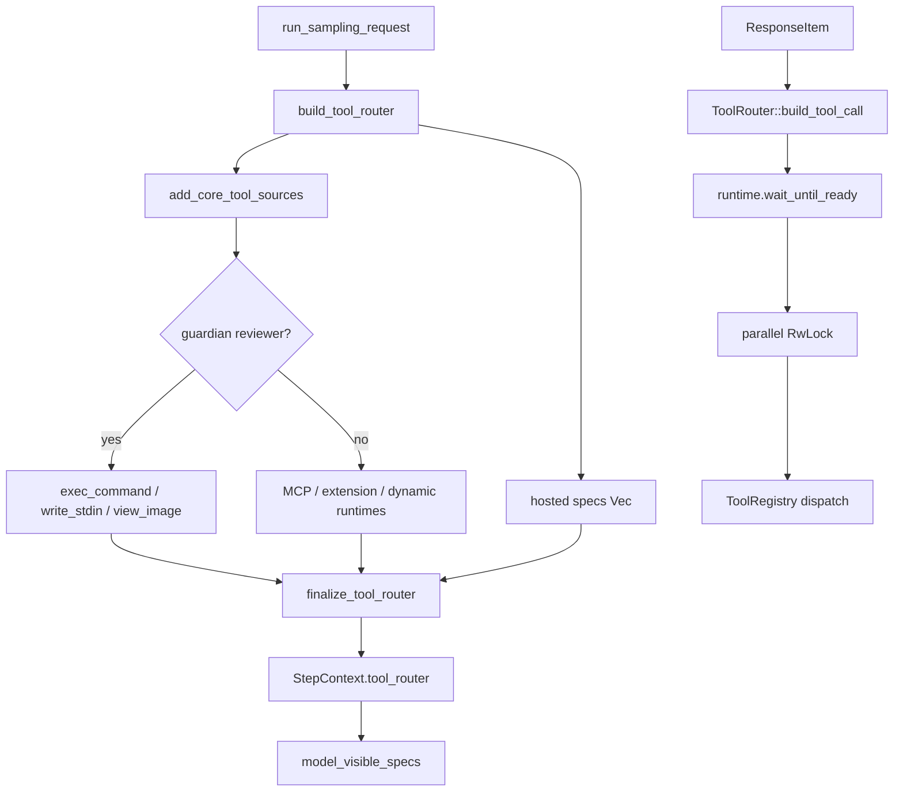

> 一次工具调用先在 sampling 前完成 router finalize，并把最终 router 固定到 `StepContext`；模型 output 再被归一为 `ToolCall`，执行器等待 runtime ready、通过当前 `ToolCallRuntime` 的 parallel gate，最后进入 registry dispatch。ground truth 仍是 `spec_plan.rs` 的 `add_core_tool_sources` → `finalize_tool_router`。[E: codex-rs/core/src/tools/spec_plan.rs:120][E: codex-rs/core/src/tools/spec_plan.rs:169][E: codex-rs/core/src/session/step_context.rs:44][E: codex-rs/core/src/tools/router.rs:154][E: codex-rs/core/src/tools/parallel.rs:92][E: codex-rs/core/src/tools/registry.rs:481]

```mermaid
flowchart TD
    TURN["run_sampling_request"] --> BUILD["build_tool_router"]
    BUILD --> CORE["add_core_tool_sources"]
    CORE --> REVIEW{"guardian reviewer?"}
    REVIEW -->|yes| GUARD["exec_command / write_stdin / view_image"]
    REVIEW -->|no| EXTRA["MCP / extension / dynamic runtimes"]
    BUILD --> HOSTED["hosted specs Vec"]
    EXTRA --> FINAL["finalize_tool_router"]
    HOSTED --> FINAL
    GUARD --> FINAL
    FINAL --> STEP["StepContext.tool_router"]
    STEP --> PROMPT["model_visible_specs"]
    MODEL["ResponseItem"] --> CALL["ToolRouter::build_tool_call"]
    CALL --> READY["runtime.wait_until_ready"]
    READY --> GATE["parallel RwLock"]
    GATE --> DISPATCH["ToolRegistry dispatch"]
```

## 端到端步骤

1. `build_tool_router` 创建 registry，先注册 core sources。非 Guardian reviewer turn 再追加 MCP、extension、dynamic runtimes；hosted specs 作为独立 `Vec<ToolSpec>` 收集，并与 registry 分开传给 `finalize_tool_router`。[E: codex-rs/core/src/tools/spec_plan.rs:144][E: codex-rs/core/src/tools/spec_plan.rs:145][E: codex-rs/core/src/tools/spec_plan.rs:151][E: codex-rs/core/src/tools/spec_plan.rs:160][E: codex-rs/core/src/tools/spec_plan.rs:165][E: codex-rs/core/src/tools/spec_plan.rs:169]
2. Guardian reviewer turn 在 `add_core_tool_sources` 提前返回：仅当 permission profile 是 `Managed` 且存在 environment 时，注册 `exec_command`、`write_stdin`，以及 feature 打开时的 `view_image`。`build_tool_router` 同时把 hosted specs 置空，因此 reviewer 看不到 MCP/extension/dynamic/hosted 工具。[E: codex-rs/core/src/tools/spec_plan.rs:147][E: codex-rs/core/src/tools/spec_plan.rs:896][E: codex-rs/core/src/tools/spec_plan.rs:907][E: codex-rs/core/src/tools/spec_plan.rs:916]
3. 普通 turn 的 `add_shell_tools` 按 `shell_type_for_model_and_features` 分流。`Feature::UnifiedExec` 现为 Stable 且 `default_enabled: true`（含 Windows）；UnifiedExec 分支注册 `ExecCommandHandler` + `WriteStdinHandler`，并在单一 local environment 下 hidden 注册 legacy `ShellCommandHandler`。[E: codex-rs/features/src/lib.rs:838][E: codex-rs/features/src/lib.rs:841][E: codex-rs/core/src/tools/spec_plan.rs:961][E: codex-rs/core/src/tools/spec_plan.rs:979][E: codex-rs/core/src/tools/spec_plan.rs:992]
4. `finalize_tool_router` 应用 exposure override，移除要被 code mode 替代的 plain executors；只有 deferred searchable runtime 存在时才加入 `tool_search`，然后注册 code-mode executors 并构造 model-visible specs。[E: codex-rs/core/src/tools/spec_plan.rs:317][E: codex-rs/core/src/tools/spec_plan.rs:323][E: codex-rs/core/src/tools/spec_plan.rs:339][E: codex-rs/core/src/tools/spec_plan.rs:372][E: codex-rs/core/src/tools/spec_plan.rs:375]
5. finalized router 作为该 sampling request 的精确工具计划存入请求级 `StepContext`；`ToolCallRuntime` 没有第二个 router 字段。[E: codex-rs/core/src/session/step_context.rs:18][E: codex-rs/core/src/session/step_context.rs:44][E: codex-rs/core/src/tools/parallel.rs:41]
6. prompt 只收到 `model_visible_specs`；registry 可同时保留 deferred、hidden 或 dispatch-only runtime。[E: codex-rs/core/src/tools/router.rs:109][E: codex-rs/core/src/session/turn.rs:1302]
7. `ToolRouter::build_tool_call` 把 Function、client ToolSearch、Custom 三类 item 分别归一成 `ToolPayload::Function`、`ToolSearch`、`Custom`；server-side tool-search 不走本地 dispatch。[E: codex-rs/core/src/tools/router.rs:154][E: codex-rs/core/src/tools/router.rs:156][E: codex-rs/core/src/tools/router.rs:172][E: codex-rs/core/src/tools/router.rs:191][E: codex-rs/core/src/tools/router.rs:192]
8. function call 的 encrypted arguments 会随 `ToolCall` 保留；V2 spawn/send/followup 是 router 明确识别的 direct-plaintext collaboration calls。[E: codex-rs/core/src/tools/router.rs:36][E: codex-rs/core/src/tools/router.rs:40][E: codex-rs/core/src/tools/router.rs:51]
9. output item 完成后，stream handler 记录 response item，构造 tool future，并标记需要 follow-up sampling。[E: codex-rs/core/src/stream_events_utils.rs:296][E: codex-rs/core/src/stream_events_utils.rs:315][E: codex-rs/core/src/stream_events_utils.rs:319][E: codex-rs/core/src/stream_events_utils.rs:325]
10. `ToolCallRuntime` 从 `step_context.tool_router` 取 runtime 与执行策略；它在拿 parallel lock 之前先等待 runtime readiness。[E: codex-rs/core/src/tools/parallel.rs:112][E: codex-rs/core/src/tools/parallel.rs:147][E: codex-rs/core/src/tools/parallel.rs:150]
11. parallel-safe runtime 取共享 read lock，其余 runtime 取独占 write lock；随后调用同一个 step router 的 terminal-outcome dispatch。[E: codex-rs/core/src/tools/parallel.rs:153][E: codex-rs/core/src/tools/parallel.rs:164][E: codex-rs/core/src/tools/registry.rs:481]
12. registry dispatch 统一处理 unsupported tool、PreToolUse hook/input rewrite、runtime telemetry、PostToolUse hook/additional context 与 lifecycle completion。[E: codex-rs/core/src/tools/registry.rs:519][E: codex-rs/core/src/tools/registry.rs:569][E: codex-rs/core/src/tools/registry.rs:615][E: codex-rs/core/src/tools/registry.rs:648]

## 关键边界

- direct visibility 与 dispatchability 不是同一集合；registry exposure 决定模型能否直接看到工具。[E: codex-rs/core/src/tools/router.rs:109][E: codex-rs/core/src/tools/spec_plan.rs:323]
- readiness 发生在 parallel gate 前，因此等待外部 runtime 启动不会占用当前 `ToolCallRuntime` 的 read/write lock。[E: codex-rs/core/src/tools/parallel.rs:147][E: codex-rs/core/src/tools/parallel.rs:153]
- Guardian reviewer 工具面是 registry-first 的特例裁剪，不是第二条 planner；它仍然走同一套 `finalize_tool_router` 与 dispatch。[E: codex-rs/core/src/tools/spec_plan.rs:147][E: codex-rs/core/src/tools/spec_plan.rs:896][E: codex-rs/core/src/tools/spec_plan.rs:169]
- UnifiedExec 默认全平台开启，因此 Windows 上模型默认看到 `exec_command`/`write_stdin`，而不是 legacy `shell_command`。[E: codex-rs/features/src/lib.rs:838][E: codex-rs/core/src/tools/spec_plan.rs:979]

## Sources

- `codex-rs/core/src/session/step_context.rs`
- `codex-rs/core/src/session/turn.rs`
- `codex-rs/core/src/stream_events_utils.rs`
- `codex-rs/core/src/tools/spec_plan.rs`
- `codex-rs/core/src/tools/router.rs`
- `codex-rs/core/src/tools/parallel.rs`
- `codex-rs/core/src/tools/registry.rs`
- `codex-rs/features/src/lib.rs`

## 相关

- [一次 turn 端到端](turn-end-to-end.md)
- [trace: apply_patch](trace-apply-patch.md)
- [trace: subagent](trace-subagent.md)
- [工具系统机制](../subsystems/core/tool-system.md)
