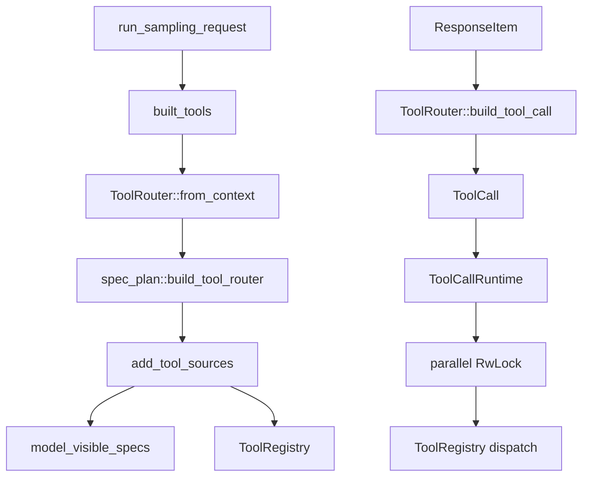

> 当前工具系统的 ground truth 是 `codex-rs/core/src/tools/spec_plan.rs`：`build_tool_router` 生成 model-visible specs 和 runtime registry，`ToolRouter::build_tool_call` 把 model output item 归一成 `ToolCall`，`ToolCallRuntime` 再按 parallel gate 调度 registry dispatch。[E: codex-rs/core/src/tools/spec_plan.rs:156][E: codex-rs/core/src/tools/router.rs:112][E: codex-rs/core/src/tools/parallel.rs:133][E: codex-rs/core/src/tools/parallel.rs:144][E: codex-rs/core/src/tools/registry.rs:399]

## 能回答的问题

- 当前工具 spec 与 handler 从哪里装配？
- `ToolRouter` 保存哪些 runtime 数据？
- Function、ToolSearch、Custom output item 如何变成 `ToolCall`？
- parallel tool call 的 read/write gate 在哪里生效？
- 为什么当前工具装配必须从 core `spec_plan.rs` 读起？

```mermaid
flowchart TD
    TURN["run_sampling_request"] --> BUILT["built_tools"]
    BUILT --> ROUTERCTX["ToolRouter::from_context"]
    ROUTERCTX --> SPECPLAN["spec_plan::build_tool_router"]
    SPECPLAN --> SOURCES["add_tool_sources"]
    SOURCES --> SPECS["model_visible_specs"]
    SOURCES --> REGISTRY["ToolRegistry"]
    MODEL["ResponseItem"] --> BUILDCALL["ToolRouter::build_tool_call"]
    BUILDCALL --> CALL["ToolCall"]
    CALL --> RUNTIME["ToolCallRuntime"]
    RUNTIME --> GATE["parallel RwLock"]
    GATE --> DISPATCH["ToolRegistry dispatch"]
```

## 端到端步骤

1. `run_sampling_request` 在每次 sampling 前调用 `built_tools` 得到 router，再用 router 创建 `ToolCallRuntime` 并构造 prompt。[E: codex-rs/core/src/session/turn.rs:1123][E: codex-rs/core/src/session/turn.rs:1134][E: codex-rs/core/src/session/turn.rs:1138][E: codex-rs/core/src/session/turn.rs:1162]
2. `ToolRouter::from_context` 直接调用 `spec_plan::build_tool_router`；`ToolRouter` 自身只保存 `ToolRegistry` 和 `model_visible_specs`。[E: codex-rs/core/src/tools/router.rs:36][E: codex-rs/core/src/tools/router.rs:37][E: codex-rs/core/src/tools/router.rs:59][E: codex-rs/core/src/tools/router.rs:65][E: codex-rs/core/src/tools/router.rs:68]
3. `build_tool_router` 调 `build_tool_specs_and_registry`，再用 `ToolRouter::from_parts(registry, model_visible_specs)` 建 router。[E: codex-rs/core/src/tools/spec_plan.rs:156][E: codex-rs/core/src/tools/spec_plan.rs:161][E: codex-rs/core/src/tools/spec_plan.rs:163]
4. `build_tool_specs_and_registry` 把 MCP tools、deferred MCP tools、tool-suggest candidates、extension executors 和 dynamic tools 放入 `CoreToolPlanContext`，再调用 `add_tool_sources`、model-only overrides、tool search executor 和 code-mode executor 装配。[E: codex-rs/core/src/tools/spec_plan.rs:173][E: codex-rs/core/src/tools/spec_plan.rs:181][E: codex-rs/core/src/tools/spec_plan.rs:191][E: codex-rs/core/src/tools/spec_plan.rs:192][E: codex-rs/core/src/tools/spec_plan.rs:193][E: codex-rs/core/src/tools/spec_plan.rs:194][E: codex-rs/core/src/tools/spec_plan.rs:195]
5. `add_tool_sources` 依次加入 shell、MCP resource、core utility、collaboration、MCP runtime、extension、dynamic 和 hosted model tools。[E: codex-rs/core/src/tools/spec_plan.rs:579][E: codex-rs/core/src/tools/spec_plan.rs:607][E: codex-rs/core/src/tools/spec_plan.rs:608][E: codex-rs/core/src/tools/spec_plan.rs:609][E: codex-rs/core/src/tools/spec_plan.rs:610][E: codex-rs/core/src/tools/spec_plan.rs:618][E: codex-rs/core/src/tools/spec_plan.rs:614][E: codex-rs/core/src/tools/spec_plan.rs:615][E: codex-rs/core/src/tools/spec_plan.rs:616]
6. shell tools 只有在 `tool_environment_mode().has_environment()` 时加入；UnifiedExec 注册 `ExecCommandHandler`、`WriteStdinHandler`，并保留 dispatch-only `ShellCommandHandler`。[E: codex-rs/core/src/tools/spec_plan.rs:626][E: codex-rs/core/src/tools/spec_plan.rs:640][E: codex-rs/core/src/tools/spec_plan.rs:653][E: codex-rs/core/src/tools/spec_plan.rs:655][E: codex-rs/core/src/tools/spec_plan.rs:664][E: codex-rs/core/src/tools/spec_plan.rs:668]
7. core utility tools 总是加入 `PlanHandler`；`request_user_input`、request permissions、token budget、sleep、tool install suggestion 和 apply_patch 各自有 feature/config/environment/model gate。[E: codex-rs/core/src/tools/spec_plan.rs:707][E: codex-rs/core/src/tools/spec_plan.rs:713][E: codex-rs/core/src/tools/spec_plan.rs:722][E: codex-rs/core/src/tools/spec_plan.rs:726][E: codex-rs/core/src/tools/spec_plan.rs:731][E: codex-rs/core/src/tools/spec_plan.rs:737][E: codex-rs/core/src/tools/spec_plan.rs:739][E: codex-rs/core/src/tools/spec_plan.rs:743][E: codex-rs/core/src/tools/spec_plan.rs:759]
8. collaboration tools 在 MultiAgent V2 分支注册 `spawn_agent`、`send_message`、`followup_task`、`wait_agent`、`interrupt_agent`、`list_agents` handlers；legacy 分支仍注册 V1 spawn/send/resume/wait/close handlers。[E: codex-rs/core/src/tools/spec_plan.rs:788][E: codex-rs/core/src/tools/spec_plan.rs:789][E: codex-rs/core/src/tools/spec_plan.rs:804][E: codex-rs/core/src/tools/spec_plan.rs:821][E: codex-rs/core/src/tools/spec_plan.rs:825][E: codex-rs/core/src/tools/spec_plan.rs:830][E: codex-rs/core/src/tools/spec_plan.rs:836][E: codex-rs/core/src/tools/spec_plan.rs:840][E: codex-rs/core/src/tools/spec_plan.rs:851][E: codex-rs/core/src/tools/spec_plan.rs:863][E: codex-rs/core/src/tools/spec_plan.rs:864][E: codex-rs/core/src/tools/spec_plan.rs:866][E: codex-rs/core/src/tools/spec_plan.rs:867]
9. MCP runtime tools 由 `McpHandler::new(tool.clone())` 注册，deferred MCP tools 使用 `ToolExposure::Deferred`；dynamic tools 从 `DynamicToolSpec` 逐项转成 handler。[E: codex-rs/core/src/tools/spec_plan.rs:885][E: codex-rs/core/src/tools/spec_plan.rs:888][E: codex-rs/core/src/tools/spec_plan.rs:898][E: codex-rs/core/src/tools/spec_plan.rs:901][E: codex-rs/core/src/tools/spec_plan.rs:880][E: codex-rs/core/src/tools/spec_plan.rs:883][E: codex-rs/core/src/tools/spec_plan.rs:884]
10. `ToolRouter::build_tool_call` 把 `ResponseItem::FunctionCall` 变成 namespaced `ToolName` 和 `ToolPayload::Function`；client `ToolSearchCall` 变成 plain `tool_search`；`CustomToolCall` 变成 plain custom tool payload。[E: codex-rs/core/src/tools/router.rs:112][E: codex-rs/core/src/tools/router.rs:114][E: codex-rs/core/src/tools/router.rs:121][E: codex-rs/core/src/tools/router.rs:125][E: codex-rs/core/src/tools/router.rs:128][E: codex-rs/core/src/tools/router.rs:147][E: codex-rs/core/src/tools/router.rs:154][E: codex-rs/core/src/tools/router.rs:156]
11. `handle_output_item_done` 在识别到 tool call 后记录 completed response item，创建 `ToolCallRuntime::handle_tool_call` future，并要求 follow-up sampling。[E: codex-rs/core/src/stream_events_utils.rs:327][E: codex-rs/core/src/stream_events_utils.rs:346][E: codex-rs/core/src/stream_events_utils.rs:350][E: codex-rs/core/src/stream_events_utils.rs:356]
12. `ToolCallRuntime` 保存 router、session、turn context、diff tracker 和一个 `RwLock`；dispatch 时根据 `router.tool_supports_parallel` 选择 read guard 或 write guard。[E: codex-rs/core/src/tools/parallel.rs:42][E: codex-rs/core/src/tools/parallel.rs:48][E: codex-rs/core/src/tools/parallel.rs:100][E: codex-rs/core/src/tools/parallel.rs:133][E: codex-rs/core/src/tools/parallel.rs:136]
13. `ToolRegistry::from_tools` 以 `tool.tool_name()` 建 HashMap；dispatch 时会增加 active turn 的 tool-call 计数，再继续 handler 执行路径。[E: codex-rs/core/src/tools/registry.rs:335][E: codex-rs/core/src/tools/registry.rs:338][E: codex-rs/core/src/tools/registry.rs:343][E: codex-rs/core/src/tools/registry.rs:399][E: codex-rs/core/src/tools/registry.rs:428][E: codex-rs/core/src/tools/registry.rs:431]

Direct tool call 还会创建 `ToolCallTimingGuard`：进入 parallel gate 前计 dispatch wait，拿到 read/write guard 后才标记 handler execution start，drop 时发 `codex.tool_call` timing event。code-mode 内嵌调用不再发第二组重叠 timing；在 gate 前被取消的调用会记录 `execution_started=false`。[E: codex-rs/core/src/tools/parallel.rs:27][E: codex-rs/core/src/tools/parallel.rs:108][E: codex-rs/core/src/tools/parallel.rs:134][E: codex-rs/core/src/tools/parallel.rs:258][E: codex-rs/core/src/tools/parallel.rs:280]

## 关键决策点

- 当前工具装配应从 core `spec_plan.rs` 读起；这是由 `build_tool_router` 的源码入口决定的。[E: codex-rs/core/src/tools/spec_plan.rs:156][I]
- MCP direct tools 当前也是 `FunctionCall -> ToolPayload::Function`，并不在 router 阶段改写成专门的 MCP payload；具体 MCP 身份由 registered `McpHandler` 的 canonical `ToolName` 决定。[E: codex-rs/core/src/tools/router.rs:114][E: codex-rs/core/src/tools/router.rs:125][E: codex-rs/core/src/tools/handlers/mcp.rs:67][I]
- parallel gate 在 `ToolCallRuntime` 层统一处理，具体 handler 只暴露 `supports_parallel_tool_calls`，避免每个 handler 自己实现并发互斥。[E: codex-rs/core/src/tools/router.rs:99][E: codex-rs/core/src/tools/parallel.rs:133][I]

## 深挖入口

- `subsys.core.tool-system` 展开 `spec_plan.rs` 每类工具的完整门控。
- `spine.shell-exec-flow`、`spine.trace-apply-patch`、`spine.trace-mcp-call`、`spine.trace-subagent` 分别走读重点工具族。

## Sources

- codex-rs/core/src/session/turn.rs
- codex-rs/core/src/stream_events_utils.rs
- codex-rs/core/src/tools/spec_plan.rs
- codex-rs/core/src/tools/router.rs
- codex-rs/core/src/tools/parallel.rs
- codex-rs/core/src/tools/registry.rs
- codex-rs/core/src/tools/handlers/mcp.rs

## 相关

- [一次 turn 端到端](turn-end-to-end.md)
- [shell exec flow](shell-exec-flow.md)
- [trace: apply_patch](trace-apply-patch.md)
- [trace: MCP call](trace-mcp-call.md)
- [trace: subagent](trace-subagent.md)
- [工具系统机制](../subsystems/core/tool-system.md)
