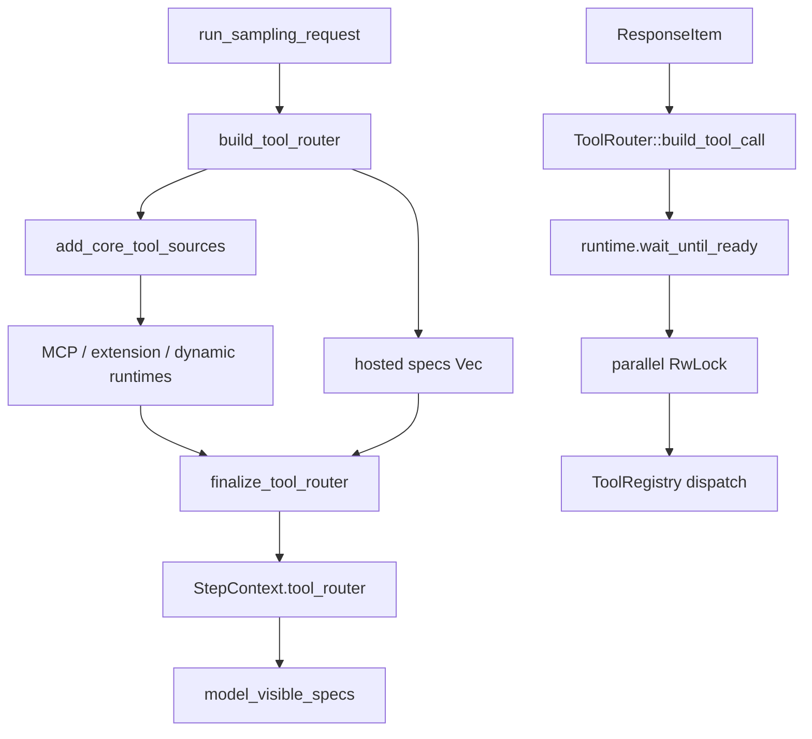

> 一次工具调用先在 sampling 前完成 router finalize，并把最终 router 固定到 `StepContext`；模型 output 再被归一为 `ToolCall`，执行器等待 runtime ready、通过当前 `ToolCallRuntime` 的 parallel gate，最后进入 registry dispatch。[E: codex-rs/core/src/tools/spec_plan.rs:114][E: codex-rs/core/src/tools/spec_plan.rs:161][E: codex-rs/core/src/session/step_context.rs:22][E: codex-rs/core/src/tools/router.rs:153][E: codex-rs/core/src/tools/parallel.rs:46][E: codex-rs/core/src/tools/parallel.rs:59][E: codex-rs/core/src/tools/parallel.rs:147][E: codex-rs/core/src/tools/parallel.rs:164]

```mermaid
flowchart TD
    TURN["run_sampling_request"] --> BUILD["build_tool_router"]
    BUILD --> CORE["add_core_tool_sources"]
    CORE --> EXTRA["MCP / extension / dynamic runtimes"]
    BUILD --> HOSTED["hosted specs Vec"]
    EXTRA --> FINAL["finalize_tool_router"]
    HOSTED --> FINAL
    FINAL --> STEP["StepContext.tool_router"]
    STEP --> PROMPT["model_visible_specs"]
    MODEL["ResponseItem"] --> CALL["ToolRouter::build_tool_call"]
    CALL --> READY["runtime.wait_until_ready"]
    READY --> GATE["parallel RwLock"]
    GATE --> DISPATCH["ToolRegistry dispatch"]
```

## 端到端步骤

1. `build_tool_router` 创建 registry，先注册 core、MCP、extension、dynamic runtimes；hosted specs 则作为独立 `Vec<ToolSpec>` 收集，并与 registry 分开传给 `finalize_tool_router`。[E: codex-rs/core/src/tools/spec_plan.rs:114][E: codex-rs/core/src/tools/spec_plan.rs:138][E: codex-rs/core/src/tools/spec_plan.rs:139][E: codex-rs/core/src/tools/spec_plan.rs:145][E: codex-rs/core/src/tools/spec_plan.rs:152][E: codex-rs/core/src/tools/spec_plan.rs:157][E: codex-rs/core/src/tools/spec_plan.rs:158][E: codex-rs/core/src/tools/spec_plan.rs:161][E: codex-rs/core/src/tools/spec_plan.rs:164]
2. `finalize_tool_router` 应用 exposure override，移除要被 code mode 替代的 plain executors；只有 deferred searchable runtime 存在时才加入 `tool_search`，然后注册 code-mode executors 并构造 model-visible specs。[E: codex-rs/core/src/tools/spec_plan.rs:236][E: codex-rs/core/src/tools/spec_plan.rs:242][E: codex-rs/core/src/tools/spec_plan.rs:243][E: codex-rs/core/src/tools/spec_plan.rs:251][E: codex-rs/core/src/tools/spec_plan.rs:263][E: codex-rs/core/src/tools/spec_plan.rs:265]
3. finalized router 作为该 sampling request 的精确工具计划存入请求级 `StepContext`；`ToolCallRuntime` 没有第二个 router 字段。[E: codex-rs/core/src/session/step_context.rs:12][E: codex-rs/core/src/session/step_context.rs:22][E: codex-rs/core/src/tools/parallel.rs:41][E: codex-rs/core/src/tools/parallel.rs:46]
4. prompt 只收到 `model_visible_specs`；registry 可同时保留 deferred、hidden 或 dispatch-only runtime。[E: codex-rs/core/src/tools/router.rs:108][E: codex-rs/core/src/tools/registry.rs:246][E: codex-rs/core/src/tools/spec_plan.rs:294][E: codex-rs/core/src/tools/spec_plan.rs:316]
5. `ToolRouter::build_tool_call` 把 Function、client ToolSearch、Custom 三类 item 分别归一成 `ToolPayload::Function`、`ToolSearch`、`Custom`；server-side tool-search 不走本地 dispatch。[E: codex-rs/core/src/tools/router.rs:153][E: codex-rs/core/src/tools/router.rs:155][E: codex-rs/core/src/tools/router.rs:171][E: codex-rs/core/src/tools/router.rs:183][E: codex-rs/core/src/tools/router.rs:190][E: codex-rs/core/src/tools/router.rs:197]
6. function call 的 encrypted arguments 会随 `ToolCall` 保留；V2 spawn/send/followup 是 router 明确识别的 direct-plaintext collaboration calls。[E: codex-rs/core/src/tools/router.rs:31][E: codex-rs/core/src/tools/router.rs:36][E: codex-rs/core/src/tools/router.rs:39][E: codex-rs/core/src/tools/router.rs:51]
7. output item 完成后，stream handler 记录 response item，构造 tool future，并标记需要 follow-up sampling。[E: codex-rs/core/src/stream_events_utils.rs:296][E: codex-rs/core/src/stream_events_utils.rs:315][E: codex-rs/core/src/stream_events_utils.rs:319][E: codex-rs/core/src/stream_events_utils.rs:325]
8. `ToolCallRuntime` 从 `step_context.tool_router` 取 runtime 与执行策略；它在拿 parallel lock 之前先等待 runtime readiness。[E: codex-rs/core/src/tools/parallel.rs:112][E: codex-rs/core/src/tools/parallel.rs:115][E: codex-rs/core/src/tools/parallel.rs:147][E: codex-rs/core/src/tools/parallel.rs:150]
9. parallel-safe runtime 取共享 read lock，其余 runtime 取独占 write lock；随后调用同一个 step router 的 terminal-outcome dispatch。[E: codex-rs/core/src/tools/parallel.rs:153][E: codex-rs/core/src/tools/parallel.rs:156][E: codex-rs/core/src/tools/parallel.rs:164][E: codex-rs/core/src/tools/parallel.rs:170]
10. registry dispatch 统一处理 unsupported tool、PreToolUse hook/input rewrite、runtime telemetry、PostToolUse hook/additional context 与 lifecycle completion。[E: codex-rs/core/src/tools/registry.rs:437][E: codex-rs/core/src/tools/registry.rs:465][E: codex-rs/core/src/tools/registry.rs:477][E: codex-rs/core/src/tools/registry.rs:532][E: codex-rs/core/src/tools/registry.rs:593][E: codex-rs/core/src/tools/registry.rs:648]

## 关键边界

- direct visibility 与 dispatchability 不是同一集合；registry exposure 决定模型能否直接看到工具。[E: codex-rs/core/src/tools/registry.rs:246][E: codex-rs/core/src/tools/spec_plan.rs:294]
- readiness 发生在 parallel gate 前，因此等待外部 runtime 启动不会占用当前 `ToolCallRuntime` 的 read/write lock。[E: codex-rs/core/src/tools/parallel.rs:46][E: codex-rs/core/src/tools/parallel.rs:59][E: codex-rs/core/src/tools/parallel.rs:147][E: codex-rs/core/src/tools/parallel.rs:153]
- parallel 能力由 runtime contract 声明；默认值是 false，hidden wrapper 也强制为 false。[E: codex-rs/tools/src/tool_executor.rs:73][E: codex-rs/core/src/tools/registry.rs:423]

## Sources

- `codex-rs/core/src/session/step_context.rs`
- `codex-rs/core/src/stream_events_utils.rs`
- `codex-rs/core/src/tools/spec_plan.rs`
- `codex-rs/core/src/tools/router.rs`
- `codex-rs/core/src/tools/parallel.rs`
- `codex-rs/core/src/tools/registry.rs`

## 相关

- [一次 turn 端到端](turn-end-to-end.md)
- [trace: apply_patch](trace-apply-patch.md)
- [trace: subagent](trace-subagent.md)
- [工具系统机制](../subsystems/core/tool-system.md)
