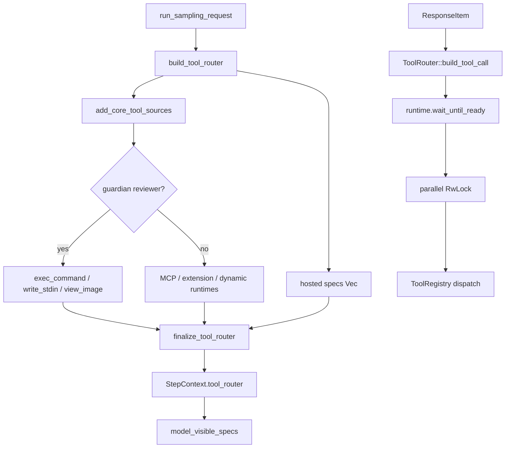

> 一次工具调用先在 sampling 前完成 router finalize，并把最终 router 固定到 `StepContext`；模型 output 再被归一为 `ToolCall`，执行器等待 runtime ready、通过当前 `ToolCallRuntime` 的 parallel gate，最后进入 registry dispatch。ground truth 仍是 `spec_plan.rs` 的 `add_core_tool_sources` → `finalize_tool_router`。[E: codex-rs/core/src/tools/spec_plan.rs:126][E: codex-rs/core/src/tools/spec_plan.rs:188][E: codex-rs/core/src/session/step_context.rs:34][E: codex-rs/core/src/tools/router.rs:244][E: codex-rs/core/src/tools/parallel.rs:112][E: codex-rs/core/src/tools/registry.rs:495]

```mermaid
flowchart TD
    TURN["run_sampling_request"] --> BUILD["build_tool_router"]
    BUILD --> CORE["add_core_tool_sources"]
    CORE --> REVIEW{"guardian reviewer?"}
    REVIEW -->|yes| GUARD["exec_command / write_stdin / view_image"]
    REVIEW -->|no| EXTRA["MCP / extension / dynamic runtimes"]
    BUILD --> HOSTED["hosted specs Vec"]
    EXTRA --> FINAL["finalize_tool_router"]
    HOSTED --> FINAL
    GUARD --> FINAL
    FINAL --> STEP["StepContext.tool_router"]
    STEP --> PROMPT["model_visible_specs"]
    MODEL["ResponseItem"] --> CALL["ToolRouter::build_tool_call"]
    CALL --> READY["runtime.wait_until_ready"]
    READY --> GATE["parallel RwLock"]
    GATE --> DISPATCH["ToolRegistry dispatch"]
```

## 端到端步骤

1. `build_tool_router` 创建 registry，先注册 core sources。非 Guardian reviewer turn 再追加 MCP、extension、dynamic runtimes；hosted specs 作为独立 `Vec<ToolSpec>` 收集，并与 registry 分开传给 `finalize_tool_router`。[E: codex-rs/core/src/tools/spec_plan.rs:154][E: codex-rs/core/src/tools/spec_plan.rs:154][E: codex-rs/core/src/tools/spec_plan.rs:159][E: codex-rs/core/src/tools/spec_plan.rs:174][E: codex-rs/core/src/tools/spec_plan.rs:180][E: codex-rs/core/src/tools/spec_plan.rs:188]
2. Guardian reviewer turn 在 `add_core_tool_sources` 提前返回：仅当 permission profile 是 `Managed` 且存在 environment 时，才可能注册 `exec_command`/`write_stdin`（还要求 `Feature::ShellTool` + `Feature::UnifiedExec` 且 shell 未 Disabled），以及 feature 打开时的 `view_image`。`build_tool_router` 同时把 hosted specs 置空，并跳过普通 MCP/extension/dynamic，因此不会挂上 `history.*` extension tools。[E: codex-rs/core/src/tools/spec_plan.rs:156][E: codex-rs/core/src/tools/spec_plan.rs:174][E: codex-rs/core/src/tools/spec_plan.rs:978][E: codex-rs/core/src/tools/spec_plan.rs:994][E: codex-rs/core/src/tools/spec_plan.rs:1016][E: codex-rs/core/src/tools/spec_plan.rs:1029][E: codex-rs/core/src/tools/handlers/extension_tools.rs:91]
3. 普通 turn 的 `add_shell_tools` **不再注册 `shell_command`**。有 environment、`Feature::ShellTool` 打开且模型 `shell_type` 非 Disabled 时：`Feature::UnifiedExec` 开则 `registry.add(ExecCommandHandler::new)` + `WriteStdinHandler`；关则 `ExecCommandHandler::one_shot`，保留命令执行但不暴露 resumable process / `write_stdin`。`shell_command` 只作为 reserved name，阻止外部 runtime 占用。[E: codex-rs/core/src/tools/spec_plan.rs:1079][E: codex-rs/core/src/tools/spec_plan.rs:1104][E: codex-rs/core/src/tools/spec_plan.rs:1111][E: codex-rs/core/src/tools/registry.rs:364][E: codex-rs/features/src/lib.rs:947]
4. `add_core_utility_tools` 把 `update_plan` 做成 opt-in：`if turn_context.config.update_plan_enabled { registry.add(PlanHandler) }`。阻塞版 `request_user_input` 要 `experimental_request_user_input_enabled`。questions-shaped `request_user_input_async`（`RequestUserInputAsyncHandler`）在 root agent 且模型 `experimental_supported_tools` 含 `"request_user_input_async"` **或旧名** `"send_user_message_async"` 时以 `DirectModelOnly` 注册。message-shaped `send_message_to_user_async`（`SendMessageToUserAsyncHandler`）要同一 root 约束，且 `Feature::SendMessageToUserAsync` **或** catalog 含 `"send_message_to_user_async"`。clock 要 `Feature::CurrentTimeReminder` 或模型含 `"clock"`。[E: codex-rs/core/src/tools/spec_plan.rs:1142][E: codex-rs/core/src/tools/spec_plan.rs:1158][E: codex-rs/core/src/tools/spec_plan.rs:1167][E: codex-rs/core/src/tools/spec_plan.rs:1176][E: codex-rs/core/src/tools/spec_plan.rs:1192][E: codex-rs/core/src/tools/spec_plan.rs:1193][E: codex-rs/core/src/tools/spec_plan.rs:1198][E: codex-rs/core/src/tools/spec_plan.rs:1218]
5. `finalize_tool_router` 应用 exposure override，移除要被 code mode 替代的 plain executors；只有 deferred searchable runtime 存在时才加入 `tool_search`，然后注册 code-mode executors 并构造 model-visible specs。[E: codex-rs/core/src/tools/spec_plan.rs:359][E: codex-rs/core/src/tools/spec_plan.rs:362][E: codex-rs/core/src/tools/spec_plan.rs:362][E: codex-rs/core/src/tools/spec_plan.rs:406][E: codex-rs/core/src/tools/spec_plan.rs:410]
6. finalized router 作为该 sampling request 的精确工具计划存入请求级 `StepContext`；`ToolCallRuntime` 没有第二个 router 字段。[E: codex-rs/core/src/session/step_context.rs:18][E: codex-rs/core/src/session/step_context.rs:34][E: codex-rs/core/src/tools/parallel.rs:44]
7. prompt 只收到 `model_visible_specs`；registry 可同时保留 deferred、hidden 或 dispatch-only runtime。[E: codex-rs/core/src/tools/router.rs:137][E: codex-rs/core/src/session/turn.rs:1517]
8. `ToolRouter::build_tool_call` 把 Function、client ToolSearch、Custom 三类 item 分别归一成 `ToolPayload::Function`、`ToolSearch`、`Custom`；server-side tool-search 不走本地 dispatch。[E: codex-rs/core/src/tools/router.rs:244][E: codex-rs/core/src/tools/router.rs:246][E: codex-rs/core/src/tools/router.rs:262][E: codex-rs/core/src/tools/router.rs:281][E: codex-rs/core/src/tools/router.rs:282]
9. function call 的 encrypted arguments 会随 `ToolCall` 保留；V2 spawn/send/followup 是 router 明确识别的 direct-plaintext collaboration calls。[E: codex-rs/core/src/tools/router.rs:41][E: codex-rs/core/src/tools/router.rs:46][E: codex-rs/core/src/tools/router.rs:49]
10. output item 完成后，stream handler 记录 response item，构造 tool future，并标记需要 follow-up sampling。[E: codex-rs/core/src/stream_events_utils.rs:308][E: codex-rs/core/src/stream_events_utils.rs:317][E: codex-rs/core/src/stream_events_utils.rs:337][E: codex-rs/core/src/stream_events_utils.rs:343]
11. `ToolCallRuntime` 从 `step_context.tool_router` 取 runtime 与执行策略；它在拿 parallel lock 之前先等待 runtime readiness。[E: codex-rs/core/src/tools/parallel.rs:123][E: codex-rs/core/src/tools/parallel.rs:125][E: codex-rs/core/src/tools/parallel.rs:167][E: codex-rs/core/src/tools/parallel.rs:168][E: codex-rs/core/src/tools/parallel.rs:170][E: codex-rs/core/src/tools/parallel.rs:176]
12. parallel-safe runtime 取共享 read lock，其余 runtime 取独占 write lock；随后调用同一个 step router 的 terminal-outcome dispatch。[E: codex-rs/core/src/tools/parallel.rs:173][E: codex-rs/core/src/tools/parallel.rs:184][E: codex-rs/core/src/tools/registry.rs:495]
13. registry dispatch 统一处理 unsupported tool、PreToolUse hook/input rewrite、runtime telemetry、PostToolUse hook/additional context 与 lifecycle completion。[E: codex-rs/core/src/tools/registry.rs:516][E: codex-rs/core/src/tools/registry.rs:577]

## 关键边界

- direct visibility 与 dispatchability 不是同一集合；registry exposure 决定模型能否直接看到工具。[E: codex-rs/core/src/tools/router.rs:137][E: codex-rs/core/src/tools/spec_plan.rs:541]
- readiness 发生在 parallel gate 前，因此等待外部 runtime 启动不会占用当前 `ToolCallRuntime` 的 read/write lock。[E: codex-rs/core/src/tools/parallel.rs:168][E: codex-rs/core/src/tools/parallel.rs:170]
- Guardian reviewer 工具面是 registry-first 的特例裁剪，不是第二条 planner；它仍然走同一套 `finalize_tool_router` 与 dispatch，且不会挂上 `history.*` extension tools。[E: codex-rs/core/src/tools/spec_plan.rs:156][E: codex-rs/core/src/tools/spec_plan.rs:174][E: codex-rs/core/src/tools/spec_plan.rs:978][E: codex-rs/core/src/tools/spec_plan.rs:188]
- UnifiedExec 默认全平台开启（`default_enabled: true`），因此模型默认看到 `exec_command`/`write_stdin`。`shell_command` 不再是可注册 core handler；关闭 UnifiedExec 时也只走 `ExecCommandHandler::one_shot`。[E: codex-rs/features/src/lib.rs:947][E: codex-rs/core/src/tools/spec_plan.rs:1104][E: codex-rs/core/src/tools/spec_plan.rs:1111]
- `update_plan` 不是默认始终开启；它走 `update_plan_enabled` opt-in。[E: codex-rs/core/src/tools/spec_plan.rs:1142]
- 旧 catalog 名 `send_user_message_async` 现在把 `RequestUserInputAsyncHandler` 注册进 registry；message-shaped 工具的 live wire name 是 `send_message_to_user_async`，门控是 feature **或** 新 catalog 名。[E: codex-rs/core/src/tools/spec_plan.rs:1176][E: codex-rs/core/src/tools/spec_plan.rs:1193][E: codex-rs/core/src/tools/spec_plan.rs:1198]

## Sources

- `codex-rs/core/src/session/step_context.rs`
- `codex-rs/core/src/session/turn.rs`
- `codex-rs/core/src/stream_events_utils.rs`
- `codex-rs/core/src/tools/spec_plan.rs`
- `codex-rs/core/src/tools/router.rs`
- `codex-rs/core/src/tools/parallel.rs`
- `codex-rs/core/src/tools/registry.rs`
- `codex-rs/core/src/tools/handlers/extension_tools.rs`
- `codex-rs/features/src/lib.rs`

## 相关

- [一次 turn 端到端](turn-end-to-end.md)
- [trace: apply_patch](trace-apply-patch.md)
- [trace: subagent](trace-subagent.md)
- [工具系统机制](../subsystems/core/tool-system.md)
