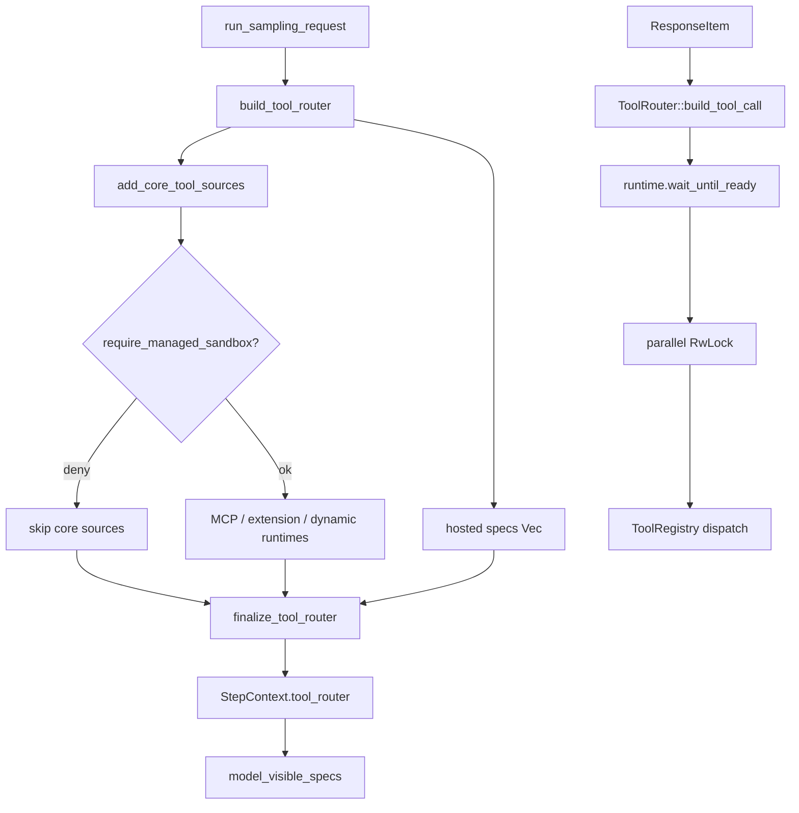

> 一次工具调用先在 sampling 前完成 router finalize，并把最终 router 固定到 `StepContext`；模型 output 再被归一为 `ToolCall`，执行器等待 runtime ready、通过当前 `ToolCallRuntime` 的 parallel gate，最后进入 registry dispatch。ground truth 仍是 `spec_plan.rs` 的 `add_core_tool_sources` → `finalize_tool_router`。[E: codex-rs/core/src/tools/spec_plan.rs:123][E: codex-rs/core/src/tools/spec_plan.rs:181][E: codex-rs/core/src/session/step_context.rs:41][E: codex-rs/core/src/tools/router.rs:248][E: codex-rs/core/src/tools/parallel.rs:125][E: codex-rs/core/src/tools/registry.rs:527]

```mermaid
flowchart TD
    TURN["run_sampling_request"] --> BUILD["build_tool_router"]
    BUILD --> CORE["add_core_tool_sources"]
    CORE --> REVIEW{"require_managed_sandbox?"}
    REVIEW -->|deny| GUARD["skip core sources"]
    REVIEW -->|ok| EXTRA["MCP / extension / dynamic runtimes"]
    BUILD --> HOSTED["hosted specs Vec"]
    EXTRA --> FINAL["finalize_tool_router"]
    HOSTED --> FINAL
    GUARD --> FINAL
    FINAL --> STEP["StepContext.tool_router"]
    STEP --> PROMPT["model_visible_specs"]
    MODEL["ResponseItem"] --> CALL["ToolRouter::build_tool_call"]
    CALL --> READY["runtime.wait_until_ready"]
    READY --> GATE["parallel RwLock"]
    GATE --> DISPATCH["ToolRegistry dispatch"]
```

## 端到端步骤

1. `build_tool_router` 创建 registry，先 `add_core_tool_sources`，再追加 MCP、`append_extension_tool_executors`、dynamic runtimes；hosted specs 作为独立 `Vec<ToolSpec>` 收集，并与 registry 分开传给 `finalize_tool_router`。[E: codex-rs/core/src/tools/spec_plan.rs:150][E: codex-rs/core/src/tools/spec_plan.rs:151][E: codex-rs/core/src/tools/spec_plan.rs:153][E: codex-rs/core/src/tools/spec_plan.rs:168][E: codex-rs/core/src/tools/spec_plan.rs:174][E: codex-rs/core/src/tools/spec_plan.rs:181]
2. `add_core_tool_sources` 在 `tool_policy.require_managed_sandbox` 且（turn permission profile 不是 `Managed`，**或**任一 selected environment 的 profile 不是 `Managed`）时提前返回。Guardian basic session 在 turn 层跳过 skill/plugin mention 并 `prepare_guardian_prompt`，不是 planner 里第二条独立工具面。[E: codex-rs/core/src/tools/spec_plan.rs:1018][E: codex-rs/core/src/tools/spec_plan.rs:1022][E: codex-rs/core/src/session/turn.rs:1022][E: codex-rs/core/src/session/turn.rs:1649]
3. 普通 turn 的 `add_shell_tools` **不再注册 `shell_command`**。有 environment、`Feature::ShellTool` 打开且模型 `shell_type` 非 Disabled 时：`Feature::UnifiedExec` 开则 `registry.add(ExecCommandHandler::new)` + `WriteStdinHandler`；关则 `ExecCommandHandler::one_shot`，保留命令执行但不暴露 resumable process / `write_stdin`。`shell_command` 只作为 reserved name，阻止外部 runtime 占用。[E: codex-rs/core/src/tools/spec_plan.rs:1079][E: codex-rs/core/src/tools/spec_plan.rs:1108][E: codex-rs/core/src/tools/spec_plan.rs:1115][E: codex-rs/core/src/tools/registry.rs:389][E: codex-rs/features/src/lib.rs:987]
4. `add_core_utility_tools` 把 `update_plan` 做成 opt-in：`if turn_context.config.update_plan_enabled { registry.add(PlanHandler) }`。阻塞版 `request_user_input` 要 `experimental_request_user_input_enabled`。questions-shaped `request_user_input_async`（`RequestUserInputAsyncHandler`）在 root agent 且模型 `experimental_supported_tools` 含 `"request_user_input_async"` **或旧名** `"send_user_message_async"` 时以 `DirectModelOnly` 注册。message-shaped `send_message_to_user_async`（`SendMessageToUserAsyncHandler`）要同一 root 约束，且 `Feature::SendMessageToUserAsync` **或** catalog 含 `"send_message_to_user_async"`。clock 要 `Feature::CurrentTimeReminder` 或模型含 `"clock"`。[E: codex-rs/core/src/tools/spec_plan.rs:1153][E: codex-rs/core/src/tools/spec_plan.rs:1169][E: codex-rs/core/src/tools/spec_plan.rs:1178][E: codex-rs/core/src/tools/spec_plan.rs:1187][E: codex-rs/core/src/tools/spec_plan.rs:1205][E: codex-rs/core/src/tools/spec_plan.rs:1206][E: codex-rs/core/src/tools/spec_plan.rs:1211][E: codex-rs/core/src/tools/spec_plan.rs:1231]
5. `finalize_tool_router` 应用 exposure override，移除要被 code mode 替代的 plain executors；只有 deferred searchable runtime 存在时才加入 `tool_search`，然后注册 code-mode executors 并构造 model-visible specs。[E: codex-rs/core/src/tools/spec_plan.rs:349][E: codex-rs/core/src/tools/spec_plan.rs:357][E: codex-rs/core/src/tools/spec_plan.rs:360][E: codex-rs/core/src/tools/spec_plan.rs:404]
6. finalized router 作为该 sampling request 的精确工具计划存入请求级 `StepContext`；`ToolCallRuntime` 没有第二个 router 字段。[E: codex-rs/core/src/session/step_context.rs:21][E: codex-rs/core/src/session/step_context.rs:41][E: codex-rs/core/src/tools/parallel.rs:45]
7. prompt 只收到 `model_visible_specs`；registry 可同时保留 deferred、hidden 或 dispatch-only runtime。[E: codex-rs/core/src/tools/router.rs:137][E: codex-rs/core/src/session/turn.rs:1571]
8. `ToolRouter::build_tool_call` 把 Function、client ToolSearch、Custom 三类 item 分别归一成 `ToolPayload::Function`、`ToolSearch`、`Custom`；server-side tool-search 不走本地 dispatch。[E: codex-rs/core/src/tools/router.rs:248][E: codex-rs/core/src/tools/router.rs:250][E: codex-rs/core/src/tools/router.rs:266][E: codex-rs/core/src/tools/router.rs:285][E: codex-rs/core/src/tools/router.rs:286]
9. function call 的 encrypted arguments 会随 `ToolCall` 保留；V2 spawn/send/followup 是 router 明确识别的 direct-plaintext collaboration calls。[E: codex-rs/core/src/tools/router.rs:41][E: codex-rs/core/src/tools/router.rs:46][E: codex-rs/core/src/tools/router.rs:49]
10. output item 完成后，stream handler 记录 response item，构造 tool future，并标记需要 follow-up sampling。[E: codex-rs/core/src/stream_events_utils.rs:323][E: codex-rs/core/src/stream_events_utils.rs:332][E: codex-rs/core/src/stream_events_utils.rs:350][E: codex-rs/core/src/stream_events_utils.rs:356]
11. `ToolCallRuntime` 从 `step_context.tool_router` 取 runtime 与执行策略；它在拿 parallel lock 之前先等待 runtime readiness。[E: codex-rs/core/src/tools/parallel.rs:139][E: codex-rs/core/src/tools/parallel.rs:141][E: codex-rs/core/src/tools/parallel.rs:199][E: codex-rs/core/src/tools/parallel.rs:200][E: codex-rs/core/src/tools/parallel.rs:202][E: codex-rs/core/src/tools/parallel.rs:208]
12. parallel-safe runtime 取共享 read lock，其余 runtime 取独占 write lock；随后调用同一个 step router 的 dispatch。[E: codex-rs/core/src/tools/parallel.rs:205][E: codex-rs/core/src/tools/parallel.rs:216][E: codex-rs/core/src/tools/registry.rs:527]
13. registry dispatch 统一处理 unsupported tool、PreToolUse hook/input rewrite、runtime telemetry、PostToolUse hook/additional context 与 lifecycle completion。[E: codex-rs/core/src/tools/registry.rs:552]

## 关键边界

- direct visibility 与 dispatchability 不是同一集合；registry exposure 决定模型能否直接看到工具。[E: codex-rs/core/src/tools/router.rs:137][E: codex-rs/core/src/tools/spec_plan.rs:564]
- readiness 发生在 parallel gate 前，因此等待外部 runtime 启动不会占用当前 `ToolCallRuntime` 的 read/write lock。[E: codex-rs/core/src/tools/parallel.rs:200][E: codex-rs/core/src/tools/parallel.rs:202]
- Guardian basic session 不走独立 planner：turn 层跳过 skill/plugin mention 并 `prepare_guardian_prompt`；planner 只按 `tool_policy.require_managed_sandbox` 裁剪 core sources。[E: codex-rs/core/src/session/turn.rs:1022][E: codex-rs/core/src/session/turn.rs:1649][E: codex-rs/core/src/tools/spec_plan.rs:1018]
- UnifiedExec 默认全平台开启（`default_enabled: true`），因此模型默认看到 `exec_command`/`write_stdin`。`shell_command` 不再是可注册 core handler；关闭 UnifiedExec 时也只走 `ExecCommandHandler::one_shot`。[E: codex-rs/features/src/lib.rs:987][E: codex-rs/core/src/tools/spec_plan.rs:1108][E: codex-rs/core/src/tools/spec_plan.rs:1115]
- `update_plan` 不是默认始终开启；它走 `update_plan_enabled` opt-in。[E: codex-rs/core/src/tools/spec_plan.rs:1153]
- 旧 catalog 名 `send_user_message_async` 现在把 `RequestUserInputAsyncHandler` 注册进 registry；message-shaped 工具的 live wire name 是 `send_message_to_user_async`，门控是 feature **或** 新 catalog 名。[E: codex-rs/core/src/tools/spec_plan.rs:1187][E: codex-rs/core/src/tools/spec_plan.rs:1206][E: codex-rs/core/src/tools/spec_plan.rs:1211]

## Sources

- `codex-rs/core/src/session/step_context.rs`
- `codex-rs/core/src/session/turn.rs`
- `codex-rs/core/src/stream_events_utils.rs`
- `codex-rs/core/src/tools/spec_plan.rs`
- `codex-rs/core/src/tools/router.rs`
- `codex-rs/core/src/tools/parallel.rs`
- `codex-rs/core/src/tools/registry.rs`
- `codex-rs/core/src/tools/handlers/extension_tools.rs`
- `codex-rs/features/src/lib.rs`

## 相关

- [一次 turn 端到端](turn-end-to-end.md)
- [trace: apply_patch](trace-apply-patch.md)
- [trace: subagent](trace-subagent.md)
- [工具系统机制](../subsystems/core/tool-system.md)
