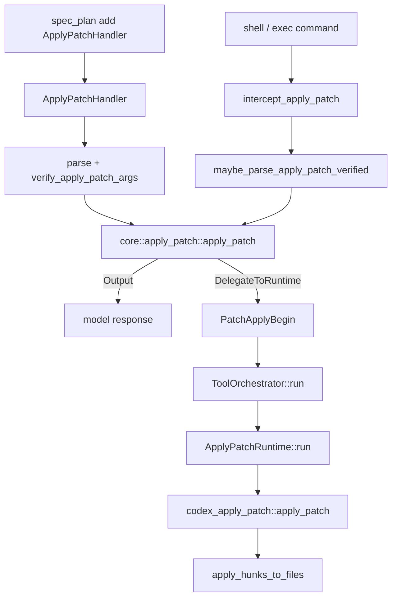

> `apply_patch` 有 direct custom tool path 和 shell/exec interception path：两者都会验证 patch、计算 patch safety，然后在需要真实文件系统写入时委托 `ApplyPatchRuntime` 和 `codex_apply_patch::apply_patch`。[E: codex-rs/core/src/tools/handlers/apply_patch.rs:329][E: codex-rs/core/src/tools/handlers/apply_patch.rs:359][E: codex-rs/core/src/tools/handlers/apply_patch.rs:546][E: codex-rs/core/src/apply_patch.rs:34][E: codex-rs/core/src/tools/runtimes/apply_patch.rs:240]

## 能回答的问题

- apply_patch 在当前工具系统中如何注册？
- direct `apply_patch` tool 与 shell/exec interception 的分叉点在哪里？
- `assess_patch_safety` 如何决定 auto approve、ask user 或 reject？
- `ApplyPatchRuntime` 怎样接入 orchestrator、approval 和 sandbox？
- 最终写文件的函数在哪里？

## 端到端步骤

1. `spec_plan.rs` 只在有 environment 且 model info 指定 apply_patch tool type 时注册 `ApplyPatchHandler`。[E: codex-rs/core/src/tools/spec_plan.rs:765][E: codex-rs/core/src/tools/spec_plan.rs:768]
2. `ApplyPatchHandler` 的 tool name 是 plain `apply_patch`，spec 来自 `create_apply_patch_freeform_tool(self.multi_environment)`；handler 只接受 `ToolPayload::Custom`。[E: codex-rs/core/src/tools/handlers/apply_patch.rs:330][E: codex-rs/core/src/tools/handlers/apply_patch.rs:334][E: codex-rs/core/src/tools/handlers/apply_patch.rs:359]
3. direct handler 先 `parse_patch(&patch_input)`，再选择 environment id，取 environment filesystem，并用 `verify_apply_patch_args` 结合 cwd 和 sandbox context 验证 patch。[E: codex-rs/core/src/tools/handlers/apply_patch.rs:364][E: codex-rs/core/src/tools/handlers/apply_patch.rs:372][E: codex-rs/core/src/tools/handlers/apply_patch.rs:385][E: codex-rs/core/src/tools/handlers/apply_patch.rs:390]
4. streaming patch update events 由 `ApplyPatchArgumentDiffConsumer` 产生，且受 `Feature::ApplyPatchStreamingEvents` gate 控制。[E: codex-rs/core/src/tools/handlers/apply_patch.rs:72][E: codex-rs/core/src/tools/handlers/apply_patch.rs:85][E: codex-rs/core/src/tools/handlers/apply_patch.rs:88][E: codex-rs/core/src/tools/handlers/apply_patch.rs:93]
5. shell flow 在 `run_exec_like` 中调用 `intercept_apply_patch`；unified exec `exec_command` path 在 native cwd 可用时也调用同一个 interception function。[E: codex-rs/core/src/tools/handlers/shell.rs:141][E: codex-rs/core/src/tools/handlers/shell.rs:142][E: codex-rs/core/src/tools/handlers/unified_exec/exec_command.rs:314][E: codex-rs/core/src/tools/handlers/unified_exec/exec_command.rs:315]
6. `intercept_apply_patch` 调 `maybe_parse_apply_patch_verified(command, cwd, fs, Some(&sandbox))`；只有 `MaybeApplyPatchVerified::Body` 才继续 patch path，否则 shell/exec 普通路径继续。[E: codex-rs/core/src/tools/handlers/apply_patch.rs:546][E: codex-rs/core/src/tools/handlers/apply_patch.rs:558][E: codex-rs/core/src/tools/handlers/apply_patch.rs:561]
7. core `apply_patch::apply_patch` 调 `assess_patch_safety`；AutoApprove 和 AskUser 都返回 `DelegateToRuntime`，Reject 返回 model-facing rejection。[E: codex-rs/core/src/apply_patch.rs:34][E: codex-rs/core/src/apply_patch.rs:39][E: codex-rs/core/src/apply_patch.rs:47][E: codex-rs/core/src/apply_patch.rs:58][E: codex-rs/core/src/apply_patch.rs:71]
8. AutoApprove runtime invocation 使用 `ExecApprovalRequirement::Skip`，AskUser 使用 `ExecApprovalRequirement::NeedsApproval`；`auto_approved` 记录是否不是用户显式批准。[E: codex-rs/core/src/apply_patch.rs:50][E: codex-rs/core/src/apply_patch.rs:52][E: codex-rs/core/src/apply_patch.rs:53][E: codex-rs/core/src/apply_patch.rs:62][E: codex-rs/core/src/apply_patch.rs:65]
9. Delegate path 把 patch action 转成 protocol `FileChange`，创建 `ToolEmitter::apply_patch_for_environment`，发送 begin event，构造 `ApplyPatchRequest`，再交给 `ToolOrchestrator::run`。[E: codex-rs/core/src/tools/handlers/apply_patch.rs:409][E: codex-rs/core/src/tools/handlers/apply_patch.rs:417][E: codex-rs/core/src/tools/handlers/apply_patch.rs:418][E: codex-rs/core/src/tools/handlers/apply_patch.rs:429][E: codex-rs/core/src/tools/handlers/apply_patch.rs:431][E: codex-rs/core/src/tools/handlers/apply_patch.rs:443][E: codex-rs/core/src/tools/handlers/apply_patch.rs:451]
10. `ApplyPatchRequest` 保存 turn environment、action、file paths、protocol changes、approval requirement、additional permissions 和 preapproval flag。[E: codex-rs/core/src/tools/runtimes/apply_patch.rs:48][E: codex-rs/core/src/tools/runtimes/apply_patch.rs:49][E: codex-rs/core/src/tools/runtimes/apply_patch.rs:50][E: codex-rs/core/src/tools/runtimes/apply_patch.rs:51][E: codex-rs/core/src/tools/runtimes/apply_patch.rs:52][E: codex-rs/core/src/tools/runtimes/apply_patch.rs:53][E: codex-rs/core/src/tools/runtimes/apply_patch.rs:54]
11. `ApplyPatchRuntime` approval key 是 environment id + changed file path；它向 orchestrator 暴露 request 自带的 exec approval requirement。[E: codex-rs/core/src/tools/runtimes/apply_patch.rs:41][E: codex-rs/core/src/tools/runtimes/apply_patch.rs:133][E: codex-rs/core/src/tools/runtimes/apply_patch.rs:217][E: codex-rs/core/src/tools/runtimes/apply_patch.rs:221]
12. runtime 按 sandbox attempt 构造 filesystem sandbox context，调用 `codex_apply_patch::apply_patch(&req.action.patch, &cwd, stdout, stderr, fs, sandbox)`，再把 stdout/stderr、exit code 和 committed delta 封装成 runtime output。[E: codex-rs/core/src/tools/runtimes/apply_patch.rs:96][E: codex-rs/core/src/tools/runtimes/apply_patch.rs:248][E: codex-rs/core/src/tools/runtimes/apply_patch.rs:251][E: codex-rs/core/src/tools/runtimes/apply_patch.rs:260][E: codex-rs/core/src/tools/runtimes/apply_patch.rs:269]
13. apply-patch crate 导出 parser、verification entrypoints 和 standalone main；`CODEX_CORE_APPLY_PATCH_ARG1` 是 Codex binary 自调用 internal apply_patch path 的 argv1 contract。[E: codex-rs/apply-patch/src/lib.rs:23][E: codex-rs/apply-patch/src/lib.rs:28][E: codex-rs/apply-patch/src/lib.rs:30][E: codex-rs/apply-patch/src/lib.rs:41]
14. `codex_apply_patch::apply_patch` parse patch，失败时写 stderr，成功时调用 `apply_hunks`；`apply_hunks_to_files` 对 Add/Delete/Update hunks 写入、删除或修改文件。[E: codex-rs/apply-patch/src/lib.rs:276][E: codex-rs/apply-patch/src/lib.rs:284][E: codex-rs/apply-patch/src/lib.rs:289][E: codex-rs/apply-patch/src/lib.rs:311][E: codex-rs/apply-patch/src/lib.rs:361][E: codex-rs/apply-patch/src/lib.rs:395][E: codex-rs/apply-patch/src/lib.rs:417]
15. `ToolEmitter` 把 apply_patch success/failure 转为 patch apply events 和 model-facing formatted output； rejected user path 会规范化成 `patch rejected by user`。[E: codex-rs/core/src/tools/events.rs:363][E: codex-rs/core/src/tools/events.rs:416][E: codex-rs/core/src/tools/events.rs:421]

## 关键决策点

- direct apply_patch 当前是 Freeform/Custom payload path；旧 JSON Function tool 说法不能作为当前 direct handler 描述。[E: codex-rs/core/src/tools/handlers/apply_patch.rs:334][E: codex-rs/core/src/tools/handlers/apply_patch.rs:359]
- shell/exec interception 的价值是复用 patch safety、approval、sandbox 和 patch events，而不是让模型用 shell 直接绕过 patch policy。[E: codex-rs/core/src/tools/handlers/shell.rs:141][E: codex-rs/core/src/apply_patch.rs:39][I]
- 真正写文件的底层实现位于 `codex-rs/apply-patch/src/lib.rs`；core handler/runtime 负责协议、权限、事件和环境封装。[E: codex-rs/apply-patch/src/lib.rs:361][E: codex-rs/core/src/tools/handlers/apply_patch.rs:417][E: codex-rs/core/src/tools/runtimes/apply_patch.rs:251][I]

## 深挖入口

- `spine.shell-exec-flow` 说明 shell/exec interception 的上游位置。
- `tool.apply-patch` 应完整列出 grammar、tool spec 和 handler fields。
- `ref.protocol-event-lifecycle` 应覆盖 PatchApplyBegin/Updated/End 和 approval events。

## Sources

- codex-rs/core/src/tools/spec_plan.rs
- codex-rs/core/src/tools/handlers/apply_patch.rs
- codex-rs/core/src/tools/handlers/shell.rs
- codex-rs/core/src/tools/handlers/unified_exec/exec_command.rs
- codex-rs/core/src/apply_patch.rs
- codex-rs/core/src/tools/runtimes/apply_patch.rs
- codex-rs/core/src/tools/orchestrator.rs
- codex-rs/core/src/tools/events.rs
- codex-rs/apply-patch/src/lib.rs

## 相关

- [工具调用解剖](tool-call-anatomy.md)
- [shell exec flow](shell-exec-flow.md)
- [apply_patch 工具](../surface/tools/apply-patch.md)
- 索引 id：`ref.protocol-event-lifecycle`
