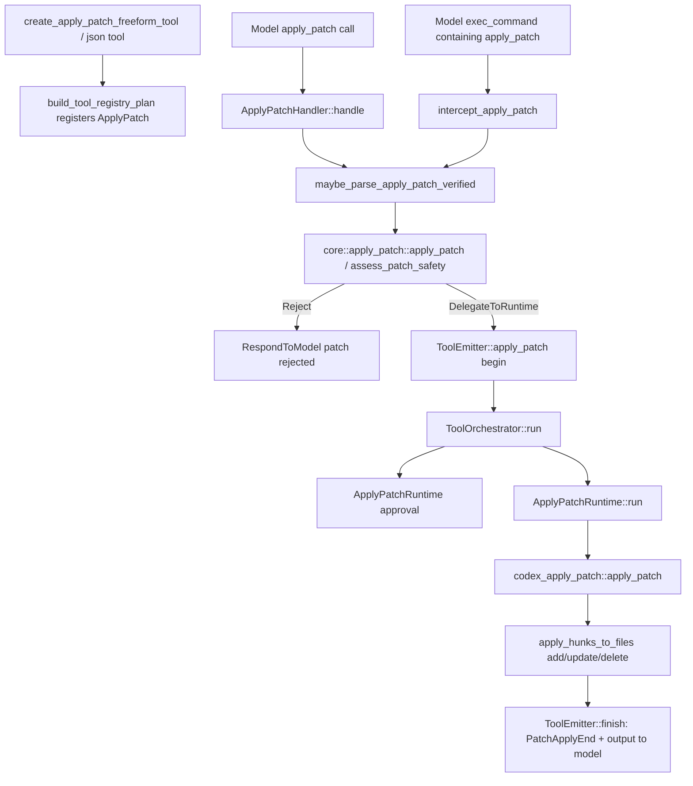

> `apply_patch` 的真实路径有两条：模型直接调用 `apply_patch` tool 时走 `ApplyPatchHandler`，模型把 patch 塞进 shell/exec 命令时会先经过 `intercept_apply_patch`；只有解析为 apply_patch body 时才会重路由到 apply_patch handling。[I]

## 能回答的问题

- apply_patch Freeform tool 和 JSON Function tool 分别如何暴露？
- 直接 tool call 怎样解析、审批、发 patch events、写 filesystem？
- shell/exec path 中 apply_patch 为什么会被拦截？
- `assess_patch_safety` 的输出如何决定 auto approve、ask user 或 reject？
- patch 最后怎样写入 add/update/delete 文件？

该 flowchart 是后续编号步骤的视觉索引；具体控制流事实以编号步骤中的源码证据为准。[I]

## 端到端步骤

1. Freeform apply_patch tool 由 `create_apply_patch_freeform_tool` 暴露，spec 名称是 `"apply_patch"`，格式是 Lark grammar。[E: codex-rs/tools/src/apply_patch_tool.rs:89][E: codex-rs/tools/src/apply_patch_tool.rs:91][E: codex-rs/tools/src/apply_patch_tool.rs:94][E: codex-rs/tools/src/apply_patch_tool.rs:96]
2. JSON apply_patch tool 由 `create_apply_patch_json_tool` 暴露，spec 名称同样是 `"apply_patch"`，参数 schema 只有必填 `"input"` 字段，description 使用 `APPLY_PATCH_JSON_TOOL_DESCRIPTION`。[E: codex-rs/tools/src/apply_patch_tool.rs:102][E: codex-rs/tools/src/apply_patch_tool.rs:104][E: codex-rs/tools/src/apply_patch_tool.rs:111][E: codex-rs/tools/src/apply_patch_tool.rs:112][E: codex-rs/tools/src/apply_patch_tool.rs:117][E: codex-rs/tools/src/apply_patch_tool.rs:118]
3. `build_tool_registry_plan` 只在 `config.has_environment` 且 `config.apply_patch_tool_type` 存在时加入 apply_patch spec，并注册 handler 名 `"apply_patch"` 到 `ToolHandlerKind::ApplyPatch`。[E: codex-rs/tools/src/tool_registry_plan.rs:312][E: codex-rs/tools/src/tool_registry_plan.rs:313][E: codex-rs/tools/src/tool_registry_plan.rs:318][E: codex-rs/tools/src/tool_registry_plan.rs:325][E: codex-rs/tools/src/tool_registry_plan.rs:331]
4. `ApplyPatchHandler` 的 `matches_kind` 接受 `ToolPayload::Function` 和 `ToolPayload::Custom`，`is_mutating` 固定返回 true，并提供 argument diff consumer 用于 streaming patch update events。[E: codex-rs/core/src/tools/handlers/apply_patch.rs:301][E: codex-rs/core/src/tools/handlers/apply_patch.rs:304][E: codex-rs/core/src/tools/handlers/apply_patch.rs:309][E: codex-rs/core/src/tools/handlers/apply_patch.rs:313]
5. streaming argument diff consumer 只有在 `Feature::ApplyPatchStreamingEvents` 开启时才解析 diff 并返回 `EventMsg::PatchApplyUpdated`。[E: codex-rs/core/src/tools/handlers/apply_patch.rs:65][E: codex-rs/core/src/tools/handlers/apply_patch.rs:72][E: codex-rs/core/src/tools/handlers/apply_patch.rs:76][E: codex-rs/core/src/tools/handlers/apply_patch.rs:77][E: codex-rs/core/src/tools/handlers/apply_patch.rs:90]
6. `ApplyPatchHandler::handle` 从 Function arguments 解析 `ApplyPatchToolArgs.input`，或从 Custom payload 直接取 input；其他 payload 会返回 unsupported。[E: codex-rs/core/src/tools/handlers/apply_patch.rs:337][E: codex-rs/core/src/tools/handlers/apply_patch.rs:348][E: codex-rs/core/src/tools/handlers/apply_patch.rs:350][E: codex-rs/core/src/tools/handlers/apply_patch.rs:353][E: codex-rs/core/src/tools/handlers/apply_patch.rs:355]
7. handler 取当前 `turn.cwd` 和 environment filesystem，然后调用 `codex_apply_patch::maybe_parse_apply_patch_verified` 这个 verification entry point 处理 patch body。[E: codex-rs/core/src/tools/handlers/apply_patch.rs:363][E: codex-rs/core/src/tools/handlers/apply_patch.rs:365][E: codex-rs/core/src/tools/handlers/apply_patch.rs:370][E: codex-rs/core/src/tools/handlers/apply_patch.rs:374][E: codex-rs/apply-patch/src/lib.rs:27]
8. 验证成功后，handler 在 `MaybeApplyPatchVerified::Body` 分支计算 patch 涉及的绝对路径和 effective additional permissions；路径包括 update move_path 的目标路径。[E: codex-rs/core/src/tools/handlers/apply_patch.rs:190][E: codex-rs/core/src/tools/handlers/apply_patch.rs:194][E: codex-rs/core/src/tools/handlers/apply_patch.rs:199][E: codex-rs/core/src/tools/handlers/apply_patch.rs:201][E: codex-rs/core/src/tools/handlers/apply_patch.rs:261][E: codex-rs/core/src/tools/handlers/apply_patch.rs:270][E: codex-rs/core/src/tools/handlers/apply_patch.rs:279][E: codex-rs/core/src/tools/handlers/apply_patch.rs:283][E: codex-rs/core/src/tools/handlers/apply_patch.rs:284][E: codex-rs/core/src/tools/handlers/apply_patch.rs:382][E: codex-rs/core/src/tools/handlers/apply_patch.rs:383]
9. `core::apply_patch::apply_patch` 调用 `assess_patch_safety`；`AutoApprove` 和 `AskUser` 都返回 `DelegateToRuntime`，`Reject` 返回 `Output(Err(RespondToModel(...)))`。[E: codex-rs/core/src/apply_patch.rs:33][E: codex-rs/core/src/apply_patch.rs:38][E: codex-rs/core/src/apply_patch.rs:49][E: codex-rs/core/src/apply_patch.rs:61][E: codex-rs/core/src/apply_patch.rs:70][E: codex-rs/core/src/apply_patch.rs:71]
10. AutoApprove 分支的 runtime invocation 设置 `auto_approved: !user_explicitly_approved`，并用 `ExecApprovalRequirement::Skip`；AskUser 分支设置 `ExecApprovalRequirement::NeedsApproval`。[E: codex-rs/core/src/apply_patch.rs:49][E: codex-rs/core/src/apply_patch.rs:51][E: codex-rs/core/src/apply_patch.rs:52][E: codex-rs/core/src/apply_patch.rs:61][E: codex-rs/core/src/apply_patch.rs:64]
11. Delegate path 将 action 转成 protocol `FileChange`，创建 `ToolEmitter::apply_patch(changes, auto_approved)`，发送 begin event，并构造 `ApplyPatchRequest`。[E: codex-rs/core/src/tools/handlers/apply_patch.rs:392][E: codex-rs/core/src/tools/handlers/apply_patch.rs:393][E: codex-rs/core/src/tools/handlers/apply_patch.rs:395][E: codex-rs/core/src/tools/handlers/apply_patch.rs:402][E: codex-rs/core/src/tools/handlers/apply_patch.rs:404]
12. `ApplyPatchRequest` 保存 action、file_paths、changes、exec approval requirement、additional permissions 和 permissions_preapproved。[E: codex-rs/core/src/tools/runtimes/apply_patch.rs:43][E: codex-rs/core/src/tools/runtimes/apply_patch.rs:44][E: codex-rs/core/src/tools/runtimes/apply_patch.rs:45][E: codex-rs/core/src/tools/runtimes/apply_patch.rs:46][E: codex-rs/core/src/tools/runtimes/apply_patch.rs:47][E: codex-rs/core/src/tools/runtimes/apply_patch.rs:48][E: codex-rs/core/src/tools/runtimes/apply_patch.rs:49]
13. `ApplyPatchRuntime::start_approval_async` 可在 permissions preapproved 且不是 retry 时直接 approve；否则走 guardian、retry `request_patch_approval` 或 cached approval 包裹的 `request_patch_approval`。[E: codex-rs/core/src/tools/runtimes/apply_patch.rs:142][E: codex-rs/core/src/tools/runtimes/apply_patch.rs:143][E: codex-rs/core/src/tools/runtimes/apply_patch.rs:145][E: codex-rs/core/src/tools/runtimes/apply_patch.rs:147][E: codex-rs/core/src/tools/runtimes/apply_patch.rs:150][E: codex-rs/core/src/tools/runtimes/apply_patch.rs:152][E: codex-rs/core/src/tools/runtimes/apply_patch.rs:163][E: codex-rs/core/src/tools/runtimes/apply_patch.rs:169][E: codex-rs/core/src/tools/runtimes/apply_patch.rs:176]
14. `Session::request_patch_approval` 把 approval callback 插入 active turn state，然后发送 `EventMsg::ApplyPatchApprovalRequest`，事件包含 call_id、turn_id、changes、reason 和 grant_root。[E: codex-rs/core/src/session/mod.rs:1814][E: codex-rs/core/src/session/mod.rs:1823][E: codex-rs/core/src/session/mod.rs:1830][E: codex-rs/core/src/session/mod.rs:1839][E: codex-rs/core/src/session/mod.rs:1840][E: codex-rs/core/src/session/mod.rs:1841][E: codex-rs/core/src/session/mod.rs:1842][E: codex-rs/core/src/session/mod.rs:1843][E: codex-rs/core/src/session/mod.rs:1844][E: codex-rs/core/src/session/mod.rs:1846]
15. `ApplyPatchRuntime::run` 取 environment filesystem，按 sandbox attempt 生成 filesystem sandbox context，然后调用 `codex_apply_patch::apply_patch(&req.action.patch, &req.action.cwd, ...)`。[E: codex-rs/core/src/tools/runtimes/apply_patch.rs:220][E: codex-rs/core/src/tools/runtimes/apply_patch.rs:224][E: codex-rs/core/src/tools/runtimes/apply_patch.rs:225][E: codex-rs/core/src/tools/runtimes/apply_patch.rs:228][E: codex-rs/core/src/tools/runtimes/apply_patch.rs:229][E: codex-rs/core/src/tools/runtimes/apply_patch.rs:230]
16. runtime 将 stdout/stderr 转成 `ExecCommandOutputDelta`，根据 result 生成 exit_code，并在 sandbox denied heuristic 命中时返回 sandbox denied error。[E: codex-rs/core/src/tools/runtimes/apply_patch.rs:101][E: codex-rs/core/src/tools/runtimes/apply_patch.rs:103][E: codex-rs/core/src/tools/runtimes/apply_patch.rs:104][E: codex-rs/core/src/tools/runtimes/apply_patch.rs:237][E: codex-rs/core/src/tools/runtimes/apply_patch.rs:239][E: codex-rs/core/src/tools/runtimes/apply_patch.rs:240][E: codex-rs/core/src/tools/runtimes/apply_patch.rs:241][E: codex-rs/core/src/tools/runtimes/apply_patch.rs:250]
17. `codex_apply_patch::apply_patch` 先 `parse_patch`，失败时向 stderr 写 Invalid patch 信息，成功后调用 `apply_hunks`。[E: codex-rs/apply-patch/src/lib.rs:183][E: codex-rs/apply-patch/src/lib.rs:191][E: codex-rs/apply-patch/src/lib.rs:196][E: codex-rs/apply-patch/src/lib.rs:213]
18. `apply_hunks_to_files` 对 `Hunk::AddFile` 写新文件，对 `Hunk::DeleteFile` 删除文件，对 `Hunk::UpdateFile` 派生 new_contents 并写回或 move 后删除原文件。[E: codex-rs/apply-patch/src/lib.rs:260][E: codex-rs/apply-patch/src/lib.rs:277][E: codex-rs/apply-patch/src/lib.rs:278][E: codex-rs/apply-patch/src/lib.rs:287][E: codex-rs/apply-patch/src/lib.rs:296][E: codex-rs/apply-patch/src/lib.rs:310][E: codex-rs/apply-patch/src/lib.rs:313][E: codex-rs/apply-patch/src/lib.rs:317][E: codex-rs/apply-patch/src/lib.rs:332][E: codex-rs/apply-patch/src/lib.rs:348]
19. apply-patch library 成功后 `print_summary` 输出 `Success. Updated the following files:`，并用 `A/M/D` 标记 added/modified/deleted 路径。[E: codex-rs/apply-patch/src/lib.rs:596][E: codex-rs/apply-patch/src/lib.rs:600][E: codex-rs/apply-patch/src/lib.rs:602][E: codex-rs/apply-patch/src/lib.rs:605][E: codex-rs/apply-patch/src/lib.rs:608]
20. shell/exec path 中的 `intercept_apply_patch` 先调用同一个 `maybe_parse_apply_patch_verified`；只有 `MaybeApplyPatchVerified::Body` 才记录 model warning 并进入 `core::apply_patch::apply_patch`，`ShellParseError` 和 `NotApplyPatch` 会返回 `Ok(None)` 让普通 shell flow 继续。[E: codex-rs/core/src/tools/handlers/shell.rs:481][E: codex-rs/core/src/tools/handlers/apply_patch.rs:465][E: codex-rs/core/src/tools/handlers/apply_patch.rs:480][E: codex-rs/core/src/tools/handlers/apply_patch.rs:483][E: codex-rs/core/src/tools/handlers/apply_patch.rs:485][E: codex-rs/core/src/tools/handlers/apply_patch.rs:487][E: codex-rs/core/src/tools/handlers/apply_patch.rs:494][E: codex-rs/core/src/tools/handlers/apply_patch.rs:557][E: codex-rs/core/src/tools/handlers/apply_patch.rs:561]
21. Delegate path 中 `ToolOrchestrator::run` 返回后调用 `emitter.finish(...)`；`ToolEmitter` 的 apply-patch success/failure stage 会发送 `PatchApplyEnd`，并用 formatted exec output 生成 model-facing content。[E: codex-rs/core/src/tools/handlers/apply_patch.rs:423][E: codex-rs/core/src/tools/handlers/apply_patch.rs:439][E: codex-rs/core/src/tools/events.rs:197][E: codex-rs/core/src/tools/events.rs:302][E: codex-rs/core/src/tools/events.rs:309][E: codex-rs/core/src/tools/events.rs:312][E: codex-rs/core/src/tools/events.rs:315][E: codex-rs/core/src/tools/events.rs:505]

## 关键设计点

- apply_patch 的 spec 有 Freeform 和 Function 两种暴露形式，但 runtime handler 名都是 `"apply_patch"`；“dispatch 不依赖具体 schema 形式”是对注册路径的推断。[E: codex-rs/tools/src/apply_patch_tool.rs:91][E: codex-rs/tools/src/apply_patch_tool.rs:111][E: codex-rs/tools/src/tool_registry_plan.rs:331][I]
- shell interception 是安全与 UX guard 的源码推断：当 command 被解析为 apply_patch body 时，它复用 patch safety/approval 逻辑，并把“通过 exec 调 patch”的行为写进模型 warning。[E: codex-rs/core/src/tools/handlers/shell.rs:481][E: codex-rs/core/src/tools/handlers/apply_patch.rs:483][E: codex-rs/core/src/tools/handlers/apply_patch.rs:487][E: codex-rs/core/src/tools/handlers/apply_patch.rs:494][I]
- patch approval 的 key 是受影响文件路径，而不是整条命令字符串；`ApplyPatchRuntime::approval_keys` 返回 `req.file_paths.clone()`。[E: codex-rs/core/src/tools/runtimes/apply_patch.rs:126]
- 真正写 filesystem 的函数在 `codex-rs/apply-patch/src/lib.rs`；core 的 handler/runtime/events/orchestrator 分别负责协议转换、审批编排、sandbox context、events 和模型响应封装。[E: codex-rs/apply-patch/src/lib.rs:278][E: codex-rs/apply-patch/src/lib.rs:296][E: codex-rs/apply-patch/src/lib.rs:317][E: codex-rs/core/src/tools/handlers/apply_patch.rs:392][E: codex-rs/core/src/tools/runtimes/apply_patch.rs:129][E: codex-rs/core/src/tools/runtimes/apply_patch.rs:225][E: codex-rs/core/src/tools/events.rs:188][E: codex-rs/core/src/tools/events.rs:505][I]

## 深挖入口

- `spine.shell-exec-flow` 解释 `intercept_apply_patch` 在 shell flow 中的位置。
- `tool.apply-patch` 应完整记录 apply_patch grammar、JSON schema、output formatting。
- `ref.protocol-event-lifecycle` 应覆盖 `PatchApplyBegin`、`PatchApplyUpdated`、`PatchApplyEnd` 和 approval request。

## Sources

- codex-rs/tools/src/apply_patch_tool.rs
- codex-rs/tools/src/tool_registry_plan.rs
- codex-rs/core/src/tools/handlers/apply_patch.rs
- codex-rs/core/src/apply_patch.rs
- codex-rs/core/src/tools/runtimes/apply_patch.rs
- codex-rs/core/src/session/mod.rs
- codex-rs/core/src/tools/handlers/shell.rs
- codex-rs/core/src/tools/events.rs
- codex-rs/apply-patch/src/lib.rs

## 相关

- [工具调用解剖](tool-call-anatomy.md)
- [shell exec flow](shell-exec-flow.md)
- [apply_patch 工具](../surface/tools/apply-patch.md)
- 索引 id：`ref.protocol-event-lifecycle`
